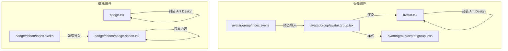
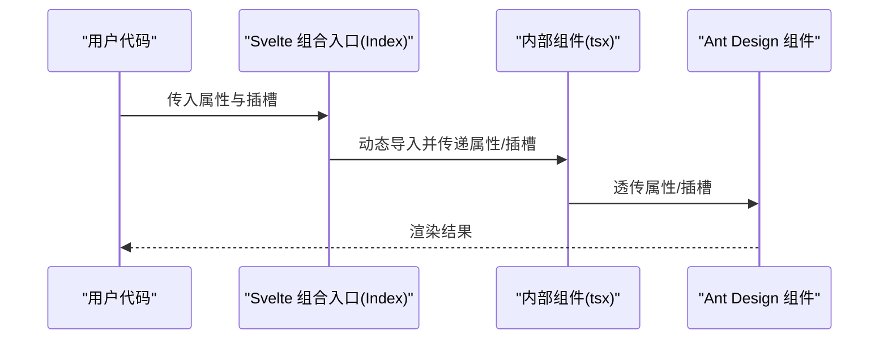
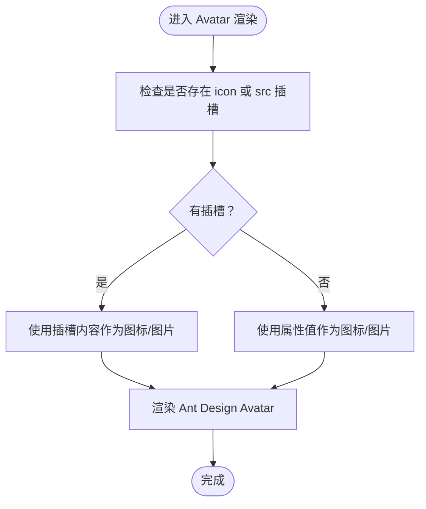
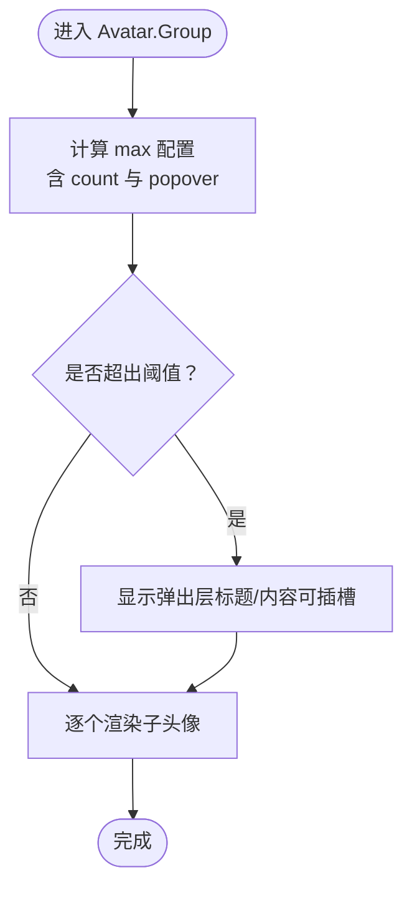
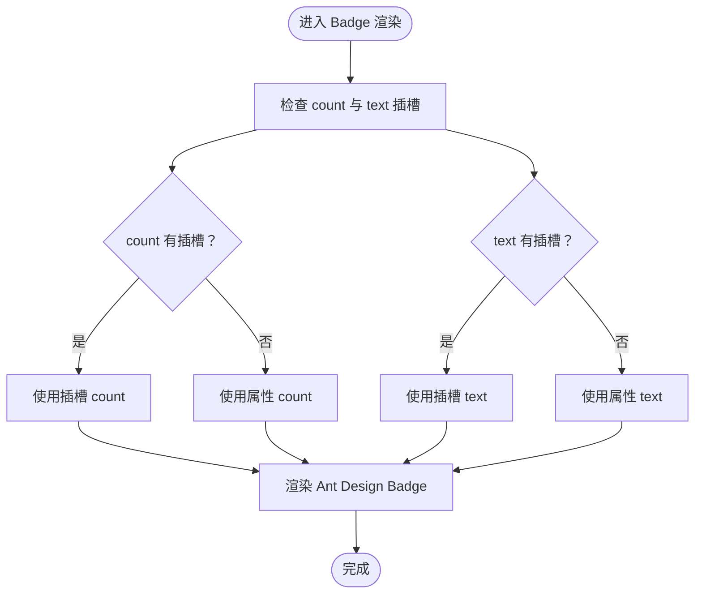
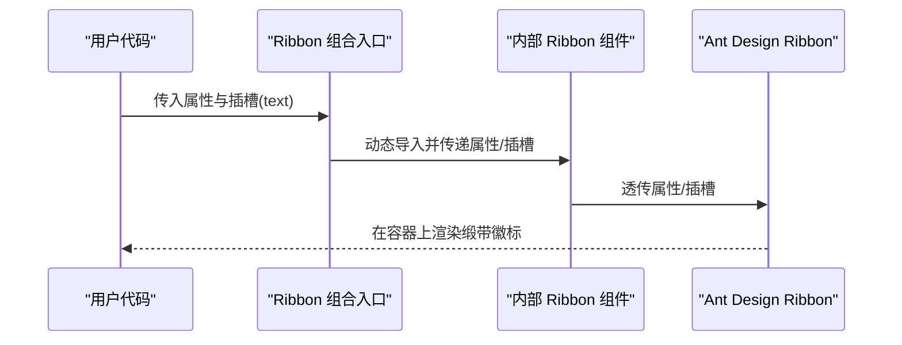
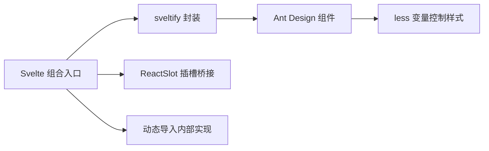

# 头像与徽标组件

<cite>
**本文引用的文件**
- [avatar.tsx](file://frontend/antd/avatar/avatar.tsx)
- [avatar 组合入口 Index.svelte](file://frontend/antd/avatar/group/Index.svelte)
- [avatar.group.tsx](file://frontend/antd/avatar/group/avatar.group.tsx)
- [avatar.group.less](file://frontend/antd/avatar/group/avatar.group.less)
- [badge.tsx](file://frontend/antd/badge/badge.tsx)
- [badge 组合入口 Index.svelte](file://frontend/antd/badge/ribbon/Index.svelte)
- [ribbon.badge.tsx](file://frontend/antd/badge/ribbon/badge.ribbon.tsx)
- [avatar 文档 README.md](file://docs/components/antd/avatar/README.md)
- [badge 文档 README.md](file://docs/components/antd/badge/README.md)
</cite>

## 目录

1. [简介](#简介)
2. [项目结构](#项目结构)
3. [核心组件](#核心组件)
4. [架构总览](#架构总览)
5. [详细组件分析](#详细组件分析)
6. [依赖关系分析](#依赖关系分析)
7. [性能考量](#性能考量)
8. [故障排查指南](#故障排查指南)
9. [结论](#结论)
10. [附录](#附录)

## 简介

本文件聚焦于头像（Avatar）与徽标数（Badge）两大组件族，系统梳理其尺寸控制、形状设置、头像组（Avatar.Group）的堆叠与遮罩、徽标数的计数显示与红点标记、徽标组（Badge.Ribbon）的缎带效果等能力，并给出占位符处理、阈值设置、自定义样式方案以及响应式与多布局适配建议。文档以仓库中实际实现为依据，配合可视化图示帮助读者快速理解与正确使用。

## 项目结构

- 头像组件位于 frontend/antd/avatar 下，包含单个头像与头像组两个子模块；头像组通过组合入口 Svelte 文件动态导入内部实现。
- 徽标组件位于 frontend/antd/badge 下，包含基础徽标与缎带徽标（Ribbon）两个子模块；缎带徽标同样通过组合入口 Svelte 文件动态导入内部实现。
- 文档示例位于 docs/components/antd/avatar 与 docs/components/antd/badge，分别提供基础与组合用法的演示入口。

**图表来源**

- [avatar.tsx:1-28](file://frontend/antd/avatar/avatar.tsx#L1-L28)
- [avatar 组合入口 Index.svelte:1-62](file://frontend/antd/avatar/group/Index.svelte#L1-L62)
- [avatar.group.tsx:1-52](file://frontend/antd/avatar/group/avatar.group.tsx#L1-L52)
- [avatar.group.less:1-12](file://frontend/antd/avatar/group/avatar.group.less#L1-L12)
- [badge.tsx:1-21](file://frontend/antd/badge/badge.tsx#L1-L21)
- [badge 组合入口 Index.svelte:1-62](file://frontend/antd/badge/ribbon/Index.svelte#L1-L62)
- [ribbon.badge.tsx:1-22](file://frontend/antd/badge/ribbon/badge.ribbon.tsx#L1-L22)

**章节来源**

- [avatar 文档 README.md:1-9](file://docs/components/antd/avatar/README.md#L1-L9)
- [badge 文档 README.md:1-9](file://docs/components/antd/badge/README.md#L1-L9)

## 核心组件

- 头像（Avatar）
  - 支持图标、图片与字符展示，具备尺寸与形状配置能力；通过插槽机制支持 icon 与 src 的动态传入。
  - 提供占位符处理：当未提供图标或图片时，可由子节点作为后备内容。
- 头像组（Avatar.Group）
  - 实现头像堆叠与遮罩效果，支持最大数量阈值与弹出层提示；通过 less 变量控制重叠间距。
  - 支持对“超出数量”的弹出层标题与内容进行插槽化定制。
- 徽标数（Badge）
  - 支持数字计数与文本标记；count 与 text 均可通过插槽注入自定义内容。
  - 支持红点标记与阈值上限（超过阈值显示 n+）。
- 缎带徽标（Badge.Ribbon）
  - 在目标元素上叠加“缎带”式徽标，支持文本插槽；通常用于强调状态或标识。

**章节来源**

- [avatar.tsx:1-28](file://frontend/antd/avatar/avatar.tsx#L1-L28)
- [avatar.group.tsx:1-52](file://frontend/antd/avatar/group/avatar.group.tsx#L1-L52)
- [avatar.group.less:1-12](file://frontend/antd/avatar/group/avatar.group.less#L1-L12)
- [badge.tsx:1-21](file://frontend/antd/badge/badge.tsx#L1-L21)
- [ribbon.badge.tsx:1-22](file://frontend/antd/badge/ribbon/badge.ribbon.tsx#L1-L22)

## 架构总览

下图展示了从 Svelte 入口到具体 Ant Design 组件的调用链路，以及插槽与属性透传的关键路径。

**图表来源**

- [avatar 组合入口 Index.svelte:48-61](file://frontend/antd/avatar/group/Index.svelte#L48-L61)
- [avatar.group.tsx:12-49](file://frontend/antd/avatar/group/avatar.group.tsx#L12-L49)
- [badge 组合入口 Index.svelte:48-61](file://frontend/antd/badge/ribbon/Index.svelte#L48-L61)
- [ribbon.badge.tsx:6-18](file://frontend/antd/badge/ribbon/badge.ribbon.tsx#L6-L18)

## 详细组件分析

### 头像（Avatar）

- 封装方式
  - 使用 sveltify 将 Ant Design 的 Avatar 包装为 Svelte 组件，同时保留 icon 与 src 的插槽能力。
  - 当存在插槽时优先使用插槽内容，否则回退到属性值；无插槽时子节点作为默认内容。
- 占位符处理
  - 通过隐藏容器与条件渲染，确保在未提供图标或图片时仍能渲染子节点作为占位内容。
- 形状与尺寸
  - 通过 Ant Design 原生属性控制形状（如圆形/方形）与尺寸（如小/中/大），具体参数遵循 Antd 规范。

**图表来源**

- [avatar.tsx:6-25](file://frontend/antd/avatar/avatar.tsx#L6-L25)

**章节来源**

- [avatar.tsx:1-28](file://frontend/antd/avatar/avatar.tsx#L1-L28)

### 头像组（Avatar.Group）

- 堆叠与遮罩
  - 内部使用 Ant Design 的 Group 能力实现头像堆叠；通过 less 变量控制相邻头像的起始边距，形成视觉上的遮挡与层级。
- 阈值与弹出层
  - 支持设置 max.count 作为阈值；当超出阈值时，会显示“还有 n 个”等提示。
  - 弹出层的标题与内容可通过插槽覆盖，若未提供插槽则回退到属性配置。
- 子项渲染
  - 通过 useTargets 与 ReactSlot 将子项映射为 ReactSlot，保证每个子头像按序渲染。

**图表来源**

- [avatar.group.tsx:12-49](file://frontend/antd/avatar/group/avatar.group.tsx#L12-L49)
- [avatar.group.less:1-12](file://frontend/antd/avatar/group/avatar.group.less#L1-L12)

**章节来源**

- [avatar 组合入口 Index.svelte:1-62](file://frontend/antd/avatar/group/Index.svelte#L1-L62)
- [avatar.group.tsx:1-52](file://frontend/antd/avatar/group/avatar.group.tsx#L1-L52)
- [avatar.group.less:1-12](file://frontend/antd/avatar/group/avatar.group.less#L1-L12)

### 徽标数（Badge）

- 计数与文本
  - count 与 text 均支持插槽注入，便于在徽标内放置复杂内容（如图标、自定义文案）。
- 红点标记
  - 通过 Ant Design 原生能力实现红点标记；当 count 为 0 且不显示数字时呈现纯红点。
- 阈值设置
  - 支持设置最大值，超过阈值时显示 n+；该能力由底层 Antd 组件提供，组件层直接透传属性。

**图表来源**

- [badge.tsx:6-17](file://frontend/antd/badge/badge.tsx#L6-L17)

**章节来源**

- [badge.tsx:1-21](file://frontend/antd/badge/badge.tsx#L1-L21)

### 缎带徽标（Badge.Ribbon）

- 特殊效果
  - Ribbon 在父容器上绘制“缎带”式徽标，常用于强调状态或标注新功能；文本内容可通过插槽自定义。
- 使用场景
  - 适合在卡片、按钮、列表项等容器上添加醒目标识，注意避免与已有装饰冲突。

**图表来源**

- [badge 组合入口 Index.svelte:48-61](file://frontend/antd/badge/ribbon/Index.svelte#L48-L61)
- [ribbon.badge.tsx:6-18](file://frontend/antd/badge/ribbon/badge.ribbon.tsx#L6-L18)

**章节来源**

- [badge 组合入口 Index.svelte:1-62](file://frontend/antd/badge/ribbon/Index.svelte#L1-L62)
- [ribbon.badge.tsx:1-22](file://frontend/antd/badge/ribbon/badge.ribbon.tsx#L1-L22)

## 依赖关系分析

- 组件封装
  - 所有组件均通过 sveltify 将 Ant Design 对应组件桥接为 Svelte 组件，保持属性与事件的透传一致性。
- 插槽机制
  - 通过 ReactSlot 将 Svelte 插槽转换为 React Slot，确保与 Antd 组件的插槽约定兼容。
- 动态导入
  - 组合入口使用 importComponent 与 import 动态导入内部实现，减少首屏体积并提升按需加载效率。
- 样式耦合
  - 头像组通过 less 变量控制重叠间距，避免硬编码，便于主题统一管理。

**图表来源**

- [avatar.tsx:1-28](file://frontend/antd/avatar/avatar.tsx#L1-L28)
- [avatar.group.tsx:1-52](file://frontend/antd/avatar/group/avatar.group.tsx#L1-L52)
- [badge.tsx:1-21](file://frontend/antd/badge/badge.tsx#L1-L21)
- [ribbon.badge.tsx:1-22](file://frontend/antd/badge/ribbon/badge.ribbon.tsx#L1-L22)

**章节来源**

- [avatar 组合入口 Index.svelte:1-62](file://frontend/antd/avatar/group/Index.svelte#L1-L62)
- [avatar.group.tsx:1-52](file://frontend/antd/avatar/group/avatar.group.tsx#L1-L52)
- [badge 组合入口 Index.svelte:1-62](file://frontend/antd/badge/ribbon/Index.svelte#L1-L62)
- [ribbon.badge.tsx:1-22](file://frontend/antd/badge/ribbon/badge.ribbon.tsx#L1-L22)

## 性能考量

- 按需加载
  - 组合入口采用动态导入策略，仅在需要时加载内部实现，降低初始包体与首屏渲染压力。
- 插槽渲染
  - 插槽内容延迟到渲染阶段再注入，避免不必要的预处理开销。
- 样式变量
  - 通过 less 变量集中管理重叠间距等样式细节，减少重复计算与样式抖动。

[本节为通用性能建议，无需特定文件引用]

## 故障排查指南

- 头像未显示图标或图片
  - 检查是否正确传入 icon 或 src 属性；若使用插槽，请确认插槽名称与类型匹配。
  - 若未提供图标/图片，组件会回退到子节点作为占位内容，确认子节点是否可见。
- 头像组阈值无效或弹出层不显示
  - 确认 max.count 是否为数值型；当 count 为数值时，内部会自动加一以补偿自身占用。
  - 弹出层标题与内容可通过插槽覆盖，若未提供插槽，将回退到属性配置。
- 徽标数阈值不生效
  - 确认传入的阈值属性是否被正确透传至底层组件；Antd 默认支持 n+ 显示逻辑。
- 缎带徽标位置异常
  - 确认 Ribbon 的父容器具备定位上下文；必要时手动设置容器相对定位以确保叠加效果稳定。

**章节来源**

- [avatar.tsx:6-25](file://frontend/antd/avatar/avatar.tsx#L6-L25)
- [avatar.group.tsx:18-40](file://frontend/antd/avatar/group/avatar.group.tsx#L18-L40)
- [badge.tsx:6-17](file://frontend/antd/badge/badge.tsx#L6-L17)
- [ribbon.badge.tsx:6-18](file://frontend/antd/badge/ribbon/badge.ribbon.tsx#L6-L18)

## 结论

本组件体系以 Ant Design 为核心，通过 Svelte 封装与插槽桥接，提供了灵活的头像与徽标能力。头像组的堆叠遮罩、徽标数的计数与阈值、以及缎带徽标的强调效果均可在不破坏语义的前提下进行高度定制。建议在实际项目中结合主题变量与布局规范，统一管理尺寸、间距与颜色，以获得一致的用户体验。

[本节为总结性内容，无需特定文件引用]

## 附录

- 示例入口
  - 头像组件示例入口参见文档目录下的 demo 标签。
  - 徽标组件示例入口参见文档目录下的 demo 标签。
- 相关文档
  - 头像组件文档概览：[avatar 文档 README.md:1-9](file://docs/components/antd/avatar/README.md#L1-L9)
  - 徽标组件文档概览：[badge 文档 README.md:1-9](file://docs/components/antd/badge/README.md#L1-L9)

**章节来源**

- [avatar 文档 README.md:1-9](file://docs/components/antd/avatar/README.md#L1-L9)
- [badge 文档 README.md:1-9](file://docs/components/antd/badge/README.md#L1-L9)
