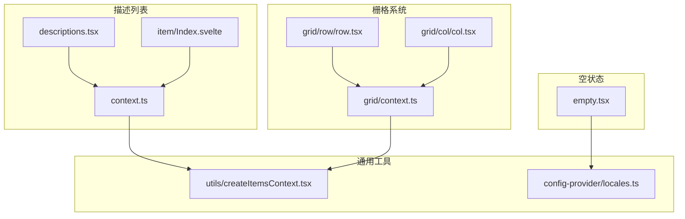
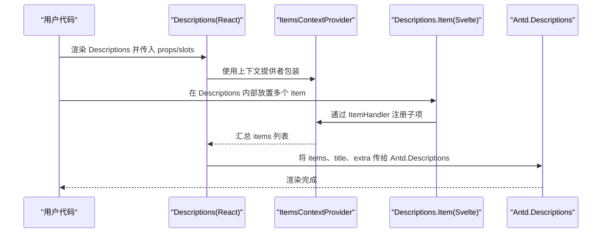
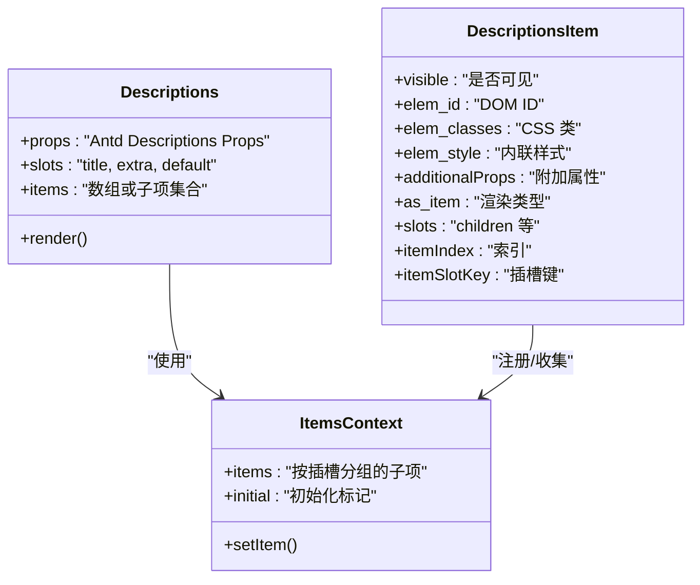
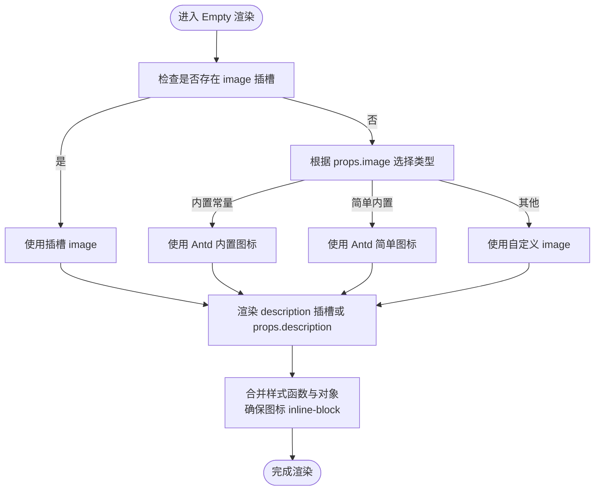
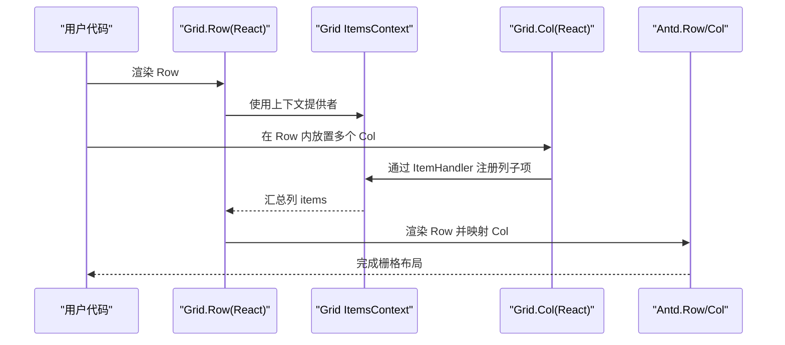
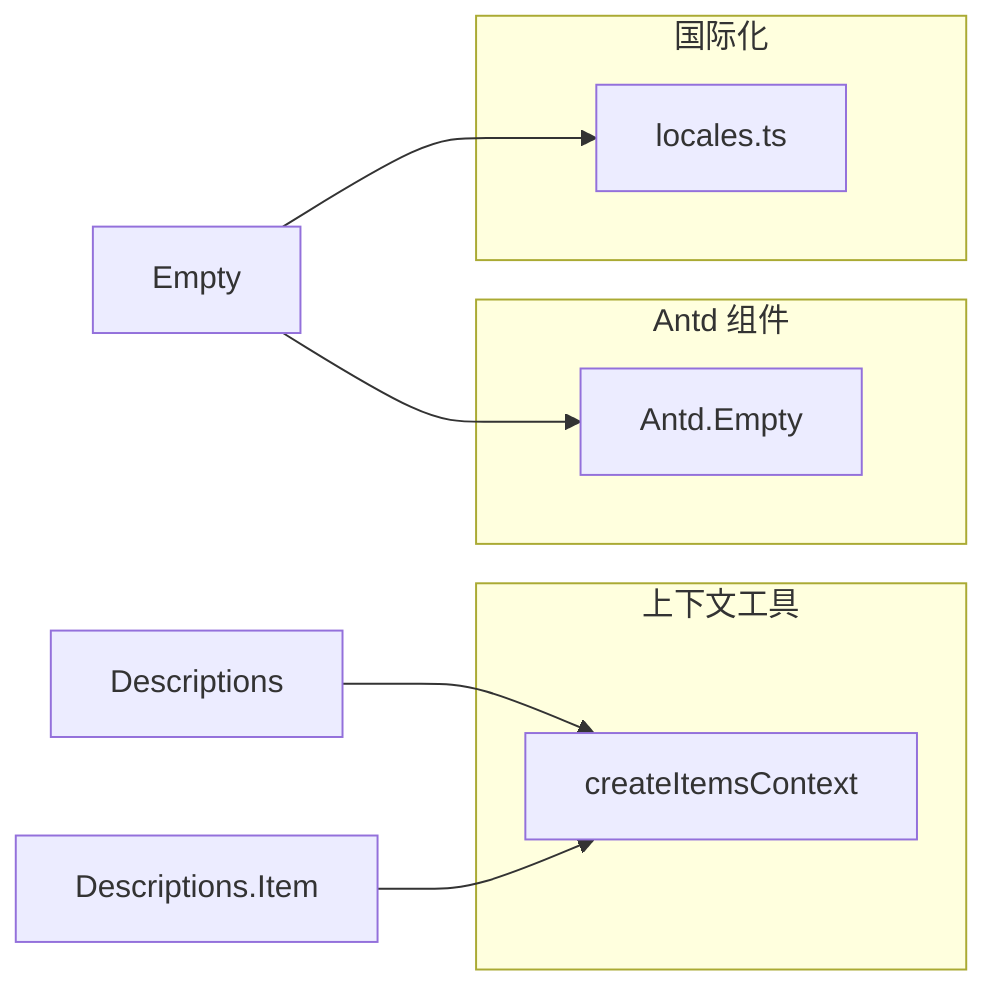

# 描述列表与空状态组件

<cite>
**本文引用的文件**
- [frontend/antd/descriptions/descriptions.tsx](file://frontend/antd/descriptions/descriptions.tsx)
- [frontend/antd/descriptions/item/Index.svelte](file://frontend/antd/descriptions/item/Index.svelte)
- [frontend/antd/descriptions/context.ts](file://frontend/antd/descriptions/context.ts)
- [frontend/antd/empty/empty.tsx](file://frontend/antd/empty/empty.tsx)
- [frontend/antd/grid/row/row.tsx](file://frontend/antd/grid/row/row.tsx)
- [frontend/antd/grid/col/col.tsx](file://frontend/antd/grid/col/col.tsx)
- [frontend/antd/grid/context.ts](file://frontend/antd/grid/context.ts)
- [frontend/utils/createItemsContext.tsx](file://frontend/utils/createItemsContext.tsx)
- [frontend/antd/config-provider/locales.ts](file://frontend/antd/config-provider/locales.ts)
- [docs/components/antd/descriptions/README.md](file://docs/components/antd/descriptions/README.md)
</cite>

## 目录

1. [引言](#引言)
2. [项目结构](#项目结构)
3. [核心组件](#核心组件)
4. [架构总览](#架构总览)
5. [详细组件分析](#详细组件分析)
6. [依赖关系分析](#依赖关系分析)
7. [性能考量](#性能考量)
8. [故障排查指南](#故障排查指南)
9. [结论](#结论)
10. [附录](#附录)

## 引言

本文件聚焦于两个常用 UI 组件：描述列表（Descriptions）与空状态（Empty）。我们将从系统架构、组件关系、数据流与处理逻辑、集成点与错误处理、性能特征等方面进行深入解析，并结合仓库中的实现细节，给出可操作的使用建议与最佳实践。同时覆盖以下主题：

- 描述列表的键值对展示、响应式布局、标签对齐方式与描述项的自定义配置
- 空状态的默认图标、自定义图标、辅助文字与操作按钮的组合使用
- 描述列表在表单详情页的应用场景、标签的多语言支持与空状态的国际化处理
- 描述列表的栅格化布局与空状态在数据加载失败时的用户体验优化

## 项目结构

本项目采用分层与按组件组织的前端结构，描述列表与空状态分别位于 antd 前端组件目录下，并通过通用工具与上下文机制实现灵活的插槽与子项管理。

图表来源

- [frontend/antd/descriptions/descriptions.tsx:1-41](file://frontend/antd/descriptions/descriptions.tsx#L1-L41)
- [frontend/antd/descriptions/item/Index.svelte:1-83](file://frontend/antd/descriptions/item/Index.svelte#L1-L83)
- [frontend/antd/descriptions/context.ts:1-7](file://frontend/antd/descriptions/context.ts#L1-L7)
- [frontend/antd/empty/empty.tsx:1-52](file://frontend/antd/empty/empty.tsx#L1-L52)
- [frontend/antd/grid/row/row.tsx:1-34](file://frontend/antd/grid/row/row.tsx#L1-L34)
- [frontend/antd/grid/col/col.tsx:1-14](file://frontend/antd/grid/col/col.tsx#L1-L14)
- [frontend/antd/grid/context.ts:1-7](file://frontend/antd/grid/context.ts#L1-L7)
- [frontend/utils/createItemsContext.tsx:1-274](file://frontend/utils/createItemsContext.tsx#L1-L274)
- [frontend/antd/config-provider/locales.ts:1-863](file://frontend/antd/config-provider/locales.ts#L1-L863)

章节来源

- [docs/components/antd/descriptions/README.md:1-9](file://docs/components/antd/descriptions/README.md#L1-L9)

## 核心组件

- 描述列表（Descriptions）
  - 负责将一组键值对以只读形式分组展示，支持标题、额外区域与插槽化的内容注入。
  - 通过上下文与子项处理器收集内部的描述项，最终渲染为 Ant Design 的 Descriptions 组件。
- 描述项（Descriptions.Item）
  - 作为描述列表的子项，负责接收可见性、样式、ID、类名等属性，并将子内容以插槽形式传递给底层组件。
- 空状态（Empty）
  - 提供默认、简单或自定义图标的空状态占位，支持自定义描述文本与样式函数，便于在数据为空或加载失败时提升体验。
- 栅格系统（Grid.Row/Col）
  - 通过上下文机制将列子项收集并映射到 Ant Design 的 Row/Col，实现描述列表的栅格化布局。

章节来源

- [frontend/antd/descriptions/descriptions.tsx:1-41](file://frontend/antd/descriptions/descriptions.tsx#L1-L41)
- [frontend/antd/descriptions/item/Index.svelte:1-83](file://frontend/antd/descriptions/item/Index.svelte#L1-L83)
- [frontend/antd/empty/empty.tsx:1-52](file://frontend/antd/empty/empty.tsx#L1-L52)
- [frontend/antd/grid/row/row.tsx:1-34](file://frontend/antd/grid/row/row.tsx#L1-L34)
- [frontend/antd/grid/col/col.tsx:1-14](file://frontend/antd/grid/col/col.tsx#L1-L14)

## 架构总览

描述列表与空状态均基于统一的“插槽与子项上下文”机制工作：

- 上下文提供者负责收集来自子项的结构化信息（props、slots、元素等），并在渲染阶段将其转换为 Ant Design 所需的数据结构。
- 插槽（slots）允许用户以 ReactSlot 或 Svelte Slot 的形式注入自定义内容，如标题、额外区域、描述项内容等。
- 空状态组件在渲染时根据传入的 image 类型或插槽选择合适的图标，并将样式函数与内联样式合并。

图表来源

- [frontend/antd/descriptions/descriptions.tsx:10-38](file://frontend/antd/descriptions/descriptions.tsx#L10-L38)
- [frontend/antd/descriptions/context.ts:1-7](file://frontend/antd/descriptions/context.ts#L1-L7)
- [frontend/antd/descriptions/item/Index.svelte:56-76](file://frontend/antd/descriptions/item/Index.svelte#L56-L76)
- [frontend/utils/createItemsContext.tsx:171-184](file://frontend/utils/createItemsContext.tsx#L171-L184)

## 详细组件分析

### 描述列表（Descriptions）

- 键值对展示
  - 通过上下文收集子项，最终生成 Ant Design Descriptions 所需的 items 数组；支持直接传入 items 或由子项自动聚合。
- 响应式布局
  - 可配合栅格系统（Grid.Row/Col）实现响应式布局；在 Row 中将列子项映射为 Antd Col，从而实现断点下的自适应排列。
- 标签对齐方式
  - 该组件本身不直接控制标签对齐，但可通过传入的 props 交由 Antd Descriptions 处理；在 Svelte 层面保持透传。
- 描述项（Item）的自定义配置
  - 支持 visible 控制显示、elem_id/elem_classes/elem_style 设置 DOM 属性与样式、additionalProps 附加属性、as_item 自定义渲染类型等。
- 插槽与标题/额外区域
  - 支持 title 与 extra 插槽，用于注入自定义标题与额外操作区；若未提供则回退到 props。

图表来源

- [frontend/antd/descriptions/descriptions.tsx:10-38](file://frontend/antd/descriptions/descriptions.tsx#L10-L38)
- [frontend/antd/descriptions/item/Index.svelte:18-76](file://frontend/antd/descriptions/item/Index.svelte#L18-L76)
- [frontend/antd/descriptions/context.ts:1-7](file://frontend/antd/descriptions/context.ts#L1-L7)
- [frontend/utils/createItemsContext.tsx:40-95](file://frontend/utils/createItemsContext.tsx#L40-L95)

章节来源

- [frontend/antd/descriptions/descriptions.tsx:1-41](file://frontend/antd/descriptions/descriptions.tsx#L1-L41)
- [frontend/antd/descriptions/item/Index.svelte:1-83](file://frontend/antd/descriptions/item/Index.svelte#L1-L83)
- [frontend/antd/descriptions/context.ts:1-7](file://frontend/antd/descriptions/context.ts#L1-L7)
- [frontend/utils/createItemsContext.tsx:1-274](file://frontend/utils/createItemsContext.tsx#L1-L274)

### 空状态（Empty）

- 默认图标与自定义图标
  - 支持三种内置图标类型，也支持传入自定义 image；当存在 image 插槽时优先使用插槽内容。
- 辅助文字
  - description 插槽优先级高于 props.description，便于动态渲染本地化文案或复杂内容。
- 样式与布局
  - 支持传入样式函数或对象，内部会将 image 样式设置为 inline-block，确保图标与文字的排版一致。
- 操作按钮组合
  - 可通过 description 插槽组合按钮等交互元素，实现“空状态 + 操作”的完整闭环。

图表来源

- [frontend/antd/empty/empty.tsx:9-49](file://frontend/antd/empty/empty.tsx#L9-L49)

章节来源

- [frontend/antd/empty/empty.tsx:1-52](file://frontend/antd/empty/empty.tsx#L1-L52)

### 栅格化布局（Grid.Row/Col）

- Row 将收集到的列子项映射为 Antd Col，并在 Row 中渲染，实现响应式栅格布局。
- Col 通过 ItemHandler 接收列的 props 与插槽，再转交给 Antd Col。
- 与描述列表结合时，可在 Row/Col 内部嵌套描述项，形成“栅格化的描述列表”。

图表来源

- [frontend/antd/grid/row/row.tsx:7-31](file://frontend/antd/grid/row/row.tsx#L7-L31)
- [frontend/antd/grid/col/col.tsx:7-11](file://frontend/antd/grid/col/col.tsx#L7-L11)
- [frontend/antd/grid/context.ts:1-7](file://frontend/antd/grid/context.ts#L1-L7)
- [frontend/utils/createItemsContext.tsx:171-184](file://frontend/utils/createItemsContext.tsx#L171-L184)

章节来源

- [frontend/antd/grid/row/row.tsx:1-34](file://frontend/antd/grid/row/row.tsx#L1-L34)
- [frontend/antd/grid/col/col.tsx:1-14](file://frontend/antd/grid/col/col.tsx#L1-L14)
- [frontend/antd/grid/context.ts:1-7](file://frontend/antd/grid/context.ts#L1-L7)

## 依赖关系分析

- 描述列表依赖
  - 使用 createItemsContext 提供的上下文能力，将 Svelte 插槽与 React 组件桥接，实现 items 的收集与渲染。
  - 通过 withItemsContextProvider 包装组件，确保子项注册与更新。
- 空状态依赖
  - 依赖 Ant Design 的 Empty 组件与内置图标常量；通过样式函数与对象合并，保证图标与文字的排版一致性。
- 国际化依赖
  - 通过 config-provider 的 locales 提供多语言环境，支持 Antd 与 dayjs 的本地化切换。

图表来源

- [frontend/antd/descriptions/descriptions.tsx:1-10](file://frontend/antd/descriptions/descriptions.tsx#L1-L10)
- [frontend/antd/descriptions/item/Index.svelte:1-15](file://frontend/antd/descriptions/item/Index.svelte#L1-L15)
- [frontend/antd/empty/empty.tsx:1-9](file://frontend/antd/empty/empty.tsx#L1-L9)
- [frontend/antd/config-provider/locales.ts:1-10](file://frontend/antd/config-provider/locales.ts#L1-L10)

章节来源

- [frontend/antd/descriptions/descriptions.tsx:1-41](file://frontend/antd/descriptions/descriptions.tsx#L1-L41)
- [frontend/antd/empty/empty.tsx:1-52](file://frontend/antd/empty/empty.tsx#L1-L52)
- [frontend/antd/config-provider/locales.ts:1-863](file://frontend/antd/config-provider/locales.ts#L1-L863)

## 性能考量

- 子项收集与渲染
  - 描述列表与栅格系统均通过上下文收集子项，避免不必要的重渲染；在 items 更新时仅触发对应组件的重新计算。
- 插槽与样式
  - 插槽内容延迟渲染，仅在可见时挂载；样式函数与对象合并发生在渲染阶段，建议尽量复用样式对象以减少开销。
- 图标与描述
  - 空状态的图标选择与样式合并逻辑简单，性能开销较低；建议在大量空状态场景中统一使用内置图标以减少资源加载。

## 故障排查指南

- 描述列表无内容显示
  - 检查是否正确使用 withItemsContextProvider 包裹 Descriptions，并在内部放置 Descriptions.Item。
  - 确认子项已通过 ItemHandler 注册，且 items 非空。
- 描述项不生效
  - 检查 visible、elem_id、elem_classes、elem_style、additionalProps 等属性是否正确传入。
  - 确认插槽 children 是否被正确绑定与渲染。
- 空状态图标不显示
  - 若传入 image 插槽，请确认插槽内容有效；否则检查 props.image 是否为内置常量或合法的自定义值。
  - 确认样式函数返回的对象包含正确的 image 样式。
- 栅格布局异常
  - 检查 Grid.Row/Col 的子项是否正确注册；确认列的 props 与插槽传递无误。

章节来源

- [frontend/antd/descriptions/descriptions.tsx:10-38](file://frontend/antd/descriptions/descriptions.tsx#L10-L38)
- [frontend/antd/descriptions/item/Index.svelte:56-76](file://frontend/antd/descriptions/item/Index.svelte#L56-L76)
- [frontend/antd/empty/empty.tsx:9-49](file://frontend/antd/empty/empty.tsx#L9-L49)
- [frontend/antd/grid/row/row.tsx:7-31](file://frontend/antd/grid/row/row.tsx#L7-L31)
- [frontend/antd/grid/col/col.tsx:7-11](file://frontend/antd/grid/col/col.tsx#L7-L11)

## 结论

描述列表与空状态组件通过统一的上下文与插槽机制，实现了灵活的内容注入与渲染。描述列表支持键值对展示与栅格化布局，空状态提供默认与自定义图标的占位方案，并可与操作按钮组合优化用户体验。结合国际化工具，两者均可在多语言环境下稳定运行。建议在表单详情页中优先使用描述列表展示只读信息，在数据为空或加载失败时使用空状态组件提升可用性。

## 附录

- 应用场景建议
  - 表单详情页：使用描述列表展示只读字段，必要时配合栅格系统实现响应式布局。
  - 数据加载失败：使用空状态组件展示提示与重试按钮，提升用户信心。
- 多语言支持
  - 通过 config-provider 的 locales 切换 Antd 与 dayjs 的本地化，确保描述列表与空状态中的文案与格式符合目标语言。
- 最佳实践
  - 合理使用插槽与 props，避免在渲染函数中频繁创建新对象。
  - 对于大量空状态场景，优先使用内置图标以降低资源开销。
  - 在栅格化布局中，合理划分列宽与断点，确保在不同设备上的可读性。
