# 数据展示组件

<cite>
**本文引用的文件**
- [backend/modelscope_studio/components/antd/__init__.py](file://backend/modelscope_studio/components/antd/__init__.py)
- [backend/modelscope_studio/components/antd/components.py](file://backend/modelscope_studio/components/antd/components.py)
- [frontend/antd/package.json](file://frontend/antd/package.json)
- [frontend/antd/avatar/avatar.tsx](file://frontend/antd/avatar/avatar.tsx)
- [frontend/antd/badge/badge.tsx](file://frontend/antd/badge/badge.tsx)
- [frontend/antd/calendar/calendar.tsx](file://frontend/antd/calendar/calendar.tsx)
- [frontend/antd/card/card.tsx](file://frontend/antd/card/card.tsx)
- [frontend/antd/carousel/carousel.tsx](file://frontend/antd/carousel/carousel.tsx)
- [frontend/antd/collapse/collapse.tsx](file://frontend/antd/collapse/collapse.tsx)
- [frontend/antd/descriptions/descriptions.tsx](file://frontend/antd/descriptions/descriptions.tsx)
- [frontend/antd/empty/empty.tsx](file://frontend/antd/empty/empty.tsx)
- [frontend/antd/image/image.tsx](file://frontend/antd/image/image.tsx)
- [frontend/antd/list/list.tsx](file://frontend/antd/list/list.tsx)
- [frontend/antd/popover/popover.tsx](file://frontend/antd/popover/popover.tsx)
- [frontend/antd/qr_code/qr-code.tsx](file://frontend/antd/qr_code/qr-code.tsx)
- [frontend/antd/segmented/segmented.tsx](file://frontend/antd/segmented/segmented.tsx)
- [frontend/antd/statistic/statistic.tsx](file://frontend/antd/statistic/statistic.tsx)
- [frontend/antd/table/table.tsx](file://frontend/antd/table/table.tsx)
- [frontend/antd/tabs/tabs.tsx](file://frontend/antd/tabs/tabs.tsx)
- [frontend/antd/tag/tag.tsx](file://frontend/antd/tag/tag.tsx)
- [frontend/antd/timeline/timeline.tsx](file://frontend/antd/timeline/timeline.tsx)
- [frontend/antd/tooltip/tooltip.tsx](file://frontend/antd/tooltip/tooltip.tsx)
- [frontend/antd/tour/tour.tsx](file://frontend/antd/tour/tour.tsx)
- [frontend/antd/tree/tree.tsx](file://frontend/antd/tree/tree.tsx)
</cite>

## 目录

1. [简介](#简介)
2. [项目结构](#项目结构)
3. [核心组件](#核心组件)
4. [架构总览](#架构总览)
5. [详细组件分析](#详细组件分析)
6. [依赖分析](#依赖分析)
7. [性能考虑](#性能考虑)
8. [故障排查指南](#故障排查指南)
9. [结论](#结论)
10. [附录](#附录)

## 简介

本文件面向 Ant Design 数据展示类组件，系统梳理头像(Avatar)、徽标数(Badge)、日历(Calendar)、卡片(Card)、走马灯(Carousel)、折叠面板(Collapse)、描述列表(Descriptions)、空状态(Empty)、图片(Image)、列表(List)、气泡卡片(Popover)、二维码(QRCode)、分段控制器(Segmented)、统计数值(Statistic)、表格(Table)、标签页(Tabs)、标签(Tag)、时间轴(Timeline)、文字提示(Tooltip)、漫游式引导(Tour)、树形控件(Tree)等组件在本仓库中的实现与使用方式。重点说明：

- 数据渲染：如何通过 slots 与 items 将子节点映射为 Ant Design 组件的 children/items。
- 交互行为：事件回调（如 onChange/onSelect）与函数包装（useFunction）的统一处理。
- 动画效果：由 Ant Design 原生提供，组件层不做额外动画封装。
- 大数据量优化：建议采用虚拟滚动、分页、懒加载等策略，并结合组件的可扩展性进行二次封装。
- 主题定制与样式覆盖：通过 Ant Design 的主题变量与 CSS 变量体系实现。
- 响应式与移动端适配：遵循 Ant Design 的栅格与断点策略，结合 Svelte 组件的尺寸控制。

## 项目结构

该仓库采用“后端 Python 模块 + 前端 Svelte 包”的双层封装模式：

- 后端模块负责导出各组件类，便于在 Python 环境中统一引用。
- 前端 Svelte 包通过 sveltify 将 Ant Design React 组件桥接为 Svelte 组件，支持 slots 与 items 的声明式渲染。

```mermaid
graph TB
subgraph "后端"
PY_API["Python 导出模块<br/>__init__.py / components.py"]
end
subgraph "前端"
PKG["Svelte 包<br/>package.json"]
AVATAR["Avatar<br/>avatar.tsx"]
BADGE["Badge<br/>badge.tsx"]
CALENDAR["Calendar<br/>calendar.tsx"]
CARD["Card<br/>card.tsx"]
CAROUSEL["Carousel<br/>carousel.tsx"]
COLLAPSE["Collapse<br/>collapse.tsx"]
DESC["Descriptions<br/>descriptions.tsx"]
EMPTY["Empty<br/>empty.tsx"]
IMAGE["Image<br/>image.tsx"]
LIST["List<br/>list.tsx"]
POPOVER["Popover<br/>popover.tsx"]
QRCODE["QRCode<br/>qr-code.tsx"]
SEG["Segmented<br/>segmented.tsx"]
STAT["Statistic<br/>statistic.tsx"]
TABLE["Table<br/>table.tsx"]
TABS["Tabs<br/>tabs.tsx"]
TAG["Tag<br/>tag.tsx"]
TIME["Timeline<br/>timeline.tsx"]
TT["Tooltip<br/>tooltip.tsx"]
TOUR["Tour<br/>tour.tsx"]
TREE["Tree<br/>tree.tsx"]
end
PY_API --> AVATAR
PY_API --> BADGE
PY_API --> CALENDAR
PY_API --> CARD
PY_API --> CAROUSEL
PY_API --> COLLAPSE
PY_API --> DESC
PY_API --> EMPTY
PY_API --> IMAGE
PY_API --> LIST
PY_API --> POPOVER
PY_API --> QRCODE
PY_API --> SEG
PY_API --> STAT
PY_API --> TABLE
PY_API --> TABS
PY_API --> TAG
PY_API --> TIME
PY_API --> TT
PY_API --> TOUR
PY_API --> TREE
PKG --> AVATAR
PKG --> BADGE
PKG --> CALENDAR
PKG --> CARD
PKG --> CAROUSEL
PKG --> COLLAPSE
PKG --> DESC
PKG --> EMPTY
PKG --> IMAGE
PKG --> LIST
PKG --> POPOVER
PKG --> QRCODE
PKG --> SEG
PKG --> STAT
PKG --> TABLE
PKG --> TABS
PKG --> TAG
PKG --> TIME
PKG --> TT
PKG --> TOUR
PKG --> TREE
```

图示来源

- [backend/modelscope_studio/components/antd/**init**.py:1-150](file://backend/modelscope_studio/components/antd/__init__.py#L1-L150)
- [backend/modelscope_studio/components/antd/components.py:1-144](file://backend/modelscope_studio/components/antd/components.py#L1-L144)
- [frontend/antd/package.json:1-6](file://frontend/antd/package.json#L1-L6)

章节来源

- [backend/modelscope_studio/components/antd/**init**.py:1-150](file://backend/modelscope_studio/components/antd/__init__.py#L1-L150)
- [backend/modelscope_studio/components/antd/components.py:1-144](file://backend/modelscope_studio/components/antd/components.py#L1-L144)
- [frontend/antd/package.json:1-6](file://frontend/antd/package.json#L1-L6)

## 核心组件

本节概述各组件在前端的桥接方式与关键特性：

- 统一桥接：所有组件均通过 sveltify 将 Ant Design React 组件包裹为 Svelte 组件，支持 slots 与 items 的声明式渲染。
- 函数回调：使用 useFunction 对 onChange/onSelect 等回调进行包装，确保在 Svelte 上下文中正确执行。
- 日期与范围：对日期型 props 进行格式化与转换，保证与上层传入的时间戳一致。
- 子项渲染：通过 renderItems 与 useTargets 实现 items 与 children 的统一映射。

章节来源

- [frontend/antd/avatar/avatar.tsx:1-28](file://frontend/antd/avatar/avatar.tsx#L1-L28)
- [frontend/antd/badge/badge.tsx:1-21](file://frontend/antd/badge/badge.tsx#L1-L21)
- [frontend/antd/calendar/calendar.tsx:1-102](file://frontend/antd/calendar/calendar.tsx#L1-L102)
- [frontend/antd/card/card.tsx:1-150](file://frontend/antd/card/card.tsx#L1-L150)
- [frontend/antd/carousel/carousel.tsx:1-32](file://frontend/antd/carousel/carousel.tsx#L1-L32)
- [frontend/antd/collapse/collapse.tsx:1-53](file://frontend/antd/collapse/collapse.tsx#L1-L53)
- [frontend/antd/descriptions/descriptions.tsx:1-41](file://frontend/antd/descriptions/descriptions.tsx#L1-L41)
- [frontend/antd/empty/empty.tsx:1-52](file://frontend/antd/empty/empty.tsx#L1-L52)

## 架构总览

下图展示了从后端导出到前端组件桥接的整体流程，以及组件间共享的工具函数与上下文。

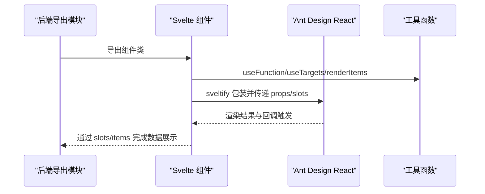

图示来源

- [backend/modelscope_studio/components/antd/**init**.py:1-150](file://backend/modelscope_studio/components/antd/__init__.py#L1-L150)
- [frontend/antd/avatar/avatar.tsx:1-28](file://frontend/antd/avatar/avatar.tsx#L1-L28)
- [frontend/antd/calendar/calendar.tsx:1-102](file://frontend/antd/calendar/calendar.tsx#L1-L102)
- [frontend/antd/card/card.tsx:1-150](file://frontend/antd/card/card.tsx#L1-L150)
- [frontend/antd/carousel/carousel.tsx:1-32](file://frontend/antd/carousel/carousel.tsx#L1-L32)
- [frontend/antd/collapse/collapse.tsx:1-53](file://frontend/antd/collapse/collapse.tsx#L1-L53)
- [frontend/antd/descriptions/descriptions.tsx:1-41](file://frontend/antd/descriptions/descriptions.tsx#L1-L41)
- [frontend/antd/empty/empty.tsx:1-52](file://frontend/antd/empty/empty.tsx#L1-L52)

## 详细组件分析

### 头像 Avatar

- 数据渲染：支持通过 slots 渲染 icon 与 src；若未提供，则回退到 children。
- 交互行为：无交互事件。
- 动画效果：由 Ant Design 提供，组件层不额外封装。

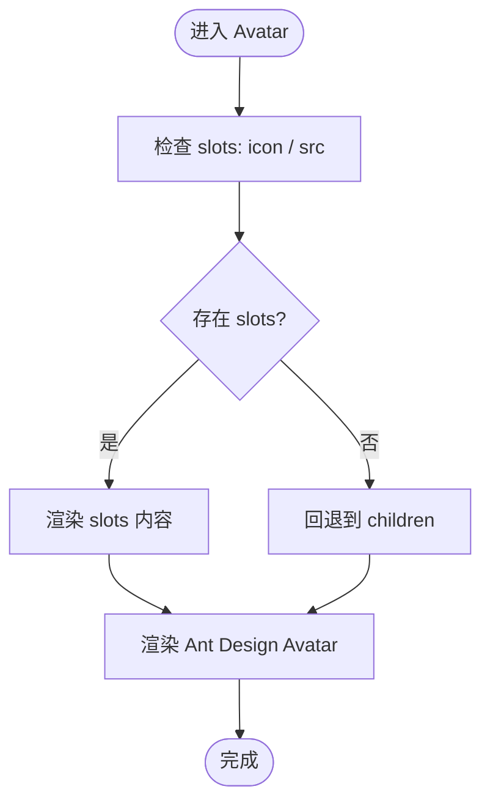

图示来源

- [frontend/antd/avatar/avatar.tsx:6-25](file://frontend/antd/avatar/avatar.tsx#L6-L25)

章节来源

- [frontend/antd/avatar/avatar.tsx:1-28](file://frontend/antd/avatar/avatar.tsx#L1-L28)

### 徽标数 Badge

- 数据渲染：count 与 text 支持通过 slots 自定义。
- 交互行为：无交互事件。
- 动画效果：由 Ant Design 提供。

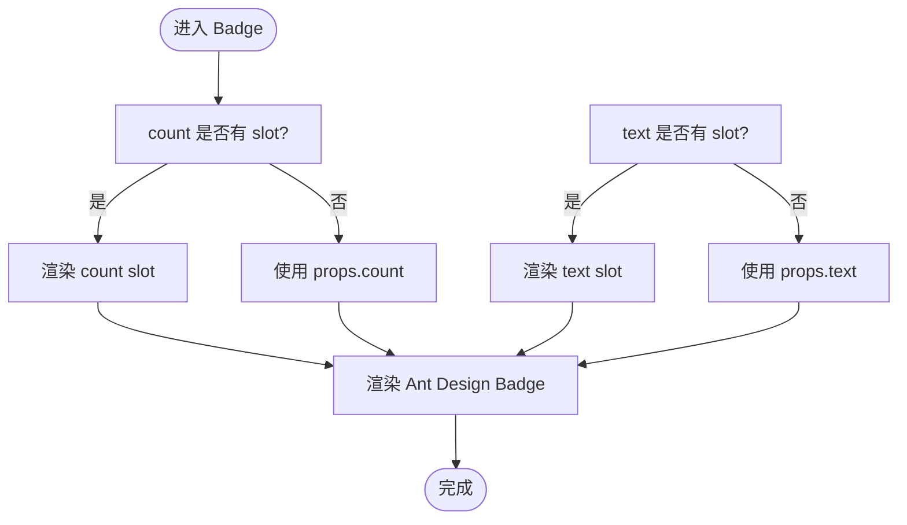

图示来源

- [frontend/antd/badge/badge.tsx:6-18](file://frontend/antd/badge/badge.tsx#L6-L18)

章节来源

- [frontend/antd/badge/badge.tsx:1-21](file://frontend/antd/badge/badge.tsx#L1-L21)

### 日历 Calendar

- 数据渲染：value/defaultValue/validRange 使用 dayjs 格式化；cellRender/fullCellRender/headerRender 支持 slots。
- 交互行为：onChange/onPanelChange/onSelect 回调统一通过 useFunction 包装；内部将日期转为秒级时间戳返回给上层。
- 动画效果：由 Ant Design 提供。

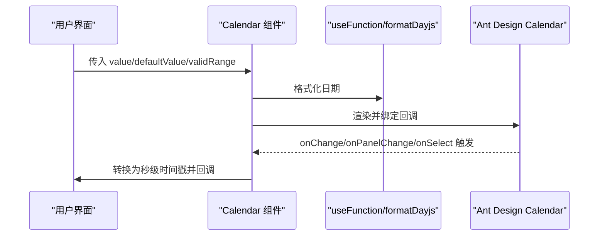

图示来源

- [frontend/antd/calendar/calendar.tsx:17-99](file://frontend/antd/calendar/calendar.tsx#L17-L99)

章节来源

- [frontend/antd/calendar/calendar.tsx:1-102](file://frontend/antd/calendar/calendar.tsx#L1-L102)

### 卡片 Card

- 数据渲染：title/extra/cover/tabBarExtraContent 支持 slots；actions 通过 useTargets 自动收集；tabList 通过 renderItems 渲染。
- 交互行为：无交互事件。
- 动画效果：由 Ant Design 提供。

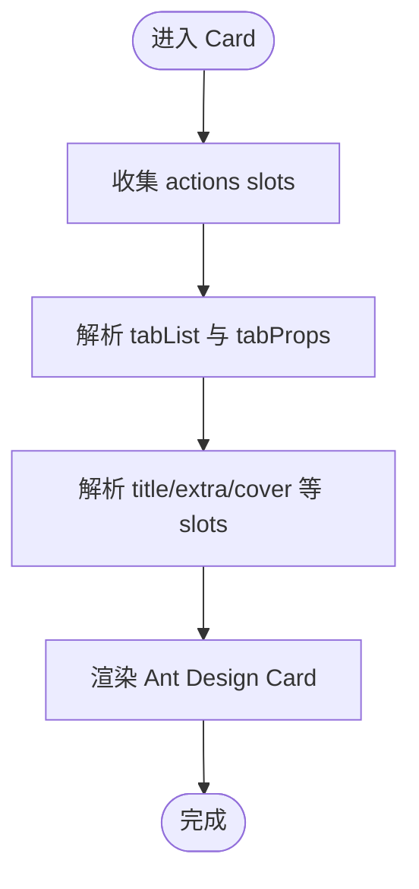

图示来源

- [frontend/antd/card/card.tsx:37-147](file://frontend/antd/card/card.tsx#L37-L147)

章节来源

- [frontend/antd/card/card.tsx:1-150](file://frontend/antd/card/card.tsx#L1-L150)

### 走马灯 Carousel

- 数据渲染：children 通过 useTargets 收集，再以 ReactSlot 克隆渲染。
- 交互行为：afterChange/beforeChange 通过 useFunction 包装。
- 动画效果：由 Ant Design 提供。

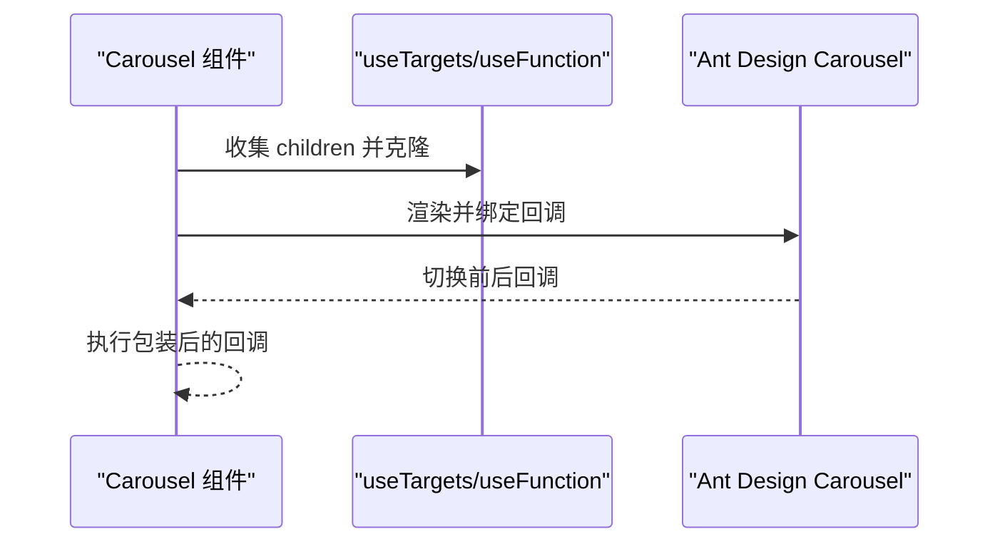

图示来源

- [frontend/antd/carousel/carousel.tsx:8-29](file://frontend/antd/carousel/carousel.tsx#L8-L29)

章节来源

- [frontend/antd/carousel/carousel.tsx:1-32](file://frontend/antd/carousel/carousel.tsx#L1-L32)

### 折叠面板 Collapse

- 数据渲染：items 通过 renderItems 渲染；expandIcon 支持 slot。
- 交互行为：onChange 通过 useFunction 包装。
- 动画效果：由 Ant Design 提供。

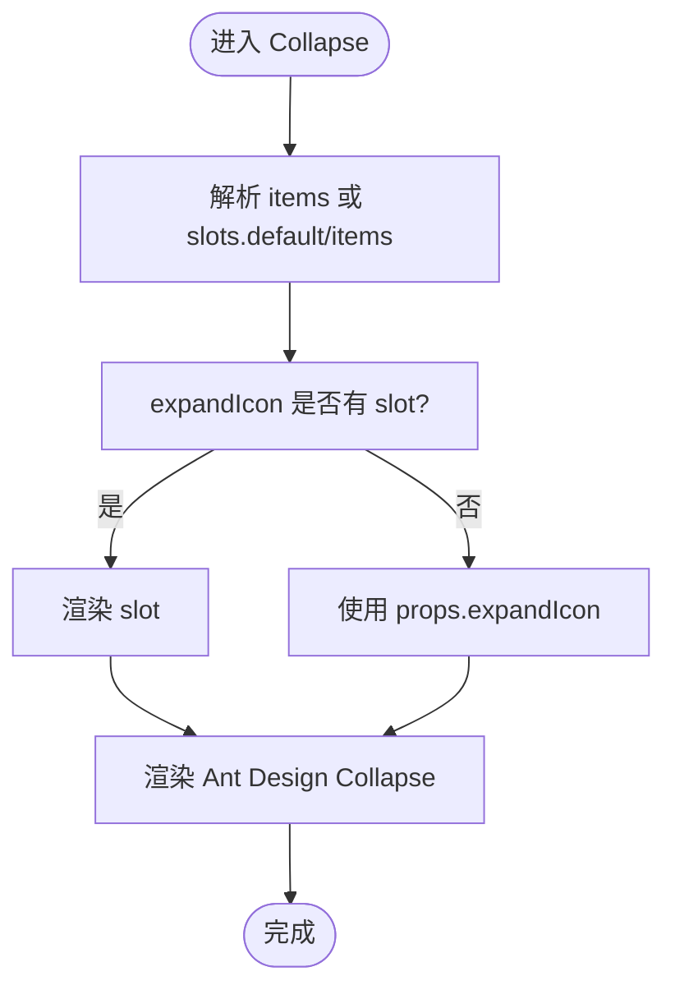

图示来源

- [frontend/antd/collapse/collapse.tsx:11-50](file://frontend/antd/collapse/collapse.tsx#L11-L50)

章节来源

- [frontend/antd/collapse/collapse.tsx:1-53](file://frontend/antd/collapse/collapse.tsx#L1-L53)

### 描述列表 Descriptions

- 数据渲染：title/extra 支持 slot；items 通过 renderItems 渲染。
- 交互行为：无交互事件。
- 动画效果：由 Ant Design 提供。

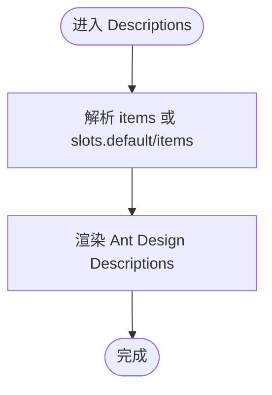

图示来源

- [frontend/antd/descriptions/descriptions.tsx:10-38](file://frontend/antd/descriptions/descriptions.tsx#L10-L38)

章节来源

- [frontend/antd/descriptions/descriptions.tsx:1-41](file://frontend/antd/descriptions/descriptions.tsx#L1-L41)

### 空状态 Empty

- 数据渲染：description/image 支持 slot；image 支持默认值与自定义。
- 交互行为：无交互事件。
- 动画效果：由 Ant Design 提供。

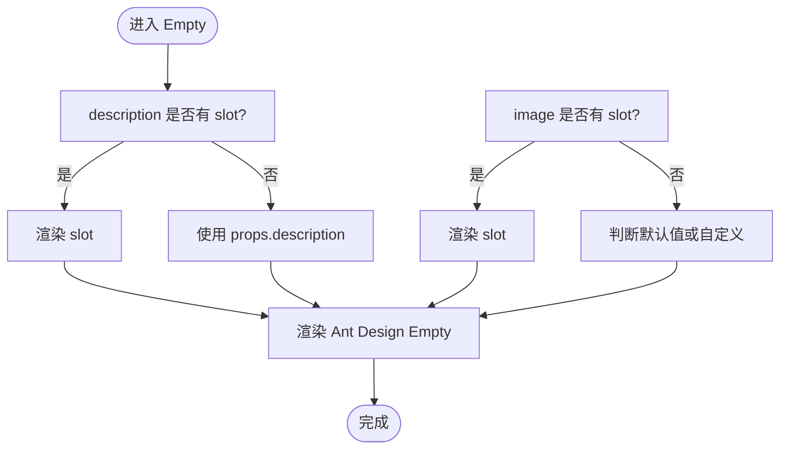

图示来源

- [frontend/antd/empty/empty.tsx:6-49](file://frontend/antd/empty/empty.tsx#L6-L49)

章节来源

- [frontend/antd/empty/empty.tsx:1-52](file://frontend/antd/empty/empty.tsx#L1-L52)

### 图片 Image

- 数据渲染：支持预览组与 slots。
- 交互行为：无交互事件。
- 动画效果：由 Ant Design 提供。

章节来源

- [frontend/antd/image/image.tsx:1-200](file://frontend/antd/image/image.tsx#L1-L200)

### 列表 List

- 数据渲染：支持自定义渲染项与操作区。
- 交互行为：无交互事件。
- 动画效果：由 Ant Design 提供。

章节来源

- [frontend/antd/list/list.tsx:1-200](file://frontend/antd/list/list.tsx#L1-L200)

### 气泡卡片 Popover

- 数据渲染：支持触发器与内容区的 slots。
- 交互行为：无交互事件。
- 动画效果：由 Ant Design 提供。

章节来源

- [frontend/antd/popover/popover.tsx:1-200](file://frontend/antd/popover/popover.tsx#L1-L200)

### 二维码 QRCode

- 数据渲染：支持内容与样式配置。
- 交互行为：无交互事件。
- 动画效果：由 Ant Design 提供。

章节来源

- [frontend/antd/qr_code/qr-code.tsx:1-200](file://frontend/antd/qr_code/qr-code.tsx#L1-L200)

### 分段控制器 Segmented

- 数据渲染：支持选项与 slots。
- 交互行为：无交互事件。
- 动画效果：由 Ant Design 提供。

章节来源

- [frontend/antd/segmented/segmented.tsx:1-200](file://frontend/antd/segmented/segmented.tsx#L1-L200)

### 统计数值 Statistic

- 数据渲染：支持标题与数值的自定义。
- 交互行为：无交互事件。
- 动画效果：由 Ant Design 提供。

章节来源

- [frontend/antd/statistic/statistic.tsx:1-200](file://frontend/antd/statistic/statistic.tsx#L1-L200)

### 表格 Table

- 数据渲染：支持列定义、展开行、选择行等复杂结构。
- 交互行为：无交互事件。
- 动画效果：由 Ant Design 提供。

章节来源

- [frontend/antd/table/table.tsx:1-200](file://frontend/antd/table/table.tsx#L1-L200)

### 标签页 Tabs

- 数据渲染：支持标签项与额外内容的 slots。
- 交互行为：无交互事件。
- 动画效果：由 Ant Design 提供。

章节来源

- [frontend/antd/tabs/tabs.tsx:1-200](file://frontend/antd/tabs/tabs.tsx#L1-L200)

### 标签 Tag

- 数据渲染：支持可勾选标签与 slots。
- 交互行为：无交互事件。
- 动画效果：由 Ant Design 提供。

章节来源

- [frontend/antd/tag/tag.tsx:1-200](file://frontend/antd/tag/tag.tsx#L1-L200)

### 时间轴 Timeline

- 数据渲染：支持时间轴项与 slots。
- 交互行为：无交互事件。
- 动画效果：由 Ant Design 提供。

章节来源

- [frontend/antd/timeline/timeline.tsx:1-200](file://frontend/antd/timeline/timeline.tsx#L1-L200)

### 文字提示 Tooltip

- 数据渲染：支持触发器与内容区的 slots。
- 交互行为：无交互事件。
- 动画效果：由 Ant Design 提供。

章节来源

- [frontend/antd/tooltip/tooltip.tsx:1-200](file://frontend/antd/tooltip/tooltip.tsx#L1-L200)

### 漫游式引导 Tour

- 数据渲染：支持步骤与插槽。
- 交互行为：无交互事件。
- 动画效果：由 Ant Design 提供。

章节来源

- [frontend/antd/tour/tour.tsx:1-200](file://frontend/antd/tour/tour.tsx#L1-L200)

### 树形控件 Tree

- 数据渲染：支持目录树与节点渲染。
- 交互行为：无交互事件。
- 动画效果：由 Ant Design 提供。

章节来源

- [frontend/antd/tree/tree.tsx:1-200](file://frontend/antd/tree/tree.tsx#L1-L200)

## 依赖分析

- 组件耦合：各组件均依赖 Ant Design React 版本；通过 sveltify 统一封装，降低直接使用 React 的复杂度。
- 工具函数：useFunction/useTargets/renderItems/renderParamsSlot 等工具贯穿多个组件，提升复用性与一致性。
- 上下文：部分组件（如 Collapse/Descriptions/Tabs）引入 items 上下文，统一 items 的声明与渲染。

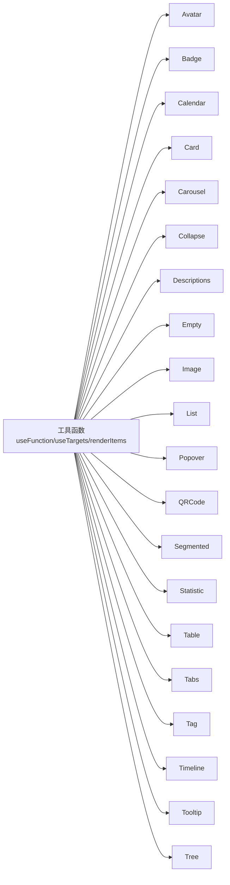

图示来源

- [frontend/antd/avatar/avatar.tsx:1-28](file://frontend/antd/avatar/avatar.tsx#L1-L28)
- [frontend/antd/badge/badge.tsx:1-21](file://frontend/antd/badge/badge.tsx#L1-L21)
- [frontend/antd/calendar/calendar.tsx:1-102](file://frontend/antd/calendar/calendar.tsx#L1-L102)
- [frontend/antd/card/card.tsx:1-150](file://frontend/antd/card/card.tsx#L1-L150)
- [frontend/antd/carousel/carousel.tsx:1-32](file://frontend/antd/carousel/carousel.tsx#L1-L32)
- [frontend/antd/collapse/collapse.tsx:1-53](file://frontend/antd/collapse/collapse.tsx#L1-L53)
- [frontend/antd/descriptions/descriptions.tsx:1-41](file://frontend/antd/descriptions/descriptions.tsx#L1-L41)
- [frontend/antd/empty/empty.tsx:1-52](file://frontend/antd/empty/empty.tsx#L1-L52)
- [frontend/antd/image/image.tsx:1-200](file://frontend/antd/image/image.tsx#L1-L200)
- [frontend/antd/list/list.tsx:1-200](file://frontend/antd/list/list.tsx#L1-L200)
- [frontend/antd/popover/popover.tsx:1-200](file://frontend/antd/popover/popover.tsx#L1-L200)
- [frontend/antd/qr_code/qr-code.tsx:1-200](file://frontend/antd/qr_code/qr-code.tsx#L1-L200)
- [frontend/antd/segmented/segmented.tsx:1-200](file://frontend/antd/segmented/segmented.tsx#L1-L200)
- [frontend/antd/statistic/statistic.tsx:1-200](file://frontend/antd/statistic/statistic.tsx#L1-L200)
- [frontend/antd/table/table.tsx:1-200](file://frontend/antd/table/table.tsx#L1-L200)
- [frontend/antd/tabs/tabs.tsx:1-200](file://frontend/antd/tabs/tabs.tsx#L1-L200)
- [frontend/antd/tag/tag.tsx:1-200](file://frontend/antd/tag/tag.tsx#L1-L200)
- [frontend/antd/timeline/timeline.tsx:1-200](file://frontend/antd/timeline/timeline.tsx#L1-L200)
- [frontend/antd/tooltip/tooltip.tsx:1-200](file://frontend/antd/tooltip/tooltip.tsx#L1-L200)
- [frontend/antd/tree/tree.tsx:1-200](file://frontend/antd/tree/tree.tsx#L1-L200)

章节来源

- [frontend/antd/package.json:1-6](file://frontend/antd/package.json#L1-L6)

## 性能考虑

- 大数据量展示建议
  - 虚拟滚动：优先使用具备虚拟滚动能力的容器组件（如 List/Table），仅渲染可视区域元素。
  - 分页与懒加载：对长列表采用分页或滚动触底加载，减少一次性渲染压力。
  - 事件节流：对高频交互（如滚动、缩放）使用节流/防抖，避免频繁重渲染。
  - 渲染优化：尽量将复杂计算移至后台或缓存，前端仅做轻量渲染。
- 动画与过渡
  - Ant Design 组件自带平滑过渡，组件层不额外添加动画，避免叠加导致性能下降。
- 主题与样式
  - 使用 Ant Design 的主题变量与 CSS 变量体系，减少重复样式计算。
  - 避免在组件内动态生成大量内联样式，优先使用类名与 CSS Modules。

## 故障排查指南

- 日期参数异常
  - 现象：日历组件日期显示或回调时间戳不一致。
  - 排查：确认传入 value/defaultValue/validRange 是否为合法时间戳或可被 dayjs 解析的值；检查格式化逻辑是否生效。
- 回调未触发
  - 现象：onChange/onSelect 等回调未执行。
  - 排查：确认 useFunction 是否正确包裹回调；检查 slots 与 props 的优先级关系。
- slots 未生效
  - 现象：title/extra/actions 等未按预期渲染。
  - 排查：确认 slots 名称与组件约定一致；检查 renderItems 与 useTargets 的使用是否正确。
- 样式覆盖无效
  - 现象：自定义样式未生效。
  - 排查：确认 CSS 作用域与 !important 使用；优先使用主题变量与受控样式对象。

章节来源

- [frontend/antd/calendar/calendar.tsx:17-99](file://frontend/antd/calendar/calendar.tsx#L17-L99)
- [frontend/antd/card/card.tsx:37-147](file://frontend/antd/card/card.tsx#L37-L147)
- [frontend/antd/carousel/carousel.tsx:8-29](file://frontend/antd/carousel/carousel.tsx#L8-L29)
- [frontend/antd/collapse/collapse.tsx:11-50](file://frontend/antd/collapse/collapse.tsx#L11-L50)
- [frontend/antd/descriptions/descriptions.tsx:10-38](file://frontend/antd/descriptions/descriptions.tsx#L10-L38)
- [frontend/antd/empty/empty.tsx:6-49](file://frontend/antd/empty/empty.tsx#L6-L49)

## 结论

本仓库通过统一的 sveltify 桥接与工具函数，将 Ant Design React 组件无缝集成到 Svelte 生态中，实现了：

- 声明式的数据渲染（slots/items）
- 一致的交互回调（useFunction）
- 易于扩展的主题与样式覆盖
- 良好的性能与可维护性

对于大数据量场景，建议结合虚拟滚动、分页与懒加载策略，进一步提升用户体验与性能表现。

## 附录

- 组件清单与对应文件路径
  - 头像(Avatar): [frontend/antd/avatar/avatar.tsx](file://frontend/antd/avatar/avatar.tsx)
  - 徽标数(Badge): [frontend/antd/badge/badge.tsx](file://frontend/antd/badge/badge.tsx)
  - 日历(Calendar): [frontend/antd/calendar/calendar.tsx](file://frontend/antd/calendar/calendar.tsx)
  - 卡片(Card): [frontend/antd/card/card.tsx](file://frontend/antd/card/card.tsx)
  - 走马灯(Carousel): [frontend/antd/carousel/carousel.tsx](file://frontend/antd/carousel/carousel.tsx)
  - 折叠面板(Collapse): [frontend/antd/collapse/collapse.tsx](file://frontend/antd/collapse/collapse.tsx)
  - 描述列表(Descriptions): [frontend/antd/descriptions/descriptions.tsx](file://frontend/antd/descriptions/descriptions.tsx)
  - 空状态(Empty): [frontend/antd/empty/empty.tsx](file://frontend/antd/empty/empty.tsx)
  - 图片(Image): [frontend/antd/image/image.tsx](file://frontend/antd/image/image.tsx)
  - 列表(List): [frontend/antd/list/list.tsx](file://frontend/antd/list/list.tsx)
  - 气泡卡片(Popover): [frontend/antd/popover/popover.tsx](file://frontend/antd/popover/popover.tsx)
  - 二维码(QRCode): [frontend/antd/qr_code/qr-code.tsx](file://frontend/antd/qr_code/qr-code.tsx)
  - 分段控制器(Segmented): [frontend/antd/segmented/segmented.tsx](file://frontend/antd/segmented/segmented.tsx)
  - 统计数值(Statistic): [frontend/antd/statistic/statistic.tsx](file://frontend/antd/statistic/statistic.tsx)
  - 表格(Table): [frontend/antd/table/table.tsx](file://frontend/antd/table/table.tsx)
  - 标签页(Tabs): [frontend/antd/tabs/tabs.tsx](file://frontend/antd/tabs/tabs.tsx)
  - 标签(Tag): [frontend/antd/tag/tag.tsx](file://frontend/antd/tag/tag.tsx)
  - 时间轴(Timeline): [frontend/antd/timeline/timeline.tsx](file://frontend/antd/timeline/timeline.tsx)
  - 文字提示(Tooltip): [frontend/antd/tooltip/tooltip.tsx](file://frontend/antd/tooltip/tooltip.tsx)
  - 漫游式引导(Tour): [frontend/antd/tour/tour.tsx](file://frontend/antd/tour/tour.tsx)
  - 树形控件(Tree): [frontend/antd/tree/tree.tsx](file://frontend/antd/tree/tree.tsx)
- 后端导出
  - [backend/modelscope_studio/components/antd/**init**.py](file://backend/modelscope_studio/components/antd/__init__.py)
  - [backend/modelscope_studio/components/antd/components.py](file://backend/modelscope_studio/components/antd/components.py)
- 前端包信息
  - [frontend/antd/package.json](file://frontend/antd/package.json)
