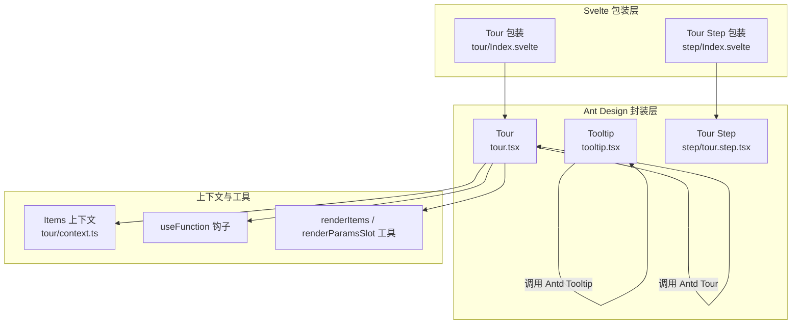
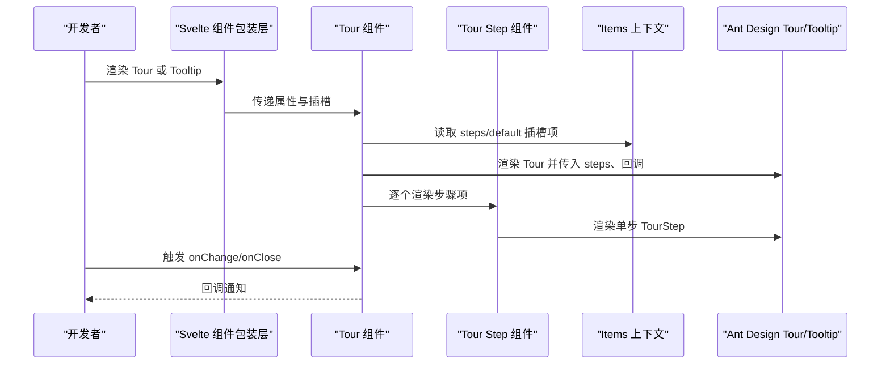
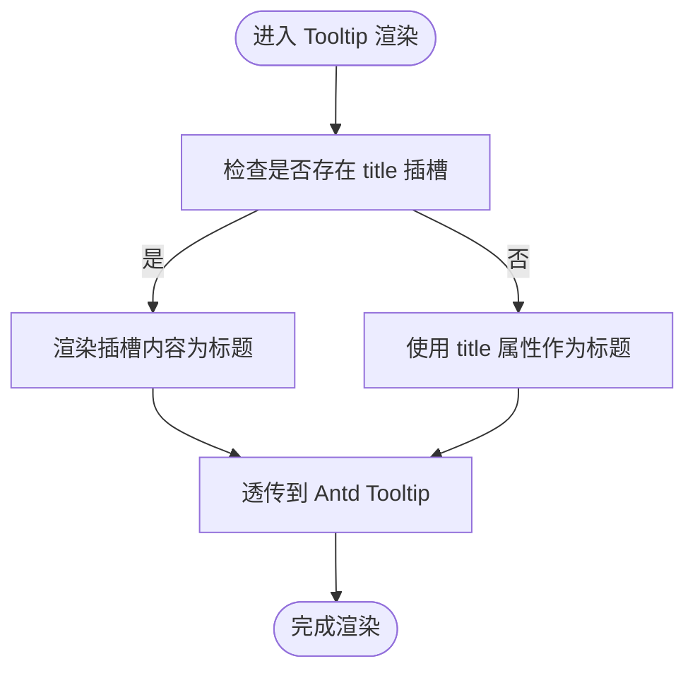
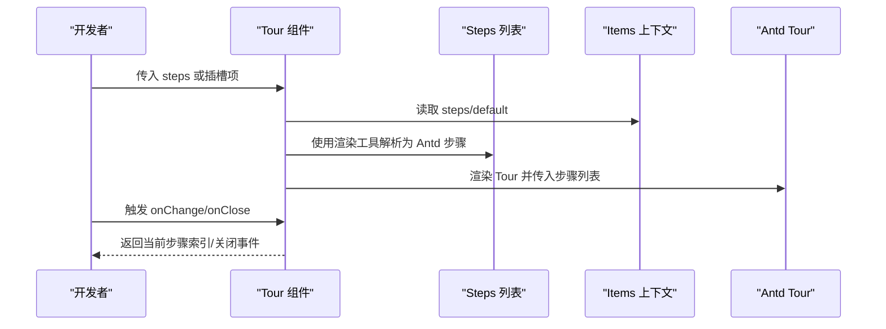
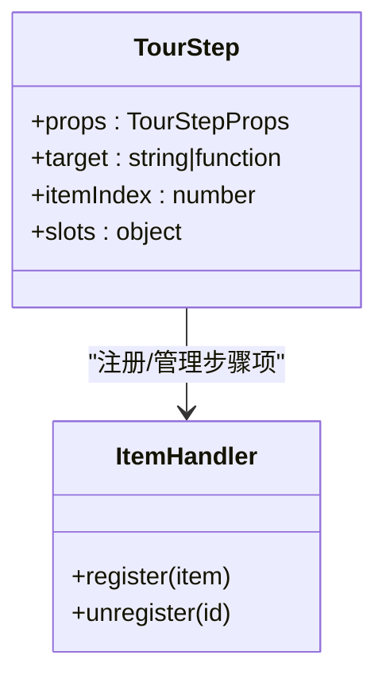
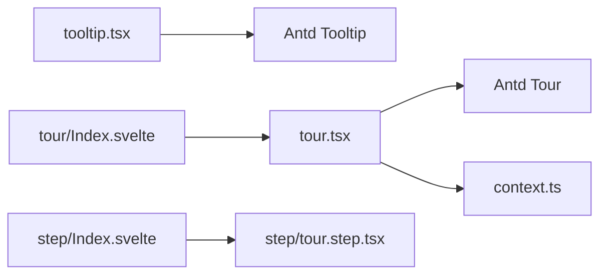

# 文字提示与漫游引导组件

<cite>
**本文档引用的文件**
- [tooltip.tsx](file://frontend/antd/tooltip/tooltip.tsx)
- [tour.tsx](file://frontend/antd/tour/tour.tsx)
- [context.ts](file://frontend/antd/tour/context.ts)
- [Index.svelte（Tour）](file://frontend/antd/tour/Index.svelte)
- [Index.svelte（Tour Step）](file://frontend/antd/tour/step/Index.svelte)
- [tour.step.tsx](file://frontend/antd/tour/step/tour.step.tsx)
- [README.md（Tooltip 文档）](file://docs/components/antd/tooltip/README.md)
- [README.md（Tour 文档）](file://docs/components/antd/tour/README.md)
</cite>

## 目录

1. [简介](#简介)
2. [项目结构](#项目结构)
3. [核心组件](#核心组件)
4. [架构总览](#架构总览)
5. [详细组件分析](#详细组件分析)
6. [依赖关系分析](#依赖关系分析)
7. [性能考虑](#性能考虑)
8. [故障排查指南](#故障排查指南)
9. [结论](#结论)
10. [附录](#附录)

## 简介

本文件面向“文字提示（Tooltip）”和“漫游式引导（Tour）”两个 Ant Design 组件在本仓库中的封装与使用，重点覆盖以下方面：

- 文字提示：触发方式、位置偏移、延迟显示、多行文本支持、嵌套使用、HTML 内容支持、无障碍访问优化
- 漫游引导：步骤（step）配置、路径规划、焦点区域、用户交互控制、条件判断、用户偏好记忆、引导流程自定义

## 项目结构

本项目采用 Svelte + React 预处理（svelte-preprocess-react）的方式，将 Ant Design 的 React 组件以 Svelte 组件形式暴露给前端生态。Tooltip 和 Tour 的封装均位于 frontend/antd 下，Tour 的 Step 子组件位于 frontend/antd/tour/step。

图表来源

- [tooltip.tsx:1-29](file://frontend/antd/tooltip/tooltip.tsx#L1-L29)
- [tour.tsx:1-87](file://frontend/antd/tour/tour.tsx#L1-L87)
- [context.ts:1-7](file://frontend/antd/tour/context.ts#L1-L7)
- [Index.svelte（Tour）:1-60](file://frontend/antd/tour/Index.svelte#L1-L60)
- [Index.svelte（Tour Step）:1-82](file://frontend/antd/tour/step/Index.svelte#L1-L82)
- [tour.step.tsx:1-14](file://frontend/antd/tour/step/tour.step.tsx#L1-L14)

章节来源

- [tooltip.tsx:1-29](file://frontend/antd/tooltip/tooltip.tsx#L1-L29)
- [tour.tsx:1-87](file://frontend/antd/tour/tour.tsx#L1-L87)
- [context.ts:1-7](file://frontend/antd/tour/context.ts#L1-L7)
- [Index.svelte（Tour）:1-60](file://frontend/antd/tour/Index.svelte#L1-L60)
- [Index.svelte（Tour Step）:1-82](file://frontend/antd/tour/step/Index.svelte#L1-L82)
- [tour.step.tsx:1-14](file://frontend/antd/tour/step/tour.step.tsx#L1-L14)

## 核心组件

- Tooltip：对 Ant Design Tooltip 的轻量封装，保留 title 属性与插槽化标题渲染能力，并通过 useFunction 将回调函数安全注入 React 组件。
- Tour：对 Ant Design Tour 的增强封装，支持通过插槽注入 steps、关闭图标、指示器与操作区，内部使用 Items 上下文与渲染工具解析步骤列表，同时提供 onChange/onClose 回调桥接。

章节来源

- [tooltip.tsx:7-26](file://frontend/antd/tooltip/tooltip.tsx#L7-L26)
- [tour.tsx:11-84](file://frontend/antd/tour/tour.tsx#L11-L84)

## 架构总览

下图展示 Tooltip 与 Tour 在本仓库中的调用链路与数据流：

图表来源

- [tour.tsx:17-83](file://frontend/antd/tour/tour.tsx#L17-L83)
- [context.ts:1-7](file://frontend/antd/tour/context.ts#L1-L7)
- [Index.svelte（Tour）:46-59](file://frontend/antd/tour/Index.svelte#L46-L59)
- [Index.svelte（Tour Step）:61-81](file://frontend/antd/tour/step/Index.svelte#L61-L81)
- [tour.step.tsx:7-11](file://frontend/antd/tour/step/tour.step.tsx#L7-L11)

## 详细组件分析

### 文字提示（Tooltip）

- 触发方式
  - 支持标准的鼠标悬停触发；通过 Ant Design Tooltip 原生行为实现。
  - 可通过插槽化标题实现动态内容渲染，便于在标题中嵌入 HTML 结构或复杂组件。
- 位置偏移
  - 通过 Ant Design Tooltip 的原生偏移参数进行微调，满足不同布局需求。
- 延迟显示
  - 使用 Ant Design Tooltip 的延迟参数，避免频繁触发导致的闪烁或误触。
- 多行文本支持
  - 通过插槽化标题与 Ant Design Tooltip 的换行机制，天然支持多行文本与富文本。
- 嵌套使用
  - 可在 Tooltip 内部再包裹其他可交互元素（如按钮、链接），实现复合交互。
- HTML 内容支持
  - 通过插槽将 React 节点注入 title，从而在 Tooltip 中渲染 HTML 片段。
- 无障碍访问优化
  - 保持原生语义标签与键盘可达性；确保标题内容具备可读性与可理解性。

图表来源

- [tooltip.tsx:17-19](file://frontend/antd/tooltip/tooltip.tsx#L17-L19)

章节来源

- [tooltip.tsx:7-26](file://frontend/antd/tooltip/tooltip.tsx#L7-L26)

### 漫游式引导（Tour）

- 步骤（step）配置
  - 支持直接传入 steps 数组，或通过插槽注入 steps/default 项，内部统一由渲染工具解析为 Ant Design Tour 所需的步骤格式。
- 路径规划
  - 通过 Ant Design Tour 的内置导航逻辑实现步骤跳转；可通过 onChange 获取当前步骤索引，结合业务逻辑实现条件判断与路径变更。
- 焦点区域
  - 每个步骤可绑定目标元素选择器或函数，用于定位焦点区域；支持动态计算目标元素。
- 用户交互控制
  - 提供 closeIcon、indicatorsRender、actionsRender 插槽，允许自定义关闭图标、指示器与操作区。
  - 通过 onClose 回调在关闭时执行清理或记录用户偏好。
- 条件判断
  - 在 onChange 中根据当前步骤与业务状态决定是否允许下一步、是否跳过某些步骤。
- 用户偏好记忆
  - 在 onClose 中持久化用户偏好（例如“不再显示”），并在下次初始化 Tour 时根据偏好决定是否展示。
- 引导流程自定义
  - 通过插槽与回调组合，实现自定义的引导文案、样式与交互行为。

图表来源

- [tour.tsx:33-48](file://frontend/antd/tour/tour.tsx#L33-L48)
- [tour.tsx:49-78](file://frontend/antd/tour/tour.tsx#L49-L78)
- [context.ts:1-7](file://frontend/antd/tour/context.ts#L1-L7)

章节来源

- [tour.tsx:11-84](file://frontend/antd/tour/tour.tsx#L11-L84)
- [context.ts:1-7](file://frontend/antd/tour/context.ts#L1-L7)

#### Tour Step 组件

- 作用
  - 作为单个步骤的容器，负责将外部传入的属性与插槽映射到 Ant Design TourStep。
- 关键点
  - 支持 target 函数或选择器，用于定位焦点区域。
  - 支持 next_button_click/prev_button_click 等交互属性的桥接。
  - 通过 ItemHandler 接入 Items 上下文，实现步骤项的注册与管理。

图表来源

- [tour.step.tsx:7-11](file://frontend/antd/tour/step/tour.step.tsx#L7-L11)
- [context.ts:1-7](file://frontend/antd/tour/context.ts#L1-L7)

章节来源

- [Index.svelte（Tour Step）:1-82](file://frontend/antd/tour/step/Index.svelte#L1-L82)
- [tour.step.tsx:1-14](file://frontend/antd/tour/step/tour.step.tsx#L1-L14)

## 依赖关系分析

- Tooltip 依赖 Ant Design Tooltip，通过 sveltify 适配 React 组件到 Svelte。
- Tour 依赖 Ant Design Tour，同时引入 Items 上下文与渲染工具，实现插槽到步骤数组的转换。
- Svelte 包装层负责属性与插槽的透传、类名与可见性控制，以及异步加载底层组件。

图表来源

- [tooltip.tsx:1-29](file://frontend/antd/tooltip/tooltip.tsx#L1-L29)
- [tour.tsx:1-87](file://frontend/antd/tour/tour.tsx#L1-L87)
- [context.ts:1-7](file://frontend/antd/tour/context.ts#L1-L7)
- [Index.svelte（Tour）:1-60](file://frontend/antd/tour/Index.svelte#L1-L60)
- [Index.svelte（Tour Step）:1-82](file://frontend/antd/tour/step/Index.svelte#L1-L82)
- [tour.step.tsx:1-14](file://frontend/antd/tour/step/tour.step.tsx#L1-L14)

章节来源

- [tooltip.tsx:1-29](file://frontend/antd/tooltip/tooltip.tsx#L1-L29)
- [tour.tsx:1-87](file://frontend/antd/tour/tour.tsx#L1-L87)
- [context.ts:1-7](file://frontend/antd/tour/context.ts#L1-L7)
- [Index.svelte（Tour）:1-60](file://frontend/antd/tour/Index.svelte#L1-L60)
- [Index.svelte（Tour Step）:1-82](file://frontend/antd/tour/step/Index.svelte#L1-L82)
- [tour.step.tsx:1-14](file://frontend/antd/tour/step/tour.step.tsx#L1-L14)

## 性能考虑

- 使用 useMemo 缓存步骤数组，避免不必要的重渲染。
- 仅在可见时渲染 Tour 与 Step，减少 DOM 开销。
- 合理使用插槽与动态渲染，避免一次性渲染过多复杂节点。
- 在 onChange/onClose 中尽量避免重型同步操作，必要时使用异步处理。

## 故障排查指南

- 标题不显示或为空
  - 检查是否正确传入 title 或使用了 title 插槽；确认插槽内容已被正确渲染。
- 步骤未生效
  - 确认 steps 或插槽项已正确注入；检查 Items 上下文是否被正确提供。
- 目标元素无法聚焦
  - 检查 target 选择器或函数返回值；确保元素在页面中已渲染且可访问。
- 回调未触发
  - 确认 onChange/onClose 是否被正确传入；检查 useFunction 是否正确包裹回调。

章节来源

- [tour.tsx:33-48](file://frontend/antd/tour/tour.tsx#L33-L48)
- [tour.tsx:49-78](file://frontend/antd/tour/tour.tsx#L49-L78)
- [Index.svelte（Tour）:46-59](file://frontend/antd/tour/Index.svelte#L46-L59)
- [Index.svelte（Tour Step）:69-73](file://frontend/antd/tour/step/Index.svelte#L69-L73)

## 结论

本仓库对 Tooltip 与 Tour 的封装遵循“轻量、可扩展、易集成”的原则：在保留 Ant Design 原生能力的同时，通过插槽与上下文机制增强了步骤配置、交互定制与渲染灵活性。建议在实际使用中结合业务场景合理设置步骤路径、目标区域与用户偏好，以获得更佳的用户体验。

## 附录

- 示例与文档入口
  - Tooltip 文档示例入口：[Tooltip 文档:1-8](file://docs/components/antd/tooltip/README.md#L1-L8)
  - Tour 文档示例入口：[Tour 文档:1-8](file://docs/components/antd/tour/README.md#L1-L8)
