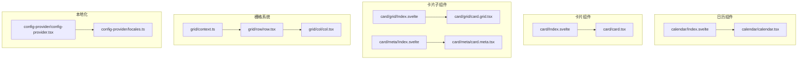
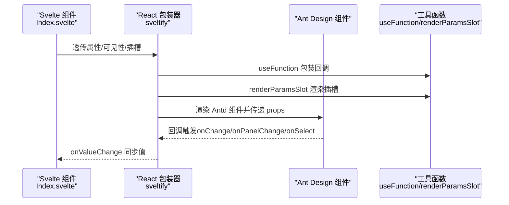
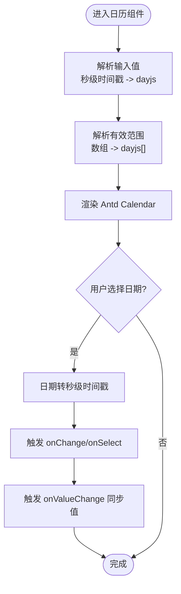
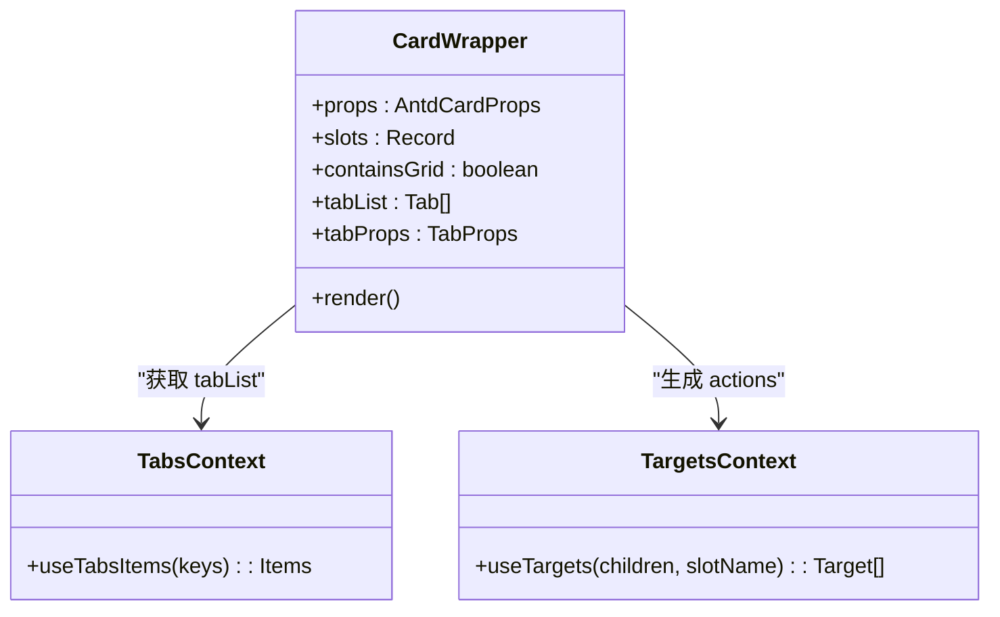
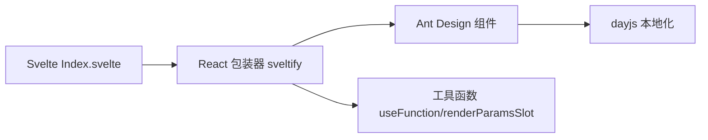

# 日历与卡片组件

<cite>
**本文档引用的文件**
- [frontend/antd/calendar/Index.svelte](file://frontend/antd/calendar/Index.svelte)
- [frontend/antd/calendar/calendar.tsx](file://frontend/antd/calendar/calendar.tsx)
- [frontend/antd/card/Index.svelte](file://frontend/antd/card/Index.svelte)
- [frontend/antd/card/card.tsx](file://frontend/antd/card/card.tsx)
- [frontend/antd/card/grid/Index.svelte](file://frontend/antd/card/grid/Index.svelte)
- [frontend/antd/card/grid/card.grid.tsx](file://frontend/antd/card/grid/card.grid.tsx)
- [frontend/antd/card/meta/Index.svelte](file://frontend/antd/card/meta/Index.svelte)
- [frontend/antd/card/meta/card.meta.tsx](file://frontend/antd/card/meta/card.meta.tsx)
- [frontend/antd/grid/col/col.tsx](file://frontend/antd/grid/col/col.tsx)
- [frontend/antd/grid/row/row.tsx](file://frontend/antd/grid/row/row.tsx)
- [frontend/antd/grid/context.ts](file://frontend/antd/grid/context.ts)
- [frontend/antd/config-provider/config-provider.tsx](file://frontend/antd/config-provider/config-provider.tsx)
- [frontend/antd/config-provider/locales.ts](file://frontend/antd/config-provider/locales.ts)
</cite>

## 目录

1. [简介](#简介)
2. [项目结构](#项目结构)
3. [核心组件](#核心组件)
4. [架构总览](#架构总览)
5. [详细组件分析](#详细组件分析)
6. [依赖关系分析](#依赖关系分析)
7. [性能考虑](#性能考虑)
8. [故障排除指南](#故障排除指南)
9. [结论](#结论)

## 简介

本文件面向日历（Calendar）与卡片（Card）组件，提供从架构到实现细节的完整说明。重点涵盖：

- 日历组件：日程安排、事件标记、日期选择、面板切换、通知日历的特殊功能（通过插槽与回调扩展）
- 卡片组件：基础结构、卡片网格（Card.Grid）的响应式布局、卡片元数据（Card.Meta）的内容组织、自定义卡片内容的实现方法
- 本地化配置：基于 ConfigProvider 的多语言支持与日期本地化
- 交互与回调：事件回调处理、值变更传播
- 适配性：不同屏幕尺寸下的适配策略与动态更新机制

## 项目结构

日历与卡片组件位于前端 Ant Design 生态中，采用 Svelte + React 包装器（sveltify）的方式桥接 Svelte 组件与 Ant Design 的 React 实现。每个组件均提供：

- Svelte 入口文件（Index.svelte）：负责属性透传、可见性控制、插槽收集与异步加载 React 实现
- React 包装器（\*.tsx）：使用 sveltify 将 Ant Design 组件包装为可被 Svelte 使用的形式，并处理函数型回调、插槽渲染与值格式化

**图表来源**

- [frontend/antd/calendar/Index.svelte:1-85](file://frontend/antd/calendar/Index.svelte#L1-L85)
- [frontend/antd/calendar/calendar.tsx:1-102](file://frontend/antd/calendar/calendar.tsx#L1-L102)
- [frontend/antd/card/Index.svelte:1-68](file://frontend/antd/card/Index.svelte#L1-L68)
- [frontend/antd/card/card.tsx:1-150](file://frontend/antd/card/card.tsx#L1-L150)
- [frontend/antd/card/grid/Index.svelte:1-63](file://frontend/antd/card/grid/Index.svelte#L1-L63)
- [frontend/antd/card/grid/card.grid.tsx:1-7](file://frontend/antd/card/grid/card.grid.tsx#L1-L7)
- [frontend/antd/card/meta/Index.svelte:1-60](file://frontend/antd/card/meta/Index.svelte#L1-L60)
- [frontend/antd/card/meta/card.meta.tsx:1-32](file://frontend/antd/card/meta/card.meta.tsx#L1-L32)
- [frontend/antd/grid/row/row.tsx:1-34](file://frontend/antd/grid/row/row.tsx#L1-L34)
- [frontend/antd/grid/col/col.tsx:1-14](file://frontend/antd/grid/col/col.tsx#L1-L14)
- [frontend/antd/grid/context.ts:1-7](file://frontend/antd/grid/context.ts#L1-L7)
- [frontend/antd/config-provider/config-provider.tsx](file://frontend/antd/config-provider/config-provider.tsx)
- [frontend/antd/config-provider/locales.ts:1-800](file://frontend/antd/config-provider/locales.ts#L1-L800)

**章节来源**

- [frontend/antd/calendar/Index.svelte:1-85](file://frontend/antd/calendar/Index.svelte#L1-L85)
- [frontend/antd/calendar/calendar.tsx:1-102](file://frontend/antd/calendar/calendar.tsx#L1-L102)
- [frontend/antd/card/Index.svelte:1-68](file://frontend/antd/card/Index.svelte#L1-L68)
- [frontend/antd/card/card.tsx:1-150](file://frontend/antd/card/card.tsx#L1-L150)
- [frontend/antd/card/grid/Index.svelte:1-63](file://frontend/antd/card/grid/Index.svelte#L1-L63)
- [frontend/antd/card/grid/card.grid.tsx:1-7](file://frontend/antd/card/grid/card.grid.tsx#L1-L7)
- [frontend/antd/card/meta/Index.svelte:1-60](file://frontend/antd/card/meta/Index.svelte#L1-L60)
- [frontend/antd/card/meta/card.meta.tsx:1-32](file://frontend/antd/card/meta/card.meta.tsx#L1-L32)
- [frontend/antd/grid/row/row.tsx:1-34](file://frontend/antd/grid/row/row.tsx#L1-L34)
- [frontend/antd/grid/col/col.tsx:1-14](file://frontend/antd/grid/col/col.tsx#L1-L14)
- [frontend/antd/grid/context.ts:1-7](file://frontend/antd/grid/context.ts#L1-L7)
- [frontend/antd/config-provider/config-provider.tsx](file://frontend/antd/config-provider/config-provider.tsx)
- [frontend/antd/config-provider/locales.ts:1-800](file://frontend/antd/config-provider/locales.ts#L1-L800)

## 核心组件

- 日历（Calendar）
  - 支持日期值格式化（秒级时间戳与 dayjs 转换）、禁用日期过滤、单元格渲染插槽（cellRender/fullCellRender/headerRender）、面板切换与选择事件回调
  - 值变更通过 onValueChange 向上层同步，便于 Gradio 等框架集成
- 卡片（Card）
  - 提供标题、额外内容、封面图、操作区等区域的插槽化渲染；支持标签页列表与标签栏扩展（tabProps.\* 插槽）
  - 内部通过上下文收集子项，动态组合为 Ant Design 的 Card 组件
- 卡片网格（Card.Grid）
  - 作为卡片内部的网格容器，用于承载子内容并参与响应式布局
- 卡片元数据（Card.Meta）
  - 对标题、描述、头像进行插槽化渲染，便于灵活定制卡片元信息
- 栅格系统（Row/Col）
  - 通过上下文收集列项，将子节点映射为 Ant Design 的 Row/Col 结构，实现响应式布局

**章节来源**

- [frontend/antd/calendar/calendar.tsx:10-15](file://frontend/antd/calendar/calendar.tsx#L10-L15)
- [frontend/antd/calendar/calendar.tsx:58-98](file://frontend/antd/calendar/calendar.tsx#L58-L98)
- [frontend/antd/card/card.tsx:36-146](file://frontend/antd/card/card.tsx#L36-L146)
- [frontend/antd/card/grid/card.grid.tsx:1-7](file://frontend/antd/card/grid/card.grid.tsx#L1-L7)
- [frontend/antd/card/meta/card.meta.tsx:5-29](file://frontend/antd/card/meta/card.meta.tsx#L5-L29)
- [frontend/antd/grid/row/row.tsx:7-31](file://frontend/antd/grid/row/row.tsx#L7-L31)
- [frontend/antd/grid/col/col.tsx:7-11](file://frontend/antd/grid/col/col.tsx#L7-L11)

## 架构总览

下图展示了日历与卡片组件在 Svelte 与 Ant Design 之间的桥接关系，以及插槽与回调的关键流转。

**图表来源**

- [frontend/antd/calendar/Index.svelte:65-84](file://frontend/antd/calendar/Index.svelte#L65-L84)
- [frontend/antd/calendar/calendar.tsx:43-98](file://frontend/antd/calendar/calendar.tsx#L43-L98)
- [frontend/antd/card/Index.svelte:53-67](file://frontend/antd/card/Index.svelte#L53-L67)
- [frontend/antd/card/card.tsx:39-146](file://frontend/antd/card/card.tsx#L39-L146)

## 详细组件分析

### 日历组件（Calendar）

- 属性与回调
  - 输入值与默认值：支持秒级时间戳与 dayjs 对象，内部统一转换为 dayjs
  - 有效范围：validRange 同样进行格式化处理
  - 回调：onChange/onPanelChange/onSelect 会将日期转换为秒级时间戳后返回
  - 插槽：cellRender/fullCellRender/headerRender 可通过 slots 注入自定义渲染
- 事件标记与通知日历
  - 通过 cellRender/fullCellRender 插槽注入自定义标记或徽章
  - onPanelChange 可用于监听月份/年份切换，结合业务逻辑实现“通知日历”场景（如高亮特定日期）
- 日期选择与值同步
  - onValueChange 将当前选中日期以秒级时间戳回传给上层，便于状态管理与持久化

**图表来源**

- [frontend/antd/calendar/calendar.tsx:47-98](file://frontend/antd/calendar/calendar.tsx#L47-L98)

**章节来源**

- [frontend/antd/calendar/Index.svelte:13-84](file://frontend/antd/calendar/Index.svelte#L13-L84)
- [frontend/antd/calendar/calendar.tsx:10-15](file://frontend/antd/calendar/calendar.tsx#L10-L15)
- [frontend/antd/calendar/calendar.tsx:47-98](file://frontend/antd/calendar/calendar.tsx#L47-L98)

### 卡片组件（Card）

- 基础结构
  - 标题、额外内容、封面图、操作区均可通过插槽注入
  - 支持标签页列表 tabList 与标签栏扩展（tabProps.\* 插槽），包括指示器大小、更多菜单、左右附加内容等
- 动态内容与上下文
  - 通过 useTabsItems 与 useTargets 收集子项，将 tabList 与 actions 动态注入
  - 当存在 Grid 子项时，通过 containsGrid 控制隐藏占位网格，确保布局正确
- 自定义内容实现
  - 使用 ReactSlot 渲染插槽内容，支持复杂嵌套与条件渲染
  - actions 区域优先使用收集到的目标，其次回退到原生 props.actions

**图表来源**

- [frontend/antd/card/card.tsx:36-146](file://frontend/antd/card/card.tsx#L36-L146)

**章节来源**

- [frontend/antd/card/Index.svelte:12-67](file://frontend/antd/card/Index.svelte#L12-L67)
- [frontend/antd/card/card.tsx:36-146](file://frontend/antd/card/card.tsx#L36-L146)

### 卡片网格（Card.Grid）

- 作用
  - 作为卡片内部的网格容器，承载子内容并参与响应式布局
- 实现
  - 直接包装 Ant Design 的 Card.Grid，保持与 Antd 行为一致

**章节来源**

- [frontend/antd/card/grid/Index.svelte:19-59](file://frontend/antd/card/grid/Index.svelte#L19-L59)
- [frontend/antd/card/grid/card.grid.tsx:1-7](file://frontend/antd/card/grid/card.grid.tsx#L1-L7)

### 卡片元数据（Card.Meta）

- 内容组织
  - 标题、描述、头像均可通过插槽注入，实现灵活的内容组织
- 渲染机制
  - 通过 ReactSlot 渲染插槽，若未提供则回退到原生 props

**章节来源**

- [frontend/antd/card/meta/Index.svelte:19-59](file://frontend/antd/card/meta/Index.svelte#L19-L59)
- [frontend/antd/card/meta/card.meta.tsx:5-29](file://frontend/antd/card/meta/card.meta.tsx#L5-L29)

### 栅格系统（Row/Col）

- 响应式布局
  - Row 通过上下文收集 Col 列项，将 children 映射为 Ant Design 的 Row/Col 结构
  - Col 作为 ItemHandler，接收来自上下文的属性并渲染
- 上下文机制
  - 使用 createItemsContext 创建 items 上下文，Row/Col 通过 useItems 与 withItemsContextProvider 进行协作

**章节来源**

- [frontend/antd/grid/row/row.tsx:7-31](file://frontend/antd/grid/row/row.tsx#L7-L31)
- [frontend/antd/grid/col/col.tsx:7-11](file://frontend/antd/grid/col/col.tsx#L7-L11)
- [frontend/antd/grid/context.ts:1-7](file://frontend/antd/grid/context.ts#L1-L7)

## 依赖关系分析

- 组件耦合
  - 日历与卡片均通过 sveltify 将 Ant Design 组件桥接到 Svelte，降低直接耦合度
  - 插槽与回调通过 useFunction 与 renderParamsSlot 解耦，便于扩展
- 外部依赖
  - dayjs 用于日期格式化与本地化
  - Ant Design 提供 UI 能力与主题/本地化资源
- 循环依赖
  - 组件间无明显循环依赖；上下文仅单向传递

**图表来源**

- [frontend/antd/calendar/Index.svelte:65-84](file://frontend/antd/calendar/Index.svelte#L65-L84)
- [frontend/antd/calendar/calendar.tsx:3-6](file://frontend/antd/calendar/calendar.tsx#L3-L6)
- [frontend/antd/card/Index.svelte:53-67](file://frontend/antd/card/Index.svelte#L53-L67)
- [frontend/antd/card/card.tsx:2-8](file://frontend/antd/card/card.tsx#L2-L8)

**章节来源**

- [frontend/antd/calendar/calendar.tsx:1-102](file://frontend/antd/calendar/calendar.tsx#L1-L102)
- [frontend/antd/card/card.tsx:1-150](file://frontend/antd/card/card.tsx#L1-L150)

## 性能考虑

- 异步加载与懒渲染
  - Svelte Index.svelte 通过异步导入 React 实现，减少初始包体与首屏阻塞
- 回调函数优化
  - 使用 useFunction 包装回调，避免不必要的重新渲染
- 值计算缓存
  - 使用 useMemo 缓存 dayjs 值与有效范围，降低重复计算成本
- 插槽渲染
  - renderParamsSlot 仅在需要时渲染插槽内容，避免无谓的 DOM 更新

**章节来源**

- [frontend/antd/calendar/Index.svelte:65-84](file://frontend/antd/calendar/Index.svelte#L65-L84)
- [frontend/antd/calendar/calendar.tsx:43-57](file://frontend/antd/calendar/calendar.tsx#L43-L57)
- [frontend/antd/card/card.tsx:105-112](file://frontend/antd/card/card.tsx#L105-L112)

## 故障排除指南

- 日期不显示或异常
  - 检查输入值是否为秒级时间戳或可被 dayjs 解析的对象
  - 确认 validRange 是否为有效的 dayjs 数组
- 事件回调未触发
  - 确认 onChange/onPanelChange/onSelect 是否正确绑定
  - 若使用插槽渲染，请确保插槽未覆盖默认行为
- 插槽内容不生效
  - 确认插槽键名与组件支持的插槽一致（如 cellRender/fullCellRender/headerRender/title/extra/cover 等）
- 本地化无效
  - 检查 ConfigProvider 的 locale 设置与浏览器语言环境
  - 确认 locales.ts 中是否存在对应语言包

**章节来源**

- [frontend/antd/calendar/calendar.tsx:47-98](file://frontend/antd/calendar/calendar.tsx#L47-L98)
- [frontend/antd/card/card.tsx:113-132](file://frontend/antd/card/card.tsx#L113-L132)
- [frontend/antd/config-provider/config-provider.tsx](file://frontend/antd/config-provider/config-provider.tsx)
- [frontend/antd/config-provider/locales.ts:1-800](file://frontend/antd/config-provider/locales.ts#L1-L800)

## 结论

日历与卡片组件通过统一的桥接模式与插槽体系，实现了高度可扩展的 UI 能力：

- 日历组件支持日期格式化、事件回调与插槽扩展，满足日程安排与通知日历等场景
- 卡片组件提供灵活的内容组织方式与动态布局能力，结合栅格系统实现响应式设计
- 本地化与工具函数进一步提升了国际化与性能表现
  建议在实际项目中充分利用插槽与回调机制，结合上下文与工具函数，构建稳定且易维护的界面。
