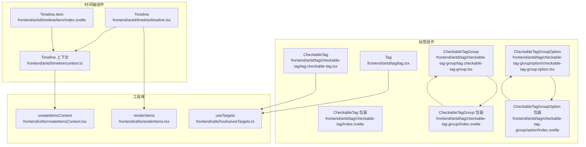
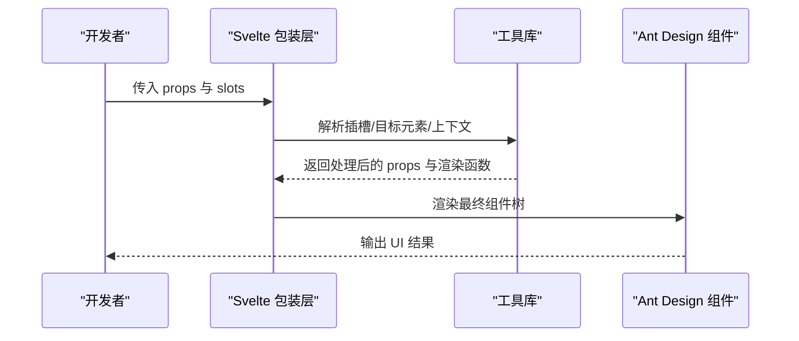
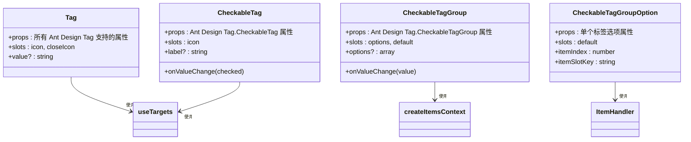
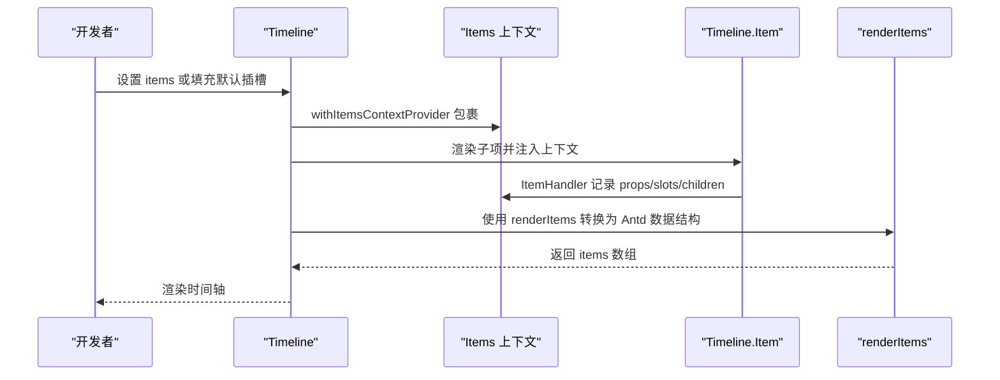
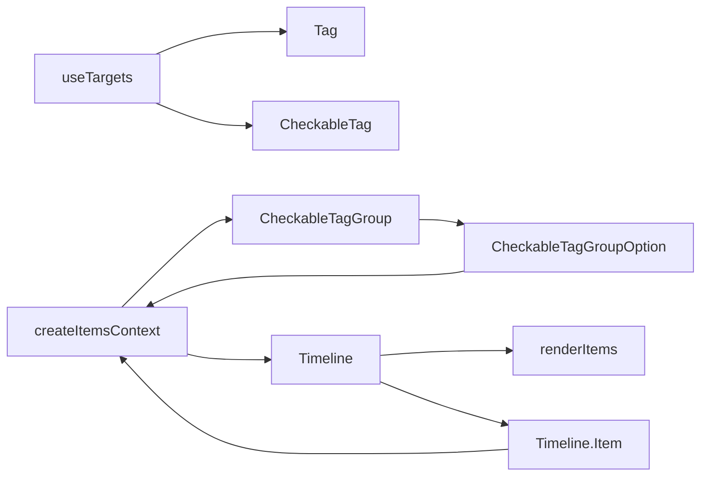

# 标签与时间轴组件

<cite>
**本文引用的文件**
- [frontend/antd/tag/tag.tsx](file://frontend/antd/tag/tag.tsx)
- [frontend/antd/tag/checkable-tag/tag.checkable-tag.tsx](file://frontend/antd/tag/checkable-tag/tag.checkable-tag.tsx)
- [frontend/antd/tag/checkable-tag/Index.svelte](file://frontend/antd/tag/checkable-tag/Index.svelte)
- [frontend/antd/tag/checkable-tag-group/tag.checkable-tag-group.tsx](file://frontend/antd/tag/checkable-tag-group/tag.checkable-tag-group.tsx)
- [frontend/antd/tag/checkable-tag-group/Index.svelte](file://frontend/antd/tag/checkable-tag-group/Index.svelte)
- [frontend/antd/tag/checkable-tag-group/context.ts](file://frontend/antd/tag/checkable-tag-group/context.ts)
- [frontend/antd/tag/checkable-tag-group/option/checkable-tag-group.option.tsx](file://frontend/antd/tag/checkable-tag-group/option/checkable-tag-group.option.tsx)
- [frontend/antd/tag/checkable-tag-group/option/Index.svelte](file://frontend/antd/tag/checkable-tag-group/option/Index.svelte)
- [frontend/antd/timeline/timeline.tsx](file://frontend/antd/timeline/timeline.tsx)
- [frontend/antd/timeline/item/Index.svelte](file://frontend/antd/timeline/item/Index.svelte)
- [frontend/antd/timeline/context.ts](file://frontend/antd/timeline/context.ts)
- [frontend/utils/createItemsContext.tsx](file://frontend/utils/createItemsContext.tsx)
- [frontend/utils/renderItems.tsx](file://frontend/utils/renderItems.tsx)
- [frontend/utils/hooks/useTargets.ts](file://frontend/utils/hooks/useTargets.ts)
- [docs/components/antd/tag/demos/checkable_tag.py](file://docs/components/antd/tag/demos/checkable_tag.py)
- [docs/components/antd/timeline/demos/basic.py](file://docs/components/antd/timeline/demos/basic.py)
</cite>

## 更新摘要

**所做更改**

- 新增可勾选标签组组件系统，包括 CheckableTagGroup 主组件和 CheckableTagGroupOption 子项组件
- 更新时间轴组件文档，反映 Timeline Item 组件的简化实现
- 增强标签组的批量操作能力和动态选项管理
- 完善可勾选标签组的上下文管理和选项处理机制

## 目录

1. [简介](#简介)
2. [项目结构](#项目结构)
3. [核心组件](#核心组件)
4. [架构总览](#架构总览)
5. [详细组件分析](#详细组件分析)
6. [依赖关系分析](#依赖关系分析)
7. [性能考量](#性能考量)
8. [故障排查指南](#故障排查指南)
9. [结论](#结论)
10. [附录](#附录)

## 简介

本文件聚焦于标签(Tag)与时间轴(Timeline)两大组件，系统性阐述其设计思路、数据流、交互行为与扩展能力。重点包括：

- 标签：普通标签与可选择标签的交互状态、颜色配置、动态标签管理、点击事件与删除功能、批量操作建议。
- **新增**：可勾选标签组组件系统，支持批量标签选择、动态选项管理和分组操作。
- 时间轴：时间节点(Item)、方向控制、时间点定制、样式自定义；以及反转显示、自定义图标与线样式调整的实现路径。

## 项目结构

- 组件层采用"前端 Svelte 包装 + 后端 Python 组件桥接"的模式，前端通过 sveltify 将 Ant Design 的 React 组件适配为 Svelte 组件，并在必要时引入 Items 上下文与插槽渲染机制。
- 工具层提供通用的 items 上下文、插槽渲染与目标元素解析等能力，支撑复杂容器组件（如 Timeline）的动态项管理。

**图表来源**

- [frontend/antd/tag/tag.tsx:1-35](file://frontend/antd/tag/tag.tsx#L1-L35)
- [frontend/antd/tag/checkable-tag/tag.checkable-tag.tsx:1-35](file://frontend/antd/tag/checkable-tag/tag.checkable-tag.tsx#L1-L35)
- [frontend/antd/tag/checkable-tag/Index.svelte:1-77](file://frontend/antd/tag/checkable-tag/Index.svelte#L1-L77)
- [frontend/antd/tag/checkable-tag-group/tag.checkable-tag-group.tsx:1-51](file://frontend/antd/tag/checkable-tag-group/tag.checkable-tag-group.tsx#L1-L51)
- [frontend/antd/tag/checkable-tag-group/Index.svelte:1-79](file://frontend/antd/tag/checkable-tag-group/Index.svelte#L1-L79)
- [frontend/antd/tag/checkable-tag-group/option/checkable-tag-group.option.tsx:1-14](file://frontend/antd/tag/checkable-tag-group/option/checkable-tag-group.option.tsx#L1-L14)
- [frontend/antd/tag/checkable-tag-group/option/Index.svelte:1-74](file://frontend/antd/tag/checkable-tag-group/option/Index.svelte#L1-L74)
- [frontend/antd/timeline/timeline.tsx:1-50](file://frontend/antd/timeline/timeline.tsx#L1-L50)
- [frontend/antd/timeline/item/Index.svelte:1-65](file://frontend/antd/timeline/item/Index.svelte#L1-L65)
- [frontend/antd/timeline/context.ts:1-7](file://frontend/antd/timeline/context.ts#L1-L7)
- [frontend/utils/createItemsContext.tsx:1-274](file://frontend/utils/createItemsContext.tsx#L1-L274)
- [frontend/utils/renderItems.tsx:1-114](file://frontend/utils/renderItems.tsx#L1-L114)
- [frontend/utils/hooks/useTargets.ts:1-52](file://frontend/utils/hooks/useTargets.ts#L1-L52)

**章节来源**

- [frontend/antd/tag/tag.tsx:1-35](file://frontend/antd/tag/tag.tsx#L1-L35)
- [frontend/antd/tag/checkable-tag/tag.checkable-tag.tsx:1-35](file://frontend/antd/tag/checkable-tag/tag.checkable-tag.tsx#L1-L35)
- [frontend/antd/tag/checkable-tag/Index.svelte:1-77](file://frontend/antd/tag/checkable-tag/Index.svelte#L1-L77)
- [frontend/antd/tag/checkable-tag-group/tag.checkable-tag-group.tsx:1-51](file://frontend/antd/tag/checkable-tag-group/tag.checkable-tag-group.tsx#L1-L51)
- [frontend/antd/tag/checkable-tag-group/Index.svelte:1-79](file://frontend/antd/tag/checkable-tag-group/Index.svelte#L1-L79)
- [frontend/antd/tag/checkable-tag-group/option/checkable-tag-group.option.tsx:1-14](file://frontend/antd/tag/checkable-tag-group/option/checkable-tag-group.option.tsx#L1-L14)
- [frontend/antd/tag/checkable-tag-group/option/Index.svelte:1-74](file://frontend/antd/tag/checkable-tag-group/option/Index.svelte#L1-L74)
- [frontend/antd/timeline/timeline.tsx:1-50](file://frontend/antd/timeline/timeline.tsx#L1-L50)
- [frontend/antd/timeline/item/Index.svelte:1-65](file://frontend/antd/timeline/item/Index.svelte#L1-L65)
- [frontend/antd/timeline/context.ts:1-7](file://frontend/antd/timeline/context.ts#L1-L7)
- [frontend/utils/createItemsContext.tsx:1-274](file://frontend/utils/createItemsContext.tsx#L1-L274)
- [frontend/utils/renderItems.tsx:1-114](file://frontend/utils/renderItems.tsx#L1-L114)
- [frontend/utils/hooks/useTargets.ts:1-52](file://frontend/utils/hooks/useTargets.ts#L1-L52)

## 核心组件

- 标签(Tag)
  - 普通标签：支持文本与图标、关闭图标插槽、值字段回退渲染。
  - 可选择标签(CheckableTag)：双向绑定选中状态，支持 label 文本回退、图标插槽、变更回调。
  - **新增**：可勾选标签组(CheckableTagGroup)：支持批量标签选择、动态选项管理、分组操作。
- 时间轴(Timeline)
  - 支持 items 动态注入与默认插槽回退；支持 pending/pendingDot 插槽；内部通过 Items 上下文收集子项并渲染。

**章节来源**

- [frontend/antd/tag/tag.tsx:7-32](file://frontend/antd/tag/tag.tsx#L7-L32)
- [frontend/antd/tag/checkable-tag/tag.checkable-tag.tsx:7-32](file://frontend/antd/tag/checkable-tag/tag.checkable-tag.tsx#L7-L32)
- [frontend/antd/tag/checkable-tag-group/tag.checkable-tag-group.tsx:8-48](file://frontend/antd/tag/checkable-tag-group/tag.checkable-tag-group.tsx#L8-L48)
- [frontend/antd/timeline/timeline.tsx:9-47](file://frontend/antd/timeline/timeline.tsx#L9-L47)

## 架构总览

标签与时间轴均通过 sveltify 将 Ant Design 的 React 组件桥接到 Svelte 生态，同时利用插槽与上下文实现灵活的动态渲染与属性透传。

**图表来源**

- [frontend/antd/tag/tag.tsx:12-32](file://frontend/antd/tag/tag.tsx#L12-L32)
- [frontend/antd/tag/checkable-tag/tag.checkable-tag.tsx:13-32](file://frontend/antd/tag/checkable-tag/tag.checkable-tag.tsx#L13-L32)
- [frontend/antd/tag/checkable-tag-group/tag.checkable-tag-group.tsx:14-46](file://frontend/antd/tag/checkable-tag-group/tag.checkable-tag-group.tsx#L14-L46)
- [frontend/antd/timeline/timeline.tsx:15-46](file://frontend/antd/timeline/timeline.tsx#L15-L46)

## 详细组件分析

### 标签组件（Tag）

- 普通标签
  - 关键点：支持 icon/closeIcon 插槽；当存在目标子节点时优先渲染子节点，否则回退到 children + value。
  - 适用场景：分类标记、状态徽标、可关闭的临时标签。
- 可选择标签（CheckableTag）
  - 关键点：支持 checked/value 属性与 onValueChange 回调；支持 label 文本回退；onChange 链式触发。
  - 适用场景：多选筛选、偏好设置、分类勾选。
- **新增**：可勾选标签组（CheckableTagGroup）
  - 关键点：支持 options 数组或默认插槽回退；通过 ItemHandler 注入上下文，记录每个子项的 props、slots 与嵌套 children。
  - 适用场景：批量标签选择、分类筛选、多选项分组管理。

**图表来源**

- [frontend/antd/tag/tag.tsx:7-32](file://frontend/antd/tag/tag.tsx#L7-L32)
- [frontend/antd/tag/checkable-tag/tag.checkable-tag.tsx:7-32](file://frontend/antd/tag/checkable-tag/tag.checkable-tag.tsx#L7-L32)
- [frontend/antd/tag/checkable-tag-group/tag.checkable-tag-group.tsx:8-48](file://frontend/antd/tag/checkable-tag-group/tag.checkable-tag-group.tsx#L8-L48)
- [frontend/antd/tag/checkable-tag-group/option/checkable-tag-group.option.tsx:7-13](file://frontend/antd/tag/checkable-tag-group/option/checkable-tag-group.option.tsx#L7-L13)
- [frontend/utils/hooks/useTargets.ts:5-51](file://frontend/utils/hooks/useTargets.ts#L5-L51)
- [frontend/antd/tag/checkable-tag-group/context.ts:3-4](file://frontend/antd/tag/checkable-tag-group/context.ts#L3-L4)

**章节来源**

- [frontend/antd/tag/tag.tsx:7-32](file://frontend/antd/tag/tag.tsx#L7-L32)
- [frontend/antd/tag/checkable-tag/tag.checkable-tag.tsx:7-32](file://frontend/antd/tag/checkable-tag/tag.checkable-tag.tsx#L7-L32)
- [frontend/antd/tag/checkable-tag-group/tag.checkable-tag-group.tsx:8-48](file://frontend/antd/tag/checkable-tag-group/tag.checkable-tag-group.tsx#L8-L48)
- [frontend/antd/tag/checkable-tag-group/option/checkable-tag-group.option.tsx:7-13](file://frontend/antd/tag/checkable-tag-group/option/checkable-tag-group.option.tsx#L7-L13)
- [frontend/utils/hooks/useTargets.ts:5-51](file://frontend/utils/hooks/useTargets.ts#L5-L51)
- [frontend/antd/tag/checkable-tag-group/context.ts:3-4](file://frontend/antd/tag/checkable-tag-group/context.ts#L3-L4)

#### 交互与状态

- 普通标签
  - 点击事件：由 Antd 原生事件处理；可通过 props 透传 onClick 等。
  - 删除：通过 closeIcon 插槽与 closeIcon 属性组合实现可关闭效果。
- 可选择标签
  - 选中状态：value/checked 双向绑定；onValueChange 回调用于同步状态。
  - 批量操作：可在上层容器中统一管理多个 CheckableTag 的 value 并批量更新。
- **新增**：可勾选标签组
  - 选中状态：支持单选和多选模式；onValueChange 返回选中值数组或单个值。
  - 动态选项：通过 options 属性或默认插槽动态添加/删除标签选项。
  - 分组管理：支持嵌套标签组和分组级别的批量操作。

**章节来源**

- [frontend/antd/tag/checkable-tag/tag.checkable-tag.tsx:23-26](file://frontend/antd/tag/checkable-tag/tag.checkable-tag.tsx#L23-L26)
- [frontend/antd/tag/checkable-tag/Index.svelte:69-71](file://frontend/antd/tag/checkable-tag/Index.svelte#L69-L71)
- [frontend/antd/tag/checkable-tag-group/tag.checkable-tag-group.tsx:39-42](file://frontend/antd/tag/checkable-tag-group/tag.checkable-tag-group.tsx#L39-L42)
- [frontend/antd/tag/checkable-tag-group/Index.svelte:71-73](file://frontend/antd/tag/checkable-tag-group/Index.svelte#L71-L73)

#### 颜色配置与动态管理

- 颜色：通过 color 属性支持预设色板与自定义十六进制色值。
- 动态：结合后端组件桥接与前端 props 透传，可实现运行时动态切换颜色与文案。
- **新增**：标签组颜色：支持为整个标签组设置统一颜色主题，同时保留单个标签的颜色覆盖。

**章节来源**

- [docs/components/antd/tag/demos/checkable_tag.py:10-15](file://docs/components/antd/tag/demos/checkable_tag.py#L10-L15)

#### 在搜索结果中的应用

- 建议：对搜索结果中的条目添加 Tag 作为分类/状态标识；使用可选择标签实现多维筛选；通过 closeIcon 实现一键移除筛选条件。
- **新增**：使用可勾选标签组实现高级筛选：支持多维度标签组合筛选、批量操作和筛选条件保存。

### 时间轴组件（Timeline）

- 时间轴主体
  - 支持 items 数组或默认插槽回退；pending/pendingDot 插槽可自定义"进行中"状态。
  - 内部通过 Items 上下文收集子项，再用 renderItems 转换为 Antd 所需的数据结构。
- **更新**：时间轴项（Timeline.Item）
  - **简化实现**：移除了复杂的属性处理逻辑，直接透传所有属性和插槽。
  - 通过 ItemHandler 注入上下文，记录每个子项的 props、slots 与嵌套 children。
  - 支持自定义 dot 插槽以替换时间点图标。

**图表来源**

- [frontend/antd/timeline/timeline.tsx:13-46](file://frontend/antd/timeline/timeline.tsx#L13-L46)
- [frontend/antd/timeline/context.ts:3-4](file://frontend/antd/timeline/context.ts#L3-L4)
- [frontend/utils/createItemsContext.tsx:171-184](file://frontend/utils/createItemsContext.tsx#L171-L184)
- [frontend/utils/renderItems.tsx:8-113](file://frontend/utils/renderItems.tsx#L8-L113)
- [frontend/antd/timeline/item/Index.svelte:49-64](file://frontend/antd/timeline/item/Index.svelte#L49-L64)

**章节来源**

- [frontend/antd/timeline/timeline.tsx:13-46](file://frontend/antd/timeline/timeline.tsx#L13-L46)
- [frontend/antd/timeline/context.ts:3-4](file://frontend/antd/timeline/context.ts#L3-L4)
- [frontend/utils/createItemsContext.tsx:171-184](file://frontend/utils/createItemsContext.tsx#L171-L184)
- [frontend/utils/renderItems.tsx:8-113](file://frontend/utils/renderItems.tsx#L8-L113)
- [frontend/antd/timeline/item/Index.svelte:49-64](file://frontend/antd/timeline/item/Index.svelte#L49-L64)

#### 方向控制与样式自定义

- 方向控制：通过 mode 属性（如 alternate）控制时间点交替显示。
- 样式自定义：支持 color 属性为节点着色；通过 dot 插槽自定义时间点图标；pending/pendingDot 插槽自定义"进行中"状态。

**章节来源**

- [docs/components/antd/timeline/demos/basic.py:18-38](file://docs/components/antd/timeline/demos/basic.py#L18-L38)

#### 反转显示与时间线样式调整

- 反转显示：可通过 mode 或外部布局实现逆序展示；若需要完全倒序，可在上层对 items 进行 reverse 处理后再传入。
- 线条样式：Antd Timeline 默认样式可通过主题变量或覆盖类名进行调整；也可在上层容器中包裹自定义样式。

#### 时间点自定义图标

- 自定义图标：通过 Timeline.Item 的 dot 插槽注入任意图标组件，实现个性化时间点视觉表达。

**章节来源**

- [docs/components/antd/timeline/demos/basic.py:27-37](file://docs/components/antd/timeline/demos/basic.py#L27-L37)

#### 在项目进度中的可视化展示

- 建议：将里程碑、任务节点、版本发布等事件以 Timeline.Item 表达；使用 color 标注优先级/状态；使用 dot 插槽插入状态图标；使用 pending/pendingDot 插槽突出当前阶段。

## 依赖关系分析

- 标签组件
  - useTargets：解析子节点中的目标元素，决定是否回退到 children + value。
  - **新增**：createItemsContext：为标签组提供上下文支持，管理选项列表和状态。
- 时间轴组件
  - createItemsContext：提供 Items 上下文，负责收集与合并子项。
  - renderItems：将上下文中的 Item 结构转换为 Antd 所需的 items 数组。
  - useItems：在 Timeline 中读取已收集的 items 并传递给 Antd Timeline。

**图表来源**

- [frontend/utils/hooks/useTargets.ts:5-51](file://frontend/utils/hooks/useTargets.ts#L5-L51)
- [frontend/antd/tag/tag.tsx:12-32](file://frontend/antd/tag/tag.tsx#L12-L32)
- [frontend/antd/tag/checkable-tag/tag.checkable-tag.tsx:13-32](file://frontend/antd/tag/checkable-tag/tag.checkable-tag.tsx#L13-L32)
- [frontend/antd/tag/checkable-tag-group/context.ts:1-7](file://frontend/antd/tag/checkable-tag-group/context.ts#L1-L7)
- [frontend/antd/tag/checkable-tag-group/tag.checkable-tag-group.tsx:6-6](file://frontend/antd/tag/checkable-tag-group/tag.checkable-tag-group.tsx#L6-L6)
- [frontend/antd/timeline/timeline.tsx:7-7](file://frontend/antd/timeline/timeline.tsx#L7-L7)
- [frontend/utils/createItemsContext.tsx:97-106](file://frontend/utils/createItemsContext.tsx#L97-L106)
- [frontend/antd/timeline/item/Index.svelte:13-13](file://frontend/antd/timeline/item/Index.svelte#L13-L13)

**章节来源**

- [frontend/utils/hooks/useTargets.ts:5-51](file://frontend/utils/hooks/useTargets.ts#L5-L51)
- [frontend/antd/tag/tag.tsx:12-32](file://frontend/antd/tag/tag.tsx#L12-L32)
- [frontend/antd/tag/checkable-tag/tag.checkable-tag.tsx:13-32](file://frontend/antd/tag/checkable-tag/tag.checkable-tag.tsx#L13-L32)
- [frontend/antd/tag/checkable-tag-group/context.ts:1-7](file://frontend/antd/tag/checkable-tag-group/context.ts#L1-L7)
- [frontend/antd/tag/checkable-tag-group/tag.checkable-tag-group.tsx:6-6](file://frontend/antd/tag/checkable-tag-group/tag.checkable-tag-group.tsx#L6-L6)
- [frontend/antd/timeline/timeline.tsx:7-7](file://frontend/antd/timeline/timeline.tsx#L7-L7)
- [frontend/utils/createItemsContext.tsx:97-106](file://frontend/utils/createItemsContext.tsx#L97-L106)
- [frontend/antd/timeline/item/Index.svelte:13-13](file://frontend/antd/timeline/item/Index.svelte#L13-L13)

## 性能考量

- 渲染优化
  - useTargets 对子节点排序与过滤仅在 children 变化时重新计算，避免不必要的重排。
  - renderItems 通过 memoizedEqualValue 与 useMemoizedFn 控制上下文更新频率。
  - **新增**：CheckableTagGroup 通过 clone: true 参数确保选项克隆，避免状态污染。
- 上下文稳定性
  - withItemsContextProvider 与 useItems 通过 useMemo 与 useRef 保持上下文引用稳定，减少子树重渲染。
  - **新增**：标签组上下文通过 createItemsContext 提供稳定的选项管理。
- 插槽克隆策略
  - renderItems 支持 clone/forceClone 参数，按需控制节点克隆，平衡性能与作用域隔离。

**章节来源**

- [frontend/utils/hooks/useTargets.ts:5-51](file://frontend/utils/hooks/useTargets.ts#L5-L51)
- [frontend/utils/createItemsContext.tsx:113-156](file://frontend/utils/createItemsContext.tsx#L113-L156)
- [frontend/utils/renderItems.tsx:62-94](file://frontend/utils/renderItems.tsx#L62-L94)
- [frontend/antd/tag/checkable-tag-group/tag.checkable-tag-group.tsx:33-36](file://frontend/antd/tag/checkable-tag-group/tag.checkable-tag-group.tsx#L33-L36)

## 故障排查指南

- 标签不显示 value
  - 检查 children 是否包含可识别的目标节点；若存在目标节点，将优先渲染子节点而非回退到 value。
  - 参考路径：[frontend/antd/tag/tag.tsx:22-29](file://frontend/antd/tag/tag.tsx#L22-L29)
- CheckableTag 未触发 onValueChange
  - 确认是否正确传入 onValueChange；onChange 会先于 onValueChange 触发，确保回调链路完整。
  - 参考路径：[frontend/antd/tag/checkable-tag/tag.checkable-tag.tsx:23-26](file://frontend/antd/tag/checkable-tag/tag.checkable-tag.tsx#L23-L26)
- **新增**：CheckableTagGroup 选项不显示
  - 确认是否正确使用 CheckableTagGroupOption 并通过插槽注入内容；检查标签组上下文是否生效。
  - 参考路径：[frontend/antd/tag/checkable-tag-group/option/Index.svelte:55-73](file://frontend/antd/tag/checkable-tag-group/option/Index.svelte#L55-L73)
- **新增**：标签组值未更新
  - 确认 onValueChange 回调是否正确处理返回值；检查标签组的 value 属性绑定。
  - 参考路径：[frontend/antd/tag/checkable-tag-group/Index.svelte:71-73](file://frontend/antd/tag/checkable-tag-group/Index.svelte#L71-L73)
- Timeline 未显示任何节点
  - 确认是否正确使用 Timeline.Item 并通过插槽注入内容；检查 Items 上下文是否生效。
  - 参考路径：[frontend/antd/timeline/item/Index.svelte:49-64](file://frontend/antd/timeline/item/Index.svelte#L49-L64)
- 自定义 dot 未生效
  - 确保在 Timeline.Item 内部正确声明 dot 插槽；检查 slotKey 与上下文匹配。
  - 参考路径：[frontend/antd/timeline/item/Index.svelte:58-63](file://frontend/antd/timeline/item/Index.svelte#L58-L63)

**章节来源**

- [frontend/antd/tag/tag.tsx:22-29](file://frontend/antd/tag/tag.tsx#L22-L29)
- [frontend/antd/tag/checkable-tag/tag.checkable-tag.tsx:23-26](file://frontend/antd/tag/checkable-tag/tag.checkable-tag.tsx#L23-L26)
- [frontend/antd/tag/checkable-tag-group/option/Index.svelte:55-73](file://frontend/antd/tag/checkable-tag-group/option/Index.svelte#L55-L73)
- [frontend/antd/tag/checkable-tag-group/Index.svelte:71-73](file://frontend/antd/tag/checkable-tag-group/Index.svelte#L71-L73)
- [frontend/antd/timeline/item/Index.svelte:49-64](file://frontend/antd/timeline/item/Index.svelte#L49-L64)
- [frontend/antd/timeline/item/Index.svelte:58-63](file://frontend/antd/timeline/item/Index.svelte#L58-L63)

## 结论

- 标签组件通过插槽与目标元素解析实现了灵活的内容回退与图标扩展；CheckableTag 提供了简洁的双向绑定与回调机制，适合多选与筛选场景。
- **新增**：CheckableTagGroup 通过完整的上下文系统和选项管理，提供了强大的批量标签选择能力，适合复杂的筛选和分组场景。
- 时间轴组件借助 Items 上下文与 renderItems，将复杂的嵌套结构转换为 Antd 所需的数组形式，具备良好的扩展性与自定义能力。
- 在实际业务中，可结合后端组件桥接与前端 props 透传，实现动态标签与进度时间轴的联动展示。

## 附录

- 示例参考
  - 可选择标签示例：[docs/components/antd/tag/demos/checkable_tag.py:1-19](file://docs/components/antd/tag/demos/checkable_tag.py#L1-L19)
  - 时间轴基础示例：[docs/components/antd/timeline/demos/basic.py:1-41](file://docs/components/antd/timeline/demos/basic.py#L1-L41)
- **新增**：可勾选标签组示例
  - 标签组基本用法：支持 options 数组和动态选项管理
  - 标签组批量操作：支持多选模式和批量状态管理
  - 标签组嵌套使用：支持在表单和筛选器中集成标签组组件
