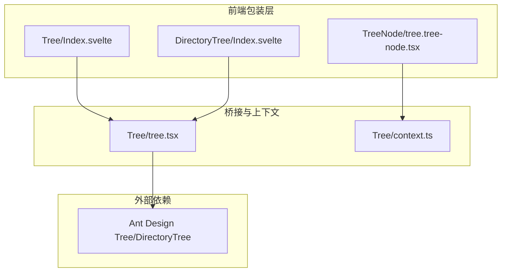
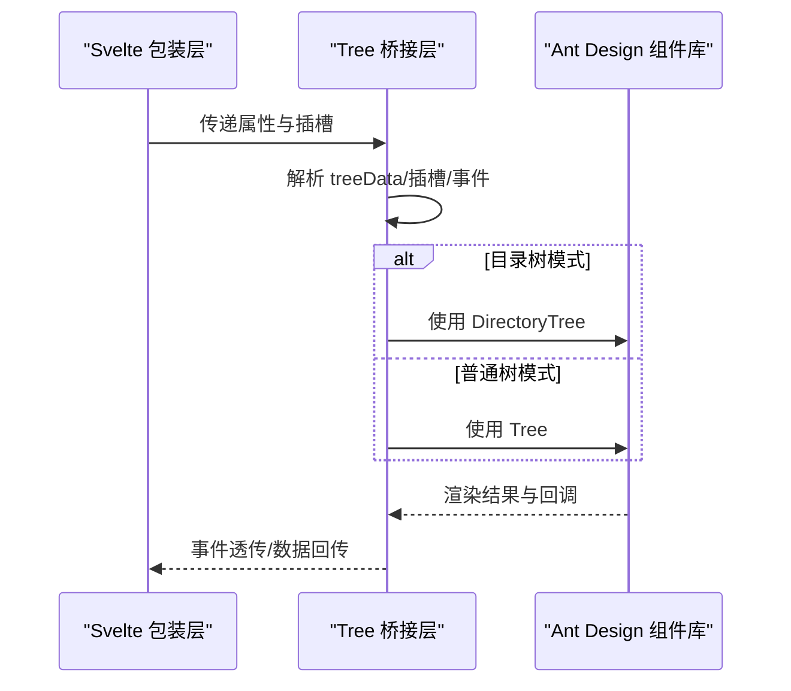
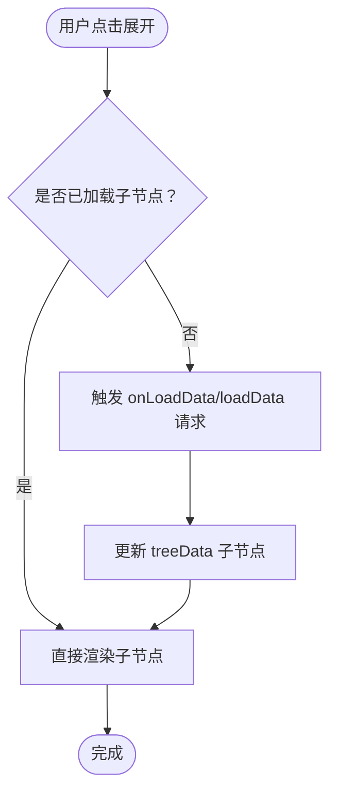
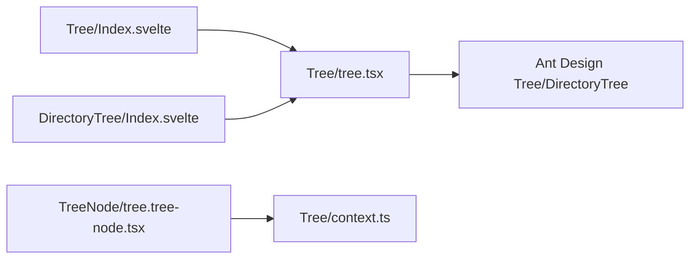

# 树形控件组件

<cite>
**本文引用的文件**
- [tree.tsx](file://frontend/antd/tree/tree.tsx)
- [Index.svelte](file://frontend/antd/tree/Index.svelte)
- [context.ts](file://frontend/antd/tree/context.ts)
- [tree.tree-node.tsx](file://frontend/antd/tree/tree-node/tree.tree-node.tsx)
- [directory-tree/Index.svelte](file://frontend/antd/tree/directory-tree/Index.svelte)
- [folder.tsx](file://frontend/antdx/folder/folder.tsx)
- [context.ts（文件夹上下文）](file://frontend/antdx/folder/context.ts)
</cite>

## 目录

1. [简介](#简介)
2. [项目结构](#项目结构)
3. [核心组件](#核心组件)
4. [架构总览](#架构总览)
5. [详细组件分析](#详细组件分析)
6. [依赖关系分析](#依赖关系分析)
7. [性能考量](#性能考量)
8. [故障排查指南](#故障排查指南)
9. [结论](#结论)
10. [附录](#附录)

## 简介

本文件系统性梳理树形控件（Tree）组件的设计与实现，覆盖基础结构、节点展开/收起、目录树（DirectoryTree）的特殊能力、异步加载数据源、选择模式与多选/半选、禁用配置、搜索过滤、节点拖拽、右键菜单、批量操作、虚拟滚动与大数据优化、动态增删改查，以及在文件管理、组织架构与分类体系中的典型应用与性能策略。

## 项目结构

树形控件由 Svelte 前端包装层与 React 组件桥接层组成，并通过“项上下文”机制支持树节点的声明式嵌套与数据注入。目录树作为树的特化形态，复用同一桥接层并启用目录树组件。

图表来源

- [Index.svelte:1-80](file://frontend/antd/tree/Index.svelte#L1-L80)
- [directory-tree/Index.svelte:1-83](file://frontend/antd/tree/directory-tree/Index.svelte#L1-L83)
- [tree.tree-node.tsx:1-22](file://frontend/antd/tree/tree-node/tree.tree-node.tsx#L1-L22)
- [tree.tsx:1-150](file://frontend/antd/tree/tree.tsx#L1-L150)
- [context.ts:1-7](file://frontend/antd/tree/context.ts#L1-L7)

章节来源

- [Index.svelte:1-80](file://frontend/antd/tree/Index.svelte#L1-L80)
- [directory-tree/Index.svelte:1-83](file://frontend/antd/tree/directory-tree/Index.svelte#L1-L83)
- [tree.tsx:1-150](file://frontend/antd/tree/tree.tsx#L1-L150)
- [context.ts:1-7](file://frontend/antd/tree/context.ts#L1-L7)

## 核心组件

- Tree 包装器：负责将 Ant Design 的 Tree/DirectoryTree 桥接到 Svelte 生态，支持插槽扩展、事件透传、异步加载、拖拽与标题渲染等。
- Tree 节点：通过 ItemHandler 将子节点以“default”插槽注入，形成树形嵌套。
- 目录树：在 Tree 基础上启用目录树模式，提供文件夹风格的交互与行为。
- 项上下文：统一管理树节点与目录图标等“项”的收集与注入。

章节来源

- [tree.tsx:14-148](file://frontend/antd/tree/tree.tsx#L14-L148)
- [tree.tree-node.tsx:7-18](file://frontend/antd/tree/tree-node/tree.tree-node.tsx#L7-L18)
- [directory-tree/Index.svelte:65-82](file://frontend/antd/tree/directory-tree/Index.svelte#L65-L82)
- [context.ts:3-4](file://frontend/antd/tree/context.ts#L3-L4)

## 架构总览

下图展示从 Svelte 到 React 的调用链路，以及目录树与普通树的切换逻辑。

图表来源

- [tree.tsx:52-115](file://frontend/antd/tree/tree.tsx#L52-L115)
- [Index.svelte:67-78](file://frontend/antd/tree/Index.svelte#L67-L78)
- [directory-tree/Index.svelte:66-81](file://frontend/antd/tree/directory-tree/Index.svelte#L66-L81)

## 详细组件分析

### 基础结构与数据模型

- 数据源来源
  - 显式 treeData：直接传入 AntD 所需的树节点数组。
  - 插槽 treeData/default：通过项上下文收集子节点，自动转换为 treeData。
- 关键字段
  - 标识与层级：key/value/title 等用于标识与显示。
  - 展开状态：expandedKeys 控制初始展开；onExpand 回调响应用户操作。
  - 选择与勾选：selectedKeys/checkedKeys 支持单选/多选；半选通过内部算法计算。
  - 禁用：disabled 字段禁用节点交互。
- 插槽扩展
  - switcherIcon/switcherLoadingIcon：自定义展开/加载图标。
  - showLine.showLeafIcon：自定义连线末端图标。
  - icon：节点图标。
  - draggable.icon/nodeDraggable：拖拽图标与节点级可拖拽开关。
  - titleRender：自定义标题渲染函数。

章节来源

- [tree.tsx:56-126](file://frontend/antd/tree/tree.tsx#L56-L126)
- [context.ts:3-4](file://frontend/antd/tree/context.ts#L3-L4)

### 展开/收起与异步加载

- 展开/收起
  - 通过 onExpand 获取当前展开集合，结合 treeData 的 children 实现层级展开。
- 异步加载
  - 通过 loadData/onLoadData 提供懒加载钩子，按需请求子节点数据。
  - 目录树模式下同样支持异步加载，适合大目录场景。

图表来源

- [tree.tsx:114-114](file://frontend/antd/tree/tree.tsx#L114-L114)
- [tree.tsx:137-139](file://frontend/antd/tree/tree.tsx#L137-L139)

章节来源

- [tree.tsx:38-42](file://frontend/antd/tree/tree.tsx#L38-L42)
- [tree.tsx:114-114](file://frontend/antd/tree/tree.tsx#L114-L114)

### 目录树（DirectoryTree）特殊功能

- 模式切换
  - 通过 directory 属性在 Tree 与 DirectoryTree 之间切换。
- 事件映射
  - dragStart/dragEnter/dragOver/dragLeave/dragEnd：拖拽生命周期事件。
  - rightClick：右键菜单触发。
  - loadData：目录树专用的懒加载钩子。
- 文件夹风格
  - 更贴合文件系统浏览体验，支持目录层级与图标映射。

章节来源

- [tree.tsx:52-52](file://frontend/antd/tree/tree.tsx#L52-L52)
- [directory-tree/Index.svelte:18-25](file://frontend/antd/tree/directory-tree/Index.svelte#L18-L25)
- [directory-tree/Index.svelte:50-58](file://frontend/antd/tree/directory-tree/Index.svelte#L50-L58)

### 选择模式、多选与半选

- 单选/多选
  - 通过 selectedKeys/onChange 实现单选或多选。
- 多选联动
  - 勾选父节点影响子节点；取消勾选影响父节点状态。
- 半选状态
  - 当子节点部分被勾选时，父节点呈现半选态，用于快速识别部分选择。
- 禁用节点
  - disabled 字段阻止节点被选择或勾选。

章节来源

- [tree.tsx:134-142](file://frontend/antd/tree/tree.tsx#L134-L142)

### 搜索过滤

- 过滤函数
  - filterTreeNode 接受节点与输入值，返回布尔决定是否显示。
- 实践建议
  - 结合展开状态与高亮显示匹配项，提升可发现性。

章节来源

- [tree.tsx:132-132](file://frontend/antd/tree/tree.tsx#L132-L132)

### 节点拖拽

- 拖拽开关
  - draggable 可为布尔或对象；nodeDraggable 支持节点级可拖拽。
- 图标定制
  - draggable.icon 自定义拖拽手柄图标。
- 事件透传
  - dragStart/dragEnd 等事件由底层组件触发，便于业务侧接入。

章节来源

- [tree.tsx:102-112](file://frontend/antd/tree/tree.tsx#L102-L112)
- [tree.tsx:48-50](file://frontend/antd/tree/tree.tsx#L48-L50)

### 右键菜单与批量操作

- 右键菜单
  - rightClick 事件可用于弹出上下文菜单。
- 批量操作
  - 结合多选与右键菜单，实现复制、移动、删除等批量动作。
- 安全性
  - 对禁用节点进行拦截，避免误操作。

章节来源

- [directory-tree/Index.svelte:23-23](file://frontend/antd/tree/directory-tree/Index.svelte#L23-L23)
- [tree.tsx:134-142](file://frontend/antd/tree/tree.tsx#L134-L142)

### 动态增删改查

- 新增/修改
  - 更新 treeData 或通过受控方式维护 selectedKeys/checkedKeys。
- 删除
  - 移除对应节点并同步清理选中状态。
- 查询
  - 通过 filterTreeNode 与搜索输入联动，实现即时筛选。

章节来源

- [tree.tsx:59-79](file://frontend/antd/tree/tree.tsx#L59-L79)

### 虚拟滚动与大数据优化

- 虚拟滚动
  - 在超大树中启用虚拟滚动可显著降低 DOM 数量，提升渲染性能。
- 其他优化
  - 懒加载（loadData/onLoadData）仅渲染可见层级。
  - 合理使用 disabled 与隐藏节点减少渲染负担。
  - 避免频繁重算 treeData，尽量使用浅比较与缓存。

章节来源

- [tree.tsx:114-114](file://frontend/antd/tree/tree.tsx#L114-L114)

### 应用场景与最佳实践

- 文件管理
  - 目录树 + 拖拽 + 右键菜单 + 异步加载，构建类文件浏览器。
- 组织架构
  - 以部门/团队为节点，支持折叠与搜索，便于导航。
- 分类体系
  - 多级分类树，结合半选与批量操作，提升编辑效率。

章节来源

- [directory-tree/Index.svelte:65-82](file://frontend/antd/tree/directory-tree/Index.svelte#L65-L82)
- [tree.tsx:52-52](file://frontend/antd/tree/tree.tsx#L52-L52)

## 依赖关系分析

- 组件耦合
  - Tree/Index.svelte 与 DirectoryTree/Index.svelte 均依赖 Tree 桥接层。
  - Tree 节点通过 ItemHandler 注入到上下文，形成树形嵌套。
- 外部依赖
  - Ant Design Tree/DirectoryTree 提供核心交互与渲染。
- 插槽与事件
  - 通过 slots 与事件透传实现高度可定制。

图表来源

- [Index.svelte:10-10](file://frontend/antd/tree/Index.svelte#L10-L10)
- [directory-tree/Index.svelte:10-10](file://frontend/antd/tree/directory-tree/Index.svelte#L10-L10)
- [tree.tsx:1-11](file://frontend/antd/tree/tree.tsx#L1-L11)
- [tree.tree-node.tsx:5-5](file://frontend/antd/tree/tree-node/tree.tree-node.tsx#L5-L5)
- [context.ts:3-4](file://frontend/antd/tree/context.ts#L3-L4)

章节来源

- [Index.svelte:1-80](file://frontend/antd/tree/Index.svelte#L1-L80)
- [directory-tree/Index.svelte:1-83](file://frontend/antd/tree/directory-tree/Index.svelte#L1-L83)
- [tree.tsx:1-150](file://frontend/antd/tree/tree.tsx#L1-L150)
- [tree.tree-node.tsx:1-22](file://frontend/antd/tree/tree-node/tree.tree-node.tsx#L1-L22)
- [context.ts:1-7](file://frontend/antd/tree/context.ts#L1-L7)

## 性能考量

- 渲染优化
  - 使用虚拟滚动与懒加载，避免一次性渲染大量节点。
- 数据结构
  - treeData 保持扁平化与稳定引用，减少不必要的重渲染。
- 事件节流
  - 对高频事件（如拖拽、滚动）进行节流/防抖。
- 选择与半选
  - 合理使用 checkedKeys 与半选状态，避免逐层递归计算。

## 故障排查指南

- 无法展开节点
  - 检查是否正确设置 treeData 的 children 或是否实现了异步加载。
- 拖拽无效
  - 确认 draggable 为对象且包含 nodeDraggable 或 draggable.icon 已正确注入。
- 右键菜单不出现
  - 确认 rightClick 事件已绑定并在目录树模式下生效。
- 选择状态异常
  - 检查 selectedKeys/checkedKeys 是否与 treeData 同步更新。

章节来源

- [tree.tsx:102-112](file://frontend/antd/tree/tree.tsx#L102-L112)
- [tree.tsx:134-142](file://frontend/antd/tree/tree.tsx#L134-L142)
- [directory-tree/Index.svelte:23-23](file://frontend/antd/tree/directory-tree/Index.svelte#L23-L23)

## 结论

该树形控件通过 Svelte 包装层与 React 桥接层的组合，提供了对 Ant Design Tree/DirectoryTree 的完整封装，具备良好的扩展性与可定制性。配合异步加载、虚拟滚动与丰富的交互能力，适用于文件管理、组织架构与分类体系等复杂场景。

## 附录

- 目录树与文件夹组件的关系
  - 目录树（DirectoryTree）用于树的目录模式；文件夹组件（antdx/folder）提供更丰富的文件系统能力（如图标映射、内容服务），两者可互补使用。

章节来源

- [directory-tree/Index.svelte:65-82](file://frontend/antd/tree/directory-tree/Index.svelte#L65-L82)
- [folder.tsx:48-86](file://frontend/antdx/folder/folder.tsx#L48-L86)
- [context.ts（文件夹上下文）:3-13](file://frontend/antdx/folder/context.ts#L3-L13)
