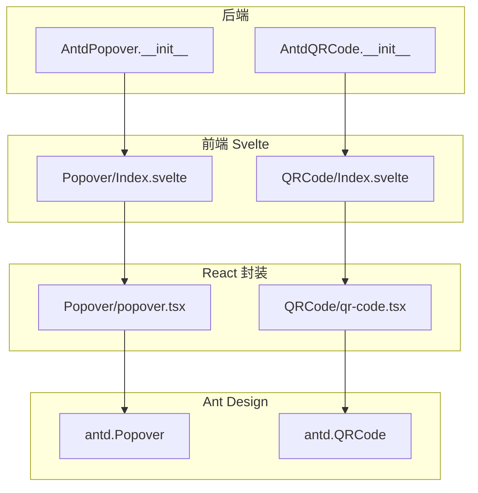
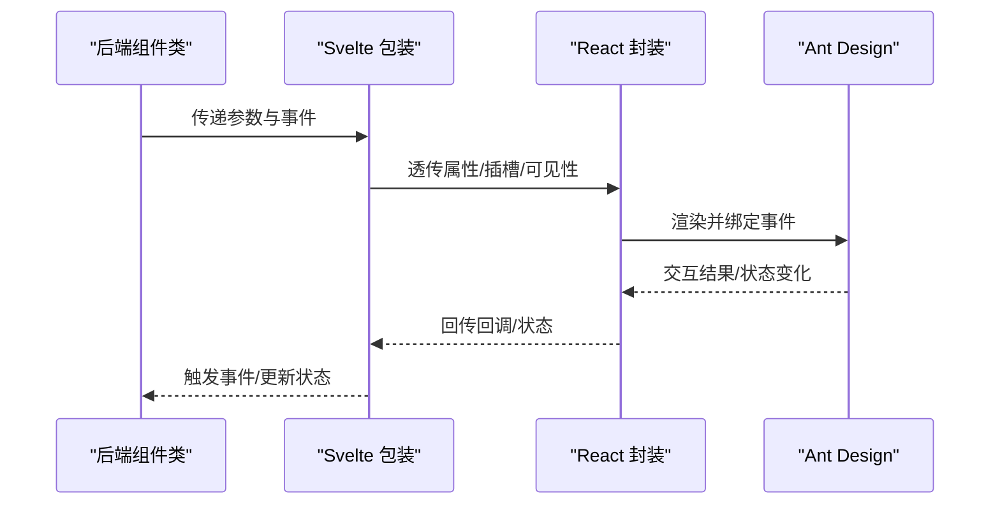
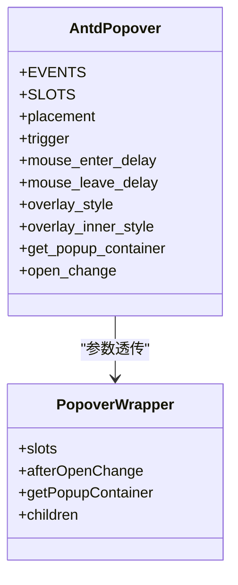
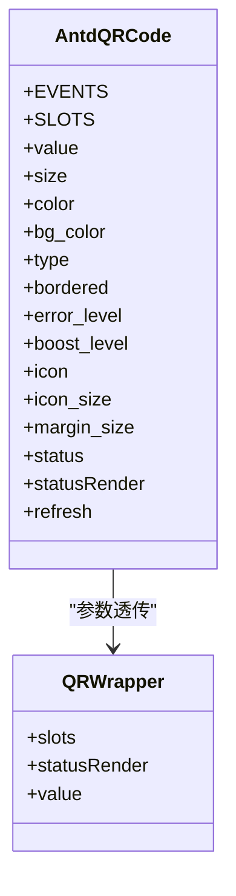
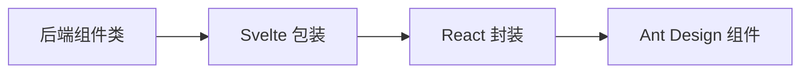

# 气泡卡片与二维码组件

<cite>
**本文档引用的文件**
- [popover.tsx](file://frontend/antd/popover/popover.tsx)
- [Index.svelte（Popover）](file://frontend/antd/popover/Index.svelte)
- [__init__.py（AntdPopover）](file://backend/modelscope_studio/components/antd/popover/__init__.py)
- [README-zh_CN.md（Popover 文档）](file://docs/components/antd/popover/README-zh_CN.md)
- [README.md（Popover 文档）](file://docs/components/antd/popover/README.md)
- [qr-code.tsx](file://frontend/antd/qr-code/qr-code.tsx)
- [Index.svelte（QRCode）](file://frontend/antd/qr-code/Index.svelte)
- [__init__.py（AntdQRCode）](file://backend/modelscope_studio/components/antd/qr_code/__init__.py)
- [README-zh_CN.md（QRCode 文档）](file://docs/components/antd/qr_code/README-zh_CN.md)
- [README.md（QRCode 文档）](file://docs/components/antd/qr_code/README.md)
</cite>

## 目录

1. [简介](#简介)
2. [项目结构](#项目结构)
3. [核心组件](#核心组件)
4. [架构总览](#架构总览)
5. [详细组件分析](#详细组件分析)
6. [依赖关系分析](#依赖关系分析)
7. [性能考虑](#性能考虑)
8. [故障排查指南](#故障排查指南)
9. [结论](#结论)
10. [附录](#附录)

## 简介

本文件面向气泡卡片（Popover）与二维码（QRCode）两个组件，提供从底层实现到上层使用的完整说明。内容覆盖：

- 气泡卡片：触发方式、位置控制、内容定制、动画联动、嵌套使用、延迟显示、无障碍支持等
- 二维码：编码内容、尺寸与边距、颜色与背景、错误纠正级别、图标叠加、动态刷新、自定义样式与打印优化
- 复杂布局定位策略与移动端扫描体验建议

## 项目结构

这两个组件遵循统一的“后端组件类 + 前端 Svelte 包装 + React 封装”的分层设计：

- 后端组件类负责参数校验、事件绑定、示例值与渲染开关
- 前端 Svelte 层负责属性透传、插槽处理、可见性控制
- React 封装层负责与 Ant Design 组件桥接，并支持插槽与函数回调转换

图表来源

- [**init**.py（AntdPopover）:10-124](file://backend/modelscope_studio/components/antd/popover/__init__.py#L10-L124)
- [Index.svelte（Popover）:10-72](file://frontend/antd/popover/Index.svelte#L10-L72)
- [popover.tsx:7-34](file://frontend/antd/popover/popover.tsx#L7-L34)
- [**init**.py（AntdQRCode）:10-96](file://backend/modelscope_studio/components/antd/qr_code/__init__.py#L10-L96)
- [Index.svelte（QRCode）:10-63](file://frontend/antd/qr-code/Index.svelte#L10-L63)
- [qr-code.tsx:6-20](file://frontend/antd/qr-code/qr-code.tsx#L6-L20)

章节来源

- [**init**.py（AntdPopover）:10-124](file://backend/modelscope_studio/components/antd/popover/__init__.py#L10-L124)
- [Index.svelte（Popover）:10-72](file://frontend/antd/popover/Index.svelte#L10-L72)
- [popover.tsx:7-34](file://frontend/antd/popover/popover.tsx#L7-L34)
- [**init**.py（AntdQRCode）:10-96](file://backend/modelscope_studio/components/antd/qr_code/__init__.py#L10-L96)
- [Index.svelte（QRCode）:10-63](file://frontend/antd/qr-code/Index.svelte#L10-L63)
- [qr-code.tsx:6-20](file://frontend/antd/qr-code/qr-code.tsx#L6-L20)

## 核心组件

- 气泡卡片（Popover）
  - 支持多种触发方式：悬停、聚焦、点击、右键菜单
  - 支持 12 种方位放置：上下左右及四个角
  - 支持标题与内容插槽，可注入任意内容
  - 支持打开状态变更事件绑定
  - 支持容器挂载点自定义与延迟显示控制
- 二维码（QRCode）
  - 支持 canvas/svg 两种输出类型
  - 支持前景色、背景色、边框、图标叠加、边距
  - 支持 L/M/Q/H 四级错误纠正
  - 支持状态渲染插槽与刷新事件绑定

章节来源

- [**init**.py（AntdPopover）:43-59](file://backend/modelscope_studio/components/antd/popover/__init__.py#L43-L59)
- [**init**.py（AntdQRCode）:29-40](file://backend/modelscope_studio/components/antd/qr_code/__init__.py#L29-L40)

## 架构总览

下图展示从后端组件类到前端 Svelte 包装再到 React 封装与 Ant Design 的调用链路。

图表来源

- [**init**.py（AntdPopover）:14-18](file://backend/modelscope_studio/components/antd/popover/__init__.py#L14-L18)
- [Index.svelte（Popover）:24-52](file://frontend/antd/popover/Index.svelte#L24-L52)
- [popover.tsx:10-34](file://frontend/antd/popover/popover.tsx#L10-L34)
- [**init**.py（AntdQRCode）:15-19](file://backend/modelscope_studio/components/antd/qr_code/__init__.py#L15-L19)
- [Index.svelte（QRCode）:22-45](file://frontend/antd/qr-code/Index.svelte#L22-L45)
- [qr-code.tsx:6-20](file://frontend/antd/qr-code/qr-code.tsx#L6-L20)

## 详细组件分析

### 气泡卡片（Popover）组件

- 触发方式
  - 支持 hover/focus/click/contextMenu 及其组合
  - 可通过延迟参数控制进入/离开时延
- 位置控制
  - 支持 top/left/right/bottom 及九宫格角位
  - 支持溢出自动调整与箭头配置
- 内容定制
  - 支持 title/content 插槽，可渲染任意内容
  - 支持覆盖层样式与内部样式
- 动画与事件
  - 提供 open_change 事件用于监听打开状态变化
  - 支持容器挂载点自定义，便于在复杂布局中定位
- 嵌套使用
  - 通过自定义容器挂载点避免层级遮挡
  - 注意避免多层弹出同时激活导致的焦点问题
- 延迟显示
  - 使用进入/离开时延参数控制显示节奏
- 无障碍支持
  - 建议配合 aria-\* 属性与键盘导航
  - 在嵌套场景中注意标签与描述文本的语义化

图表来源

- [**init**.py（AntdPopover）:14-105](file://backend/modelscope_studio/components/antd/popover/__init__.py#L14-L105)
- [popover.tsx:10-34](file://frontend/antd/popover/popover.tsx#L10-L34)

章节来源

- [**init**.py（AntdPopover）:23-105](file://backend/modelscope_studio/components/antd/popover/__init__.py#L23-L105)
- [Index.svelte（Popover）:24-52](file://frontend/antd/popover/Index.svelte#L24-L52)
- [popover.tsx:10-34](file://frontend/antd/popover/popover.tsx#L10-L34)
- [README-zh_CN.md（Popover 文档）:1-8](file://docs/components/antd/popover/README-zh_CN.md#L1-L8)
- [README.md（Popover 文档）:1-8](file://docs/components/antd/popover/README.md#L1-L8)

### 二维码（QRCode）组件

- 编码内容与尺寸
  - value：二维码编码内容
  - size：整体尺寸；margin_size：外边距；bordered：是否显示边框
- 颜色与样式
  - color：前景色；bg_color：背景色；type：canvas/svg 输出
- 错误纠正与增强
  - error_level：L/M/Q/H 四级纠错
  - boost_level：提升识别能力（布尔）
- 图标叠加与状态
  - icon：中心图标地址；icon_size：图标尺寸或尺寸配置
  - status：active/expired/loading/scanned 状态
  - statusRender：状态渲染插槽
- 动态更新与事件
  - refresh 事件：用于触发重新生成二维码
- 自定义样式与打印优化
  - 通过样式与类名进行主题适配
  - 打印场景建议固定尺寸与高对比度色彩

图表来源

- [**init**.py（AntdQRCode）:15-77](file://backend/modelscope_studio/components/antd/qr_code/__init__.py#L15-L77)
- [qr-code.tsx:6-20](file://frontend/antd/qr-code/qr-code.tsx#L6-L20)

章节来源

- [**init**.py（AntdQRCode）:24-77](file://backend/modelscope_studio/components/antd/qr_code/__init__.py#L24-L77)
- [Index.svelte（QRCode）:22-45](file://frontend/antd/qr-code/Index.svelte#L22-L45)
- [qr-code.tsx:6-20](file://frontend/antd/qr-code/qr-code.tsx#L6-L20)
- [README-zh_CN.md（QRCode 文档）:1-8](file://docs/components/antd/qr_code/README-zh_CN.md#L1-L8)
- [README.md（QRCode 文档）:1-8](file://docs/components/antd/qr_code/README.md#L1-L8)

## 依赖关系分析

- 后端组件类与前端包装
  - 后端类定义参数与事件，前端 Svelte 负责属性与插槽的最终拼装
- React 封装与 Ant Design
  - React 封装层将插槽转换为可渲染节点，并将回调函数安全地传递给 Ant Design 组件
- 事件绑定
  - 气泡卡片：open_change
  - 二维码：refresh

图表来源

- [**init**.py（AntdPopover）:14-18](file://backend/modelscope_studio/components/antd/popover/__init__.py#L14-L18)
- [Index.svelte（Popover）:24-52](file://frontend/antd/popover/Index.svelte#L24-L52)
- [popover.tsx:10-34](file://frontend/antd/popover/popover.tsx#L10-L34)
- [**init**.py（AntdQRCode）:15-19](file://backend/modelscope_studio/components/antd/qr_code/__init__.py#L15-L19)
- [Index.svelte（QRCode）:22-45](file://frontend/antd/qr-code/Index.svelte#L22-L45)
- [qr-code.tsx:6-20](file://frontend/antd/qr-code/qr-code.tsx#L6-L20)

章节来源

- [**init**.py（AntdPopover）:14-18](file://backend/modelscope_studio/components/antd/popover/__init__.py#L14-L18)
- [Index.svelte（Popover）:24-52](file://frontend/antd/popover/Index.svelte#L24-L52)
- [popover.tsx:10-34](file://frontend/antd/popover/popover.tsx#L10-L34)
- [**init**.py（AntdQRCode）:15-19](file://backend/modelscope_studio/components/antd/qr_code/__init__.py#L15-L19)
- [Index.svelte（QRCode）:22-45](file://frontend/antd/qr-code/Index.svelte#L22-L45)
- [qr-code.tsx:6-20](file://frontend/antd/qr-code/qr-code.tsx#L6-L20)

## 性能考虑

- 气泡卡片
  - 合理设置触发方式与延迟，避免频繁重渲染
  - 复杂内容建议懒加载或按需渲染
  - 容器挂载点应尽量靠近目标元素，减少 DOM 层级
- 二维码
  - canvas 输出在大尺寸时可能带来内存压力，必要时选择 svg 或降低 size
  - 图标叠加会增加渲染开销，建议使用轻量图标
  - 状态渲染插槽仅在需要时启用，避免不必要的计算

## 故障排查指南

- 气泡卡片
  - 打开状态不生效：检查 open_change 事件绑定与 open 参数
  - 内容不显示：确认 title/content 插槽是否正确传递
  - 定位异常：检查 get_popup_container 是否返回有效容器
- 二维码
  - 无法刷新：确认 refresh 事件是否绑定成功
  - 样式不生效：检查 color/bg_color 与 type 设置是否合理
  - 扫描困难：提高 error_level 或开启 boost_level

章节来源

- [**init**.py（AntdPopover）:14-18](file://backend/modelscope_studio/components/antd/popover/__init__.py#L14-L18)
- [Index.svelte（Popover）:24-52](file://frontend/antd/popover/Index.svelte#L24-L52)
- [**init**.py（AntdQRCode）:15-19](file://backend/modelscope_studio/components/antd/qr_code/__init__.py#L15-L19)
- [Index.svelte（QRCode）:22-45](file://frontend/antd/qr-code/Index.svelte#L22-L45)

## 结论

- 气泡卡片与二维码均采用一致的三层封装模式，具备良好的扩展性与可控性
- 气泡卡片侧重交互与布局，二维码侧重数据与视觉表现
- 建议在复杂布局与移动端场景中结合本文档提供的策略与注意事项进行优化

## 附录

- 示例入口参考
  - 气泡卡片示例：[README-zh_CN.md（Popover 文档）](file://docs/components/antd/popover/README-zh_CN.md#L7)
  - 二维码示例：[README-zh_CN.md（QRCode 文档）](file://docs/components/antd/qr_code/README-zh_CN.md#L7)
