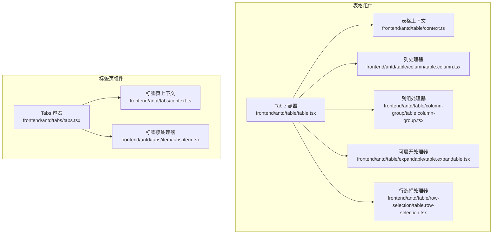
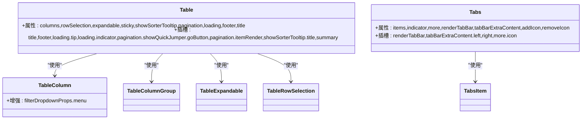
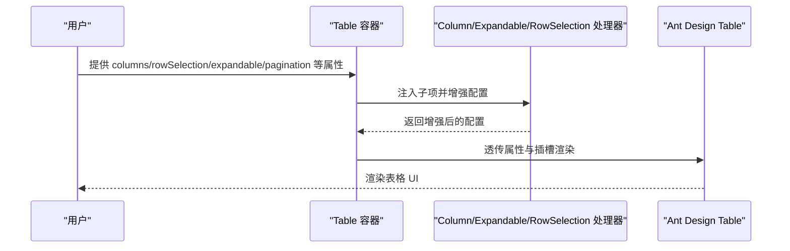
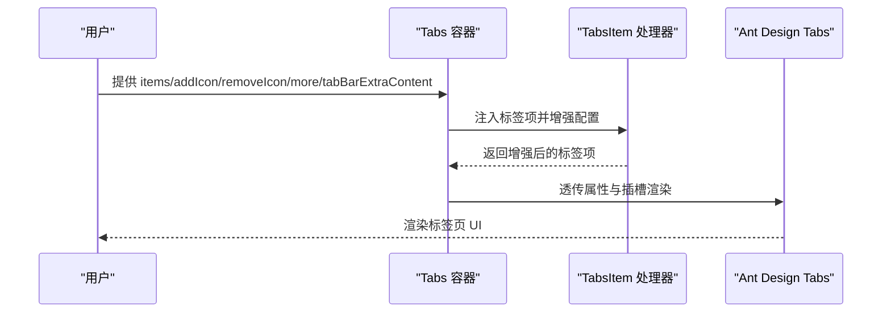
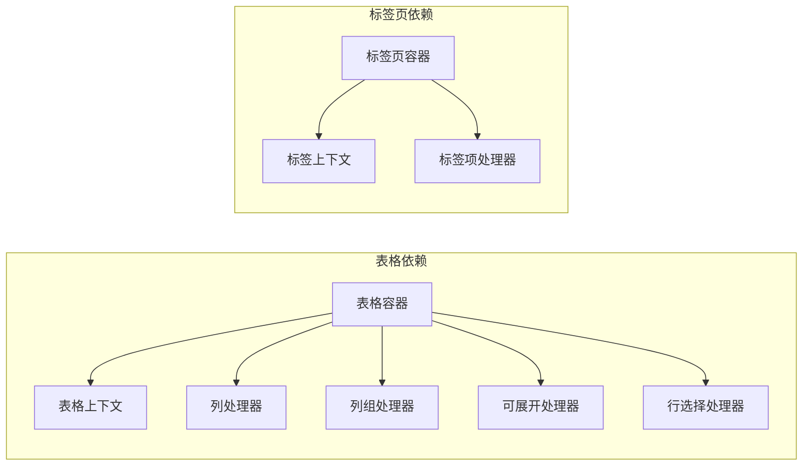

# 表格与标签页组件

<cite>
**本文档引用的文件**
- [table.tsx](file://frontend/antd/table/table.tsx)
- [context.ts](file://frontend/antd/table/context.ts)
- [table.column.tsx](file://frontend/antd/table/column/table.column.tsx)
- [table.column-group.tsx](file://frontend/antd/table/column-group/table.column-group.tsx)
- [table.expandable.tsx](file://frontend/antd/table/expandable/table.expandable.tsx)
- [table.row-selection.tsx](file://frontend/antd/table/row-selection/table.row-selection.tsx)
- [tabs.tsx](file://frontend/antd/tabs/tabs.tsx)
- [tabs.context.ts](file://frontend/antd/tabs/context.ts)
- [tabs.item.tsx](file://frontend/antd/tabs/item/tabs.item.tsx)
</cite>

## 目录

1. [简介](#简介)
2. [项目结构](#项目结构)
3. [核心组件](#核心组件)
4. [架构总览](#架构总览)
5. [详细组件分析](#详细组件分析)
6. [依赖关系分析](#依赖关系分析)
7. [性能考虑](#性能考虑)
8. [故障排除指南](#故障排除指南)
9. [结论](#结论)
10. [附录](#附录)

## 简介

本文件面向表格（Table）与标签页（Tabs）两大组件体系，系统性梳理其高级能力与工程化实现方式。重点覆盖表格的列定义（column）、列组（column_group）、可展开行（expandable）与行选择（row_selection）；以及标签页的标签项（item）、位置控制、禁用状态与动态增删。同时提供大数据量处理、虚拟滚动、排序筛选与分页集成的实践建议；并涵盖标签页的内容懒加载、标签图标、关闭按钮与拖拽重排的扩展思路。最后给出响应式设计与复杂布局中的导航策略。

## 项目结构

两个组件均采用“容器组件 + 子项处理器”的分层设计：

- 容器组件负责属性透传、插槽渲染、上下文合并与函数包装；
- 子项处理器（如 TableColumn、TabsItem 等）负责将子级元素注入到容器中，并在必要时对配置进行增强（如菜单、下拉、图标等）。

**图表来源**

- [table.tsx:28-276](file://frontend/antd/table/table.tsx#L28-L276)
- [context.ts](file://frontend/antd/table/context.ts)
- [table.column.tsx:20-97](file://frontend/antd/table/column/table.column.tsx#L20-L97)
- [table.column-group.tsx:7-19](file://frontend/antd/table/column-group/table.column-group.tsx#L7-L19)
- [table.expandable.tsx:7-11](file://frontend/antd/table/expandable/table.expandable.tsx#L7-L11)
- [table.row-selection.tsx:13-35](file://frontend/antd/table/row-selection/table.row-selection.tsx#L13-L35)
- [tabs.tsx:12-118](file://frontend/antd/tabs/tabs.tsx#L12-L118)
- [tabs.context.ts](file://frontend/antd/tabs/context.ts)
- [tabs.item.tsx:7-11](file://frontend/antd/tabs/item/tabs.item.tsx#L7-L11)

**章节来源**

- [table.tsx:28-276](file://frontend/antd/table/table.tsx#L28-L276)
- [tabs.tsx:12-118](file://frontend/antd/tabs/tabs.tsx#L12-L118)

## 核心组件

- 表格容器：负责 columns、rowSelection、expandable、sticky、showSorterTooltip、pagination、loading、footer、title 等属性的统一处理与插槽渲染。
- 列处理器：增强列配置，支持过滤下拉菜单、自定义弹窗渲染、菜单扩展图标与溢出指示器。
- 列组处理器：将一组列作为逻辑分组，便于表头合并与样式控制。
- 可展开处理器：将展开区域配置注入表格。
- 行选择处理器：将自定义选择项（如“全选”、“反选”）注入 rowSelection。
- 标签页容器：负责 items、indicator、renderTabBar、more、tabBarExtraContent、addIcon、removeIcon 等属性的统一处理与插槽渲染。
- 标签项处理器：将单个标签项注入 Tabs 的 items。

**章节来源**

- [table.tsx:28-276](file://frontend/antd/table/table.tsx#L28-L276)
- [table.column.tsx:20-97](file://frontend/antd/table/column/table.column.tsx#L20-L97)
- [table.column-group.tsx:7-19](file://frontend/antd/table/column-group/table.column-group.tsx#L7-L19)
- [table.expandable.tsx:7-11](file://frontend/antd/table/expandable/table.expandable.tsx#L7-L11)
- [table.row-selection.tsx:13-35](file://frontend/antd/table/row-selection/table.row-selection.tsx#L13-L35)
- [tabs.tsx:12-118](file://frontend/antd/tabs/tabs.tsx#L12-L118)
- [tabs.item.tsx:7-11](file://frontend/antd/tabs/item/tabs.item.tsx#L7-L11)

## 架构总览

下图展示表格与标签页容器与其子项处理器之间的依赖关系与职责划分。

**图表来源**

- [table.tsx:28-276](file://frontend/antd/table/table.tsx#L28-L276)
- [table.column.tsx:20-97](file://frontend/antd/table/column/table.column.tsx#L20-L97)
- [table.column-group.tsx:7-19](file://frontend/antd/table/column-group/table.column-group.tsx#L7-L19)
- [table.expandable.tsx:7-11](file://frontend/antd/table/expandable/table.expandable.tsx#L7-L11)
- [table.row-selection.tsx:13-35](file://frontend/antd/table/row-selection/table.row-selection.tsx#L13-L35)
- [tabs.tsx:12-118](file://frontend/antd/tabs/tabs.tsx#L12-L118)
- [tabs.item.tsx:7-11](file://frontend/antd/tabs/item/tabs.item.tsx#L7-L11)

## 详细组件分析

### 表格组件（Table）

- 列定义（column）
  - 支持直接传入 columns 或通过 TableColumn 注入；
  - 对特殊占位符（如 EXPAND_COLUMN、SELECTION_COLUMN）进行识别与转换；
  - 增强 filterDropdownProps，支持菜单项、下拉渲染、弹窗渲染、菜单扩展图标与溢出指示器。
- 列组（column_group）
  - 将一组列作为逻辑分组，便于表头合并与样式控制；
  - 仅允许 default 插槽。
- 可展开行（expandable）
  - 通过 TableExpandable 注入 expandable 配置；
  - 支持自定义渲染展开内容。
- 行选择（row_selection）
  - 通过 TableRowSelection 注入 rowSelection；
  - 支持 selections 自定义选择项（如“全选”、“反选”）。
- 排序筛选与分页
  - 支持 showSorterTooltip 的插槽化标题；
  - 支持 pagination 的插槽化跳转按钮与分页渲染；
  - 支持 loading 的 tip 与 indicator 插槽；
  - 支持 sticky 的容器获取函数；
  - 支持 footer 与 summary 的插槽化渲染。
- 大数据量与虚拟滚动
  - 建议结合外部虚拟滚动方案（如固定高度 + 滚动容器）以降低 DOM 节点数量；
  - 使用 onScroll 与分页/无限滚动配合，避免一次性渲染大量行。
- 响应式设计
  - 结合 sticky 与列宽设置，在小屏设备上优先显示关键列；
  - 使用列的 responsive 配置或自定义断点策略。

**图表来源**

- [table.tsx:66-271](file://frontend/antd/table/table.tsx#L66-L271)
- [table.column.tsx:28-93](file://frontend/antd/table/column/table.column.tsx#L28-L93)
- [table.expandable.tsx:9-10](file://frontend/antd/table/expandable/table.expandable.tsx#L9-L10)
- [table.row-selection.tsx:21-32](file://frontend/antd/table/row-selection/table.row-selection.tsx#L21-L32)

**章节来源**

- [table.tsx:28-276](file://frontend/antd/table/table.tsx#L28-L276)
- [table.column.tsx:20-97](file://frontend/antd/table/column/table.column.tsx#L20-L97)
- [table.column-group.tsx:7-19](file://frontend/antd/table/column-group/table.column-group.tsx#L7-L19)
- [table.expandable.tsx:7-11](file://frontend/antd/table/expandable/table.expandable.tsx#L7-L11)
- [table.row-selection.tsx:13-35](file://frontend/antd/table/row-selection/table.row-selection.tsx#L13-L35)

### 标签页组件（Tabs）

- 标签项（item）
  - 通过 TabsItem 注入单个标签项；
  - 支持 disabled、closable、closeIcon 等基础属性。
- 位置控制与动态增删
  - 通过 items 动态数组控制标签增删；
  - indicator 控制底部条样式，支持 size 函数；
  - addIcon/removeIcon 支持插槽化图标。
- 内容懒加载
  - 建议仅在激活时渲染对应面板内容，避免一次性渲染所有面板；
  - onChange 事件中按需加载数据与组件。
- 标签图标与关闭按钮
  - 通过插槽 addIcon/removeIcon 自定义图标；
  - closable 与 closeIcon 控制是否可关闭及关闭图标。
- 拖拽重排
  - 可通过外部拖拽库与 onChange 配合实现；
  - 注意维护 items 的顺序与 activeKey 的一致性。
- 更多菜单与额外内容
  - more.icon 支持插槽化图标；
  - tabBarExtraContent 支持左右两侧插槽化内容。

**图表来源**

- [tabs.tsx:26-115](file://frontend/antd/tabs/tabs.tsx#L26-L115)
- [tabs.item.tsx:9-10](file://frontend/antd/tabs/item/tabs.item.tsx#L9-L10)

**章节来源**

- [tabs.tsx:12-118](file://frontend/antd/tabs/tabs.tsx#L12-L118)
- [tabs.item.tsx:7-11](file://frontend/antd/tabs/item/tabs.item.tsx#L7-L11)

### 复杂布局中的导航策略

- 响应式导航
  - 在窄屏设备上启用 Tabs 的更多菜单（more），将不常用标签移入下拉；
  - 使用 sticky 或固定头部，保证导航始终可见。
- 嵌套使用
  - 在标签页内嵌套子标签页或子表格，注意层级与交互冲突；
  - 使用独立的上下文与命名空间，避免事件冒泡与状态污染。
- 导航一致性
  - 统一使用 onChange 与 activeKey 管理当前激活状态；
  - 对于异步加载的数据，先显示骨架屏再切换至真实内容。

## 依赖关系分析

- 表格侧
  - Table 容器依赖上下文提供者（Column、Expandable、RowSelection）以收集子项；
  - TableColumn 增强 filterDropdownProps 并复用菜单上下文；
  - TableRowSelection 注入 selections。
- 标签页侧
  - Tabs 容器依赖 Items 上下文收集标签项；
  - TabsItem 注入单个标签项。

**图表来源**

- [context.ts](file://frontend/antd/table/context.ts)
- [table.tsx:41-275](file://frontend/antd/table/table.tsx#L41-L275)
- [tabs.context.ts](file://frontend/antd/tabs/context.ts)
- [tabs.tsx:24-117](file://frontend/antd/tabs/tabs.tsx#L24-L117)

**章节来源**

- [table.tsx:41-275](file://frontend/antd/table/table.tsx#L41-L275)
- [tabs.tsx:24-117](file://frontend/antd/tabs/tabs.tsx#L24-L117)

## 性能考虑

- 表格
  - 大数据量：固定高度 + 虚拟滚动（如外部库）减少 DOM 数量；
  - 分页/无限滚动：结合后端分页，避免一次性渲染；
  - 列渲染：仅渲染必要列，隐藏非关键列；
  - 事件绑定：使用 onRow/onHeaderRow 的节流/防抖。
- 标签页
  - 内容懒加载：仅在激活时渲染；
  - 动态增删：批量更新 items，避免频繁重渲染；
  - 图标与插槽：尽量使用轻量级组件，避免复杂计算。

## 故障排除指南

- 插槽未生效
  - 确认插槽键名与容器声明一致（如 pagination.showQuickJumper.goButton、more.icon 等）；
  - 检查插槽是否正确包裹在子项中。
- 属性未生效
  - 确认函数型属性已通过 useFunction 包装；
  - 检查对象型属性（如 sticky、showSorterTooltip、pagination）是否被正确合并。
- 样式异常
  - 检查 getPopupContainer/getContainer 是否返回正确的挂载节点；
  - 确认插槽中的 ReactSlot 渲染目标容器存在且可见。

**章节来源**

- [table.tsx:76-108](file://frontend/antd/table/table.tsx#L76-L108)
- [tabs.tsx:36-39](file://frontend/antd/tabs/tabs.tsx#L36-L39)

## 结论

本文档从架构与实现角度系统梳理了表格与标签页组件的能力边界与扩展点。通过容器组件与子项处理器的协作，实现了属性透传、插槽渲染与配置增强。结合大数据量、虚拟滚动、懒加载与响应式策略，可在复杂布局中提供稳定、可维护的导航体验。

## 附录

- 关键实现要点
  - 表格：columns、rowSelection、expandable、sticky、showSorterTooltip、pagination、loading、footer、title 的插槽化与函数包装；
  - 标签页：items、indicator、renderTabBar、more、tabBarExtraContent、addIcon、removeIcon 的插槽化与函数包装。
- 扩展建议
  - 表格：引入虚拟滚动与分页联动；根据业务场景定制列组与展开内容；
  - 标签页：结合路由与状态管理实现动态增删与持久化；支持拖拽重排与更多菜单。
