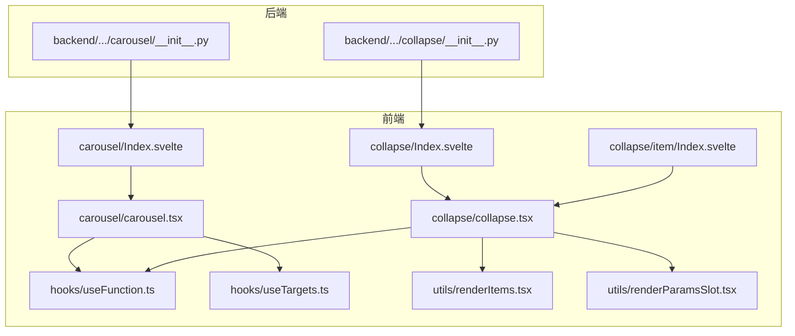
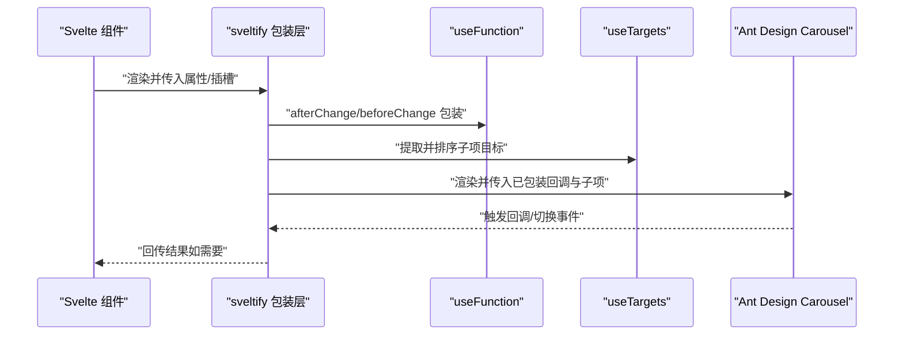
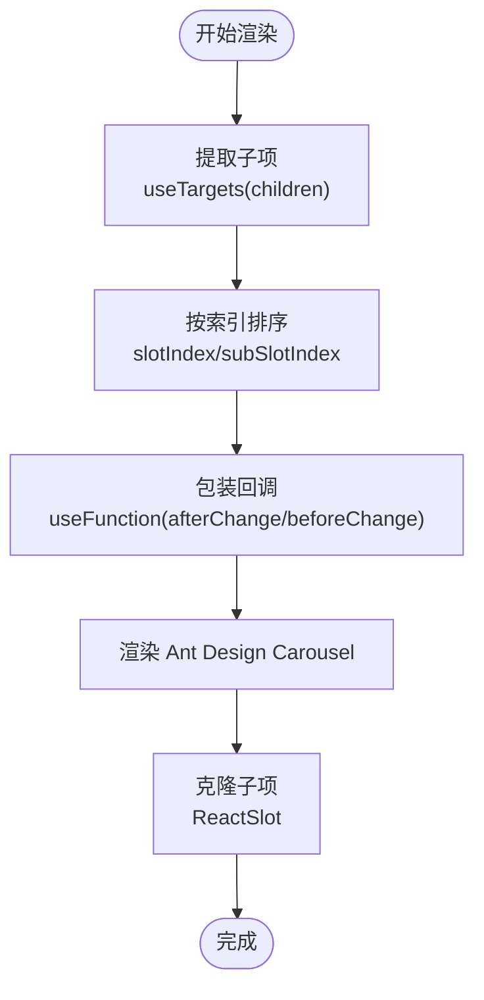
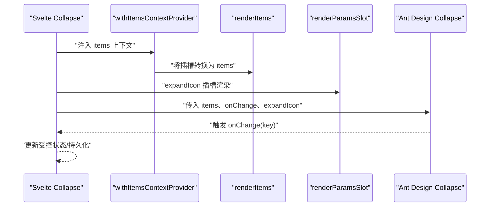
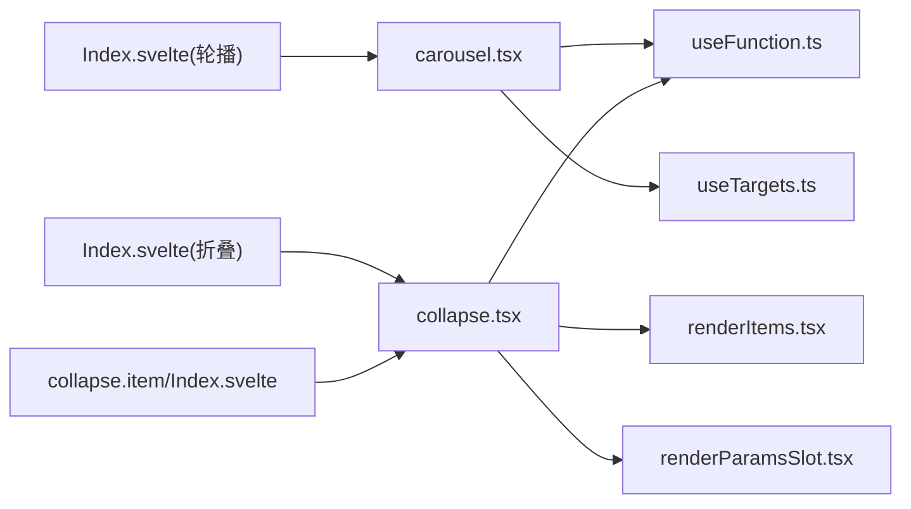

# 轮播与折叠组件

<cite>
**本文引用的文件**
- [carousel.tsx](file://frontend/antd/carousel/carousel.tsx)
- [Index.svelte](file://frontend/antd/carousel/Index.svelte)
- [useFunction.ts](file://frontend/utils/hooks/useFunction.ts)
- [useTargets.ts](file://frontend/utils/hooks/useTargets.ts)
- [renderItems.tsx](file://frontend/utils/renderItems.tsx)
- [renderParamsSlot.tsx](file://frontend/utils/renderParamsSlot.tsx)
- [collapse.tsx](file://frontend/antd/collapse/collapse.tsx)
- [Index.svelte](file://frontend/antd/collapse/Index.svelte)
- [context.ts](file://frontend/antd/collapse/context.ts)
- [collapse.item/Index.svelte](file://frontend/antd/collapse/item/Index.svelte)
- [__init__.py（carousel 后端）](file://backend/modelscope_studio/components/antd/carousel/__init__.py)
- [__init__.py（collapse 后端）](file://backend/modelscope_studio/components/antd/collapse/__init__.py)
- [basic.py（carousel 演示）](file://docs/components/antd/carousel/demos/basic.py)
</cite>

## 目录

1. [简介](#简介)
2. [项目结构](#项目结构)
3. [核心组件](#核心组件)
4. [架构总览](#架构总览)
5. [详细组件分析](#详细组件分析)
6. [依赖关系分析](#依赖关系分析)
7. [性能考量](#性能考量)
8. [故障排查指南](#故障排查指南)
9. [结论](#结论)
10. [附录](#附录)

## 简介

本文件面向“轮播（Carousel）”和“折叠面板（Collapse）”两个 Ant Design 组件，提供从架构到实现细节的系统性说明。重点覆盖：

- 轮播：自动播放、切换动画、指示器控制、垂直轮播的特殊配置；触摸滑动、键盘导航与无障碍支持的建议路径；以及与后端参数映射关系。
- 折叠面板：单项折叠的展开/收起、手风琴效果、面板内容的动态加载、折叠状态持久化；受控与非受控模式、面板标题自定义、动画效果配置。

## 项目结构

- 前端 Svelte 包装层负责属性处理、插槽渲染与条件显示。
- React 层通过 sveltify 将 Ant Design 组件桥接至 Svelte。
- 工具层提供函数包装、目标节点提取、插槽渲染等通用能力。
- 后端 Python 组件负责参数透传与前端目录解析。

**图表来源**

- [Index.svelte:1-66](file://frontend/antd/carousel/Index.svelte#L1-L66)
- [carousel.tsx:1-32](file://frontend/antd/carousel/carousel.tsx#L1-L32)
- [Index.svelte:1-66](file://frontend/antd/collapse/Index.svelte#L1-L66)
- [collapse.tsx:1-53](file://frontend/antd/collapse/collapse.tsx#L1-L53)
- [collapse.item/Index.svelte:1-95](file://frontend/antd/collapse/item/Index.svelte#L1-L95)
- [useFunction.ts:1-13](file://frontend/utils/hooks/useFunction.ts#L1-L13)
- [useTargets.ts:1-52](file://frontend/utils/hooks/useTargets.ts#L1-L52)
- [renderItems.tsx:1-114](file://frontend/utils/renderItems.tsx#L1-L114)
- [renderParamsSlot.tsx:1-51](file://frontend/utils/renderParamsSlot.tsx#L1-L51)
- [**init**.py（carousel 后端）:45-94](file://backend/modelscope_studio/components/antd/carousel/__init__.py#L45-L94)
- [**init**.py（collapse 后端）:54-98](file://backend/modelscope_studio/components/antd/collapse/__init__.py#L54-L98)

**章节来源**

- [Index.svelte:1-66](file://frontend/antd/carousel/Index.svelte#L1-L66)
- [carousel.tsx:1-32](file://frontend/antd/carousel/carousel.tsx#L1-L32)
- [Index.svelte:1-66](file://frontend/antd/collapse/Index.svelte#L1-L66)
- [collapse.tsx:1-53](file://frontend/antd/collapse/collapse.tsx#L1-L53)
- [collapse.item/Index.svelte:1-95](file://frontend/antd/collapse/item/Index.svelte#L1-L95)
- [useFunction.ts:1-13](file://frontend/utils/hooks/useFunction.ts#L1-L13)
- [useTargets.ts:1-52](file://frontend/utils/hooks/useTargets.ts#L1-L52)
- [renderItems.tsx:1-114](file://frontend/utils/renderItems.tsx#L1-L114)
- [renderParamsSlot.tsx:1-51](file://frontend/utils/renderParamsSlot.tsx#L1-L51)
- [**init**.py（carousel 后端）:45-94](file://backend/modelscope_studio/components/antd/carousel/__init__.py#L45-L94)
- [**init**.py（collapse 后端）:54-98](file://backend/modelscope_studio/components/antd/collapse/__init__.py#L54-L98)

## 核心组件

- 轮播（Carousel）
  - 前端包装：接收属性与插槽，调用 Ant Design 的 Carousel，并通过 ReactSlot 渲染子项。
  - 关键点：afterChange/beforeChange 使用 useFunction 包装；子项顺序由 useTargets 提取并排序。
- 折叠面板（Collapse）
  - 前端包装：通过 withItemsContextProvider 注入 items 上下文，使用 renderItems 将插槽转换为 Ant Design 的 items 结构；支持 expandIcon 插槽或函数。
  - 折叠项（Collapse.Item）：负责将 label/extra/children 插槽克隆并传递给底层组件。

**章节来源**

- [carousel.tsx:8-29](file://frontend/antd/carousel/carousel.tsx#L8-L29)
- [Index.svelte:48-61](file://frontend/antd/carousel/Index.svelte#L48-L61)
- [collapse.tsx:10-50](file://frontend/antd/collapse/collapse.tsx#L10-L50)
- [collapse.item/Index.svelte:60-88](file://frontend/antd/collapse/item/Index.svelte#L60-L88)

## 架构总览

以下图展示从前端 Svelte 到 React Ant Design 组件的调用链路，以及关键工具函数的作用位置。

**图表来源**

- [carousel.tsx:9-25](file://frontend/antd/carousel/carousel.tsx#L9-L25)
- [useFunction.ts:5-12](file://frontend/utils/hooks/useFunction.ts#L5-L12)
- [useTargets.ts:5-51](file://frontend/utils/hooks/useTargets.ts#L5-L51)

## 详细组件分析

### 轮播（Carousel）组件

- 自动播放与切换动画
  - 支持 autoplay、autoplaySpeed、speed、easing、effect（如 fade）、wait_for_animate 等参数，对应后端映射见后端初始化参数。
  - 切换前后回调 afterChange、beforeChange 通过 useFunction 包装以确保在 React 环境中稳定执行。
- 指示器控制
  - 支持 dots、dotPosition、dotPlacement 等配置；指示器样式可通过 root_class_name 或额外类名控制。
- 垂直轮播
  - 可通过 effect 或相关布局配置实现纵向滚动（具体取决于 Ant Design 的支持与样式）。
- 触摸滑动、键盘导航与无障碍
  - 建议开启 draggable 以支持触摸滑动；键盘导航与无障碍标签可结合 Ant Design 的默认行为与自定义 aria-\* 属性实现。
- 子项渲染
  - 子项通过 useTargets 提取并按 slotIndex/subSlotIndex 排序，再以 ReactSlot 克隆渲染，保证顺序与可见性。

**图表来源**

- [carousel.tsx:9-25](file://frontend/antd/carousel/carousel.tsx#L9-L25)
- [useTargets.ts:5-51](file://frontend/utils/hooks/useTargets.ts#L5-L51)

**章节来源**

- [carousel.tsx:8-29](file://frontend/antd/carousel/carousel.tsx#L8-L29)
- [Index.svelte:48-61](file://frontend/antd/carousel/Index.svelte#L48-L61)
- [**init**.py（carousel 后端）:45-94](file://backend/modelscope_studio/components/antd/carousel/__init__.py#L45-L94)
- [basic.py（carousel 演示）:40-73](file://docs/components/antd/carousel/demos/basic.py#L40-L73)

### 折叠面板（Collapse）组件

- 单项折叠与手风琴
  - 通过 accordion 控制是否启用手风琴模式；activeKey/defaultActiveKey 控制当前展开项（支持多选或单选）。
- 面板内容动态加载
  - 通过 items 上下文与 renderItems 将插槽转换为 items；destroy_on_hidden/destroy_inactive_panel 可控制隐藏时销毁面板以节省资源。
- 折叠状态持久化
  - 通过受控属性 activeKey 实现状态持久化；onChange 回调可用于记录状态变化。
- 受控与非受控模式
  - 非受控：使用 defaultActiveKey；受控：使用 activeKey 并监听 onChange 更新。
- 面板标题自定义
  - label 插槽用于自定义标题；extra 插槽用于右侧附加操作；expandIcon 插槽或函数可自定义展开图标。
- 动画效果配置
  - size、bordered、ghost 等外观属性可配合动画与过渡效果；具体动画行为遵循 Ant Design 默认实现。

**图表来源**

- [collapse.tsx:11-49](file://frontend/antd/collapse/collapse.tsx#L11-L49)
- [context.ts:1-7](file://frontend/antd/collapse/context.ts#L1-L7)
- [renderItems.tsx:8-113](file://frontend/utils/renderItems.tsx#L8-L113)
- [renderParamsSlot.tsx:5-49](file://frontend/utils/renderParamsSlot.tsx#L5-L49)

**章节来源**

- [collapse.tsx:10-50](file://frontend/antd/collapse/collapse.tsx#L10-L50)
- [collapse.item/Index.svelte:60-88](file://frontend/antd/collapse/item/Index.svelte#L60-L88)
- [context.ts:1-7](file://frontend/antd/collapse/context.ts#L1-L7)
- [**init**.py（collapse 后端）:54-98](file://backend/modelscope_studio/components/antd/collapse/__init__.py#L54-L98)

## 依赖关系分析

- 轮播
  - carousel.tsx 依赖 useFunction 与 useTargets；Index.svelte 负责属性与可见性处理。
- 折叠面板
  - collapse.tsx 依赖 useFunction、renderItems、renderParamsSlot 与 items 上下文；collapse.item/Index.svelte 负责插槽克隆与传递。
- 后端映射
  - 后端 Python 组件将参数映射到前端组件，避免 API 重复定义。

**图表来源**

- [carousel.tsx:1-32](file://frontend/antd/carousel/carousel.tsx#L1-L32)
- [useFunction.ts:1-13](file://frontend/utils/hooks/useFunction.ts#L1-L13)
- [useTargets.ts:1-52](file://frontend/utils/hooks/useTargets.ts#L1-L52)
- [collapse.tsx:1-53](file://frontend/antd/collapse/collapse.tsx#L1-L53)
- [renderItems.tsx:1-114](file://frontend/utils/renderItems.tsx#L1-L114)
- [renderParamsSlot.tsx:1-51](file://frontend/utils/renderParamsSlot.tsx#L1-L51)
- [Index.svelte:1-66](file://frontend/antd/carousel/Index.svelte#L1-L66)
- [Index.svelte:1-66](file://frontend/antd/collapse/Index.svelte#L1-L66)
- [collapse.item/Index.svelte:1-95](file://frontend/antd/collapse/item/Index.svelte#L1-L95)

**章节来源**

- [carousel.tsx:1-32](file://frontend/antd/carousel/carousel.tsx#L1-L32)
- [collapse.tsx:1-53](file://frontend/antd/collapse/collapse.tsx#L1-L53)
- [Index.svelte:1-66](file://frontend/antd/carousel/Index.svelte#L1-L66)
- [Index.svelte:1-66](file://frontend/antd/collapse/Index.svelte#L1-L66)
- [collapse.item/Index.svelte:1-95](file://frontend/antd/collapse/item/Index.svelte#L1-L95)

## 性能考量

- 轮播
  - 子项排序与目标提取在 useMemo 中进行，避免不必要的重排。
  - 使用 ReactSlot 克隆渲染，注意控制子项数量与复杂度。
- 折叠面板
  - 通过 destroy_on_hidden/destroy_inactive_panel 控制面板销毁，减少内存占用。
  - renderItems 对嵌套插槽递归渲染，应避免过深层级。
- 通用
  - useFunction 包装回调，确保函数引用稳定，减少副作用。

[本节为通用指导，不直接分析具体文件，故无“章节来源”]

## 故障排查指南

- 轮播子项未显示
  - 检查 children 是否正确传入；确认 useTargets 过滤逻辑与 slotIndex 设置。
- 轮播回调未触发
  - 确认 afterChange/beforeChange 通过 useFunction 包装；检查 Ant Design 版本兼容性。
- 折叠面板 items 不生效
  - 确认通过插槽注入 items 或显式传入 items；检查 renderItems 的 key 生成与插槽键名。
- 展开图标不显示
  - 若使用 expandIcon 插槽，确保插槽存在且 renderParamsSlot 正常渲染；否则检查 expandIcon 函数是否传入。

**章节来源**

- [useTargets.ts:5-51](file://frontend/utils/hooks/useTargets.ts#L5-L51)
- [useFunction.ts:5-12](file://frontend/utils/hooks/useFunction.ts#L5-L12)
- [renderItems.tsx:8-113](file://frontend/utils/renderItems.tsx#L8-L113)
- [renderParamsSlot.tsx:5-49](file://frontend/utils/renderParamsSlot.tsx#L5-L49)

## 结论

- 轮播与折叠面板均采用统一的“Svelte 包装 + Ant Design 组件 + 工具函数”的架构，具备良好的扩展性与可维护性。
- 轮播侧重于自动播放、切换动画与指示器配置；折叠面板强调受控/非受控、动态加载与状态持久化。
- 建议在实际项目中结合演示脚本与后端参数映射，快速落地功能需求。

[本节为总结，不直接分析具体文件，故无“章节来源”]

## 附录

- 参数映射参考
  - 轮播：autoplay、autoplaySpeed、adaptiveHeight、dotPosition、dotPlacement、dots、draggable、fade、infinite、speed、easing、effect、afterChange、beforeChange、wait_for_animate、root_class_name。
  - 折叠：accordion、activeKey/defaultActiveKey、bordered、collapsible、destroy_on_hidden、destroy_inactive_panel、expand_icon、expand_icon_position、expand_icon_placement、ghost、items、size、root_class_name。

**章节来源**

- [**init**.py（carousel 后端）:45-94](file://backend/modelscope_studio/components/antd/carousel/__init__.py#L45-L94)
- [**init**.py（collapse 后端）:54-98](file://backend/modelscope_studio/components/antd/collapse/__init__.py#L54-L98)
- [basic.py（carousel 演示）:40-73](file://docs/components/antd/carousel/demos/basic.py#L40-L73)
