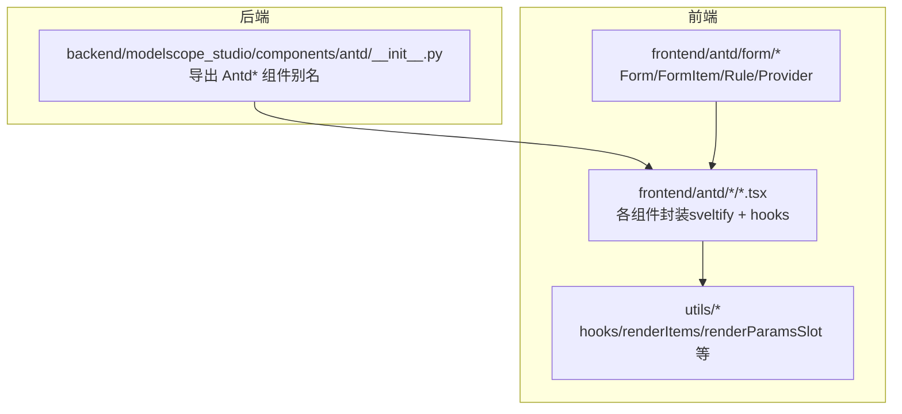
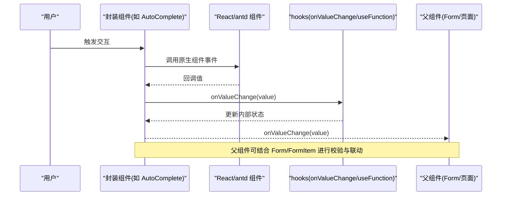
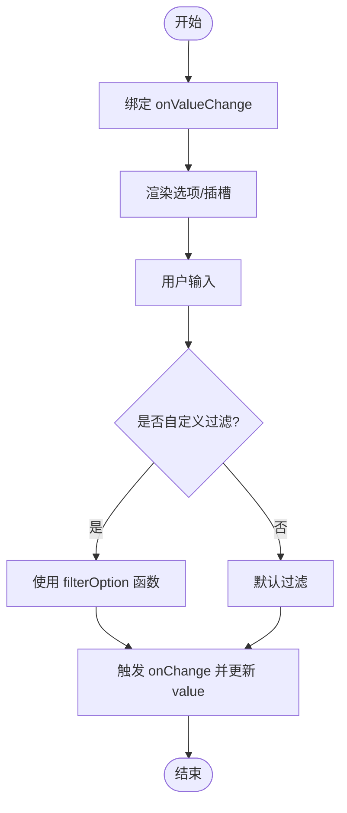
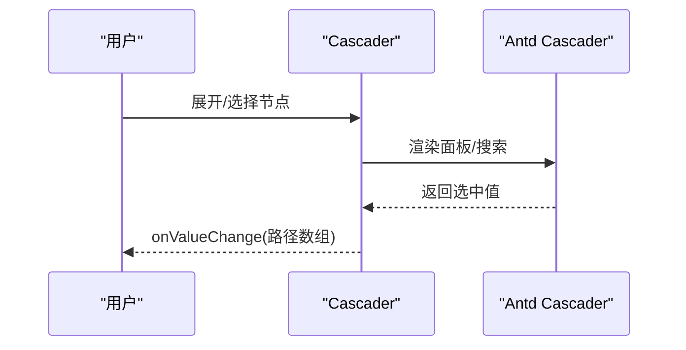
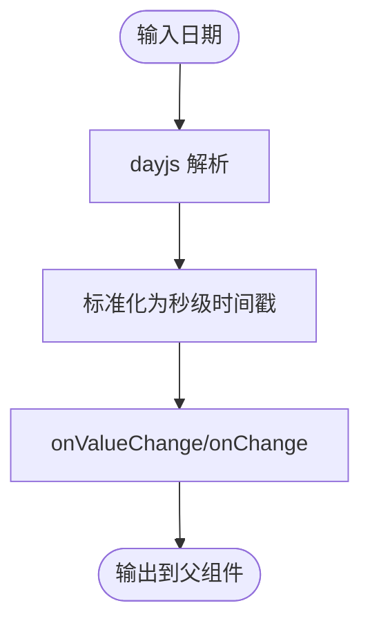
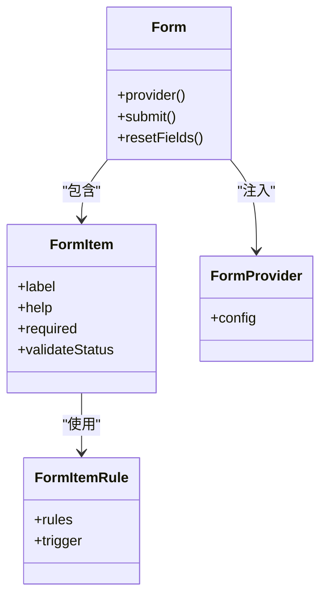
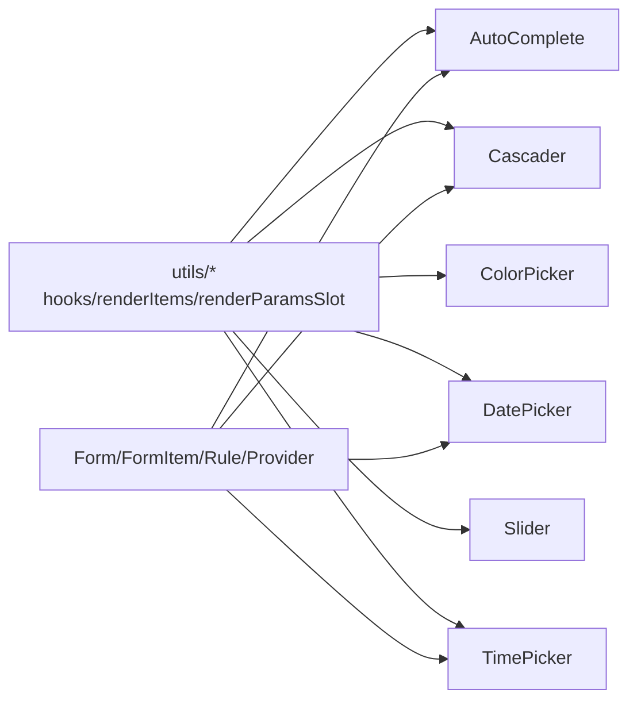
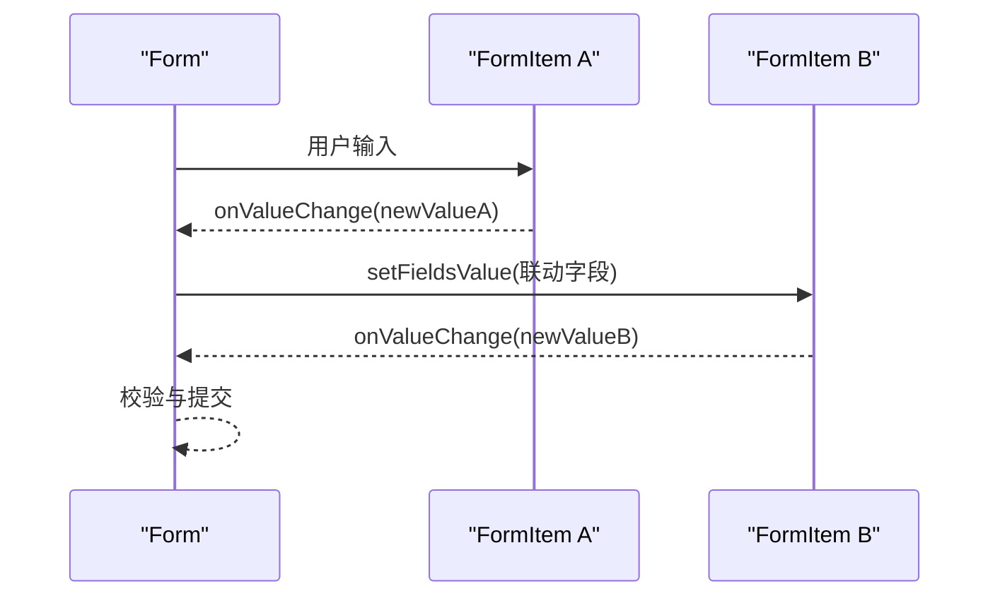

# 数据录入组件

<cite>
**本文引用的文件**
- [backend/modelscope_studio/components/antd/__init__.py](file://backend/modelscope_studio/components/antd/__init__.py)
- [frontend/antd/auto-complete/auto-complete.tsx](file://frontend/antd/auto-complete/auto-complete.tsx)
- [frontend/antd/cascader/cascader.tsx](file://frontend/antd/cascader/cascader.tsx)
- [frontend/antd/checkbox/checkbox.tsx](file://frontend/antd/checkbox/checkbox.tsx)
- [frontend/antd/color-picker/color-picker.tsx](file://frontend/antd/color-picker/color-picker.tsx)
- [frontend/antd/date-picker/date-picker.tsx](file://frontend/antd/date-picker/date-picker.tsx)
- [frontend/antd/radio/radio.tsx](file://frontend/antd/radio/radio.tsx)
- [frontend/antd/rate/rate.tsx](file://frontend/antd/rate/rate.tsx)
- [frontend/antd/slider/slider.tsx](file://frontend/antd/slider/slider.tsx)
- [frontend/antd/switch/switch.tsx](file://frontend/antd/switch/switch.tsx)
- [frontend/antd/time-picker/time-picker.tsx](file://frontend/antd/time-picker/time-picker.tsx)
- [frontend/antd/form/form.tsx](file://frontend/antd/form/form.tsx)
- [frontend/antd/form/item/form.item.tsx](file://frontend/antd/form/item/form.item.tsx)
- [frontend/antd/form/item/rule/form.item.rule.tsx](file://frontend/antd/form/item/rule/form.item.rule.tsx)
- [frontend/antd/form/provider/form.provider.tsx](file://frontend/antd/form/provider/form.provider.tsx)
- [frontend/antd/input/input.tsx](file://frontend/antd/input/input.tsx)
- [frontend/antd/input/otp/input.otp.tsx](file://frontend/antd/input/otp/input.otp.tsx)
- [frontend/antd/input/password/input.password.tsx](file://frontend/antd/input/password/input.password.tsx)
- [frontend/antd/input/search/input.search.tsx](file://frontend/antd/input/search/input.search.tsx)
- [frontend/antd/input/textarea/input.textarea.tsx](file://frontend/antd/input/textarea/input.textarea.tsx)
- [frontend/antd/input-number/input-number.tsx](file://frontend/antd/input-number/input-number.tsx)
- [frontend/antd/select/select.tsx](file://frontend/antd/select/select.tsx)
- [frontend/antd/select/option/select.option.tsx](file://frontend/antd/select/option/select.option.tsx)
- [frontend/antd/transfer/transfer.tsx](file://frontend/antd/transfer/transfer.tsx)
- [frontend/antd/tree-select/tree-select.tsx](file://frontend/antd/tree-select/tree-select.tsx)
- [frontend/antd/upload/upload.tsx](file://frontend/antd/upload/upload.tsx)
</cite>

## 目录

1. [简介](#简介)
2. [项目结构](#项目结构)
3. [核心组件](#核心组件)
4. [架构总览](#架构总览)
5. [组件详解](#组件详解)
6. [依赖关系分析](#依赖关系分析)
7. [性能与大数据量优化](#性能与大数据量优化)
8. [可访问性与键盘操作](#可访问性与键盘操作)
9. [复杂表单设计模式与数据流](#复杂表单设计模式与数据流)
10. [故障排查指南](#故障排查指南)
11. [结论](#结论)

## 简介

本文件面向使用 Ant Design 组件在前端进行数据录入的场景，系统梳理了自动完成、级联选择、多选框、颜色选择器、日期选择器、表单、输入框、数字输入框、提及、单选框、评分、选择器、滑动输入条、开关、时间选择器、穿梭框、树选择、上传等组件的封装与使用要点。重点覆盖以下方面：

- 数据绑定：如何通过 onValueChange 实现受控/非受控双向绑定
- 验证规则：Form.Item 与 FormItem.Rule 的组合使用
- 格式化选项：日期时间类组件的内部格式转换与对外输出统一
- 复杂表单设计模式：分步、联动、动态字段、条件渲染
- 可访问性与键盘操作：语义化标签、焦点管理、键盘导航
- 性能优化：虚拟滚动、懒加载、防抖节流、批量更新

## 项目结构

该项目采用“后端组件导出 + 前端 Svelte/React 封装”的双层结构：

- 后端层负责将 Ant Design 组件以 Python 类的形式导出，便于在 Python 生态中统一调用与文档生成
- 前端层基于 Svelte/React 封装，提供 slots 插槽、上下文注入、函数钩子、值变更桥接等能力，实现与后端一致的 API 体验

图表来源

- [backend/modelscope_studio/components/antd/**init**.py:1-150](file://backend/modelscope_studio/components/antd/__init__.py#L1-L150)
- [frontend/antd/auto-complete/auto-complete.tsx:1-151](file://frontend/antd/auto-complete/auto-complete.tsx#L1-L151)
- [frontend/antd/form/form.tsx](file://frontend/antd/form/form.tsx)
- [frontend/antd/form/item/form.item.tsx](file://frontend/antd/form/item/form.item.tsx)
- [frontend/antd/form/item/rule/form.item.rule.tsx](file://frontend/antd/form/item/rule/form.item.rule.tsx)
- [frontend/antd/form/provider/form.provider.tsx](file://frontend/antd/form/provider/form.provider.tsx)

章节来源

- [backend/modelscope_studio/components/antd/**init**.py:1-150](file://backend/modelscope_studio/components/antd/__init__.py#L1-L150)

## 核心组件

本节概览本次文档涉及的组件及其职责：

- 表单体系：Form、FormItem、FormItem.Rule、FormProvider
- 输入类：Input、Input.TextArea、Input.Search、Input.Password、Input.OTP、InputNumber
- 选择类：Select、Select.Option、Cascader、TreeSelect、Transfer
- 时间类：DatePicker、TimePicker
- 滑动与评分：Slider、Rate
- 开关与选择：Switch、Radio、Checkbox
- 颜色：ColorPicker
- 提及：Mentions（支持关键词提及与选项的动态渲染，包含 Option 子组件）

章节来源

- [frontend/antd/form/form.tsx](file://frontend/antd/form/form.tsx)
- [frontend/antd/form/item/form.item.tsx](file://frontend/antd/form/item/form.item.tsx)
- [frontend/antd/form/item/rule/form.item.rule.tsx](file://frontend/antd/form/item/rule/form.item.rule.tsx)
- [frontend/antd/form/provider/form.provider.tsx](file://frontend/antd/form/provider/form.provider.tsx)
- [frontend/antd/input/input.tsx](file://frontend/antd/input/input.tsx)
- [frontend/antd/input/otp/input.otp.tsx](file://frontend/antd/input/otp/input.otp.tsx)
- [frontend/antd/input/password/input.password.tsx](file://frontend/antd/input/password/input.password.tsx)
- [frontend/antd/input/search/input.search.tsx](file://frontend/antd/input/search/input.search.tsx)
- [frontend/antd/input/textarea/input.textarea.tsx](file://frontend/antd/input/textarea/input.textarea.tsx)
- [frontend/antd/input-number/input-number.tsx](file://frontend/antd/input-number/input-number.tsx)
- [frontend/antd/select/select.tsx](file://frontend/antd/select/select.tsx)
- [frontend/antd/select/option/select.option.tsx](file://frontend/antd/select/option/select.option.tsx)
- [frontend/antd/cascader/cascader.tsx](file://frontend/antd/cascader/cascader.tsx)
- [frontend/antd/tree-select/tree-select.tsx](file://frontend/antd/tree-select/tree-select.tsx)
- [frontend/antd/transfer/transfer.tsx](file://frontend/antd/transfer/transfer.tsx)
- [frontend/antd/date-picker/date-picker.tsx](file://frontend/antd/date-picker/date-picker.tsx)
- [frontend/antd/time-picker/time-picker.tsx](file://frontend/antd/time-picker/time-picker.tsx)
- [frontend/antd/slider/slider.tsx](file://frontend/antd/slider/slider.tsx)
- [frontend/antd/rate/rate.tsx](file://frontend/antd/rate/rate.tsx)
- [frontend/antd/switch/switch.tsx](file://frontend/antd/switch/switch.tsx)
- [frontend/antd/radio/radio.tsx](file://frontend/antd/radio/radio.tsx)
- [frontend/antd/checkbox/checkbox.tsx](file://frontend/antd/checkbox/checkbox.tsx)
- [frontend/antd/color-picker/color-picker.tsx](file://frontend/antd/color-picker/color-picker.tsx)

## 架构总览

前端组件普遍采用 sveltify 包裹 Ant Design 原生组件，并通过 hooks 完成：

- 值变更桥接：useValueChange 将 onChange 与 onValueChange 对接，确保外部统一接收 value
- 函数参数化：useFunction 将传入的函数包装为稳定引用，避免闭包陷阱
- 插槽渲染：renderItems/renderParamsSlot 支持 children 与 slots 的灵活组合
- 上下文注入：withItemsContextProvider 为子项组件（如 Option/Marks/Preset）注入 items

图表来源

- [frontend/antd/auto-complete/auto-complete.tsx:32-148](file://frontend/antd/auto-complete/auto-complete.tsx#L32-L148)
- [frontend/antd/cascader/cascader.tsx:39-204](file://frontend/antd/cascader/cascader.tsx#L39-L204)
- [frontend/antd/checkbox/checkbox.tsx:4-19](file://frontend/antd/checkbox/checkbox.tsx#L4-L19)
- [frontend/antd/color-picker/color-picker.tsx:24-103](file://frontend/antd/color-picker/color-picker.tsx#L24-L103)
- [frontend/antd/date-picker/date-picker.tsx:40-231](file://frontend/antd/date-picker/date-picker.tsx#L40-L231)
- [frontend/antd/radio/radio.tsx:6-29](file://frontend/antd/radio/radio.tsx#L6-L29)
- [frontend/antd/rate/rate.tsx:12-42](file://frontend/antd/rate/rate.tsx#L12-L42)
- [frontend/antd/slider/slider.tsx:37-94](file://frontend/antd/slider/slider.tsx#L37-L94)
- [frontend/antd/switch/switch.tsx:6-39](file://frontend/antd/switch/switch.tsx#L6-L39)
- [frontend/antd/time-picker/time-picker.tsx:37-198](file://frontend/antd/time-picker/time-picker.tsx#L37-L198)

## 组件详解

### 自动完成 AutoComplete

- 数据绑定：通过 onValueChange 接收字符串值；onChange 透传原生回调
- 插槽：支持 children、dropdownRender、popupRender、notFoundContent、allowClear.clearIcon
- 选项：支持通过 options 或 slots.children 渲染
- 过滤：filterOption 可自定义过滤逻辑或使用默认行为

图表来源

- [frontend/antd/auto-complete/auto-complete.tsx:32-148](file://frontend/antd/auto-complete/auto-complete.tsx#L32-L148)

章节来源

- [frontend/antd/auto-complete/auto-complete.tsx:1-151](file://frontend/antd/auto-complete/auto-complete.tsx#L1-L151)

### 级联选择 Cascader

- 数据绑定：onValueChange 接收数组（路径值），onChange 透传
- 插槽：suffixIcon、prefix、removeIcon、expandIcon、displayRender、tagRender、dropdownRender、popupRender、showSearch.render、maxTagPlaceholder
- 搜索：showSearch 支持对象配置与插槽渲染
- 动态加载：onLoadData 对应原生 loadData

图表来源

- [frontend/antd/cascader/cascader.tsx:19-204](file://frontend/antd/cascader/cascader.tsx#L19-L204)

章节来源

- [frontend/antd/cascader/cascader.tsx:1-207](file://frontend/antd/cascader/cascader.tsx#L1-L207)

### 多选框 Checkbox

- 数据绑定：onValueChange 接收布尔值
- 事件：onChange 透传原生事件

章节来源

- [frontend/antd/checkbox/checkbox.tsx:1-22](file://frontend/antd/checkbox/checkbox.tsx#L1-L22)

### 颜色选择器 ColorPicker

- 数据绑定：onValueChange 接收字符串或渐变颜色数组；value_format 控制输出格式（rgb/hex/hsb）
- 插槽：panelRender、showText
- 渐变：当 isGradient() 时，按 value_format 输出每段颜色

章节来源

- [frontend/antd/color-picker/color-picker.tsx:1-106](file://frontend/antd/color-picker/color-picker.tsx#L1-L106)

### 日期选择器 DatePicker

- 数据绑定：onValueChange 接收秒级时间戳（含数组场景）；onChange/onPanelChange 透传
- 内部格式：统一使用 dayjs 转换，对外输出秒级时间戳
- 插槽：renderExtraFooter、cellRender、panelRender、prevIcon/prefix/nextIcon/suffixIcon/superNextIcon/superPrevIcon、allowClear.clearIcon
- 预设：presets 通过 renderItems 渲染

图表来源

- [frontend/antd/date-picker/date-picker.tsx:14-38](file://frontend/antd/date-picker/date-picker.tsx#L14-L38)
- [frontend/antd/date-picker/date-picker.tsx:126-170](file://frontend/antd/date-picker/date-picker.tsx#L126-L170)

章节来源

- [frontend/antd/date-picker/date-picker.tsx:1-234](file://frontend/antd/date-picker/date-picker.tsx#L1-L234)

### 表单 Form / FormItem / FormItem.Rule / FormProvider

- Form：容器，提供 Provider 注入与布局能力
- FormItem：字段容器，承载 label、help、required、validateStatus 等
- FormItem.Rule：校验规则，支持必填、正则、自定义函数、异步校验
- FormProvider：全局配置与上下文

图表来源

- [frontend/antd/form/form.tsx](file://frontend/antd/form/form.tsx)
- [frontend/antd/form/item/form.item.tsx](file://frontend/antd/form/item/form.item.tsx)
- [frontend/antd/form/item/rule/form.item.rule.tsx](file://frontend/antd/form/item/rule/form.item.rule.tsx)
- [frontend/antd/form/provider/form.provider.tsx](file://frontend/antd/form/provider/form.provider.tsx)

章节来源

- [frontend/antd/form/form.tsx](file://frontend/antd/form/form.tsx)
- [frontend/antd/form/item/form.item.tsx](file://frontend/antd/form/item/form.item.tsx)
- [frontend/antd/form/item/rule/form.item.rule.tsx](file://frontend/antd/form/item/rule/form.item.rule.tsx)
- [frontend/antd/form/provider/form.provider.tsx](file://frontend/antd/form/provider/form.provider.tsx)

### 输入框 Input / TextArea / Search / Password / OTP

- 统一模式：均通过 onValueChange 接收最新值，onChange 透传原生事件
- 扩展：Search、Password、OTP 分别提供特定行为与样式

章节来源

- [frontend/antd/input/input.tsx](file://frontend/antd/input/input.tsx)
- [frontend/antd/input/otp/input.otp.tsx](file://frontend/antd/input/otp/input.otp.tsx)
- [frontend/antd/input/password/input.password.tsx](file://frontend/antd/input/password/input.password.tsx)
- [frontend/antd/input/search/input.search.tsx](file://frontend/antd/input/search/input.search.tsx)
- [frontend/antd/input/textarea/input.textarea.tsx](file://frontend/antd/input/textarea/input.textarea.tsx)

### 数字输入框 InputNumber

- 数据绑定：onValueChange 接收数值；onChange 透传
- 场景：步进、范围、精度控制

章节来源

- [frontend/antd/input-number/input-number.tsx](file://frontend/antd/input-number/input-number.tsx)

### 选择器 Select / Option

- 数据绑定：onValueChange 接收字符串/数字/数组；onChange 透传
- 子项：Option 通过 renderItems 注入，支持禁用、分组等

章节来源

- [frontend/antd/select/select.tsx](file://frontend/antd/select/select.tsx)
- [frontend/antd/select/option/select.option.tsx](file://frontend/antd/select/option/select.option.tsx)

### 滑动输入条 Slider / Marks

- 数据绑定：onValueChange 接收 number 或 number[]；onChange 透传
- 标记：marks 通过 slots.children 或 slots.label 渲染

章节来源

- [frontend/antd/slider/slider.tsx:1-97](file://frontend/antd/slider/slider.tsx#L1-L97)

### 单选框 Radio

- 数据绑定：onValueChange 接收布尔值；onChange 透传
- 主题：通过 token.lineWidth 注入样式变量

章节来源

- [frontend/antd/radio/radio.tsx:1-32](file://frontend/antd/radio/radio.tsx#L1-L32)

### 评分 Rate

- 数据绑定：onValueChange 接收数值；onChange 透传
- 插槽：character 支持自定义评分图标

章节来源

- [frontend/antd/rate/rate.tsx:1-45](file://frontend/antd/rate/rate.tsx#L1-L45)

### 开关 Switch

- 数据绑定：onValueChange 接收布尔值；onChange 透传
- 插槽：checkedChildren、unCheckedChildren

章节来源

- [frontend/antd/switch/switch.tsx:1-42](file://frontend/antd/switch/switch.tsx#L1-L42)

### 时间选择器 TimePicker

- 数据绑定：onValueChange 接收秒级时间戳；onChange/onPanelChange/onCalendarChange 透传
- 内部格式：统一 dayjs 转换

章节来源

- [frontend/antd/time-picker/time-picker.tsx:1-201](file://frontend/antd/time-picker/time-picker.tsx#L1-L201)

### 穿梭框 Transfer

- 数据绑定：onValueChange 接收目标列表键值；onChange 透传
- 场景：多选移动、排序、搜索

章节来源

- [frontend/antd/transfer/transfer.tsx](file://frontend/antd/transfer/transfer.tsx)

### 树选择 TreeSelect

- 数据绑定：onValueChange 接收字符串/数组；onChange 透传
- 子项：TreeNode 通过 renderItems 注入

章节来源

- [frontend/antd/tree-select/tree-select.tsx](file://frontend/antd/tree-select/tree-select.tsx)

### 上传 Upload

- 数据绑定：onValueChange 接收文件列表；onChange 透传
- 场景：拖拽、预览、限制大小/类型

章节来源

- [frontend/antd/upload/upload.tsx](file://frontend/antd/upload/upload.tsx)

## 依赖关系分析

- 组件间耦合：多数组件通过 hooks 与工具函数解耦，降低对具体实现的耦合度
- 插槽与上下文：withItemsContextProvider 与 renderItems 使子项组件可被统一注入与渲染
- 事件桥接：useValueChange 将 onChange 与 onValueChange 对齐，保证父组件统一订阅

图表来源

- [frontend/antd/auto-complete/auto-complete.tsx:1-151](file://frontend/antd/auto-complete/auto-complete.tsx#L1-L151)
- [frontend/antd/cascader/cascader.tsx:1-207](file://frontend/antd/cascader/cascader.tsx#L1-L207)
- [frontend/antd/color-picker/color-picker.tsx:1-106](file://frontend/antd/color-picker/color-picker.tsx#L1-L106)
- [frontend/antd/date-picker/date-picker.tsx:1-234](file://frontend/antd/date-picker/date-picker.tsx#L1-L234)
- [frontend/antd/slider/slider.tsx:1-97](file://frontend/antd/slider/slider.tsx#L1-L97)
- [frontend/antd/time-picker/time-picker.tsx:1-201](file://frontend/antd/time-picker/time-picker.tsx#L1-L201)
- [frontend/antd/form/form.tsx](file://frontend/antd/form/form.tsx)
- [frontend/antd/form/item/form.item.tsx](file://frontend/antd/form/item/form.item.tsx)
- [frontend/antd/form/item/rule/form.item.rule.tsx](file://frontend/antd/form/item/rule/form.item.rule.tsx)
- [frontend/antd/form/provider/form.provider.tsx](file://frontend/antd/form/provider/form.provider.tsx)

## 性能与大数据量优化

- 列表渲染
  - 使用虚拟滚动：在 Select/Cascader/TreeSelect 中优先考虑虚拟化方案，减少 DOM 节点数量
  - 懒加载：Cascader 的 onLoadData 仅在展开时请求数据，避免一次性加载全部
- 输入性能
  - 防抖/节流：在 AutoComplete 的 filterOption 或搜索型输入中加入防抖
  - 批量更新：Form 中使用 batch 提交，减少重渲染次数
- 日期时间
  - 内部统一 dayjs，对外统一秒级时间戳，避免重复解析
  - 预设与面板渲染使用 memo 化，减少不必要的重算
- 图形与颜色
  - ColorPicker 在渐变场景下按 value_format 计算输出，避免重复格式化

## 可访问性与键盘操作

- 语义化标签：Radio/Checkbox/Switch 等提供明确的 aria 属性与 label 关联
- 键盘导航：DatePicker/TimePicker/Select/Slider 支持 Tab/Enter/方向键等标准操作
- 焦点管理：getPopupContainer 将弹层挂载到容器内，避免焦点丢失
- 屏幕阅读器：FormItem 提供 help/status 文本，辅助说明错误与提示信息

## 复杂表单设计模式与数据流

- 分步表单：使用 FormProvider 全局配置，配合 onPanelChange 与联动字段
- 条件渲染：根据某字段值动态显示/隐藏区域，结合 FormItem 的 required 与 Rule
- 动态字段：通过 renderItems 注入 Option/TreeNode/Mark，实现动态增删改
- 联动与计算：在 onValueChange 中触发副作用（如计算总价、填充地址），并通过 Form.setFieldsValue 更新其他字段

图表来源

- [frontend/antd/form/form.tsx](file://frontend/antd/form/form.tsx)
- [frontend/antd/form/item/form.item.tsx](file://frontend/antd/form/item/form.item.tsx)
- [frontend/antd/form/item/rule/form.item.rule.tsx](file://frontend/antd/form/item/rule/form.item.rule.tsx)

## 故障排查指南

- 事件未触发
  - 检查 onValueChange 是否正确传入；确认 onChange 是否被覆盖
- 值不更新
  - 确认受控模式下父组件是否及时 setState；检查 useValueChange 的依赖
- 插槽不生效
  - 确认 slots.key 是否与组件约定一致；检查 renderParamsSlot 的 key
- 校验不生效
  - 检查 FormItem.Rule 的 trigger 与 rules 配置；确认 Form.validateFields 调用时机
- 日期异常
  - 确认输入为秒级时间戳；检查 dayjs 转换链路与 defaultValue/defaultPickerValue

章节来源

- [frontend/antd/auto-complete/auto-complete.tsx:32-148](file://frontend/antd/auto-complete/auto-complete.tsx#L32-L148)
- [frontend/antd/date-picker/date-picker.tsx:126-170](file://frontend/antd/date-picker/date-picker.tsx#L126-L170)
- [frontend/antd/time-picker/time-picker.tsx:109-143](file://frontend/antd/time-picker/time-picker.tsx#L109-L143)
- [frontend/antd/form/item/rule/form.item.rule.tsx](file://frontend/antd/form/item/rule/form.item.rule.tsx)

## 结论

本项目通过统一的封装模式与 hooks 工具，实现了 Ant Design 组件在前端的高一致性与强扩展性。围绕数据绑定、验证规则、格式化选项与复杂表单设计，提供了清晰的实践路径。建议在实际业务中结合虚拟滚动、懒加载与防抖策略，持续优化性能；同时完善可访问性与键盘操作，提升用户体验。
