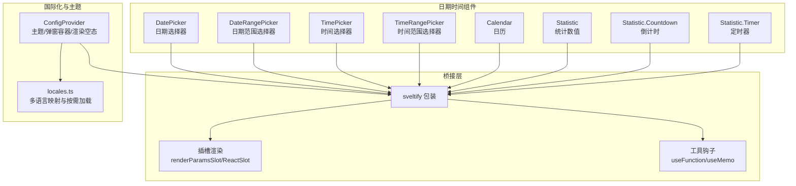
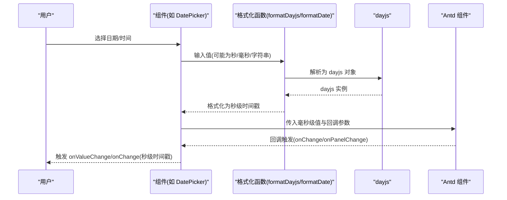
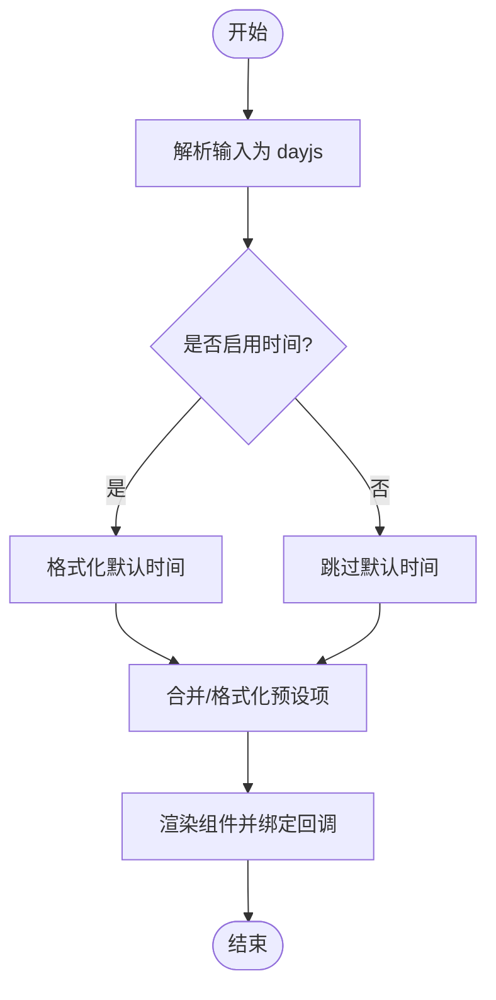
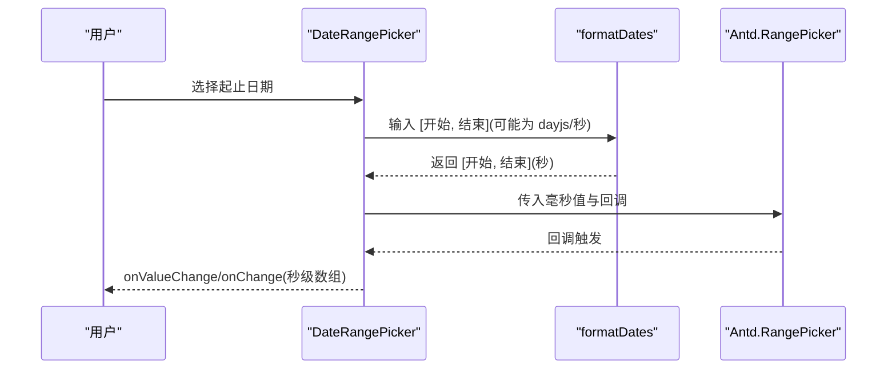
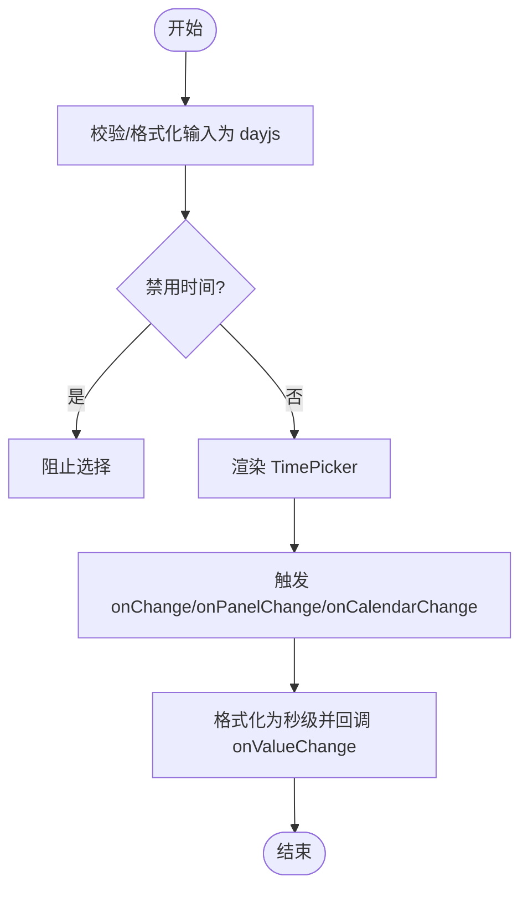
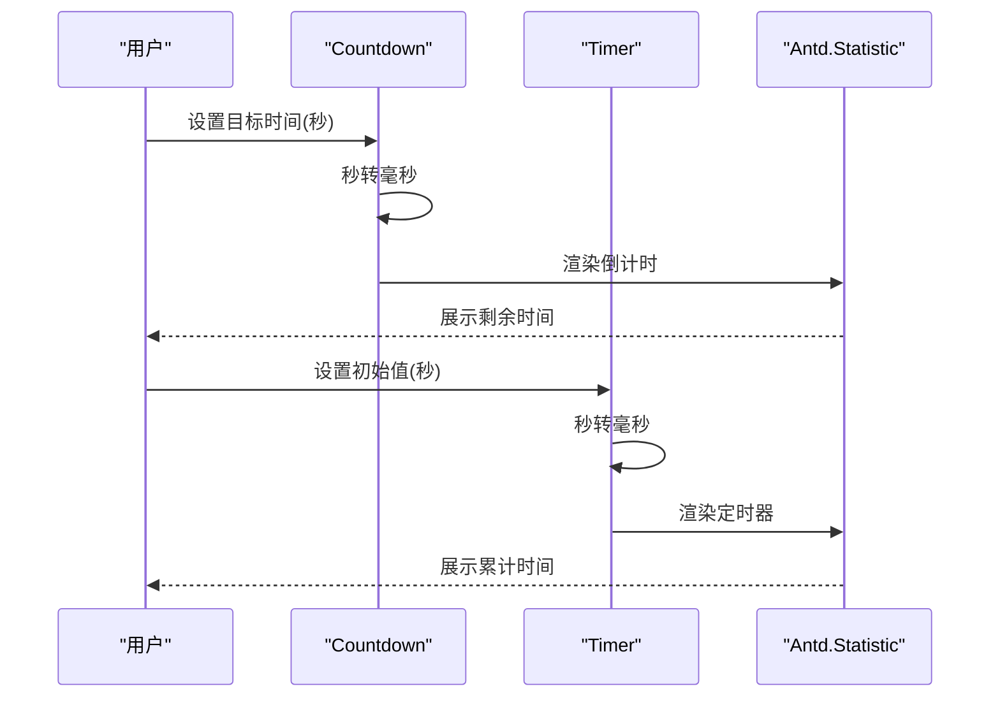
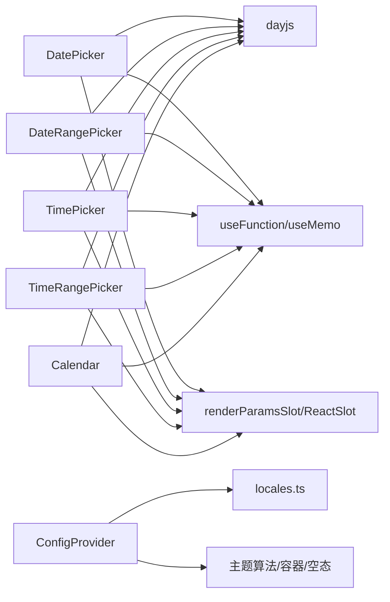

# 日期时间组件

<cite>
**本文引用的文件**
- [frontend/antd/date-picker/date-picker.tsx](file://frontend/antd/date-picker/date-picker.tsx)
- [frontend/antd/date-picker/context.ts](file://frontend/antd/date-picker/context.ts)
- [frontend/antd/date-picker/preset/date-picker.preset.tsx](file://frontend/antd/date-picker/preset/date-picker.preset.tsx)
- [frontend/antd/date-picker/range-picker/date-picker.range-picker.tsx](file://frontend/antd/date-picker/range-picker/date-picker.range-picker.tsx)
- [frontend/antd/time-picker/time-picker.tsx](file://frontend/antd/time-picker/time-picker.tsx)
- [frontend/antd/time-picker/range-picker/time-picker.range-picker.tsx](file://frontend/antd/time-picker/range-picker/time-picker.range-picker.tsx)
- [frontend/antd/calendar/calendar.tsx](file://frontend/antd/calendar/calendar.tsx)
- [frontend/antd/statistic/statistic.tsx](file://frontend/antd/statistic/statistic.tsx)
- [frontend/antd/statistic/countdown/statistic.countdown.tsx](file://frontend/antd/statistic/countdown/statistic.countdown.tsx)
- [frontend/antd/statistic/timer/statistic.timer.tsx](file://frontend/antd/statistic/timer/statistic.timer.tsx)
- [frontend/antd/config-provider/config-provider.tsx](file://frontend/antd/config-provider/config-provider.tsx)
- [frontend/antd/config-provider/locales.ts](file://frontend/antd/config-provider/locales.ts)
</cite>

## 目录

1. [简介](#简介)
2. [项目结构](#项目结构)
3. [核心组件](#核心组件)
4. [架构总览](#架构总览)
5. [详细组件分析](#详细组件分析)
6. [依赖关系分析](#依赖关系分析)
7. [性能考量](#性能考量)
8. [故障排查指南](#故障排查指南)
9. [结论](#结论)
10. [附录](#附录)

## 简介

本文件系统性梳理模型空间工作室前端中与“日期时间”相关的组件与能力，覆盖以下主题：

- 日期选择器（DatePicker）与日期范围选择（DateRangePicker）
- 时间选择器（TimePicker）与时间范围选择（TimeRangePicker）
- 日历（Calendar）
- 统计数值（Statistic）中的倒计时（Countdown）与定时器（Timer）
- 日期格式化、时区与时间单位转换、范围选择、快捷选项（预设）、禁用日期/时间
- 本地化（ConfigProvider）与国际化配置（locales）
- 验证规则与业务场景应用
- 可访问性与键盘导航
- 复杂日期时间场景的处理模式与最佳实践

## 项目结构

围绕日期时间组件的前端实现主要位于 antd 前缀目录下，采用 Svelte + React 包装（sveltify）的方式桥接 Ant Design 组件，统一通过 ConfigProvider 提供主题与国际化。

图表来源

- [frontend/antd/date-picker/date-picker.tsx:40-231](file://frontend/antd/date-picker/date-picker.tsx#L40-L231)
- [frontend/antd/date-picker/range-picker/date-picker.range-picker.tsx:29-245](file://frontend/antd/date-picker/range-picker/date-picker.range-picker.tsx#L29-L245)
- [frontend/antd/time-picker/time-picker.tsx:37-198](file://frontend/antd/time-picker/time-picker.tsx#L37-L198)
- [frontend/antd/time-picker/range-picker/time-picker.range-picker.tsx:26-207](file://frontend/antd/time-picker/range-picker/time-picker.range-picker.tsx#L26-L207)
- [frontend/antd/calendar/calendar.tsx:17-99](file://frontend/antd/calendar/calendar.tsx#L17-L99)
- [frontend/antd/statistic/statistic.tsx:8-31](file://frontend/antd/statistic/statistic.tsx#L8-L31)
- [frontend/antd/statistic/countdown/statistic.countdown.tsx:6-24](file://frontend/antd/statistic/countdown/statistic.countdown.tsx#L6-L24)
- [frontend/antd/statistic/timer/statistic.timer.tsx:10-26](file://frontend/antd/statistic/timer/statistic.timer.tsx#L10-L26)
- [frontend/antd/config-provider/config-provider.tsx:53-151](file://frontend/antd/config-provider/config-provider.tsx#L53-L151)
- [frontend/antd/config-provider/locales.ts:89-863](file://frontend/antd/config-provider/locales.ts#L89-L863)

章节来源

- [frontend/antd/date-picker/date-picker.tsx:1-234](file://frontend/antd/date-picker/date-picker.tsx#L1-L234)
- [frontend/antd/date-picker/range-picker/date-picker.range-picker.tsx:1-248](file://frontend/antd/date-picker/range-picker/date-picker.range-picker.tsx#L1-L248)
- [frontend/antd/time-picker/time-picker.tsx:1-201](file://frontend/antd/time-picker/time-picker.tsx#L1-L201)
- [frontend/antd/time-picker/range-picker/time-picker.range-picker.tsx:1-211](file://frontend/antd/time-picker/range-picker/time-picker.range-picker.tsx#L1-L211)
- [frontend/antd/calendar/calendar.tsx:1-102](file://frontend/antd/calendar/calendar.tsx#L1-L102)
- [frontend/antd/statistic/statistic.tsx:1-34](file://frontend/antd/statistic/statistic.tsx#L1-L34)
- [frontend/antd/statistic/countdown/statistic.countdown.tsx:1-27](file://frontend/antd/statistic/countdown/statistic.countdown.tsx#L1-L27)
- [frontend/antd/statistic/timer/statistic.timer.tsx:1-29](file://frontend/antd/statistic/timer/statistic.timer.tsx#L1-L29)
- [frontend/antd/config-provider/config-provider.tsx:1-154](file://frontend/antd/config-provider/config-provider.tsx#L1-L154)
- [frontend/antd/config-provider/locales.ts:1-863](file://frontend/antd/config-provider/locales.ts#L1-L863)

## 核心组件

- 日期选择器（DatePicker）：支持日期与时间选择、范围选择、预设快捷项、禁用日期/时间、面板切换回调、弹窗容器自定义等。
- 时间选择器（TimePicker）：支持时间选择、范围选择、禁用时间、面板切换与日历联动回调。
- 日历（Calendar）：提供完整月份视图，支持单元格自定义渲染、头部渲染、有效范围限制。
- 统计数值（Statistic）：基础统计展示；Countdown 倒计时与 Timer 定时器均以秒为输入单位，内部自动转换毫秒传递给底层组件。

章节来源

- [frontend/antd/date-picker/date-picker.tsx:40-170](file://frontend/antd/date-picker/date-picker.tsx#L40-L170)
- [frontend/antd/date-picker/range-picker/date-picker.range-picker.tsx:29-177](file://frontend/antd/date-picker/range-picker/date-picker.range-picker.tsx#L29-L177)
- [frontend/antd/time-picker/time-picker.tsx:37-143](file://frontend/antd/time-picker/time-picker.tsx#L37-L143)
- [frontend/antd/time-picker/range-picker/time-picker.range-picker.tsx:26-146](file://frontend/antd/time-picker/range-picker/time-picker.range-picker.tsx#L26-L146)
- [frontend/antd/calendar/calendar.tsx:17-94](file://frontend/antd/calendar/calendar.tsx#L17-L94)
- [frontend/antd/statistic/statistic.tsx:8-31](file://frontend/antd/statistic/statistic.tsx#L8-L31)
- [frontend/antd/statistic/countdown/statistic.countdown.tsx:6-21](file://frontend/antd/statistic/countdown/statistic.countdown.tsx#L6-L21)
- [frontend/antd/statistic/timer/statistic.timer.tsx:10-23](file://frontend/antd/statistic/timer/statistic.timer.tsx#L10-L23)

## 架构总览

组件统一通过 sveltify 包装 Ant Design 组件，使用 dayjs 进行日期解析与格式化，对外暴露统一的秒级时间戳接口，内部再转换为毫秒传递给底层组件。ConfigProvider 负责主题算法、弹窗容器、渲染空态以及国际化（Antd 语言包与 dayjs 语言包）。

图表来源

- [frontend/antd/date-picker/date-picker.tsx:14-38](file://frontend/antd/date-picker/date-picker.tsx#L14-L38)
- [frontend/antd/date-picker/range-picker/date-picker.range-picker.tsx:14-27](file://frontend/antd/date-picker/range-picker/date-picker.range-picker.tsx#L14-L27)
- [frontend/antd/time-picker/time-picker.tsx:11-35](file://frontend/antd/time-picker/time-picker.tsx#L11-L35)
- [frontend/antd/time-picker/range-picker/time-picker.range-picker.tsx:11-24](file://frontend/antd/time-picker/range-picker/time-picker.range-picker.tsx#L11-L24)

## 详细组件分析

### 日期选择器（DatePicker）

- 数据流与格式化
  - 输入支持数字（秒）、字符串、dayjs 对象；内部统一转为 dayjs。
  - 输出统一为秒级时间戳，便于后端或跨组件传递。
- 关键能力
  - showTime 支持对象形式，默认时间 defaultValue 也会被格式化。
  - disabledDate/disabledTime 自定义禁用逻辑。
  - presets 快捷预设：通过上下文注入，支持动态渲染与格式化。
  - cellRender/panelRender 插槽化渲染。
  - getPopupContainer 自定义弹出容器。
- 事件回调
  - onValueChange：统一的值变更回调（秒级）。
  - onChange/onPanelChange：原生回调与二次封装回调均可使用。

图表来源

- [frontend/antd/date-picker/date-picker.tsx:91-161](file://frontend/antd/date-picker/date-picker.tsx#L91-L161)

章节来源

- [frontend/antd/date-picker/date-picker.tsx:1-234](file://frontend/antd/date-picker/date-picker.tsx#L1-L234)
- [frontend/antd/date-picker/context.ts:1-7](file://frontend/antd/date-picker/context.ts#L1-L7)
- [frontend/antd/date-picker/preset/date-picker.preset.tsx:1-14](file://frontend/antd/date-picker/preset/date-picker.preset.tsx#L1-L14)

### 日期范围选择器（DateRangePicker）

- 数据流
  - 输入/输出均为双元素数组 [开始, 结束]，元素为秒级时间戳。
  - 默认值、当前值、面板值均进行 dayjs 格式化与数组映射。
- 关键能力
  - showTime 的 defaultValue 支持数组映射。
  - presets 同样支持数组格式化。
  - separator 插槽化分隔符。
- 事件回调
  - onValueChange、onChange、onPanelChange、onCalendarChange 均返回秒级数组。

图表来源

- [frontend/antd/date-picker/range-picker/date-picker.range-picker.tsx:21-27](file://frontend/antd/date-picker/range-picker/date-picker.range-picker.tsx#L21-L27)
- [frontend/antd/date-picker/range-picker/date-picker.range-picker.tsx:165-177](file://frontend/antd/date-picker/range-picker/date-picker.range-picker.tsx#L165-L177)

章节来源

- [frontend/antd/date-picker/range-picker/date-picker.range-picker.tsx:1-248](file://frontend/antd/date-picker/range-picker/date-picker.range-picker.tsx#L1-L248)

### 时间选择器（TimePicker）

- 数据流
  - 输入支持数字（秒）、字符串、dayjs；统一格式化为 dayjs。
  - 输出为秒级数值（number 或 string），onValueChange 保证统一。
- 关键能力
  - disabledTime/disabledDate 控制可用时间段。
  - cellRender/panelRender 插槽化。
  - onCalendarChange 与 onPanelChange。
- 事件回调
  - onValueChange 接收秒级值；onChange/onPanelChange 也进行格式化后再回调。

图表来源

- [frontend/antd/time-picker/time-picker.tsx:88-143](file://frontend/antd/time-picker/time-picker.tsx#L88-L143)

章节来源

- [frontend/antd/time-picker/time-picker.tsx:1-201](file://frontend/antd/time-picker/time-picker.tsx#L1-L201)

### 时间范围选择器（TimeRangePicker）

- 数据流
  - 输入/输出为 [开始, 结束] 数组，元素为秒级时间戳。
  - 默认值、当前值、面板值均进行数组映射格式化。
- 关键能力
  - disabledTime/disabledDate 控制可用时间段。
  - separator 插槽化分隔符。
- 事件回调
  - onValueChange、onChange、onPanelChange、onCalendarChange 均返回秒级数组。

章节来源

- [frontend/antd/time-picker/range-picker/time-picker.range-picker.tsx:1-211](file://frontend/antd/time-picker/range-picker/time-picker.range-picker.tsx#L1-L211)

### 日历（Calendar）

- 数据流
  - 输入/输出统一为秒级时间戳；内部转换为毫秒传递给 Antd Calendar。
- 关键能力
  - validRange 限制有效范围。
  - cellRender/fullCellRender/headerRender 插槽化。
  - onSelect/onPanelChange/onChange 统一回调秒级值。
- 注意
  - 未直接暴露 disabledDate，可通过外部逻辑控制传入值。

章节来源

- [frontend/antd/calendar/calendar.tsx:1-102](file://frontend/antd/calendar/calendar.tsx#L1-L102)

### 统计数值（Statistic）与倒计时/定时器

- Statistic
  - 支持 title/prefix/suffix/formatter 插槽化。
- Statistic.Countdown
  - 输入 value 支持秒或毫秒；内部将秒转换为毫秒。
  - 支持 title/prefix/suffix 插槽化。
- Statistic.Timer
  - 输入 value 支持秒或毫秒；内部将秒转换为毫秒。
  - 支持 title/prefix/suffix 插槽化。

图表来源

- [frontend/antd/statistic/countdown/statistic.countdown.tsx:11-21](file://frontend/antd/statistic/countdown/statistic.countdown.tsx#L11-L21)
- [frontend/antd/statistic/timer/statistic.timer.tsx:13-23](file://frontend/antd/statistic/timer/statistic.timer.tsx#L13-L23)

章节来源

- [frontend/antd/statistic/statistic.tsx:1-34](file://frontend/antd/statistic/statistic.tsx#L1-L34)
- [frontend/antd/statistic/countdown/statistic.countdown.tsx:1-27](file://frontend/antd/statistic/countdown/statistic.countdown.tsx#L1-L27)
- [frontend/antd/statistic/timer/statistic.timer.tsx:1-29](file://frontend/antd/statistic/timer/statistic.timer.tsx#L1-L29)

## 依赖关系分析

- 组件到工具
  - 使用 dayjs 进行日期解析与格式化。
  - 使用 useFunction/useMemo 将回调与计算稳定化。
  - 使用 renderParamsSlot/ReactSlot 实现插槽化渲染。
- 组件到上下文
  - DatePicker 预设通过 createItemsContext 注入与消费。
- 国际化与主题
  - ConfigProvider 负责：
    - 主题算法（暗色/紧凑）。
    - 弹窗容器与目标容器函数。
    - 渲染空态。
    - 国际化：Antd 语言包与 dayjs 语言包按需加载。
  - locales.ts 提供语言码到语言包的映射与异步加载。

图表来源

- [frontend/antd/date-picker/date-picker.tsx:1-11](file://frontend/antd/date-picker/date-picker.tsx#L1-L11)
- [frontend/antd/date-picker/range-picker/date-picker.range-picker.tsx:1-7](file://frontend/antd/date-picker/range-picker/date-picker.range-picker.tsx#L1-L7)
- [frontend/antd/time-picker/time-picker.tsx:1-6](file://frontend/antd/time-picker/time-picker.tsx#L1-L6)
- [frontend/antd/time-picker/range-picker/time-picker.range-picker.tsx:1-6](file://frontend/antd/time-picker/range-picker/time-picker.range-picker.tsx#L1-L6)
- [frontend/antd/calendar/calendar.tsx:1-6](file://frontend/antd/calendar/calendar.tsx#L1-L6)
- [frontend/antd/config-provider/config-provider.tsx:1-11](file://frontend/antd/config-provider/config-provider.tsx#L1-L11)
- [frontend/antd/config-provider/locales.ts:1-10](file://frontend/antd/config-provider/locales.ts#L1-L10)

章节来源

- [frontend/antd/date-picker/date-picker.tsx:1-234](file://frontend/antd/date-picker/date-picker.tsx#L1-L234)
- [frontend/antd/date-picker/range-picker/date-picker.range-picker.tsx:1-248](file://frontend/antd/date-picker/range-picker/date-picker.range-picker.tsx#L1-L248)
- [frontend/antd/time-picker/time-picker.tsx:1-201](file://frontend/antd/time-picker/time-picker.tsx#L1-L201)
- [frontend/antd/time-picker/range-picker/time-picker.range-picker.tsx:1-211](file://frontend/antd/time-picker/range-picker/time-picker.range-picker.tsx#L1-L211)
- [frontend/antd/calendar/calendar.tsx:1-102](file://frontend/antd/calendar/calendar.tsx#L1-L102)
- [frontend/antd/config-provider/config-provider.tsx:1-154](file://frontend/antd/config-provider/config-provider.tsx#L1-L154)
- [frontend/antd/config-provider/locales.ts:1-863](file://frontend/antd/config-provider/locales.ts#L1-L863)

## 性能考量

- 格式化与缓存
  - 使用 useMemo 缓存格式化后的 dayjs 值，避免重复计算。
  - useFunction 稳定回调引用，减少不必要的重渲染。
- 按需加载
  - ConfigProvider 在 locale 变更时按语言包异步加载 Antd 与 dayjs 语言资源，降低首屏体积。
- 渲染优化
  - 插槽化渲染仅在需要时挂载，减少无关节点开销。
- 建议
  - 大范围选择或频繁更新时，尽量在上层做节流/防抖。
  - 预设项较多时，建议懒加载与虚拟化渲染。

## 故障排查指南

- 日期不显示或显示异常
  - 检查输入是否为秒级时间戳；组件内部会将其转换为毫秒。
  - 确认 dayjs 语言已正确设置（ConfigProvider 已自动设置）。
- 国际化未生效
  - 确认 locale 参数格式符合规范（如 zh_CN、en_US），locales.ts 内有对应映射。
  - 若语言包未加载成功，检查网络与打包配置。
- 预设项不显示
  - 确认通过上下文注入了预设项，并确保 value 格式为 dayjs。
- 禁用逻辑无效
  - disabledDate/disabledTime 应为函数；确保通过 useFunction 包装后引用稳定。
- 回调未触发
  - 确认未同时使用 onValueChange 与 onChange 导致状态不同步。
  - 检查 getPopupContainer 是否正确返回容器。

章节来源

- [frontend/antd/config-provider/config-provider.tsx:96-105](file://frontend/antd/config-provider/config-provider.tsx#L96-L105)
- [frontend/antd/date-picker/date-picker.tsx:86-90](file://frontend/antd/date-picker/date-picker.tsx#L86-L90)
- [frontend/antd/time-picker/time-picker.tsx:83-87](file://frontend/antd/time-picker/time-picker.tsx#L83-L87)

## 结论

该日期时间组件体系以 Ant Design 为基础，通过统一的格式化与插槽化机制，提供了从日期、时间到日历与统计倒计时/定时器的完整能力。配合 ConfigProvider 的主题与国际化支持，能够满足多语言、多主题场景下的复杂业务需求。建议在实际使用中遵循“统一秒级时间戳”的数据契约，结合 useMemo/useFunction 优化性能，并通过插槽化扩展 UI 表达力。

## 附录

### 本地化与国际化配置

- ConfigProvider
  - 支持 themeMode 切换暗色/紧凑算法。
  - 支持 getPopupContainer/getTargetContainer 自定义容器。
  - 支持 renderEmpty 自定义空态。
  - locale 参数支持语言码，locales.ts 提供映射与异步加载。
- locales.ts
  - 提供 80+ 语言码映射，按需加载 Antd 与 dayjs 语言包。
  - 默认语言为 en_US，dayjs 默认语言为 en。

章节来源

- [frontend/antd/config-provider/config-provider.tsx:53-151](file://frontend/antd/config-provider/config-provider.tsx#L53-L151)
- [frontend/antd/config-provider/locales.ts:89-863](file://frontend/antd/config-provider/locales.ts#L89-L863)

### 可访问性与键盘导航

- 建议
  - 使用标准语义化标签与原生交互，确保键盘可达。
  - 通过 getPopupContainer 将弹出层挂载到可聚焦容器内。
  - 在自定义 cellRender/headerRender 中保留焦点管理与无障碍属性。
  - 对于倒计时/定时器，提供清晰的标题与单位提示，便于读屏软件识别。

### 复杂场景处理模式与最佳实践

- 跨时区场景
  - 建议统一存储与传输 UTC 秒级时间戳，在展示层根据 ConfigProvider 的 dayjs 语言与地区设置进行本地化显示。
- 范围选择
  - 使用 DateRangePicker/TimeRangePicker 并在上层校验起止顺序与有效性。
- 快捷选项
  - 通过 DatePickerPreset 注入预设项，确保 value 为 dayjs，避免格式不一致导致的显示异常。
- 验证规则
  - 结合 disabledDate/disabledTime 与最小/最大日期限制，形成“禁用 + 校验”的双重保障。
- 性能
  - 大列表/高频更新场景下，优先使用 useMemo/useCallback 稳定 props 与回调，减少重渲染。
