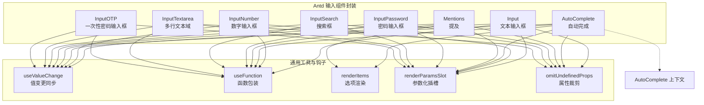
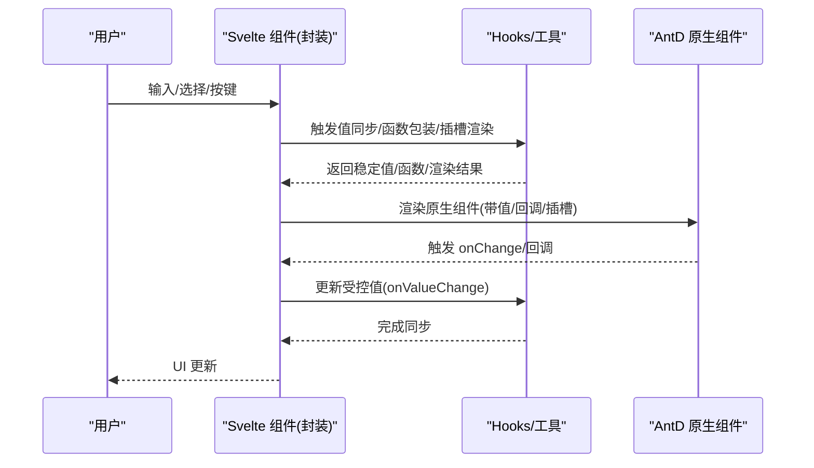
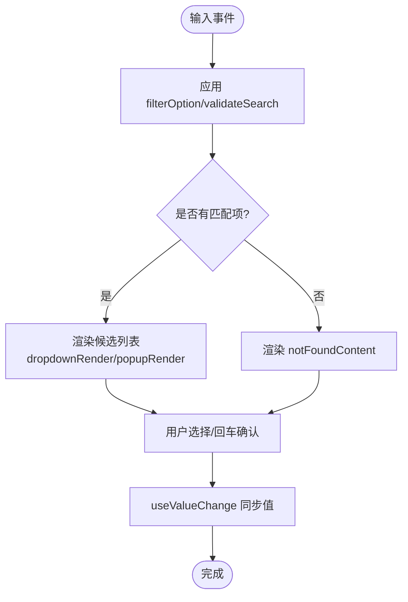
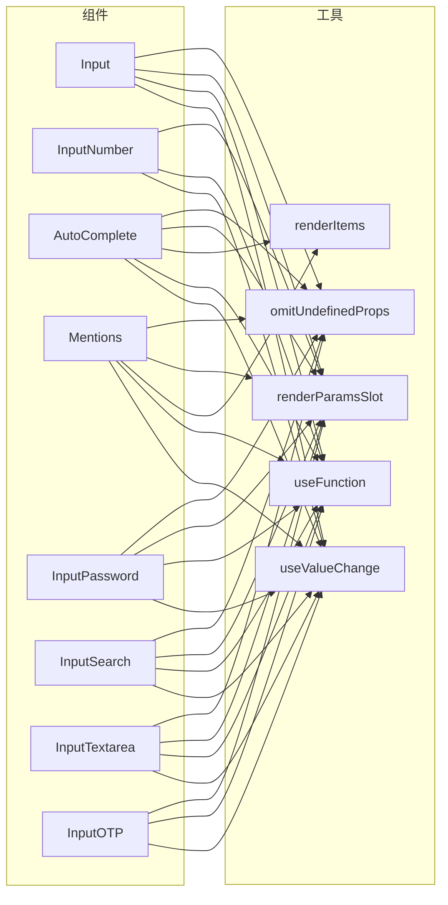

# 输入类组件

<cite>
**本文引用的文件**
- [input.tsx](file://frontend/antd/input/input.tsx)
- [input-number.tsx](file://frontend/antd/input-number/input-number.tsx)
- [auto-complete.tsx](file://frontend/antd/auto-complete/auto-complete.tsx)
- [mentions.tsx](file://frontend/antd/mentions/mentions.tsx)
- [input.password.tsx](file://frontend/antd/input/password/input.password.tsx)
- [input.search.tsx](file://frontend/antd/input/search/input.search.tsx)
- [input.textarea.tsx](file://frontend/antd/input/textarea/input.textarea.tsx)
- [input.otp.tsx](file://frontend/antd/input/otp/input.otp.tsx)
- [context.ts](file://frontend/antd/auto-complete/context.ts)
- [hooks/useValueChange.ts](file://frontend/utils/hooks/useValueChange.ts)
- [hooks/useFunction.ts](file://frontend/utils/hooks/useFunction.ts)
- [renderItems.ts](file://frontend/utils/renderItems.ts)
- [renderParamsSlot.ts](file://frontend/utils/renderParamsSlot.ts)
- [omitUndefinedProps.ts](file://frontend/utils/omitUndefinedProps.ts)
</cite>

## 目录

1. [简介](#简介)
2. [项目结构](#项目结构)
3. [核心组件](#核心组件)
4. [架构总览](#架构总览)
5. [详细组件分析](#详细组件分析)
6. [依赖关系分析](#依赖关系分析)
7. [性能考虑](#性能考虑)
8. [故障排查指南](#故障排查指南)
9. [结论](#结论)

## 简介

本章节面向“输入类数据录入组件”的使用与扩展，覆盖以下组件：文本输入框（Input）、数字输入框（InputNumber）、自动完成（AutoComplete）、提及（Mentions）、密码输入框（InputPassword）、搜索框（InputSearch）、多行文本域（InputTextarea）、一次性密码输入框（InputOTP）。文档重点阐述：

- 输入验证、格式化、防抖处理、字符限制等能力在组件中的实现方式与最佳实践
- 可访问性与键盘导航支持
- 与表单验证的集成模式
- 大数据输入场景下的性能优化策略

## 项目结构

输入类组件均位于前端 Ant Design 生态封装层，采用统一的“sveltify 包装 + React Slot 插槽 + Hooks 值同步”模式，确保与 Ant Design 组件属性对齐的同时，提供更灵活的插槽化与函数式回调能力。

图表来源

- [input.tsx:10-116](file://frontend/antd/input/input.tsx#L10-L116)
- [input-number.tsx:7-89](file://frontend/antd/input-number/input-number.tsx#L7-L89)
- [auto-complete.tsx:32-148](file://frontend/antd/auto-complete/auto-complete.tsx#L32-L148)
- [mentions.tsx:11-77](file://frontend/antd/mentions/mentions.tsx#L11-L77)
- [input.password.tsx:10-126](file://frontend/antd/input/password/input.password.tsx#L10-L126)
- [input.search.tsx:10-123](file://frontend/antd/input/search/input.search.tsx#L10-L123)
- [input.textarea.tsx:10-88](file://frontend/antd/input/textarea/input.textarea.tsx#L10-L88)
- [input.otp.tsx:7-54](file://frontend/antd/input/otp/input.otp.tsx#L7-L54)
- [context.ts](file://frontend/antd/auto-complete/context.ts)
- [hooks/useValueChange.ts](file://frontend/utils/hooks/useValueChange.ts)
- [hooks/useFunction.ts](file://frontend/utils/hooks/useFunction.ts)
- [renderItems.ts](file://frontend/utils/renderItems.ts)
- [renderParamsSlot.ts](file://frontend/utils/renderParamsSlot.ts)
- [omitUndefinedProps.ts](file://frontend/utils/omitUndefinedProps.ts)

章节来源

- [input.tsx:1-119](file://frontend/antd/input/input.tsx#L1-L119)
- [input-number.tsx:1-92](file://frontend/antd/input-number/input-number.tsx#L1-L92)
- [auto-complete.tsx:1-151](file://frontend/antd/auto-complete/auto-complete.tsx#L1-L151)
- [mentions.tsx:1-80](file://frontend/antd/mentions/mentions.tsx#L1-L80)
- [input.password.tsx:1-129](file://frontend/antd/input/password/input.password.tsx#L1-L129)
- [input.search.tsx:1-126](file://frontend/antd/input/search/input.search.tsx#L1-L126)
- [input.textarea.tsx:1-91](file://frontend/antd/input/textarea/input.textarea.tsx#L1-L91)
- [input.otp.tsx:1-57](file://frontend/antd/input/otp/input.otp.tsx#L1-L57)

## 核心组件

本节概述各组件的关键职责与共性设计：

- 值同步与回调：通过统一的 useValueChange 钩子，将受控值与 onValueChange 回调解耦，保证输入事件与外部状态一致更新。
- 函数包装：useFunction 将传入的函数（如 formatter、parser、filterOption）转换为稳定引用，避免不必要的重渲染。
- 插槽系统：通过 ReactSlot 与 renderParamsSlot 支持 slot 自定义渲染（如前缀/后缀、清除图标、下拉项、分隔符等），并允许传参。
- 属性裁剪：omitUndefinedProps 仅传递有效配置，避免无效属性影响渲染或行为。
- 选项渲染：renderItems 将插槽中的选项节点转换为 Ant Design 所需的 options 数组，支持默认与自定义选项集合。

章节来源

- [input.tsx:39-42](file://frontend/antd/input/input.tsx#L39-L42)
- [input-number.tsx:32-35](file://frontend/antd/input-number/input-number.tsx#L32-L35)
- [auto-complete.tsx:63-66](file://frontend/antd/auto-complete/auto-complete.tsx#L63-L66)
- [mentions.tsx:34-37](file://frontend/antd/mentions/mentions.tsx#L34-L37)
- [hooks/useValueChange.ts](file://frontend/utils/hooks/useValueChange.ts)
- [hooks/useFunction.ts](file://frontend/utils/hooks/useFunction.ts)
- [renderItems.ts](file://frontend/utils/renderItems.ts)
- [renderParamsSlot.ts](file://frontend/utils/renderParamsSlot.ts)
- [omitUndefinedProps.ts](file://frontend/utils/omitUndefinedProps.ts)

## 架构总览

输入组件的统一架构由“封装层 + 工具层 + AntD 原生组件”构成，形成清晰的职责边界与复用路径。

图表来源

- [input.tsx:47-54](file://frontend/antd/input/input.tsx#L47-L54)
- [input-number.tsx:39-46](file://frontend/antd/input-number/input-number.tsx#L39-L46)
- [auto-complete.tsx:76-104](file://frontend/antd/auto-complete/auto-complete.tsx#L76-L104)
- [mentions.tsx:44-61](file://frontend/antd/mentions/mentions.tsx#L44-L61)
- [hooks/useValueChange.ts](file://frontend/utils/hooks/useValueChange.ts)

## 详细组件分析

### 文本输入框（Input）

- 功能要点
  - 受控值：通过 useValueChange 同步 props.value 与内部状态，onChange 时触发 onValueChange。
  - 字符计数：showCount 支持函数化 formatter；count 支持 strategy/exceedFormatter/show 的组合配置，使用 useMemo 与 omitUndefinedProps 裁剪无效字段。
  - 插槽化装饰：addonBefore/After、prefix/suffix、allowClear.clearIcon 可通过 slots 注入自定义节点。
- 输入验证与格式化
  - 无内置正则校验，建议结合表单校验器或 onValueChange 内部校验。
  - formatter/parser 由上层传入，此处不涉及。
- 防抖与字符限制
  - 未内置防抖；可在 onValueChange 中自行实现节流/防抖。
  - maxLength 由 AntD 原生支持，配合 showCount 使用。
- 可访问性与键盘导航
  - 保持原生 input 行为，遵循浏览器默认键盘交互。
- 与表单验证集成
  - 推荐在 onValueChange 中进行即时校验，并通过表单上下文暴露的 setFieldError/setFieldValue 更新状态。
- 性能优化
  - 使用 useMemo 缓存 count 配置，减少重渲染。
  - 仅在 slots 存在时渲染对应装饰节点，避免空分支开销。

章节来源

- [input.tsx:39-84](file://frontend/antd/input/input.tsx#L39-L84)
- [input.tsx:85-112](file://frontend/antd/input/input.tsx#L85-L112)

### 数字输入框（InputNumber）

- 功能要点
  - 受控值与回调：同上，使用 useValueChange 同步值。
  - 格式化/解析：formatter/parser 作为函数传入，useFunction 包装以稳定引用。
  - 控件图标：controls.upIcon/controls.downIcon 支持插槽注入。
  - 装饰与前后缀：addonBefore/After、prefix/suffix 支持插槽。
- 输入验证与格式化
  - 无内置校验；建议在 onChange 或 onValueChange 中进行范围与格式校验。
  - formatter/parser 用于显示与解析，避免用户输入非数字字符。
- 防抖与字符限制
  - 未内置防抖；可在 onValueChange 中实现。
- 可访问性与键盘导航
  - 保持原生数字输入行为，支持上下键增减。
- 与表单验证集成
  - 在 onValueChange 中执行数值范围与精度校验，联动表单状态。
- 性能优化
  - formatter/parser 与 controls 图标按需渲染，减少不必要开销。

章节来源

- [input-number.tsx:32-35](file://frontend/antd/input-number/input-number.tsx#L32-L35)
- [input-number.tsx:47-64](file://frontend/antd/input-number/input-number.tsx#L47-L64)
- [input-number.tsx:79-84](file://frontend/antd/input-number/input-number.tsx#L79-L84)

### 自动完成（AutoComplete）

- 功能要点
  - 值同步：useValueChange 同步 value 与 onValueChange。
  - 选项渲染：优先使用传入 options；否则从插槽中提取并使用 renderItems 转换。
  - 下拉渲染：dropdownRender/popupRender 支持插槽与函数两种形式。
  - 过滤逻辑：filterOption 支持函数或布尔值；getPopupContainer 指定弹出容器。
  - 清除与装饰：allowClear.clearIcon、notFoundContent、addonBefore/After、prefix/suffix 支持插槽。
- 输入验证与格式化
  - 无内置校验；通过 filterOption 与 validateSearch 控制候选集。
  - 建议在 onChange/onValueChange 中进行二次校验。
- 防抖与字符限制
  - 未内置防抖；可在 onValueChange 中实现。
- 可访问性与键盘导航
  - 支持键盘上下选择、回车确认、Tab 切换。
- 与表单验证集成
  - 结合表单上下文在 onValueChange 中设置错误信息。
- 性能优化
  - 使用 useMemo 缓存 options；仅在 slots 存在时渲染装饰节点。

图表来源

- [auto-complete.tsx:89-100](file://frontend/antd/auto-complete/auto-complete.tsx#L89-L100)
- [auto-complete.tsx:114-135](file://frontend/antd/auto-complete/auto-complete.tsx#L114-L135)
- [mentions.tsx:48-57](file://frontend/antd/mentions/mentions.tsx#L48-L57)

章节来源

- [auto-complete.tsx:63-66](file://frontend/antd/auto-complete/auto-complete.tsx#L63-L66)
- [auto-complete.tsx:89-100](file://frontend/antd/auto-complete/auto-complete.tsx#L89-L100)
- [auto-complete.tsx:114-135](file://frontend/antd/auto-complete/auto-complete.tsx#L114-L135)
- [context.ts](file://frontend/antd/auto-complete/context.ts)

### 提及（Mentions）

- 功能要点
  - 值同步：useValueChange 同步 value 与 onValueChange。
  - 选项渲染：优先 options，否则使用插槽 renderItems。
  - 过滤与校验：filterOption、validateSearch 支持函数化。
  - 弹出容器：getPopupContainer 指定容器。
  - 清除与占位：allowClear.clearIcon、notFoundContent 支持插槽。
- 输入验证与格式化
  - 无内置校验；通过 validateSearch 与 filterOption 控制输入与候选。
- 防抖与字符限制
  - 未内置防抖；可在 onValueChange 中实现。
- 可访问性与键盘导航
  - 支持键盘选择与确认。
- 与表单验证集成
  - 在 onValueChange 中进行格式与内容校验。
- 性能优化
  - useMemo 缓存 options；按需渲染装饰节点。

章节来源

- [mentions.tsx:34-37](file://frontend/antd/mentions/mentions.tsx#L34-L37)
- [mentions.tsx:48-57](file://frontend/antd/mentions/mentions.tsx#L48-L57)
- [mentions.tsx:62-71](file://frontend/antd/mentions/mentions.tsx#L62-L71)

### 密码输入框（InputPassword）

- 功能要点
  - 受控值：useValueChange 同步 value 与 onValueChange。
  - 显示/隐藏切换：iconRender 支持插槽与函数。
  - 字符计数：showCount/formatter 与 count 配置支持函数化与裁剪。
  - 装饰与清除：addonBefore/After、prefix/suffix、allowClear.clearIcon 支持插槽。
- 输入验证与格式化
  - 无内置校验；建议在 onValueChange 中进行强度与长度校验。
- 防抖与字符限制
  - 未内置防抖；可在 onValueChange 中实现。
- 可访问性与键盘导航
  - 保持原生密码输入行为。
- 与表单验证集成
  - 在 onValueChange 中执行密码策略校验。
- 性能优化
  - 使用 useMemo 缓存 count 配置与 iconRender。

章节来源

- [input.password.tsx:42-45](file://frontend/antd/input/password/input.password.tsx#L42-L45)
- [input.password.tsx:65-79](file://frontend/antd/input/password/input.password.tsx#L65-L79)
- [input.password.tsx:80-94](file://frontend/antd/input/password/input.password.tsx#L80-L94)
- [input.password.tsx:95-122](file://frontend/antd/input/password/input.password.tsx#L95-L122)

### 搜索框（InputSearch）

- 功能要点
  - 受控值：useValueChange 同步 value 与 onValueChange。
  - 字符计数：showCount/formatter 与 count 配置支持函数化与裁剪。
  - 搜索按钮：enterButton 支持插槽与文本。
  - 装饰与清除：addonBefore/After、prefix/suffix、allowClear.clearIcon 支持插槽。
- 输入验证与格式化
  - 无内置校验；建议在 onValueChange 中进行长度与内容校验。
- 防抖与字符限制
  - 未内置防抖；可在 onValueChange 中实现。
- 可访问性与键盘导航
  - 支持回车触发搜索。
- 与表单验证集成
  - 在 onValueChange 中进行搜索词校验。
- 性能优化
  - 使用 useMemo 缓存 count 配置与 enterButton。

章节来源

- [input.search.tsx:40-43](file://frontend/antd/input/search/input.search.tsx#L40-L43)
- [input.search.tsx:70-78](file://frontend/antd/input/search/input.search.tsx#L70-L78)
- [input.search.tsx:85-91](file://frontend/antd/input/search/input.search.tsx#L85-L91)
- [input.search.tsx:92-118](file://frontend/antd/input/search/input.search.tsx#L92-L118)

### 多行文本域（InputTextarea）

- 功能要点
  - 受控值：useValueChange 同步 value 与 onValueChange。
  - 字符计数：showCount/formatter 与 count 配置支持函数化与裁剪。
  - 清除：allowClear.clearIcon 支持插槽。
- 输入验证与格式化
  - 无内置校验；建议在 onValueChange 中进行长度与内容校验。
- 防抖与字符限制
  - 未内置防抖；可在 onValueChange 中实现。
- 可访问性与键盘导航
  - 支持多行输入与滚动。
- 与表单验证集成
  - 在 onValueChange 中进行内容与长度校验。
- 性能优化
  - 使用 useMemo 缓存 count 配置。

章节来源

- [input.textarea.tsx:32-35](file://frontend/antd/input/textarea/input.textarea.tsx#L32-L35)
- [input.textarea.tsx:62-76](file://frontend/antd/input/textarea/input.textarea.tsx#L62-L76)
- [input.textarea.tsx:77-83](file://frontend/antd/input/textarea/input.textarea.tsx#L77-L83)

### 一次性密码输入框（InputOTP）

- 功能要点
  - 受控值：useValueChange 同步 value 与 onValueChange。
  - 分隔符：separator 支持插槽与函数。
  - 格式化：formatter 支持函数。
- 输入验证与格式化
  - 无内置校验；建议在 onValueChange 中进行长度与字符类型校验。
- 防抖与字符限制
  - 未内置防抖；可在 onValueChange 中实现。
- 可访问性与键盘导航
  - 支持逐格输入与自动焦点移动。
- 与表单验证集成
  - 在 onValueChange 中进行 OTP 校验。
- 性能优化
  - 使用 useMemo 缓存 formatter 与 separator。

章节来源

- [input.otp.tsx:25-28](file://frontend/antd/input/otp/input.otp.tsx#L25-L28)
- [input.otp.tsx:38-44](file://frontend/antd/input/otp/input.otp.tsx#L38-L44)
- [input.otp.tsx:46-49](file://frontend/antd/input/otp/input.otp.tsx#L46-L49)

## 依赖关系分析

- 组件到工具层
  - 所有输入组件均依赖 useValueChange 实现受控值同步。
  - useFunction 用于稳定函数引用，避免重渲染。
  - renderItems/renderParamsSlot 用于插槽选项与参数化渲染。
  - omitUndefinedProps 用于裁剪无效属性。
- 组件间差异
  - AutoComplete/Mentions 依赖上下文与插槽选项渲染。
  - InputNumber/InputPassword/InputSearch/InputTextarea/InputOTP 对 showCount/count/formatter 等配置进行函数化与缓存。

图表来源

- [input.tsx:39-84](file://frontend/antd/input/input.tsx#L39-L84)
- [input-number.tsx:32-84](file://frontend/antd/input-number/input-number.tsx#L32-L84)
- [auto-complete.tsx:63-100](file://frontend/antd/auto-complete/auto-complete.tsx#L63-L100)
- [mentions.tsx:34-57](file://frontend/antd/mentions/mentions.tsx#L34-L57)
- [input.password.tsx:42-94](file://frontend/antd/input/password/input.password.tsx#L42-L94)
- [input.search.tsx:40-84](file://frontend/antd/input/search/input.search.tsx#L40-L84)
- [input.textarea.tsx:32-76](file://frontend/antd/input/textarea/input.textarea.tsx#L32-L76)
- [input.otp.tsx:25-44](file://frontend/antd/input/otp/input.otp.tsx#L25-L44)
- [hooks/useValueChange.ts](file://frontend/utils/hooks/useValueChange.ts)
- [hooks/useFunction.ts](file://frontend/utils/hooks/useFunction.ts)
- [renderItems.ts](file://frontend/utils/renderItems.ts)
- [renderParamsSlot.ts](file://frontend/utils/renderParamsSlot.ts)
- [omitUndefinedProps.ts](file://frontend/utils/omitUndefinedProps.ts)

## 性能考虑

- 受控值同步
  - 使用 useValueChange 统一管理受控值，避免外部状态与组件内部状态不一致导致的重复渲染。
- 函数引用稳定化
  - useFunction 包装传入函数，减少因 props 变更导致的重新渲染。
- 插槽渲染优化
  - 仅在 slots 存在时渲染对应节点，避免空分支开销。
- 配置缓存
  - 使用 useMemo 缓存 showCount/count/formatter 等配置，降低渲染成本。
- 大数据输入处理
  - 避免在 onValueChange 中执行重型计算；必要时拆分为微任务或使用 Web Worker。
  - 对高频输入（如搜索、自动完成）建议在上游增加防抖/节流策略。
  - 对长文本输入，优先使用 TextArea 并开启必要的字符限制与计数提示。

## 故障排查指南

- 输入值不同步
  - 检查是否正确传入 onValueChange 且未被覆盖。
  - 确认 useValueChange 的 value 与 props.value 是否一致。
- 插槽不生效
  - 确认 slots 键名与组件支持的插槽一致（如 allowClear.clearIcon、prefix、suffix、enterButton、separator 等）。
  - 检查 renderParamsSlot 的 key 是否正确。
- 选项不显示
  - AutoComplete/Mentions 需要提供 options 或通过插槽提供选项；检查 renderItems 的 children 名称与结构。
- 格式化异常
  - formatter/parser/filterOption 等函数需返回期望类型；使用 useFunction 包装以稳定引用。
- 计数配置无效
  - 确认 showCount 为对象时提供 formatter；count 配置使用 omitUndefinedProps 裁剪无效字段。

章节来源

- [hooks/useValueChange.ts](file://frontend/utils/hooks/useValueChange.ts)
- [hooks/useFunction.ts](file://frontend/utils/hooks/useFunction.ts)
- [renderItems.ts](file://frontend/utils/renderItems.ts)
- [renderParamsSlot.ts](file://frontend/utils/renderParamsSlot.ts)
- [omitUndefinedProps.ts](file://frontend/utils/omitUndefinedProps.ts)

## 结论

输入类组件通过统一的封装模式实现了与 Ant Design 的深度兼容与灵活扩展。借助 useValueChange、useFunction、renderItems、renderParamsSlot、omitUndefinedProps 等工具，组件在保证性能的同时提供了强大的插槽化与函数化能力。在实际业务中，建议结合表单验证体系在 onValueChange 中实现输入验证、格式化与防抖策略，并针对大数据输入场景采取缓存与异步处理手段，以获得更佳的用户体验与稳定性。
