# 选择类组件

<cite>
**本文引用的文件**
- [select.tsx](file://frontend/antd/select/select.tsx)
- [option.tsx](file://frontend/antd/select/option/option.tsx)
- [checkbox.tsx](file://frontend/antd/checkbox/checkbox.tsx)
- [group.tsx](file://frontend/antd/checkbox/group/checkbox.group.tsx)
- [radio.tsx](file://frontend/antd/radio/radio.tsx)
- [radio.group.tsx](file://frontend/antd/radio/group/radio.group.tsx)
- [switch.tsx](file://frontend/antd/switch/switch.tsx)
- [segmented.tsx](file://frontend/antd/segmented/segmented.tsx)
- [option.tsx](file://frontend/antd/segmented/option/segmented.option.tsx)
- [tree.tsx](file://frontend/antd/tree/tree.tsx)
- [tree.node.tsx](file://frontend/antd/tree/tree-node/tree.node.tsx)
- [tree.select.tsx](file://frontend/antd/tree-select/tree-select.tsx)
- [tree.node.tsx](file://frontend/antd/tree-select/tree-node/tree.node.tsx)
- [cascader.tsx](file://frontend/antd/cascader/cascader.tsx)
- [panel.tsx](file://frontend/antd/cascader/panel/panel.tsx)
- [option.tsx](file://frontend/antd/cascader/option/option.tsx)
- [transfer.tsx](file://frontend/antd/transfer/transfer.tsx)
- [rate.tsx](file://frontend/antd/rate/rate.tsx)
- [context.ts](file://frontend/antd/select/context.ts)
- [context.ts](file://frontend/antd/checkbox/context.ts)
- [context.ts](file://frontend/antd/radio/context.ts)
- [context.ts](file://frontend/antd/segmented/context.ts)
- [context.ts](file://frontend/antd/tree/context.ts)
- [context.ts](file://frontend/antd/tree-select/context.ts)
- [context.ts](file://frontend/antd/cascader/context.ts)
- [context.ts](file://frontend/antd/rate/context.ts)
</cite>

## 目录

1. [简介](#简介)
2. [项目结构](#项目结构)
3. [核心组件](#核心组件)
4. [架构总览](#架构总览)
5. [详细组件分析](#详细组件分析)
6. [依赖关系分析](#依赖关系分析)
7. [性能与虚拟滚动](#性能与虚拟滚动)
8. [可访问性与键盘操作](#可访问性与键盘操作)
9. [故障排查指南](#故障排查指南)
10. [结论](#结论)

## 简介

本文件系统化梳理模型空间前端组件库中的“选择类”组件，覆盖下拉选择器（Select）、多选框（Checkbox）、单选框（Radio）、开关（Switch）、分段控制器（Segmented）、树选择（TreeSelect）、级联选择（Cascader）、穿梭框（Transfer）、树形控件（Tree）与评分（Rate）。文档从数据绑定、选项配置、多选模式、禁用状态等维度展开，并结合复杂场景的设计模式与数据流管理，同时给出可访问性支持与键盘操作建议，以及针对大量选项的虚拟滚动与性能优化策略。

## 项目结构

选择类组件主要位于前端 Ant Design 组件目录中，采用按功能模块拆分的组织方式：每个组件以独立目录存放，包含入口组件文件与子组件（如 Option、Group、Panel 等），并通过上下文文件（context.ts）统一管理共享状态与配置。

```mermaid
graph TB
subgraph "选择类组件目录"
S["select.tsx"]
C["checkbox.tsx"]
R["radio.tsx"]
SW["switch.tsx"]
SG["segmented.tsx"]
TS["tree-select.tsx"]
CA["cascader.tsx"]
T["tree.tsx"]
TR["transfer.tsx"]
RA["rate.tsx"]
end
subgraph "子组件"
SO["option.tsx (select)"]
CO["checkbox.group.tsx"]
RO["radio.group.tsx"]
SGO["segmented.option.tsx"]
TSN["tree.node.tsx (tree-select)"]
TN["tree.node.tsx (tree)"]
CAP["panel.tsx (cascader)"]
CAO["option.tsx (cascader)"]
end
subgraph "上下文"
SC["context.ts (select)"]
CC["context.ts (checkbox)"]
RC["context.ts (radio)"]
SGC["context.ts (segmented)"]
TSC["context.ts (tree-select)"]
CAC["context.ts (cascader)"]
TC["context.ts (tree)"]
RAC["context.ts (rate)"]
end
S --> SO
S --> SC
C --> CO
C --> CC
R --> RO
R --> RC
SG --> SGO
SG --> SGC
TS --> TSN
TS --> TSC
T --> TN
T --> TC
CA --> CAP
CA --> CAO
CA --> CAC
TR --> TR
RA --> RAC
```

图表来源

- [select.tsx](file://frontend/antd/select/select.tsx)
- [checkbox.tsx](file://frontend/antd/checkbox/checkbox.tsx)
- [radio.tsx](file://frontend/antd/radio/radio.tsx)
- [switch.tsx](file://frontend/antd/switch/switch.tsx)
- [segmented.tsx](file://frontend/antd/segmented/segmented.tsx)
- [tree.select.tsx](file://frontend/antd/tree-select/tree-select.tsx)
- [cascader.tsx](file://frontend/antd/cascader/cascader.tsx)
- [tree.tsx](file://frontend/antd/tree/tree.tsx)
- [transfer.tsx](file://frontend/antd/transfer/transfer.tsx)
- [rate.tsx](file://frontend/antd/rate/rate.tsx)

章节来源

- [select.tsx](file://frontend/antd/select/select.tsx)
- [checkbox.tsx](file://frontend/antd/checkbox/checkbox.tsx)
- [radio.tsx](file://frontend/antd/radio/radio.tsx)
- [switch.tsx](file://frontend/antd/switch/switch.tsx)
- [segmented.tsx](file://frontend/antd/segmented/segmented.tsx)
- [tree.select.tsx](file://frontend/antd/tree-select/tree-select.tsx)
- [cascader.tsx](file://frontend/antd/cascader/cascader.tsx)
- [tree.tsx](file://frontend/antd/tree/tree.tsx)
- [transfer.tsx](file://frontend/antd/transfer/transfer.tsx)
- [rate.tsx](file://frontend/antd/rate/rate.tsx)

## 核心组件

本节概述各组件的关键能力与通用特性：

- 数据绑定：受控/非受控两种模式，通过 value/checked 等属性与外部状态联动。
- 选项配置：通过子项组件（Option/Segmented.Option/Tree.Node 等）声明式定义选项集合。
- 多选模式：Checkbox 支持多选；Select/Cascader/TreeSelect 可配置多选；Transfer 提供左右列表交互。
- 禁用状态：支持整体禁用与单项禁用，保证不可用选项不响应交互。
- 受控更新：onChange 回调返回当前选中值，驱动上层状态同步。

章节来源

- [select.tsx](file://frontend/antd/select/select.tsx)
- [checkbox.tsx](file://frontend/antd/checkbox/checkbox.tsx)
- [radio.tsx](file://frontend/antd/radio/radio.tsx)
- [switch.tsx](file://frontend/antd/switch/switch.tsx)
- [segmented.tsx](file://frontend/antd/segmented/segmented.tsx)
- [tree.select.tsx](file://frontend/antd/tree-select/tree-select.tsx)
- [cascader.tsx](file://frontend/antd/cascader/cascader.tsx)
- [transfer.tsx](file://frontend/antd/transfer/transfer.tsx)
- [tree.tsx](file://frontend/antd/tree/tree.tsx)
- [rate.tsx](file://frontend/antd/rate/rate.tsx)

## 架构总览

选择类组件遵循统一的“容器-子项-上下文”架构：

- 容器组件负责渲染、状态管理与事件分发；
- 子项组件承载具体选项的展示与交互；
- 上下文文件集中处理默认值、禁用态、多选策略等共享逻辑。

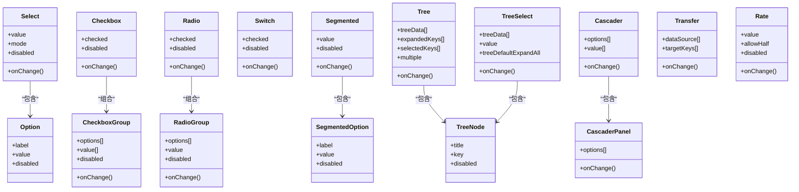

图表来源

- [select.tsx](file://frontend/antd/select/select.tsx)
- [option.tsx](file://frontend/antd/select/option/option.tsx)
- [checkbox.tsx](file://frontend/antd/checkbox/checkbox.tsx)
- [group.tsx](file://frontend/antd/checkbox/group/checkbox.group.tsx)
- [radio.tsx](file://frontend/antd/radio/radio.tsx)
- [radio.group.tsx](file://frontend/antd/radio/group/radio.group.tsx)
- [switch.tsx](file://frontend/antd/switch/switch.tsx)
- [segmented.tsx](file://frontend/antd/segmented/segmented.tsx)
- [option.tsx](file://frontend/antd/segmented/option/segmented.option.tsx)
- [tree.tsx](file://frontend/antd/tree/tree.tsx)
- [tree.node.tsx](file://frontend/antd/tree/tree-node/tree.node.tsx)
- [tree.select.tsx](file://frontend/antd/tree-select/tree-select.tsx)
- [tree.node.tsx](file://frontend/antd/tree-select/tree-node/tree.node.tsx)
- [cascader.tsx](file://frontend/antd/cascader/cascader.tsx)
- [panel.tsx](file://frontend/antd/cascader/panel/panel.tsx)
- [option.tsx](file://frontend/antd/cascader/option/option.tsx)
- [transfer.tsx](file://frontend/antd/transfer/transfer.tsx)
- [rate.tsx](file://frontend/antd/rate/rate.tsx)

## 详细组件分析

### 下拉选择器（Select）

- 数据绑定：支持受控 value 与非受控默认值；onChange 返回选中值或值数组（多选）。
- 选项配置：通过 Option 子项声明 label/value/disabled；支持搜索过滤与标签回填。
- 多选模式：开启多选时，支持标签化展示与清除单个标签。
- 禁用状态：容器与单项均可禁用；禁用时不可展开、不可切换。
- 上下文：context.ts 统一处理默认值、禁用态、多选策略与受控校验。

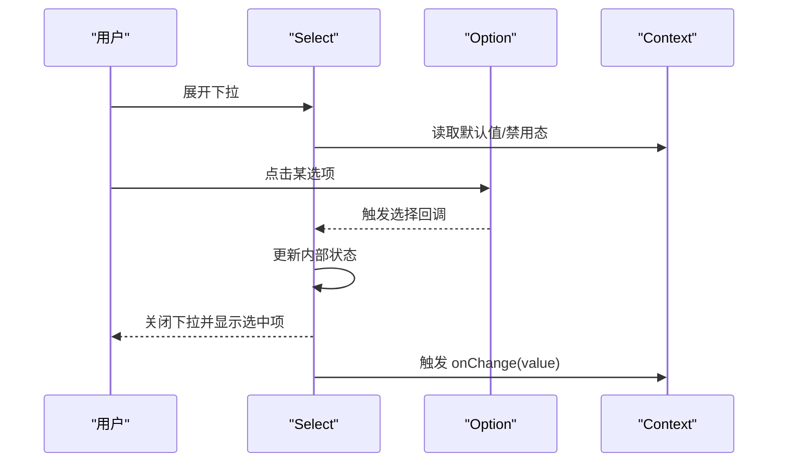

图表来源

- [select.tsx](file://frontend/antd/select/select.tsx)
- [option.tsx](file://frontend/antd/select/option/option.tsx)
- [context.ts](file://frontend/antd/select/context.ts)

章节来源

- [select.tsx](file://frontend/antd/select/select.tsx)
- [option.tsx](file://frontend/antd/select/option/option.tsx)
- [context.ts](file://frontend/antd/select/context.ts)

### 多选框（Checkbox）

- 数据绑定：单个 Checkbox 为受控 checked；Checkbox.Group 接收 value[] 并通过 onChange 同步。
- 选项配置：Group 的 options[] 支持直接传入 label/value/disabled；也可使用子项 Checkbox。
- 多选模式：Group 默认多选；支持全选/反选与半选状态。
- 禁用状态：Group 级禁用影响全部子项；子项也可单独禁用。
- 上下文：context.ts 负责默认值、禁用态与多选策略。

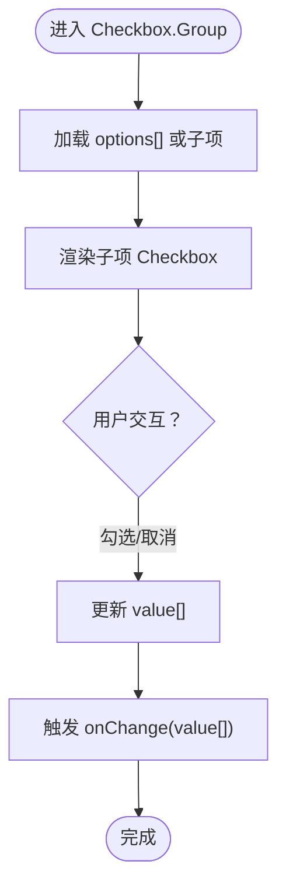

图表来源

- [checkbox.tsx](file://frontend/antd/checkbox/checkbox.tsx)
- [group.tsx](file://frontend/antd/checkbox/group/checkbox.group.tsx)
- [context.ts](file://frontend/antd/checkbox/context.ts)

章节来源

- [checkbox.tsx](file://frontend/antd/checkbox/checkbox.tsx)
- [group.tsx](file://frontend/antd/checkbox/group/checkbox.group.tsx)
- [context.ts](file://frontend/antd/checkbox/context.ts)

### 单选框（Radio）

- 数据绑定：单个 Radio 为受控 checked；Radio.Group 接收 value 并通过 onChange 同步。
- 选项配置：Group 的 options[] 支持 label/value/disabled；也可使用子项 Radio。
- 多选模式：Group 为单选；支持清空与禁用。
- 禁用状态：Group 级禁用影响全部子项；子项也可单独禁用。
- 上下文：context.ts 负责默认值、禁用态与单选策略。

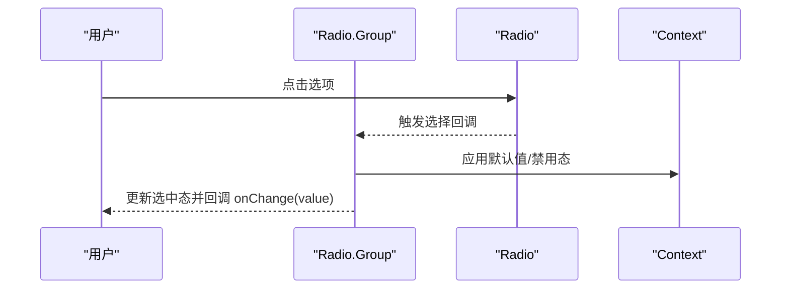

图表来源

- [radio.tsx](file://frontend/antd/radio/radio.tsx)
- [radio.group.tsx](file://frontend/antd/radio/group/radio.group.tsx)
- [context.ts](file://frontend/antd/radio/context.ts)

章节来源

- [radio.tsx](file://frontend/antd/radio/radio.tsx)
- [radio.group.tsx](file://frontend/antd/radio/group/radio.group.tsx)
- [context.ts](file://frontend/antd/radio/context.ts)

### 开关（Switch）

- 数据绑定：受控 checked；onChange 返回新的布尔值。
- 禁用状态：disabled 禁用交互；支持加载态 loading。
- 场景：适合二元选择，如“启用/禁用”“是/否”。

章节来源

- [switch.tsx](file://frontend/antd/switch/switch.tsx)

### 分段控制器（Segmented）

- 数据绑定：受控 value；onChange 返回选中值。
- 选项配置：支持 options[] 或子项 Segmented.Option；可禁用单项。
- 场景：替代 Radio.Group 的紧凑型选择，适合少量离散选项。

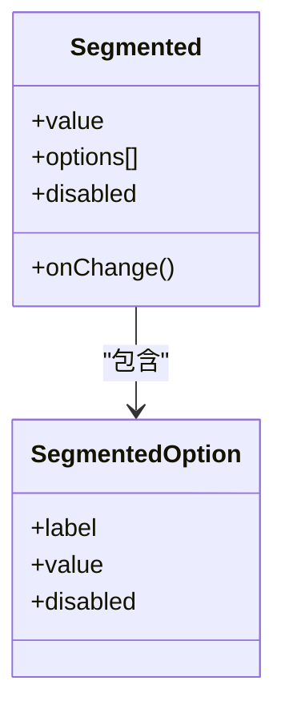

图表来源

- [segmented.tsx](file://frontend/antd/segmented/segmented.tsx)
- [option.tsx](file://frontend/antd/segmented/option/segmented.option.tsx)
- [context.ts](file://frontend/antd/segmented/context.ts)

章节来源

- [segmented.tsx](file://frontend/antd/segmented/segmented.tsx)
- [option.tsx](file://frontend/antd/segmented/option/segmented.option.tsx)
- [context.ts](file://frontend/antd/segmented/context.ts)

### 树形控件（Tree）

- 数据绑定：受控 selectedKeys/expandedKeys；onChange 返回选中键集合。
- 选项配置：treeData[] 支持 title/key/children/disabled；支持拖拽、搜索与批量选择。
- 多选模式：multiple=true 时支持多选；支持受控与非受控。
- 禁用状态：节点级 disabled；支持批量禁用。

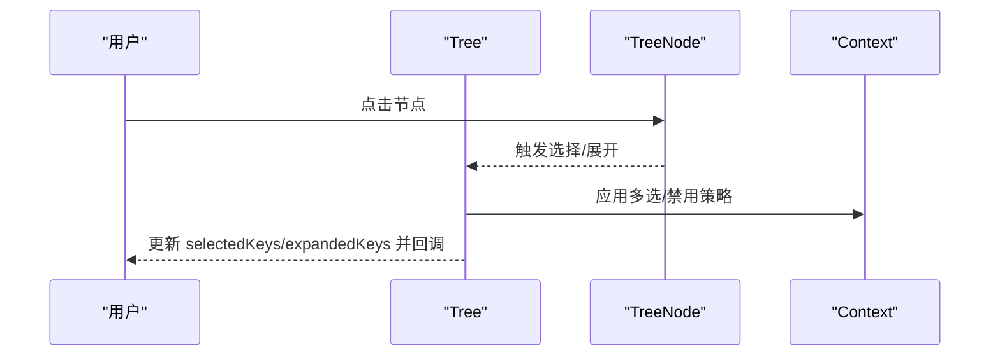

图表来源

- [tree.tsx](file://frontend/antd/tree/tree.tsx)
- [tree.node.tsx](file://frontend/antd/tree/tree-node/tree.node.tsx)
- [context.ts](file://frontend/antd/tree/context.ts)

章节来源

- [tree.tsx](file://frontend/antd/tree/tree.tsx)
- [tree.node.tsx](file://frontend/antd/tree/tree-node/tree.node.tsx)
- [context.ts](file://frontend/antd/tree/context.ts)

### 树选择（TreeSelect）

- 数据绑定：受控 value；onChange 返回选中键。
- 选项配置：treeData[] 与 Select 类似的选项声明；支持搜索过滤与标签回填。
- 多选模式：支持多选与父子联动策略（如仅叶子）。
- 禁用状态：支持整体与节点级禁用。

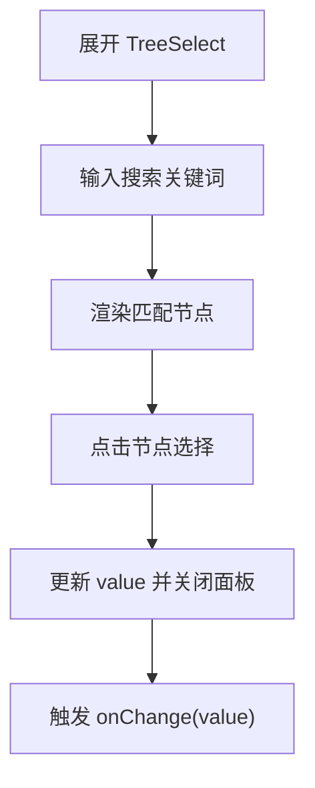

图表来源

- [tree.select.tsx](file://frontend/antd/tree-select/tree-select.tsx)
- [tree.node.tsx](file://frontend/antd/tree-select/tree-node/tree.node.tsx)
- [context.ts](file://frontend/antd/tree-select/context.ts)

章节来源

- [tree.select.tsx](file://frontend/antd/tree-select/tree-select.tsx)
- [tree.node.tsx](file://frontend/antd/tree-select/tree-node/tree.node.tsx)
- [context.ts](file://frontend/antd/tree-select/context.ts)

### 级联选择（Cascader）

- 数据绑定：受控 value[]；onChange 返回完整路径值数组。
- 选项配置：options[] 支持 label/value/children；支持异步加载子级。
- 多选模式：通常为单选路径；可通过扩展实现多路径选择。
- 禁用状态：支持禁用整树与节点级禁用。

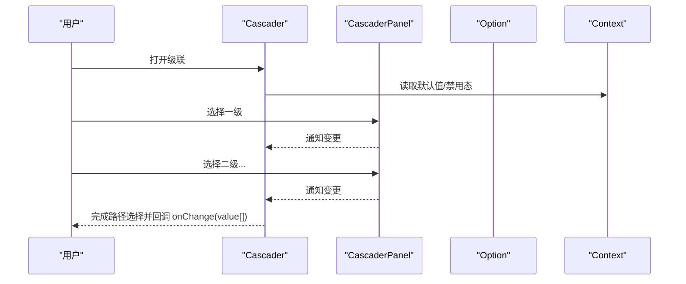

图表来源

- [cascader.tsx](file://frontend/antd/cascader/cascader.tsx)
- [panel.tsx](file://frontend/antd/cascader/panel/panel.tsx)
- [option.tsx](file://frontend/antd/cascader/option/option.tsx)
- [context.ts](file://frontend/antd/cascader/context.ts)

章节来源

- [cascader.tsx](file://frontend/antd/cascader/cascader.tsx)
- [panel.tsx](file://frontend/antd/cascader/panel/panel.tsx)
- [option.tsx](file://frontend/antd/cascader/option/option.tsx)
- [context.ts](file://frontend/antd/cascader/context.ts)

### 穿梭框（Transfer）

- 数据绑定：受控 targetKeys[]；onChange 返回目标列表键集合。
- 选项配置：dataSource[] 支持 title/key；支持搜索过滤与批量操作。
- 多选模式：左侧到右侧的双向移动；支持全选/反选。
- 禁用状态：支持整体禁用与按钮禁用。

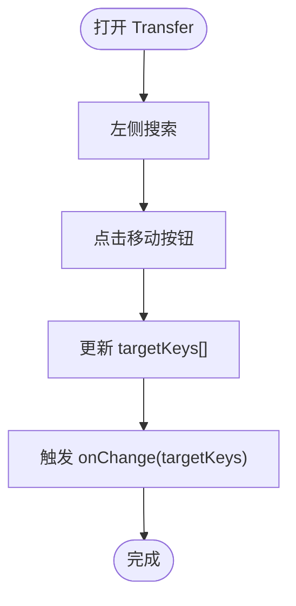

图表来源

- [transfer.tsx](file://frontend/antd/transfer/transfer.tsx)

章节来源

- [transfer.tsx](file://frontend/antd/transfer/transfer.tsx)

### 评分（Rate）

- 数据绑定：受控 value；onChange 返回评分值。
- 选项配置：支持 allowHalf 半星、count 总数、tooltips 文案。
- 禁用状态：disabled 禁用交互；支持只读 readonly。
- 场景：快速表达满意度、等级评价。

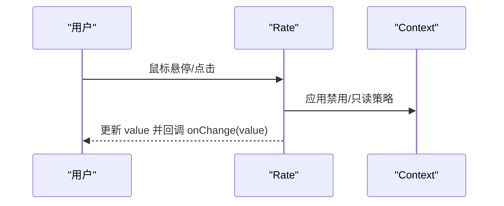

图表来源

- [rate.tsx](file://frontend/antd/rate/rate.tsx)
- [context.ts](file://frontend/antd/rate/context.ts)

章节来源

- [rate.tsx](file://frontend/antd/rate/rate.tsx)
- [context.ts](file://frontend/antd/rate/context.ts)

## 依赖关系分析

- 组件间耦合度低：容器组件通过子项组件声明式组合，避免强耦合。
- 上下文集中：各组件的 context.ts 聚合默认值、禁用态与多选策略，降低重复逻辑。
- 事件链路清晰：从用户交互到容器更新再到回调，形成稳定的数据流。

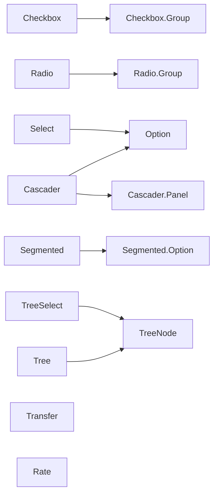

图表来源

- [select.tsx](file://frontend/antd/select/select.tsx)
- [checkbox.tsx](file://frontend/antd/checkbox/checkbox.tsx)
- [radio.tsx](file://frontend/antd/radio/radio.tsx)
- [segmented.tsx](file://frontend/antd/segmented/segmented.tsx)
- [tree.tsx](file://frontend/antd/tree/tree.tsx)
- [tree.select.tsx](file://frontend/antd/tree-select/tree-select.tsx)
- [cascader.tsx](file://frontend/antd/cascader/cascader.tsx)
- [transfer.tsx](file://frontend/antd/transfer/transfer.tsx)
- [rate.tsx](file://frontend/antd/rate/rate.tsx)

章节来源

- [select.tsx](file://frontend/antd/select/select.tsx)
- [checkbox.tsx](file://frontend/antd/checkbox/checkbox.tsx)
- [radio.tsx](file://frontend/antd/radio/radio.tsx)
- [segmented.tsx](file://frontend/antd/segmented/segmented.tsx)
- [tree.tsx](file://frontend/antd/tree/tree.tsx)
- [tree.select.tsx](file://frontend/antd/tree-select/tree-select.tsx)
- [cascader.tsx](file://frontend/antd/cascader/cascader.tsx)
- [transfer.tsx](file://frontend/antd/transfer/transfer.tsx)
- [rate.tsx](file://frontend/antd/rate/rate.tsx)

## 性能与虚拟滚动

- 大量选项场景建议：
  - 使用虚拟滚动：对长列表（如 Select/Tree/Transfer）采用虚拟滚动渲染，仅渲染可视区域内的节点，显著降低 DOM 数量与重排成本。
  - 懒加载与分页：对 TreeSelect/Cascader 支持异步加载子节点，减少初始渲染压力。
  - 缓存与去抖：对搜索过滤与 onChange 回调进行去抖处理，避免频繁重绘。
  - 受控更新优化：在上层表单中合并多次状态变更，减少不必要的重渲染。
- 具体落地点：
  - Select：对 Option 列表启用虚拟滚动与搜索过滤。
  - Tree/TreeSelect：对节点渲染启用虚拟滚动与懒加载。
  - Transfer：对左右列表启用虚拟滚动与批量操作优化。

[本节为通用性能指导，无需特定文件引用]

## 可访问性与键盘操作

- 键盘支持：
  - 使用 Tab/Shift+Tab 在选项间导航；
  - 使用 Enter/Space 确认选择；
  - 使用方向键在多选项中移动（如 Tree/Select/Cascader）。
- 屏幕阅读器友好：
  - 为每个选项提供语义化 label；
  - 禁用态与错误态提供 aria-\* 属性与提示文案；
  - 对评分（Rate）提供数值读屏与工具提示。
- 建议：
  - 为容器组件提供 aria-expanded/aria-controls；
  - 为禁用选项提供 aria-disabled；
  - 为必填字段提供 aria-required。

[本节为通用可访问性指导，无需特定文件引用]

## 故障排查指南

- 常见问题与定位：
  - 选中值未更新：检查是否正确传入受控 value 与 onChange；确认容器与子项的 value/checked 一致性。
  - 多选无效：确认 Group 的 options[] 结构与 value[] 类型；检查禁用态与半选状态。
  - 禁用不生效：核对 disabled 属性层级（容器 vs 子项）；检查 context 中的禁用策略。
  - 性能卡顿：对长列表启用虚拟滚动；减少不必要的重渲染与深层嵌套。
- 调试建议：
  - 在 onChange 中打印当前值，验证数据流；
  - 使用浏览器开发者工具观察 DOM 数量与重排情况；
  - 对 TreeSelect/Cascader 检查异步加载是否正确触发。

章节来源

- [select.tsx](file://frontend/antd/select/select.tsx)
- [checkbox.tsx](file://frontend/antd/checkbox/checkbox.tsx)
- [radio.tsx](file://frontend/antd/radio/radio.tsx)
- [segmented.tsx](file://frontend/antd/segmented/segmented.tsx)
- [tree.tsx](file://frontend/antd/tree/tree.tsx)
- [tree.select.tsx](file://frontend/antd/tree-select/tree-select.tsx)
- [cascader.tsx](file://frontend/antd/cascader/cascader.tsx)
- [transfer.tsx](file://frontend/antd/transfer/transfer.tsx)
- [rate.tsx](file://frontend/antd/rate/rate.tsx)

## 结论

选择类组件在本项目中实现了统一的容器-子项-上下文架构，具备良好的可扩展性与可维护性。通过受控数据绑定、清晰的选项配置与完善的禁用策略，能够满足从简单二元选择到复杂树形/级联选择的多样化需求。配合虚拟滚动与可访问性设计，可在大规模数据与无障碍场景下保持良好体验。
