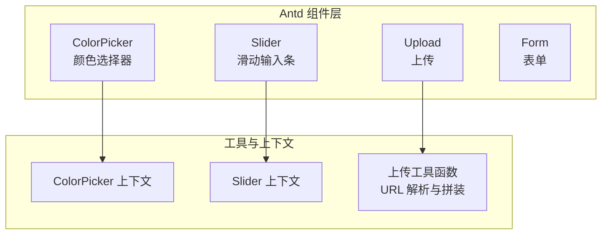
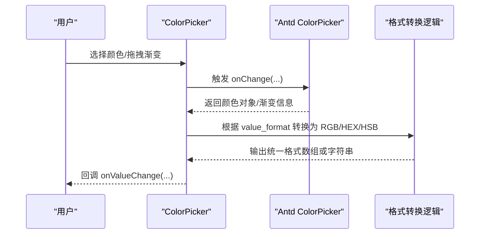
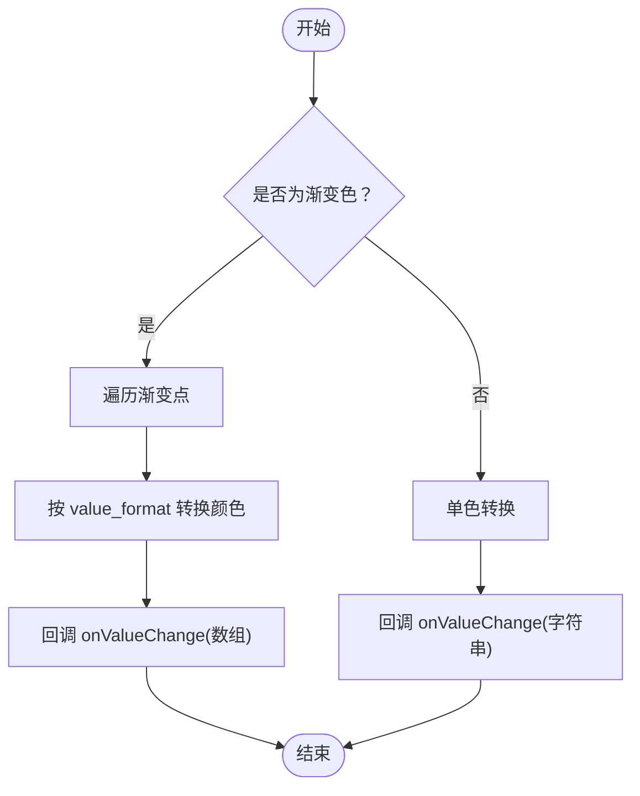
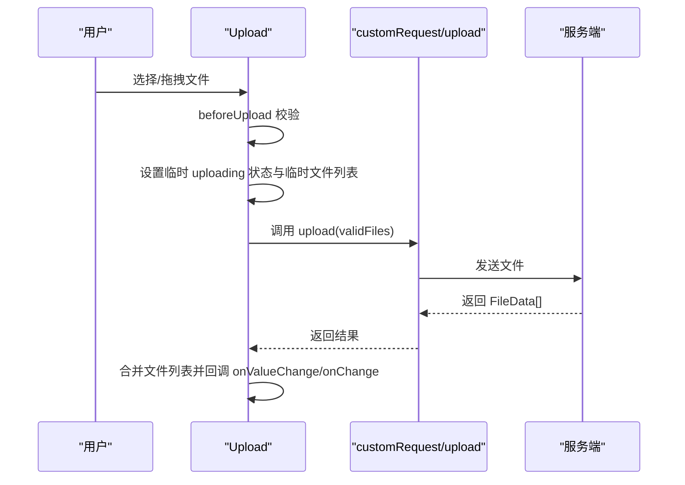
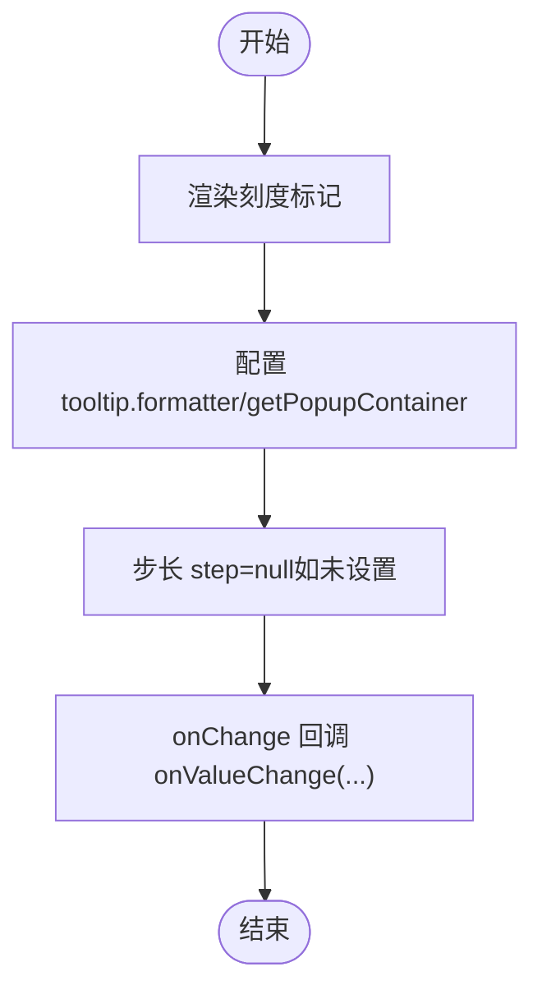
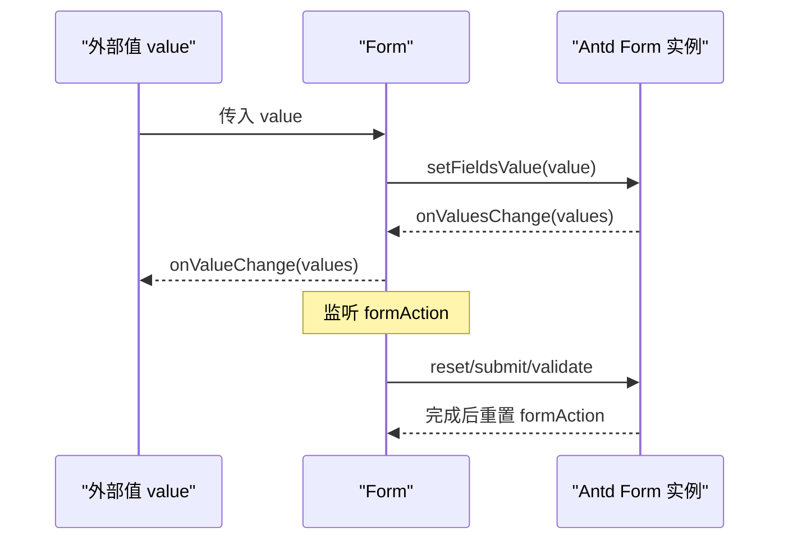
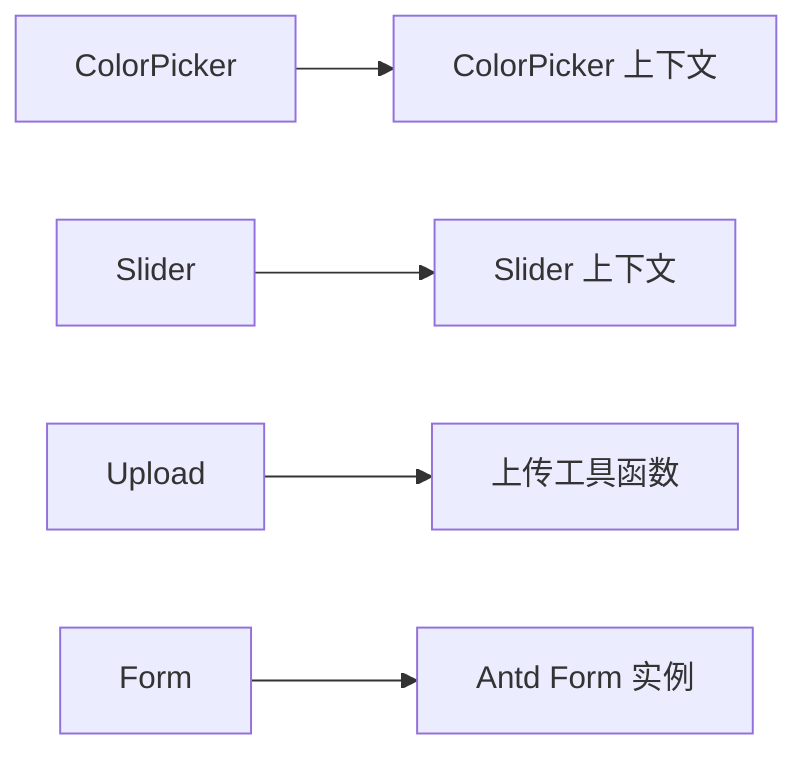

# 颜色文件组件

<cite>
**本文引用的文件**
- [color-picker.tsx](file://frontend/antd/color-picker/color-picker.tsx)
- [context.ts（颜色选择器）](file://frontend/antd/color-picker/context.ts)
- [upload.tsx](file://frontend/antd/upload/upload.tsx)
- [upload.ts（工具函数）](file://frontend/utils/upload.ts)
- [slider.tsx](file://frontend/antd/slider/slider.tsx)
- [context.ts（滑动输入条）](file://frontend/antd/slider/context.ts)
- [form.tsx](file://frontend/antd/form/form.tsx)
- [README.md（颜色选择器文档）](file://docs/components/antd/color_picker/README.md)
- [README.md（上传文档）](file://docs/components/antd/upload/README.md)
- [README.md（滑动输入条文档）](file://docs/components/antd/slider/README.md)
- [README.md（表单文档）](file://docs/components/antd/form/README.md)
</cite>

## 目录

1. [简介](#简介)
2. [项目结构](#项目结构)
3. [核心组件](#核心组件)
4. [架构总览](#架构总览)
5. [详细组件分析](#详细组件分析)
6. [依赖关系分析](#依赖关系分析)
7. [性能考量](#性能考量)
8. [故障排查指南](#故障排查指南)
9. [结论](#结论)
10. [附录](#附录)

## 简介

本文件聚焦于颜色文件与高级输入组件：颜色选择器（ColorPicker）、上传（Upload）、滑动输入条（Slider）、表单（Form）。内容涵盖：

- 颜色格式转换（RGB、HEX、HSB），渐变色处理与预设色板
- 上传配置、拖拽上传、文件预览、进度显示与错误处理
- 表单整体设计模式、字段验证、动态表单与嵌套表单
- 可访问性与键盘操作支持
- 大文件处理、并发上传、错误重试等性能优化策略
- 复杂表单场景的数据流管理与最佳实践

## 项目结构

这些组件位于前端 Svelte + Ant Design 生态中，通过 sveltify 将 Ant Design 组件桥接为 Svelte 使用，并在必要处封装状态与回调以适配 Gradio 数据域。

图示来源

- [color-picker.tsx:1-106](file://frontend/antd/color-picker/color-picker.tsx#L1-L106)
- [upload.tsx:1-282](file://frontend/antd/upload/upload.tsx#L1-L282)
- [slider.tsx:1-97](file://frontend/antd/slider/slider.tsx#L1-L97)
- [form.tsx:1-79](file://frontend/antd/form/form.tsx#L1-L79)

章节来源

- [color-picker.tsx:1-106](file://frontend/antd/color-picker/color-picker.tsx#L1-L106)
- [upload.tsx:1-282](file://frontend/antd/upload/upload.tsx#L1-L282)
- [slider.tsx:1-97](file://frontend/antd/slider/slider.tsx#L1-L97)
- [form.tsx:1-79](file://frontend/antd/form/form.tsx#L1-L79)

## 核心组件

- 颜色选择器（ColorPicker）
  - 支持 RGB/HEX/HSB 三种颜色格式输出
  - 渐变色解析与多点颜色映射
  - 预设色板渲染与自定义面板/文本插槽
- 上传（Upload）
  - 自定义请求钩子与进度格式化
  - 文件列表规范化、最大数量控制
  - 拖拽/点击上传、预览与图标渲染插槽
- 滑动输入条（Slider）
  - 刻度标记渲染（支持标签插槽）
  - 步长与提示容器自定义
- 表单（Form）
  - 值域绑定与变更通知
  - 手动触发重置/提交/校验动作
  - 必填标记与反馈图标插槽

章节来源

- [color-picker.tsx:11-103](file://frontend/antd/color-picker/color-picker.tsx#L11-L103)
- [upload.tsx:21-279](file://frontend/antd/upload/upload.tsx#L21-L279)
- [slider.tsx:37-94](file://frontend/antd/slider/slider.tsx#L37-L94)
- [form.tsx:15-76](file://frontend/antd/form/form.tsx#L15-L76)

## 架构总览

组件采用“桥接 + 装饰”的架构：以 Ant Design 原生组件为核心，通过 sveltify 包裹并注入值变更回调、插槽渲染与上下文注入，实现与 Gradio 数据域的无缝对接。

图示来源

- [color-picker.tsx:71-95](file://frontend/antd/color-picker/color-picker.tsx#L71-L95)

章节来源

- [color-picker.tsx:1-106](file://frontend/antd/color-picker/color-picker.tsx#L1-L106)

## 详细组件分析

### 颜色选择器（ColorPicker）

- 功能要点
  - 颜色格式转换：RGB/HEX/HSB 三选一，按 value_format 输出
  - 渐变色处理：遍历渐变点，分别转换为指定格式并返回数组
  - 预设色板：支持传入 presets 或通过上下文注入
  - 插槽扩展：panelRender、showText 的插槽化渲染
- 关键流程

图示来源

- [color-picker.tsx:71-95](file://frontend/antd/color-picker/color-picker.tsx#L71-L95)

- 上下文与预设色板
  - 通过 createItemsContext 注入 marks/presets 等项集合
  - 预设色板优先使用外部传入，否则从上下文渲染

- 可访问性与键盘操作
  - 基于 Ant Design 原生组件，遵循其可访问性规范
  - 建议在业务侧补充 aria-label、aria-describedby 等属性

章节来源

- [color-picker.tsx:1-106](file://frontend/antd/color-picker/color-picker.tsx#L1-L106)
- [context.ts（颜色选择器）:1-7](file://frontend/antd/color-picker/context.ts#L1-L7)
- [README.md（颜色选择器文档）:1-9](file://docs/components/antd/color_picker/README.md#L1-L9)

### 上传（Upload）

- 功能要点
  - 自定义上传：upload(files) -> Promise<FileData[]>
  - 文件列表规范化：将非 UploadFile 形式转为 UploadFile 结构
  - 最大数量控制：maxCount=1 时替换，否则追加
  - 进度与图标：支持自定义进度格式化与图标渲染插槽
  - 预览与图片识别：previewFile/isImageUrl 自定义
- 关键流程

图示来源

- [upload.tsx:147-227](file://frontend/antd/upload/upload.tsx#L147-L227)

- 工具函数：URL 获取
  - getFetchableUrl：将相对路径拼接为可访问 URL
  - getFileUrl：根据 FileData/字符串/其他类型返回可用 URL

- 性能与可靠性
  - 上传中禁用交互，避免重复触发
  - 临时文件列表提升用户体验，完成后替换为真实结果
  - 错误捕获后恢复 uploading 状态

章节来源

- [upload.tsx:1-282](file://frontend/antd/upload/upload.tsx#L1-L282)
- [upload.ts（工具函数）:1-45](file://frontend/utils/upload.ts#L1-L45)
- [README.md（上传文档）:1-9](file://docs/components/antd/upload/README.md#L1-L9)

### 滑动输入条（Slider）

- 功能要点
  - 刻度标记渲染：支持 label/children 插槽与属性透传
  - 提示容器与格式化：tooltip.formatter 与 getPopupContainer
  - 步长控制：step 未设置时显式传入 null
- 关键流程

图示来源

- [slider.tsx:68-89](file://frontend/antd/slider/slider.tsx#L68-L89)

章节来源

- [slider.tsx:1-97](file://frontend/antd/slider/slider.tsx#L1-L97)
- [context.ts（滑动输入条）:1-7](file://frontend/antd/slider/context.ts#L1-L7)
- [README.md（滑动输入条文档）:1-9](file://docs/components/antd/slider/README.md#L1-L9)

### 表单（Form）

- 功能要点
  - 值域绑定：value -> setFieldsValue；onValuesChange -> onValueChange
  - 表单动作：通过 formAction='reset'|'submit'|'validate' 触发对应行为
  - 插槽：requiredMark、feedbackIcons
- 关键流程

图示来源

- [form.tsx:32-45](file://frontend/antd/form/form.tsx#L32-L45)

章节来源

- [form.tsx:1-79](file://frontend/antd/form/form.tsx#L1-L79)
- [README.md（表单文档）:1-14](file://docs/components/antd/form/README.md#L1-L14)

## 依赖关系分析

- 组件间耦合
  - ColorPicker/Slider 通过各自的 Items 上下文注入项集合，降低与外部数据的耦合
  - Upload 依赖工具函数进行 URL 解析，避免在组件内分散逻辑
  - Form 仅负责桥接与动作分发，不直接处理业务数据
- 外部依赖
  - Ant Design 原生组件作为基础 UI
  - Gradio 客户端类型（FileData）用于上传数据域

图示来源

- [color-picker.tsx:1-106](file://frontend/antd/color-picker/color-picker.tsx#L1-L106)
- [slider.tsx:1-97](file://frontend/antd/slider/slider.tsx#L1-L97)
- [upload.tsx:1-282](file://frontend/antd/upload/upload.tsx#L1-L282)
- [form.tsx:1-79](file://frontend/antd/form/form.tsx#L1-L79)

章节来源

- [color-picker.tsx:1-106](file://frontend/antd/color-picker/color-picker.tsx#L1-L106)
- [slider.tsx:1-97](file://frontend/antd/slider/slider.tsx#L1-L97)
- [upload.tsx:1-282](file://frontend/antd/upload/upload.tsx#L1-L282)
- [form.tsx:1-79](file://frontend/antd/form/form.tsx#L1-L79)

## 性能考量

- 颢色选择器
  - 渐变色转换在 onChange 中完成，避免额外渲染开销
  - 预设色板通过 useMemo 缓存渲染结果
- 上传
  - 临时文件列表减少 UI 抖动
  - 上传中禁用交互，防止并发提交
  - 支持自定义进度格式化，避免频繁重绘
- 滑动输入条
  - 刻度标记按需渲染，减少 DOM 节点
  - 步长显式传入 null，避免无效计算
- 表单
  - 值变更仅在 onValuesChange 时回调，避免全量同步

[本节为通用性能建议，无需特定文件引用]

## 故障排查指南

- 颜色选择器
  - 若渐变色未正确转换，检查 value_format 是否与期望一致
  - 预设色板不显示时，确认上下文注入或 presets 属性是否正确传入
- 上传
  - 无法上传：确认 upload 函数返回值与 FileData 结构一致
  - 进度不更新：检查 progress.format 是否正确传入
  - 图标/预览异常：核对 iconRender/itemRender 插槽与自定义函数
- 滑动输入条
  - 刻度不显示：确认 marks 或上下文项是否正确注入
  - 步长无效：确保 step 未被覆盖为 undefined
- 表单
  - 值不同步：确认 value 与 onValueChange 的双向绑定是否生效
  - 动作无效：检查 formAction 是否被重置为 null

章节来源

- [color-picker.tsx:1-106](file://frontend/antd/color-picker/color-picker.tsx#L1-L106)
- [upload.tsx:1-282](file://frontend/antd/upload/upload.tsx#L1-L282)
- [slider.tsx:1-97](file://frontend/antd/slider/slider.tsx#L1-L97)
- [form.tsx:1-79](file://frontend/antd/form/form.tsx#L1-L79)

## 结论

上述组件以 Ant Design 为基础，结合上下文注入与工具函数，实现了高性能、可扩展且易维护的高级输入能力。通过统一的值变更回调与插槽机制，能够满足复杂表单与文件处理场景的需求。建议在实际项目中配合错误边界、加载状态与可访问性属性，进一步提升稳定性与用户体验。

[本节为总结性内容，无需特定文件引用]

## 附录

- 示例与文档入口
  - 颜色选择器：见文档目录中的示例与说明
  - 上传：见文档目录中的示例与说明
  - 滑动输入条：见文档目录中的示例与说明
  - 表单：见文档目录中的示例与说明

章节来源

- [README.md（颜色选择器文档）:1-9](file://docs/components/antd/color_picker/README.md#L1-L9)
- [README.md（上传文档）:1-9](file://docs/components/antd/upload/README.md#L1-L9)
- [README.md（滑动输入条文档）:1-9](file://docs/components/antd/slider/README.md#L1-L9)
- [README.md（表单文档）:1-14](file://docs/components/antd/form/README.md#L1-L14)
