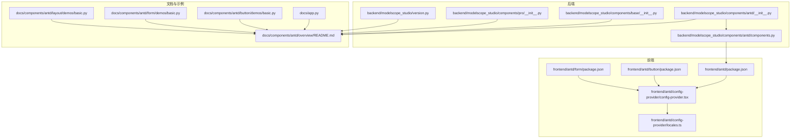
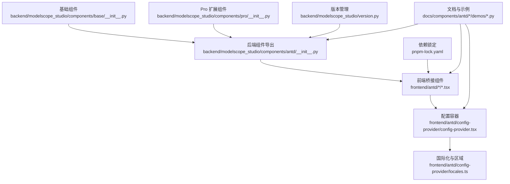
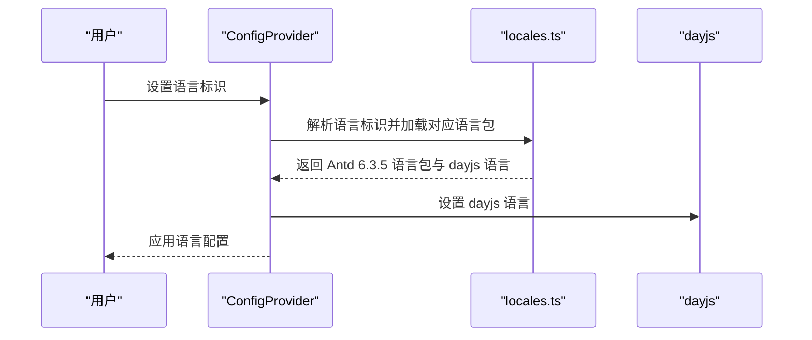
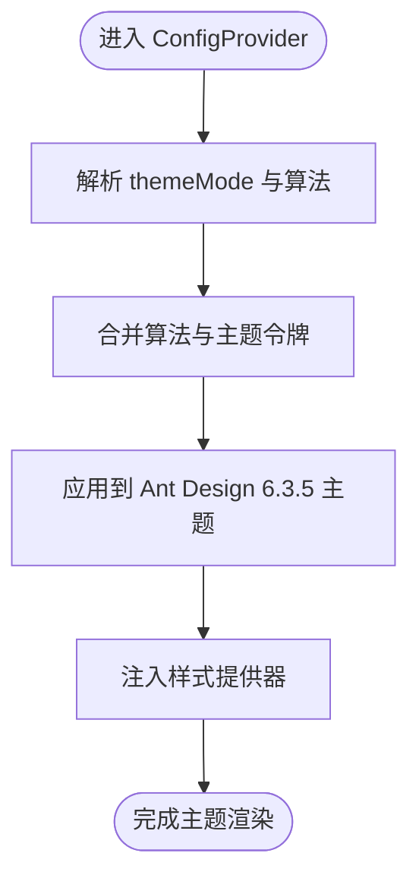
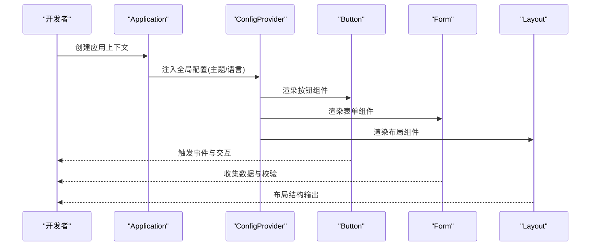
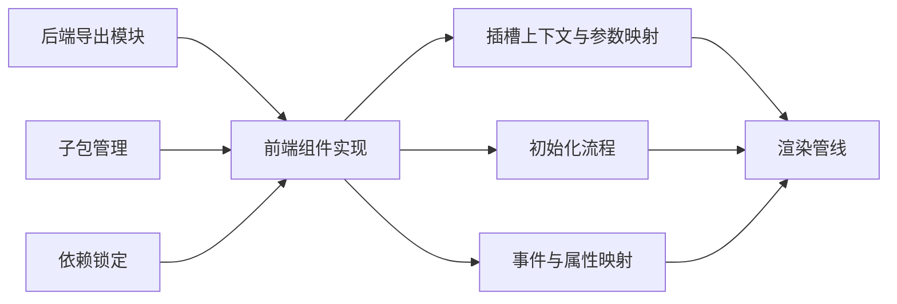

# 组件概览

<cite>
**本文引用的文件**
- [backend/modelscope_studio/components/antd/__init__.py](file://backend/modelscope_studio/components/antd/__init__.py)
- [backend/modelscope_studio/components/antd/components.py](file://backend/modelscope_studio/components/antd/components.py)
- [frontend/antd/package.json](file://frontend/antd/package.json)
- [docs/components/antd/overview/README.md](file://docs/components/antd/overview/README.md)
- [docs/README.md](file://docs/README.md)
- [backend/modelscope_studio/components/base/__init__.py](file://backend/modelscope_studio/components/base/__init__.py)
- [backend/modelscope_studio/components/pro/__init__.py](file://backend/modelscope_studio/components/pro/__init__.py)
- [docs/app.py](file://docs/app.py)
- [frontend/antd/config-provider/config-provider.tsx](file://frontend/antd/config-provider/config-provider.tsx)
- [frontend/antd/config-provider/locales.ts](file://frontend/antd/config-provider/locales.ts)
- [docs/components/antd/button/demos/basic.py](file://docs/components/antd/button/demos/basic.py)
- [docs/components/antd/form/demos/basic.py](file://docs/components/antd/form/demos/basic.py)
- [docs/components/antd/layout/demos/basic.py](file://docs/components/antd/layout/demos/basic.py)
- [frontend/svelte-preprocess-react/svelte-contexts/slot.svelte.ts](file://frontend/svelte-preprocess-react/svelte-contexts/slot.svelte.ts)
- [frontend/svelte-preprocess-react/component/import.ts](file://frontend/svelte-preprocess-react/component/import.ts)
- [frontend/svelte-preprocess-react/component/props.svelte.ts](file://frontend/svelte-preprocess-react/component/props.svelte.ts)
- [docs/components/base/fragment/README-zh_CN.md](file://docs/components/base/fragment/README-zh_CN.md)
- [CHANGELOG.md](file://CHANGELOG.md)
- [pnpm-lock.yaml](file://pnpm-lock.yaml)
- [package.json](file://package.json)
- [backend/modelscope_studio/version.py](file://backend/modelscope_studio/version.py)
</cite>

## 更新摘要

**所做变更**

- 更新版本信息以反映从 Ant Design 5.x 到 6.3.5 的升级
- 更新 Gradio 从 5.x 到 6.0 的迁移信息
- 更新组件版本兼容性说明
- 更新主题定制和国际化机制的版本相关信息

## 目录

1. [简介](#简介)
2. [项目结构](#项目结构)
3. [核心组件](#核心组件)
4. [架构总览](#架构总览)
5. [组件分类与组织结构](#组件分类与组织结构)
6. [组件使用原则与最佳实践](#组件使用原则与最佳实践)
7. [响应式设计与国际化](#响应式设计与国际化)
8. [主题定制与样式系统](#主题定制与样式系统)
9. [典型应用场景与组合使用](#典型应用场景与组合使用)
10. [组件依赖关系与集成模式](#组件依赖关系与集成模式)
11. [性能考量](#性能考量)
12. [故障排查指南](#故障排查指南)
13. [结论](#结论)

## 简介

本概览面向 Ant Design 组件库在 modelscope_studio 中的整体呈现，涵盖功能特性、设计理念、整体架构、组件分类体系、使用原则、响应式与国际化、主题定制、典型场景与组合方式，以及组件间的依赖与集成模式。该组件库基于 Gradio 6.0 构建，提供更丰富的页面布局与交互能力，并通过统一的配置容器适配 Ant Design 6.3.5 的样式与行为。

**更新** 项目已从 Gradio 5.x 升级到 6.0，Ant Design 从 5.x 升级到 6.3.5，带来更好的性能和兼容性。

**版本**: 本文档适用于 ModelScope Studio 2.0+，支持 Gradio 6.0、Ant Design 6.3.5 和 Ant Design X 2.0

## 项目结构

- 后端模块导出：Python 层通过模块聚合导出所有 Ant Design 组件，便于直接按需导入与使用。
- 前端实现：每个 Ant Design 组件以 Svelte/React 形式实现，配合类型化属性与插槽机制，实现与 Gradio 6.0 的桥接。
- 文档与示例：配套文档与演示脚本，覆盖快速上手、属性限制、事件绑定、插槽渲染、函数传参、国际化与主题定制等主题。

**图表来源**

- [backend/modelscope_studio/components/antd/**init**.py:1-150](file://backend/modelscope_studio/components/antd/__init__.py#L1-L150)
- [backend/modelscope_studio/components/antd/components.py:1-144](file://backend/modelscope_studio/components/antd/components.py#L1-L144)
- [frontend/antd/package.json:1-6](file://frontend/antd/package.json#L1-L6)
- [frontend/antd/config-provider/config-provider.tsx:1-154](file://frontend/antd/config-provider/config-provider.tsx#L1-L154)
- [frontend/antd/config-provider/locales.ts:313-465](file://frontend/antd/config-provider/locales.ts#L313-L465)
- [docs/components/antd/overview/README.md:1-75](file://docs/components/antd/overview/README.md#L1-L75)
- [docs/app.py:200-399](file://docs/app.py#L200-L399)
- [docs/components/antd/button/demos/basic.py:1-26](file://docs/components/antd/button/demos/basic.py#L1-L26)
- [docs/components/antd/form/demos/basic.py:1-94](file://docs/components/antd/form/demos/basic.py#L1-L94)
- [docs/components/antd/layout/demos/basic.py:1-88](file://docs/components/antd/layout/demos/basic.py#L1-L88)
- [backend/modelscope_studio/version.py:1-2](file://backend/modelscope_studio/version.py#L1-L2)
- [frontend/antd/button/package.json:1-15](file://frontend/antd/button/package.json#L1-L15)
- [frontend/antd/form/package.json:1-15](file://frontend/antd/form/package.json#L1-L15)

**章节来源**

- [docs/README.md:19-75](file://docs/README.md#L19-L75)
- [docs/components/antd/overview/README.md:1-75](file://docs/components/antd/overview/README.md#L1-L75)
- [docs/app.py:200-399](file://docs/app.py#L200-L399)
- [CHANGELOG.md:13](file://CHANGELOG.md#L13)

## 核心组件

- 组件导出：后端通过模块聚合导出全部 Ant Design 组件，形成统一命名空间，便于直接导入使用。
- 配置容器：ConfigProvider 提供主题、语言、弹层容器等全局配置，兼容 Ant Design 6.3.5 并注入 Gradio 6.0 样式适配。
- 基础组件：Application、AutoLoading、Fragment 等基础能力，确保组件树正确渲染与加载态反馈。
- Pro 组件：面向高级场景的扩展组件（如聊天机器人、编辑器、Web Sandbox 等）。

**更新** 所有组件现已兼容 Ant Design 6.3.5 和 Gradio 6.0 的新特性。

**章节来源**

- [backend/modelscope_studio/components/antd/**init**.py:1-150](file://backend/modelscope_studio/components/antd/__init__.py#L1-L150)
- [backend/modelscope_studio/components/antd/components.py:1-144](file://backend/modelscope_studio/components/antd/components.py#L1-L144)
- [backend/modelscope_studio/components/base/**init**.py:1-11](file://backend/modelscope_studio/components/base/__init__.py#L1-L11)
- [backend/modelscope_studio/components/pro/**init**.py:1-7](file://backend/modelscope_studio/components/pro/__init__.py#L1-L7)
- [frontend/antd/config-provider/config-provider.tsx:1-154](file://frontend/antd/config-provider/config-provider.tsx#L1-L154)
- [pnpm-lock.yaml:2830](file://pnpm-lock.yaml#L2830-L2835)

## 架构总览

整体架构围绕"后端组件导出 + 前端桥接渲染 + 文档与示例"的闭环展开。后端负责组件类与属性映射，前端负责将属性与插槽转换为 React/JSX 渲染，并通过 ConfigProvider 实现主题与国际化注入；文档与示例提供使用范式与约束说明。

**更新** 架构现已完全适配 Gradio 6.0 的新事件系统和组件生命周期。

**图表来源**

- [backend/modelscope_studio/components/antd/**init**.py:1-150](file://backend/modelscope_studio/components/antd/__init__.py#L1-L150)
- [frontend/antd/config-provider/config-provider.tsx:1-154](file://frontend/antd/config-provider/config-provider.tsx#L1-L154)
- [frontend/antd/config-provider/locales.ts:313-465](file://frontend/antd/config-provider/locales.ts#L313-L465)
- [backend/modelscope_studio/components/base/**init**.py:1-11](file://backend/modelscope_studio/components/base/__init__.py#L1-L11)
- [backend/modelscope_studio/components/pro/**init**.py:1-7](file://backend/modelscope_studio/components/pro/__init__.py#L1-L7)
- [docs/components/antd/button/demos/basic.py:1-26](file://docs/components/antd/button/demos/basic.py#L1-L26)
- [backend/modelscope_studio/version.py:1-2](file://backend/modelscope_studio/version.py#L1-L2)
- [pnpm-lock.yaml:2830](file://pnpm-lock.yaml#L2830-L2835)

## 组件分类与组织结构

根据文档中的导航结构，Ant Design 组件被划分为六大类别，便于按功能域检索与使用：

- 通用组件
  - 包含：Button、Icon、Typography 等
  - 示例：按钮、图标、排版
- 布局组件
  - 包含：Divider、Flex、Grid、Layout、Space、Splitter 等
  - 示例：栅格、弹性布局、分割面板、页面布局
- 导航组件
  - 包含：Anchor、Breadcrumb、Dropdown、Menu、Pagination、Steps 等
  - 示例：锚点、面包屑、下拉菜单、导航菜单、分页、步骤条
- 数据录入组件
  - 包含：AutoComplete、Cascader、Checkbox、ColorPicker、DatePicker、Form、Input、InputNumber、Mentions、Radio、Rate、Select、Slider、Switch、TimePicker、Transfer、TreeSelect、Upload 等
  - 示例：表单、输入、选择、时间/日期、开关、滑块、上传
- 数据展示组件
  - 包含：Avatar、Badge、Calendar、Card、Carousel、Collapse、Descriptions、Empty、Image、List、Popover、QRCode、Segmented、Statistic、Table、Tabs、Tag、Timeline、Tooltip、Tour、Tree 等
  - 示例：卡片、表格、标签、时间轴、树形控件、统计数值
- 反馈组件
  - 包含：Alert、Drawer、Message、Modal、Notification 等
  - 示例：警告提示、抽屉、消息、模态框、通知

**更新** 所有组件均已适配 Ant Design 6.3.5 的新 API 和样式规范。

上述分类与示例均来自文档侧的导航与示例脚本，便于开发者快速定位组件与参考用法。

**章节来源**

- [docs/app.py:200-399](file://docs/app.py#L200-L399)
- [docs/components/antd/button/demos/basic.py:1-26](file://docs/components/antd/button/demos/basic.py#L1-L26)
- [docs/components/antd/form/demos/basic.py:1-94](file://docs/components/antd/form/demos/basic.py#L1-L94)
- [docs/components/antd/layout/demos/basic.py:1-88](file://docs/components/antd/layout/demos/basic.py#L1-L88)

## 组件使用原则与最佳实践

- 统一入口：通过导入 antd 模块获得所有组件，避免分散导入。
- 包裹容器：所有 antd 组件必须置于 Application 与 ConfigProvider 之间，确保依赖与样式正常生效。
- 加载态反馈：建议使用 AutoLoading 在请求期间自动显示加载动画，提升用户体验。
- 事件绑定：事件采用 Gradio 6.0 的事件绑定形式，参数通过数组形式存储于特定字段，注意解构与处理。
- 插槽机制：Python 无法直接传递组件作为参数，需使用 Slot 包裹模块；若仅为字符串或数字可直接作为属性传入。
- 函数传参：将 JS 函数以字符串形式传入，前端会自动编译为函数；返回 ReactNode 的函数可通过两种方式处理：作为普通节点渲染或通过全局 React 对象生成。
- 插槽兼容：部分组件插槽仅支持 modelscope_studio 组件，若要插入其他 Gradio 组件，需使用 Fragment 包裹。

**更新** 事件系统已完全适配 Gradio 6.0 的新事件模型，插槽机制也进行了相应优化。

**章节来源**

- [docs/components/antd/overview/README.md:13-75](file://docs/components/antd/overview/README.md#L13-L75)
- [docs/components/base/fragment/README-zh_CN.md:1-10](file://docs/components/base/fragment/README-zh_CN.md#L1-L10)

## 响应式设计与国际化

- 响应式设计：组件遵循 Ant Design 6.3.5 的响应式规范，结合 Flex、Grid 等布局组件实现自适应布局。
- 国际化：ConfigProvider 支持多语言切换，内置大量语言与地区映射，自动加载对应语言包与日期库语言，满足多语言站点需求。

**图表来源**

- [frontend/antd/config-provider/config-provider.tsx:85-105](file://frontend/antd/config-provider/config-provider.tsx#L85-L105)
- [frontend/antd/config-provider/locales.ts:313-465](file://frontend/antd/config-provider/locales.ts#L313-L465)

**章节来源**

- [frontend/antd/config-provider/config-provider.tsx:15-27](file://frontend/antd/config-provider/config-provider.tsx#L15-L27)
- [frontend/antd/config-provider/locales.ts:313-465](file://frontend/antd/config-provider/locales.ts#L313-L465)

## 主题定制与样式系统

- 主题模式：通过 ConfigProvider 的 themeMode 控制暗色/紧凑算法，支持动态切换。
- 主题令牌：支持设置主色等令牌，结合算法实现主题风格统一。
- 样式注入：使用样式提供器确保组件前缀与样式隔离，避免冲突。

**图表来源**

- [frontend/antd/config-provider/config-provider.tsx:88-143](file://frontend/antd/config-provider/config-provider.tsx#L88-L143)

**章节来源**

- [frontend/antd/config-provider/config-provider.tsx:53-151](file://frontend/antd/config-provider/config-provider.tsx#L53-L151)

## 典型应用场景与组合使用

- 快速开始：在 Application 与 ConfigProvider 包裹下，使用 Button、Icon、Typography 等通用组件构建基础界面。
- 表单场景：使用 Form 与 Form.Item 组合 Input、Select、DatePicker、Upload 等数据录入组件，结合校验规则与提交回调。
- 页面布局：使用 Layout、Grid、Flex、Space 等布局组件搭建页面骨架，配合 Sider、Header、Content、Footer 实现复杂页面结构。

**图表来源**

- [docs/components/antd/button/demos/basic.py:5-26](file://docs/components/antd/button/demos/basic.py#L5-L26)
- [docs/components/antd/form/demos/basic.py:16-94](file://docs/components/antd/form/demos/basic.py#L16-L94)
- [docs/components/antd/layout/demos/basic.py:42-88](file://docs/components/antd/layout/demos/basic.py#L42-L88)

**章节来源**

- [docs/components/antd/button/demos/basic.py:1-26](file://docs/components/antd/button/demos/basic.py#L1-L26)
- [docs/components/antd/form/demos/basic.py:1-94](file://docs/components/antd/form/demos/basic.py#L1-L94)
- [docs/components/antd/layout/demos/basic.py:1-88](file://docs/components/antd/layout/demos/basic.py#L1-L88)

## 组件依赖关系与集成模式

- 组件依赖：各组件通过后端导出模块统一暴露，前端以独立包管理版本与类型。
- 插槽与上下文：前端通过插槽上下文与参数映射机制，支持复杂嵌套与动态渲染。
- 初始化流程：组件加载前需等待初始化完成，确保全局对象可用。
- 事件与属性映射：前端对属性与事件进行统一映射，保证与 Gradio 6.0 事件模型一致。

**更新** 依赖关系已更新以反映 Gradio 6.0 和 Ant Design 6.3.5 的新版本要求。

**图表来源**

- [backend/modelscope_studio/components/antd/**init**.py:1-150](file://backend/modelscope_studio/components/antd/__init__.py#L1-L150)
- [frontend/svelte-preprocess-react/svelte-contexts/slot.svelte.ts:55-102](file://frontend/svelte-preprocess-react/svelte-contexts/slot.svelte.ts#L55-L102)
- [frontend/svelte-preprocess-react/component/import.ts:1-20](file://frontend/svelte-preprocess-react/component/import.ts#L1-L20)
- [frontend/svelte-preprocess-react/component/props.svelte.ts:258-312](file://frontend/svelte-preprocess-react/component/props.svelte.ts#L258-L312)
- [frontend/antd/button/package.json:1-15](file://frontend/antd/button/package.json#L1-L15)
- [pnpm-lock.yaml:2830](file://pnpm-lock.yaml#L2830-L2835)

**章节来源**

- [frontend/antd/package.json:1-6](file://frontend/antd/package.json#L1-L6)
- [frontend/svelte-preprocess-react/svelte-contexts/slot.svelte.ts:55-102](file://frontend/svelte-preprocess-react/svelte-contexts/slot.svelte.ts#L55-L102)
- [frontend/svelte-preprocess-react/component/import.ts:1-20](file://frontend/svelte-preprocess-react/component/import.ts#L1-L20)
- [frontend/svelte-preprocess-react/component/props.svelte.ts:258-312](file://frontend/svelte-preprocess-react/component/props.svelte.ts#L258-L312)

## 性能考量

- 按需渲染：通过插槽与条件渲染减少不必要的组件实例化。
- 主题与国际化懒加载：语言包与主题算法按需加载，降低初始开销。
- 事件与属性映射：统一映射减少重复计算与 DOM 操作。
- 布局组件优化：优先使用 Flex、Grid 等现代布局，减少重排与回流。

**更新** 性能优化已针对 Gradio 6.0 的新架构进行调整，提供更好的渲染性能。

[本节为通用指导，无需具体文件引用]

## 故障排查指南

- 页面未成功预览：确认所有组件均包裹在 Application 内。
- 样式异常：确认 ConfigProvider 已正确包裹，且 themeMode、locale 设置符合预期。
- 事件无响应：检查事件绑定是否采用 Gradio 6.0 形式，参数是否正确解构。
- 插槽不生效：确认使用 Slot 包裹模块，或直接传入字符串/数字；若需插入其他 Gradio 组件，使用 Fragment 包裹。
- 函数传参问题：将函数以字符串形式传入，前端会自动编译；返回 ReactNode 的函数可选择插槽或全局 React 对象生成。

**更新** 故障排查指南已更新以反映 Gradio 6.0 的新事件系统和组件生命周期变化。

**章节来源**

- [docs/components/antd/overview/README.md:13-75](file://docs/components/antd/overview/README.md#L13-L75)
- [docs/components/base/fragment/README-zh_CN.md:1-10](file://docs/components/base/fragment/README-zh_CN.md#L1-L10)

## 结论

modelscope_studio 将 Ant Design 6.3.5 组件与 Gradio 6.0 生态深度融合，提供统一的组件导出、配置容器与文档示例，帮助开发者快速构建美观、可维护的界面。通过明确的分类体系、严格的使用原则与完善的国际化、主题与插槽机制，组件库在易用性与扩展性之间取得良好平衡。建议在实际项目中遵循"Application + ConfigProvider"包裹原则，善用插槽与事件映射，结合布局组件实现响应式与可访问性友好的界面。

**更新** 版本升级带来了更好的性能、更稳定的事件系统和更现代化的主题支持，为开发者提供了更优质的开发体验。
