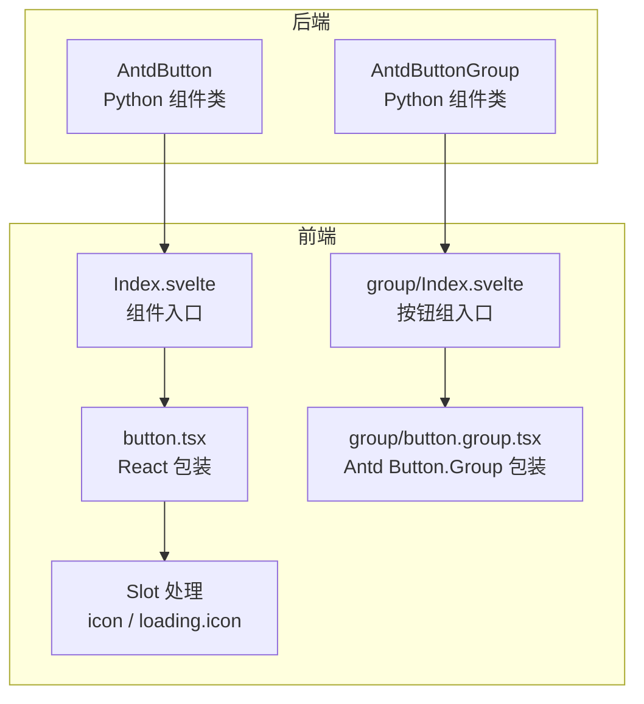
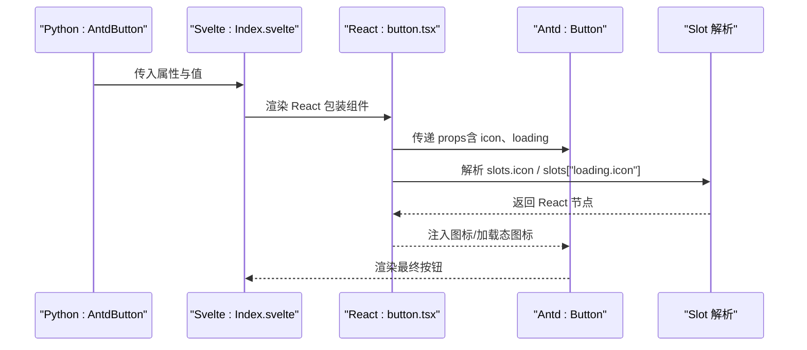
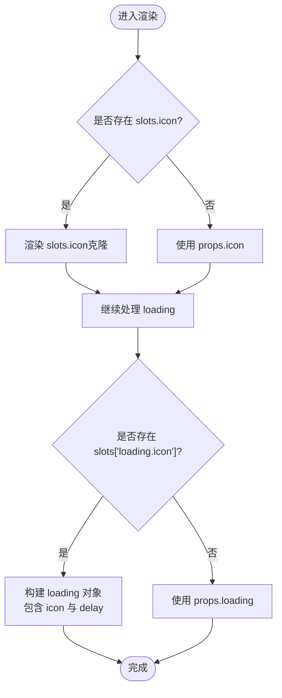
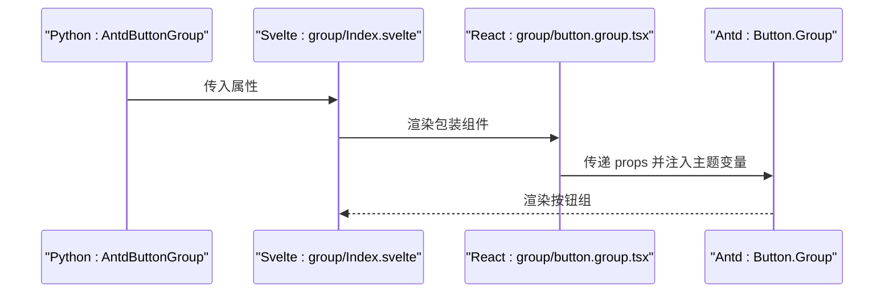
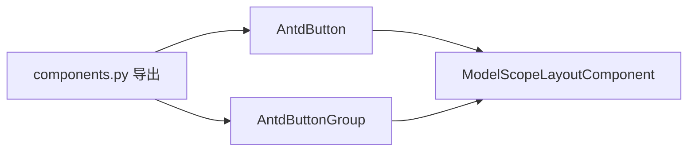

# Button 按钮

<cite>
**本文引用的文件**
- [frontend/antd/button/button.tsx](file://frontend/antd/button/button.tsx)
- [frontend/antd/button/Index.svelte](file://frontend/antd/button/Index.svelte)
- [frontend/antd/button/group/button.group.tsx](file://frontend/antd/button/group/button.group.tsx)
- [frontend/antd/button/group/Index.svelte](file://frontend/antd/button/group/Index.svelte)
- [backend/modelscope_studio/components/antd/button/__init__.py](file://backend/modelscope_studio/components/antd/button/__init__.py)
- [backend/modelscope_studio/components/antd/components.py](file://backend/modelscope_studio/components/antd/components.py)
- [docs/components/antd/button/README-zh_CN.md](file://docs/components/antd/button/README-zh_CN.md)
- [docs/components/antd/button/demos/basic.py](file://docs/components/antd/button/demos/basic.py)
- [docs/components/antd/button/app.py](file://docs/components/antd/button/app.py)
- [backend/modelscope_studio/utils/dev/component.py](file://backend/modelscope_studio/utils/dev/component.py)
</cite>

## 目录

1. [简介](#简介)
2. [项目结构](#项目结构)
3. [核心组件](#核心组件)
4. [架构总览](#架构总览)
5. [详细组件分析](#详细组件分析)
6. [依赖关系分析](#依赖关系分析)
7. [性能考量](#性能考量)
8. [故障排查指南](#故障排查指南)
9. [结论](#结论)
10. [附录](#附录)

## 简介

本文件系统性地介绍 Button 按钮组件，覆盖其核心功能、属性配置、事件处理机制，并重点说明类型(variant)、尺寸(size)、状态(state)等配置项；解释按钮组(group)的使用与布局控制；提供多种场景下的使用示例路径（如基础按钮、图标按钮、幽灵按钮、虚线按钮等变体）；阐述禁用、加载、危险等特殊状态的处理方式；说明样式定制、主题适配与响应式设计要点；并给出无障碍访问与键盘导航的最佳实践建议。

## 项目结构

Button 组件由后端 Python 组件类与前端 Svelte/React 包装层共同构成，遵循 Gradio 生态的“组件即上下文”的模式，通过 Slot 机制支持图标与加载态图标的自定义渲染。

图表来源

- [backend/modelscope_studio/components/antd/button/**init**.py:15-138](file://backend/modelscope_studio/components/antd/button/__init__.py#L15-L138)
- [frontend/antd/button/Index.svelte:10-73](file://frontend/antd/button/Index.svelte#L10-L73)
- [frontend/antd/button/button.tsx:8-36](file://frontend/antd/button/button.tsx#L8-L36)
- [frontend/antd/button/group/Index.svelte:10-61](file://frontend/antd/button/group/Index.svelte#L10-L61)
- [frontend/antd/button/group/button.group.tsx:6-24](file://frontend/antd/button/group/button.group.tsx#L6-L24)

章节来源

- [backend/modelscope_studio/components/antd/button/**init**.py:15-138](file://backend/modelscope_studio/components/antd/button/__init__.py#L15-L138)
- [frontend/antd/button/Index.svelte:10-73](file://frontend/antd/button/Index.svelte#L10-L73)
- [frontend/antd/button/button.tsx:8-36](file://frontend/antd/button/button.tsx#L8-L36)
- [frontend/antd/button/group/Index.svelte:10-61](file://frontend/antd/button/group/Index.svelte#L10-L61)
- [frontend/antd/button/group/button.group.tsx:6-24](file://frontend/antd/button/group/button.group.tsx#L6-L24)

## 核心组件

- 后端组件类：AntdButton 提供按钮的全部属性与事件定义，支持类型、变体、尺寸、颜色、形状、状态等配置，并声明支持的插槽（icon、loading.icon）。
- 前端包装层：Index.svelte 将 Python 属性映射到 React 组件，注入样式与 ID；button.tsx 使用 sveltify 包装 Ant Design 的 Button，并对插槽进行解析与传递。
- 按钮组：AntdButtonGroup 对应前端的 Button.Group 包装，支持组级样式与主题变量注入。

章节来源

- [backend/modelscope_studio/components/antd/button/**init**.py:15-138](file://backend/modelscope_studio/components/antd/button/__init__.py#L15-L138)
- [frontend/antd/button/Index.svelte:10-73](file://frontend/antd/button/Index.svelte#L10-L73)
- [frontend/antd/button/button.tsx:8-36](file://frontend/antd/button/button.tsx#L8-L36)
- [frontend/antd/button/group/Index.svelte:10-61](file://frontend/antd/button/group/Index.svelte#L10-L61)
- [frontend/antd/button/group/button.group.tsx:6-24](file://frontend/antd/button/group/button.group.tsx#L6-L24)

## 架构总览

下图展示了从 Python 组件到前端渲染的调用链路，以及 Slot 插槽在加载态与图标态的处理流程。

图表来源

- [frontend/antd/button/button.tsx:11-36](file://frontend/antd/button/button.tsx#L11-L36)
- [frontend/antd/button/Index.svelte:59-73](file://frontend/antd/button/Index.svelte#L59-L73)
- [backend/modelscope_studio/components/antd/button/**init**.py:41-49](file://backend/modelscope_studio/components/antd/button/__init__.py#L41-L49)

## 详细组件分析

### 属性与配置项

- 类型与变体
  - type: 支持 primary、dashed、link、text、default
  - variant: 支持 outlined、dashed、solid、filled、text、link
  - color: 支持 default、primary、danger 与一组预设色名
- 尺寸与形状
  - size: large、middle、small
  - shape: default、circle、round
- 状态与行为
  - disabled：禁用态
  - danger：危险态
  - ghost：幽灵按钮（背景透明）
  - loading：布尔或带延迟的加载对象
  - block：块级宽度
  - html_type：button、submit、reset
  - href/target：链接按钮与跳转目标
- 图标与插槽
  - icon：图标名称或节点
  - loading.icon：加载态自定义图标
- 样式与标识
  - elem_id、elem_classes、elem_style
  - class_names、styles、root_class_name

章节来源

- [backend/modelscope_studio/components/antd/button/**init**.py:51-138](file://backend/modelscope_studio/components/antd/button/__init__.py#L51-L138)
- [frontend/antd/button/button.tsx:18-30](file://frontend/antd/button/button.tsx#L18-L30)

### 事件处理机制

- click 事件：通过事件监听器绑定，触发时可更新内部状态以驱动 UI 变化。
- 典型用法：在示例中为按钮注册点击回调，用于输出日志或触发业务逻辑。

章节来源

- [backend/modelscope_studio/components/antd/button/**init**.py:41-46](file://backend/modelscope_studio/components/antd/button/__init__.py#L41-L46)
- [docs/components/antd/button/demos/basic.py:9-10](file://docs/components/antd/button/demos/basic.py#L9-L10)

### 插槽与图标处理

- 插槽定义：icon、loading.icon
- 渲染策略：
  - 若存在 slots.icon，则以 ReactSlot 渲染并克隆
  - loading.icon 存在时，将该节点作为加载态图标，并保留 loading.delay 的数值（当 loading 为对象时）
  - 若无插槽，则回退到 props.icon 或 props.loading

图表来源

- [frontend/antd/button/button.tsx:18-30](file://frontend/antd/button/button.tsx#L18-L30)

章节来源

- [frontend/antd/button/button.tsx:11-36](file://frontend/antd/button/button.tsx#L11-L36)

### 按钮组（Button.Group）

- 组件入口：group/Index.svelte
- 包装实现：group/button.group.tsx
- 主题适配：通过 Ant Design 的 theme.token.lineWidth 注入 CSS 变量，统一组内边框与间距
- 适用场景：多个按钮组合排列，共享同一主题风格

图表来源

- [frontend/antd/button/group/Index.svelte:48-61](file://frontend/antd/button/group/Index.svelte#L48-L61)
- [frontend/antd/button/group/button.group.tsx:10-24](file://frontend/antd/button/group/button.group.tsx#L10-L24)

章节来源

- [frontend/antd/button/group/Index.svelte:10-61](file://frontend/antd/button/group/Index.svelte#L10-L61)
- [frontend/antd/button/group/button.group.tsx:6-24](file://frontend/antd/button/group/button.group.tsx#L6-L24)

### 示例与使用场景

以下示例均来自文档演示脚本，展示不同变体与状态的按钮用法：

- 基础按钮：主按钮、默认按钮、虚线按钮、文字按钮、链接按钮
- 变体与颜色：filled 变体配合 default/danger 颜色
- 加载态与图标：在加载态下设置图标插槽
- 块级按钮：block=True 使按钮占满容器宽度

示例路径

- [docs/components/antd/button/demos/basic.py:9-22](file://docs/components/antd/button/demos/basic.py#L9-L22)

章节来源

- [docs/components/antd/button/demos/basic.py:5-25](file://docs/components/antd/button/demos/basic.py#L5-L25)

### 样式定制、主题适配与响应式

- 样式注入：通过 elem_id、elem_classes、elem_style 为单个按钮或按钮组添加自定义样式
- 主题变量：按钮组通过 Ant Design 的主题 token 注入 CSS 变量，确保组内边框一致
- 响应式：结合 Flex/Space 等布局组件，按钮可在不同屏幕尺寸下自动换行与对齐

章节来源

- [frontend/antd/button/group/button.group.tsx:10-24](file://frontend/antd/button/group/button.group.tsx#L10-L24)
- [docs/components/antd/button/demos/basic.py](file://docs/components/antd/button/demos/basic.py#L8)

### 无障碍访问与键盘导航

- 键盘可达性：按钮原生支持 Enter/Space 触发，建议在复杂交互中提供明确的焦点指示
- 文字与图标：为图标按钮提供可读的文本替代（aria-label），避免仅靠图标传达关键信息
- 禁用态与加载态：禁用与加载态应保持视觉一致性，确保用户感知当前不可交互状态
- 组合按钮：按钮组中建议提供清晰的分组语义，必要时添加标题或分隔线

## 依赖关系分析

- 组件注册：AntdButton 与 AntdButtonGroup 在后端组件集中导出，便于统一导入与使用
- 组件基类：ModelScopeLayoutComponent 提供通用的布局能力与事件钩子
- 前端桥接：通过 sveltify 将 Ant Design 的 React 组件桥接到 Svelte 环境，同时保留 Slot 能力

图表来源

- [backend/modelscope_studio/components/antd/components.py:14-15](file://backend/modelscope_studio/components/antd/components.py#L14-L15)
- [backend/modelscope_studio/utils/dev/component.py:11-27](file://backend/modelscope_studio/utils/dev/component.py#L11-L27)

章节来源

- [backend/modelscope_studio/components/antd/components.py:14-15](file://backend/modelscope_studio/components/antd/components.py#L14-L15)
- [backend/modelscope_studio/utils/dev/component.py:11-27](file://backend/modelscope_studio/utils/dev/component.py#L11-L27)

## 性能考量

- 按钮组主题变量注入：仅在组组件初始化时计算一次 token，避免重复计算开销
- 插槽渲染：优先使用 slots.icon 与 slots["loading.icon"]，减少不必要的 props 传递
- 延迟加载：loading 对象支持 delay 字段，避免频繁切换导致的闪烁

章节来源

- [frontend/antd/button/group/button.group.tsx:10-24](file://frontend/antd/button/group/button.group.tsx#L10-L24)
- [frontend/antd/button/button.tsx:21-29](file://frontend/antd/button/button.tsx#L21-L29)

## 故障排查指南

- 插槽未生效
  - 检查是否正确使用 ms.Slot("icon") 或 ms.Slot("loading.icon") 包裹图标组件
  - 确认 slots 在前端被正确传递
- 加载态图标不显示
  - 确保 slots["loading.icon"] 存在且为有效节点
  - 当 loading 为对象时，确认 delay 字段是否按预期设置
- 按钮组样式异常
  - 检查主题 token 是否可用，确认 CSS 变量已注入
- 事件未触发
  - 确认 click 事件监听器已绑定，且回调函数可执行

章节来源

- [frontend/antd/button/button.tsx:18-30](file://frontend/antd/button/button.tsx#L18-L30)
- [frontend/antd/button/group/button.group.tsx:10-24](file://frontend/antd/button/group/button.group.tsx#L10-L24)
- [backend/modelscope_studio/components/antd/button/**init**.py:41-46](file://backend/modelscope_studio/components/antd/button/__init__.py#L41-L46)

## 结论

Button 按钮组件在本项目中实现了对 Ant Design 的完整封装，具备丰富的类型、变体、尺寸与状态配置，同时通过 Slot 机制灵活支持图标与加载态自定义。按钮组在主题适配与布局控制方面提供了良好的扩展性。结合示例脚本与最佳实践，开发者可以快速构建符合设计规范与无障碍要求的按钮交互。

## 附录

- 文档入口与示例
  - [docs/components/antd/button/README-zh_CN.md:1-8](file://docs/components/antd/button/README-zh_CN.md#L1-L8)
  - [docs/components/antd/button/demos/basic.py:1-26](file://docs/components/antd/button/demos/basic.py#L1-L26)
  - [docs/components/antd/button/app.py:1-7](file://docs/components/antd/button/app.py#L1-L7)
