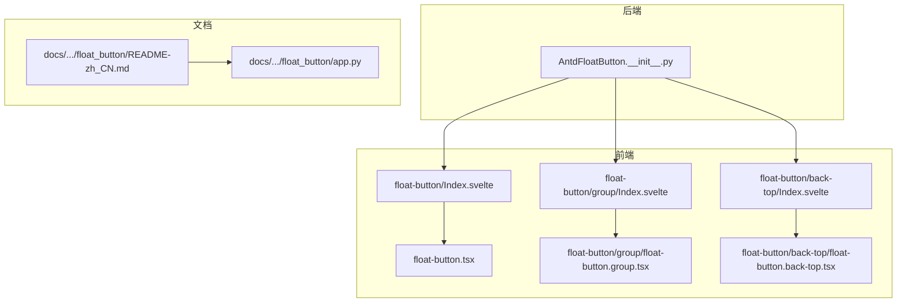
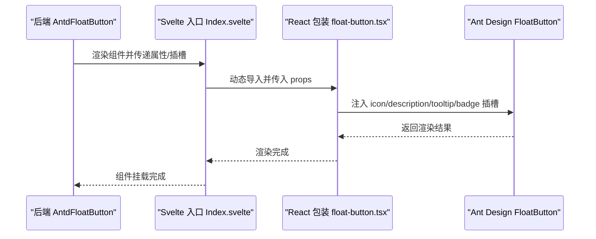
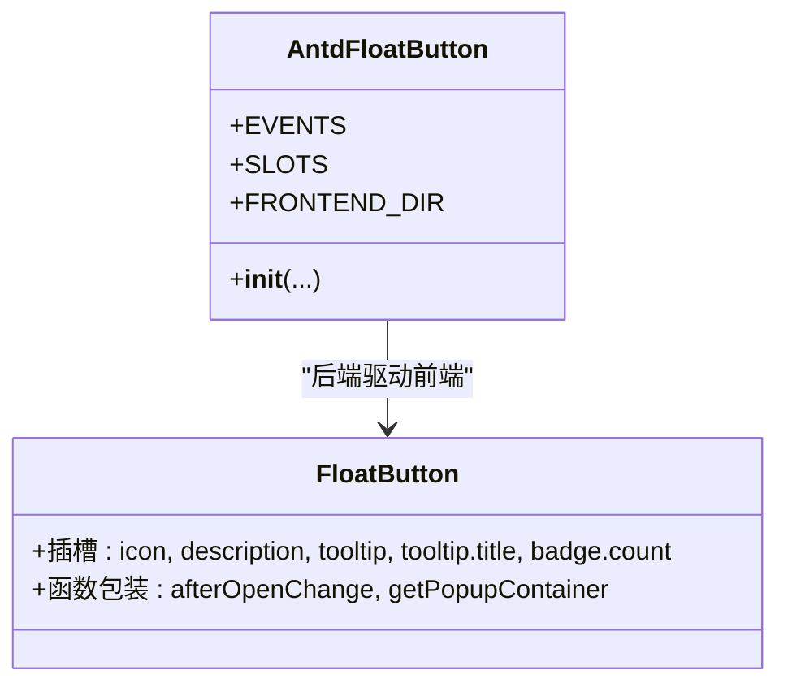
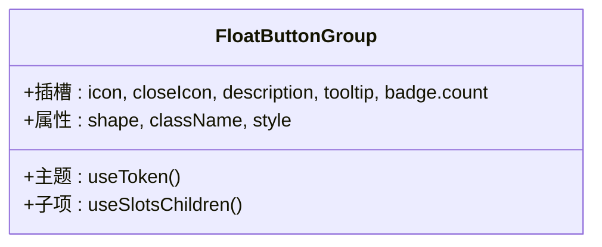
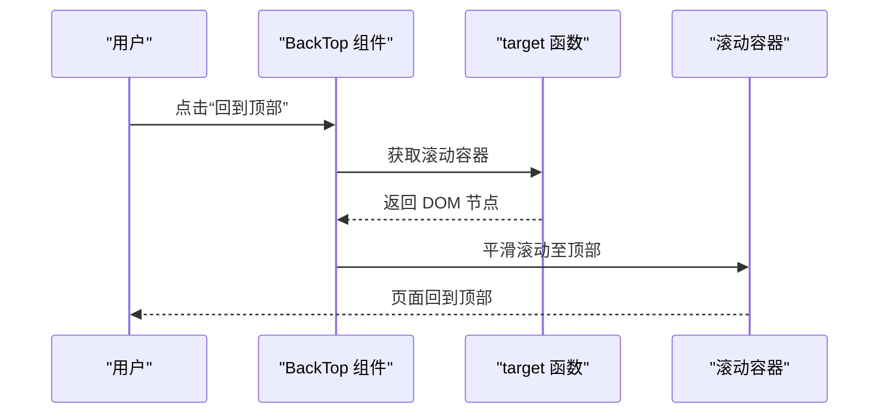
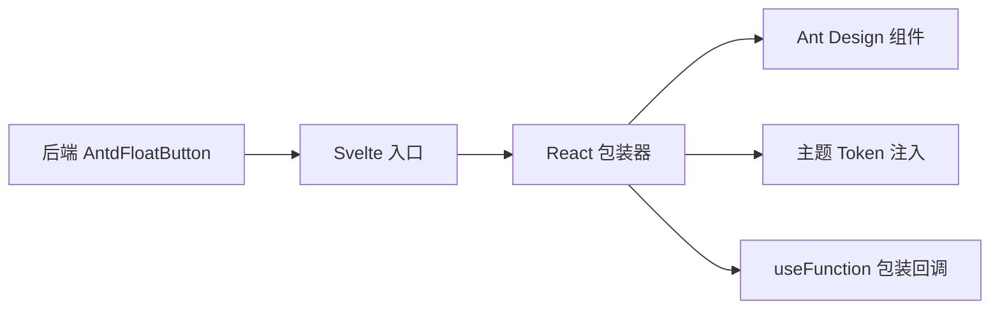

# FloatButton 悬浮按钮

<cite>
**本文引用的文件**
- [Index.svelte](file://frontend/antd/float-button/Index.svelte)
- [float-button.tsx](file://frontend/antd/float-button/float-button.tsx)
- [group/Index.svelte](file://frontend/antd/float-button/group/Index.svelte)
- [group/float-button.group.tsx](file://frontend/antd/float-button/group/float-button.group.tsx)
- [back-top/Index.svelte](file://frontend/antd/float-button/back-top/Index.svelte)
- [back-top/float-button.back-top.tsx](file://frontend/antd/float-button/back-top/float-button.back-top.tsx)
- [__init__.py](file://backend/modelscope_studio/components/antd/float_button/__init__.py)
- [README-zh_CN.md](file://docs/components/antd/float_button/README-zh_CN.md)
- [app.py](file://docs/components/antd/float_button/app.py)
</cite>

## 目录

1. [简介](#简介)
2. [项目结构](#项目结构)
3. [核心组件](#核心组件)
4. [架构总览](#架构总览)
5. [详细组件分析](#详细组件分析)
6. [依赖关系分析](#依赖关系分析)
7. [性能考量](#性能考量)
8. [故障排查指南](#故障排查指南)
9. [结论](#结论)
10. [附录](#附录)

## 简介

FloatButton 是一个“悬浮按钮”组件，用于在页面任意位置提供全局可访问的功能入口。它基于 Ant Design 的 FloatButton 实现，并通过 Gradio 前端桥接层在模型域中以统一的组件形态呈现。该组件支持图标、描述文本、气泡提示、徽标角标等扩展能力；同时提供“悬浮按钮组”和“回到顶部”两个增强子功能，分别用于组合多个动作以及快速回到页面顶部。

设计目标：

- 在页面任何滚动状态下保持可见，提升用户可达性
- 提供灵活的布局位置与尺寸控制，满足不同页面风格
- 支持插槽化扩展（如自定义图标、描述、提示、角标）
- 与滚动容器、内容区域协同，避免遮挡关键信息
- 覆盖移动端与响应式场景，保证交互体验一致

## 项目结构

FloatButton 组件由后端 Python 组件类与前端 Svelte/React 包装层共同组成，文档示例通过 docs 层进行演示。

图表来源

- [**init**.py:12-110](file://backend/modelscope_studio/components/antd/float_button/__init__.py#L12-L110)
- [Index.svelte:1-70](file://frontend/antd/float-button/Index.svelte#L1-L70)
- [float-button.tsx:1-75](file://frontend/antd/float-button/float-button.tsx#L1-L75)
- [group/Index.svelte:1-72](file://frontend/antd/float-button/group/Index.svelte#L1-L72)
- [group/float-button.group.tsx:1-70](file://frontend/antd/float-button/group/float-button.group.tsx#L1-L70)
- [back-top/Index.svelte:1-73](file://frontend/antd/float-button/back-top/Index.svelte#L1-L73)
- [back-top/float-button.back-top.tsx:1-47](file://frontend/antd/float-button/back-top/float-button.back-top.tsx#L1-L47)
- [README-zh_CN.md:1-8](file://docs/components/antd/float_button/README-zh_CN.md#L1-L8)
- [app.py:1-7](file://docs/components/antd/float_button/app.py#L1-L7)

章节来源

- [**init**.py:12-110](file://backend/modelscope_studio/components/antd/float_button/__init__.py#L12-L110)
- [README-zh_CN.md:1-8](file://docs/components/antd/float_button/README-zh_CN.md#L1-L8)
- [app.py:1-7](file://docs/components/antd/float_button/app.py#L1-L7)

## 核心组件

- AntdFloatButton：后端组件类，声明事件、插槽与属性，负责将前端组件映射到 Gradio 生态。
- FloatButton：前端包装器，对接 Ant Design 的 FloatButton，支持插槽注入与函数型回调处理。
- FloatButton.Group：前端包装器，用于组合多个悬浮按钮，支持关闭图标、形状、主题变量等。
- FloatButton.BackTop：前端包装器，提供“回到顶部”能力，支持自定义滚动容器获取逻辑。

章节来源

- [**init**.py:12-110](file://backend/modelscope_studio/components/antd/float_button/__init__.py#L12-L110)
- [float-button.tsx:14-75](file://frontend/antd/float-button/float-button.tsx#L14-L75)
- [group/float-button.group.tsx:10-70](file://frontend/antd/float-button/group/float-button.group.tsx#L10-L70)
- [back-top/float-button.back-top.tsx:7-47](file://frontend/antd/float-button/back-top/float-button.back-top.tsx#L7-L47)

## 架构总览

下图展示了从后端组件类到前端包装器再到 Ant Design 组件的整体调用链路。

图表来源

- [**init**.py:92-96](file://backend/modelscope_studio/components/antd/float_button/__init__.py#L92-L96)
- [Index.svelte:10-69](file://frontend/antd/float-button/Index.svelte#L10-L69)
- [float-button.tsx:14-72](file://frontend/antd/float-button/float-button.tsx#L14-L72)

## 详细组件分析

### 组件一：悬浮按钮（FloatButton）

- 设计理念
  - 作为页面全局入口，确保在任意滚动位置都可点击触发
  - 通过插槽系统支持图标、描述、提示、角标等扩展
- 关键特性
  - 插槽支持：icon、description、tooltip、tooltip.title、badge.count
  - 回调函数安全处理：对 tooltip.afterOpenChange、tooltip.getPopupContainer 等函数型属性进行包装
  - 可见性控制：通过 visible 控制是否渲染
- 使用场景
  - 快捷操作入口（如“回到顶部”、“分享”、“反馈”）
  - 多状态切换或条件显示的入口按钮
- 配置要点
  - 图标与形状：icon、shape
  - 类型与样式：type、root_class_name、class_names、styles
  - 链接与原生属性：href、href_target、html_type
  - 角标与提示：badge、tooltip
- 交互行为
  - 支持 click 事件绑定
  - tooltip 支持延迟打开/关闭回调与弹出容器选择

图表来源

- [**init**.py:12-32](file://backend/modelscope_studio/components/antd/float_button/__init__.py#L12-L32)
- [float-button.tsx:14-72](file://frontend/antd/float-button/float-button.tsx#L14-L72)

章节来源

- [**init**.py:12-110](file://backend/modelscope_studio/components/antd/float_button/__init__.py#L12-L110)
- [Index.svelte:13-51](file://frontend/antd/float-button/Index.svelte#L13-L51)
- [float-button.tsx:14-72](file://frontend/antd/float-button/float-button.tsx#L14-L72)

### 组件二：悬浮按钮组（FloatButton.Group）

- 设计理念
  - 将多个悬浮按钮组合为一组，形成复合入口，减少页面元素数量
  - 支持关闭图标、形状（圆形/方形）与主题变量注入
- 关键特性
  - 插槽支持：icon、closeIcon、description、tooltip、badge.count
  - 形状与样式：shape、className、内联样式覆盖主题变量
  - 子项渲染：通过 useSlotsChildren 分离插槽与普通子节点
- 使用场景
  - 多功能入口聚合（如“编辑/收藏/分享/更多”）
  - 需要展开/收起的复合动作区
- 配置要点
  - 组合形状：shape（circle/square）
  - 主题变量：通过 CSS 变量注入圆角半径等
  - 插槽化图标与提示：支持每个子项独立配置

图表来源

- [group/float-button.group.tsx:10-67](file://frontend/antd/float-button/group/float-button.group.tsx#L10-L67)

章节来源

- [group/Index.svelte:14-50](file://frontend/antd/float-button/group/Index.svelte#L14-L50)
- [group/float-button.group.tsx:10-67](file://frontend/antd/float-button/group/float-button.group.tsx#L10-L67)

### 组件三：回到顶部（FloatButton.BackTop）

- 设计理念
  - 在长页面中提供一键回到顶部的能力，提升导航效率
  - 支持自定义滚动容器获取逻辑，适配复杂布局
- 关键特性
  - 插槽支持：icon、description、tooltip、badge.count
  - 自定义目标容器：target 函数包装，支持动态选择滚动容器
- 使用场景
  - 内容页、列表页、详情页等长内容页面
  - 需要频繁上下滚动的场景
- 配置要点
  - 图标与提示：icon、tooltip
  - 角标与描述：badge、description
  - 滚动容器：target（函数），返回滚动容器 DOM 节点

图表来源

- [back-top/float-button.back-top.tsx:7-44](file://frontend/antd/float-button/back-top/float-button.back-top.tsx#L7-L44)

章节来源

- [back-top/Index.svelte:14-50](file://frontend/antd/float-button/back-top/Index.svelte#L14-L50)
- [back-top/float-button.back-top.tsx:7-44](file://frontend/antd/float-button/back-top/float-button.back-top.tsx#L7-L44)

### 组件四：后端桥接与事件绑定

- 后端组件类
  - 定义事件：click（绑定内部事件处理器）
  - 定义插槽：icon、description、tooltip、tooltip.title、badge.count
  - 前端目录映射：resolve_frontend_dir("float-button")
- 文档与示例
  - README 中包含基础示例占位
  - app.py 用于启动文档站点

章节来源

- [**init**.py:22-32](file://backend/modelscope_studio/components/antd/float_button/__init__.py#L22-L32)
- [**init**.py:92-96](file://backend/modelscope_studio/components/antd/float_button/__init__.py#L92-L96)
- [README-zh_CN.md:1-8](file://docs/components/antd/float_button/README-zh_CN.md#L1-L8)
- [app.py:1-7](file://docs/components/antd/float_button/app.py#L1-L7)

## 依赖关系分析

- 组件耦合
  - 后端 AntdFloatButton 仅负责属性与事件声明，不直接渲染，降低耦合度
  - 前端通过 Svelte 动态导入包装器，实现按需加载与解耦
- 插槽与主题
  - Group 组件引入 Ant Design 主题 token，注入 CSS 变量以适配圆角等
- 函数型属性
  - 通过 useFunction 对 tooltip 回调与 target 进行包装，确保在 React/Svelte 环境中稳定运行

图表来源

- [**init**.py:92-96](file://backend/modelscope_studio/components/antd/float_button/__init__.py#L92-L96)
- [Index.svelte:10-69](file://frontend/antd/float-button/Index.svelte#L10-L69)
- [float-button.tsx:20-28](file://frontend/antd/float-button/float-button.tsx#L20-L28)
- [group/float-button.group.tsx:16-31](file://frontend/antd/float-button/group/float-button.group.tsx#L16-L31)
- [back-top/float-button.back-top.tsx:11](file://frontend/antd/float-button/back-top/float-button.back-top.tsx#L11)

章节来源

- [**init**.py:92-96](file://backend/modelscope_studio/components/antd/float_button/__init__.py#L92-L96)
- [float-button.tsx:20-28](file://frontend/antd/float-button/float-button.tsx#L20-L28)
- [group/float-button.group.tsx:16-31](file://frontend/antd/float-button/group/float-button.group.tsx#L16-L31)
- [back-top/float-button.back-top.tsx:11](file://frontend/antd/float-button/back-top/float-button.back-top.tsx#L11)

## 性能考量

- 按需加载
  - Svelte 通过动态导入包装器，避免初始包体膨胀
- 渲染开销
  - 插槽内容默认隐藏渲染，仅在需要时注入到 Ant Design 组件
- 回调函数
  - 使用 useFunction 包装函数型属性，减少不必要的重新渲染
- 主题注入
  - Group 组件通过 CSS 变量注入主题 token，避免重复计算样式

章节来源

- [Index.svelte:10-10](file://frontend/antd/float-button/Index.svelte#L10-L10)
- [float-button.tsx:30-71](file://frontend/antd/float-button/float-button.tsx#L30-L71)
- [group/float-button.group.tsx:16-31](file://frontend/antd/float-button/group/float-button.group.tsx#L16-L31)

## 故障排查指南

- 无法显示悬浮按钮
  - 检查 visible 是否为 true
  - 确认 FRONTEND_DIR 映射正确
- 插槽未生效
  - 确保插槽名称与组件支持列表一致（icon、description、tooltip、tooltip.title、badge.count）
  - Group 组件额外支持 closeIcon、badge.count
- 回到顶部无效
  - 检查 target 函数是否返回有效的滚动容器 DOM 节点
- Tooltip 回调不触发
  - 确认 tooltip.afterOpenChange、tooltip.getPopupContainer 已通过 useFunction 包装

章节来源

- [Index.svelte:56-69](file://frontend/antd/float-button/Index.svelte#L56-L69)
- [float-button.tsx:14-72](file://frontend/antd/float-button/float-button.tsx#L14-L72)
- [group/float-button.group.tsx:10-67](file://frontend/antd/float-button/group/float-button.group.tsx#L10-L67)
- [back-top/float-button.back-top.tsx:7-44](file://frontend/antd/float-button/back-top/float-button.back-top.tsx#L7-L44)

## 结论

FloatButton 悬浮按钮组件通过后端桥接与前端包装器的协作，实现了与 Ant Design 的无缝集成与扩展。其插槽化设计、主题注入与函数型属性包装，使得在复杂页面布局中仍能保持良好的可维护性与可扩展性。结合“悬浮按钮组”和“回到顶部”的增强能力，能够覆盖多种常见交互场景，提升用户体验与开发效率。

## 附录

- 示例与文档
  - 文档示例入口：docs/components/antd/float_button/README-zh_CN.md
  - 文档站点启动：docs/components/antd/float_button/app.py

章节来源

- [README-zh_CN.md:1-8](file://docs/components/antd/float_button/README-zh_CN.md#L1-L8)
- [app.py:1-7](file://docs/components/antd/float_button/app.py#L1-L7)
