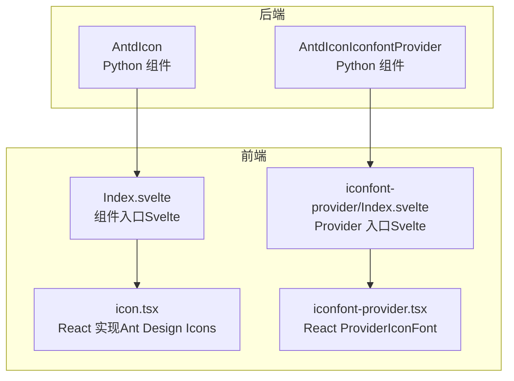
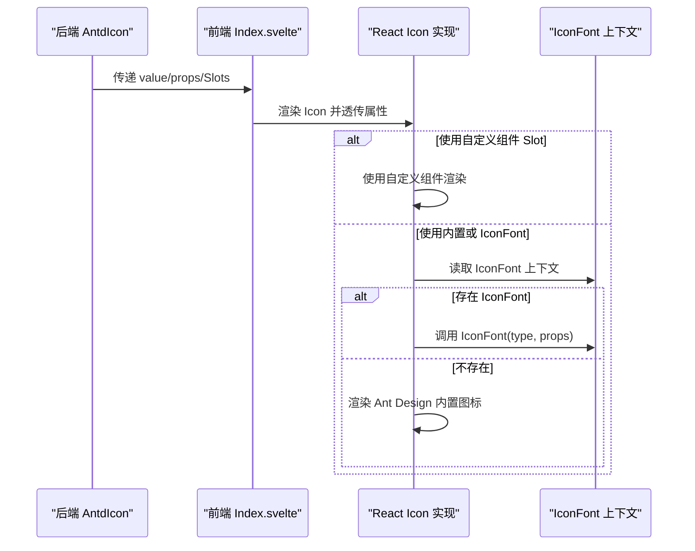
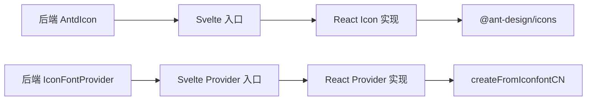

# 图标

<cite>
**本文引用的文件**
- [frontend/antd/icon/Index.svelte](file://frontend/antd/icon/Index.svelte)
- [frontend/antd/icon/icon.tsx](file://frontend/antd/icon/icon.tsx)
- [frontend/antd/icon/iconfont-provider/Index.svelte](file://frontend/antd/icon/iconfont-provider/Index.svelte)
- [frontend/antd/icon/iconfont-provider/iconfont-provider.tsx](file://frontend/antd/icon/iconfont-provider/iconfont-provider.tsx)
- [backend/modelscope_studio/components/antd/icon/__init__.py](file://backend/modelscope_studio/components/antd/icon/__init__.py)
- [backend/modelscope_studio/components/antd/components.py](file://backend/modelscope_studio/components/antd/components.py)
- [docs/components/antd/icon/README-zh_CN.md](file://docs/components/antd/icon/README-zh_CN.md)
- [docs/components/antd/icon/demos/basic.py](file://docs/components/antd/icon/demos/basic.py)
- [docs/components/antd/icon/demos/iconfont.py](file://docs/components/antd/icon/demos/iconfont.py)
</cite>

## 目录

1. [简介](#简介)
2. [项目结构](#项目结构)
3. [核心组件](#核心组件)
4. [架构总览](#架构总览)
5. [组件详解](#组件详解)
6. [依赖关系分析](#依赖关系分析)
7. [性能与优化](#性能与优化)
8. [无障碍与可访问性](#无障碍与可访问性)
9. [故障排查](#故障排查)
10. [结论](#结论)
11. [附录：使用示例与最佳实践](#附录使用示例与最佳实践)

## 简介

本篇文档系统性介绍模型空间 Studio 前端生态中的 Icon 图标组件，涵盖：

- 使用规范与常见场景（内联图标、按钮图标、导航图标）
- 支持的图标库与图标字体集成（Ant Design 内置图标、iconfont.cn）
- 尺寸、颜色、样式等配置项
- IconFontProvider 的配置与使用
- 性能优化、懒加载与缓存策略
- 无障碍访问、语义化标记与屏幕阅读器兼容
- 自定义图标库集成方案与最佳实践

## 项目结构

Icon 组件由“后端 Gradio 组件层”和“前端 Svelte/React 展示层”共同构成，并通过 Slot 机制支持自定义渲染。

图表来源

- [backend/modelscope_studio/components/antd/icon/**init**.py:9-88](file://backend/modelscope_studio/components/antd/icon/__init__.py#L9-L88)
- [frontend/antd/icon/Index.svelte:1-67](file://frontend/antd/icon/Index.svelte#L1-L67)
- [frontend/antd/icon/icon.tsx:1-55](file://frontend/antd/icon/icon.tsx#L1-L55)
- [frontend/antd/icon/iconfont-provider/Index.svelte:1-53](file://frontend/antd/icon/iconfont-provider/Index.svelte#L1-L53)
- [frontend/antd/icon/iconfont-provider/iconfont-provider.tsx:1-44](file://frontend/antd/icon/iconfont-provider/iconfont-provider.tsx#L1-L44)

章节来源

- [backend/modelscope_studio/components/antd/icon/**init**.py:9-88](file://backend/modelscope_studio/components/antd/icon/__init__.py#L9-L88)
- [frontend/antd/icon/Index.svelte:1-67](file://frontend/antd/icon/Index.svelte#L1-L67)
- [frontend/antd/icon/icon.tsx:1-55](file://frontend/antd/icon/icon.tsx#L1-L55)
- [frontend/antd/icon/iconfont-provider/Index.svelte:1-53](file://frontend/antd/icon/iconfont-provider/Index.svelte#L1-L53)
- [frontend/antd/icon/iconfont-provider/iconfont-provider.tsx:1-44](file://frontend/antd/icon/iconfont-provider/iconfont-provider.tsx#L1-L44)

## 核心组件

- AntdIcon（后端）：提供 value、spin、rotate、twoToneColor、component 等属性；支持 click 事件绑定；支持名为 “component” 的 Slot 以注入自定义渲染。
- AntdIconIconfontProvider（后端）：提供 IconFont 上下文，用于在 iconfont.cn 等图标字体库中按 type 渲染图标。
- 前端 Svelte 入口：负责将后端传入的属性与 Slot 转发给 React 实现。
- 前端 React 实现：根据 value 选择内置 Ant Design 图标或通过 IconFont 上下文渲染自定义图标类型。

章节来源

- [backend/modelscope_studio/components/antd/icon/**init**.py:9-88](file://backend/modelscope_studio/components/antd/icon/__init__.py#L9-L88)
- [frontend/antd/icon/Index.svelte:1-67](file://frontend/antd/icon/Index.svelte#L1-L67)
- [frontend/antd/icon/icon.tsx:1-55](file://frontend/antd/icon/icon.tsx#L1-L55)
- [frontend/antd/icon/iconfont-provider/Index.svelte:1-53](file://frontend/antd/icon/iconfont-provider/Index.svelte#L1-L53)
- [frontend/antd/icon/iconfont-provider/iconfont-provider.tsx:1-44](file://frontend/antd/icon/iconfont-provider/iconfont-provider.tsx#L1-L44)

## 架构总览

下图展示了从后端到前端再到图标渲染的关键调用链路：

图表来源

- [frontend/antd/icon/Index.svelte:52-66](file://frontend/antd/icon/Index.svelte#L52-L66)
- [frontend/antd/icon/icon.tsx:17-52](file://frontend/antd/icon/icon.tsx#L17-L52)
- [frontend/antd/icon/iconfont-provider/iconfont-provider.tsx:36-41](file://frontend/antd/icon/iconfont-provider/iconfont-provider.tsx#L36-L41)

## 组件详解

### AntdIcon（后端）

- 支持的属性
  - value：字符串，指定图标名称（如内置图标名或 IconFont 类型名）
  - spin：布尔，是否旋转动画
  - rotate：角度数值，图标旋转角度
  - twoToneColor：两色图标主色
  - component：根节点组件占位符（用于替换默认容器）
  - 元素级样式与类名：elem_style、elem_classes
  - 可见性与渲染：visible、render
- 事件
  - click：绑定点击事件
- Slot
  - component：用于注入自定义渲染（例如文本表情、SVG 组件）

章节来源

- [backend/modelscope_studio/components/antd/icon/**init**.py:27-68](file://backend/modelscope_studio/components/antd/icon/__init__.py#L27-L68)
- [backend/modelscope_studio/components/antd/icon/**init**.py:18-22](file://backend/modelscope_studio/components/antd/icon/__init__.py#L18-L22)

### 前端 Svelte 入口（Index.svelte）

- 将后端传入的 value、additionalProps、elem\_\* 等属性透传给 React Icon
- 通过 Slot 获取并转发给 React Icon
- 条件渲染：仅在 visible 为真时渲染

章节来源

- [frontend/antd/icon/Index.svelte:13-66](file://frontend/antd/icon/Index.svelte#L13-L66)

### React 实现（icon.tsx）

- 逻辑要点
  - 优先使用 “component” Slot 注入的自定义组件进行渲染
  - 否则若存在内置图标名，则渲染对应 Ant Design 图标
  - 若无内置图标且存在 IconFont 上下文，则通过 IconFont(type, props) 渲染
- 关键上下文
  - useIconFontContext：获取 IconFont 上下文实例

章节来源

- [frontend/antd/icon/icon.tsx:17-52](file://frontend/antd/icon/icon.tsx#L17-L52)

### AntdIconIconfontProvider（后端）

- 提供 IconFont 上下文，使子级 Icon 能按 type 渲染自定义图标字体
- 常见用法：包裹一组需要使用 iconfont.cn 的图标

章节来源

- [backend/modelscope_studio/components/antd/icon/**init**.py:16-16](file://backend/modelscope_studio/components/antd/icon/__init__.py#L16-L16)

### 前端 Provider（iconfont-provider.tsx）

- 功能
  - 基于 createFromIconfontCN 创建 IconFont 实例
  - 缓存实例：当 scriptUrl 与 extraCommonProps 不变时复用同一实例
  - 通过 IconFontContext.Provider 暴露给子树
- 参数
  - scriptUrl：图标字体脚本地址（可为数组）
  - extraCommonProps：额外通用属性（如 color、fontSize 等）

章节来源

- [frontend/antd/icon/iconfont-provider/iconfont-provider.tsx:12-41](file://frontend/antd/icon/iconfont-provider/iconfont-provider.tsx#L12-L41)

### Provider 前端入口（iconfont-provider/Index.svelte）

- 将后端传入的 Provider 属性透传给 React Provider 组件
- 作为 Icon 的父级上下文容器

章节来源

- [frontend/antd/icon/iconfont-provider/Index.svelte:42-52](file://frontend/antd/icon/iconfont-provider/Index.svelte#L42-L52)

## 依赖关系分析

- 组件耦合
  - AntdIcon 与 AntdIconIconfontProvider 在后端通过类关联
  - 前端 Svelte 入口与 React 实现解耦，通过属性与 Slot 通信
  - React Icon 依赖 Ant Design Icons 与 IconFont 上下文
- 外部依赖
  - @ant-design/icons：内置图标库
  - lodash-es isEqual：用于 Provider 实例缓存判断

图表来源

- [backend/modelscope_studio/components/antd/icon/**init**.py:5-6](file://backend/modelscope_studio/components/antd/icon/__init__.py#L5-L6)
- [frontend/antd/icon/icon.tsx:5-5](file://frontend/antd/icon/icon.tsx#L5-L5)
- [frontend/antd/icon/iconfont-provider/iconfont-provider.tsx:4-6](file://frontend/antd/icon/iconfont-provider/iconfont-provider.tsx#L4-L6)

章节来源

- [backend/modelscope_studio/components/antd/icon/**init**.py:5-6](file://backend/modelscope_studio/components/antd/icon/__init__.py#L5-L6)
- [frontend/antd/icon/icon.tsx:5-5](file://frontend/antd/icon/icon.tsx#L5-L5)
- [frontend/antd/icon/iconfont-provider/iconfont-provider.tsx:4-6](file://frontend/antd/icon/iconfont-provider/iconfont-provider.tsx#L4-L6)

## 性能与优化

- 懒加载与异步渲染
  - Svelte 入口对 Icon 与 Provider 使用异步 import，避免首屏阻塞
- 实例缓存
  - Provider 内部基于 scriptUrl 与 extraCommonProps 判等缓存 IconFont 实例，减少重复初始化
- 渲染路径短路
  - 当存在自定义 Slot 时，直接渲染自定义组件，跳过内置图标解析
- 建议
  - 对大量图标页面，优先使用 IconFont 并集中管理 scriptUrl
  - 合理设置 extraCommonProps，避免频繁重建实例
  - 避免在同一 Provider 下混用过多不同脚本源，减少上下文切换成本

章节来源

- [frontend/antd/icon/Index.svelte:10-10](file://frontend/antd/icon/Index.svelte#L10-L10)
- [frontend/antd/icon/iconfont-provider/Index.svelte:8-9](file://frontend/antd/icon/iconfont-provider/Index.svelte#L8-L9)
- [frontend/antd/icon/iconfont-provider/iconfont-provider.tsx:18-35](file://frontend/antd/icon/iconfont-provider/iconfont-provider.tsx#L18-L35)

## 无障碍与可访问性

- 语义化建议
  - 若图标承载交互语义（如“删除”、“搜索”），应配合可读文案或 aria-label
  - 对于装饰性图标，可使用 aria-hidden 或不添加额外语义
- 屏幕阅读器
  - 保持图标具备可替代文本（例如通过相邻文本或 title 属性）
  - 避免仅依赖颜色传达信息
- 样式与焦点
  - 点击类图标需保证可聚焦与键盘可达
  - 旋转/动画不应影响可访问性体验

[本节为通用指导，无需特定文件引用]

## 故障排查

- 图标不显示
  - 检查 value 是否为有效内置图标名或 IconFont 类型名
  - 若使用 Provider，请确认 scriptUrl 正确且网络可访问
- 自定义组件未生效
  - 确认已正确使用 “component” Slot 注入自定义渲染
  - 检查 Slot 名称大小写与传递路径
- 重复请求或实例抖动
  - Provider 的 extraCommonProps 或 scriptUrl 发生频繁变化会导致实例重建
  - 建议固定参数或合并多个脚本源

章节来源

- [frontend/antd/icon/icon.tsx:32-51](file://frontend/antd/icon/icon.tsx#L32-L51)
- [frontend/antd/icon/iconfont-provider/iconfont-provider.tsx:18-35](file://frontend/antd/icon/iconfont-provider/iconfont-provider.tsx#L18-L35)

## 结论

本组件以“后端组件 + 前端异步渲染”的模式，兼顾了 Ant Design 内置图标与 iconfont.cn 等自定义图标字体的统一接入。通过 Slot 机制与上下文缓存，既满足灵活扩展，又保障性能与可维护性。建议在工程中统一管理图标字体资源与样式参数，结合无障碍规范提升用户体验。

[本节为总结，无需特定文件引用]

## 附录：使用示例与最佳实践

### 基础用法与内置图标

- 场景：内联图标、按钮图标、状态图标
- 示例参考
  - [docs/components/antd/icon/demos/basic.py:9-17](file://docs/components/antd/icon/demos/basic.py#L9-L17)

最佳实践

- 为交互型图标提供点击回调与可读文案
- 使用 twoToneColor 控制双色图标主色，保持品牌一致性

章节来源

- [docs/components/antd/icon/demos/basic.py:9-17](file://docs/components/antd/icon/demos/basic.py#L9-L17)

### 使用 iconfont.cn

- 场景：企业图标库、第三方图标字体
- 示例参考
  - [docs/components/antd/icon/demos/iconfont.py:9-18](file://docs/components/antd/icon/demos/iconfont.py#L9-L18)

最佳实践

- 将多个脚本源合并为数组，减少请求数
- 通过 extraCommonProps 统一设置 color、fontSize 等通用属性
- 在 Provider 外层包裹需要使用该字体的图标集合

章节来源

- [docs/components/antd/icon/demos/iconfont.py:9-18](file://docs/components/antd/icon/demos/iconfont.py#L9-L18)
- [frontend/antd/icon/iconfont-provider/iconfont-provider.tsx:29-33](file://frontend/antd/icon/iconfont-provider/iconfont-provider.tsx#L29-L33)

### 自定义图标库集成

- 方案一：使用 “component” Slot 注入任意自定义渲染（文本、SVG、组件）
  - 示例参考
    - [docs/components/antd/icon/demos/basic.py:19-21](file://docs/components/antd/icon/demos/basic.py#L19-L21)
- 方案二：通过 IconFontProvider 接入自定义字体
  - 示例参考
    - [docs/components/antd/icon/demos/iconfont.py:9-18](file://docs/components/antd/icon/demos/iconfont.py#L9-L18)

最佳实践

- Slot 渲染尽量轻量，避免在图标上执行复杂逻辑
- 字体资源尽量本地化或使用稳定 CDN，降低加载失败风险

章节来源

- [docs/components/antd/icon/demos/basic.py:19-21](file://docs/components/antd/icon/demos/basic.py#L19-L21)
- [docs/components/antd/icon/demos/iconfont.py:9-18](file://docs/components/antd/icon/demos/iconfont.py#L9-L18)

### 配置项速查

- AntdIcon（后端）
  - value：图标名称
  - spin：旋转动画
  - rotate：旋转角度
  - twoToneColor：双色主色
  - component：根节点组件占位
  - elem_style/elem_classes：元素样式与类名
  - visible/render：可见性与渲染控制
- AntdIconIconfontProvider（后端）
  - script_url：图标字体脚本地址（数组）
  - extra_common_props：通用属性（如 color、fontSize）

章节来源

- [backend/modelscope_studio/components/antd/icon/**init**.py:27-68](file://backend/modelscope_studio/components/antd/icon/__init__.py#L27-L68)
- [frontend/antd/icon/iconfont-provider/iconfont-provider.tsx:12-12](file://frontend/antd/icon/iconfont-provider/iconfont-provider.tsx#L12-L12)
