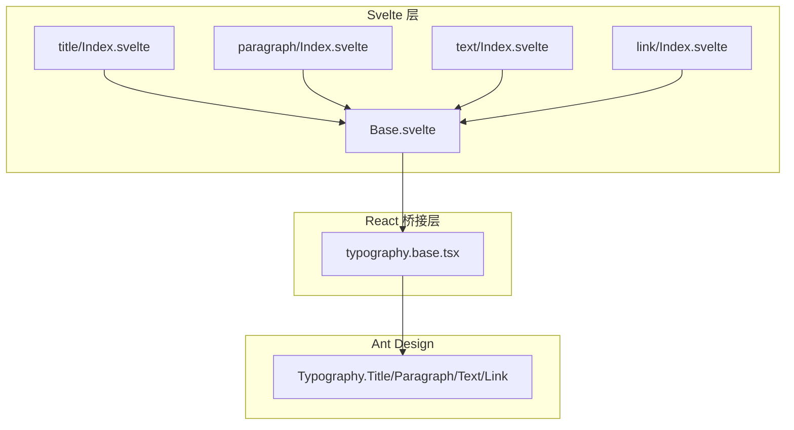
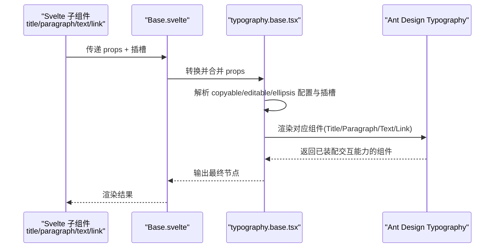
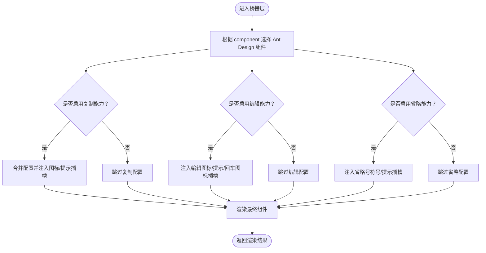
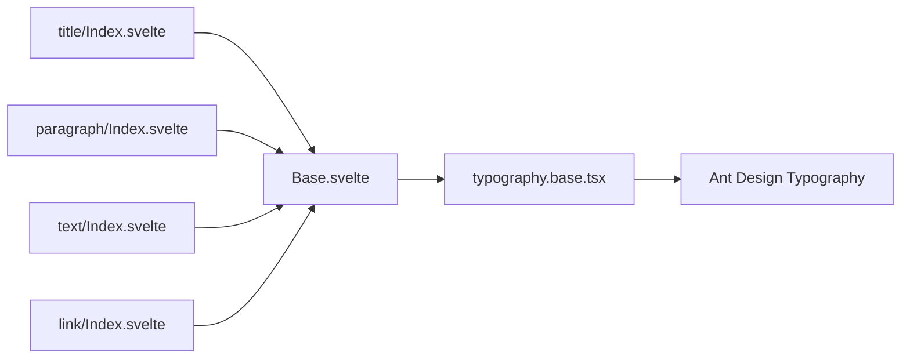

# Typography 排版

<cite>
**本文引用的文件**
- [frontend/antd/typography/Base.svelte](file://frontend/antd/typography/Base.svelte)
- [frontend/antd/typography/typography.base.tsx](file://frontend/antd/typography/typography.base.tsx)
- [frontend/antd/typography/title/Index.svelte](file://frontend/antd/typography/title/Index.svelte)
- [frontend/antd/typography/paragraph/Index.svelte](file://frontend/antd/typography/paragraph/Index.svelte)
- [frontend/antd/typography/text/Index.svelte](file://frontend/antd/typography/text/Index.svelte)
- [frontend/antd/typography/link/Index.svelte](file://frontend/antd/typography/link/Index.svelte)
- [docs/components/antd/typography/README.md](file://docs/components/antd/typography/README.md)
</cite>

## 目录

1. [简介](#简介)
2. [项目结构](#项目结构)
3. [核心组件](#核心组件)
4. [架构总览](#架构总览)
5. [详细组件分析](#详细组件分析)
6. [依赖关系分析](#依赖关系分析)
7. [性能考量](#性能考量)
8. [故障排查指南](#故障排查指南)
9. [结论](#结论)
10. [附录](#附录)

## 简介

Typography 排版组件用于在界面中呈现标题、段落、内联文本与链接等文本内容，统一设计系统中的文字层级、可读性与一致性。该组件基于 Ant Design 的 Typography 能力进行封装，提供复制（copyable）、编辑（editable）与省略（ellipsis）等交互能力，并通过 Svelte 组件体系与 Gradio 集成，支持动态值与插槽化扩展。

## 项目结构

Typography 在前端侧采用“子组件 + 基础桥接层”的组织方式：

- Base.svelte：Svelte 层入口，负责属性处理、插槽透传与渲染条件控制
- typography.base.tsx：React 桥接层，统一调度 Ant Design Typography 各类型组件，并注入 copyable/editable/ellipsis 等高级能力
- title/paragraph/text/link：四个具体语义化子组件，分别映射到 Ant Design 的 Title/Paragraph/Text/Link

图表来源

- [frontend/antd/typography/Base.svelte:11-84](file://frontend/antd/typography/Base.svelte#L11-L84)
- [frontend/antd/typography/typography.base.tsx:19-167](file://frontend/antd/typography/typography.base.tsx#L19-L167)

章节来源

- [frontend/antd/typography/Base.svelte:1-85](file://frontend/antd/typography/Base.svelte#L1-L85)
- [frontend/antd/typography/typography.base.tsx:1-170](file://frontend/antd/typography/typography.base.tsx#L1-L170)

## 核心组件

- Base.svelte：负责从 Gradio 属性中提取并转换为 React 可消费的 props；处理可见性、DOM ID/类名、额外属性与插槽；按需渲染基础桥接层
- typography.base.tsx：根据 component 类型选择对应 Ant Design 组件；统一处理 copyable、editable、ellipsis 的配置与插槽；将组件实例与样式类名注入输出
- 四个语义化子组件：title、paragraph、text、link，均以 Base 为载体，仅指定 component 即可

章节来源

- [frontend/antd/typography/Base.svelte:15-62](file://frontend/antd/typography/Base.svelte#L15-L62)
- [frontend/antd/typography/typography.base.tsx:19-80](file://frontend/antd/typography/typography.base.tsx#L19-L80)
- [frontend/antd/typography/title/Index.svelte:1-12](file://frontend/antd/typography/title/Index.svelte#L1-L12)
- [frontend/antd/typography/paragraph/Index.svelte:1-12](file://frontend/antd/typography/paragraph/Index.svelte#L1-L12)
- [frontend/antd/typography/text/Index.svelte:1-12](file://frontend/antd/typography/text/Index.svelte#L1-L12)
- [frontend/antd/typography/link/Index.svelte:1-12](file://frontend/antd/typography/link/Index.svelte#L1-L12)

## 架构总览

下图展示了从 Svelte 到 React 再到 Ant Design Typography 的调用链路，以及 copyable/editable/ellipsis 的装配过程。

图表来源

- [frontend/antd/typography/Base.svelte:65-84](file://frontend/antd/typography/Base.svelte#L65-L84)
- [frontend/antd/typography/typography.base.tsx:69-163](file://frontend/antd/typography/typography.base.tsx#L69-L163)

## 详细组件分析

### 基础桥接层（typography.base.tsx）

- 组件选择逻辑：依据 component 值在 Title/Paragraph/Text/Link 中切换
- 能力装配：
  - 复制（copyable）：支持自定义图标、提示文案，或通过插槽注入
  - 编辑（editable）：支持编辑图标、提示与回车图标的插槽化替换
  - 省略（ellipsis）：支持省略号符号与工具提示的插槽化替换；对 link 组件有特殊开关行为
- 插槽与目标解析：通过 useTargets 识别 children 中带特定插槽标记的目标，再用 ReactSlot 渲染
- 类名与样式：在原 className 基础上追加命名空间类名，便于主题与覆盖

图表来源

- [frontend/antd/typography/typography.base.tsx:40-167](file://frontend/antd/typography/typography.base.tsx#L40-L167)

章节来源

- [frontend/antd/typography/typography.base.tsx:19-167](file://frontend/antd/typography/typography.base.tsx#L19-L167)

### Svelte 入口（Base.svelte）

- 属性处理：从 Gradio 获取组件属性，过滤内部字段，保留对外可用的 props
- 插槽处理：收集并透传插槽，同时将值与 children 进行区分渲染
- 条件渲染：根据 visible 控制显示；支持 layout 模式下直接渲染 children
- DOM 属性：注入 elem_id、elem_classes、elem_style 等

章节来源

- [frontend/antd/typography/Base.svelte:15-62](file://frontend/antd/typography/Base.svelte#L15-L62)
- [frontend/antd/typography/Base.svelte:65-84](file://frontend/antd/typography/Base.svelte#L65-L84)

### 语义化子组件（title/paragraph/text/link）

- 统一通过 Base.svelte 渲染，仅设置 component 即可切换语义与层级
- 支持 children 插槽与 value 动态值两种内容来源
- 对 link 组件的 ellipsis 行为有独立开关逻辑

章节来源

- [frontend/antd/typography/title/Index.svelte:1-12](file://frontend/antd/typography/title/Index.svelte#L1-L12)
- [frontend/antd/typography/paragraph/Index.svelte:1-12](file://frontend/antd/typography/paragraph/Index.svelte#L1-L12)
- [frontend/antd/typography/text/Index.svelte:1-12](file://frontend/antd/typography/text/Index.svelte#L1-L12)
- [frontend/antd/typography/link/Index.svelte:1-12](file://frontend/antd/typography/link/Index.svelte#L1-L12)

## 依赖关系分析

- 组件耦合
  - 子组件仅依赖 Base.svelte，保持低耦合与高内聚
  - Base.svelte 依赖桥接层，负责跨框架（Svelte → React）的适配
  - 桥接层依赖 Ant Design Typography，集中处理交互能力
- 插槽与目标解析
  - 使用 useTargets 与 ReactSlot 实现插槽化能力注入，避免硬编码
- 外部依赖
  - Ant Design Typography：提供标题、段落、文本、链接的基础能力
  - Gradio/Svelte 预处理工具：提供属性处理、插槽上下文与异步组件加载

图表来源

- [frontend/antd/typography/title/Index.svelte:9](file://frontend/antd/typography/title/Index.svelte#L9)
- [frontend/antd/typography/paragraph/Index.svelte:9](file://frontend/antd/typography/paragraph/Index.svelte#L9)
- [frontend/antd/typography/text/Index.svelte:9](file://frontend/antd/typography/text/Index.svelte#L9)
- [frontend/antd/typography/link/Index.svelte:9](file://frontend/antd/typography/link/Index.svelte#L9)
- [frontend/antd/typography/Base.svelte:11-13](file://frontend/antd/typography/Base.svelte#L11-L13)
- [frontend/antd/typography/typography.base.tsx:8](file://frontend/antd/typography/typography.base.tsx#L8)

章节来源

- [frontend/antd/typography/Base.svelte:11-13](file://frontend/antd/typography/Base.svelte#L11-L13)
- [frontend/antd/typography/typography.base.tsx:8](file://frontend/antd/typography/typography.base.tsx#L8)

## 性能考量

- 异步组件加载：Base.svelte 通过 importComponent 延迟加载桥接层，减少首屏体积
- 条件渲染：仅在 visible 为真时渲染；对 ellipsis 的 tooltip 开关进行按需装配，降低不必要开销
- 插槽渲染：通过 useTargets 与 ReactSlot 仅渲染实际命中插槽的内容，避免全量遍历

章节来源

- [frontend/antd/typography/Base.svelte:11-13](file://frontend/antd/typography/Base.svelte#L11-L13)
- [frontend/antd/typography/typography.base.tsx:51-64](file://frontend/antd/typography/typography.base.tsx#L51-L64)

## 故障排查指南

- 文本未显示
  - 检查 Base.svelte 的 visible 字段是否为真
  - 确认 children 或 value 是否正确传入
- 复制/编辑/省略按钮不生效
  - 确认 copyable/editable/ellipsis 的配置对象或插槽是否正确传入
  - 对于 link 组件，确认 ellipsis 的启用条件
- 插槽图标/提示不出现
  - 检查插槽键名是否匹配（如 copyable.icon、copyable.tooltips、editable.icon 等）
  - 确认 useTargets 能够正确识别 children 中的插槽标记
- 样式异常
  - 确认是否正确注入 elem_classes 与 elem_style
  - 检查命名空间类名是否被覆盖

章节来源

- [frontend/antd/typography/Base.svelte:30-62](file://frontend/antd/typography/Base.svelte#L30-L62)
- [frontend/antd/typography/typography.base.tsx:40-167](file://frontend/antd/typography/typography.base.tsx#L40-L167)

## 结论

Typography 排版组件通过清晰的分层设计，将 Svelte 与 Ant Design 能力有效衔接，既保证了语义化与可维护性，又提供了复制、编辑、省略等丰富的交互能力。其插槽化与条件装配机制使得在不同场景下具备良好的可扩展性与性能表现。

## 附录

- 使用示例与说明可参考文档页的示例占位符
  - [docs/components/antd/typography/README.md:5-8](file://docs/components/antd/typography/README.md#L5-L8)
