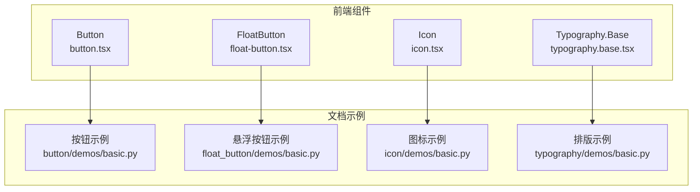
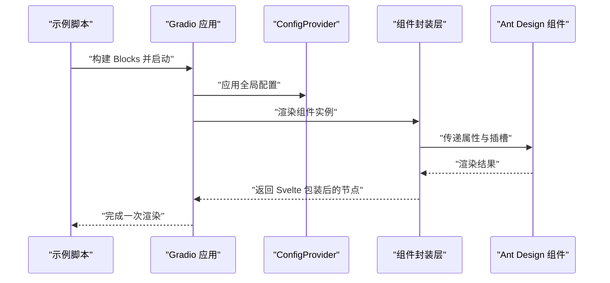
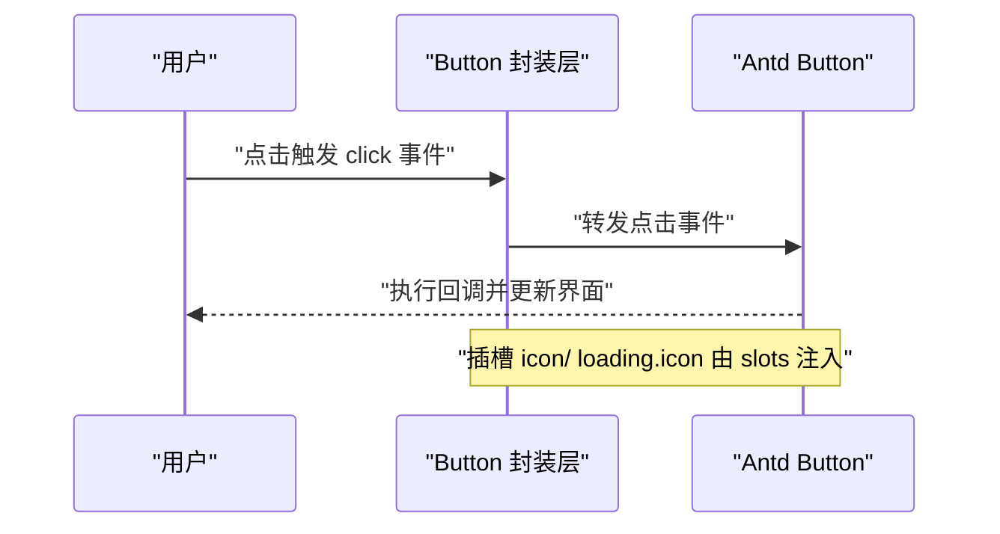
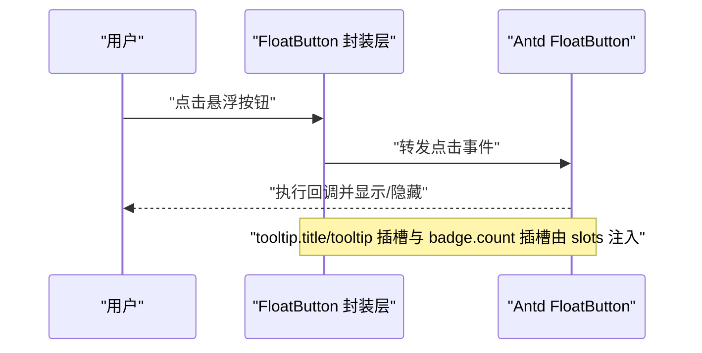
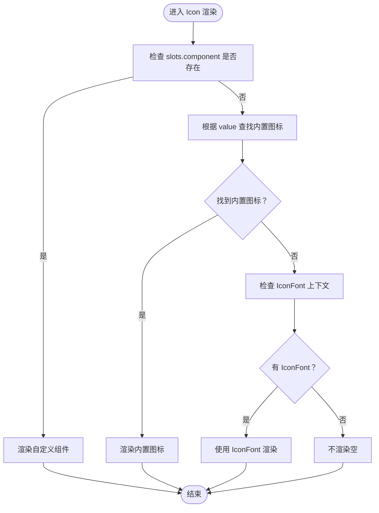
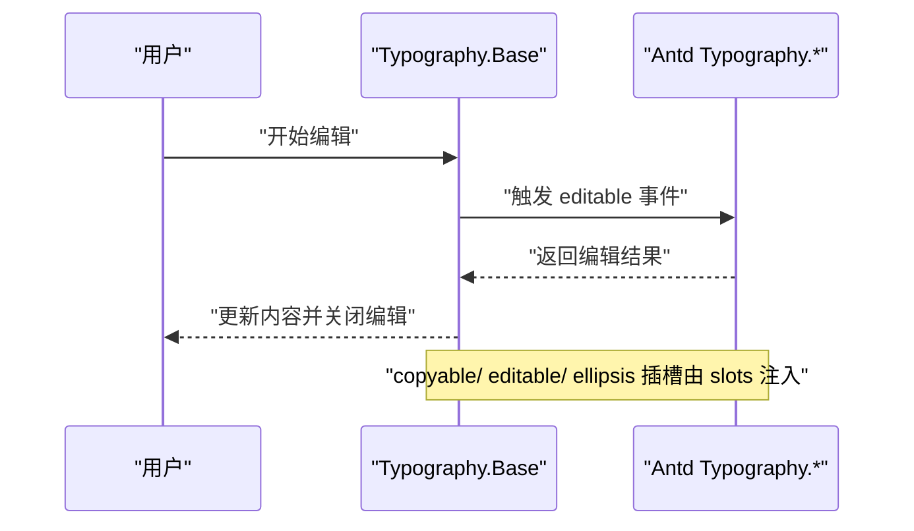
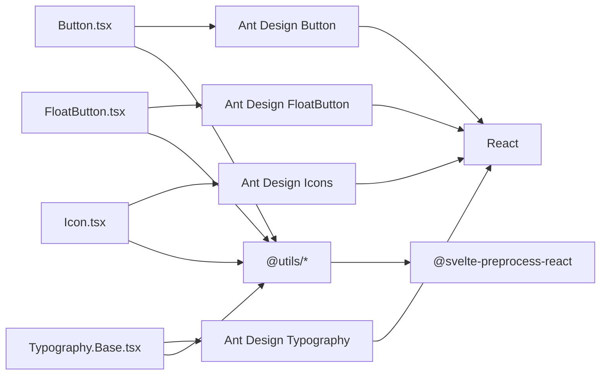

# 通用组件

<cite>
**本文引用的文件**
- [button.tsx](file://frontend/antd/button/button.tsx)
- [float-button.tsx](file://frontend/antd/float-button/float-button.tsx)
- [icon.tsx](file://frontend/antd/icon/icon.tsx)
- [typography.base.tsx](file://frontend/antd/typography/typography.base.tsx)
- [basic.py（按钮）](file://docs/components/antd/button/demos/basic.py)
- [basic.py（悬浮按钮）](file://docs/components/antd/float_button/demos/basic.py)
- [basic.py（图标）](file://docs/components/antd/icon/demos/basic.py)
- [basic.py（排版）](file://docs/components/antd/typography/demos/basic.py)
- [README-zh_CN.md（按钮）](file://docs/components/antd/button/README-zh_CN.md)
- [README-zh_CN.md（悬浮按钮）](file://docs/components/antd/float_button/README-zh_CN.md)
- [README-zh_CN.md（图标）](file://docs/components/antd/icon/README-zh_CN.md)
- [README-zh_CN.md（排版）](file://docs/components/antd/typography/README-zh_CN.md)
</cite>

## 目录

1. [简介](#简介)
2. [项目结构](#项目结构)
3. [核心组件](#核心组件)
4. [架构总览](#架构总览)
5. [详细组件分析](#详细组件分析)
6. [依赖关系分析](#依赖关系分析)
7. [性能考虑](#性能考虑)
8. [故障排查指南](#故障排查指南)
9. [结论](#结论)
10. [附录](#附录)

## 简介

本章节面向 Ant Design 通用组件在本仓库中的实现与使用，重点覆盖以下基础通用组件：按钮（Button）、悬浮按钮（FloatButton）、图标（Icon）、排版（Typography）。文档将从系统架构、组件职责、数据与事件流、可访问性与键盘导航、样式与主题定制、组合使用最佳实践以及性能优化等方面进行深入解析，并通过示例路径指引读者快速上手。

## 项目结构

本项目采用“前端 Svelte 组件封装 + 后端 Gradio 示例演示”的组织方式：

- 前端组件位于 frontend/antd 下，每个组件由一个 svelte 文件与一个 tsx 封装层组成，tsx 层负责将 Ant Design 的 React 组件桥接到 Svelte 生态，并通过插槽（slots）机制扩展图标、提示、徽标等子内容。
- 文档示例位于 docs/components/antd 下，每个组件提供多份演示脚本（basic.py 等），用于展示不同属性与交互场景。

图表来源

- [button.tsx:1-39](file://frontend/antd/button/button.tsx#L1-L39)
- [float-button.tsx:1-75](file://frontend/antd/float-button/float-button.tsx#L1-L75)
- [icon.tsx:1-55](file://frontend/antd/icon/icon.tsx#L1-L55)
- [typography.base.tsx:1-170](file://frontend/antd/typography/typography.base.tsx#L1-L170)
- [basic.py（按钮）:1-26](file://docs/components/antd/button/demos/basic.py#L1-L26)
- [basic.py（悬浮按钮）:1-30](file://docs/components/antd/float_button/demos/basic.py#L1-L30)
- [basic.py（图标）:1-24](file://docs/components/antd/icon/demos/basic.py#L1-L24)
- [basic.py（排版）:1-23](file://docs/components/antd/typography/demos/basic.py#L1-L23)

章节来源

- [README-zh_CN.md（按钮）:1-8](file://docs/components/antd/button/README-zh_CN.md#L1-L8)
- [README-zh_CN.md（悬浮按钮）:1-8](file://docs/components/antd/float_button/README-zh_CN.md#L1-L8)
- [README-zh_CN.md（图标）:1-10](file://docs/components/antd/icon/README-zh_CN.md#L1-L10)
- [README-zh_CN.md（排版）:1-8](file://docs/components/antd/typography/README-zh_CN.md#L1-L8)

## 核心组件

- 按钮（Button）
  - 职责：封装 Ant Design 的 Button，支持通过插槽注入 icon 与自定义 loading 图标；支持 value 与 children 双入口渲染。
  - 关键点：使用 useTargets 提取插槽目标，动态决定渲染内容；对 loading 配置进行条件合并，兼容对象与布尔值。
- 悬浮按钮（FloatButton）
  - 职责：封装 Ant Design 的 FloatButton，支持 icon、description、tooltip、badge 等插槽化配置；对函数型配置项进行 useFunction 包装以保持响应式。
  - 关键点：tooltip 支持 title 与整体配置对象；badge 支持 count 插槽；description 支持插槽。
- 图标（Icon）
  - 职责：支持 Ant Design 内置图标名称映射与 IconFont 渲染；支持自定义 component 插槽作为 SVG 组件。
  - 关键点：slots.component 优先级最高；否则按 value 映射到内置图标；最后回退到 IconFont 类型。
- 排版（Typography.Base）
  - 职责：统一聚合 Title、Text、Paragraph、Link 四类排版组件，支持 copyable、editable、ellipsis 的插槽化配置。
  - 关键点：根据 component 动态选择具体 Typography 子组件；对多个插槽进行 useTargets 与 renderParamsSlot 处理，保证灵活性与可扩展性。

章节来源

- [button.tsx:1-39](file://frontend/antd/button/button.tsx#L1-L39)
- [float-button.tsx:1-75](file://frontend/antd/float-button/float-button.tsx#L1-L75)
- [icon.tsx:1-55](file://frontend/antd/icon/icon.tsx#L1-L55)
- [typography.base.tsx:1-170](file://frontend/antd/typography/typography.base.tsx#L1-L170)

## 架构总览

下图展示了通用组件的调用链路：文档示例通过 Gradio 应用启动，内部使用 ConfigProvider 进行全局主题配置，随后渲染各组件；组件内部通过 sveltify 将 Ant Design 的 React 组件桥接为 Svelte 组件，并利用 slots 机制注入图标、提示、徽标等内容。

图表来源

- [basic.py（按钮）:5-25](file://docs/components/antd/button/demos/basic.py#L5-L25)
- [basic.py（悬浮按钮）:5-29](file://docs/components/antd/float_button/demos/basic.py#L5-L29)
- [basic.py（图标）:5-23](file://docs/components/antd/icon/demos/basic.py#L5-L23)
- [basic.py（排版）:10-22](file://docs/components/antd/typography/demos/basic.py#L10-L22)
- [button.tsx:8-36](file://frontend/antd/button/button.tsx#L8-L36)
- [float-button.tsx:14-72](file://frontend/antd/float-button/float-button.tsx#L14-L72)
- [icon.tsx:12-52](file://frontend/antd/icon/icon.tsx#L12-L52)
- [typography.base.tsx:19-167](file://frontend/antd/typography/typography.base.tsx#L19-L167)

## 详细组件分析

### 按钮（Button）

- 设计要点
  - 支持多种类型与变体：如 primary、dashed、text、link、filled 等；支持 block 布局与尺寸控制。
  - 插槽能力：通过 slots.icon 注入图标；通过 slots.loading.icon 注入加载态图标，支持延迟配置。
  - 内容入口：支持直接传入文本（children）或 value 字段；当存在插槽时优先渲染插槽内容。
- 事件与交互
  - click 事件：示例中演示了点击回调绑定。
  - 加载态：可通过 loading=true 或传入对象配置延迟时间。
- 样式与主题
  - 通过 ConfigProvider 全局主题生效；支持颜色与变体组合。
- 使用示例（参考路径）
  - 基础用法与变体：[basic.py（按钮）:8-22](file://docs/components/antd/button/demos/basic.py#L8-L22)
  - 插槽图标与加载态：[basic.py（按钮）:18-22](file://docs/components/antd/button/demos/basic.py#L18-L22)

图表来源

- [button.tsx:11-36](file://frontend/antd/button/button.tsx#L11-L36)
- [basic.py（按钮）:10-10](file://docs/components/antd/button/demos/basic.py#L10-L10)

章节来源

- [button.tsx:8-36](file://frontend/antd/button/button.tsx#L8-L36)
- [basic.py（按钮）:8-22](file://docs/components/antd/button/demos/basic.py#L8-L22)

### 悬浮按钮（FloatButton）

- 设计要点
  - 支持 Group、BackTop 等子组件；支持 icon、description、tooltip、badge 等插槽化配置。
  - tooltip 支持 title 与整体配置对象；badge 支持 count 插槽；description 支持插槽。
  - 对函数型配置项（如 afterOpenChange、getPopupContainer）使用 useFunction 包装，确保响应式更新。
- 事件与交互
  - 支持点击、可见性控制（BackTop 的 visibility_height）等。
- 样式与主题
  - 通过 elem_style 自定义位置与布局；结合 Group 实现多按钮编组。
- 使用示例（参考路径）
  - 基础用法与分组：[basic.py（悬浮按钮）:8-13](file://docs/components/antd/float_button/demos/basic.py#L8-L13)
  - 徽标与图标：[basic.py（悬浮按钮）:10-12](file://docs/components/antd/float_button/demos/basic.py#L10-L12)
  - BackTop 与 Tooltip 插槽：[basic.py（悬浮按钮）:13-13](file://docs/components/antd/float_button/demos/basic.py#L13-L13), [basic.py（悬浮按钮）:23-27](file://docs/components/antd/float_button/demos/basic.py#L23-L27)

图表来源

- [float-button.tsx:14-72](file://frontend/antd/float-button/float-button.tsx#L14-L72)
- [basic.py（悬浮按钮）:13-13](file://docs/components/antd/float_button/demos/basic.py#L13-L13)
- [basic.py（悬浮按钮）:23-27](file://docs/components/antd/float_button/demos/basic.py#L23-L27)

章节来源

- [float-button.tsx:7-72](file://frontend/antd/float-button/float-button.tsx#L7-L72)
- [basic.py（悬浮按钮）:8-27](file://docs/components/antd/float_button/demos/basic.py#L8-L27)

### 图标（Icon）

- 设计要点
  - 支持内置图标名称映射（如 HomeOutlined、SettingFilled 等）；支持 spin、rotate、twoTone 等属性。
  - 支持 IconFont 回退渲染；支持 slots.component 注入自定义 SVG 组件。
- 事件与交互
  - 示例中演示了点击事件绑定。
- 样式与主题
  - 支持颜色、旋转角度、两色图标等样式控制。
- 使用示例（参考路径）
  - 基础图标与两色图标：[basic.py（图标）:9-16](file://docs/components/antd/icon/demos/basic.py#L9-L16)
  - 自定义组件插槽：[basic.py（图标）:19-21](file://docs/components/antd/icon/demos/basic.py#L19-L21)

图表来源

- [icon.tsx:12-52](file://frontend/antd/icon/icon.tsx#L12-L52)
- [basic.py（图标）:9-16](file://docs/components/antd/icon/demos/basic.py#L9-L16)
- [basic.py（图标）:19-21](file://docs/components/antd/icon/demos/basic.py#L19-L21)

章节来源

- [icon.tsx:12-52](file://frontend/antd/icon/icon.tsx#L12-L52)
- [basic.py（图标）:9-21](file://docs/components/antd/icon/demos/basic.py#L9-L21)

### 排版（Typography.Base）

- 设计要点
  - 统一聚合 Title、Text、Paragraph、Link 四类组件，通过 component 参数切换。
  - 支持 copyable、editable、ellipsis 的插槽化配置，提升可定制性。
  - 使用 useSlotsChildren 与 useTargets 分离插槽内容与普通 children，避免重复渲染。
- 事件与交互
  - editable_change 事件：示例中演示了编辑变更事件的绑定与输出更新。
- 样式与主题
  - 通过 className 与组件名前缀生成类名，便于主题覆盖。
- 使用示例（参考路径）
  - 基础标题与文本：[basic.py（排版）:13-15](file://docs/components/antd/typography/demos/basic.py#L13-L15)
  - 可复制段落与编辑事件：[basic.py（排版）:16-19](file://docs/components/antd/typography/demos/basic.py#L16-L19)

图表来源

- [typography.base.tsx:19-167](file://frontend/antd/typography/typography.base.tsx#L19-L167)
- [basic.py（排版）:16-19](file://docs/components/antd/typography/demos/basic.py#L16-L19)

章节来源

- [typography.base.tsx:19-167](file://frontend/antd/typography/typography.base.tsx#L19-L167)
- [basic.py（排版）:13-19](file://docs/components/antd/typography/demos/basic.py#L13-L19)

## 依赖关系分析

- 组件间耦合
  - Button、FloatButton、Icon、Typography.Base 均通过 sveltify 将 Ant Design 的 React 组件桥接至 Svelte，彼此独立，耦合度低。
  - 插槽机制（slots）贯穿所有组件，用于注入图标、提示、徽标等子内容，提升可扩展性。
- 外部依赖
  - Ant Design React 组件库：提供基础 UI 能力。
  - @svelte-preprocess-react：提供 sveltify 与 ReactSlot，实现 Svelte 与 React 的互操作。
  - lodash-es：提供工具函数（如 isObject）。
  - @utils/\*：提供 useTargets、useFunction、renderParamsSlot 等工具，增强插槽与事件处理能力。
- 潜在循环依赖
  - 当前结构未发现循环依赖；组件均通过工具函数与上下文协作，保持单向依赖。

图表来源

- [button.tsx:1-6](file://frontend/antd/button/button.tsx#L1-L6)
- [float-button.tsx:1-5](file://frontend/antd/float-button/float-button.tsx#L1-L5)
- [icon.tsx:1-6](file://frontend/antd/icon/icon.tsx#L1-L6)
- [typography.base.tsx:1-10](file://frontend/antd/typography/typography.base.tsx#L1-L10)

章节来源

- [button.tsx:1-6](file://frontend/antd/button/button.tsx#L1-L6)
- [float-button.tsx:1-5](file://frontend/antd/float-button/float-button.tsx#L1-L5)
- [icon.tsx:1-6](file://frontend/antd/icon/icon.tsx#L1-L6)
- [typography.base.tsx:1-10](file://frontend/antd/typography/typography.base.tsx#L1-L10)

## 性能考虑

- 插槽渲染优化
  - 使用 useTargets 与 useSlotsChildren 分离插槽与普通 children，减少不必要的渲染开销。
  - 对 loading.icon、copyable.icon、editable.icon 等进行条件注入，避免无用节点挂载。
- 函数型配置包装
  - 对 tooltip 的函数型配置（如 afterOpenChange、getPopupContainer）使用 useFunction 包装，确保响应式更新且避免闭包抖动。
- 条件合并
  - 对 copyable、editable、ellipsis 等配置进行 getConfig 与 omitUndefinedProps 合并，仅在需要时启用对应能力，降低运行时负担。
- 主题与样式
  - 通过 ConfigProvider 统一主题，避免重复计算与样式冲突；合理使用 className 前缀，便于精准覆盖。

## 故障排查指南

- 插槽未生效
  - 确认插槽名称是否正确（如 icon、loading.icon、copyable.icon、editable.icon、ellipsis.symbol 等）。
  - 确认 slots.component 优先级高于内置图标映射，若提供则会覆盖默认行为。
- tooltip 无法打开或回调无效
  - 检查 tooltip 是否为对象配置；确保函数型配置项通过 useFunction 包装。
- 图标不显示
  - 若未提供 slots.component，需确认 value 是否为内置图标名称；否则需正确配置 IconFont 上下文。
- 编辑/复制/省略配置不生效
  - 确认 editable、copyable、ellipsis 任一存在即启用对应能力；若为对象配置，确保字段完整。

章节来源

- [float-button.tsx:14-72](file://frontend/antd/float-button/float-button.tsx#L14-L72)
- [icon.tsx:12-52](file://frontend/antd/icon/icon.tsx#L12-L52)
- [typography.base.tsx:19-167](file://frontend/antd/typography/typography.base.tsx#L19-L167)

## 结论

本仓库通过统一的 sveltify 封装与插槽机制，将 Ant Design 的 React 组件无缝接入 Svelte/Gradio 生态，实现了按钮、悬浮按钮、图标与排版等通用组件的高可定制与易用性。借助 ConfigProvider、slots 与工具函数，开发者可以灵活地实现样式定制、交互扩展与无障碍访问需求。建议在实际项目中遵循插槽命名规范、合理使用函数型配置包装与条件渲染策略，以获得更佳的性能与可维护性。

## 附录

- 快速示例路径
  - 按钮：[basic.py（按钮）:8-22](file://docs/components/antd/button/demos/basic.py#L8-L22)
  - 悬浮按钮：[basic.py（悬浮按钮）:8-27](file://docs/components/antd/float_button/demos/basic.py#L8-L27)
  - 图标：[basic.py（图标）:9-21](file://docs/components/antd/icon/demos/basic.py#L9-L21)
  - 排版：[basic.py（排版）:13-19](file://docs/components/antd/typography/demos/basic.py#L13-L19)
- 组件文档入口
  - 按钮：[README-zh_CN.md（按钮）:1-8](file://docs/components/antd/button/README-zh_CN.md#L1-L8)
  - 悬浮按钮：[README-zh_CN.md（悬浮按钮）:1-8](file://docs/components/antd/float_button/README-zh_CN.md#L1-L8)
  - 图标：[README-zh_CN.md（图标）:1-10](file://docs/components/antd/icon/README-zh_CN.md#L1-L10)
  - 排版：[README-zh_CN.md（排版）:1-8](file://docs/components/antd/typography/README-zh_CN.md#L1-L8)
