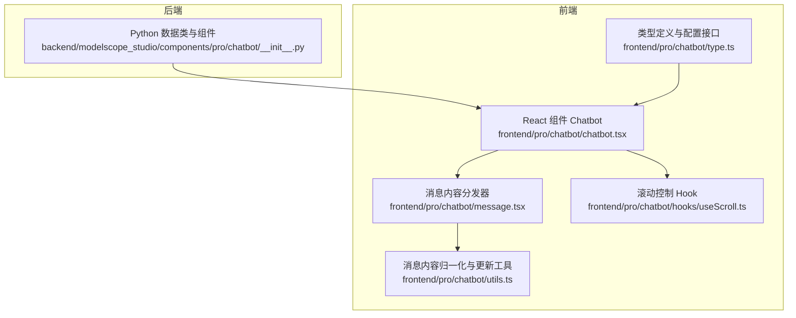
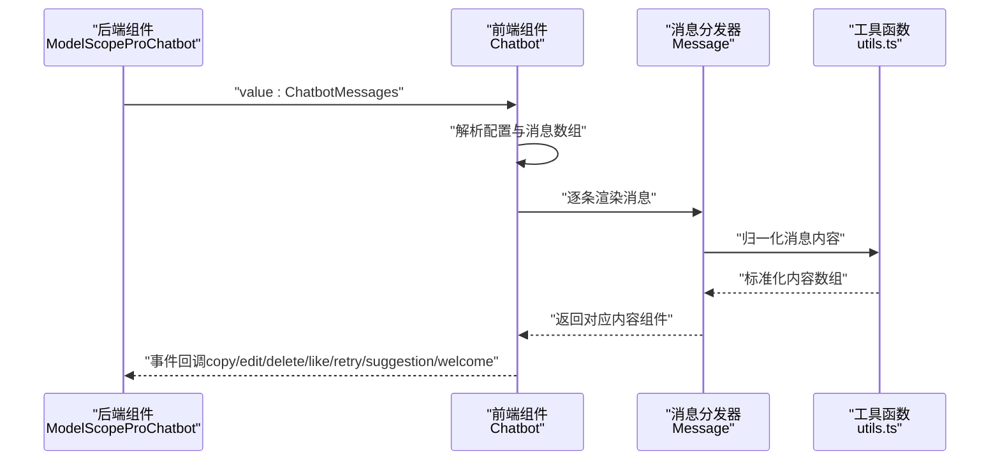
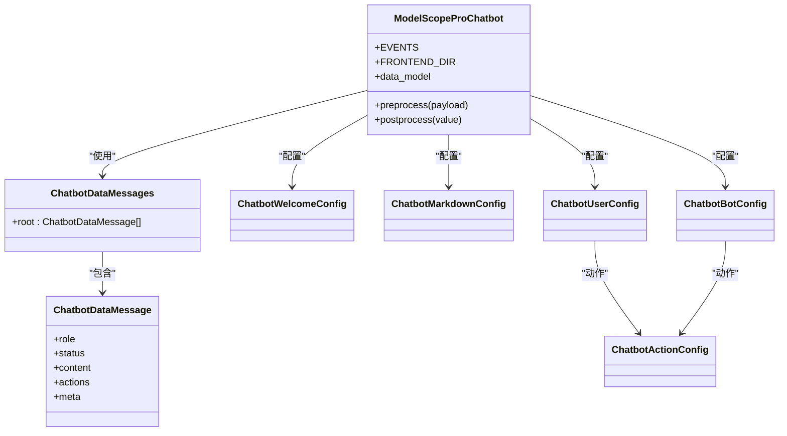
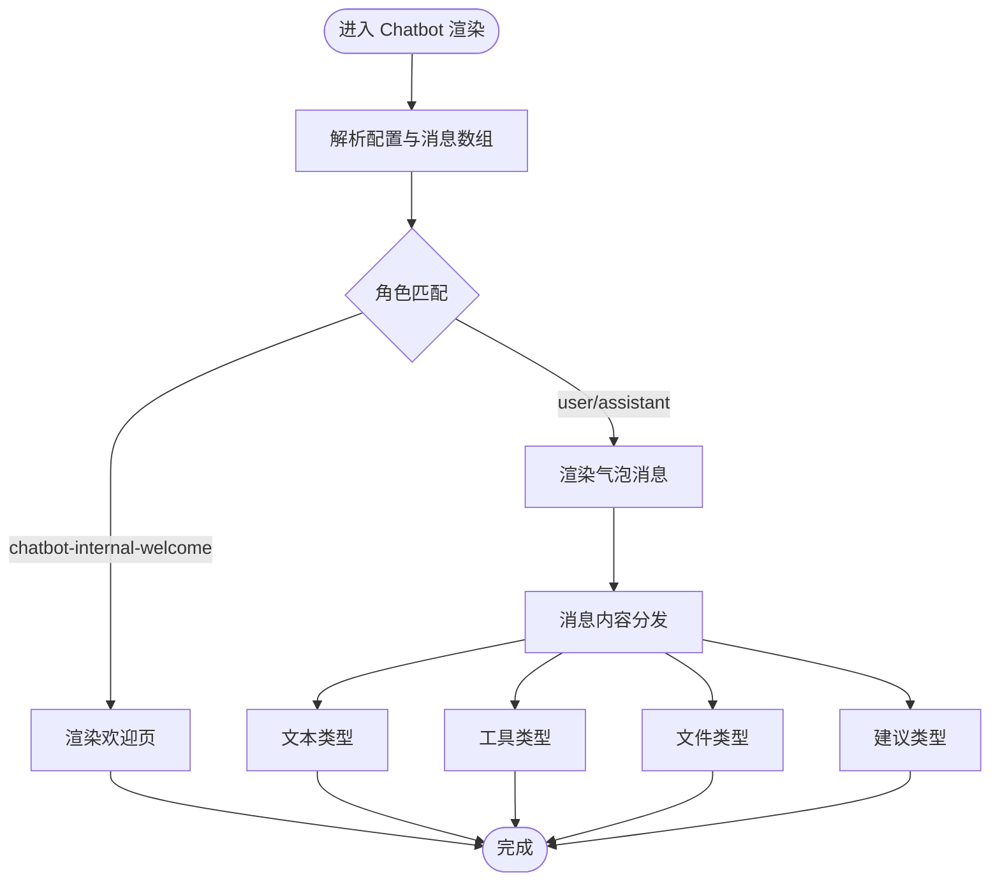
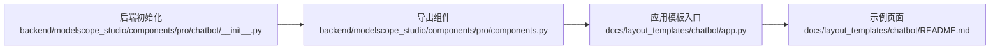

# Chatbot 聊天机器人

<cite>
**本文引用的文件**
- [backend/modelscope_studio/components/pro/chatbot/__init__.py](file://backend/modelscope_studio/components/pro/chatbot/__init__.py)
- [frontend/pro/chatbot/chatbot.tsx](file://frontend/pro/chatbot/chatbot.tsx)
- [frontend/pro/chatbot/type.ts](file://frontend/pro/chatbot/type.ts)
- [frontend/pro/chatbot/message.tsx](file://frontend/pro/chatbot/message.tsx)
- [frontend/pro/chatbot/utils.ts](file://frontend/pro/chatbot/utils.ts)
- [frontend/pro/chatbot/hooks/useScroll.ts](file://frontend/pro/chatbot/hooks/useScroll.ts)
- [docs/layout_templates/chatbot/README.md](file://docs/layout_templates/chatbot/README.md)
- [docs/layout_templates/chatbot/app.py](file://docs/layout_templates/chatbot/app.py)
- [backend/modelscope_studio/components/pro/components.py](file://backend/modelscope_studio/components/pro/components.py)
</cite>

## 目录

1. [简介](#简介)
2. [项目结构](#项目结构)
3. [核心组件](#核心组件)
4. [架构总览](#架构总览)
5. [详细组件分析](#详细组件分析)
6. [依赖分析](#依赖分析)
7. [性能考虑](#性能考虑)
8. [故障排查指南](#故障排查指南)
9. [结论](#结论)
10. [附录](#附录)

## 简介

本文件面向需要在模型平台中构建智能聊天应用的开发者，系统性阐述 Chatbot 聊天机器人组件的设计与实现。该组件覆盖以下核心能力：

- 消息处理：支持文本、工具（tool）、文件、建议（suggestion）等多种内容类型；支持消息状态（如 pending）与反馈标记。
- 多模态支持：统一的消息内容归一化与渲染，支持文件上传、预览与下载链接生成。
- 思维链展示：通过工具消息与建议提示，配合 Markdown 渲染，呈现推理与决策过程。
- 工具调用：消息内容可嵌入工具执行结果，支持状态管理与标题标注。
- 配置体系：提供欢迎页、Markdown 渲染、用户与机器人端消息样式与行为配置。

同时，文档提供完整使用示例、内部架构与消息流转机制说明、性能优化建议与常见问题解决方案。

## 项目结构

Chatbot 组件由后端 Python 数据类与前端 React/Svelte 双端实现构成，采用“数据类定义 + 前端渲染”的分层设计：

- 后端：定义消息数据模型、前后处理逻辑与静态资源服务封装。
- 前端：基于 @ant-design/x 的 Bubble 列表渲染消息，按内容类型分发到具体消息组件，提供滚动、编辑、复制、点赞/踩、重试等交互。

**图表来源**

- [backend/modelscope_studio/components/pro/chatbot/**init**.py:286-495](file://backend/modelscope_studio/components/pro/chatbot/__init__.py#L286-L495)
- [frontend/pro/chatbot/chatbot.tsx:51-475](file://frontend/pro/chatbot/chatbot.tsx#L51-L475)
- [frontend/pro/chatbot/type.ts:1-197](file://frontend/pro/chatbot/type.ts#L1-L197)
- [frontend/pro/chatbot/message.tsx:25-184](file://frontend/pro/chatbot/message.tsx#L25-L184)
- [frontend/pro/chatbot/utils.ts:46-103](file://frontend/pro/chatbot/utils.ts#L46-L103)
- [frontend/pro/chatbot/hooks/useScroll.ts](file://frontend/pro/chatbot/hooks/useScroll.ts)

**章节来源**

- [backend/modelscope_studio/components/pro/chatbot/**init**.py:1-495](file://backend/modelscope_studio/components/pro/chatbot/__init__.py#L1-L495)
- [frontend/pro/chatbot/chatbot.tsx:1-475](file://frontend/pro/chatbot/chatbot.tsx#L1-L475)
- [frontend/pro/chatbot/type.ts:1-197](file://frontend/pro/chatbot/type.ts#L1-L197)
- [frontend/pro/chatbot/message.tsx:1-184](file://frontend/pro/chatbot/message.tsx#L1-L184)
- [frontend/pro/chatbot/utils.ts:46-103](file://frontend/pro/chatbot/utils.ts#L46-L103)
- [frontend/pro/chatbot/hooks/useScroll.ts](file://frontend/pro/chatbot/hooks/useScroll.ts)

## 核心组件

- 后端组件：ModelScopeProChatbot
  - 定义消息数据模型与配置项，负责消息内容预处理、后处理与静态资源路径转换。
  - 提供事件绑定（change、copy、edit、delete、like、retry、suggestion_select、welcome_prompt_select）。
- 前端组件：Chatbot（React）
  - 将消息数组映射为 @ant-design/x 的 Bubble 列表，按角色与内容类型渲染。
  - 支持自动滚动、滚动到底部按钮、编辑、复制、点赞/踩、删除、重试、建议选择、欢迎提示选择等交互。
- 类型与配置：type.ts
  - 定义欢迎页、Markdown、用户/机器人配置、消息体、动作对象、内容类型与选项等接口。
- 消息分发：message.tsx
  - 归一化消息内容，根据类型分发到文本、工具、文件、建议消息组件。
- 工具函数：utils.ts
  - 归一化消息内容、批量更新内容值，支持字符串、数组、对象混合结构。
- 滚动控制：useScroll.ts
  - 控制列表滚动与“回到底部”按钮显示逻辑。

**章节来源**

- [backend/modelscope_studio/components/pro/chatbot/**init**.py:14-284](file://backend/modelscope_studio/components/pro/chatbot/__init__.py#L14-L284)
- [frontend/pro/chatbot/chatbot.tsx:51-475](file://frontend/pro/chatbot/chatbot.tsx#L51-L475)
- [frontend/pro/chatbot/type.ts:27-197](file://frontend/pro/chatbot/type.ts#L27-L197)
- [frontend/pro/chatbot/message.tsx:25-184](file://frontend/pro/chatbot/message.tsx#L25-L184)
- [frontend/pro/chatbot/utils.ts:46-103](file://frontend/pro/chatbot/utils.ts#L46-L103)
- [frontend/pro/chatbot/hooks/useScroll.ts](file://frontend/pro/chatbot/hooks/useScroll.ts)

## 架构总览

下图展示了从后端数据类到前端渲染的整体流程，以及事件回调的传递路径。

**图表来源**

- [backend/modelscope_studio/components/pro/chatbot/**init**.py:418-495](file://backend/modelscope_studio/components/pro/chatbot/__init__.py#L418-L495)
- [frontend/pro/chatbot/chatbot.tsx:176-472](file://frontend/pro/chatbot/chatbot.tsx#L176-L472)
- [frontend/pro/chatbot/message.tsx:52-184](file://frontend/pro/chatbot/message.tsx#L52-L184)
- [frontend/pro/chatbot/utils.ts:46-103](file://frontend/pro/chatbot/utils.ts#L46-L103)

## 详细组件分析

### 后端组件：ModelScopeProChatbot

- 数据模型
  - ChatbotDataMessage：定义消息角色、键、状态、内容、动作、元信息等字段。
  - ChatbotDataMessages：消息根容器。
  - 配置类：ChatbotWelcomeConfig、ChatbotMarkdownConfig、ChatbotUserConfig、ChatbotBotConfig、ChatbotActionConfig 等。
- 预处理与后处理
  - preprocess：将消息内容中的文件路径等进行预处理，便于前端渲染。
  - postprocess：将文件内容转换为 FileData，处理头像与静态资源路径。
- 事件绑定
  - EVENTS：绑定 change、copy、edit、delete、like、retry、suggestion_select、welcome_prompt_select 等事件。
- 前端目录
  - FRONTEND_DIR：指向前端 pro/chatbot 目录，确保组件正确加载。

**图表来源**

- [backend/modelscope_studio/components/pro/chatbot/**init**.py:14-284](file://backend/modelscope_studio/components/pro/chatbot/__init__.py#L14-L284)
- [backend/modelscope_studio/components/pro/chatbot/**init**.py:286-495](file://backend/modelscope_studio/components/pro/chatbot/__init__.py#L286-L495)

**章节来源**

- [backend/modelscope_studio/components/pro/chatbot/**init**.py:14-284](file://backend/modelscope_studio/components/pro/chatbot/__init__.py#L14-L284)
- [backend/modelscope_studio/components/pro/chatbot/**init**.py:286-495](file://backend/modelscope_studio/components/pro/chatbot/__init__.py#L286-L495)

### 前端组件：Chatbot（React）

- 角色与渲染
  - 使用 withRoleItemsContextProvider 为不同角色（用户、机器人、系统、分割线、欢迎页）提供渲染策略。
  - 默认跳过 system 与 divider，保留 chatbot-internal-welcome、user、assistant。
- 内容渲染
  - 根据消息内容类型分发到文本、工具、文件、建议组件。
  - 支持编辑模式（仅 text/tool），编辑完成后触发 onValueChange 更新。
- 交互事件
  - 复制、点赞/踩、删除、重试、建议选择、欢迎提示选择等事件通过回调传递给后端。
- 滚动控制
  - useScroll 控制自动滚动与“回到底部”按钮显示阈值。

**图表来源**

- [frontend/pro/chatbot/chatbot.tsx:107-472](file://frontend/pro/chatbot/chatbot.tsx#L107-L472)
- [frontend/pro/chatbot/message.tsx:52-184](file://frontend/pro/chatbot/message.tsx#L52-L184)

**章节来源**

- [frontend/pro/chatbot/chatbot.tsx:51-475](file://frontend/pro/chatbot/chatbot.tsx#L51-L475)
- [frontend/pro/chatbot/message.tsx:25-184](file://frontend/pro/chatbot/message.tsx#L25-L184)

### 类型与配置：type.ts

- 欢迎页配置 ChatbotWelcomeConfig：支持图标、标题、描述、额外信息、提示集合等。
- Markdown 配置 ChatbotMarkdownConfig：控制是否渲染、换行、LaTeX 分隔符、HTML 清洗等。
- 用户/机器人配置 ChatbotUserConfig/ChatbotBotConfig：动作列表、禁用动作、头像、变体、形状、放置位置、加载态等。
- 动作对象 ChatbotActionConfig：支持 Tooltip 与 Popconfirm。
- 消息内容类型：text、tool、file、suggestion；每种类型有对应的选项配置。
- 事件数据结构：CopyData、EditData、DeleteData、LikeData、RetryData、SuggestionData、WelcomePromptData。

**章节来源**

- [frontend/pro/chatbot/type.ts:27-197](file://frontend/pro/chatbot/type.ts#L27-L197)

### 消息内容归一化与更新：utils.ts

- normalizeMessageContent：将字符串、数组、对象统一为内容对象数组，便于渲染。
- updateContent：对编辑后的值进行批量更新，支持字符串与对象混合结构。

**章节来源**

- [frontend/pro/chatbot/utils.ts:46-103](file://frontend/pro/chatbot/utils.ts#L46-L103)

### 滚动控制：useScroll.ts

- 控制列表滚动至底部与按钮显示阈值，提升用户体验。

**章节来源**

- [frontend/pro/chatbot/hooks/useScroll.ts](file://frontend/pro/chatbot/hooks/useScroll.ts)

## 依赖分析

- 组件导出
  - 后端通过 components/pro/components.py 导出 ProChatbot，便于上层应用直接使用。
- 文档模板
  - layout_templates/chatbot 提供应用模板与示例入口，便于快速演示与集成。

**图表来源**

- [backend/modelscope_studio/components/pro/chatbot/**init**.py:386-388](file://backend/modelscope_studio/components/pro/chatbot/__init__.py#L386-L388)
- [backend/modelscope_studio/components/pro/components.py:1-8](file://backend/modelscope_studio/components/pro/components.py#L1-L8)
- [docs/layout_templates/chatbot/app.py:1-7](file://docs/layout_templates/chatbot/app.py#L1-L7)
- [docs/layout_templates/chatbot/README.md:1-20](file://docs/layout_templates/chatbot/README.md#L1-L20)

**章节来源**

- [backend/modelscope_studio/components/pro/components.py:1-8](file://backend/modelscope_studio/components/pro/components.py#L1-L8)
- [docs/layout_templates/chatbot/README.md:1-20](file://docs/layout_templates/chatbot/README.md#L1-L20)
- [docs/layout_templates/chatbot/app.py:1-7](file://docs/layout_templates/chatbot/app.py#L1-L7)

## 性能考虑

- 消息渲染优化
  - 使用 useMemo 缓存配置解析与消息数组转换，减少不必要的重渲染。
  - 仅在最后一条消息或编辑状态时启用编辑输入框，避免全量渲染。
- 文件处理
  - 在后端将文件路径转换为 FileData，前端按需渲染，避免重复请求。
- 滚动控制
  - 通过阈值控制“回到底部”按钮显示，降低频繁滚动带来的开销。
- 事件回调
  - 使用 useMemoizedFn 包装回调，减少事件处理器重建次数。

[本节为通用性能建议，不直接分析具体文件]

## 故障排查指南

- 消息未显示或渲染异常
  - 检查消息内容是否符合 ChatbotDataMessage 结构，尤其是 content 的类型与 options。
  - 确认后端 postprocess 是否正确处理了文件路径与头像资源。
- 文件无法预览或下载
  - 确认文件路径为本地文件或 HTTP 地址，后端会根据路径类型生成 FileData。
- 编辑功能无效
  - 确认消息内容类型为 text 或 tool，且 editable 字段未被禁用。
- 滚动按钮不出现
  - 检查 autoScroll 与 scroll_to_bottom_button_offset 配置，确认消息数量与高度设置合理。
- 事件未触发
  - 确认前端已绑定相应事件回调，后端 EVENTS 中包含对应事件监听。

**章节来源**

- [backend/modelscope_studio/components/pro/chatbot/**init**.py:418-495](file://backend/modelscope_studio/components/pro/chatbot/__init__.py#L418-L495)
- [frontend/pro/chatbot/chatbot.tsx:176-472](file://frontend/pro/chatbot/chatbot.tsx#L176-L472)
- [frontend/pro/chatbot/message.tsx:37-184](file://frontend/pro/chatbot/message.tsx#L37-L184)

## 结论

Chatbot 聊天机器人组件通过清晰的数据模型与前后端协作，实现了多模态消息处理、思维链展示与工具调用集成。其配置体系灵活，事件回调完善，适合在复杂对话场景中构建高质量的智能聊天应用。建议在实际项目中结合业务需求，合理配置欢迎页、Markdown 渲染与消息动作，以获得最佳用户体验。

[本节为总结性内容，不直接分析具体文件]

## 附录

### 使用示例与最佳实践

- 基础聊天
  - 初始化 ModelScopeProChatbot，传入初始消息数组与基础配置。
  - 监听 change、copy、edit、delete、like、retry 等事件，实现业务逻辑。
- 多模态输入
  - 使用 ChatbotDataMessageContent 的 file 类型承载附件列表，后端自动转换为 FileData。
  - 前端根据 options 中的 image/video/audioProps 进行预览。
- 工具集成
  - 使用 tool 类型承载工具执行结果，配合 options.title 与 status 标注执行状态。
- 思维链展示
  - 通过 suggestion 类型提供输入建议，结合 Markdown 渲染增强可读性。
- 配置要点
  - 欢迎页：设置 icon、title、description、prompts 等。
  - Markdown：控制换行、LaTeX 分隔符、HTML 清洗与标签允许列表。
  - 用户/机器人：自定义动作、头像、变体与放置位置，提升界面一致性。

[本节为概念性说明，不直接分析具体文件]
