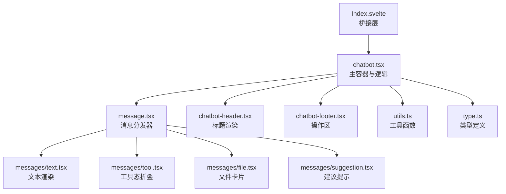
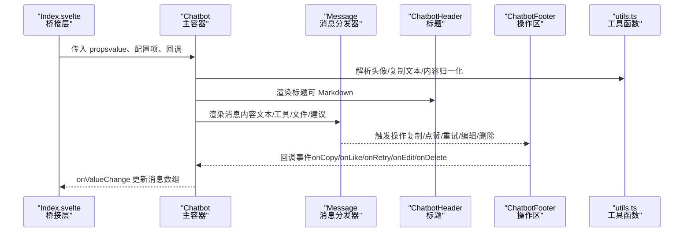
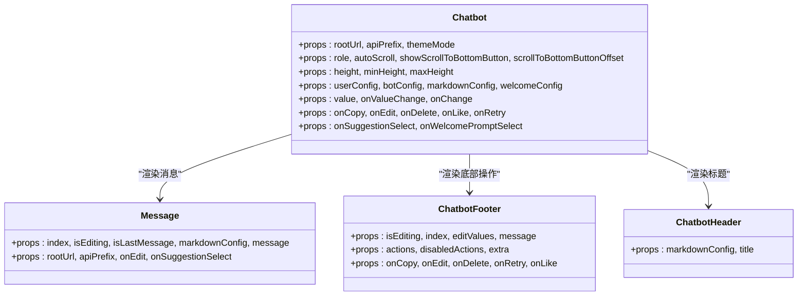
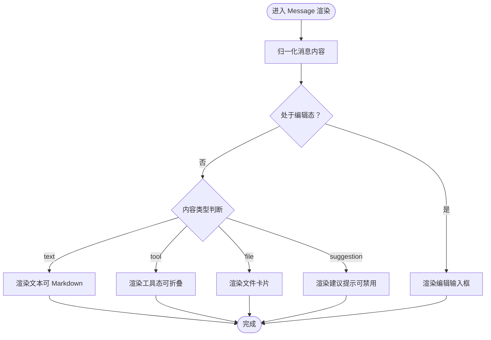
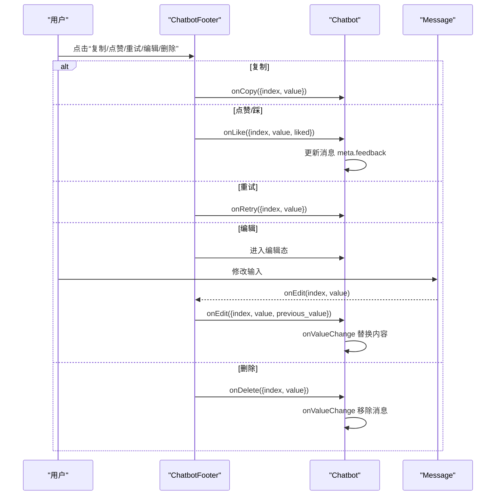
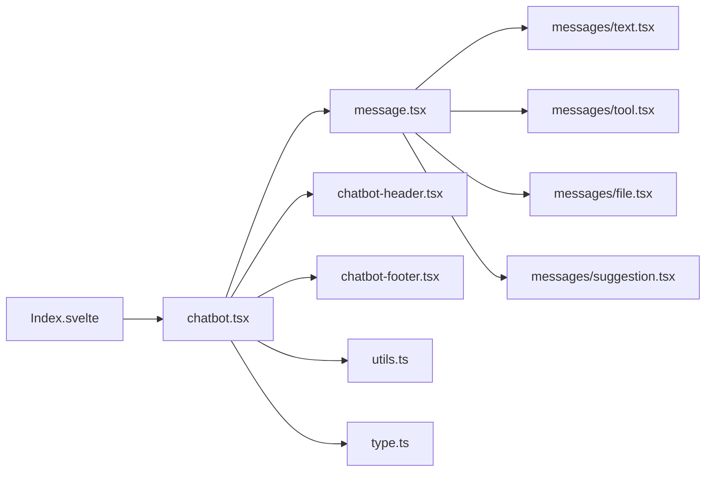

# 基础使用

<cite>
**本文引用的文件**
- [frontend/pro/chatbot/Index.svelte](file://frontend/pro/chatbot/Index.svelte)
- [frontend/pro/chatbot/chatbot.tsx](file://frontend/pro/chatbot/chatbot.tsx)
- [frontend/pro/chatbot/type.ts](file://frontend/pro/chatbot/type.ts)
- [frontend/pro/chatbot/utils.ts](file://frontend/pro/chatbot/utils.ts)
- [frontend/pro/chatbot/message.tsx](file://frontend/pro/chatbot/message.tsx)
- [frontend/pro/chatbot/chatbot-footer.tsx](file://frontend/pro/chatbot/chatbot-footer.tsx)
- [frontend/pro/chatbot/chatbot-header.tsx](file://frontend/pro/chatbot/chatbot-header.tsx)
- [frontend/pro/chatbot/messages/text.tsx](file://frontend/pro/chatbot/messages/text.tsx)
- [frontend/pro/chatbot/messages/file.tsx](file://frontend/pro/chatbot/messages/file.tsx)
- [frontend/pro/chatbot/messages/suggestion.tsx](file://frontend/pro/chatbot/messages/suggestion.tsx)
- [frontend/pro/chatbot/messages/tool.tsx](file://frontend/pro/chatbot/messages/tool.tsx)
- [docs/layout_templates/chatbot/README-zh_CN.md](file://docs/layout_templates/chatbot/README-zh_CN.md)
- [docs/layout_templates/chatbot/app.py](file://docs/layout_templates/chatbot/app.py)
</cite>

## 目录

1. [简介](#简介)
2. [项目结构](#项目结构)
3. [核心组件](#核心组件)
4. [架构总览](#架构总览)
5. [详细组件分析](#详细组件分析)
6. [依赖分析](#依赖分析)
7. [性能考虑](#性能考虑)
8. [故障排查指南](#故障排查指南)
9. [结论](#结论)
10. [附录](#附录)

## 简介

本章节面向初学者，介绍 Chatbot 聊天机器人组件的基础概念与核心能力，帮助你快速上手并构建第一个聊天机器人应用。Chatbot 组件提供消息显示、用户交互、欢迎引导、滚动行为控制、Markdown 渲染、附件展示、建议提示、工具态展开收起等功能。通过统一的消息数据模型与可配置的角色样式，你可以灵活地定制用户与机器人消息的外观与交互。

## 项目结构

Chatbot 组件位于前端 Pro 区块中，采用 Svelte 作为桥接层，内部以 React 组件为核心实现，并通过 Ant Design X 的气泡列表（Bubble.List）承载消息渲染与交互。消息内容支持文本、工具态（可折叠）、文件、建议提示等多种类型；底部操作区支持复制、点赞/踩、重试、编辑、删除等动作；顶部标题支持 Markdown 渲染；欢迎区域支持引导文案与建议提示。

图示来源

- [frontend/pro/chatbot/Index.svelte:1-90](file://frontend/pro/chatbot/Index.svelte#L1-L90)
- [frontend/pro/chatbot/chatbot.tsx:1-475](file://frontend/pro/chatbot/chatbot.tsx#L1-L475)
- [frontend/pro/chatbot/message.tsx:1-184](file://frontend/pro/chatbot/message.tsx#L1-L184)
- [frontend/pro/chatbot/chatbot-header.tsx:1-23](file://frontend/pro/chatbot/chatbot-header.tsx#L1-L23)
- [frontend/pro/chatbot/chatbot-footer.tsx:1-363](file://frontend/pro/chatbot/chatbot-footer.tsx#L1-L363)
- [frontend/pro/chatbot/utils.ts:1-157](file://frontend/pro/chatbot/utils.ts#L1-L157)
- [frontend/pro/chatbot/type.ts:1-197](file://frontend/pro/chatbot/type.ts#L1-L197)
- [frontend/pro/chatbot/messages/text.tsx:1-19](file://frontend/pro/chatbot/messages/text.tsx#L1-L19)
- [frontend/pro/chatbot/messages/tool.tsx:1-46](file://frontend/pro/chatbot/messages/tool.tsx#L1-L46)
- [frontend/pro/chatbot/messages/file.tsx:1-119](file://frontend/pro/chatbot/messages/file.tsx#L1-L119)
- [frontend/pro/chatbot/messages/suggestion.tsx:1-37](file://frontend/pro/chatbot/messages/suggestion.tsx#L1-L37)

章节来源

- [frontend/pro/chatbot/Index.svelte:1-90](file://frontend/pro/chatbot/Index.svelte#L1-L90)
- [frontend/pro/chatbot/chatbot.tsx:1-475](file://frontend/pro/chatbot/chatbot.tsx#L1-L475)

## 核心组件

- 主容器 Chatbot：负责消息列表渲染、滚动控制、欢迎区、Markdown 配置、用户/机器人角色配置、事件回调（复制、编辑、删除、点赞/踩、重试、建议选择、欢迎提示选择）。
- 消息分发器 Message：根据消息内容类型（文本/工具/文件/建议）分派到对应子组件进行渲染。
- 顶部标题 ChatbotHeader：支持 Markdown 渲染标题。
- 底部操作区 ChatbotFooter：统一处理复制、点赞/踩、重试、编辑、删除等动作，支持禁用与二次确认。
- 工具函数 utils：提供头像解析、消息内容归一化、复制文本提取、建议内容遍历等。
- 类型定义 type：定义消息体、角色配置、Markdown 配置、文件/建议/工具内容配置、事件数据结构等。
- 子消息组件：文本、工具态（可折叠）、文件卡片、建议提示。

章节来源

- [frontend/pro/chatbot/chatbot.tsx:51-475](file://frontend/pro/chatbot/chatbot.tsx#L51-L475)
- [frontend/pro/chatbot/message.tsx:25-184](file://frontend/pro/chatbot/message.tsx#L25-L184)
- [frontend/pro/chatbot/chatbot-header.tsx:6-23](file://frontend/pro/chatbot/chatbot-header.tsx#L6-L23)
- [frontend/pro/chatbot/chatbot-footer.tsx:34-363](file://frontend/pro/chatbot/chatbot-footer.tsx#L34-L363)
- [frontend/pro/chatbot/utils.ts:19-157](file://frontend/pro/chatbot/utils.ts#L19-L157)
- [frontend/pro/chatbot/type.ts:27-197](file://frontend/pro/chatbot/type.ts#L27-L197)

## 架构总览

下图展示了从桥接层到 React 主容器、再到消息渲染与交互的整体流程：

图示来源

- [frontend/pro/chatbot/Index.svelte:64-89](file://frontend/pro/chatbot/Index.svelte#L64-L89)
- [frontend/pro/chatbot/chatbot.tsx:107-472](file://frontend/pro/chatbot/chatbot.tsx#L107-L472)
- [frontend/pro/chatbot/message.tsx:39-184](file://frontend/pro/chatbot/message.tsx#L39-L184)
- [frontend/pro/chatbot/chatbot-header.tsx:11-22](file://frontend/pro/chatbot/chatbot-header.tsx#L11-L22)
- [frontend/pro/chatbot/chatbot-footer.tsx:255-362](file://frontend/pro/chatbot/chatbot-footer.tsx#L255-L362)
- [frontend/pro/chatbot/utils.ts:46-140](file://frontend/pro/chatbot/utils.ts#L46-L140)

## 详细组件分析

### 主容器 Chatbot（属性与行为）

- 关键属性
  - 尺寸与布局：height、minHeight、maxHeight
  - 滚动行为：autoScroll、showScrollToBottomButton、scrollToBottomButtonOffset
  - 角色配置：userConfig、botConfig（含头像、样式、类名、动作、禁用动作等）
  - 内容配置：markdownConfig（是否渲染 Markdown、根路径、主题模式等）
  - 欢迎配置：welcomeConfig（欢迎文案、图标、建议提示等）
  - 数据与回调：value（消息数组）、onValueChange、onChange、onCopy、onEdit、onDelete、onLike、onRetry、onSuggestionSelect、onWelcomePromptSelect
- 行为特性
  - 自动滚动至底部与“回到底部”按钮
  - 欢迎区占位与引导
  - 复制、点赞/踩、重试、编辑、删除等交互
  - Markdown 渲染与主题适配
  - 消息索引与最后一条消息标记

图示来源

- [frontend/pro/chatbot/chatbot.tsx:51-107](file://frontend/pro/chatbot/chatbot.tsx#L51-L107)
- [frontend/pro/chatbot/message.tsx:25-49](file://frontend/pro/chatbot/message.tsx#L25-L49)
- [frontend/pro/chatbot/chatbot-footer.tsx:34-51](file://frontend/pro/chatbot/chatbot-footer.tsx#L34-L51)
- [frontend/pro/chatbot/chatbot-header.tsx:6-14](file://frontend/pro/chatbot/chatbot-header.tsx#L6-L14)

章节来源

- [frontend/pro/chatbot/chatbot.tsx:51-475](file://frontend/pro/chatbot/chatbot.tsx#L51-L475)

### 消息内容类型与渲染

- 文本消息：支持 Markdown 开关与 Markdown 参数透传
- 工具消息：支持标题与状态（进行中/完成），默认折叠未完成项
- 文件消息：支持图片/视频/音频预览卡片，自动解析可访问链接
- 建议消息：支持多级提示，非最后一条消息时自动禁用点击

图示来源

- [frontend/pro/chatbot/message.tsx:52-175](file://frontend/pro/chatbot/message.tsx#L52-L175)
- [frontend/pro/chatbot/messages/text.tsx:11-18](file://frontend/pro/chatbot/messages/text.tsx#L11-L18)
- [frontend/pro/chatbot/messages/tool.tsx:13-45](file://frontend/pro/chatbot/messages/tool.tsx#L13-L45)
- [frontend/pro/chatbot/messages/file.tsx:44-118](file://frontend/pro/chatbot/messages/file.tsx#L44-L118)
- [frontend/pro/chatbot/messages/suggestion.tsx:16-36](file://frontend/pro/chatbot/messages/suggestion.tsx#L16-L36)

章节来源

- [frontend/pro/chatbot/message.tsx:25-184](file://frontend/pro/chatbot/message.tsx#L25-L184)
- [frontend/pro/chatbot/messages/text.tsx:1-19](file://frontend/pro/chatbot/messages/text.tsx#L1-L19)
- [frontend/pro/chatbot/messages/tool.tsx:1-46](file://frontend/pro/chatbot/messages/tool.tsx#L1-L46)
- [frontend/pro/chatbot/messages/file.tsx:1-119](file://frontend/pro/chatbot/messages/file.tsx#L1-L119)
- [frontend/pro/chatbot/messages/suggestion.tsx:1-37](file://frontend/pro/chatbot/messages/suggestion.tsx#L1-L37)

### 欢迎区与建议提示

- 欢迎区：在无消息时显示，支持自定义样式、头像、提示文案与建议提示
- 建议提示：在最后一条消息时启用点击，其他消息时自动禁用，避免误触发

章节来源

- [frontend/pro/chatbot/chatbot.tsx:306-328](file://frontend/pro/chatbot/chatbot.tsx#L306-L328)
- [frontend/pro/chatbot/messages/suggestion.tsx:16-36](file://frontend/pro/chatbot/messages/suggestion.tsx#L16-L36)

### 操作区交互（复制/点赞/重试/编辑/删除）

- 复制：根据内容类型提取可复制文本，支持文件链接 JSON 化
- 点赞/踩：更新消息 meta 中的反馈状态，支持取消
- 重试：触发外部 onRetry 回调
- 编辑：进入编辑态，支持多段内容按序编辑，确认后回写
- 删除：移除对应消息

图示来源

- [frontend/pro/chatbot/chatbot-footer.tsx:102-362](file://frontend/pro/chatbot/chatbot-footer.tsx#L102-L362)
- [frontend/pro/chatbot/chatbot.tsx:195-245](file://frontend/pro/chatbot/chatbot.tsx#L195-L245)
- [frontend/pro/chatbot/utils.ts:74-103](file://frontend/pro/chatbot/utils.ts#L74-L103)

章节来源

- [frontend/pro/chatbot/chatbot-footer.tsx:34-363](file://frontend/pro/chatbot/chatbot-footer.tsx#L34-L363)
- [frontend/pro/chatbot/chatbot.tsx:172-245](file://frontend/pro/chatbot/chatbot.tsx#L172-L245)
- [frontend/pro/chatbot/utils.ts:74-140](file://frontend/pro/chatbot/utils.ts#L74-L140)

## 依赖分析

- 桥接层：Index.svelte 使用 importComponent 将 React 组件动态导入，并传递 props、插槽与共享上下文（rootUrl、apiPrefix、theme）。
- 主容器：chatbot.tsx 依赖 Ant Design X 的 Bubble.List 与 Antd 组件，结合 utils 与 type 完成渲染与交互。
- 消息子组件：分别依赖 Markdown 渲染与 Antd 组件，文件消息依赖上传工具解析可访问链接。
- 类型系统：统一定义消息体、角色配置、内容配置与事件数据，保证跨组件一致性。

图示来源

- [frontend/pro/chatbot/Index.svelte:12-87](file://frontend/pro/chatbot/Index.svelte#L12-L87)
- [frontend/pro/chatbot/chatbot.tsx:1-49](file://frontend/pro/chatbot/chatbot.tsx#L1-L49)
- [frontend/pro/chatbot/message.tsx:1-25](file://frontend/pro/chatbot/message.tsx#L1-L25)

章节来源

- [frontend/pro/chatbot/Index.svelte:1-90](file://frontend/pro/chatbot/Index.svelte#L1-L90)
- [frontend/pro/chatbot/chatbot.tsx:1-475](file://frontend/pro/chatbot/chatbot.tsx#L1-L475)

## 性能考虑

- 消息列表优化：通过 useMemo 与浅比较减少重渲染；仅在 value 变更时触发 onChange。
- 滚动控制：useScroll 提供平滑滚动与按钮显隐，避免频繁 DOM 计算。
- 内容归一化：normalizeMessageContent 将字符串/数组/对象统一封装，降低分支复杂度。
- Markdown 渲染：按需渲染，支持关闭 Markdown 以减少开销。
- 文件链接：延迟解析与缓存策略，避免重复计算可访问 URL。

章节来源

- [frontend/pro/chatbot/chatbot.tsx:117-183](file://frontend/pro/chatbot/chatbot.tsx#L117-L183)
- [frontend/pro/chatbot/utils.ts:46-72](file://frontend/pro/chatbot/utils.ts#L46-L72)

## 故障排查指南

- 消息不显示或空白
  - 检查 value 是否为空，若为空会显示欢迎区占位
  - 确认消息内容类型与 options 配置正确
- 复制无效
  - 检查内容是否可复制（部分类型默认不可复制）
  - 确认 rootUrl 与 apiPrefix 正确，以便生成可访问链接
- 文件无法打开
  - 确认文件 URL 或路径已正确解析为可访问地址
- 滚动异常
  - 调整 autoScroll、scrollToBottomButtonOffset 参数
  - 确保容器高度设置合理（height/minHeight/maxHeight）
- 操作按钮不生效
  - 检查 actions 与 disabled_actions 配置
  - 确认回调函数（onCopy/onLike/onRetry/onEdit/onDelete）已绑定

章节来源

- [frontend/pro/chatbot/chatbot.tsx:433-468](file://frontend/pro/chatbot/chatbot.tsx#L433-L468)
- [frontend/pro/chatbot/utils.ts:105-140](file://frontend/pro/chatbot/utils.ts#L105-L140)
- [frontend/pro/chatbot/messages/file.tsx:18-42](file://frontend/pro/chatbot/messages/file.tsx#L18-L42)

## 结论

Chatbot 组件通过清晰的类型体系与模块化设计，提供了完整的聊天消息渲染与交互能力。借助统一的配置项与回调机制，你可以快速搭建具备欢迎引导、消息编辑、文件与建议提示、Markdown 渲染等能力的聊天界面。建议从最小可用 Demo 入手，逐步扩展角色样式与交互动作，以获得更好的用户体验。

## 附录

### 入门示例（步骤说明）

- 创建一个最小聊天界面
  - 准备一个空的消息数组作为初始值
  - 设置容器高度与滚动行为
  - 绑定 onValueChange 以接收消息变更
  - 可选：配置 userConfig/botConfig 控制头像与样式
- 添加第一条消息
  - 在消息数组中加入一条用户消息（role=user）
  - 机器人回复时插入一条助手消息（role=assistant）
- 启动应用
  - 使用文档模板中的启动方式运行应用

章节来源

- [docs/layout_templates/chatbot/README-zh_CN.md:1-20](file://docs/layout_templates/chatbot/README-zh_CN.md#L1-L20)
- [docs/layout_templates/chatbot/app.py:1-7](file://docs/layout_templates/chatbot/app.py#L1-L7)

### 常见属性与参数说明

- 尺寸与滚动
  - height/minHeight/maxHeight：容器尺寸控制
  - autoScroll：是否自动滚动到底部
  - showScrollToBottomButton/scrollToBottomButtonOffset：底部回到按钮显隐与偏移
- 角色配置
  - userConfig/botConfig：头像、样式、类名、动作、禁用动作、额外头部/尾部内容
- 内容配置
  - markdownConfig：是否渲染 Markdown、根路径、主题模式等
  - welcomeConfig：欢迎文案、图标、建议提示等
- 事件回调
  - onValueChange：消息数组变更
  - onCopy/onEdit/onDelete/onLike/onRetry：对应操作回调
  - onSuggestionSelect/onWelcomePromptSelect：建议与欢迎提示选择回调

章节来源

- [frontend/pro/chatbot/chatbot.tsx:51-107](file://frontend/pro/chatbot/chatbot.tsx#L51-L107)
- [frontend/pro/chatbot/type.ts:86-119](file://frontend/pro/chatbot/type.ts#L86-L119)
- [frontend/pro/chatbot/type.ts:27-41](file://frontend/pro/chatbot/type.ts#L27-L41)
