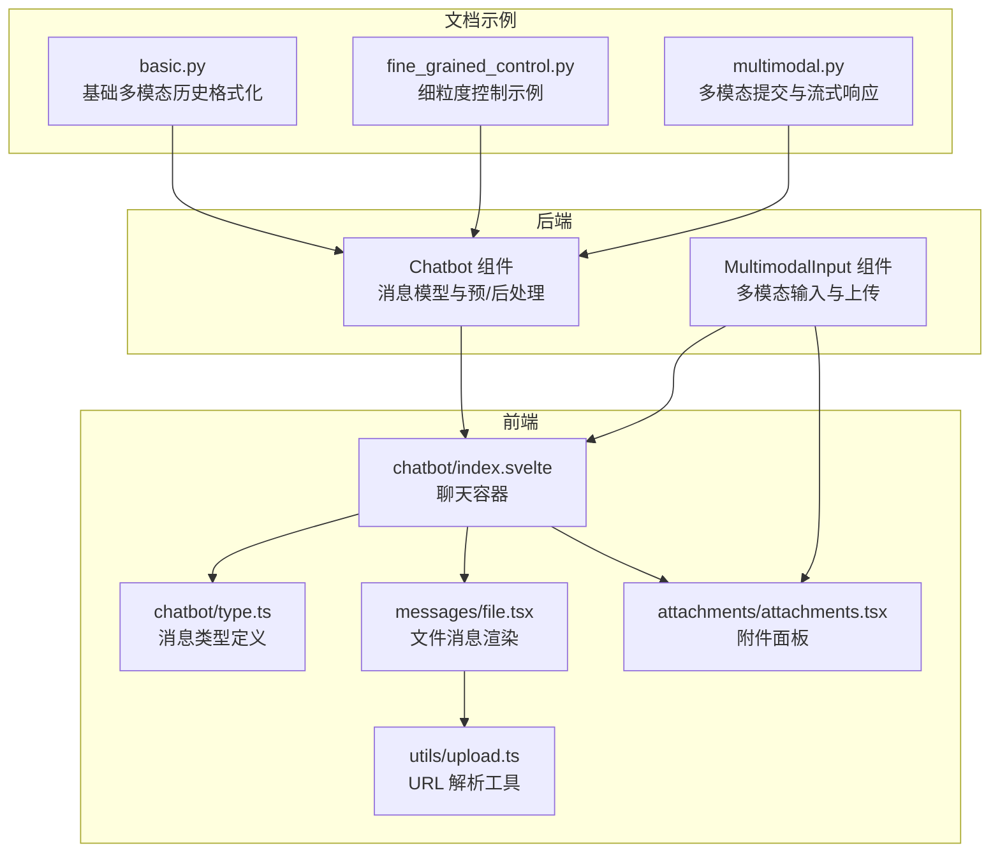
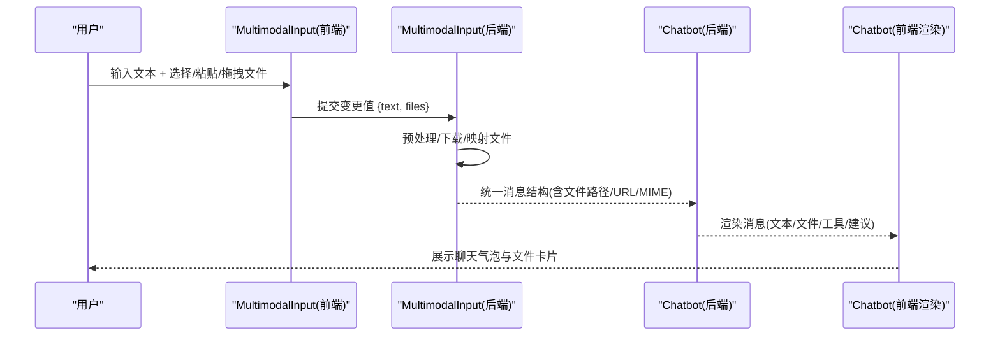
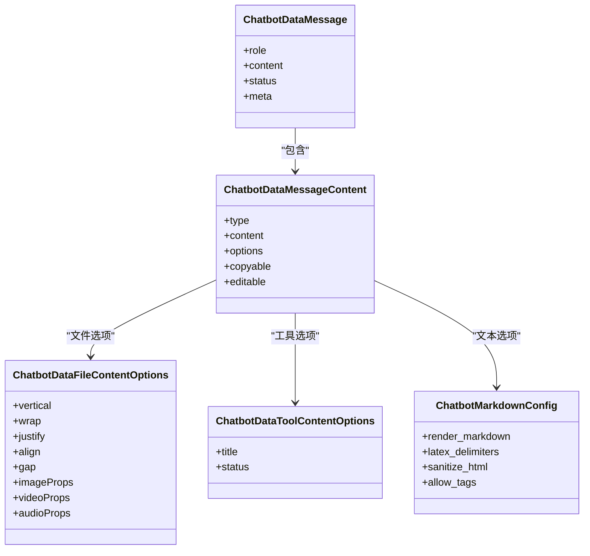
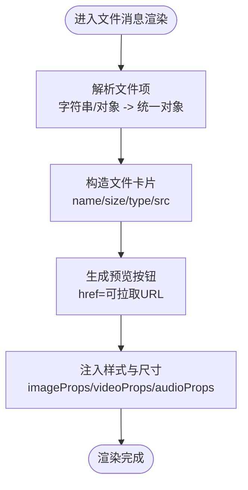
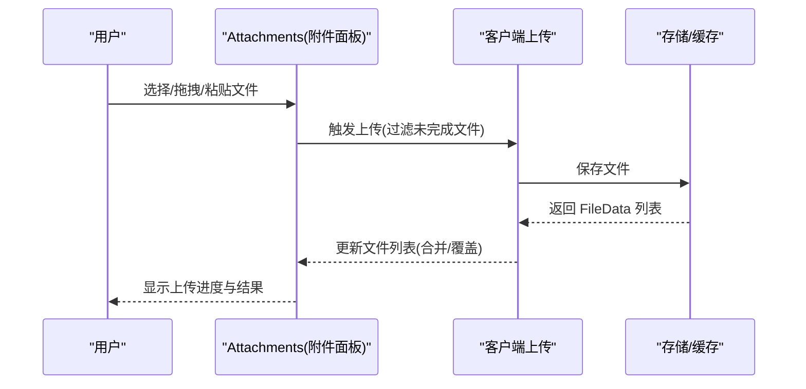
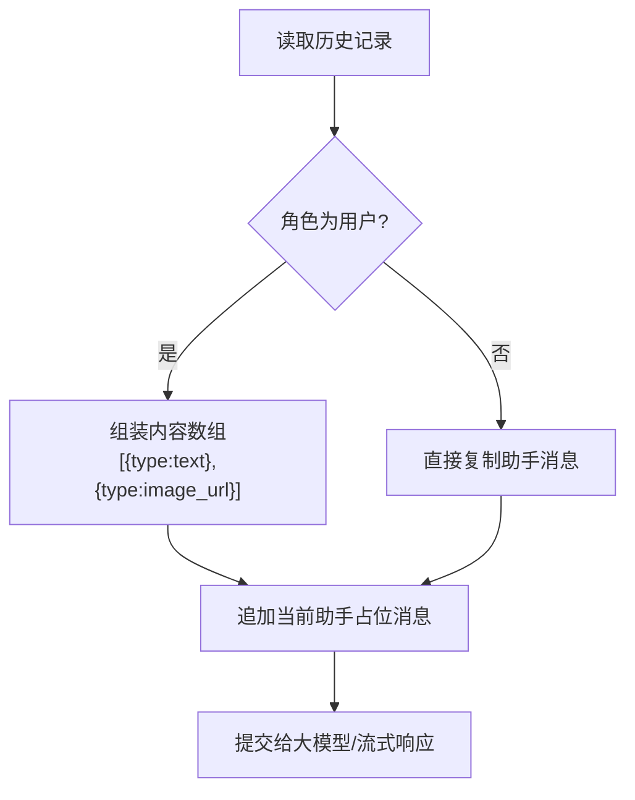
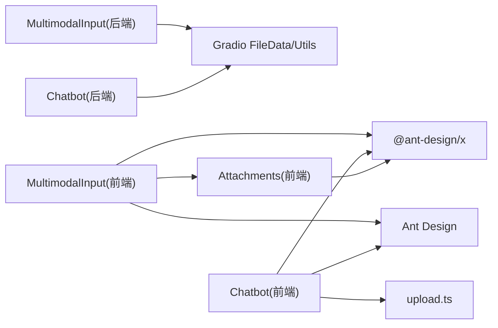

# 多模态支持

<cite>
**本文引用的文件**
- [backend/modelscope_studio/components/pro/chatbot/__init__.py](file://backend/modelscope_studio/components/pro/chatbot/__init__.py)
- [backend/modelscope_studio/components/pro/multimodal_input/__init__.py](file://backend/modelscope_studio/components/pro/multimodal_input/__init__.py)
- [frontend/pro/chatbot/index.svelte](file://frontend/pro/chatbot/index.svelte)
- [frontend/pro/multimodal-input/index.svelte](file://frontend/pro/multimodal-input/index.svelte)
- [frontend/pro/chatbot/type.ts](file://frontend/pro/chatbot/type.ts)
- [frontend/pro/chatbot/messages/file.tsx](file://frontend/pro/chatbot/messages/file.tsx)
- [frontend/antdx/attachments/attachments.tsx](file://frontend/antdx/attachments/attachments.tsx)
- [frontend/utils/upload.ts](file://frontend/utils/upload.ts)
- [docs/layout_templates/chatbot/demos/basic.py](file://docs/layout_templates/chatbot/demos/basic.py)
- [docs/layout_templates/chatbot/demos/fine_grained_control.py](file://docs/layout_templates/chatbot/demos/fine_grained_control.py)
- [docs/components/pro/chatbot/demos/multimodal.py](file://docs/components/pro/chatbot/demos/multimodal.py)
</cite>

## 目录

1. [简介](#简介)
2. [项目结构](#项目结构)
3. [核心组件](#核心组件)
4. [架构总览](#架构总览)
5. [详细组件分析](#详细组件分析)
6. [依赖分析](#依赖分析)
7. [性能考虑](#性能考虑)
8. [故障排查指南](#故障排查指南)
9. [结论](#结论)
10. [附录](#附录)

## 简介

本章节面向 Chatbot 聊天机器人组件的多模态支持能力，系统性说明其对图片、视频、音频、文件等多媒体内容的处理机制，涵盖消息结构定义、前后端数据流、上传/下载/预览流程、安全与性能优化策略。读者可据此在 Gradio/ModelScope 生态中构建具备多模态输入输出能力的对话应用。

## 项目结构

多模态支持由“后端组件 + 前端渲染 + 工具函数”三部分协同完成：

- 后端组件负责消息数据模型、预处理/后处理逻辑、静态资源服务与事件绑定
- 前端组件负责聊天气泡渲染、附件面板、文件卡片展示与交互
- 工具函数负责文件 URL 解析与可拉取地址生成

**图表来源**

- [backend/modelscope_studio/components/pro/chatbot/**init**.py:286-495](file://backend/modelscope_studio/components/pro/chatbot/__init__.py#L286-L495)
- [backend/modelscope_studio/components/pro/multimodal_input/**init**.py:82-259](file://backend/modelscope_studio/components/pro/multimodal_input/__init__.py#L82-L259)
- [frontend/pro/chatbot/index.svelte:1-90](file://frontend/pro/chatbot/index.svelte#L1-L90)
- [frontend/pro/multimodal-input/index.svelte:1-99](file://frontend/pro/multimodal-input/index.svelte#L1-L99)
- [frontend/pro/chatbot/type.ts:1-197](file://frontend/pro/chatbot/type.ts#L1-L197)
- [frontend/pro/chatbot/messages/file.tsx:1-119](file://frontend/pro/chatbot/messages/file.tsx#L1-L119)
- [frontend/antdx/attachments/attachments.tsx:1-413](file://frontend/antdx/attachments/attachments.tsx#L1-L413)
- [frontend/utils/upload.ts:1-45](file://frontend/utils/upload.ts#L1-L45)
- [docs/layout_templates/chatbot/demos/basic.py:145-181](file://docs/layout_templates/chatbot/demos/basic.py#L145-L181)
- [docs/layout_templates/chatbot/demos/fine_grained_control.py:100-133](file://docs/layout_templates/chatbot/demos/fine_grained_control.py#L100-L133)
- [docs/components/pro/chatbot/demos/multimodal.py:82-118](file://docs/components/pro/chatbot/demos/multimodal.py#L82-L118)

**章节来源**

- [backend/modelscope_studio/components/pro/chatbot/**init**.py:286-495](file://backend/modelscope_studio/components/pro/chatbot/__init__.py#L286-L495)
- [backend/modelscope_studio/components/pro/multimodal_input/**init**.py:82-259](file://backend/modelscope_studio/components/pro/multimodal_input/__init__.py#L82-L259)
- [frontend/pro/chatbot/index.svelte:1-90](file://frontend/pro/chatbot/index.svelte#L1-L90)
- [frontend/pro/multimodal-input/index.svelte:1-99](file://frontend/pro/multimodal-input/index.svelte#L1-L99)
- [frontend/pro/chatbot/type.ts:1-197](file://frontend/pro/chatbot/type.ts#L1-L197)
- [frontend/pro/chatbot/messages/file.tsx:1-119](file://frontend/pro/chatbot/messages/file.tsx#L1-L119)
- [frontend/antdx/attachments/attachments.tsx:1-413](file://frontend/antdx/attachments/attachments.tsx#L1-L413)
- [frontend/utils/upload.ts:1-45](file://frontend/utils/upload.ts#L1-L45)
- [docs/layout_templates/chatbot/demos/basic.py:145-181](file://docs/layout_templates/chatbot/demos/basic.py#L145-L181)
- [docs/layout_templates/chatbot/demos/fine_grained_control.py:100-133](file://docs/layout_templates/chatbot/demos/fine_grained_control.py#L100-L133)
- [docs/components/pro/chatbot/demos/multimodal.py:82-118](file://docs/components/pro/chatbot/demos/multimodal.py#L82-L118)

## 核心组件

- Chatbot 组件（后端）：定义消息结构、支持文本/工具/文件/建议四种内容类型；提供预处理与后处理钩子，统一处理文件路径/URL、MIME 类型与静态资源服务。
- MultimodalInput 组件（后端）：封装多模态输入，支持文本与文件列表；提供上传前/后处理、缓存下载、HTTP 链接解析与本地文件映射。
- 前端渲染（chatbot）：根据消息类型渲染文本、工具、文件或建议；文件消息通过文件卡片组件展示图片/视频/音频，并提供预览与下载链接。
- 附件面板（attachments）：提供拖拽/粘贴/选择上传、最大数量限制、占位符、图标渲染、预览配置等能力。
- 工具函数（upload）：将相对路径转换为可拉取 URL，兼容 http/https 协议与后端 API 前缀。

**章节来源**

- [backend/modelscope_studio/components/pro/chatbot/**init**.py:229-284](file://backend/modelscope_studio/components/pro/chatbot/__init__.py#L229-L284)
- [backend/modelscope_studio/components/pro/multimodal_input/**init**.py:76-137](file://backend/modelscope_studio/components/pro/multimodal_input/__init__.py#L76-L137)
- [frontend/pro/chatbot/type.ts:43-135](file://frontend/pro/chatbot/type.ts#L43-L135)
- [frontend/pro/chatbot/messages/file.tsx:1-119](file://frontend/pro/chatbot/messages/file.tsx#L1-L119)
- [frontend/antdx/attachments/attachments.tsx:1-413](file://frontend/antdx/attachments/attachments.tsx#L1-L413)
- [frontend/utils/upload.ts:12-44](file://frontend/utils/upload.ts#L12-L44)

## 架构总览

下图展示了从用户输入到消息渲染的全链路：前端 MultimodalInput 将文本与文件上传至后端，后端组件进行预处理/后处理，最终以统一的消息结构传递给前端 Chatbot 渲染器。

**图表来源**

- [frontend/pro/multimodal-input/index.svelte:68-75](file://frontend/pro/multimodal-input/index.svelte#L68-L75)
- [backend/modelscope_studio/components/pro/multimodal_input/**init**.py:213-248](file://backend/modelscope_studio/components/pro/multimodal_input/__init__.py#L213-L248)
- [backend/modelscope_studio/components/pro/chatbot/**init**.py:418-488](file://backend/modelscope_studio/components/pro/chatbot/__init__.py#L418-L488)
- [frontend/pro/chatbot/index.svelte:67-89](file://frontend/pro/chatbot/index.svelte#L67-L89)

## 详细组件分析

### 消息结构与内容类型

- 支持的内容类型：text、tool、file、suggestion
- 文件内容支持字符串路径、FileData 对象、附件对象与扩展属性（如 type）
- 文本内容支持 Markdown 渲染、LaTeX 定界符、HTML 清洗与标签白名单
- 工具内容支持标题与状态（pending/done）
- 建议内容采用提示组配置，支持垂直/换行布局与样式

**图表来源**

- [backend/modelscope_studio/components/pro/chatbot/**init**.py:229-284](file://backend/modelscope_studio/components/pro/chatbot/__init__.py#L229-L284)
- [frontend/pro/chatbot/type.ts:54-135](file://frontend/pro/chatbot/type.ts#L54-L135)

**章节来源**

- [backend/modelscope_studio/components/pro/chatbot/**init**.py:229-284](file://backend/modelscope_studio/components/pro/chatbot/__init__.py#L229-L284)
- [frontend/pro/chatbot/type.ts:43-135](file://frontend/pro/chatbot/type.ts#L43-L135)

### 文件消息渲染与预览

- 文件消息通过文件卡片组件展示，支持图片缩略图、视频/音频播放器、文件大小与名称
- 预览按钮使用可拉取 URL 打开新窗口，确保跨域安全
- 图片/视频/音频的尺寸与样式可通过 options 注入

**图表来源**

- [frontend/pro/chatbot/messages/file.tsx:18-118](file://frontend/pro/chatbot/messages/file.tsx#L18-L118)
- [frontend/utils/upload.ts:12-44](file://frontend/utils/upload.ts#L12-L44)

**章节来源**

- [frontend/pro/chatbot/messages/file.tsx:1-119](file://frontend/pro/chatbot/messages/file.tsx#L1-L119)
- [frontend/utils/upload.ts:1-45](file://frontend/utils/upload.ts#L1-L45)

### 附件面板与上传流程

- 支持拖拽、粘贴、选择上传，可配置最大数量、占位符、图标与预览行为
- 上传时自动去重、临时状态与合并策略，支持单文件覆盖与多文件追加
- 提供下载、预览、移除事件回调，便于集成业务逻辑

**图表来源**

- [frontend/antdx/attachments/attachments.tsx:275-354](file://frontend/antdx/attachments/attachments.tsx#L275-L354)
- [frontend/pro/multimodal-input/multimodal-input.tsx:181-246](file://frontend/pro/multimodal-input/multimodal-input.tsx#L181-L246)

**章节来源**

- [frontend/antdx/attachments/attachments.tsx:1-413](file://frontend/antdx/attachments/attachments.tsx#L1-L413)
- [frontend/pro/multimodal-input/multimodal-input.tsx:1-619](file://frontend/pro/multimodal-input/multimodal-input.tsx#L1-L619)

### 历史消息格式化与多模态提交

- 历史消息需按角色与内容类型组织，用户消息可包含文本与文件数组
- 文件项可为路径或 FileData，后端会统一转换为可拉取 URL 或本地路径
- 示例演示了将图片转为 base64 的场景以及将文件与文本组合为多模态消息

**图表来源**

- [docs/layout_templates/chatbot/demos/basic.py:145-181](file://docs/layout_templates/chatbot/demos/basic.py#L145-L181)
- [docs/layout_templates/chatbot/demos/fine_grained_control.py:100-133](file://docs/layout_templates/chatbot/demos/fine_grained_control.py#L100-L133)
- [docs/components/pro/chatbot/demos/multimodal.py:82-118](file://docs/components/pro/chatbot/demos/multimodal.py#L82-L118)

**章节来源**

- [docs/layout_templates/chatbot/demos/basic.py:145-181](file://docs/layout_templates/chatbot/demos/basic.py#L145-L181)
- [docs/layout_templates/chatbot/demos/fine_grained_control.py:100-133](file://docs/layout_templates/chatbot/demos/fine_grained_control.py#L100-L133)
- [docs/components/pro/chatbot/demos/multimodal.py:82-118](file://docs/components/pro/chatbot/demos/multimodal.py#L82-L118)

### 前后端数据流与事件绑定

- Chatbot 组件暴露 change/copy/edit/delete/like/retry/suggestion_select/welcome_prompt_select 等事件监听
- MultimodalInput 组件暴露 change/submit/cancel/keyDown/keyPress/focus/blur/upload/paste/paste_file/drop/download/preview/remove 等事件
- 前端容器将 Gradio 共享上下文（rootUrl、apiPrefix）传递给渲染组件，用于文件 URL 解析与下载

**章节来源**

- [backend/modelscope_studio/components/pro/chatbot/**init**.py:286-314](file://backend/modelscope_studio/components/pro/chatbot/__init__.py#L286-L314)
- [backend/modelscope_studio/components/pro/multimodal_input/**init**.py:82-135](file://backend/modelscope_studio/components/pro/multimodal_input/__init__.py#L82-L135)
- [frontend/pro/chatbot/index.svelte:76-84](file://frontend/pro/chatbot/index.svelte#L76-L84)
- [frontend/pro/multimodal-input/index.svelte:80-93](file://frontend/pro/multimodal-input/index.svelte#L80-L93)

## 依赖分析

- 后端 Chatbot 组件依赖 Gradio 数据类与事件系统，负责消息结构化与静态资源服务
- 后端 MultimodalInput 组件依赖 Gradio FileData 与缓存下载工具，负责文件上传与本地映射
- 前端 Chatbot 渲染器依赖 Ant Design X 与 Ant Design 组件生态，负责消息渲染与交互
- 附件面板与文件卡片组件复用 Ant Design X 的 Attachments 与 FileCard，提供一致的上传体验
- 工具函数统一处理文件 URL 生成，保证跨域与可拉取性

**图表来源**

- [backend/modelscope_studio/components/pro/multimodal_input/**init**.py:1-259](file://backend/modelscope_studio/components/pro/multimodal_input/__init__.py#L1-L259)
- [backend/modelscope_studio/components/pro/chatbot/**init**.py:1-495](file://backend/modelscope_studio/components/pro/chatbot/__init__.py#L1-L495)
- [frontend/pro/multimodal-input/multimodal-input.tsx:1-619](file://frontend/pro/multimodal-input/multimodal-input.tsx#L1-L619)
- [frontend/antdx/attachments/attachments.tsx:1-413](file://frontend/antdx/attachments/attachments.tsx#L1-L413)
- [frontend/pro/chatbot/messages/file.tsx:1-119](file://frontend/pro/chatbot/messages/file.tsx#L1-L119)
- [frontend/utils/upload.ts:1-45](file://frontend/utils/upload.ts#L1-L45)

**章节来源**

- [backend/modelscope_studio/components/pro/multimodal_input/**init**.py:1-259](file://backend/modelscope_studio/components/pro/multimodal_input/__init__.py#L1-L259)
- [backend/modelscope_studio/components/pro/chatbot/**init**.py:1-495](file://backend/modelscope_studio/components/pro/chatbot/__init__.py#L1-L495)
- [frontend/pro/multimodal-input/multimodal-input.tsx:1-619](file://frontend/pro/multimodal-input/multimodal-input.tsx#L1-L619)
- [frontend/antdx/attachments/attachments.tsx:1-413](file://frontend/antdx/attachments/attachments.tsx#L1-L413)
- [frontend/pro/chatbot/messages/file.tsx:1-119](file://frontend/pro/chatbot/messages/file.tsx#L1-L119)
- [frontend/utils/upload.ts:1-45](file://frontend/utils/upload.ts#L1-L45)

## 性能考虑

- 文件上传
  - 使用 Gradio 缓存目录与下载工具，避免重复网络请求
  - 限制最大文件数量，启用单文件覆盖模式减少内存占用
- 渲染优化
  - 文件卡片设置固定尺寸与圆角，避免布局抖动
  - 图片缩略图与媒体控件按需加载，减少首屏压力
- 流式响应
  - 在后端将助手消息标记为 loading/pending，前端仅渲染已完成部分，提升感知速度
- 资源服务
  - 通过统一的可拉取 URL 生成策略，减少跨域与权限问题

[本节为通用指导，无需特定文件引用]

## 故障排查指南

- 文件无法预览
  - 检查文件是否为 http/https 链接或已通过后端 API 可拉取
  - 确认根路径与 API 前缀配置正确
  - 参考：[frontend/utils/upload.ts:12-44](file://frontend/utils/upload.ts#L12-L44)
- 上传失败或卡住
  - 查看上传禁用状态（disabled/loading/readOnly/uploading）
  - 检查最大数量限制与 beforeUpload 回调返回值
  - 参考：[frontend/antdx/attachments/attachments.tsx:168-354](file://frontend/antdx/attachments/attachments.tsx#L168-L354)
- 历史消息格式错误
  - 用户消息需包含 type 与 content 数组，文件项应为路径或 FileData
  - 参考：[docs/layout_templates/chatbot/demos/basic.py:145-181](file://docs/layout_templates/chatbot/demos/basic.py#L145-L181)
- 事件未触发
  - 确认前端容器已绑定对应事件（如 suggestionSelect、welcomePromptSelect）
  - 参考：[frontend/pro/chatbot/index.svelte:58-61](file://frontend/pro/chatbot/index.svelte#L58-L61)

**章节来源**

- [frontend/utils/upload.ts:12-44](file://frontend/utils/upload.ts#L12-L44)
- [frontend/antdx/attachments/attachments.tsx:168-354](file://frontend/antdx/attachments/attachments.tsx#L168-L354)
- [docs/layout_templates/chatbot/demos/basic.py:145-181](file://docs/layout_templates/chatbot/demos/basic.py#L145-L181)
- [frontend/pro/chatbot/index.svelte:58-61](file://frontend/pro/chatbot/index.svelte#L58-L61)

## 结论

该多模态支持方案以标准化的消息结构为核心，结合后端组件的数据处理与前端组件的渲染能力，实现了图片、视频、音频与文件的统一输入、上传、存储与展示。通过可配置的附件面板与文件卡片，开发者可在不牺牲用户体验的前提下，灵活扩展与定制多模态聊天机器人的表现形式。

[本节为总结性内容，无需特定文件引用]

## 附录

- 多模态消息发送示例
  - 将文本与文件数组组合为用户消息，提交后端并等待流式响应
  - 参考：[docs/components/pro/chatbot/demos/multimodal.py:82-118](file://docs/components/pro/chatbot/demos/multimodal.py#L82-L118)
- 历史消息格式化
  - 用户消息包含文本与图片数组，图片可转为 base64 或保持路径
  - 参考：[docs/layout_templates/chatbot/demos/basic.py:145-181](file://docs/layout_templates/chatbot/demos/basic.py#L145-L181)
- 细粒度控制
  - 自定义文件项字段（如 text/files），按需拼装消息
  - 参考：[docs/layout_templates/chatbot/demos/fine_grained_control.py:100-133](file://docs/layout_templates/chatbot/demos/fine_grained_control.py#L100-L133)

**章节来源**

- [docs/components/pro/chatbot/demos/multimodal.py:82-118](file://docs/components/pro/chatbot/demos/multimodal.py#L82-L118)
- [docs/layout_templates/chatbot/demos/basic.py:145-181](file://docs/layout_templates/chatbot/demos/basic.py#L145-L181)
- [docs/layout_templates/chatbot/demos/fine_grained_control.py:100-133](file://docs/layout_templates/chatbot/demos/fine_grained_control.py#L100-L133)
