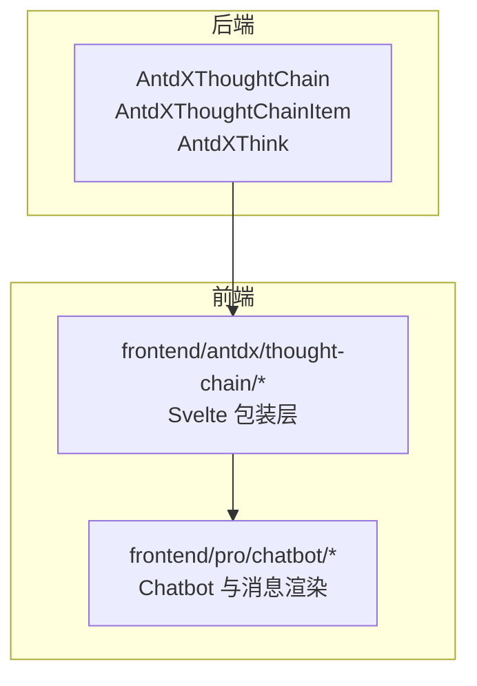
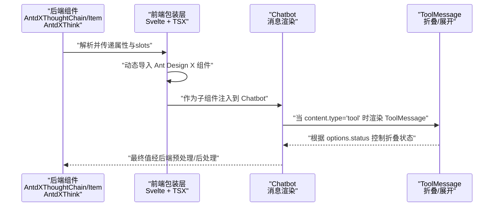
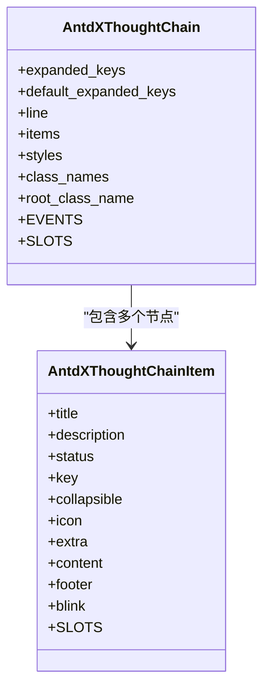
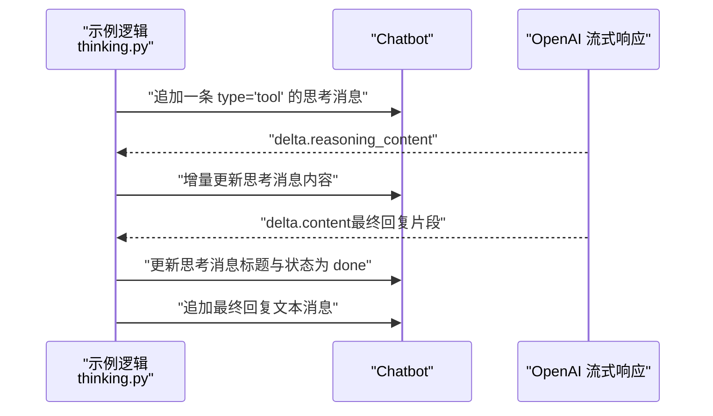
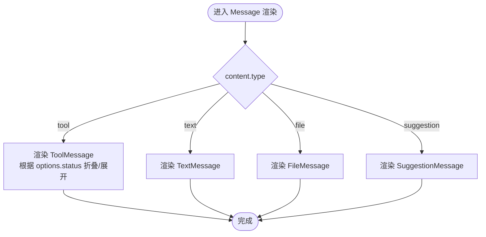
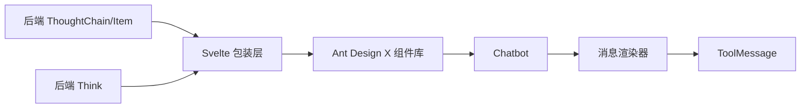

# 思考过程展示

<cite>
**本文引用的文件**
- [backend/modelscope_studio/components/antdx/thought_chain/__init__.py](file://backend/modelscope_studio/components/antdx/thought_chain/__init__.py)
- [backend/modelscope_studio/components/antdx/thought_chain/thought_chain_item/__init__.py](file://backend/modelscope_studio/components/antdx/thought_chain/thought_chain_item/__init__.py)
- [backend/modelscope_studio/components/antdx/think/__init__.py](file://backend/modelscope_studio/components/antdx/think/__init__.py)
- [backend/modelscope_studio/components/pro/chatbot/__init__.py](file://backend/modelscope_studio/components/pro/chatbot/__init__.py)
- [frontend/antdx/thought-chain/Index.svelte](file://frontend/antdx/thought-chain/Index.svelte)
- [frontend/antdx/thought-chain/thought-chain.tsx](file://frontend/antdx/thought-chain/thought-chain.tsx)
- [frontend/antdx/thought-chain/thought-chain-item/Index.svelte](file://frontend/antdx/thought-chain/thought-chain-item/Index.svelte)
- [frontend/pro/chatbot/chatbot.tsx](file://frontend/pro/chatbot/chatbot.tsx)
- [frontend/pro/chatbot/message.tsx](file://frontend/pro/chatbot/message.tsx)
- [frontend/pro/chatbot/messages/tool.tsx](file://frontend/pro/chatbot/messages/tool.tsx)
- [frontend/pro/chatbot/type.ts](file://frontend/pro/chatbot/type.ts)
- [docs/components/antdx/thought_chain/README-zh_CN.md](file://docs/components/antdx/thought_chain/README-zh_CN.md)
- [docs/components/antdx/thought_chain/demos/basic.py](file://docs/components/antdx/thought_chain/demos/basic.py)
- [docs/components/pro/chatbot/demos/thinking.py](file://docs/components/pro/chatbot/demos/thinking.py)
</cite>

## 目录

1. [简介](#简介)
2. [项目结构](#项目结构)
3. [核心组件](#核心组件)
4. [架构总览](#架构总览)
5. [组件详解](#组件详解)
6. [依赖关系分析](#依赖关系分析)
7. [性能考量](#性能考量)
8. [故障排查指南](#故障排查指南)
9. [结论](#结论)
10. [附录](#附录)

## 简介

本文件围绕 Chatbot 聊天机器人组件中的“思考过程展示”能力进行系统化说明，目标是帮助开发者正确配置与呈现 AI 的思考过程，包括中间推理结果、工具调用链路、状态切换与最终回复的时机控制。文档涵盖以下关键点：

- 如何在 Chatbot 中插入“思考”消息（tool 类型），并以 ThoughtChain/Think 组件进行可视化展示
- 思考链（Thought Chain）的配置项、状态管理与嵌套使用
- 思考过程与最终回复的时序控制与交互设计
- 可视化展示方案与调试优化建议

## 项目结构

该功能涉及后端 Python 组件与前端 Svelte/React 层的协同：

- 后端：提供 ThoughtChain、ThoughtChainItem、Think 等组件类，负责属性透传与前端资源定位
- 前端：Svelte 包装层将 Ant Design X 的 ThoughtChain/Item 渲染为可消费的组件；Chatbot 消息渲染器根据内容类型选择 ToolMessage 或其他消息类型

**图表来源**

- [backend/modelscope_studio/components/antdx/thought_chain/**init**.py:12-86](file://backend/modelscope_studio/components/antdx/thought_chain/__init__.py#L12-L86)
- [backend/modelscope_studio/components/antdx/thought_chain/thought_chain_item/**init**.py:51-80](file://backend/modelscope_studio/components/antdx/thought_chain/thought_chain_item/__init__.py#L51-L80)
- [backend/modelscope_studio/components/antdx/think/**init**.py:8-79](file://backend/modelscope_studio/components/antdx/think/__init__.py#L8-L79)
- [frontend/antdx/thought-chain/Index.svelte:1-62](file://frontend/antdx/thought-chain/Index.svelte#L1-L62)
- [frontend/antdx/thought-chain/thought-chain.tsx:1-43](file://frontend/antdx/thought-chain/thought-chain.tsx#L1-L43)
- [frontend/pro/chatbot/chatbot.tsx:1-475](file://frontend/pro/chatbot/chatbot.tsx#L1-L475)
- [frontend/pro/chatbot/message.tsx:1-133](file://frontend/pro/chatbot/message.tsx#L1-L133)

**章节来源**

- [backend/modelscope_studio/components/antdx/thought_chain/**init**.py:12-86](file://backend/modelscope_studio/components/antdx/thought_chain/__init__.py#L12-L86)
- [frontend/antdx/thought-chain/Index.svelte:1-62](file://frontend/antdx/thought-chain/Index.svelte#L1-L62)
- [frontend/pro/chatbot/chatbot.tsx:1-475](file://frontend/pro/chatbot/chatbot.tsx#L1-L475)

## 核心组件

- ThoughtChain（后端类）：用于承载多个 ThoughtChainItem，支持展开/折叠、线条样式、根类名等配置
- ThoughtChainItem（后端类）：单个思考节点，支持标题、描述、状态、可折叠、额外操作区、内容区、页脚区
- Think（后端类）：用于在 Chatbot 中以“思考”形式展示中间推理或工具调用的 UI 片段
- Chatbot（后端类）：消息容器，支持多种内容类型（text/tool/file/suggestion），并定义消息数据模型与预处理/后处理逻辑
- 前端包装层：Svelte 将 Ant Design X 的 ThoughtChain/Item 组件桥接为可消费的组件，同时传递 slots 与 props
- ToolMessage：渲染 tool 类型消息，支持折叠/展开与 Markdown 渲染

**章节来源**

- [backend/modelscope_studio/components/antdx/thought_chain/**init**.py:12-86](file://backend/modelscope_studio/components/antdx/thought_chain/__init__.py#L12-L86)
- [backend/modelscope_studio/components/antdx/thought_chain/thought_chain_item/**init**.py:51-80](file://backend/modelscope_studio/components/antdx/thought_chain/thought_chain_item/__init__.py#L51-L80)
- [backend/modelscope_studio/components/antdx/think/**init**.py:8-79](file://backend/modelscope_studio/components/antdx/think/__init__.py#L8-L79)
- [backend/modelscope_studio/components/pro/chatbot/**init**.py:286-495](file://backend/modelscope_studio/components/pro/chatbot/__init__.py#L286-L495)
- [frontend/antdx/thought-chain/thought-chain.tsx:1-43](file://frontend/antdx/thought-chain/thought-chain.tsx#L1-L43)
- [frontend/pro/chatbot/messages/tool.tsx:1-46](file://frontend/pro/chatbot/messages/tool.tsx#L1-L46)

## 架构总览

下图展示了从后端组件到前端渲染的整体流程，以及 Chatbot 中“思考”消息的插入与展示路径。

**图表来源**

- [frontend/antdx/thought-chain/Index.svelte:1-62](file://frontend/antdx/thought-chain/Index.svelte#L1-L62)
- [frontend/antdx/thought-chain/thought-chain.tsx:1-43](file://frontend/antdx/thought-chain/thought-chain.tsx#L1-L43)
- [frontend/pro/chatbot/chatbot.tsx:1-475](file://frontend/pro/chatbot/chatbot.tsx#L1-L475)
- [frontend/pro/chatbot/message.tsx:1-133](file://frontend/pro/chatbot/message.tsx#L1-L133)
- [frontend/pro/chatbot/messages/tool.tsx:1-46](file://frontend/pro/chatbot/messages/tool.tsx#L1-L46)

## 组件详解

### ThoughtChain 与 ThoughtChainItem 配置与使用

- ThoughtChain 支持：
  - expanded_keys/default_expanded_keys：控制初始展开项
  - line：连接线样式（实线/虚线/点线）
  - items：显式传入节点列表
  - 根级样式/类名：styles/class_names/root_class_name
  - 事件：expand（展开键变更回调）
- ThoughtChainItem 支持：
  - title/description/status/prefixCls/icon/key/collapsible
  - 插槽：extra/content/footer
  - 通过 slots 注入复杂内容（如按钮、图标、段落等）

**图表来源**

- [backend/modelscope_studio/components/antdx/thought_chain/**init**.py:30-67](file://backend/modelscope_studio/components/antdx/thought_chain/__init__.py#L30-L67)
- [backend/modelscope_studio/components/antdx/thought_chain/thought_chain_item/**init**.py:51-60](file://backend/modelscope_studio/components/antdx/thought_chain/thought_chain_item/__init__.py#L51-L60)

**章节来源**

- [backend/modelscope_studio/components/antdx/thought_chain/**init**.py:12-86](file://backend/modelscope_studio/components/antdx/thought_chain/__init__.py#L12-L86)
- [backend/modelscope_studio/components/antdx/thought_chain/thought_chain_item/**init**.py:51-80](file://backend/modelscope_studio/components/antdx/thought_chain/thought_chain_item/__init__.py#L51-L80)
- [docs/components/antdx/thought_chain/README-zh_CN.md:1-10](file://docs/components/antdx/thought_chain/README-zh_CN.md#L1-L10)
- [docs/components/antdx/thought_chain/demos/basic.py:1-77](file://docs/components/antdx/thought_chain/demos/basic.py#L1-L77)

### Think 组件在 Chatbot 中的应用

- Think 提供“思考”片段的 UI 片段，支持 loading、默认展开、闪烁等特性
- 在 Chatbot 中，可通过向消息内容数组追加 type 为 tool 的条目来展示“思考”过程
- 示例演示了在流式响应中，先插入一条“Thinking...”的 tool 消息，随后实时更新其内容；当首次出现最终回复片段时，将“思考”标题更新为“End of Thought (耗时)”并标记为完成态

**图表来源**

- [docs/components/pro/chatbot/demos/thinking.py:82-118](file://docs/components/pro/chatbot/demos/thinking.py#L82-L118)
- [frontend/pro/chatbot/messages/tool.tsx:13-18](file://frontend/pro/chatbot/messages/tool.tsx#L13-L18)

**章节来源**

- [backend/modelscope_studio/components/antdx/think/**init**.py:8-79](file://backend/modelscope_studio/components/antdx/think/__init__.py#L8-L79)
- [docs/components/pro/chatbot/demos/thinking.py:82-118](file://docs/components/pro/chatbot/demos/thinking.py#L82-L118)
- [frontend/pro/chatbot/messages/tool.tsx:13-18](file://frontend/pro/chatbot/messages/tool.tsx#L13-L18)

### Chatbot 消息类型与 ToolMessage 渲染

- Chatbot 支持的消息类型：text、tool、file、suggestion
- tool 类型消息由 ToolMessage 渲染，支持：
  - options.title：标题（Markdown 渲染取决于 renderMarkdown）
  - options.status：'pending'/'done' 决定是否折叠
  - 内容区域支持 Markdown 渲染或纯文本
- Chatbot 的消息渲染器根据 content.type 分发到对应组件

**图表来源**

- [frontend/pro/chatbot/message.tsx:39-133](file://frontend/pro/chatbot/message.tsx#L39-L133)
- [frontend/pro/chatbot/messages/tool.tsx:13-45](file://frontend/pro/chatbot/messages/tool.tsx#L13-L45)
- [frontend/pro/chatbot/type.ts:121-135](file://frontend/pro/chatbot/type.ts#L121-L135)

**章节来源**

- [backend/modelscope_studio/components/pro/chatbot/**init**.py:286-495](file://backend/modelscope_studio/components/pro/chatbot/__init__.py#L286-L495)
- [frontend/pro/chatbot/message.tsx:39-133](file://frontend/pro/chatbot/message.tsx#L39-L133)
- [frontend/pro/chatbot/messages/tool.tsx:13-45](file://frontend/pro/chatbot/messages/tool.tsx#L13-L45)
- [frontend/pro/chatbot/type.ts:54-66](file://frontend/pro/chatbot/type.ts#L54-L66)

### 思考链（Thought Chain）的配置与使用

- 在 Chatbot 中，若需要以“思考链”的方式分步展示推理与工具调用，可使用 ThoughtChain/Item 组件
- 通过后端组件类的 slots 机制，将多个 ThoughtChainItem 组合为一个链路
- 支持在每个节点中放置 extra/content/footer 插槽，实现更丰富的交互与信息密度

**章节来源**

- [docs/components/antdx/thought_chain/README-zh_CN.md:1-10](file://docs/components/antdx/thought_chain/README-zh_CN.md#L1-L10)
- [docs/components/antdx/thought_chain/demos/basic.py:24-77](file://docs/components/antdx/thought_chain/demos/basic.py#L24-L77)
- [frontend/antdx/thought-chain/Index.svelte:1-62](file://frontend/antdx/thought-chain/Index.svelte#L1-L62)
- [frontend/antdx/thought-chain/thought-chain.tsx:1-43](file://frontend/antdx/thought-chain/thought-chain.tsx#L1-L43)

## 依赖关系分析

- 后端组件类仅负责属性透传与前端目录解析，不直接参与业务逻辑
- 前端 Svelte 包装层负责将 Ant Design X 的 ThoughtChain/Item 组件桥接为可消费的组件，并处理 slots 与 props
- Chatbot 通过消息类型分发到具体的消息组件（TextMessage/ToolMessage/FileMessage/SuggestionMessage）

**图表来源**

- [backend/modelscope_studio/components/antdx/thought_chain/**init**.py:68-86](file://backend/modelscope_studio/components/antdx/thought_chain/__init__.py#L68-L86)
- [backend/modelscope_studio/components/antdx/thought_chain/thought_chain_item/**init**.py:61-80](file://backend/modelscope_studio/components/antdx/thought_chain/thought_chain_item/__init__.py#L61-L80)
- [backend/modelscope_studio/components/antdx/think/**init**.py:61-79](file://backend/modelscope_studio/components/antdx/think/__init__.py#L61-L79)
- [frontend/antdx/thought-chain/Index.svelte:10-62](file://frontend/antdx/thought-chain/Index.svelte#L10-L62)
- [frontend/antdx/thought-chain/thought-chain.tsx:11-40](file://frontend/antdx/thought-chain/thought-chain.tsx#L11-L40)
- [frontend/pro/chatbot/chatbot.tsx:450-472](file://frontend/pro/chatbot/chatbot.tsx#L450-L472)

**章节来源**

- [frontend/antdx/thought-chain/Index.svelte:1-62](file://frontend/antdx/thought-chain/Index.svelte#L1-L62)
- [frontend/antdx/thought-chain/thought-chain.tsx:1-43](file://frontend/antdx/thought-chain/thought-chain.tsx#L1-L43)
- [frontend/pro/chatbot/chatbot.tsx:1-475](file://frontend/pro/chatbot/chatbot.tsx#L1-L475)

## 性能考量

- 流式更新策略：在 Chatbot 中采用增量更新的方式，避免频繁重绘整个消息列表
- ToolMessage 折叠控制：通过 options.status 初始决定折叠状态，减少不必要的渲染
- 合理使用 slots：在 ThoughtChain/Item 中仅注入必要内容，避免过深的嵌套层级
- 后端预处理/后处理：对文件路径与头像等静态资源进行预处理，降低前端渲染成本

[本节为通用指导，无需特定文件引用]

## 故障排查指南

- 思考消息未显示
  - 检查消息类型是否为 tool，且 content 中包含有效内容
  - 确认 options.status 是否被设置为 done 导致自动折叠
- 思考标题未更新
  - 确认在首次收到 delta.content 时，已更新思考消息的 options.title 与 options.status
- ThoughtChain/Item 不生效
  - 确认后端组件类的 slots 正确传递，且前端包装层已正确解析 slots
- 性能问题
  - 减少每轮更新的数据量，合并多次增量更新
  - 对长内容启用 Markdown 渲染时注意文本大小

**章节来源**

- [docs/components/pro/chatbot/demos/thinking.py:82-118](file://docs/components/pro/chatbot/demos/thinking.py#L82-L118)
- [frontend/pro/chatbot/messages/tool.tsx:13-18](file://frontend/pro/chatbot/messages/tool.tsx#L13-L18)

## 结论

通过 ThoughtChain/Item 与 Think 组件，结合 Chatbot 的消息类型体系，可以清晰地展示 AI 的思考过程与工具调用链路。合理配置状态与插槽，配合流式更新策略，既能提升用户体验，也能保证良好的性能表现。在实际项目中，建议优先采用 tool 类型消息承载“思考”内容，并在最终回复到达时及时更新状态与标题，形成完整的“思考—执行—反馈”闭环。

[本节为总结性内容，无需特定文件引用]

## 附录

- 示例参考
  - ThoughtChain 基础示例：[docs/components/antdx/thought_chain/demos/basic.py:1-77](file://docs/components/antdx/thought_chain/demos/basic.py#L1-L77)
  - Chatbot 思考过程示例：[docs/components/pro/chatbot/demos/thinking.py:1-218](file://docs/components/pro/chatbot/demos/thinking.py#L1-L218)
- 组件文档
  - ThoughtChain 文档：[docs/components/antdx/thought_chain/README-zh_CN.md:1-10](file://docs/components/antdx/thought_chain/README-zh_CN.md#L1-L10)

[本节为补充材料，无需特定文件引用]
