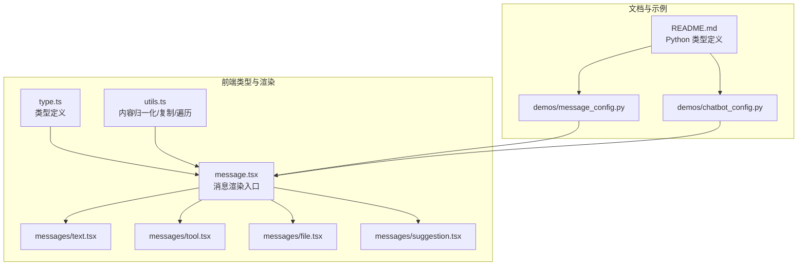
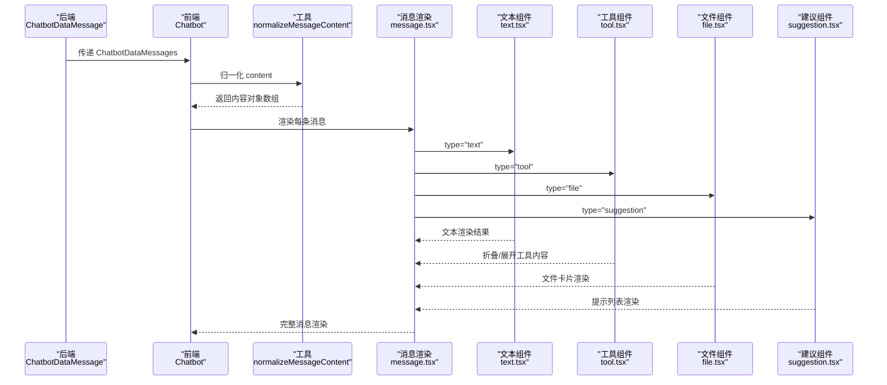
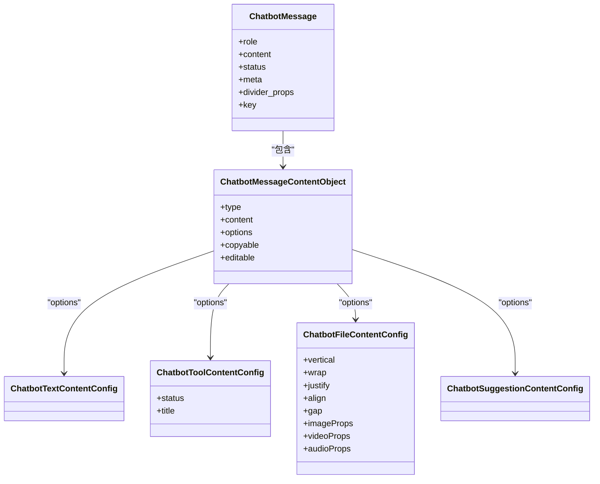
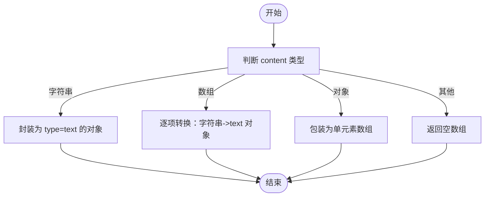
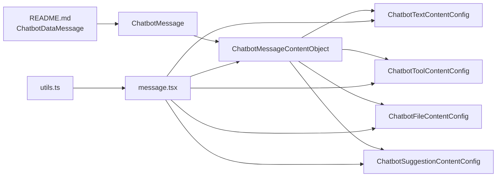

# 数据模型

<cite>
**本文引用的文件**   
- [frontend/pro/chatbot/type.ts](file://frontend/pro/chatbot/type.ts)
- [frontend/pro/chatbot/utils.ts](file://frontend/pro/chatbot/utils.ts)
- [frontend/pro/chatbot/message.tsx](file://frontend/pro/chatbot/message.tsx)
- [frontend/pro/chatbot/messages/text.tsx](file://frontend/pro/chatbot/messages/text.tsx)
- [frontend/pro/chatbot/messages/tool.tsx](file://frontend/pro/chatbot/messages/tool.tsx)
- [frontend/pro/chatbot/messages/file.tsx](file://frontend/pro/chatbot/messages/file.tsx)
- [frontend/pro/chatbot/messages/suggestion.tsx](file://frontend/pro/chatbot/messages/suggestion.tsx)
- [docs/components/pro/chatbot/README.md](file://docs/components/pro/chatbot/README.md)
- [docs/components/pro/chatbot/demos/message_config.py](file://docs/components/pro/chatbot/demos/message_config.py)
- [docs/components/pro/chatbot/demos/chatbot_config.py](file://docs/components/pro/chatbot/demos/chatbot_config.py)
</cite>

## 目录

1. [引言](#引言)
2. [项目结构](#项目结构)
3. [核心组件](#核心组件)
4. [架构总览](#架构总览)
5. [详细组件分析](#详细组件分析)
6. [依赖分析](#依赖分析)
7. [性能考虑](#性能考虑)
8. [故障排查指南](#故障排查指南)
9. [结论](#结论)
10. [附录](#附录)

## 引言

本章节面向 Chatbot 聊天机器人组件的数据模型，系统性梳理消息与内容的数据结构、字段定义、渲染行为、序列化与反序列化路径、以及验证与错误处理策略。重点覆盖以下核心类型：

- ChatbotMessage：单条消息
- ChatbotMessages：消息数组
- ChatbotMessageContentObject：消息内容对象
- 文本、工具、文件、建议四类内容的结构与配置
- 前端渲染管线与后端 Python 模型之间的映射关系

## 项目结构

围绕数据模型的相关代码主要分布在前端 Pro Chatbot 组件与文档示例中：

- 类型定义与配置：frontend/pro/chatbot/type.ts
- 消息内容归一化与复制逻辑：frontend/pro/chatbot/utils.ts
- 单条消息渲染入口：frontend/pro/chatbot/message.tsx
- 内容子组件：text.tsx、tool.tsx、file.tsx、suggestion.tsx
- 文档与示例（Python 后端模型）：docs/components/pro/chatbot/README.md、demos/\*.py

**图表来源**

- [frontend/pro/chatbot/type.ts:1-197](file://frontend/pro/chatbot/type.ts#L1-L197)
- [frontend/pro/chatbot/utils.ts:1-157](file://frontend/pro/chatbot/utils.ts#L1-L157)
- [frontend/pro/chatbot/message.tsx:1-184](file://frontend/pro/chatbot/message.tsx#L1-L184)
- [frontend/pro/chatbot/messages/text.tsx:1-19](file://frontend/pro/chatbot/messages/text.tsx#L1-L19)
- [frontend/pro/chatbot/messages/tool.tsx:1-46](file://frontend/pro/chatbot/messages/tool.tsx#L1-L46)
- [frontend/pro/chatbot/messages/file.tsx:1-119](file://frontend/pro/chatbot/messages/file.tsx#L1-L119)
- [frontend/pro/chatbot/messages/suggestion.tsx:1-37](file://frontend/pro/chatbot/messages/suggestion.tsx#L1-L37)
- [docs/components/pro/chatbot/README.md:80-354](file://docs/components/pro/chatbot/README.md#L80-L354)
- [docs/components/pro/chatbot/demos/message_config.py:1-65](file://docs/components/pro/chatbot/demos/message_config.py#L1-L65)
- [docs/components/pro/chatbot/demos/chatbot_config.py:1-123](file://docs/components/pro/chatbot/demos/chatbot_config.py#L1-L123)

**章节来源**

- [frontend/pro/chatbot/type.ts:1-197](file://frontend/pro/chatbot/type.ts#L1-L197)
- [frontend/pro/chatbot/utils.ts:1-157](file://frontend/pro/chatbot/utils.ts#L1-L157)
- [frontend/pro/chatbot/message.tsx:1-184](file://frontend/pro/chatbot/message.tsx#L1-L184)
- [docs/components/pro/chatbot/README.md:80-354](file://docs/components/pro/chatbot/README.md#L80-L354)

## 核心组件

本节对数据模型中的关键类型进行逐项解析，并给出字段语义、可选值、默认行为与使用要点。

- ChatbotMessage（单条消息）
  - 字段要点
    - role：用户、助手、系统、分割线或内部欢迎标识
    - content：字符串、内容对象或内容对象数组；支持多段内容拼接
    - status：挂起/完成；挂起时不会渲染操作区（如动作按钮与底部信息）
    - meta.feedback：点赞/踩反馈状态
    - divider_props、key、头/尾/头像符号键：用于渲染与标识
  - 使用方法
    - 在后端通过 ChatbotDataMessage 构造消息列表，传入前端 Chatbot 组件
    - 前端 message.tsx 将 content 归一化为内容对象数组并分发到对应子组件

- ChatbotMessages（消息数组）
  - 类型别名：ChatbotMessage[]
  - 用途：作为组件的 value 属性承载完整对话历史

- ChatbotMessageContentObject（消息内容对象）
  - 字段要点
    - type：text、tool、file、suggestion 四种
    - content：对应类型的实际值
    - options：各类型的专属配置
    - copyable、editable：是否允许复制/编辑（仅 text/tool 生效）

- 文本内容（text）
  - 值类型：字符串
  - 配置：继承 Markdown 渲染能力（是否渲染、标签白名单、换行、RTL 等）
  - 行为：支持复制、编辑（当 editable 为真且处于可编辑上下文）

- 工具内容（tool）
  - 值类型：字符串
  - 配置：标题、状态（pending/done）、Markdown 渲染
  - 行为：根据状态决定折叠/展开；支持复制、编辑

- 文件内容（file）
  - 值类型：字符串或附件对象数组
  - 配置：Flex 布局参数（垂直/换行/对齐/间距等），以及图片/视频/音频卡片属性
  - 行为：将字符串或附件解析为可预览文件卡片，支持打开链接

- 建议内容（suggestion）
  - 值类型：提示项数组（Ant Design X Prompts）
  - 配置：标题、垂直布局、换行、样式与类名
  - 行为：渲染为可点击的提示列表；非最后一条消息时会禁用交互

- 用户/机器人配置（ChatbotUserConfig、ChatbotBotConfig）
  - 动作：copy、edit、delete（用户）；copy、like、dislike、retry、edit、delete（机器人）
  - 头部/底部/头像：支持自定义
  - 样式：elem_style、elem_classes、styles、class_names

**章节来源**

- [frontend/pro/chatbot/type.ts:121-160](file://frontend/pro/chatbot/type.ts#L121-L160)
- [frontend/pro/chatbot/type.ts:137-158](file://frontend/pro/chatbot/type.ts#L137-L158)
- [docs/components/pro/chatbot/README.md:297-352](file://docs/components/pro/chatbot/README.md#L297-L352)

## 架构总览

下图展示从“消息内容”到“具体渲染”的端到端流程，涵盖前端类型定义、内容归一化、子组件渲染与后端模型映射。

**图表来源**

- [docs/components/pro/chatbot/README.md:321-352](file://docs/components/pro/chatbot/README.md#L321-L352)
- [frontend/pro/chatbot/utils.ts:46-72](file://frontend/pro/chatbot/utils.ts#L46-L72)
- [frontend/pro/chatbot/message.tsx:52-175](file://frontend/pro/chatbot/message.tsx#L52-L175)
- [frontend/pro/chatbot/messages/text.tsx:11-18](file://frontend/pro/chatbot/messages/text.tsx#L11-L18)
- [frontend/pro/chatbot/messages/tool.tsx:13-45](file://frontend/pro/chatbot/messages/tool.tsx#L13-L45)
- [frontend/pro/chatbot/messages/file.tsx:44-118](file://frontend/pro/chatbot/messages/file.tsx#L44-L118)
- [frontend/pro/chatbot/messages/suggestion.tsx:16-36](file://frontend/pro/chatbot/messages/suggestion.tsx#L16-L36)

## 详细组件分析

### 类型体系与关系

**图表来源**

- [frontend/pro/chatbot/type.ts:121-160](file://frontend/pro/chatbot/type.ts#L121-L160)
- [frontend/pro/chatbot/type.ts:54-68](file://frontend/pro/chatbot/type.ts#L54-L68)

**章节来源**

- [frontend/pro/chatbot/type.ts:121-160](file://frontend/pro/chatbot/type.ts#L121-L160)

### 内容归一化与复制

- 归一化规则
  - 字符串：转为单元素内容对象（type=text）
  - 数组：逐项检查，字符串转为 text 对象，否则保持原对象
  - 其他对象：包装为单元素数组
- 复制规则
  - 若 content 不可复制（copyable=false），返回空字符串
  - 字符串：直接返回
  - 文件：序列化为可访问的 URL 列表
  - 其他：序列化为 JSON 字符串
- 编辑更新
  - 支持按索引批量更新内容对象或字符串

**图表来源**

- [frontend/pro/chatbot/utils.ts:46-72](file://frontend/pro/chatbot/utils.ts#L46-L72)

**章节来源**

- [frontend/pro/chatbot/utils.ts:46-103](file://frontend/pro/chatbot/utils.ts#L46-L103)

### 文本内容渲染

- 配置项：是否渲染 Markdown、LaTeX 分隔符、HTML 清洗、换行、RTL、允许标签
- 行为：根据配置决定直接显示或交给 Markdown 组件渲染

**章节来源**

- [frontend/pro/chatbot/messages/text.tsx:11-18](file://frontend/pro/chatbot/messages/text.tsx#L11-L18)
- [docs/components/pro/chatbot/README.md:120-174](file://docs/components/pro/chatbot/README.md#L120-L174)

### 工具内容渲染

- 配置项：标题、状态（pending/done 控制折叠）、Markdown 渲染
- 行为：根据状态初始化折叠状态；支持点击切换

**章节来源**

- [frontend/pro/chatbot/messages/tool.tsx:13-45](file://frontend/pro/chatbot/messages/tool.tsx#L13-L45)
- [docs/components/pro/chatbot/README.md:254-261](file://docs/components/pro/chatbot/README.md#L254-L261)

### 文件内容渲染

- 值解析：字符串或附件对象统一解析为文件卡片所需字段（uid/name/url/type/size）
- 配置项：Flex 布局与图片/视频/音频卡片属性
- 行为：渲染文件卡片并提供预览链接

**章节来源**

- [frontend/pro/chatbot/messages/file.tsx:18-42](file://frontend/pro/chatbot/messages/file.tsx#L18-L42)
- [frontend/pro/chatbot/messages/file.tsx:44-118](file://frontend/pro/chatbot/messages/file.tsx#L44-L118)
- [docs/components/pro/chatbot/README.md:264-281](file://docs/components/pro/chatbot/README.md#L264-L281)

### 建议内容渲染

- 值类型：提示项数组（支持嵌套 children）
- 配置项：标题、垂直/换行、样式与类名
- 行为：渲染为可点击的提示列表；非最后一条消息时禁用交互

**章节来源**

- [frontend/pro/chatbot/messages/suggestion.tsx:16-36](file://frontend/pro/chatbot/messages/suggestion.tsx#L16-L36)
- [docs/components/pro/chatbot/README.md:284-291](file://docs/components/pro/chatbot/README.md#L284-L291)

### 序列化与反序列化示例

- 后端到前端
  - 后端使用 ChatbotDataMessage/ChatbotDataMessages 构造消息列表
  - 前端 message.tsx 接收并调用 normalizeMessageContent 归一化
  - 子组件按 type 分发渲染
- 前端到后端
  - 复制：getCopyText 将内容序列化为字符串或 JSON
  - 编辑：updateContent 按索引更新内容对象或字符串
- 示例参考
  - 基础消息配置与动作按钮：[docs/components/pro/chatbot/demos/message_config.py:10-61](file://docs/components/pro/chatbot/demos/message_config.py#L10-L61)
  - 欢迎提示与重试：[docs/components/pro/chatbot/demos/chatbot_config.py:43-119](file://docs/components/pro/chatbot/demos/chatbot_config.py#L43-L119)

**章节来源**

- [docs/components/pro/chatbot/demos/message_config.py:10-61](file://docs/components/pro/chatbot/demos/message_config.py#L10-L61)
- [docs/components/pro/chatbot/demos/chatbot_config.py:43-119](file://docs/components/pro/chatbot/demos/chatbot_config.py#L43-L119)
- [frontend/pro/chatbot/utils.ts:105-140](file://frontend/pro/chatbot/utils.ts#L105-L140)
- [frontend/pro/chatbot/utils.ts:74-103](file://frontend/pro/chatbot/utils.ts#L74-L103)

### 数据验证与错误处理

- 角色枚举校验：role 必须为受支持的枚举值之一
- 内容类型校验：type 必须为 text/tool/file/suggestion
- 可编辑性：仅当 editable 为真且类型为 text/tool 时才进入编辑态
- 状态影响渲染：status=pending 时不渲染动作区
- 建议禁用：非最后一条消息时自动禁用建议项交互
- 复制保护：copyable=false 时复制返回空字符串

**章节来源**

- [frontend/pro/chatbot/type.ts:137-158](file://frontend/pro/chatbot/type.ts#L137-L158)
- [frontend/pro/chatbot/type.ts:121-135](file://frontend/pro/chatbot/type.ts#L121-L135)
- [frontend/pro/chatbot/message.tsx:52-175](file://frontend/pro/chatbot/message.tsx#L52-L175)
- [frontend/pro/chatbot/utils.ts:105-140](file://frontend/pro/chatbot/utils.ts#L105-L140)

## 依赖分析

- 类型依赖
  - ChatbotMessage 依赖 ChatbotMessageContentObject 与配置类型（用户/机器人）
  - 内容对象依赖各自配置类型（文本/工具/文件/建议）
- 渲染依赖
  - message.tsx 依赖各子组件（text/tool/file/suggestion）
  - utils.ts 为 message.tsx 提供内容归一化、复制与遍历能力
- 后端映射
  - 文档 README.md 中的 ChatbotDataMessage/ChatbotDataMessages 与前端类型一一对应

**图表来源**

- [frontend/pro/chatbot/type.ts:121-160](file://frontend/pro/chatbot/type.ts#L121-L160)
- [frontend/pro/chatbot/message.tsx:52-175](file://frontend/pro/chatbot/message.tsx#L52-L175)
- [frontend/pro/chatbot/utils.ts:46-72](file://frontend/pro/chatbot/utils.ts#L46-L72)
- [docs/components/pro/chatbot/README.md:321-352](file://docs/components/pro/chatbot/README.md#L321-L352)

**章节来源**

- [frontend/pro/chatbot/type.ts:121-160](file://frontend/pro/chatbot/type.ts#L121-L160)
- [frontend/pro/chatbot/message.tsx:52-175](file://frontend/pro/chatbot/message.tsx#L52-L175)
- [frontend/pro/chatbot/utils.ts:46-72](file://frontend/pro/chatbot/utils.ts#L46-L72)
- [docs/components/pro/chatbot/README.md:321-352](file://docs/components/pro/chatbot/README.md#L321-L352)

## 性能考虑

- 内容归一化：避免重复判断与转换，尽量在上游（后端）构造标准化结构
- 渲染优化：建议对长列表启用虚拟滚动；对文件卡片使用懒加载与尺寸限制
- 复制与编辑：批量更新时避免不必要的重渲染，优先使用不可变更新策略
- Markdown 渲染：合理设置允许标签与清洗策略，减少 DOM 注入风险

## 故障排查指南

- 现象：消息不显示动作按钮
  - 可能原因：status=pending
  - 解决：将 status 设为 done 或移除 pending
- 现象：建议项无法点击
  - 可能原因：非最后一条消息
  - 解决：确保该消息为最后一条，或在渲染前禁用建议项
- 现象：复制为空
  - 可能原因：copyable=false 或内容不可复制
  - 解决：开启 copyable 或调整内容类型
- 现象：工具内容未折叠
  - 可能原因：status 未设为 done
  - 解决：将 status 设为 done 以初始折叠

**章节来源**

- [frontend/pro/chatbot/type.ts:137-158](file://frontend/pro/chatbot/type.ts#L137-L158)
- [frontend/pro/chatbot/messages/tool.tsx:13-18](file://frontend/pro/chatbot/messages/tool.tsx#L13-L18)
- [frontend/pro/chatbot/utils.ts:105-140](file://frontend/pro/chatbot/utils.ts#L105-L140)

## 结论

本文档系统梳理了 Chatbot 聊天机器人组件的数据模型，明确了消息与内容对象的字段、渲染行为与配置方式，并给出了前后端映射、序列化/反序列化路径与常见问题的排查方法。遵循本文档的结构与约束，可在保证一致性的同时扩展更多内容类型与交互能力。

## 附录

- 示例参考
  - 基础消息与动作按钮：[docs/components/pro/chatbot/demos/message_config.py:10-61](file://docs/components/pro/chatbot/demos/message_config.py#L10-L61)
  - 欢迎提示与重试：[docs/components/pro/chatbot/demos/chatbot_config.py:43-119](file://docs/components/pro/chatbot/demos/chatbot_config.py#L43-L119)
- 类型定义参考
  - ChatbotDataMessage/ChatbotDataMessages 等 Python 类型：[docs/components/pro/chatbot/README.md:297-352](file://docs/components/pro/chatbot/README.md#L297-L352)
  - 前端类型定义：[frontend/pro/chatbot/type.ts:121-160](file://frontend/pro/chatbot/type.ts#L121-L160)
