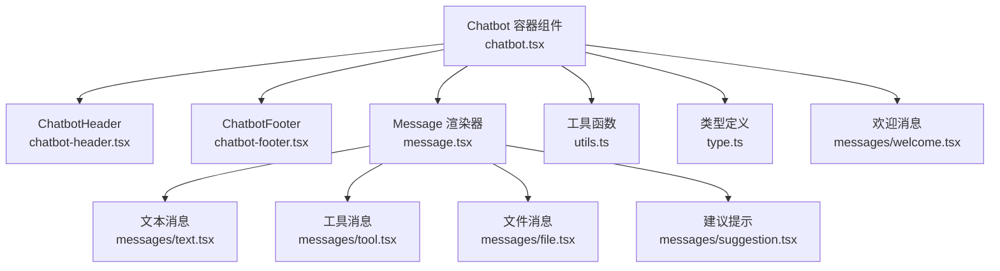
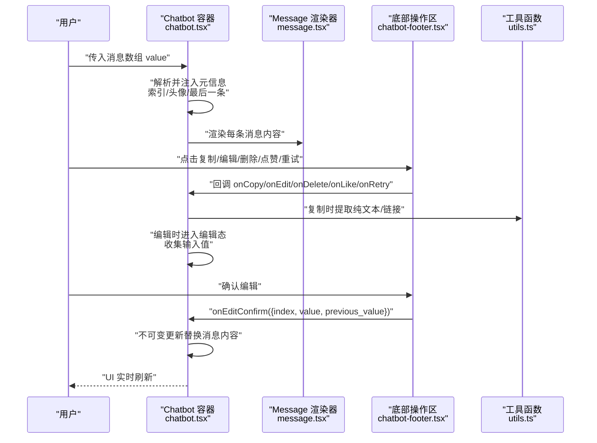
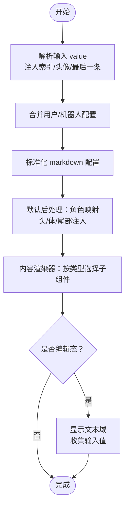
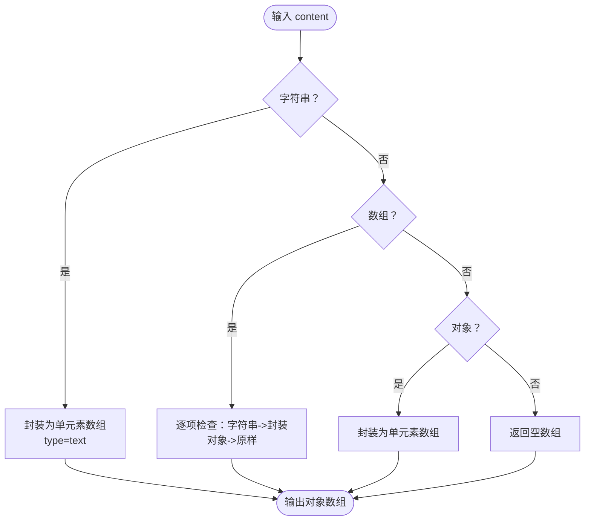
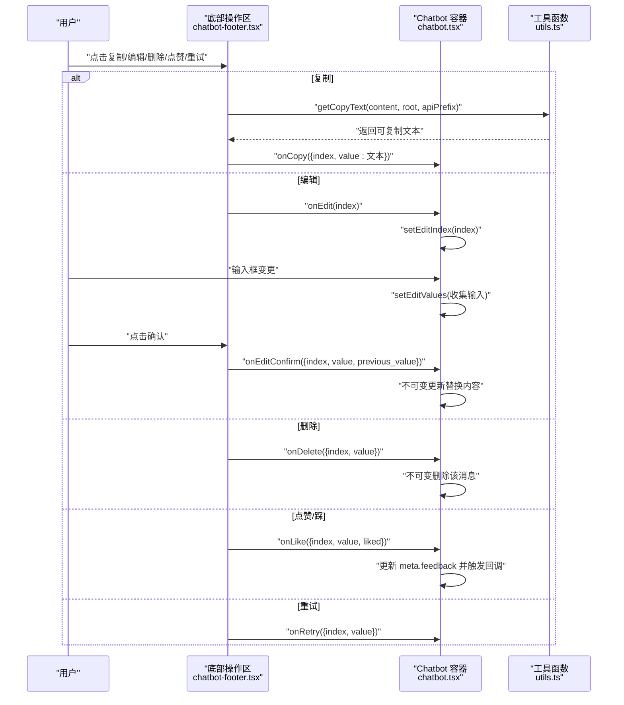
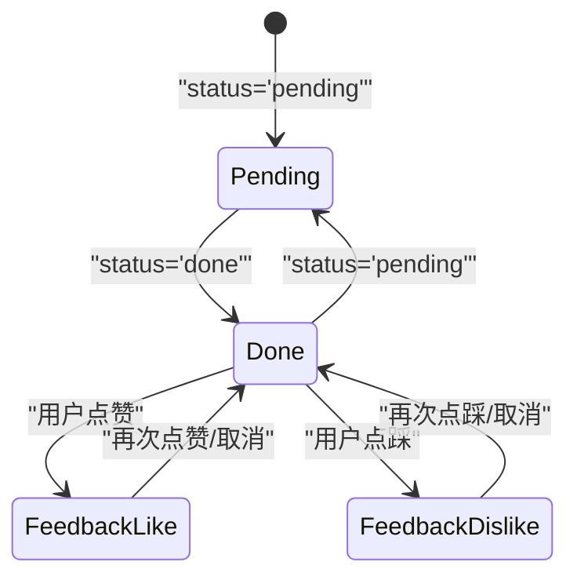
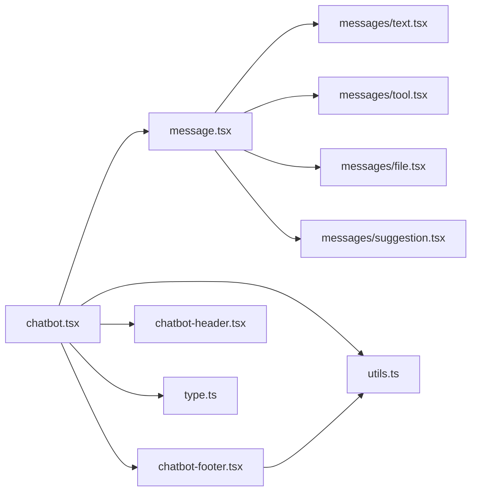

# 消息处理

<cite>
**本文引用的文件**
- [frontend/pro/chatbot/chatbot.tsx](file://frontend/pro/chatbot/chatbot.tsx)
- [frontend/pro/chatbot/message.tsx](file://frontend/pro/chatbot/message.tsx)
- [frontend/pro/chatbot/utils.ts](file://frontend/pro/chatbot/utils.ts)
- [frontend/pro/chatbot/type.ts](file://frontend/pro/chatbot/type.ts)
- [frontend/pro/chatbot/chatbot-footer.tsx](file://frontend/pro/chatbot/chatbot-footer.tsx)
- [frontend/pro/chatbot/chatbot-header.tsx](file://frontend/pro/chatbot/chatbot-header.tsx)
- [frontend/pro/chatbot/messages/text.tsx](file://frontend/pro/chatbot/messages/text.tsx)
- [frontend/pro/chatbot/messages/tool.tsx](file://frontend/pro/chatbot/messages/tool.tsx)
- [frontend/pro/chatbot/messages/file.tsx](file://frontend/pro/chatbot/messages/file.tsx)
- [frontend/pro/chatbot/messages/suggestion.tsx](file://frontend/pro/chatbot/messages/suggestion.tsx)
- [frontend/pro/chatbot/messages/welcome.tsx](file://frontend/pro/chatbot/messages/welcome.tsx)
</cite>

## 目录

1. [简介](#简介)
2. [项目结构](#项目结构)
3. [核心组件](#核心组件)
4. [架构总览](#架构总览)
5. [详细组件分析](#详细组件分析)
6. [依赖关系分析](#依赖关系分析)
7. [性能考虑](#性能考虑)
8. [故障排查指南](#故障排查指南)
9. [结论](#结论)

## 简介

本章节面向 Chatbot 聊天机器人组件的消息处理能力，系统性阐述消息的预处理与后处理机制、消息内容的转换与格式化、消息事件的绑定与处理（复制、编辑、删除、点赞/踩、重试等）、消息状态管理（pending、done）与实时更新策略，并提供可扩展的自定义方式与回调使用建议。文档以循序渐进的方式组织，既适合快速上手，也便于深入理解实现细节。

## 项目结构

消息处理相关代码集中在前端 pro/chatbot 目录，采用“容器组件 + 子消息组件 + 工具函数 + 类型定义”的分层设计：

- 容器组件：负责消息列表渲染、事件桥接、状态管理与滚动控制
- 子消息组件：按类型渲染文本、工具输出、文件附件、建议提示等
- 工具函数：消息内容归一化、复制文本提取、编辑内容更新、头像属性解析等
- 类型定义：统一消息结构、动作数据、配置项与回调参数

图表来源

- [frontend/pro/chatbot/chatbot.tsx:1-475](file://frontend/pro/chatbot/chatbot.tsx#L1-L475)
- [frontend/pro/chatbot/message.tsx:1-184](file://frontend/pro/chatbot/message.tsx#L1-L184)
- [frontend/pro/chatbot/utils.ts:1-157](file://frontend/pro/chatbot/utils.ts#L1-L157)
- [frontend/pro/chatbot/type.ts:1-197](file://frontend/pro/chatbot/type.ts#L1-L197)
- [frontend/pro/chatbot/chatbot-footer.tsx:1-363](file://frontend/pro/chatbot/chatbot-footer.tsx#L1-L363)
- [frontend/pro/chatbot/chatbot-header.tsx:1-23](file://frontend/pro/chatbot/chatbot-header.tsx#L1-L23)
- [frontend/pro/chatbot/messages/text.tsx:1-19](file://frontend/pro/chatbot/messages/text.tsx#L1-L19)
- [frontend/pro/chatbot/messages/tool.tsx:1-46](file://frontend/pro/chatbot/messages/tool.tsx#L1-L46)
- [frontend/pro/chatbot/messages/file.tsx:1-119](file://frontend/pro/chatbot/messages/file.tsx#L1-L119)
- [frontend/pro/chatbot/messages/suggestion.tsx:1-37](file://frontend/pro/chatbot/messages/suggestion.tsx#L1-L37)
- [frontend/pro/chatbot/messages/welcome.tsx:1-55](file://frontend/pro/chatbot/messages/welcome.tsx#L1-L55)

章节来源

- [frontend/pro/chatbot/chatbot.tsx:1-475](file://frontend/pro/chatbot/chatbot.tsx#L1-L475)
- [frontend/pro/chatbot/message.tsx:1-184](file://frontend/pro/chatbot/message.tsx#L1-L184)
- [frontend/pro/chatbot/utils.ts:1-157](file://frontend/pro/chatbot/utils.ts#L1-L157)
- [frontend/pro/chatbot/type.ts:1-197](file://frontend/pro/chatbot/type.ts#L1-L197)

## 核心组件

- Chatbot 容器组件：负责消息列表的渲染、滚动控制、事件桥接（复制、编辑、删除、点赞/踩、重试、建议选择、欢迎词提示选择），以及消息状态的变更（如反馈标记）
- Message 渲染器：根据消息内容类型（文本、工具、文件、建议）进行差异化渲染；支持在编辑态下对可编辑内容进行内联编辑
- 子消息组件：分别处理文本 Markdown 渲染、工具输出折叠面板、文件附件卡片、建议提示列表
- 工具函数：消息内容归一化、复制文本提取、编辑内容更新、头像属性解析、建议内容遍历
- 类型定义：统一消息结构、动作数据、配置项与回调参数，确保编译期约束与 IDE 提示

章节来源

- [frontend/pro/chatbot/chatbot.tsx:51-472](file://frontend/pro/chatbot/chatbot.tsx#L51-L472)
- [frontend/pro/chatbot/message.tsx:25-183](file://frontend/pro/chatbot/message.tsx#L25-L183)
- [frontend/pro/chatbot/utils.ts:46-157](file://frontend/pro/chatbot/utils.ts#L46-L157)
- [frontend/pro/chatbot/type.ts:121-197](file://frontend/pro/chatbot/type.ts#L121-L197)

## 架构总览

消息处理的总体流程如下：

- 输入消息数组经容器组件解析为 Bubble 列表项，附加索引、头/尾部信息、头像属性与“是否最后一条”标记
- 每条消息在默认后处理阶段由 Message 渲染器根据类型选择对应子组件
- 用户通过底部操作区触发复制、编辑、删除、点赞/踩、重试等事件，容器组件通过回调将事件与索引传递给上层应用
- 编辑流程采用“编辑态 -> 确认/取消”的两段式交互，确认后通过不可变更新替换对应消息内容
- 状态管理通过消息对象的 meta 字段记录反馈状态，支持 pending/done 状态在工具消息中驱动折叠面板

图表来源

- [frontend/pro/chatbot/chatbot.tsx:137-245](file://frontend/pro/chatbot/chatbot.tsx#L137-L245)
- [frontend/pro/chatbot/message.tsx:52-175](file://frontend/pro/chatbot/message.tsx#L52-L175)
- [frontend/pro/chatbot/chatbot-footer.tsx:255-362](file://frontend/pro/chatbot/chatbot-footer.tsx#L255-L362)
- [frontend/pro/chatbot/utils.ts:105-140](file://frontend/pro/chatbot/utils.ts#L105-L140)

## 详细组件分析

### 消息预处理与后处理机制

- 预处理
  - 解析输入消息数组，为每条消息注入索引、头/尾部信息、头像属性、是否最后一条标记，并生成唯一 key
  - 合并用户/机器人配置，统一样式、类名、元素类等
  - 将 markdown 配置标准化，注入根路径与主题模式
- 后处理
  - 默认后处理阶段：根据角色渲染头/体/尾部，注入头像、标题、内容渲染器
  - 内容渲染器：根据消息类型选择文本、工具、文件或建议组件
  - 编辑态：当某条消息处于编辑态时，可编辑类型（文本、工具）会显示文本域，输入值暂存于 editValues 中

图表来源

- [frontend/pro/chatbot/chatbot.tsx:137-165](file://frontend/pro/chatbot/chatbot.tsx#L137-L165)
- [frontend/pro/chatbot/chatbot.tsx:246-422](file://frontend/pro/chatbot/chatbot.tsx#L246-L422)
- [frontend/pro/chatbot/message.tsx:52-81](file://frontend/pro/chatbot/message.tsx#L52-L81)

章节来源

- [frontend/pro/chatbot/chatbot.tsx:137-165](file://frontend/pro/chatbot/chatbot.tsx#L137-L165)
- [frontend/pro/chatbot/chatbot.tsx:246-422](file://frontend/pro/chatbot/chatbot.tsx#L246-L422)
- [frontend/pro/chatbot/message.tsx:52-81](file://frontend/pro/chatbot/message.tsx#L52-L81)

### 消息内容转换、验证与格式化

- 归一化：将字符串、数组或对象形式的内容统一封装为对象数组，保证后续渲染一致性
- 复制文本提取：根据内容类型与 copyable 标记提取可复制文本，文件类型返回可访问链接的 JSON 表达
- 编辑内容更新：根据当前内容形态（字符串/数组/对象）与编辑映射，生成新的内容结构
- 建议内容遍历：对嵌套建议进行递归遍历，统一设置禁用状态等属性

图表来源

- [frontend/pro/chatbot/utils.ts:46-72](file://frontend/pro/chatbot/utils.ts#L46-L72)

章节来源

- [frontend/pro/chatbot/utils.ts:46-157](file://frontend/pro/chatbot/utils.ts#L46-L157)

### 消息事件绑定与处理（copy/edit/delete/like/retry）

- 复制（copy）
  - 底部操作区通过复制按钮触发，内部调用复制文本提取函数，最终触发 onCopy 回调
- 编辑（edit）
  - 进入编辑态后，输入值暂存在 editValues 中；确认时通过不可变更新替换对应消息内容，并触发 onEdit 回调
- 删除（delete）
  - 触发时通过不可变更新删除对应索引的消息项，并触发 onDelete 回调
- 点赞/踩（like/dislike）
  - 更新消息 meta.feedback 字段，支持切换；同时触发 onLike 回调
- 重试（retry）
  - 触发时调用 onRetry 回调，交由上层决定如何处理

图表来源

- [frontend/pro/chatbot/chatbot-footer.tsx:53-100](file://frontend/pro/chatbot/chatbot-footer.tsx#L53-L100)
- [frontend/pro/chatbot/chatbot-footer.tsx:255-362](file://frontend/pro/chatbot/chatbot-footer.tsx#L255-L362)
- [frontend/pro/chatbot/chatbot.tsx:195-245](file://frontend/pro/chatbot/chatbot.tsx#L195-L245)
- [frontend/pro/chatbot/utils.ts:105-140](file://frontend/pro/chatbot/utils.ts#L105-L140)

章节来源

- [frontend/pro/chatbot/chatbot-footer.tsx:53-100](file://frontend/pro/chatbot/chatbot-footer.tsx#L53-L100)
- [frontend/pro/chatbot/chatbot-footer.tsx:255-362](file://frontend/pro/chatbot/chatbot-footer.tsx#L255-L362)
- [frontend/pro/chatbot/chatbot.tsx:195-245](file://frontend/pro/chatbot/chatbot.tsx#L195-L245)
- [frontend/pro/chatbot/utils.ts:105-140](file://frontend/pro/chatbot/utils.ts#L105-L140)

### 消息状态管理（pending、done）与实时更新

- 状态字段：消息对象支持 status 字段，用于标识“待处理/pending”或“已完成/done”
- 工具消息状态联动：工具消息组件根据 status 控制折叠面板初始展开状态
- 反馈状态：消息对象 meta.feedback 记录用户反馈（like/dislike/null），用于 UI 着色与状态切换
- 不可变更新：编辑确认、删除、点赞/踩均通过不可变更新策略修改消息数组，确保 React 有效 diff 与重渲染

图表来源

- [frontend/pro/chatbot/type.ts:154-157](file://frontend/pro/chatbot/type.ts#L154-L157)
- [frontend/pro/chatbot/messages/tool.tsx:14-18](file://frontend/pro/chatbot/messages/tool.tsx#L14-L18)
- [frontend/pro/chatbot/chatbot.tsx:222-237](file://frontend/pro/chatbot/chatbot.tsx#L222-L237)

章节来源

- [frontend/pro/chatbot/type.ts:154-157](file://frontend/pro/chatbot/type.ts#L154-L157)
- [frontend/pro/chatbot/messages/tool.tsx:14-18](file://frontend/pro/chatbot/messages/tool.tsx#L14-L18)
- [frontend/pro/chatbot/chatbot.tsx:222-237](file://frontend/pro/chatbot/chatbot.tsx#L222-L237)

### 自定义扩展与回调使用

- 自定义渲染
  - 通过 Chatbot 的 userConfig/botConfig 注入样式、类名、元素类、头/尾部内容与头像
  - 通过 markdownConfig 控制 Markdown 渲染行为与主题模式
- 自定义动作
  - actions/disabled_actions 支持增删改查、点赞/踩、重试等动作的启用/禁用与二次确认
  - 动作可附带 Tooltip 与 Popconfirm 提示
- 回调扩展
  - onCopy/onEdit/onDelete/onLike/onRetry/onSuggestionSelect/onWelcomePromptSelect 等回调用于业务集成
  - onValueChange 用于接收消息数组变更后的最新值，便于持久化或进一步处理

章节来源

- [frontend/pro/chatbot/chatbot.tsx:66-107](file://frontend/pro/chatbot/chatbot.tsx#L66-L107)
- [frontend/pro/chatbot/chatbot.tsx:379-400](file://frontend/pro/chatbot/chatbot.tsx#L379-L400)
- [frontend/pro/chatbot/type.ts:79-119](file://frontend/pro/chatbot/type.ts#L79-L119)

### 子消息组件与渲染逻辑

- 文本消息：支持 Markdown 渲染或直接文本展示
- 工具消息：支持标题与内容的 Markdown 渲染，状态驱动折叠面板
- 文件消息：支持图片/视频/音频卡片，自动解析可访问链接
- 建议提示：支持多级嵌套，统一禁用状态与点击回调
- 欢迎消息：整合欢迎语与提示词列表，支持图标 URL 解析

章节来源

- [frontend/pro/chatbot/messages/text.tsx:11-18](file://frontend/pro/chatbot/messages/text.tsx#L11-L18)
- [frontend/pro/chatbot/messages/tool.tsx:13-45](file://frontend/pro/chatbot/messages/tool.tsx#L13-L45)
- [frontend/pro/chatbot/messages/file.tsx:44-118](file://frontend/pro/chatbot/messages/file.tsx#L44-L118)
- [frontend/pro/chatbot/messages/suggestion.tsx:16-36](file://frontend/pro/chatbot/messages/suggestion.tsx#L16-L36)
- [frontend/pro/chatbot/messages/welcome.tsx:18-54](file://frontend/pro/chatbot/messages/welcome.tsx#L18-L54)

## 依赖关系分析

- 组件耦合
  - Chatbot 对 Message、ChatbotHeader、ChatbotFooter、工具函数与类型定义存在强依赖
  - Message 对各子消息组件存在条件渲染依赖
  - ChatbotFooter 对工具函数中的复制文本提取与内容更新函数有直接调用
- 外部依赖
  - 使用 Ant Design 组件库与 @ant-design/x 的 Bubble/List/Prompts/Welcome 等组件
  - 使用 immer 进行不可变更新
  - 使用 lodash-es 的 isEqual/omit 等工具函数

图表来源

- [frontend/pro/chatbot/chatbot.tsx:20-47](file://frontend/pro/chatbot/chatbot.tsx#L20-L47)
- [frontend/pro/chatbot/message.tsx:6-23](file://frontend/pro/chatbot/message.tsx#L6-L23)
- [frontend/pro/chatbot/chatbot-footer.tsx:32-31](file://frontend/pro/chatbot/chatbot-footer.tsx#L32-L31)

章节来源

- [frontend/pro/chatbot/chatbot.tsx:1-475](file://frontend/pro/chatbot/chatbot.tsx#L1-L475)
- [frontend/pro/chatbot/message.tsx:1-184](file://frontend/pro/chatbot/message.tsx#L1-L184)
- [frontend/pro/chatbot/chatbot-footer.tsx:1-363](file://frontend/pro/chatbot/chatbot-footer.tsx#L1-L363)
- [frontend/pro/chatbot/utils.ts:1-157](file://frontend/pro/chatbot/utils.ts#L1-L157)
- [frontend/pro/chatbot/type.ts:1-197](file://frontend/pro/chatbot/type.ts#L1-L197)

## 性能考虑

- 不可变更新：通过不可变更新策略减少不必要的重渲染，提升列表更新效率
- 事件记忆化：使用 useMemoizedFn 包裹回调，降低因引用变化导致的子组件重渲染
- 条件渲染：仅在需要时渲染底部操作区与编辑态 UI，避免无谓的 DOM 结构
- 状态最小化：编辑态仅保存必要的 editValues 映射，避免冗余状态
- 滚动控制：通过 useScroll 钩子控制滚动按钮显示与滚动行为，避免频繁滚动计算

章节来源

- [frontend/pro/chatbot/chatbot.tsx:172-183](file://frontend/pro/chatbot/chatbot.tsx#L172-L183)
- [frontend/pro/chatbot/chatbot.tsx:433-438](file://frontend/pro/chatbot/chatbot.tsx#L433-L438)
- [frontend/pro/chatbot/chatbot-footer.tsx:273-301](file://frontend/pro/chatbot/chatbot-footer.tsx#L273-L301)

## 故障排查指南

- 复制结果为空
  - 检查内容是否被标记为不可复制（copyable=false），或内容形态不支持提取
  - 确认 rootUrl 与 apiPrefix 是否正确，文件链接解析是否可用
- 编辑确认无效
  - 确认当前消息是否处于编辑态（isEditing），以及 editIndex 与当前索引一致
  - 检查 editValues 是否包含对应索引的输入值
- 点赞/踩状态异常
  - 检查 meta.feedback 是否被正确更新，UI 着色是否依赖该字段
- 工具消息未按预期折叠
  - 确认 status 是否为 'pending' 或 'done'，折叠面板初始状态由该状态决定
- 欢迎提示点击无响应
  - 检查 onWelcomePromptSelect 回调是否正确传入，Prompts 的 items 是否正确解析

章节来源

- [frontend/pro/chatbot/utils.ts:105-140](file://frontend/pro/chatbot/utils.ts#L105-L140)
- [frontend/pro/chatbot/chatbot-footer.tsx:291-298](file://frontend/pro/chatbot/chatbot-footer.tsx#L291-L298)
- [frontend/pro/chatbot/chatbot.tsx:222-237](file://frontend/pro/chatbot/chatbot.tsx#L222-L237)
- [frontend/pro/chatbot/messages/tool.tsx:14-18](file://frontend/pro/chatbot/messages/tool.tsx#L14-L18)
- [frontend/pro/chatbot/messages/welcome.tsx:46-51](file://frontend/pro/chatbot/messages/welcome.tsx#L46-L51)

## 结论

本组件通过清晰的预处理/后处理管线、完善的事件桥接与不可变更新策略，实现了对多类型消息的高效渲染与交互。借助丰富的配置与回调扩展点，开发者可在不破坏整体结构的前提下灵活定制 UI 与业务逻辑。配合性能优化与故障排查建议，可进一步提升用户体验与开发效率。
