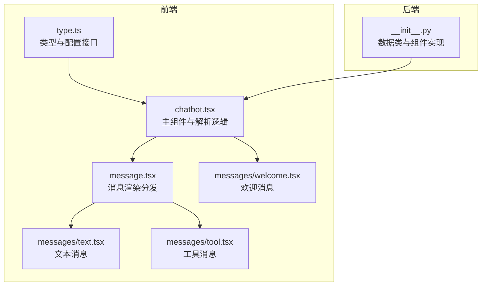
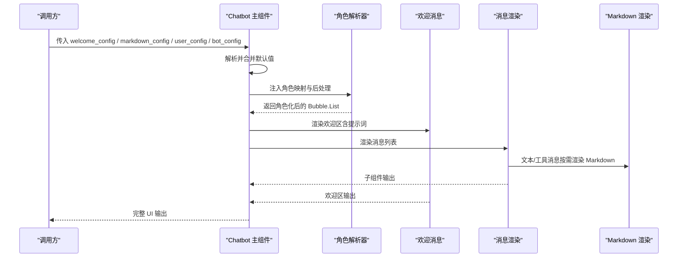
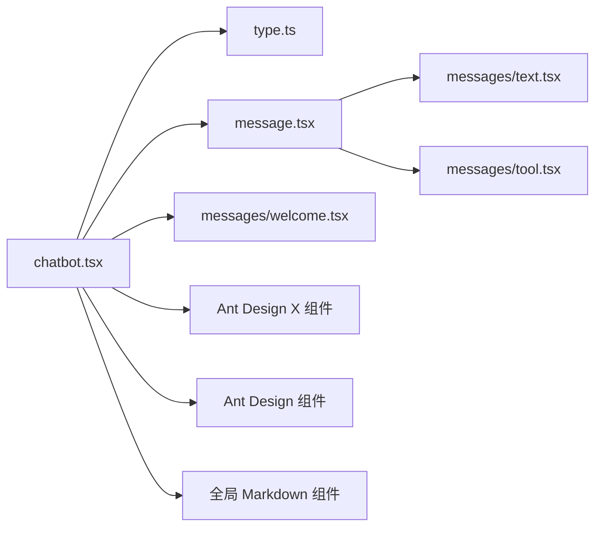

# 配置选项

<cite>
**本文引用的文件**
- [frontend/pro/chatbot/type.ts](file://frontend/pro/chatbot/type.ts)
- [frontend/pro/chatbot/chatbot.tsx](file://frontend/pro/chatbot/chatbot.tsx)
- [frontend/pro/chatbot/message.tsx](file://frontend/pro/chatbot/message.tsx)
- [frontend/pro/chatbot/messages/text.tsx](file://frontend/pro/chatbot/messages/text.tsx)
- [frontend/pro/chatbot/messages/tool.tsx](file://frontend/pro/chatbot/messages/tool.tsx)
- [frontend/pro/chatbot/messages/welcome.tsx](file://frontend/pro/chatbot/messages/welcome.tsx)
- [backend/modelscope_studio/components/pro/chatbot/__init__.py](file://backend/modelscope_studio/components/pro/chatbot/__init__.py)
- [docs/layout_templates/chatbot/demos/basic.py](file://docs/layout_templates/chatbot/demos/basic.py)
- [docs/layout_templates/chatbot/demos/fine_grained_control.py](file://docs/layout_templates/chatbot/demos/fine_grained_control.py)
- [docs/layout_templates/chatbot/README-zh_CN.md](file://docs/layout_templates/chatbot/README-zh_CN.md)
</cite>

## 目录

1. [简介](#简介)
2. [项目结构](#项目结构)
3. [核心组件](#核心组件)
4. [架构总览](#架构总览)
5. [详细组件分析](#详细组件分析)
6. [依赖分析](#依赖分析)
7. [性能考虑](#性能考虑)
8. [故障排查指南](#故障排查指南)
9. [结论](#结论)
10. [附录](#附录)

## 简介

本章节面向使用 Chatbot 聊天机器人组件的开发者与产品人员，系统性梳理前端与后端配置选项，覆盖欢迎配置（welcome_config）、Markdown 配置（markdown_config）、用户配置（user_config）、机器人配置（bot_config），并解释各配置项的作用、可选值与默认行为，提供配置示例与典型应用场景，说明配置之间的相互关系与优先级，最后给出高级技巧与性能优化建议。

## 项目结构

Chatbot 组件由前端 Svelte/React 实现与后端 Gradio 数据类定义共同组成：

- 前端：类型定义、渲染逻辑、消息子组件、欢迎消息组件等
- 后端：数据模型、事件绑定、静态资源处理、预处理/后处理逻辑

图表来源

- [frontend/pro/chatbot/type.ts:1-197](file://frontend/pro/chatbot/type.ts#L1-L197)
- [frontend/pro/chatbot/chatbot.tsx:1-475](file://frontend/pro/chatbot/chatbot.tsx#L1-L475)
- [frontend/pro/chatbot/message.tsx:1-184](file://frontend/pro/chatbot/message.tsx#L1-L184)
- [frontend/pro/chatbot/messages/text.tsx:1-19](file://frontend/pro/chatbot/messages/text.tsx#L1-L19)
- [frontend/pro/chatbot/messages/tool.tsx:1-46](file://frontend/pro/chatbot/messages/tool.tsx#L1-L46)
- [frontend/pro/chatbot/messages/welcome.tsx:1-55](file://frontend/pro/chatbot/messages/welcome.tsx#L1-L55)
- [backend/modelscope_studio/components/pro/chatbot/**init**.py:1-495](file://backend/modelscope_studio/components/pro/chatbot/__init__.py#L1-L495)

章节来源

- [frontend/pro/chatbot/type.ts:1-197](file://frontend/pro/chatbot/type.ts#L1-L197)
- [frontend/pro/chatbot/chatbot.tsx:1-475](file://frontend/pro/chatbot/chatbot.tsx#L1-L475)
- [backend/modelscope_studio/components/pro/chatbot/**init**.py:1-495](file://backend/modelscope_studio/components/pro/chatbot/__init__.py#L1-L495)

## 核心组件

- 类型与配置接口：定义 welcome_config、markdown_config、user_config、bot_config 及消息内容对象的结构与可选字段
- 主组件：负责合并默认值、解析配置、注入主题与根路径、渲染消息列表与欢迎区
- 消息渲染：根据内容类型分发到文本、工具、文件、建议等子组件
- 欢迎消息：渲染欢迎语与提示词卡片

章节来源

- [frontend/pro/chatbot/type.ts:27-158](file://frontend/pro/chatbot/type.ts#L27-L158)
- [frontend/pro/chatbot/chatbot.tsx:51-472](file://frontend/pro/chatbot/chatbot.tsx#L51-L472)
- [frontend/pro/chatbot/message.tsx:25-184](file://frontend/pro/chatbot/message.tsx#L25-L184)
- [frontend/pro/chatbot/messages/welcome.tsx:11-54](file://frontend/pro/chatbot/messages/welcome.tsx#L11-L54)

## 架构总览

下图展示了 Chatbot 的配置解析与渲染流程，从 props 到最终渲染的关键节点与依赖关系。

图表来源

- [frontend/pro/chatbot/chatbot.tsx:76-472](file://frontend/pro/chatbot/chatbot.tsx#L76-L472)
- [frontend/pro/chatbot/messages/welcome.tsx:18-54](file://frontend/pro/chatbot/messages/welcome.tsx#L18-L54)
- [frontend/pro/chatbot/message.tsx:39-184](file://frontend/pro/chatbot/message.tsx#L39-L184)
- [frontend/pro/chatbot/messages/text.tsx:11-18](file://frontend/pro/chatbot/messages/text.tsx#L11-L18)
- [frontend/pro/chatbot/messages/tool.tsx:13-45](file://frontend/pro/chatbot/messages/tool.tsx#L13-L45)

## 详细组件分析

### 欢迎配置（welcome_config）

- 作用：控制欢迎区的外观、文案与提示词卡片
- 关键字段
  - variant：外观变体，支持 borderless、filled
  - icon：图标，可为字符串、路径或文件数据
  - title：标题
  - description：描述
  - extra：附加内容
  - elem_style / elem_classes / styles / class_names：样式与类名
  - prompts：提示词卡片集合（见下方“提示词配置”）
- 默认行为
  - 若未提供，主组件会以 borderless 作为默认变体
- 与提示词的关系
  - prompts 字段可嵌套提示词卡片配置，用于引导用户快速开始

章节来源

- [frontend/pro/chatbot/type.ts:34-41](file://frontend/pro/chatbot/type.ts#L34-L41)
- [frontend/pro/chatbot/chatbot.tsx:108-115](file://frontend/pro/chatbot/chatbot.tsx#L108-L115)
- [frontend/pro/chatbot/messages/welcome.tsx:24-51](file://frontend/pro/chatbot/messages/welcome.tsx#L24-L51)
- [backend/modelscope_studio/components/pro/chatbot/**init**.py:38-50](file://backend/modelscope_studio/components/pro/chatbot/__init__.py#L38-L50)

### 提示词配置（prompts 在 welcome_config 中）

- 作用：在欢迎区展示一组提示词卡片，辅助用户快速发起对话
- 关键字段
  - title：提示词区域标题
  - vertical / wrap：布局方向与换行
  - styles / class_names / elem_style / elem_classes：样式与类名
  - items：提示词条目数组（每个条目包含 label、description、children 等）

章节来源

- [frontend/pro/chatbot/type.ts:27-32](file://frontend/pro/chatbot/type.ts#L27-L32)
- [frontend/pro/chatbot/messages/welcome.tsx:41-51](file://frontend/pro/chatbot/messages/welcome.tsx#L41-L51)
- [backend/modelscope_studio/components/pro/chatbot/**init**.py:26-36](file://backend/modelscope_studio/components/pro/chatbot/__init__.py#L26-L36)

### Markdown 配置（markdown_config）

- 作用：统一控制文本与工具消息中的 Markdown 渲染行为
- 关键字段
  - renderMarkdown：是否启用 Markdown 渲染（前端）
  - render_markdown：是否启用 Markdown 渲染（后端）
  - latex_delimiters：LaTeX 分隔符配置
  - sanitize_html：是否清理 HTML
  - line_breaks：是否保留换行
  - rtl：是否从右到左
  - allow_tags：允许的标签或布尔开关
- 默认行为
  - 前端默认开启 renderMarkdown 并设置换行策略
  - 后端默认启用渲染、清理 HTML、换行与多组 LaTeX 分隔符

章节来源

- [frontend/pro/chatbot/type.ts:54-56](file://frontend/pro/chatbot/type.ts#L54-L56)
- [frontend/pro/chatbot/message.tsx:87-95](file://frontend/pro/chatbot/message.tsx#L87-L95)
- [frontend/pro/chatbot/messages/tool.tsx:14-18](file://frontend/pro/chatbot/messages/tool.tsx#L14-L18)
- [backend/modelscope_studio/components/pro/chatbot/**init**.py:52-106](file://backend/modelscope_studio/components/pro/chatbot/__init__.py#L52-L106)

### 用户配置（user_config）

- 作用：控制用户消息气泡的外观、头像、动作按钮与样式
- 关键字段
  - actions：动作按钮列表，支持 copy、edit、delete；或带 tooltip/popconfirm 的对象
  - disabled_actions：禁用的动作集合
  - header / footer：头部与尾部文案
  - avatar：头像，可为字符串、文件数据或头像属性对象
  - variant / shape / placement：外观、形状与位置
  - loading / typing：加载与打字效果
  - elem_style / elem_classes / styles / class_names：样式与类名
- 默认行为
  - 默认仅启用 copy 动作（后端默认值）

章节来源

- [frontend/pro/chatbot/type.ts:86-97](file://frontend/pro/chatbot/type.ts#L86-L97)
- [frontend/pro/chatbot/chatbot.tsx:246-432](file://frontend/pro/chatbot/chatbot.tsx#L246-L432)
- [backend/modelscope_studio/components/pro/chatbot/**init**.py:117-151](file://backend/modelscope_studio/components/pro/chatbot/__init__.py#L117-L151)
- [backend/modelscope_studio/components/pro/chatbot/**init**.py:123-131](file://backend/modelscope_studio/components/pro/chatbot/__init__.py#L123-L131)

### 机器人配置（bot_config）

- 作用：控制机器人消息气泡的外观、头像、动作按钮与样式
- 关键字段
  - actions：动作按钮列表，支持 copy、like、dislike、retry、edit、delete；或带 tooltip/popconfirm 的对象
  - disabled_actions：禁用的动作集合
  - header / footer：头部与尾部文案
  - avatar：头像
  - variant / shape / placement：外观、形状与位置
  - loading / typing：加载与打字效果
  - elem_style / elem_classes / styles / class_names：样式与类名
- 默认行为
  - 默认启用 copy 动作（后端默认值）

章节来源

- [frontend/pro/chatbot/type.ts:108-119](file://frontend/pro/chatbot/type.ts#L108-L119)
- [frontend/pro/chatbot/chatbot.tsx:246-432](file://frontend/pro/chatbot/chatbot.tsx#L246-L432)
- [backend/modelscope_studio/components/pro/chatbot/**init**.py:153-180](file://backend/modelscope_studio/components/pro/chatbot/__init__.py#L153-L180)
- [backend/modelscope_studio/components/pro/chatbot/**init**.py:162-170](file://backend/modelscope_studio/components/pro/chatbot/__init__.py#L162-L170)

### 消息内容与渲染（消息类型与选项）

- 内容类型
  - text：纯文本或 Markdown 文本
  - tool：工具消息，可折叠显示标题与内容
  - file：文件列表，支持图片/视频/音频属性
  - suggestion：建议列表，支持禁用与点击回调
- 内容选项
  - 文本/工具：继承 Markdown 配置，工具消息支持 title 与 status（pending/done）
  - 文件：继承 Flex 布局配置，支持 imageProps/videoProps/audioProps
  - 建议：继承提示词配置
- 编辑与可复制
  - 可通过 content.options.editable 控制是否允许编辑
  - 可通过 content.options.copyable 控制是否允许复制

章节来源

- [frontend/pro/chatbot/type.ts:43-68](file://frontend/pro/chatbot/type.ts#L43-L68)
- [frontend/pro/chatbot/type.ts:121-135](file://frontend/pro/chatbot/type.ts#L121-L135)
- [frontend/pro/chatbot/message.tsx:52-174](file://frontend/pro/chatbot/message.tsx#L52-L174)
- [frontend/pro/chatbot/messages/text.tsx:11-18](file://frontend/pro/chatbot/messages/text.tsx#L11-L18)
- [frontend/pro/chatbot/messages/tool.tsx:13-45](file://frontend/pro/chatbot/messages/tool.tsx#L13-L45)

### 配置优先级与合并规则

- 主组件解析顺序
  - welcome_config：以 borderless 为默认变体，其余字段按传入覆盖
  - markdown_config：前端默认开启换行与渲染，后端默认启用渲染与清理
  - user_config / bot_config：按传入覆盖，未传则为空对象
  - 消息级配置：message.options 与全局 markdown_config 合并，message.options 优先
- 头像与静态资源
  - 后端会对 avatar 与 welcome.icon 进行静态资源包装，确保可访问
- 角色与样式
  - 主组件根据角色（user/assistant/chatbot-internal-welcome）应用不同样式与类名

章节来源

- [frontend/pro/chatbot/chatbot.tsx:108-136](file://frontend/pro/chatbot/chatbot.tsx#L108-L136)
- [frontend/pro/chatbot/chatbot.tsx:246-432](file://frontend/pro/chatbot/chatbot.tsx#L246-L432)
- [backend/modelscope_studio/components/pro/chatbot/**init**.py:363-380](file://backend/modelscope_studio/components/pro/chatbot/__init__.py#L363-L380)

### 配置示例与应用场景

- 基础示例
  - 使用 welcome_config 设置标题、描述与提示词卡片
  - 使用 user_config/bot_config 配置动作按钮与头像
  - 参考：[basic.py:516-564](file://docs/layout_templates/chatbot/demos/basic.py#L516-L564)
- 细粒度控制示例
  - 自定义角色渲染、消息状态与反馈按钮
  - 参考：[fine_grained_control.py:575-800](file://docs/layout_templates/chatbot/demos/fine_grained_control.py#L575-L800)
- 应用场景
  - 即时助手：启用 copy、like/dislike、retry、delete 等动作
  - 多轮对话：结合会话列表与消息状态管理
  - 多媒体输入：配合文件上传与文件消息渲染

章节来源

- [docs/layout_templates/chatbot/demos/basic.py:516-564](file://docs/layout_templates/chatbot/demos/basic.py#L516-L564)
- [docs/layout_templates/chatbot/demos/fine_grained_control.py:575-800](file://docs/layout_templates/chatbot/demos/fine_grained_control.py#L575-L800)
- [docs/layout_templates/chatbot/README-zh_CN.md:1-20](file://docs/layout_templates/chatbot/README-zh_CN.md#L1-L20)

## 依赖分析

- 组件耦合
  - 主组件依赖类型定义与消息子组件，消息子组件再依赖 Markdown 渲染
  - 欢迎消息依赖提示词组件与文件 URL 处理
- 外部依赖
  - Ant Design X（Welcome、Prompts、Bubble.List）
  - Ant Design（Avatar、Button、Collapse、Flex 等）
  - 全局 Markdown 组件与文件上传工具

图表来源

- [frontend/pro/chatbot/chatbot.tsx:26-47](file://frontend/pro/chatbot/chatbot.tsx#L26-L47)
- [frontend/pro/chatbot/message.tsx:10-23](file://frontend/pro/chatbot/message.tsx#L10-L23)
- [frontend/pro/chatbot/messages/text.tsx:2-4](file://frontend/pro/chatbot/messages/text.tsx#L2-L4)
- [frontend/pro/chatbot/messages/tool.tsx:3-4](file://frontend/pro/chatbot/messages/tool.tsx#L3-L4)
- [frontend/pro/chatbot/messages/welcome.tsx:3-6](file://frontend/pro/chatbot/messages/welcome.tsx#L3-L6)

## 性能考虑

- 渲染优化
  - 合理使用 elem_style / styles 与 class_names，避免过度重排
  - 工具消息使用折叠（collapse）减少初始渲染开销
- 资源处理
  - 头像与欢迎图标通过静态资源服务提供，避免重复传输
- 交互节流
  - 对频繁触发的事件（如滚动、编辑）进行防抖/节流处理（在上层应用中实现）
- 内存与状态
  - 长对话建议限制消息数量或采用分页/懒加载策略

## 故障排查指南

- 欢迎图标不显示
  - 检查 welcome_config.icon 是否为有效路径或文件数据，确认静态资源服务已启用
- Markdown 渲染异常
  - 前端检查 renderMarkdown 开关；后端检查 render_markdown 与 sanitize_html
- 动作按钮无效
  - 确认 actions 与 disabled_actions 配置正确，必要时使用 tooltip/popconfirm 对话框
- 文件消息无法预览
  - 检查文件路径与 MIME 类型，确认后端已转换为 FileData

章节来源

- [frontend/pro/chatbot/messages/welcome.tsx:32-38](file://frontend/pro/chatbot/messages/welcome.tsx#L32-L38)
- [backend/modelscope_studio/components/pro/chatbot/**init**.py:363-380](file://backend/modelscope_studio/components/pro/chatbot/__init__.py#L363-L380)
- [frontend/pro/chatbot/messages/tool.tsx:14-18](file://frontend/pro/chatbot/messages/tool.tsx#L14-L18)

## 结论

通过系统化的配置选项与清晰的优先级规则，Chatbot 组件能够灵活适配多种业务场景。建议在实际项目中：

- 明确各配置项职责边界，避免重复覆盖
- 将 Markdown 与样式配置集中在全局，局部微调
- 对多媒体与长文本采用折叠/懒加载策略
- 在复杂交互场景下，结合细粒度控制示例进行二次封装

## 附录

- 快速对照表
  - welcome_config：variant/icon/title/description/extra/prompt
  - markdown_config：renderMarkdown/render_markdown/latex_delimiters/sanitize_html/line_breaks/rtl/allow_tags
  - user_config：actions/disabled_actions/header/footer/avatar/variant/shape/placement/loading/typing/elem_style/elem_classes/styles/class_names
  - bot_config：actions/disabled_actions/header/footer/avatar/variant/shape/placement/loading/typing/elem_style/elem_classes/styles/class_names
  - 消息内容：text/tool/file/suggestion，各自支持 options 与 copyable/editable
