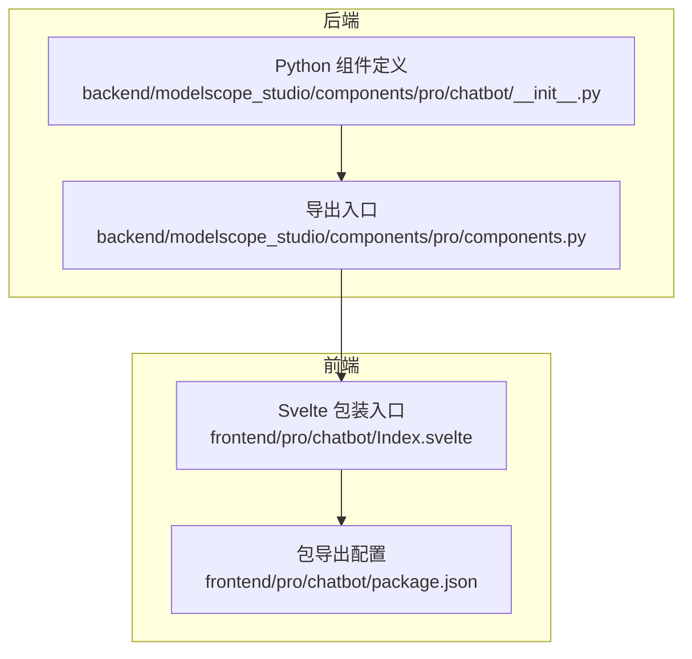
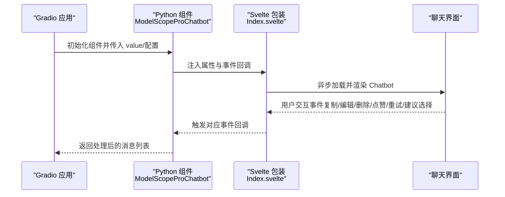
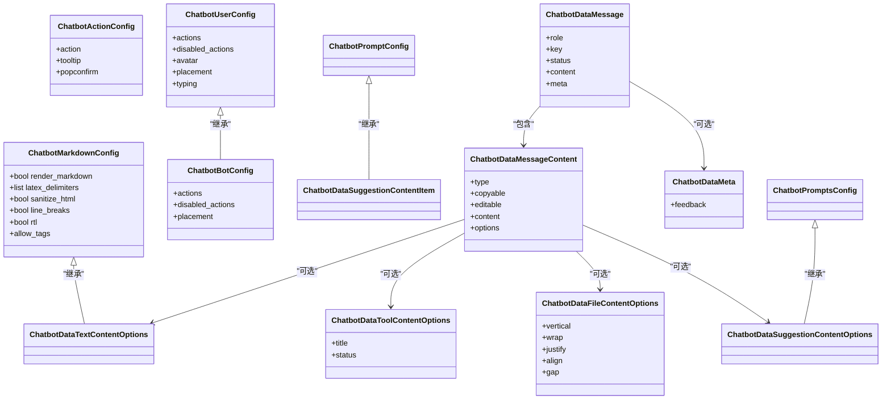
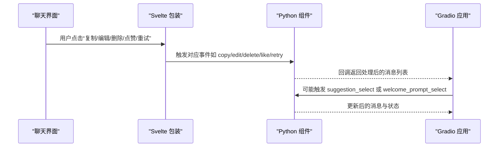
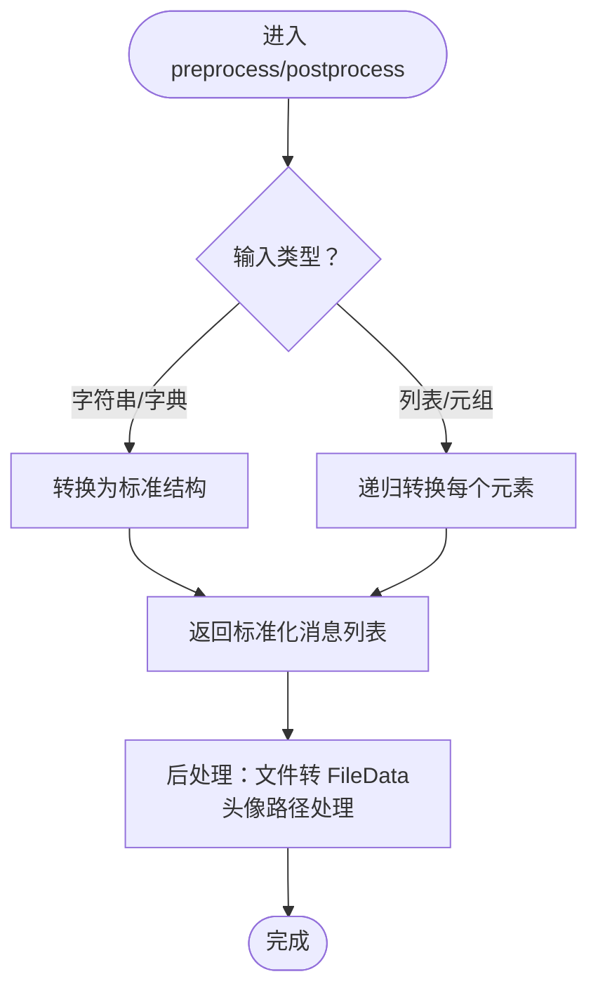
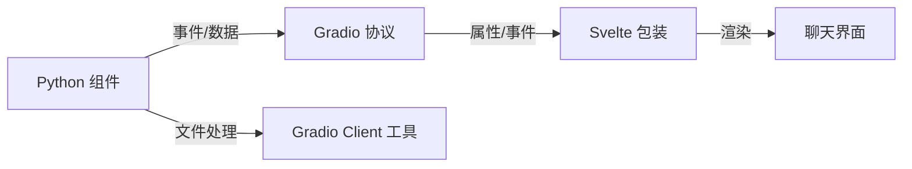

# 集成示例

<cite>
**本文引用的文件**
- [backend/modelscope_studio/components/pro/chatbot/__init__.py](file://backend/modelscope_studio/components/pro/chatbot/__init__.py)
- [backend/modelscope_studio/components/pro/components.py](file://backend/modelscope_studio/components/pro/components.py)
- [frontend/pro/chatbot/Index.svelte](file://frontend/pro/chatbot/Index.svelte)
- [frontend/pro/chatbot/package.json](file://frontend/pro/chatbot/package.json)
- [docs/layout_templates/chatbot/README.md](file://docs/layout_templates/chatbot/README.md)
- [docs/layout_templates/chatbot/app.py](file://docs/layout_templates/chatbot/app.py)
</cite>

## 目录

1. [简介](#简介)
2. [项目结构](#项目结构)
3. [核心组件](#核心组件)
4. [架构总览](#架构总览)
5. [详细组件分析](#详细组件分析)
6. [依赖分析](#依赖分析)
7. [性能考虑](#性能考虑)
8. [故障排查指南](#故障排查指南)
9. [结论](#结论)
10. [附录](#附录)

## 简介

本文件面向需要在实际项目中集成 Chatbot 聊天机器人组件的开发者，提供从后端 Python 组件到前端 Svelte 包装层的完整集成示例与最佳实践。内容覆盖与 Gradio 应用的集成方式、消息数据模型与事件绑定、与外部 AI 服务的连接思路、与数据库的交互策略、以及多种典型使用场景（客服机器人、问答系统、内容创作助手）的落地方法。同时给出部署指引、常见问题解决方案与性能优化建议。

## 项目结构

Chatbot 组件由后端 Python 组件与前端 Svelte 包装两部分组成：

- 后端：基于 Gradio 的自定义组件，负责消息数据模型、预处理/后处理、静态资源托管与事件绑定。
- 前端：Svelte 包装层，负责将 Gradio 属性映射到内部聊天组件，并通过异步加载实现按需渲染。

图表来源

- [backend/modelscope_studio/components/pro/chatbot/**init**.py:286-495](file://backend/modelscope_studio/components/pro/chatbot/__init__.py#L286-L495)
- [backend/modelscope_studio/components/pro/components.py:1-8](file://backend/modelscope_studio/components/pro/components.py#L1-L8)
- [frontend/pro/chatbot/Index.svelte:1-90](file://frontend/pro/chatbot/Index.svelte#L1-L90)
- [frontend/pro/chatbot/package.json:1-15](file://frontend/pro/chatbot/package.json#L1-L15)

章节来源

- [backend/modelscope_studio/components/pro/chatbot/**init**.py:286-495](file://backend/modelscope_studio/components/pro/chatbot/__init__.py#L286-L495)
- [backend/modelscope_studio/components/pro/components.py:1-8](file://backend/modelscope_studio/components/pro/components.py#L1-L8)
- [frontend/pro/chatbot/Index.svelte:1-90](file://frontend/pro/chatbot/Index.svelte#L1-L90)
- [frontend/pro/chatbot/package.json:1-15](file://frontend/pro/chatbot/package.json#L1-L15)

## 核心组件

- 消息数据模型与配置类族
  - 文本、工具、文件、建议等多类型内容选项
  - 用户/机器人消息样式、头像、动作按钮、元信息等
- 组件主体
  - 支持高度控制、自动滚动、欢迎页、Markdown 渲染、用户/机器人配置
  - 事件绑定：变更、复制、编辑、删除、点赞、重试、建议选择、欢迎提示选择
- 预处理与后处理
  - 将前端传入的消息内容转换为后端可识别格式；将文件路径转换为 Gradio FileData 并注入 MIME 类型
  - 头像与静态资源路径处理

章节来源

- [backend/modelscope_studio/components/pro/chatbot/**init**.py:14-284](file://backend/modelscope_studio/components/pro/chatbot/__init__.py#L14-L284)
- [backend/modelscope_studio/components/pro/chatbot/**init**.py:286-495](file://backend/modelscope_studio/components/pro/chatbot/__init__.py#L286-L495)

## 架构总览

下图展示了从 Gradio 应用到 Chatbot 组件的调用链路与数据流：

图表来源

- [backend/modelscope_studio/components/pro/chatbot/**init**.py:286-314](file://backend/modelscope_studio/components/pro/chatbot/__init__.py#L286-L314)
- [frontend/pro/chatbot/Index.svelte:67-89](file://frontend/pro/chatbot/Index.svelte#L67-L89)

## 详细组件分析

### 数据模型与消息结构

- 内容类型
  - 文本、工具（含标题与状态）、文件（支持多文件，自动注入 FileData）、建议（Prompts）
- 消息对象
  - 角色（user/assistant/system/divider）、键值、状态（pending/done）、内容、动作、元信息
- Markdown 与渲染
  - 可配置是否渲染 Markdown、LaTeX 分隔符、HTML 清洗、换行、RTL、允许标签
- 文件展示布局
  - Flex 布局参数（垂直/换行/对齐/间距等），并可分别配置图片/视频/音频属性
- 动作按钮
  - 用户与机器人的动作集合可独立配置，支持 Tooltip 与确认气泡

图表来源

- [backend/modelscope_studio/components/pro/chatbot/**init**.py:14-284](file://backend/modelscope_studio/components/pro/chatbot/__init__.py#L14-L284)

章节来源

- [backend/modelscope_studio/components/pro/chatbot/**init**.py:14-284](file://backend/modelscope_studio/components/pro/chatbot/__init__.py#L14-L284)

### 事件绑定与交互流程

- 事件列表
  - change、copy、edit、delete、like、retry、suggestion_select、welcome_prompt_select
- 绑定机制
  - 通过 Gradio 事件监听器在初始化时绑定相应回调，触发后更新内部状态并回传给应用

图表来源

- [backend/modelscope_studio/components/pro/chatbot/**init**.py:289-314](file://backend/modelscope_studio/components/pro/chatbot/__init__.py#L289-L314)

章节来源

- [backend/modelscope_studio/components/pro/chatbot/**init**.py:289-314](file://backend/modelscope_studio/components/pro/chatbot/__init__.py#L289-L314)

### 预处理与后处理逻辑

- 预处理
  - 将文件类内容中的 FileData 路径提取为字符串，便于跨层传输
- 后处理
  - 将文件路径转换为 Gradio FileData，自动推断 MIME 类型与大小，支持 HTTP/本地路径
  - 头像与静态资源路径统一通过 serve_static_file 处理

图表来源

- [backend/modelscope_studio/components/pro/chatbot/**init**.py:400-495](file://backend/modelscope_studio/components/pro/chatbot/__init__.py#L400-L495)

章节来源

- [backend/modelscope_studio/components/pro/chatbot/**init**.py:400-495](file://backend/modelscope_studio/components/pro/chatbot/__init__.py#L400-L495)

### 与 Gradio 应用的集成

- 导出与导入
  - 在后端通过导出入口统一暴露组件，前端以 Svelte 包装形式被 Gradio 解析
- 属性传递
  - Svelte 包装层将 Gradio 共享属性（root、api_prefix、theme）透传至组件
- 示例模板
  - 提供应用模板与演示页面，展示多对话管理、历史操作、中断通知、输入建议、附件上传等功能

章节来源

- [backend/modelscope_studio/components/pro/components.py:1-8](file://backend/modelscope_studio/components/pro/components.py#L1-L8)
- [frontend/pro/chatbot/Index.svelte:14-89](file://frontend/pro/chatbot/Index.svelte#L14-L89)
- [docs/layout_templates/chatbot/README.md:1-20](file://docs/layout_templates/chatbot/README.md#L1-L20)
- [docs/layout_templates/chatbot/app.py:1-7](file://docs/layout_templates/chatbot/app.py#L1-L7)

## 依赖分析

- 组件耦合
  - 后端组件与前端包装通过 Gradio 协议解耦，前端仅负责属性映射与异步加载
- 外部依赖
  - 使用 Gradio 的数据类与事件系统，文件处理依赖 Gradio Client 工具
- 包导出
  - 前端包以 Gradio 兼容方式导出入口，确保在 Gradio 生态中可直接使用

图表来源

- [backend/modelscope_studio/components/pro/chatbot/**init**.py:286-495](file://backend/modelscope_studio/components/pro/chatbot/__init__.py#L286-L495)
- [frontend/pro/chatbot/package.json:4-13](file://frontend/pro/chatbot/package.json#L4-L13)

章节来源

- [backend/modelscope_studio/components/pro/chatbot/**init**.py:286-495](file://backend/modelscope_studio/components/pro/chatbot/__init__.py#L286-L495)
- [frontend/pro/chatbot/package.json:4-13](file://frontend/pro/chatbot/package.json#L4-L13)

## 性能考虑

- 渲染优化
  - 使用异步加载组件，避免首屏阻塞
  - 控制消息数量与文件大小，必要时分页或懒加载
- 事件处理
  - 对高频事件（如复制/编辑）进行节流或去抖
- 文件处理
  - 优先使用 HTTP 链接减少本地读取开销；本地文件自动计算大小与 MIME 类型
- 主题与样式
  - 通过 Gradio 共享主题属性统一渲染，减少重复计算

## 故障排查指南

- 无法显示文件内容
  - 检查文件路径是否正确，HTTP 链接是否可达；确认后处理阶段已转换为 FileData
- 头像不显示
  - 确认头像路径已通过静态资源处理函数转换
- 事件未触发
  - 确认事件名称拼写一致且已在初始化时绑定
- 消息状态异常
  - pending 状态不会渲染动作区，检查状态设置逻辑

章节来源

- [backend/modelscope_studio/components/pro/chatbot/**init**.py:390-495](file://backend/modelscope_studio/components/pro/chatbot/__init__.py#L390-L495)

## 结论

Chatbot 组件通过清晰的数据模型、完善的事件体系与前后端解耦设计，能够高效支撑多种聊天场景。结合 Gradio 应用模板与 Svelte 包装层，开发者可以快速搭建具备多轮对话、历史管理、文件上传与反馈能力的智能聊天界面，并在此基础上扩展与优化。

## 附录

### 场景化集成要点

- 客服机器人
  - 使用欢迎页与提示词引导用户；启用“重试”与“编辑”动作提升纠错效率
- 问答系统
  - 通过“建议选择”与“欢迎提示选择”快速生成问题；开启 LaTeX 渲染以支持公式
- 内容创作助手
  - 支持多类型文件上传与展示；利用“点赞/反馈”收集用户偏好

### 部署与运行

- 运行示例应用模板
  - 使用文档模板提供的入口脚本启动队列与服务
- 包导出与安装
  - 前端包以 Gradio 兼容方式导出，可在 Gradio 环境中直接引用

章节来源

- [docs/layout_templates/chatbot/app.py:1-7](file://docs/layout_templates/chatbot/app.py#L1-L7)
- [frontend/pro/chatbot/package.json:4-13](file://frontend/pro/chatbot/package.json#L4-L13)
