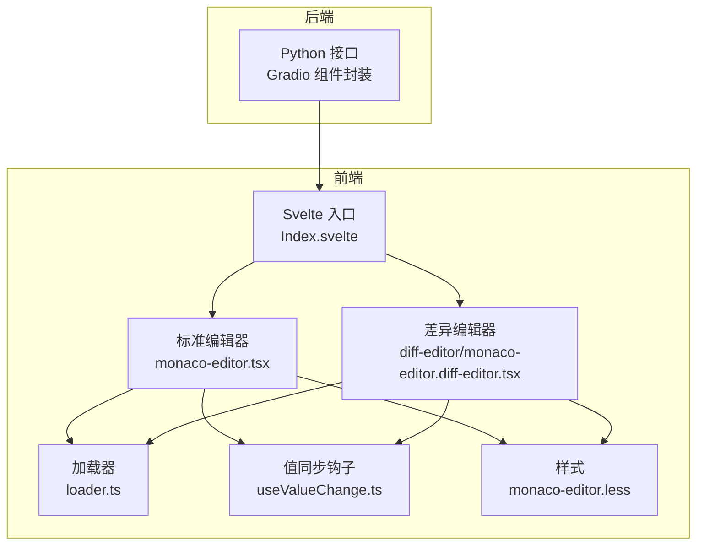
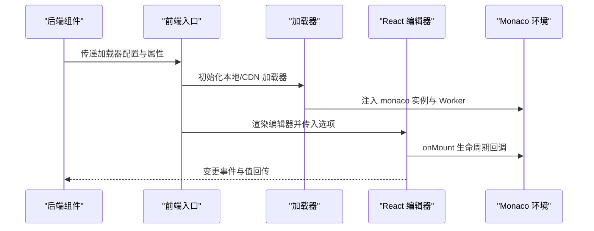
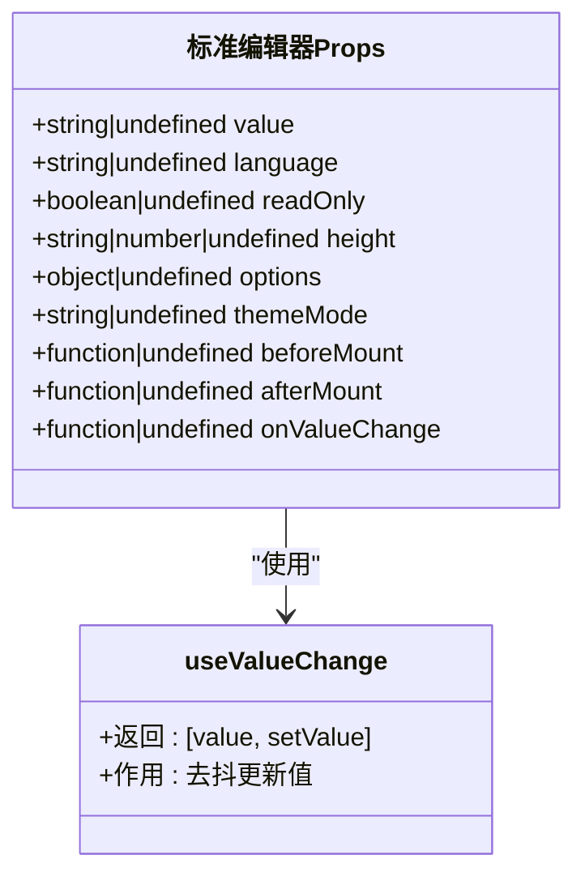
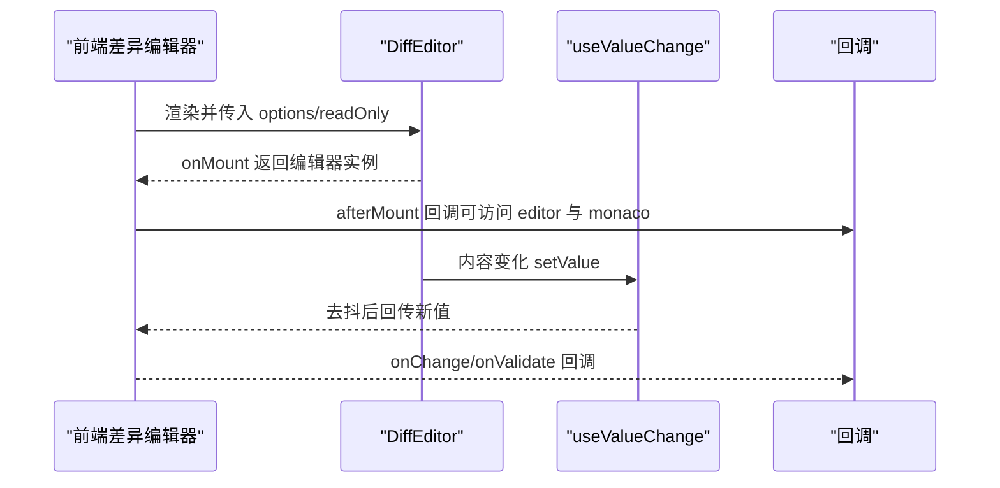
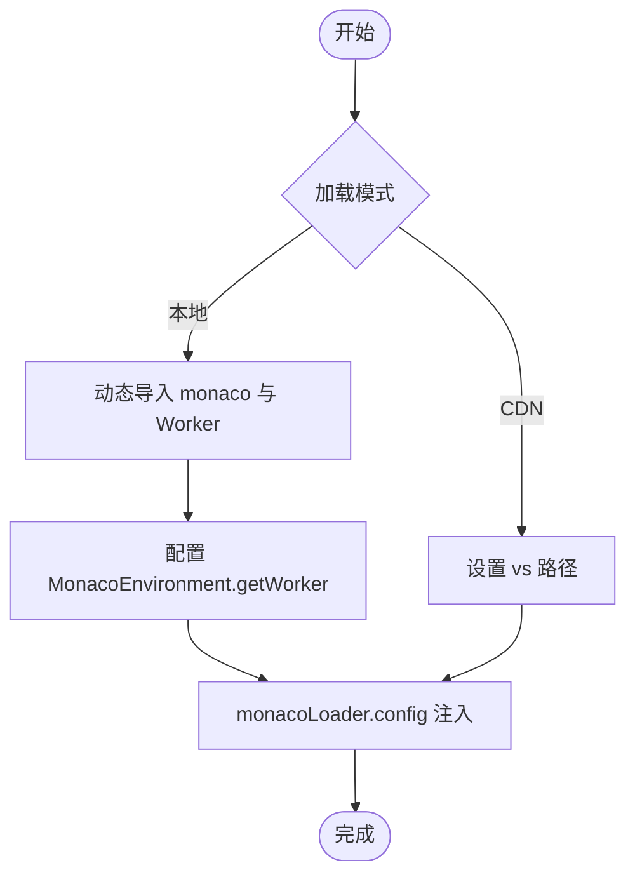
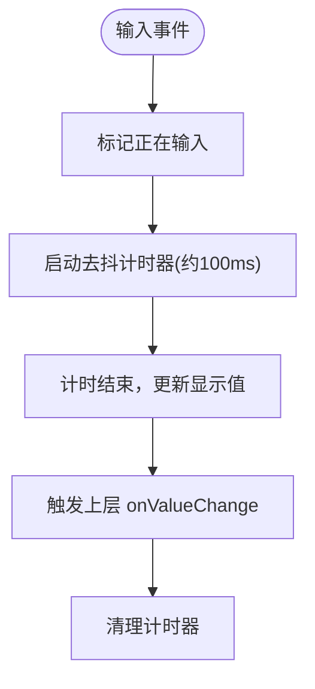
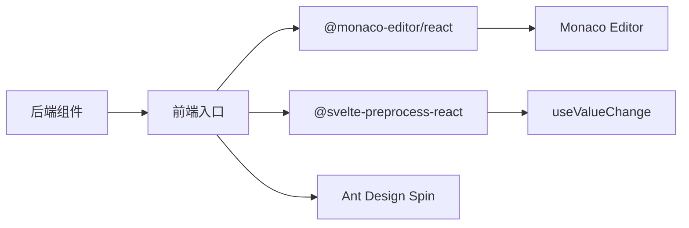

# MonacoEditor 代码编辑器

<cite>
**本文档引用的文件**
- [backend/modelscope_studio/components/pro/monaco_editor/__init__.py](file://backend/modelscope_studio/components/pro/monaco_editor/__init__.py)
- [backend/modelscope_studio/components/pro/monaco_editor/diff_editor/__init__.py](file://backend/modelscope_studio/components/pro/monaco_editor/diff_editor/__init__.py)
- [backend/modelscope_studio/components/pro/components.py](file://backend/modelscope_studio/components/pro/components.py)
- [frontend/pro/monaco-editor/monaco-editor.tsx](file://frontend/pro/monaco-editor/monaco-editor.tsx)
- [frontend/pro/monaco-editor/diff-editor/monaco-editor.diff-editor.tsx](file://frontend/pro/monaco-editor/diff-editor/monaco-editor.diff-editor.tsx)
- [frontend/pro/monaco-editor/loader.ts](file://frontend/pro/monaco-editor/loader.ts)
- [frontend/pro/monaco-editor/useValueChange.ts](file://frontend/pro/monaco-editor/useValueChange.ts)
- [frontend/pro/monaco-editor/monaco-editor.less](file://frontend/pro/monaco-editor/monaco-editor.less)
- [docs/components/pro/monaco_editor/README.md](file://docs/components/pro/monaco_editor/README.md)
- [docs/components/pro/monaco_editor/README-zh_CN.md](file://docs/components/pro/monaco_editor/README-zh_CN.md)
</cite>

## 目录

1. [简介](#简介)
2. [项目结构](#项目结构)
3. [核心组件](#核心组件)
4. [架构总览](#架构总览)
5. [详细组件分析](#详细组件分析)
6. [依赖关系分析](#依赖关系分析)
7. [性能考虑](#性能考虑)
8. [故障排除指南](#故障排除指南)
9. [结论](#结论)
10. [附录](#附录)

## 简介

本文件面向需要在应用中集成专业代码编辑器的开发者，系统性介绍基于 Monaco Editor 的代码编辑能力：语法高亮、智能提示、代码补全、Diff 编辑器等。文档覆盖组件的配置项（编辑器选项、JavaScript 自定义、差异编辑器等）、使用示例（不同编程语言支持与自定义配置）、编辑器加载机制与性能优化策略、主题配置、快捷键绑定以及插件扩展思路。内容兼顾技术深度与可读性，帮助快速落地高质量的代码编辑体验。

## 项目结构

该组件位于前后端分层清晰的工程中，采用“Python 后端 + React 前端 + Svelte 预处理”的混合架构：

- 后端通过 Gradio 组件封装，提供统一的 Python API 与事件绑定
- 前端使用 @monaco-editor/react 作为渲染层，配合本地/CDN 加载器初始化 Monaco 环境
- 提供标准编辑器与 Diff 编辑器两种形态，支持主题切换、只读模式、行定位、加载态定制等

图表来源

- [frontend/pro/monaco-editor/monaco-editor.tsx:1-95](file://frontend/pro/monaco-editor/monaco-editor.tsx#L1-L95)
- [frontend/pro/monaco-editor/diff-editor/monaco-editor.diff-editor.tsx:1-160](file://frontend/pro/monaco-editor/diff-editor/monaco-editor.diff-editor.tsx#L1-L160)
- [frontend/pro/monaco-editor/loader.ts:1-95](file://frontend/pro/monaco-editor/loader.ts#L1-L95)
- [frontend/pro/monaco-editor/useValueChange.ts:1-44](file://frontend/pro/monaco-editor/useValueChange.ts#L1-L44)
- [frontend/pro/monaco-editor/monaco-editor.less:1-7](file://frontend/pro/monaco-editor/monaco-editor.less#L1-L7)

章节来源

- [backend/modelscope_studio/components/pro/monaco_editor/**init**.py:1-107](file://backend/modelscope_studio/components/pro/monaco_editor/__init__.py#L1-L107)
- [backend/modelscope_studio/components/pro/monaco_editor/diff_editor/**init**.py:68-105](file://backend/modelscope_studio/components/pro/monaco_editor/diff_editor/__init__.py#L68-L105)
- [backend/modelscope_studio/components/pro/components.py:1-8](file://backend/modelscope_studio/components/pro/components.py#L1-L8)

## 核心组件

- 标准编辑器组件：提供基础代码编辑能力，支持主题模式、只读、高度、加载态、事件绑定、JavaScript 自定义钩子等
- 差异编辑器组件（MonacoEditorDiffEditor）：用于对比两段文本的差异，支持独立设置左右两侧语言、行定位、验证回调等
  - **后端导出入口**：`MonacoEditorDiffEditor` 通过 [backend/modelscope_studio/components/pro/**init**.py](file://backend/modelscope_studio/components/pro/__init__.py) 导出，导入方式为 `from modelscope_studio.components.pro import MonacoEditorDiffEditor`
  - **与标准编辑器的关系**：MonacoEditorDiffEditor 是 MonacoEditor 的子组件，两者均属于 `pro` 模块。标准编辑器用于单文件编辑，差异编辑器专用于展示两个版本代码的 diff 对比。
- 加载器：支持本地打包与 CDN 两种加载模式，自动注入 Monaco 环境与多语言 Worker
- 值同步钩子：在高频输入场景下进行去抖处理，避免频繁触发上层逻辑

章节来源

- [backend/modelscope_studio/components/pro/monaco_editor/**init**.py:16-107](file://backend/modelscope_studio/components/pro/monaco_editor/__init__.py#L16-L107)
- [backend/modelscope_studio/components/pro/monaco_editor/diff_editor/**init**.py:68-105](file://backend/modelscope_studio/components/pro/monaco_editor/diff_editor/__init__.py#L68-L105)
- [frontend/pro/monaco-editor/monaco-editor.tsx:12-95](file://frontend/pro/monaco-editor/monaco-editor.tsx#L12-L95)
- [frontend/pro/monaco-editor/diff-editor/monaco-editor.diff-editor.tsx:19-160](file://frontend/pro/monaco-editor/diff-editor/monaco-editor.diff-editor.tsx#L19-L160)
- [frontend/pro/monaco-editor/loader.ts:27-95](file://frontend/pro/monaco-editor/loader.ts#L27-L95)
- [frontend/pro/monaco-editor/useValueChange.ts:4-44](file://frontend/pro/monaco-editor/useValueChange.ts#L4-L44)

## 架构总览

整体调用链路如下：

- 后端组件实例化时设置加载器模式、语言、只读、高度等参数
- 前端入口根据加载器配置初始化 Monaco 环境（本地或 CDN）
- React 层通过 @monaco-editor/react 渲染编辑器，桥接生命周期钩子与事件
- 值变更通过 useValueChange 进行节流，确保性能与一致性

图表来源

- [frontend/pro/monaco-editor/loader.ts:3-95](file://frontend/pro/monaco-editor/loader.ts#L3-L95)
- [frontend/pro/monaco-editor/monaco-editor.tsx:38-92](file://frontend/pro/monaco-editor/monaco-editor.tsx#L38-L92)
- [frontend/pro/monaco-editor/diff-editor/monaco-editor.diff-editor.tsx:67-158](file://frontend/pro/monaco-editor/diff-editor/monaco-editor.diff-editor.tsx#L67-L158)

## 详细组件分析

### 标准编辑器组件

- 职责：封装 Monaco Editor 的 React 组件，提供统一的属性接口与事件绑定
- 关键特性
  - 主题模式：根据 themeMode 切换 vs-dark 或 light
  - 只读模式：通过 readOnly 控制编辑态
  - 高度控制：height 支持数值（px）与 CSS 字符串
  - 加载态：支持自定义 loading 插槽或默认 Spin
  - 事件绑定：支持 mount/change/validate 等事件
  - JavaScript 自定义：before_mount/after_mount 可传入 JS 字符串函数，分别在加载前/后执行
  - 值同步：内部使用 useValueChange 去抖处理，避免高频输入导致的性能问题

图表来源

- [frontend/pro/monaco-editor/monaco-editor.tsx:12-95](file://frontend/pro/monaco-editor/monaco-editor.tsx#L12-L95)
- [frontend/pro/monaco-editor/useValueChange.ts:4-44](file://frontend/pro/monaco-editor/useValueChange.ts#L4-L44)

章节来源

- [frontend/pro/monaco-editor/monaco-editor.tsx:12-95](file://frontend/pro/monaco-editor/monaco-editor.tsx#L12-L95)
- [frontend/pro/monaco-editor/monaco-editor.less:1-7](file://frontend/pro/monaco-editor/monaco-editor.less#L1-L7)
- [backend/modelscope_studio/components/pro/monaco_editor/**init**.py:16-107](file://backend/modelscope_studio/components/pro/monaco_editor/__init__.py#L16-L107)

### 差异编辑器组件

- 职责：对比两段文本的差异，支持独立设置左右语言、行定位、只读、验证回调等
- 关键特性
  - 左右两侧值：original（左侧原值）、value/modified（右侧修改值）
  - 语言分离：original_language 与 modified_language 可独立设置
  - 行定位：line 指定初始可视行，支持运行时更新
  - 验证回调：onValidate 获取校验结果，便于集成错误标记
  - 事件绑定：onChange 在右侧编辑器内容变化时触发
  - 加载态：支持自定义 loading 插槽或默认 Spin

图表来源

- [frontend/pro/monaco-editor/diff-editor/monaco-editor.diff-editor.tsx:35-159](file://frontend/pro/monaco-editor/diff-editor/monaco-editor.diff-editor.tsx#L35-L159)

章节来源

- [frontend/pro/monaco-editor/diff-editor/monaco-editor.diff-editor.tsx:19-160](file://frontend/pro/monaco-editor/diff-editor/monaco-editor.diff-editor.tsx#L19-L160)
- [backend/modelscope_studio/components/pro/monaco_editor/diff_editor/**init**.py:68-105](file://backend/modelscope_studio/components/pro/monaco_editor/diff_editor/__init__.py#L68-L105)

### 加载器与环境初始化

- 本地加载（推荐离线/内网部署）
  - 动态导入 monaco-editor 与各类语言 Worker
  - 设置 MonacoEnvironment.getWorker，按标签选择对应 Worker
  - 通过 monacoLoader.config 注入 monaco 实例
- CDN 加载
  - 通过 monacoLoader.config 指定 vs 路径
  - 适用于外网可访问的场景
- 并发初始化
  - 使用全局 Promise 避免重复初始化
  - 支持多次调用的安全完成回调

图表来源

- [frontend/pro/monaco-editor/loader.ts:27-95](file://frontend/pro/monaco-editor/loader.ts#L27-L95)

章节来源

- [frontend/pro/monaco-editor/loader.ts:3-95](file://frontend/pro/monaco-editor/loader.ts#L3-L95)

### 值同步与去抖策略

- 场景：编辑器高频 onChange 触发，上层逻辑可能昂贵
- 策略：useValueChange 在短时间内合并更新，仅在去抖结束后回传最新值
- 行为：typing 状态与定时器管理，确保输入过程中的流畅体验

图表来源

- [frontend/pro/monaco-editor/useValueChange.ts:14-32](file://frontend/pro/monaco-editor/useValueChange.ts#L14-L32)

章节来源

- [frontend/pro/monaco-editor/useValueChange.ts:4-44](file://frontend/pro/monaco-editor/useValueChange.ts#L4-L44)

## 依赖关系分析

- 组件导出
  - 后端统一导出标准编辑器与差异编辑器类
- 前端依赖
  - @monaco-editor/react：编辑器渲染与事件桥接
  - @svelte-preprocess-react：Svelte 与 React 的互操作
  - Ant Design Spin：默认加载态组件
  - useValueChange：自定义 Hook，负责值同步与去抖
- 外部接口
  - Monaco Editor 官方类型与 API
  - Gradio 事件监听与属性透传

图表来源

- [backend/modelscope_studio/components/pro/components.py:1-8](file://backend/modelscope_studio/components/pro/components.py#L1-L8)
- [frontend/pro/monaco-editor/monaco-editor.tsx:1-10](file://frontend/pro/monaco-editor/monaco-editor.tsx#L1-L10)
- [frontend/pro/monaco-editor/diff-editor/monaco-editor.diff-editor.tsx:1-17](file://frontend/pro/monaco-editor/diff-editor/monaco-editor.diff-editor.tsx#L1-L17)

章节来源

- [backend/modelscope_studio/components/pro/components.py:1-8](file://backend/modelscope_studio/components/pro/components.py#L1-L8)

## 性能考虑

- 去抖更新：useValueChange 将高频变更合并，减少上层处理压力
- 按需加载：CDN 模式下仅加载必要资源；本地模式按标签选择 Worker，避免无关语言解析开销
- 渲染隔离：编辑器容器独立样式，避免全局样式污染
- 事件最小化：仅在必要时触发 onChange/validate，避免不必要的重渲染
- 行定位：Diff 编辑器支持 line 参数，避免全量滚动查找

## 故障排除指南

- 编辑器未加载
  - 检查加载器初始化是否完成（本地/CDN）
  - 确认 monacoLoader.config 是否正确设置
- Worker 加载失败
  - 核对 Worker 导入路径与标签匹配（json/css/html/typescript/javascript）
  - 若使用 CDN，请确认 vs 路径可达
- 输入卡顿
  - 检查是否频繁订阅 onChange，建议使用去抖策略
  - 降低复杂度：禁用不必要的语法高亮/自动补全选项
- Diff 编辑器不显示差异
  - 确认 original 与 modified 值已正确传入
  - 检查语言设置是否一致或独立配置
- 主题不生效
  - 确认 themeMode 与 Monaco 主题映射（dark->vs-dark，light->light）

章节来源

- [frontend/pro/monaco-editor/loader.ts:53-78](file://frontend/pro/monaco-editor/loader.ts#L53-L78)
- [frontend/pro/monaco-editor/monaco-editor.tsx:83-88](file://frontend/pro/monaco-editor/monaco-editor.tsx#L83-L88)
- [frontend/pro/monaco-editor/diff-editor/monaco-editor.diff-editor.tsx:127-153](file://frontend/pro/monaco-editor/diff-editor/monaco-editor.diff-editor.tsx#L127-L153)

## 结论

该组件以 Gradio 为后端接口，结合 @monaco-editor/react 与自研加载器，提供了稳定、可扩展的代码编辑能力。通过本地/CDN 双模式加载、去抖值同步、主题与只读控制、Diff 对比等特性，能够满足大多数应用场景的需求。建议在生产环境中优先使用本地加载以提升稳定性，并根据业务场景合理配置语言、Worker 与编辑器选项，以获得最佳性能与用户体验。

## 附录

### 配置项速查（标准编辑器）

- value：编辑器初始值
- language：编辑器语言（支持所有 Monaco 基础语言）
- read_only：是否只读
- height：高度（数值为 px，字符串为 CSS 单位）
- options：编辑器构造选项（参考 Monaco 官方类型）
- theme_mode：主题模式（dark/light）
- before_mount/after_mount：JS 字符串函数，分别在加载前/后执行
- loading：加载文案或自定义加载插槽
- on_value_change：值变更回调

章节来源

- [docs/components/pro/monaco_editor/README.md:48-64](file://docs/components/pro/monaco_editor/README.md#L48-L64)
- [docs/components/pro/monaco_editor/README-zh_CN.md:48-64](file://docs/components/pro/monaco_editor/README-zh_CN.md#L48-L64)

### 配置项速查（差异编辑器）

- value：右侧修改值（与 modified 二选一）
- original：左侧原始值
- language：统一语言（若未单独设置）
- original_language：左侧语言
- modified_language：右侧语言
- line：初始可视行
- read_only：是否只读
- options：编辑器构造选项
- before_mount/after_mount：JS 字符串函数
- loading：加载文案或自定义加载插槽
- on_change：右侧内容变更回调
- on_validate：校验回调

章节来源

- [docs/components/pro/monaco_editor/README.md:48-64](file://docs/components/pro/monaco_editor/README.md#L48-L64)
- [docs/components/pro/monaco_editor/README-zh_CN.md:48-64](file://docs/components/pro/monaco_editor/README-zh_CN.md#L48-L64)
