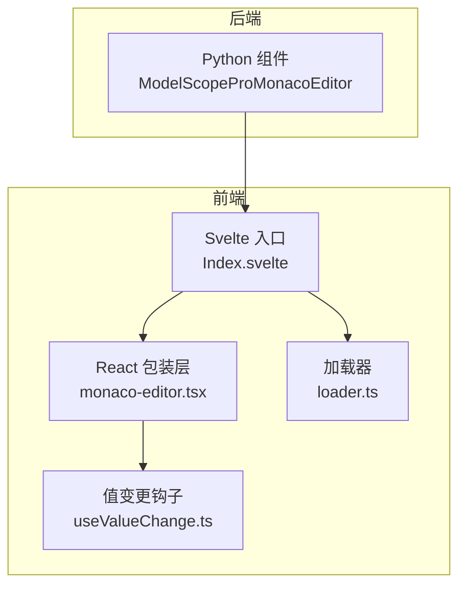
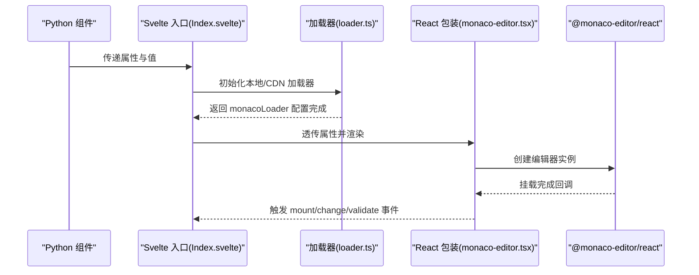
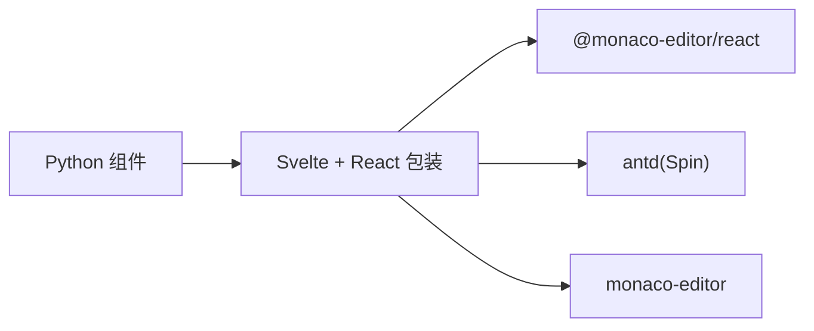
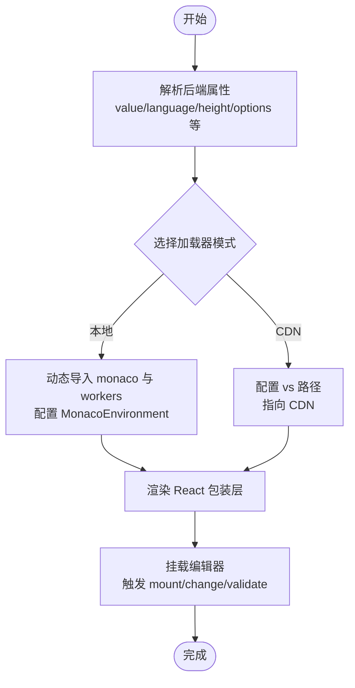

# 基础使用

<cite>
**本文引用的文件**
- [frontend/pro/monaco-editor/Index.svelte](file://frontend/pro/monaco-editor/Index.svelte)
- [frontend/pro/monaco-editor/monaco-editor.tsx](file://frontend/pro/monaco-editor/monaco-editor.tsx)
- [frontend/pro/monaco-editor/loader.ts](file://frontend/pro/monaco-editor/loader.ts)
- [frontend/pro/monaco-editor/useValueChange.ts](file://frontend/pro/monaco-editor/useValueChange.ts)
- [backend/modelscope_studio/components/pro/monaco_editor/__init__.py](file://backend/modelscope_studio/components/pro/monaco_editor/__init__.py)
- [docs/components/pro/monaco_editor/README.md](file://docs/components/pro/monaco_editor/README.md)
- [docs/components/pro/monaco_editor/demos/monaco_editor_options.py](file://docs/components/pro/monaco_editor/demos/monaco_editor_options.py)
- [frontend/package.json](file://frontend/package.json)
</cite>

## 目录

1. [简介](#简介)
2. [项目结构](#项目结构)
3. [核心组件](#核心组件)
4. [架构总览](#架构总览)
5. [详细组件分析](#详细组件分析)
6. [依赖分析](#依赖分析)
7. [性能考虑](#性能考虑)
8. [故障排查指南](#故障排查指南)
9. [结论](#结论)
10. [附录](#附录)

## 简介

本章节面向初学者，介绍如何在 ModelScope Studio 的 Pro 组件体系中快速上手使用 MonacoEditor。内容涵盖：

- 最简单的使用示例：基础文本编辑、语言设置、高度配置
- 常用参数说明：language、height、options 的使用方法
- 编辑器初始化流程与基本配置项
- 提供可直接参考的示例路径与运行效果说明

## 项目结构

MonacoEditor 在前端采用 Svelte + React 包装的方式集成，后端以 Gradio 组件形式暴露给 Python 使用。关键目录与文件如下：

- 前端组件入口：frontend/pro/monaco-editor/Index.svelte
- React 包装层：frontend/pro/monaco-editor/monaco-editor.tsx
- 加载器：frontend/pro/monaco-editor/loader.ts
- 值变更处理：frontend/pro/monaco-editor/useValueChange.ts
- 后端组件定义：backend/modelscope_studio/components/pro/monaco_editor/**init**.py
- 文档与示例：docs/components/pro/monaco_editor/README.md、demos/monaco_editor_options.py
- 依赖声明：frontend/package.json

图表来源

- [frontend/pro/monaco-editor/Index.svelte:1-100](file://frontend/pro/monaco-editor/Index.svelte#L1-L100)
- [frontend/pro/monaco-editor/monaco-editor.tsx:1-94](file://frontend/pro/monaco-editor/monaco-editor.tsx#L1-L94)
- [frontend/pro/monaco-editor/loader.ts:1-95](file://frontend/pro/monaco-editor/loader.ts#L1-L95)
- [frontend/pro/monaco-editor/useValueChange.ts:1-44](file://frontend/pro/monaco-editor/useValueChange.ts#L1-L44)

章节来源

- [frontend/pro/monaco-editor/Index.svelte:1-100](file://frontend/pro/monaco-editor/Index.svelte#L1-L100)
- [frontend/pro/monaco-editor/monaco-editor.tsx:1-94](file://frontend/pro/monaco-editor/monaco-editor.tsx#L1-L94)
- [frontend/pro/monaco-editor/loader.ts:1-95](file://frontend/pro/monaco-editor/loader.ts#L1-L95)
- [frontend/pro/monaco-editor/useValueChange.ts:1-44](file://frontend/pro/monaco-editor/useValueChange.ts#L1-L44)
- [backend/modelscope_studio/components/pro/monaco_editor/**init**.py:1-107](file://backend/modelscope_studio/components/pro/monaco_editor/__init__.py#L1-L107)
- [docs/components/pro/monaco_editor/README.md:1-89](file://docs/components/pro/monaco_editor/README.md#L1-L89)
- [docs/components/pro/monaco_editor/demos/monaco_editor_options.py:1-34](file://docs/components/pro/monaco_editor/demos/monaco_editor_options.py#L1-L34)
- [frontend/package.json:1-59](file://frontend/package.json#L1-L59)

## 核心组件

- 后端组件：ModelScopeProMonacoEditor（支持语言、高度、选项、只读、挂载前后回调等）
- 前端包装：MonacoEditor（基于 @monaco-editor/react，负责渲染与事件桥接）
- 加载器：支持本地打包或 CDN 模式加载 Monaco 依赖
- 值变更钩子：useValueChange（防抖合并输入，避免频繁触发）

章节来源

- [backend/modelscope_studio/components/pro/monaco_editor/**init**.py:46-85](file://backend/modelscope_studio/components/pro/monaco_editor/__init__.py#L46-L85)
- [frontend/pro/monaco-editor/monaco-editor.tsx:12-19](file://frontend/pro/monaco-editor/monaco-editor.tsx#L12-L19)
- [frontend/pro/monaco-editor/loader.ts:27-94](file://frontend/pro/monaco-editor/loader.ts#L27-L94)
- [frontend/pro/monaco-editor/useValueChange.ts:4-43](file://frontend/pro/monaco-editor/useValueChange.ts#L4-L43)

## 架构总览

MonacoEditor 的调用链路从 Python 组件到 Svelte 入口，再到 React 包装层，最终由 @monaco-editor/react 渲染。加载器负责在本地或 CDN 模式下初始化 Monaco 环境。

图表来源

- [frontend/pro/monaco-editor/Index.svelte:64-99](file://frontend/pro/monaco-editor/Index.svelte#L64-L99)
- [frontend/pro/monaco-editor/loader.ts:27-94](file://frontend/pro/monaco-editor/loader.ts#L27-L94)
- [frontend/pro/monaco-editor/monaco-editor.tsx:21-92](file://frontend/pro/monaco-editor/monaco-editor.tsx#L21-L92)

## 详细组件分析

### 后端组件：ModelScopeProMonacoEditor

- 支持的关键参数
  - value：编辑器初始值
  - language：语言模式（如 python/javascript 等）
  - height：编辑器高度（数字表示 px，字符串可为 CSS 单位）
  - options：Monaco 编辑器构造选项字典
  - read_only：是否只读
  - before_mount/after_mount：挂载前/后的 JS 回调字符串
  - line：滚动到指定行
  - loading：加载提示文案
  - override_services：覆盖服务配置
  - \_loader：加载器配置（mode/cdn_url）
- 事件
  - mount：编辑器挂载时触发
  - change：编辑器值变化时触发
  - validate：验证标记就绪时触发（部分语言支持）
- 插槽
  - loading：自定义加载态内容

章节来源

- [backend/modelscope_studio/components/pro/monaco_editor/**init**.py:46-85](file://backend/modelscope_studio/components/pro/monaco_editor/__init__.py#L46-L85)
- [docs/components/pro/monaco_editor/README.md:29-89](file://docs/components/pro/monaco_editor/README.md#L29-L89)

### 前端包装：MonacoEditor（React）

- 属性映射
  - 接收来自后端的所有属性，并透传给 @monaco-editor/react 的 Editor
  - 内部处理 themeMode（暗色/亮色）、height、options（含 readOnly）等
  - 提供 onValueChange 与 onChange 的桥接
- 加载态
  - 默认使用 Spin 组件作为加载指示；可通过插槽替换
- 事件桥接
  - onMount/afterMount：统一触发挂载事件
  - onChange：结合 useValueChange 防抖更新

章节来源

- [frontend/pro/monaco-editor/monaco-editor.tsx:12-19](file://frontend/pro/monaco-editor/monaco-editor.tsx#L12-L19)
- [frontend/pro/monaco-editor/monaco-editor.tsx:21-92](file://frontend/pro/monaco-editor/monaco-editor.tsx#L21-L92)

### 加载器：本地/CDN 模式

- 本地模式
  - 动态导入 monaco-editor 及各类 worker
  - 设置 MonacoEnvironment.getWorker，按语言类型分发对应 worker
  - 通过 monacoLoader.config 注入 monaco 实例
- CDN 模式
  - 通过 monacoLoader.config 指定 vs 路径（默认指向公共 CDN）
  - 支持自定义 cdn_url

章节来源

- [frontend/pro/monaco-editor/loader.ts:27-94](file://frontend/pro/monaco-editor/loader.ts#L27-L94)

### 值变更处理：useValueChange

- 设计目标
  - 在用户输入过程中避免频繁触发外部回调
  - 通过定时器将“正在输入”状态与最终值解耦
- 行为
  - 输入开始：进入 typing 状态
  - 输入结束（定时器）：同步显示值并触发 onValueChange
  - 组件卸载：清理定时器

章节来源

- [frontend/pro/monaco-editor/useValueChange.ts:4-43](file://frontend/pro/monaco-editor/useValueChange.ts#L4-L43)

### Svelte 入口：Index.svelte

- 负责
  - 解析后端传入的属性与附加属性
  - 根据 \_loader 配置选择本地或 CDN 加载器
  - 将主题、样式、id、类名、值等透传给 React 包装层
  - 处理可见性与插槽渲染

章节来源

- [frontend/pro/monaco-editor/Index.svelte:14-99](file://frontend/pro/monaco-editor/Index.svelte#L14-L99)

### 示例：最简单使用

- Python 端示例（路径）
  - [docs/components/pro/monaco_editor/demos/monaco_editor_options.py:6-30](file://docs/components/pro/monaco_editor/demos/monaco_editor_options.py#L6-L30)
- 运行效果
  - 展示一个默认高度、带语法高亮的语言编辑器
  - 可通过 language 切换语言，通过 height 调整高度
  - 通过 options 关闭 minimap 与行号等

章节来源

- [docs/components/pro/monaco_editor/demos/monaco_editor_options.py:6-30](file://docs/components/pro/monaco_editor/demos/monaco_editor_options.py#L6-L30)

### 参数详解与最佳实践

- language
  - 作用：启用对应语言的语法高亮与智能感知
  - 建议：与实际内容一致，便于阅读与校验
- height
  - 作用：控制编辑器容器高度
  - 建议：数字单位 px，或使用字符串 CSS 单位（如 "50vh"）
- options
  - 作用：透传 Monaco 构造选项，如 minimap、lineNumbers、scrollbar 等
  - 建议：仅开启必要功能，避免过度装饰影响性能
- read_only
  - 作用：禁用编辑能力
  - 建议：配合 diff 编辑器或只读展示场景
- before_mount/after_mount
  - 作用：在挂载前后注入 JS 逻辑（访问 monaco 或 editor 对象）
  - 建议：谨慎使用，避免阻塞初始化
- line
  - 作用：首次渲染后滚动到指定行
  - 建议：与 value/modified 配合，确保编辑器已就绪后再滚动

章节来源

- [backend/modelscope_studio/components/pro/monaco_editor/**init**.py:46-85](file://backend/modelscope_studio/components/pro/monaco_editor/__init__.py#L46-L85)
- [docs/components/pro/monaco_editor/README.md:29-89](file://docs/components/pro/monaco_editor/README.md#L29-L89)

## 依赖分析

- 前端依赖
  - @monaco-editor/react：编辑器核心封装
  - monaco-editor：编辑器与 worker
  - antd：Spin 加载态组件
  - svelte：组件框架
- 后端依赖
  - Gradio 组件基类与事件系统

图表来源

- [frontend/package.json:17-31](file://frontend/package.json#L17-L31)
- [frontend/pro/monaco-editor/monaco-editor.tsx:1-10](file://frontend/pro/monaco-editor/monaco-editor.tsx#L1-L10)

章节来源

- [frontend/package.json:1-59](file://frontend/package.json#L1-L59)
- [frontend/pro/monaco-editor/monaco-editor.tsx:1-10](file://frontend/pro/monaco-editor/monaco-editor.tsx#L1-L10)

## 性能考虑

- 选项裁剪：通过 options 关闭不必要的特性（如 minimap、滚动条、行号），减少 DOM 与渲染开销
- 防抖输入：useValueChange 在输入阶段延迟触发回调，降低频繁更新带来的抖动
- 本地/CDN 选择：本地模式体积较大但离线可用；CDN 模式首屏更快，需网络稳定
- 只读场景：read_only 可显著减少交互与校验成本

## 故障排查指南

- 编辑器不显示或空白
  - 检查 \_loader 配置（mode/cdn_url）是否正确
  - 确认加载器初始化完成后再渲染编辑器
- 语言高亮无效
  - 确认 language 设置正确且对应语言存在
  - 若使用自定义 worker，请检查 MonacoEnvironment.getWorker 分发逻辑
- 加载态不消失
  - 确认加载器 done() 已被调用
  - 如使用自定义加载态插槽，确保插槽内容正确渲染
- 输入卡顿
  - 检查 options 中是否启用了大量装饰（如 minimap、大字体、复杂主题）
  - 调整 useValueChange 的节流策略或减少外部监听

章节来源

- [frontend/pro/monaco-editor/loader.ts:27-94](file://frontend/pro/monaco-editor/loader.ts#L27-L94)
- [frontend/pro/monaco-editor/monaco-editor.tsx:71-82](file://frontend/pro/monaco-editor/monaco-editor.tsx#L71-L82)
- [frontend/pro/monaco-editor/useValueChange.ts:14-24](file://frontend/pro/monaco-editor/useValueChange.ts#L14-L24)

## 结论

通过上述组件与流程，ModelScope Studio 的 MonacoEditor 能够在 Python 环境中以简洁的参数完成基础编辑需求。建议从最小配置入手（language、height、options），逐步引入只读、挂载回调与行定位等高级能力，以获得更好的开发体验与性能表现。

## 附录

- 快速示例（Python）
  - 示例路径：[docs/components/pro/monaco_editor/demos/monaco_editor_options.py:6-30](file://docs/components/pro/monaco_editor/demos/monaco_editor_options.py#L6-L30)
- API 参考
  - 属性与事件说明：[docs/components/pro/monaco_editor/README.md:29-89](file://docs/components/pro/monaco_editor/README.md#L29-L89)
- 初始化流程图

图表来源

- [frontend/pro/monaco-editor/Index.svelte:64-99](file://frontend/pro/monaco-editor/Index.svelte#L64-L99)
- [frontend/pro/monaco-editor/loader.ts:27-94](file://frontend/pro/monaco-editor/loader.ts#L27-L94)
- [frontend/pro/monaco-editor/monaco-editor.tsx:21-92](file://frontend/pro/monaco-editor/monaco-editor.tsx#L21-L92)
