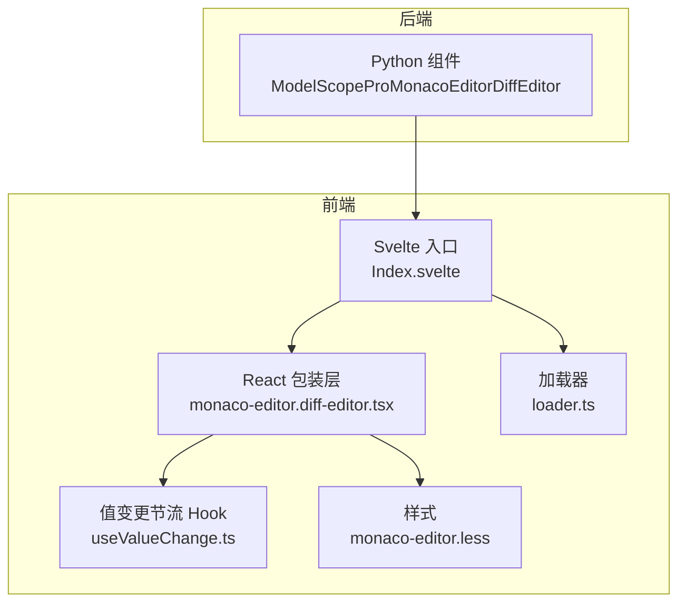
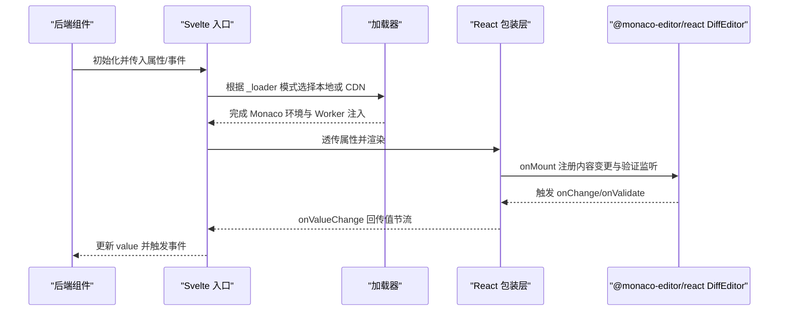
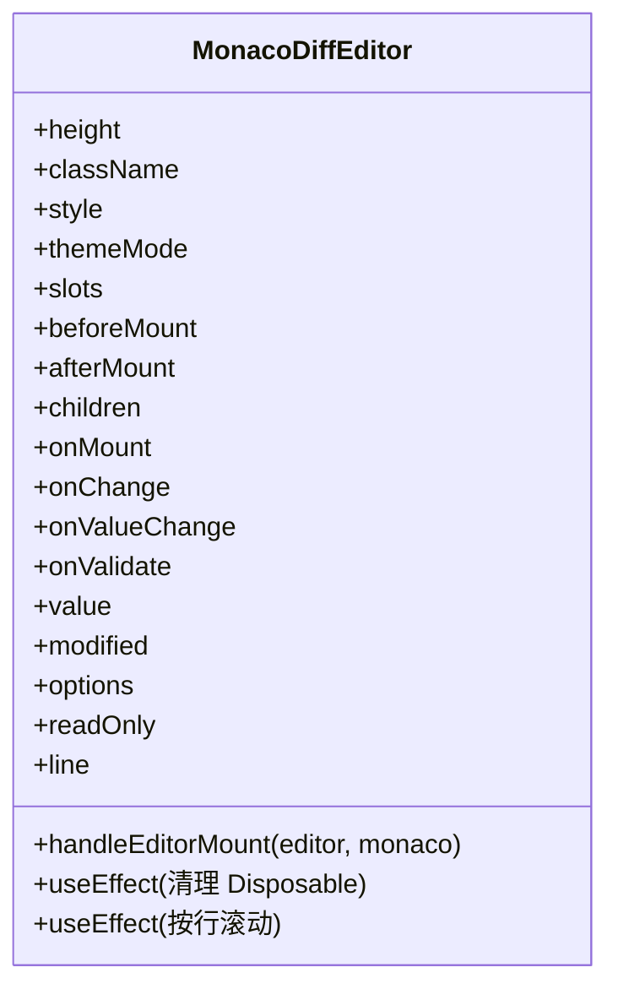
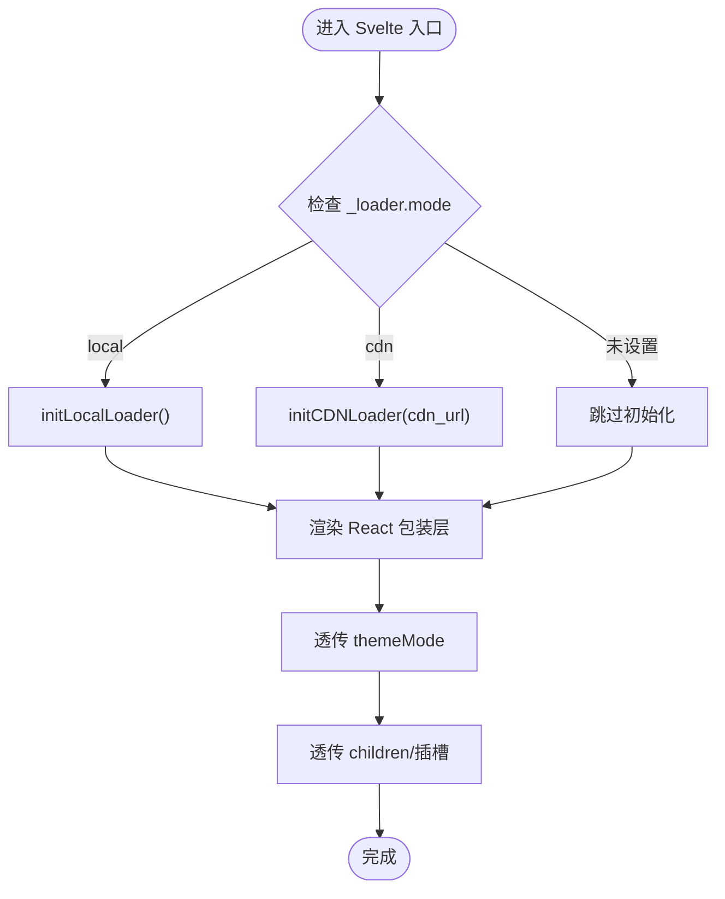
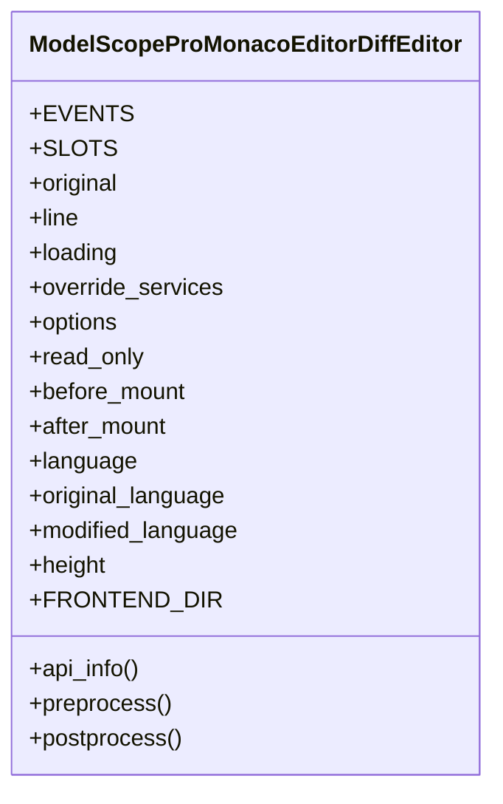
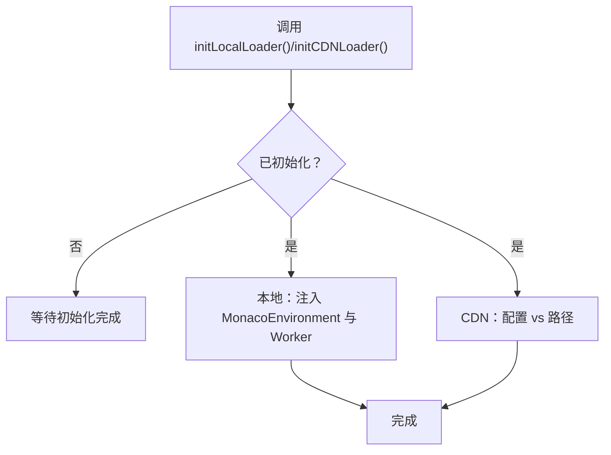
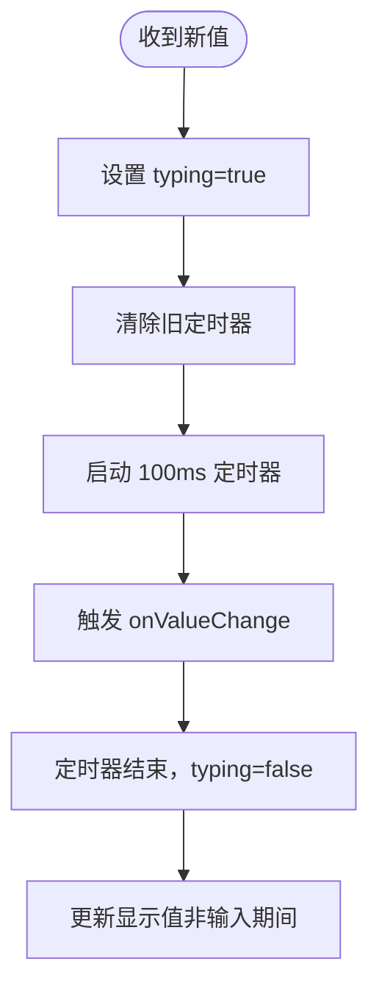
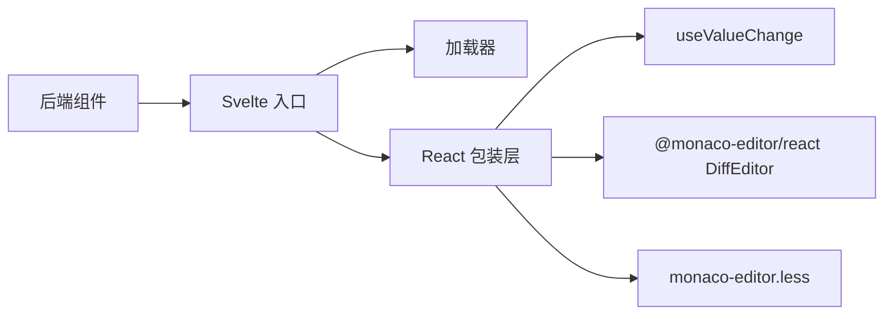

# 差异编辑器

<cite>
**本文引用的文件**   
- [frontend/pro/monaco-editor/diff-editor/monaco-editor.diff-editor.tsx](file://frontend/pro/monaco-editor/diff-editor/monaco-editor.diff-editor.tsx)
- [frontend/pro/monaco-editor/diff-editor/Index.svelte](file://frontend/pro/monaco-editor/diff-editor/Index.svelte)
- [backend/modelscope_studio/components/pro/monaco_editor/diff_editor/__init__.py](file://backend/modelscope_studio/components/pro/monaco_editor/diff_editor/__init__.py)
- [docs/components/pro/monaco_editor/README.md](file://docs/components/pro/monaco_editor/README.md)
- [docs/components/pro/monaco_editor/README-zh_CN.md](file://docs/components/pro/monaco_editor/README-zh_CN.md)
- [docs/components/pro/monaco_editor/demos/diff_editor.py](file://docs/components/pro/monaco_editor/demos/diff_editor.py)
- [frontend/pro/monaco-editor/loader.ts](file://frontend/pro/monaco-editor/loader.ts)
- [frontend/pro/monaco-editor/useValueChange.ts](file://frontend/pro/monaco-editor/useValueChange.ts)
- [frontend/pro/monaco-editor/monaco-editor.less](file://frontend/pro/monaco-editor/monaco-editor.less)
</cite>

## 目录

1. [简介](#简介)
2. [项目结构](#项目结构)
3. [核心组件](#核心组件)
4. [架构总览](#架构总览)
5. [详细组件分析](#详细组件分析)
6. [依赖关系分析](#依赖关系分析)
7. [性能考量](#性能考量)
8. [故障排查指南](#故障排查指南)
9. [结论](#结论)
10. [附录](#附录)

## 简介

本篇文档聚焦于 MonacoEditor 的差异编辑器（Diff Editor）能力，系统讲解如何在模型空间 Studio 的 Pro 组件体系中使用差异编辑器进行左右对比显示、差异高亮、同步滚动等核心功能，并覆盖配置项、事件绑定、加载模式（本地/CDN）、以及在版本控制与代码审查场景中的应用建议。同时，文档对内部实现机制（如值变更节流、验证标记监听、主题与加载态）进行技术剖析，帮助读者在复杂场景下进行定制与优化。

## 项目结构

差异编辑器由前端 Svelte 组件桥接、React 包装层、后端 Gradio 组件三部分协同构成：

- 前端 Svelte 层负责属性透传、加载器初始化与插槽渲染；
- React 包装层负责与 @monaco-editor/react DiffEditor 的集成、事件绑定、值变更节流与验证标记监听；
- 后端 Python 组件负责 Gradio 生命周期、事件声明与前端资源目录映射。

**图表来源**

- [frontend/pro/monaco-editor/diff-editor/Index.svelte:1-103](file://frontend/pro/monaco-editor/diff-editor/Index.svelte#L1-L103)
- [frontend/pro/monaco-editor/diff-editor/monaco-editor.diff-editor.tsx:1-160](file://frontend/pro/monaco-editor/diff-editor/monaco-editor.diff-editor.tsx#L1-L160)
- [frontend/pro/monaco-editor/loader.ts:1-95](file://frontend/pro/monaco-editor/loader.ts#L1-L95)
- [frontend/pro/monaco-editor/useValueChange.ts:1-44](file://frontend/pro/monaco-editor/useValueChange.ts#L1-L44)
- [frontend/pro/monaco-editor/monaco-editor.less:1-7](file://frontend/pro/monaco-editor/monaco-editor.less#L1-L7)

**章节来源**

- [frontend/pro/monaco-editor/diff-editor/Index.svelte:1-103](file://frontend/pro/monaco-editor/diff-editor/Index.svelte#L1-L103)
- [frontend/pro/monaco-editor/diff-editor/monaco-editor.diff-editor.tsx:1-160](file://frontend/pro/monaco-editor/diff-editor/monaco-editor.diff-editor.tsx#L1-L160)
- [backend/modelscope_studio/components/pro/monaco_editor/diff_editor/**init**.py:1-106](file://backend/modelscope_studio/components/pro/monaco_editor/diff_editor/__init__.py#L1-L106)

## 核心组件

- 前端差异编辑器包装组件：负责与 @monaco-editor/react DiffEditor 的对接，处理值变更、验证标记、主题切换、加载态与挂载回调。
- Svelte 入口组件：负责加载器初始化（本地或 CDN）、属性透传、插槽渲染与可见性控制。
- 后端 Gradio 组件：声明事件（mount/change/validate）、暴露属性与默认值、映射前端资源目录。
- 加载器：统一初始化 Monaco 环境与 Web Worker，支持本地打包与 CDN 路径配置。
- 值变更节流 Hook：在高频输入场景下降低回调频率，提升交互流畅度。
- 样式：提供加载态容器尺寸占满与主题类名约定。

**章节来源**

- [frontend/pro/monaco-editor/diff-editor/monaco-editor.diff-editor.tsx:19-33](file://frontend/pro/monaco-editor/diff-editor/monaco-editor.diff-editor.tsx#L19-L33)
- [frontend/pro/monaco-editor/diff-editor/Index.svelte:1-103](file://frontend/pro/monaco-editor/diff-editor/Index.svelte#L1-L103)
- [backend/modelscope_studio/components/pro/monaco_editor/diff_editor/**init**.py:10-31](file://backend/modelscope_studio/components/pro/monaco_editor/diff_editor/__init__.py#L10-L31)
- [frontend/pro/monaco-editor/loader.ts:1-95](file://frontend/pro/monaco-editor/loader.ts#L1-L95)
- [frontend/pro/monaco-editor/useValueChange.ts:1-44](file://frontend/pro/monaco-editor/useValueChange.ts#L1-L44)
- [frontend/pro/monaco-editor/monaco-editor.less:1-7](file://frontend/pro/monaco-editor/monaco-editor.less#L1-L7)

## 架构总览

差异编辑器的调用链路如下：

- 后端组件实例化并声明事件；
- 前端 Svelte 入口根据 \_loader 配置初始化加载器；
- React 包装层挂载 DiffEditor，注册内容变更与验证标记监听；
- 用户交互触发值变更，经节流后回传给上层；
- 主题随 Gradio shared theme 切换，加载态可自定义插槽。

**图表来源**

- [backend/modelscope_studio/components/pro/monaco_editor/diff_editor/**init**.py:14-31](file://backend/modelscope_studio/components/pro/monaco_editor/diff_editor/__init__.py#L14-L31)
- [frontend/pro/monaco-editor/diff-editor/Index.svelte:66-91](file://frontend/pro/monaco-editor/diff-editor/Index.svelte#L66-L91)
- [frontend/pro/monaco-editor/loader.ts:27-94](file://frontend/pro/monaco-editor/loader.ts#L27-L94)
- [frontend/pro/monaco-editor/diff-editor/monaco-editor.diff-editor.tsx:67-98](file://frontend/pro/monaco-editor/diff-editor/monaco-editor.diff-editor.tsx#L67-L98)

## 详细组件分析

### React 包装层（差异编辑器）

该组件是差异编辑器的核心实现，职责包括：

- 接收并合并 options 与只读状态；
- 监听修改侧编辑器的内容变更，触发 onValueChange 与 onChange；
- 监听验证标记变化，触发 onValidate；
- 支持按行号定位与滚动；
- 主题随 Gradio theme 自动切换；
- 提供可插拔的 loading 插槽。

**图表来源**

- [frontend/pro/monaco-editor/diff-editor/monaco-editor.diff-editor.tsx:19-33](file://frontend/pro/monaco-editor/diff-editor/monaco-editor.diff-editor.tsx#L19-L33)
- [frontend/pro/monaco-editor/diff-editor/monaco-editor.diff-editor.tsx:67-98](file://frontend/pro/monaco-editor/diff-editor/monaco-editor.diff-editor.tsx#L67-L98)
- [frontend/pro/monaco-editor/diff-editor/monaco-editor.diff-editor.tsx:109-113](file://frontend/pro/monaco-editor/diff-editor/monaco-editor.diff-editor.tsx#L109-L113)

**章节来源**

- [frontend/pro/monaco-editor/diff-editor/monaco-editor.diff-editor.tsx:1-160](file://frontend/pro/monaco-editor/diff-editor/monaco-editor.diff-editor.tsx#L1-L160)

### Svelte 入口（加载与属性透传）

- 根据 \_loader.mode 决定使用本地加载还是 CDN；
- 将 Gradio shared theme 透传给 React 包装层以实现主题联动；
- 将 children 渲染为 React Slot，支持 loading 插槽；
- 通过 updateProps 将 onValueChange 的值回写到组件状态。

**图表来源**

- [frontend/pro/monaco-editor/diff-editor/Index.svelte:66-91](file://frontend/pro/monaco-editor/diff-editor/Index.svelte#L66-L91)
- [frontend/pro/monaco-editor/loader.ts:27-94](file://frontend/pro/monaco-editor/loader.ts#L27-L94)

**章节来源**

- [frontend/pro/monaco-editor/diff-editor/Index.svelte:1-103](file://frontend/pro/monaco-editor/diff-editor/Index.svelte#L1-L103)

### 后端组件（Gradio）

- 声明事件：mount、change、validate；
- 支持 slots：loading；
- 暴露属性：original、language、original_language、modified_language、line、read_only、options、override_services、height、before_mount、after_mount 等；
- 映射前端资源目录为 pro/monaco-editor/diff-editor。

**图表来源**

- [backend/modelscope_studio/components/pro/monaco_editor/diff_editor/**init**.py:14-31](file://backend/modelscope_studio/components/pro/monaco_editor/diff_editor/__init__.py#L14-L31)
- [backend/modelscope_studio/components/pro/monaco_editor/diff_editor/**init**.py:36-82](file://backend/modelscope_studio/components/pro/monaco_editor/diff_editor/__init__.py#L36-L82)
- [backend/modelscope_studio/components/pro/monaco_editor/diff_editor/**init**.py:84-86](file://backend/modelscope_studio/components/pro/monaco_editor/diff_editor/__init__.py#L84-L86)

**章节来源**

- [backend/modelscope_studio/components/pro/monaco_editor/diff_editor/**init**.py:1-106](file://backend/modelscope_studio/components/pro/monaco_editor/diff_editor/__init__.py#L1-L106)

### 加载器（本地/CDN）

- 本地加载：动态导入 monaco-editor 及各类语言 Worker，并注入 MonacoEnvironment；
- CDN 加载：通过路径配置指向 CDN；
- 统一初始化入口，避免重复加载。

**图表来源**

- [frontend/pro/monaco-editor/loader.ts:27-94](file://frontend/pro/monaco-editor/loader.ts#L27-L94)

**章节来源**

- [frontend/pro/monaco-editor/loader.ts:1-95](file://frontend/pro/monaco-editor/loader.ts#L1-L95)

### 值变更节流 Hook

- 在高频输入时延迟触发 onValueChange，减少上游更新频率；
- 通过定时器与 typing 状态控制显示值与回调时机。

**图表来源**

- [frontend/pro/monaco-editor/useValueChange.ts:14-32](file://frontend/pro/monaco-editor/useValueChange.ts#L14-L32)

**章节来源**

- [frontend/pro/monaco-editor/useValueChange.ts:1-44](file://frontend/pro/monaco-editor/useValueChange.ts#L1-L44)

## 依赖关系分析

- React 包装层依赖 @monaco-editor/react DiffEditor 与 monaco-editor 类型；
- 通过 useValueChange 进行节流；
- Svelte 入口依赖加载器与 ReactSlot；
- 后端组件依赖 Gradio 事件系统与前端资源目录映射。

**图表来源**

- [backend/modelscope_studio/components/pro/monaco_editor/diff_editor/**init**.py:84-86](file://backend/modelscope_studio/components/pro/monaco_editor/diff_editor/__init__.py#L84-L86)
- [frontend/pro/monaco-editor/diff-editor/Index.svelte:12-14](file://frontend/pro/monaco-editor/diff-editor/Index.svelte#L12-L14)
- [frontend/pro/monaco-editor/diff-editor/monaco-editor.diff-editor.tsx:1-17](file://frontend/pro/monaco-editor/diff-editor/monaco-editor.diff-editor.tsx#L1-L17)
- [frontend/pro/monaco-editor/useValueChange.ts:1-2](file://frontend/pro/monaco-editor/useValueChange.ts#L1-L2)
- [frontend/pro/monaco-editor/monaco-editor.less:1-7](file://frontend/pro/monaco-editor/monaco-editor.less#L1-L7)

**章节来源**

- [frontend/pro/monaco-editor/diff-editor/monaco-editor.diff-editor.tsx:1-17](file://frontend/pro/monaco-editor/diff-editor/monaco-editor.diff-editor.tsx#L1-L17)
- [frontend/pro/monaco-editor/diff-editor/Index.svelte:12-14](file://frontend/pro/monaco-editor/diff-editor/Index.svelte#L12-L14)

## 性能考量

- 输入节流：通过 useValueChange 在高频输入时降低回调频率，避免频繁上抛与重渲染。
- Disposable 管理：在卸载时释放编辑器与标记监听的订阅，防止内存泄漏。
- 主题切换：按需切换 vs-dark/light，避免不必要的重绘。
- 加载策略：优先使用本地加载以减少网络抖动；CDN 模式下确保路径正确与缓存命中。
- 大文档优化：建议在 options 中合理配置如 minimap、lineNumbers、scrollBeyondLastLine 等，减少渲染开销。

[本节为通用指导，不直接分析具体文件]

## 故障排查指南

- 编辑器未显示或空白
  - 检查 \_loader 配置是否正确，确认本地加载或 CDN 路径可用；
  - 确认 Gradio theme 是否正常透传至 themeMode。
- 值不回传或事件不触发
  - 确认 onValueChange 是否被正确绑定；
  - 检查 onChange/onValidate 是否被注册；
  - 确认 before_mount/after_mount 字符串函数是否有效。
- 验证标记不出现
  - 仅在支持丰富智能感知的语言（TypeScript、JavaScript、CSS、LESS、SCSS、JSON、HTML）下触发；
  - 确认 monaco.editor.onDidChangeMarkers 订阅是否生效。
- 行号定位无效
  - 确认传入 line 为数值类型；
  - 确认编辑器已就绪后再调用 revealLine。

**章节来源**

- [frontend/pro/monaco-editor/diff-editor/monaco-editor.diff-editor.tsx:67-98](file://frontend/pro/monaco-editor/diff-editor/monaco-editor.diff-editor.tsx#L67-L98)
- [frontend/pro/monaco-editor/diff-editor/monaco-editor.diff-editor.tsx:109-113](file://frontend/pro/monaco-editor/diff-editor/monaco-editor.diff-editor.tsx#L109-L113)
- [docs/components/pro/monaco_editor/README.md:66-74](file://docs/components/pro/monaco_editor/README.md#L66-L74)

## 结论

差异编辑器在模型空间 Studio 中通过“后端事件 + 前端桥接 + React 包装 + 加载器”的分层设计，实现了稳定、可扩展的左右对比与差异高亮体验。配合值变更节流、验证标记监听与主题联动，能够在版本控制与代码审查等场景中高效工作。建议在生产环境中结合大文档优化与加载策略，持续关注事件与订阅的生命周期管理。

[本节为总结，不直接分析具体文件]

## 附录

### 使用示例与场景

- 基础差异编辑器示例：展示 original 与 value 的对比、只读切换与 change 事件绑定。
- 版本控制场景：左侧为基线版本，右侧为当前修改，结合 validate 事件提示错误位置。
- 代码审查场景：开启只读模式，仅允许查看差异与评论，结合 before_mount/after_mount 扩展高级能力。

**章节来源**

- [docs/components/pro/monaco_editor/demos/diff_editor.py:1-44](file://docs/components/pro/monaco_editor/demos/diff_editor.py#L1-L44)

### 配置项与事件参考

- 属性（DiffEditor）：value、original、language、original_language、modified_language、line、read_only、loading、options、override_services、height、before_mount、after_mount。
- 事件：mount、change、validate。
- 插槽：loading。

**章节来源**

- [docs/components/pro/monaco_editor/README.md:48-64](file://docs/components/pro/monaco_editor/README.md#L48-L64)
- [docs/components/pro/monaco_editor/README-zh_CN.md:48-64](file://docs/components/pro/monaco_editor/README-zh_CN.md#L48-L64)
- [backend/modelscope_studio/components/pro/monaco_editor/diff_editor/**init**.py:14-31](file://backend/modelscope_studio/components/pro/monaco_editor/diff_editor/__init__.py#L14-L31)
