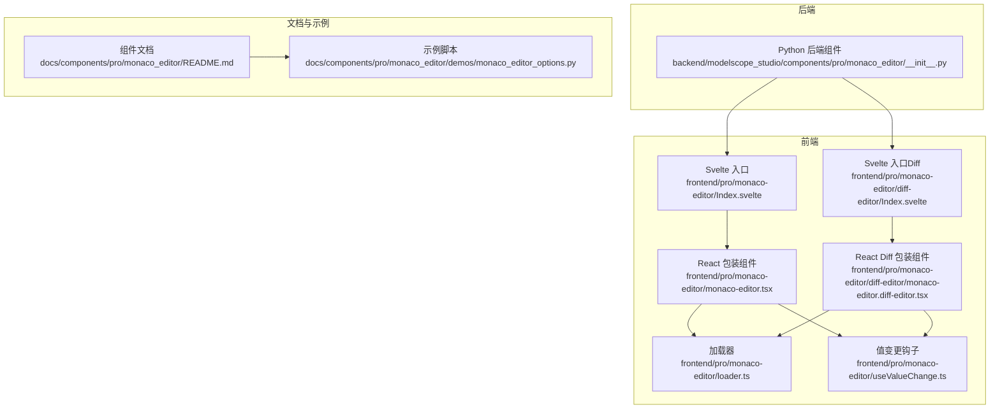
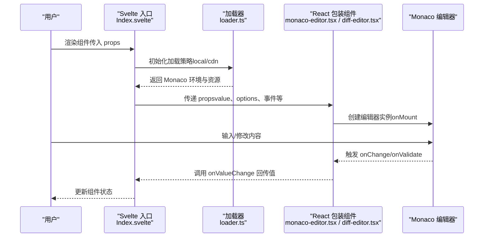
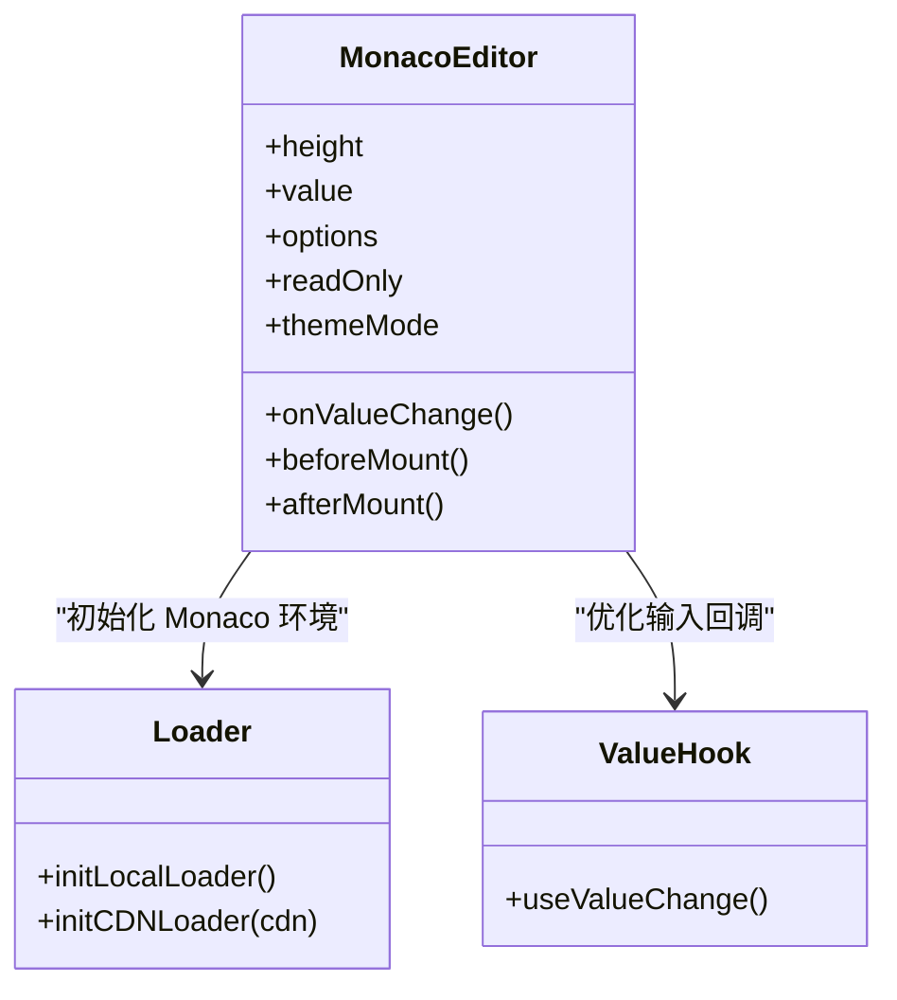
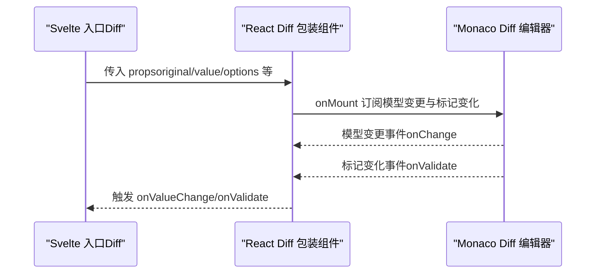
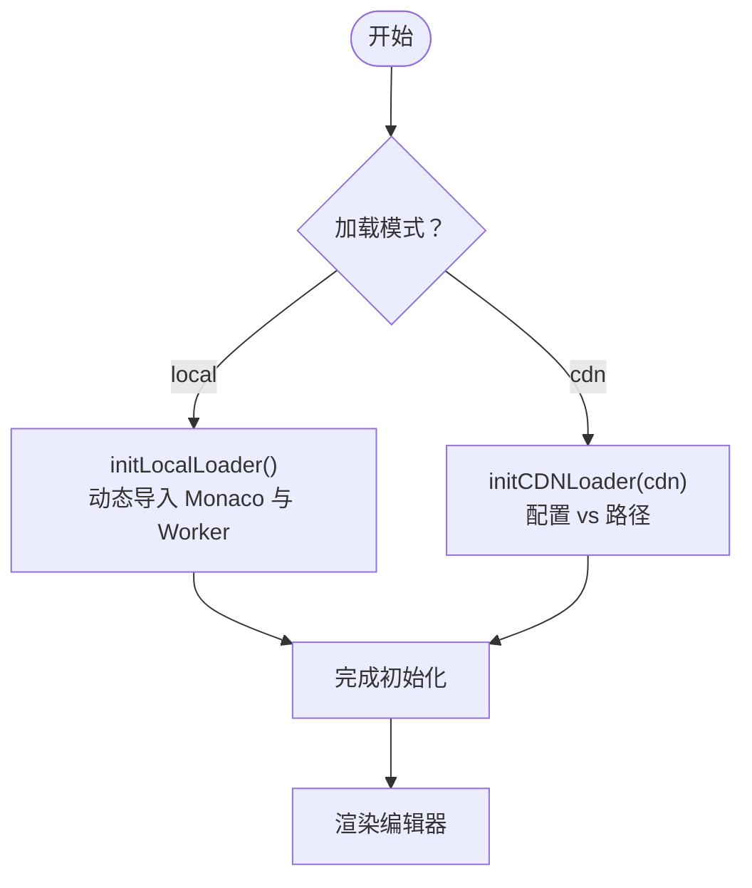
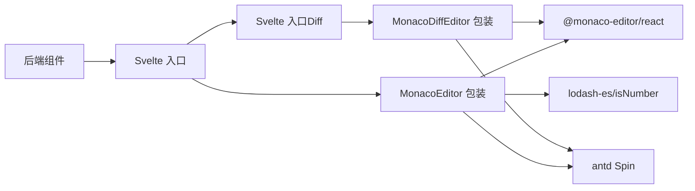

# 组件概览

<cite>
**本文引用的文件**
- [backend/modelscope_studio/components/pro/monaco_editor/__init__.py](file://backend/modelscope_studio/components/pro/monaco_editor/__init__.py)
- [frontend/pro/monaco-editor/Index.svelte](file://frontend/pro/monaco-editor/Index.svelte)
- [frontend/pro/monaco-editor/monaco-editor.tsx](file://frontend/pro/monaco-editor/monaco-editor.tsx)
- [frontend/pro/monaco-editor/loader.ts](file://frontend/pro/monaco-editor/loader.ts)
- [frontend/pro/monaco-editor/useValueChange.ts](file://frontend/pro/monaco-editor/useValueChange.ts)
- [frontend/pro/monaco-editor/diff-editor/Index.svelte](file://frontend/pro/monaco-editor/diff-editor/Index.svelte)
- [frontend/pro/monaco-editor/diff-editor/monaco-editor.diff-editor.tsx](file://frontend/pro/monaco-editor/diff-editor/monaco-editor.diff-editor.tsx)
- [docs/components/pro/monaco_editor/README.md](file://docs/components/pro/monaco_editor/README.md)
- [docs/components/pro/monaco_editor/demos/monaco_editor_options.py](file://docs/components/pro/monaco_editor/demos/monaco_editor_options.py)
</cite>

## 目录

1. [简介](#简介)
2. [项目结构](#项目结构)
3. [核心组件](#核心组件)
4. [架构总览](#架构总览)
5. [详细组件分析](#详细组件分析)
6. [依赖关系分析](#依赖关系分析)
7. [性能考量](#性能考量)
8. [故障排查指南](#故障排查指南)
9. [结论](#结论)
10. [附录](#附录)

## 简介

MonacoEditor 是基于 Gradio 的专业代码编辑器组件，底层集成微软 Monaco 编辑器，提供语法高亮、智能提示、错误标记、主题适配等能力，并支持差异对比编辑（Diff Editor）。该组件在机器学习与 AI 应用中广泛用于：

- 模型训练脚本与配置文件的编写与校验
- Prompt 工程与提示词模板的编辑
- 多模态输入场景下的代码/文本混合编辑
- 在线代码评审与对比展示

组件特性包括：

- 语法高亮与语言模式切换
- 智能提示与自动补全
- 错误标记与验证事件
- 主题适配（明暗主题）
- 差异对比编辑（左右源对比）
- 可插拔加载策略（本地打包或 CDN）

## 项目结构

MonacoEditor 组件由后端 Python 组件定义与前端 Svelte/React 实现共同构成，文档与示例位于 docs 目录。

**图表来源**

- [backend/modelscope_studio/components/pro/monaco_editor/**init**.py:16-107](file://backend/modelscope_studio/components/pro/monaco_editor/__init__.py#L16-L107)
- [frontend/pro/monaco-editor/Index.svelte:1-101](file://frontend/pro/monaco-editor/Index.svelte#L1-L101)
- [frontend/pro/monaco-editor/monaco-editor.tsx:1-95](file://frontend/pro/monaco-editor/monaco-editor.tsx#L1-L95)
- [frontend/pro/monaco-editor/diff-editor/Index.svelte:1-103](file://frontend/pro/monaco-editor/diff-editor/Index.svelte#L1-L103)
- [frontend/pro/monaco-editor/diff-editor/monaco-editor.diff-editor.tsx:1-161](file://frontend/pro/monaco-editor/diff-editor/monaco-editor.diff-editor.tsx#L1-L161)
- [frontend/pro/monaco-editor/loader.ts:1-95](file://frontend/pro/monaco-editor/loader.ts#L1-L95)
- [frontend/pro/monaco-editor/useValueChange.ts:1-44](file://frontend/pro/monaco-editor/useValueChange.ts#L1-L44)
- [docs/components/pro/monaco_editor/README.md:1-89](file://docs/components/pro/monaco_editor/README.md#L1-L89)
- [docs/components/pro/monaco_editor/demos/monaco_editor_options.py:1-34](file://docs/components/pro/monaco_editor/demos/monaco_editor_options.py#L1-L34)

**章节来源**

- [docs/components/pro/monaco_editor/README.md:1-89](file://docs/components/pro/monaco_editor/README.md#L1-L89)

## 核心组件

- Python 后端组件：负责声明组件属性、事件绑定、默认加载策略与前端目录解析。
- 前端包装组件：
  - 普通编辑器：将 Monaco Editor React 组件桥接为 Svelte 组件，处理值变更、主题、加载态与事件转发。
  - 差异编辑器：在普通编辑器基础上增加左右源对比、行定位与验证事件。
- 加载器：支持本地打包与 CDN 两种加载方式，按需初始化 Monaco 环境与 Web Worker。
- 值变更钩子：优化输入体验，延迟触发变更回调，避免频繁重渲染。

**章节来源**

- [backend/modelscope_studio/components/pro/monaco_editor/**init**.py:16-107](file://backend/modelscope_studio/components/pro/monaco_editor/__init__.py#L16-L107)
- [frontend/pro/monaco-editor/monaco-editor.tsx:12-95](file://frontend/pro/monaco-editor/monaco-editor.tsx#L12-L95)
- [frontend/pro/monaco-editor/diff-editor/monaco-editor.diff-editor.tsx:19-161](file://frontend/pro/monaco-editor/diff-editor/monaco-editor.diff-editor.tsx#L19-L161)
- [frontend/pro/monaco-editor/loader.ts:27-94](file://frontend/pro/monaco-editor/loader.ts#L27-L94)
- [frontend/pro/monaco-editor/useValueChange.ts:4-43](file://frontend/pro/monaco-editor/useValueChange.ts#L4-L43)

## 架构总览

MonacoEditor 的运行时控制流如下：

**图表来源**

- [frontend/pro/monaco-editor/Index.svelte:64-90](file://frontend/pro/monaco-editor/Index.svelte#L64-L90)
- [frontend/pro/monaco-editor/loader.ts:27-94](file://frontend/pro/monaco-editor/loader.ts#L27-L94)
- [frontend/pro/monaco-editor/monaco-editor.tsx:38-91](file://frontend/pro/monaco-editor/monaco-editor.tsx#L38-L91)
- [frontend/pro/monaco-editor/diff-editor/monaco-editor.diff-editor.tsx:67-107](file://frontend/pro/monaco-editor/diff-editor/monaco-editor.diff-editor.tsx#L67-L107)

## 详细组件分析

### 普通编辑器组件（MonacoEditor）

- 职责
  - 将 Gradio 属性映射到 Monaco React 组件
  - 处理只读、高度、主题、加载态与事件转发
  - 使用值变更钩子优化输入体验
- 关键点
  - 通过 options 透传 Monaco 配置；readOnly 合并与 options 合并
  - 主题根据 Gradio 共享主题自动选择明/暗色
  - 支持自定义 loading 插槽或默认加载指示器
- 适用场景
  - 代码/配置文件编辑
  - 文本内容输入与实时校验

**图表来源**

- [frontend/pro/monaco-editor/monaco-editor.tsx:12-95](file://frontend/pro/monaco-editor/monaco-editor.tsx#L12-L95)
- [frontend/pro/monaco-editor/loader.ts:27-94](file://frontend/pro/monaco-editor/loader.ts#L27-L94)
- [frontend/pro/monaco-editor/useValueChange.ts:4-43](file://frontend/pro/monaco-editor/useValueChange.ts#L4-L43)

**章节来源**

- [frontend/pro/monaco-editor/monaco-editor.tsx:21-95](file://frontend/pro/monaco-editor/monaco-editor.tsx#L21-L95)
- [frontend/pro/monaco-editor/loader.ts:27-94](file://frontend/pro/monaco-editor/loader.ts#L27-L94)
- [frontend/pro/monaco-editor/useValueChange.ts:4-43](file://frontend/pro/monaco-editor/useValueChange.ts#L4-L43)

### 差异编辑器组件（MonacoEditor.DiffEditor）

- 职责
  - 对比“原始”与“修改后”的内容
  - 提供行定位、验证事件与模型变更监听
- 关键点
  - onMount 中订阅模型变更与标记变化事件
  - 支持单独设置 original_language 与 modified_language
  - 支持 line 参数滚动到指定行
- 适用场景
  - 代码评审、变更对比、配置差异展示

**图表来源**

- [frontend/pro/monaco-editor/diff-editor/Index.svelte:66-91](file://frontend/pro/monaco-editor/diff-editor/Index.svelte#L66-L91)
- [frontend/pro/monaco-editor/diff-editor/monaco-editor.diff-editor.tsx:35-161](file://frontend/pro/monaco-editor/diff-editor/monaco-editor.diff-editor.tsx#L35-L161)

**章节来源**

- [frontend/pro/monaco-editor/diff-editor/monaco-editor.diff-editor.tsx:35-161](file://frontend/pro/monaco-editor/diff-editor/monaco-editor.diff-editor.tsx#L35-L161)

### 加载器与资源初始化

- 功能
  - 本地加载：动态导入 Monaco 与各类语言 Worker
  - CDN 加载：通过路径配置指向 CDN 资源
  - 统一初始化：确保 Monaco 环境可用后再渲染编辑器
- 注意事项
  - 本地加载会引入较大包体，建议生产环境优先 CDN
  - CDN 可自定义路径，便于内网部署

**图表来源**

- [frontend/pro/monaco-editor/loader.ts:27-94](file://frontend/pro/monaco-editor/loader.ts#L27-L94)

**章节来源**

- [frontend/pro/monaco-editor/loader.ts:27-94](file://frontend/pro/monaco-editor/loader.ts#L27-L94)

### 值变更与输入优化

- 机制
  - useValueChange 在输入过程中延迟触发回调，减少频繁更新
  - typing 状态与定时器配合，保证最终值与回调时机一致
- 效果
  - 提升大文档输入与实时预览的流畅度

**章节来源**

- [frontend/pro/monaco-editor/useValueChange.ts:4-43](file://frontend/pro/monaco-editor/useValueChange.ts#L4-L43)

## 依赖关系分析

- 组件耦合
  - 后端组件仅负责声明与前端目录解析，逻辑解耦清晰
  - 前端通过 Svelte 桥接 React 组件，职责单一
- 外部依赖
  - @monaco-editor/react：核心编辑器能力
  - antd Spin：加载态显示
  - lodash-es/isNumber：类型与判空辅助
- 循环依赖
  - 未见直接循环依赖；加载器与组件通过函数调用解耦

**图表来源**

- [backend/modelscope_studio/components/pro/monaco_editor/**init**.py:16-107](file://backend/modelscope_studio/components/pro/monaco_editor/__init__.py#L16-L107)
- [frontend/pro/monaco-editor/monaco-editor.tsx:1-10](file://frontend/pro/monaco-editor/monaco-editor.tsx#L1-L10)
- [frontend/pro/monaco-editor/diff-editor/monaco-editor.diff-editor.tsx:1-13](file://frontend/pro/monaco-editor/diff-editor/monaco-editor.diff-editor.tsx#L1-L13)

**章节来源**

- [backend/modelscope_studio/components/pro/monaco_editor/**init**.py:16-107](file://backend/modelscope_studio/components/pro/monaco_editor/__init__.py#L16-L107)
- [frontend/pro/monaco-editor/monaco-editor.tsx:1-10](file://frontend/pro/monaco-editor/monaco-editor.tsx#L1-L10)
- [frontend/pro/monaco-editor/diff-editor/monaco-editor.diff-editor.tsx:1-13](file://frontend/pro/monaco-editor/diff-editor/monaco-editor.diff-editor.tsx#L1-L13)

## 性能考量

- 加载策略
  - 生产环境建议使用 CDN，减少首屏体积
  - 本地加载适合开发调试或离线环境
- 输入优化
  - useValueChange 延迟回调，降低高频输入对渲染的影响
- 主题与样式
  - 明/暗主题切换由 Monaco 内部处理，注意避免重复样式覆盖
- 差异编辑器
  - 大文档对比可能带来内存压力，建议分段编辑或限制行数

[本节为通用指导，无需特定文件来源]

## 故障排查指南

- 编辑器不显示或空白
  - 检查加载器是否完成初始化（local/cdn）
  - 确认 \_loader 配置与网络可达性
- 语言高亮/智能提示无效
  - 确认 language 与 options 设置正确
  - 若使用自定义 before_mount/after_mount，检查是否影响 Monaco 实例
- 验证事件未触发
  - 仅在具备丰富 IntelliSense 的语言下才会触发 validate 事件
- 行定位无效
  - 确认 line 为数字且在有效范围内
- 加载态不显示
  - 如自定义 loading 插槽，请确保插槽内容可渲染

**章节来源**

- [docs/components/pro/monaco_editor/README.md:66-89](file://docs/components/pro/monaco_editor/README.md#L66-L89)
- [frontend/pro/monaco-editor/monaco-editor.tsx:71-82](file://frontend/pro/monaco-editor/monaco-editor.tsx#L71-L82)
- [frontend/pro/monaco-editor/diff-editor/monaco-editor.diff-editor.tsx:141-152](file://frontend/pro/monaco-editor/diff-editor/monaco-editor.diff-editor.tsx#L141-L152)

## 结论

MonacoEditor 组件以 Gradio 为入口，结合 Svelte 与 React 的桥接方案，提供了稳定、可扩展的代码编辑体验。其核心优势在于：

- 与 Monaco 强大的语言服务与生态无缝对接
- 明确的前后端职责划分与可配置的加载策略
- 面向 AI/ML 场景的差异化能力（Diff Editor、验证事件、主题适配）

对于初学者，建议从基础用法入手，逐步掌握语言设置、选项配置与事件绑定，再探索高级定制与加载策略优化。

[本节为总结性内容，无需特定文件来源]

## 附录

### 基本使用示例与配置要点

- 示例脚本展示了如何传入 value、language、height 以及 options（如禁用 minimap 与行号）
- 文档中提供了 API 表格与事件说明，便于查阅

**章节来源**

- [docs/components/pro/monaco_editor/demos/monaco_editor_options.py:6-30](file://docs/components/pro/monaco_editor/demos/monaco_editor_options.py#L6-L30)
- [docs/components/pro/monaco_editor/README.md:31-89](file://docs/components/pro/monaco_editor/README.md#L31-L89)

### 组件 API 概览（关键字段）

- 常用属性
  - value：编辑器初始值
  - language：语言模式
  - options：Monaco 构造选项
  - read_only：只读开关
  - height：组件高度
  - before_mount/after_mount：挂载前后执行的 JS 字符串
- 事件
  - mount：编辑器挂载完成
  - change：内容变更
  - validate：触发校验与存在错误标记
- 插槽
  - loading：自定义加载态

**章节来源**

- [docs/components/pro/monaco_editor/README.md:31-89](file://docs/components/pro/monaco_editor/README.md#L31-L89)
