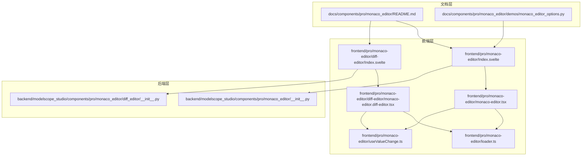
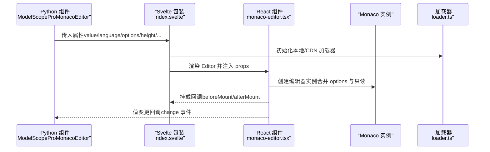
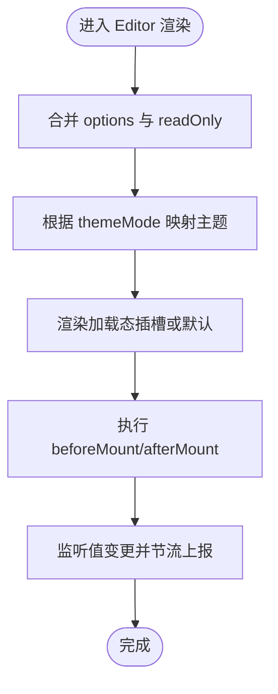
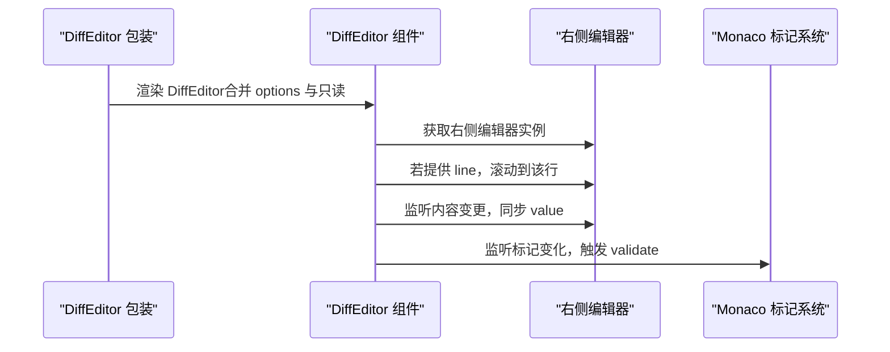
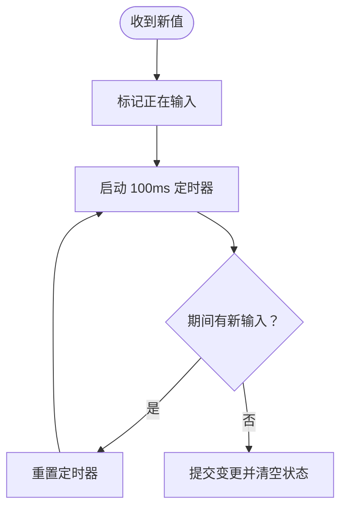
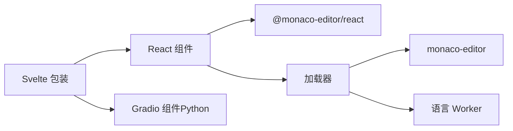

# 配置选项

<cite>
**本文引用的文件**
- [frontend/pro/monaco-editor/monaco-editor.tsx](file://frontend/pro/monaco-editor/monaco-editor.tsx)
- [frontend/pro/monaco-editor/diff-editor/monaco-editor.diff-editor.tsx](file://frontend/pro/monaco-editor/diff-editor/monaco-editor.diff-editor.tsx)
- [frontend/pro/monaco-editor/loader.ts](file://frontend/pro/monaco-editor/loader.ts)
- [frontend/pro/monaco-editor/useValueChange.ts](file://frontend/pro/monaco-editor/useValueChange.ts)
- [frontend/pro/monaco-editor/Index.svelte](file://frontend/pro/monaco-editor/Index.svelte)
- [frontend/pro/monaco-editor/diff-editor/Index.svelte](file://frontend/pro/monaco-editor/diff-editor/Index.svelte)
- [backend/modelscope_studio/components/pro/monaco_editor/__init__.py](file://backend/modelscope_studio/components/pro/monaco_editor/__init__.py)
- [backend/modelscope_studio/components/pro/monaco_editor/diff_editor/__init__.py](file://backend/modelscope_studio/components/pro/monaco_editor/diff_editor/__init__.py)
- [docs/components/pro/monaco_editor/README.md](file://docs/components/pro/monaco_editor/README.md)
- [docs/components/pro/monaco_editor/demos/monaco_editor_options.py](file://docs/components/pro/monaco_editor/demos/monaco_editor_options.py)
</cite>

## 目录

1. [简介](#简介)
2. [项目结构](#项目结构)
3. [核心组件](#核心组件)
4. [架构总览](#架构总览)
5. [详细组件分析](#详细组件分析)
6. [依赖关系分析](#依赖关系分析)
7. [性能考量](#性能考量)
8. [故障排查指南](#故障排查指南)
9. [结论](#结论)
10. [附录：配置清单与示例](#附录配置清单与示例)

## 简介

本文件为 MonacoEditor 在当前仓库中的配置选项完整参考，覆盖编辑器外观、行为、功能、语言与主题、加载与性能等关键方面，并结合前端与 Python 后端的集成方式，给出可直接落地的配置建议、最佳实践与常见兼容性注意事项。

## 项目结构

围绕 MonacoEditor 的配置与使用，涉及以下层次：

- 文档层：提供组件 API 说明与示例入口
- 前端层：Svelte 包装、React 组件、加载器与事件桥接
- 后端层：Gradio 组件封装，暴露属性、事件与插槽

图表来源

- [frontend/pro/monaco-editor/Index.svelte:1-101](file://frontend/pro/monaco-editor/Index.svelte#L1-L101)
- [frontend/pro/monaco-editor/diff-editor/Index.svelte:1-103](file://frontend/pro/monaco-editor/diff-editor/Index.svelte#L1-L103)
- [frontend/pro/monaco-editor/monaco-editor.tsx:1-95](file://frontend/pro/monaco-editor/monaco-editor.tsx#L1-L95)
- [frontend/pro/monaco-editor/diff-editor/monaco-editor.diff-editor.tsx:1-161](file://frontend/pro/monaco-editor/diff-editor/monaco-editor.diff-editor.tsx#L1-L161)
- [frontend/pro/monaco-editor/loader.ts:1-95](file://frontend/pro/monaco-editor/loader.ts#L1-L95)
- [frontend/pro/monaco-editor/useValueChange.ts:1-44](file://frontend/pro/monaco-editor/useValueChange.ts#L1-L44)
- [backend/modelscope_studio/components/pro/monaco_editor/**init**.py:1-107](file://backend/modelscope_studio/components/pro/monaco_editor/__init__.py#L1-L107)
- [backend/modelscope_studio/components/pro/monaco_editor/diff_editor/**init**.py:1-106](file://backend/modelscope_studio/components/pro/monaco_editor/diff_editor/__init__.py#L1-L106)

章节来源

- [docs/components/pro/monaco_editor/README.md:1-89](file://docs/components/pro/monaco_editor/README.md#L1-L89)
- [frontend/pro/monaco-editor/Index.svelte:1-101](file://frontend/pro/monaco-editor/Index.svelte#L1-L101)
- [frontend/pro/monaco-editor/diff-editor/Index.svelte:1-103](file://frontend/pro/monaco-editor/diff-editor/Index.svelte#L1-L103)

## 核心组件

- MonacoEditor（单编辑器）
  - 负责将 Gradio 的属性映射为 Monaco 的构造参数，处理加载态、只读、主题模式、值变更与挂载回调
  - 支持通过 options 透传 Monaco 构造选项；支持 before_mount/after_mount 注入 JS 字符串
- MonacoDiffEditor（差异编辑器）
  - 负责左右侧内容对比展示，支持原内容与修改内容的语言分离、行定位、校验标记监听
  - 支持 options 与只读配置，支持 line 参数在挂载后滚动到指定行
- 加载器（本地/CDN）
  - 初始化 Monaco 环境与 Web Worker，按需选择本地打包或 CDN 路径
- 值变更节流
  - 使用定时器避免频繁触发上层回调，提升输入体验与性能

章节来源

- [frontend/pro/monaco-editor/monaco-editor.tsx:12-95](file://frontend/pro/monaco-editor/monaco-editor.tsx#L12-L95)
- [frontend/pro/monaco-editor/diff-editor/monaco-editor.diff-editor.tsx:19-161](file://frontend/pro/monaco-editor/diff-editor/monaco-editor.diff-editor.tsx#L19-L161)
- [frontend/pro/monaco-editor/loader.ts:1-95](file://frontend/pro/monaco-editor/loader.ts#L1-L95)
- [frontend/pro/monaco-editor/useValueChange.ts:1-44](file://frontend/pro/monaco-editor/useValueChange.ts#L1-L44)

## 架构总览

MonacoEditor 在当前工程中的调用链路如下：

图表来源

- [backend/modelscope_studio/components/pro/monaco_editor/**init**.py:46-107](file://backend/modelscope_studio/components/pro/monaco_editor/__init__.py#L46-L107)
- [frontend/pro/monaco-editor/Index.svelte:64-90](file://frontend/pro/monaco-editor/Index.svelte#L64-L90)
- [frontend/pro/monaco-editor/monaco-editor.tsx:56-88](file://frontend/pro/monaco-editor/monaco-editor.tsx#L56-L88)
- [frontend/pro/monaco-editor/loader.ts:27-78](file://frontend/pro/monaco-editor/loader.ts#L27-L78)

## 详细组件分析

### 单编辑器（MonacoEditor）配置要点

- 属性映射与默认值
  - value、language、line、read_only、loading、options、overrideServices、height、before_mount、after_mount
  - 主题模式由 themeMode 决定，暗色模式映射为 vs-dark，否则 light
- 行为特性
  - options 与 readOnly 合并传入底层构造函数
  - onChange 回调中同步更新显示值，避免频繁上抛
  - 加载态支持自定义插槽或默认旋转指示器
- 事件与插槽
  - 事件：mount、change、validate（仅在具备丰富智能感知的语言中触发）
  - 插槽：loading

图表来源

- [frontend/pro/monaco-editor/monaco-editor.tsx:64-88](file://frontend/pro/monaco-editor/monaco-editor.tsx#L64-L88)
- [frontend/pro/monaco-editor/useValueChange.ts:14-32](file://frontend/pro/monaco-editor/useValueChange.ts#L14-L32)

章节来源

- [frontend/pro/monaco-editor/monaco-editor.tsx:12-95](file://frontend/pro/monaco-editor/monaco-editor.tsx#L12-L95)
- [docs/components/pro/monaco_editor/README.md:35-74](file://docs/components/pro/monaco_editor/README.md#L35-L74)

### 差异编辑器（MonacoDiffEditor）配置要点

- 属性映射与默认值
  - value（右侧）、original（左侧）、language、original_language、modified_language、line、read_only、loading、options、overrideServices、height、before_mount、after_mount
- 行为特性
  - 只读与 options 合并传入底层构造函数
  - 挂载后根据 line 参数滚动到指定行
  - 监听模型标记变化，触发 validate 事件
  - onChange 回调中同步右侧编辑器值
- 事件与插槽
  - 事件：mount、change、validate
  - 插槽：loading

图表来源

- [frontend/pro/monaco-editor/diff-editor/monaco-editor.diff-editor.tsx:67-98](file://frontend/pro/monaco-editor/diff-editor/monaco-editor.diff-editor.tsx#L67-L98)
- [frontend/pro/monaco-editor/diff-editor/monaco-editor.diff-editor.tsx:127-153](file://frontend/pro/monaco-editor/diff-editor/monaco-editor.diff-editor.tsx#L127-L153)

章节来源

- [frontend/pro/monaco-editor/diff-editor/monaco-editor.diff-editor.tsx:19-161](file://frontend/pro/monaco-editor/diff-editor/monaco-editor.diff-editor.tsx#L19-L161)
- [docs/components/pro/monaco_editor/README.md:48-74](file://docs/components/pro/monaco_editor/README.md#L48-L74)

### 加载器与主题

- 加载器
  - 本地加载：动态导入 monaco 与各类语言 worker，并设置 MonacoEnvironment.getWorker
  - CDN 加载：通过 monaco-loader 配置 vs 路径
- 主题
  - 通过 themeMode 将暗色映射为 vs-dark，否则 light，统一交由底层 Editor 处理

图表来源

- [frontend/pro/monaco-editor/loader.ts:27-78](file://frontend/pro/monaco-editor/loader.ts#L27-L78)
- [frontend/pro/monaco-editor/loader.ts:80-94](file://frontend/pro/monaco-editor/loader.ts#L80-L94)
- [frontend/pro/monaco-editor/monaco-editor.tsx:87-88](file://frontend/pro/monaco-editor/monaco-editor.tsx#L87-L88)

章节来源

- [frontend/pro/monaco-editor/loader.ts:1-95](file://frontend/pro/monaco-editor/loader.ts#L1-L95)
- [frontend/pro/monaco-editor/monaco-editor.tsx:12-95](file://frontend/pro/monaco-editor/monaco-editor.tsx#L12-L95)

### 值变更节流机制

- 目标：减少高频输入导致的回调风暴
- 机制：输入开始计时，100ms 内无新输入则提交一次变更
- 影响：降低上层处理压力，改善交互流畅度

图表来源

- [frontend/pro/monaco-editor/useValueChange.ts:14-24](file://frontend/pro/monaco-editor/useValueChange.ts#L14-L24)
- [frontend/pro/monaco-editor/useValueChange.ts:26-32](file://frontend/pro/monaco-editor/useValueChange.ts#L26-L32)

章节来源

- [frontend/pro/monaco-editor/useValueChange.ts:1-44](file://frontend/pro/monaco-editor/useValueChange.ts#L1-L44)

## 依赖关系分析

- 组件耦合
  - Svelte 包装负责属性透传与加载器初始化
  - React 组件负责具体编辑器实例化与事件绑定
  - 加载器与 Worker 解耦于编辑器逻辑
- 外部依赖
  - @monaco-editor/react 提供 Editor/DiffEditor
  - monaco-editor 与各语言 worker
  - Gradio 组件桥接（Python 层）

图表来源

- [frontend/pro/monaco-editor/Index.svelte:10-12](file://frontend/pro/monaco-editor/Index.svelte#L10-L12)
- [frontend/pro/monaco-editor/monaco-editor.tsx:1-2](file://frontend/pro/monaco-editor/monaco-editor.tsx#L1-L2)
- [frontend/pro/monaco-editor/loader.ts:33-51](file://frontend/pro/monaco-editor/loader.ts#L33-L51)

章节来源

- [frontend/pro/monaco-editor/Index.svelte:1-101](file://frontend/pro/monaco-editor/Index.svelte#L1-L101)
- [frontend/pro/monaco-editor/monaco-editor.tsx:1-95](file://frontend/pro/monaco-editor/monaco-editor.tsx#L1-L95)
- [frontend/pro/monaco-editor/loader.ts:1-95](file://frontend/pro/monaco-editor/loader.ts#L1-L95)

## 性能考量

- 加载策略
  - 优先使用本地加载以减少网络抖动对首开的影响；如需离线部署或内网环境，建议固定版本并预热
  - CDN 模式下确保路径稳定，避免重复下载
- 语言与 Worker
  - 仅加载所需语言的 worker，减少内存占用
  - 如需自定义语言，谨慎引入额外 worker
- 输入性能
  - 利用内置节流机制，避免高频变更导致的上层重绘
- 视图与布局
  - 合理设置 height，避免过高的容器导致不必要的重排
  - 关闭不必要功能（如 minimap、lineNumbers）以降低渲染成本

章节来源

- [frontend/pro/monaco-editor/loader.ts:53-69](file://frontend/pro/monaco-editor/loader.ts#L53-L69)
- [frontend/pro/monaco-editor/useValueChange.ts:14-24](file://frontend/pro/monaco-editor/useValueChange.ts#L14-L24)
- [docs/components/pro/monaco_editor/demos/monaco_editor_options.py:24-29](file://docs/components/pro/monaco_editor/demos/monaco_editor_options.py#L24-L29)

## 故障排查指南

- 编辑器未加载或空白
  - 检查 \_loader 配置（mode/local/cdn_url），确认加载器初始化成功
  - 确认 before_mount/after_mount 中未阻塞主线程
- 语言高亮缺失
  - 确认 language 设置正确；若使用自定义语言，检查对应 worker 是否已加载
- 只读无效
  - 确认 read_only 传入方式与 options 冲突（后者会覆盖前者），建议统一通过 read_only 控制
- 行滚动不生效
  - DiffEditor 的 line 需在挂载后生效，确认 line 为数值且在挂载完成后设置
- 事件未触发
  - validate 事件仅在具备丰富智能感知的语言中触发；确认语言与校验规则已启用

章节来源

- [frontend/pro/monaco-editor/loader.ts:27-78](file://frontend/pro/monaco-editor/loader.ts#L27-L78)
- [frontend/pro/monaco-editor/diff-editor/monaco-editor.diff-editor.tsx:110-113](file://frontend/pro/monaco-editor/diff-editor/monaco-editor.diff-editor.tsx#L110-L113)
- [docs/components/pro/monaco_editor/README.md:74-74](file://docs/components/pro/monaco_editor/README.md#L74-L74)

## 结论

本仓库对 MonacoEditor 的封装提供了清晰的属性映射、事件桥接与加载器抽象，既保留了 Monaco 的强大能力，又降低了在 Gradio 生态中的使用门槛。通过合理配置 options、选择合适的加载模式与语言 worker、以及利用内置节流机制，可在保证体验的同时获得良好的性能表现。

## 附录：配置清单与示例

### 属性总览（单编辑器）

- value：编辑器初始值
- language：编辑器语言
- line：垂直滚动到指定行
- read_only：是否只读
- loading：加载提示文本或插槽
- options：Monaco 构造选项（透传 IStandaloneEditorConstructionOptions）
- overrideServices：服务覆盖（透传 IEditorOverrideServices）
- height：组件高度（数字为 px，字符串为 CSS 单位）
- before_mount：加载前执行的 JS 函数字符串（可访问 monaco）
- after_mount：加载后执行的 JS 函数字符串（可访问 editor 与 monaco）

章节来源

- [docs/components/pro/monaco_editor/README.md:35-47](file://docs/components/pro/monaco_editor/README.md#L35-L47)
- [frontend/pro/monaco-editor/monaco-editor.tsx:35-70](file://frontend/pro/monaco-editor/monaco-editor.tsx#L35-L70)

### 属性总览（差异编辑器）

- value：修改后的源（右侧）
- original：原始源（左侧）
- language：编辑器语言
- original_language：原始源单独语言
- modified_language：修改后源单独语言
- line：垂直滚动到指定行
- read_only：是否只读
- loading：加载提示文本或插槽
- options：Monaco 构造选项（透传 IStandaloneEditorConstructionOptions）
- overrideServices：服务覆盖（透传 IEditorOverrideServices）
- height：组件高度（数字为 px，字符串为 CSS 单位）
- before_mount：加载前执行的 JS 函数字符串（可访问 monaco）
- after_mount：加载后执行的 JS 函数字符串（可访问 editor 与 monaco）

章节来源

- [docs/components/pro/monaco_editor/README.md:48-65](file://docs/components/pro/monaco_editor/README.md#L48-L65)
- [frontend/pro/monaco-editor/diff-editor/monaco-editor.diff-editor.tsx:49-153](file://frontend/pro/monaco-editor/diff-editor/monaco-editor.diff-editor.tsx#L49-L153)

### 事件与插槽

- 事件
  - mount：编辑器挂载完成
  - change：编辑器值变更
  - validate：存在校验标记时触发（仅部分语言）
- 插槽
  - loading：自定义加载态

章节来源

- [docs/components/pro/monaco_editor/README.md:66-89](file://docs/components/pro/monaco_editor/README.md#L66-L89)

### 配置示例与最佳实践

- 基础示例（含 options）
  - 参考：docs/components/pro/monaco_editor/demos/monaco_editor_options.py
  - 建议：在 options 中关闭 minimap 与行号以提升性能
- 语言与主题
  - 语言：通过 language 设置；如需差异编辑器两侧不同语言，分别设置 original_language 与 modified_language
  - 主题：通过 themeMode 自动映射 vs-dark/light
- 加载模式
  - 本地：适合可控环境与离线场景
  - CDN：适合快速上线与多版本管理

章节来源

- [docs/components/pro/monaco_editor/demos/monaco_editor_options.py:1-34](file://docs/components/pro/monaco_editor/demos/monaco_editor_options.py#L1-L34)
- [frontend/pro/monaco-editor/monaco-editor.tsx:87-88](file://frontend/pro/monaco-editor/monaco-editor.tsx#L87-L88)
- [backend/modelscope_studio/components/pro/monaco_editor/**init**.py:43-44](file://backend/modelscope_studio/components/pro/monaco_editor/__init__.py#L43-L44)
