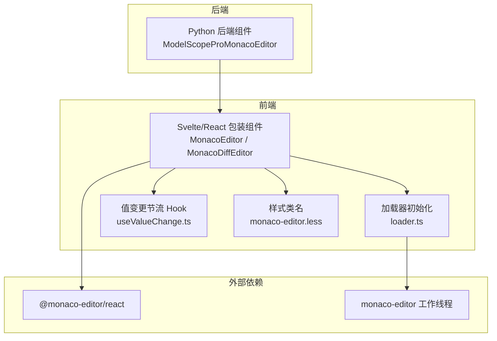
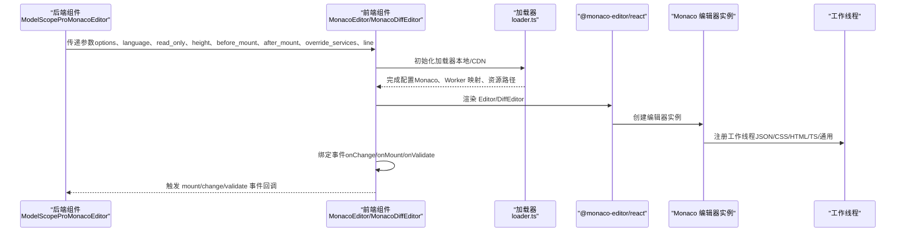
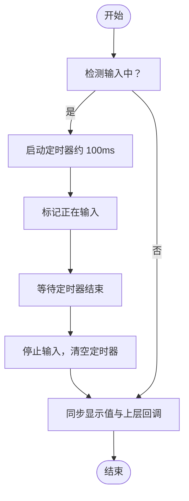
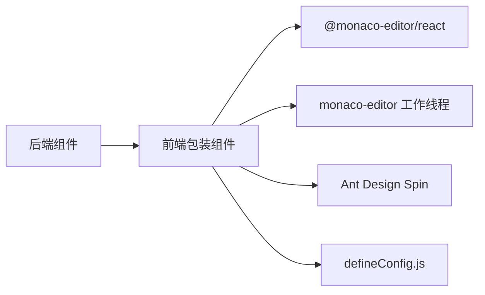

# 高级功能

<cite>
**本文引用的文件**
- [backend/modelscope_studio/components/pro/monaco_editor/__init__.py](file://backend/modelscope_studio/components/pro/monaco_editor/__init__.py)
- [frontend/pro/monaco-editor/monaco-editor.tsx](file://frontend/pro/monaco-editor/monaco-editor.tsx)
- [frontend/pro/monaco-editor/diff-editor/monaco-editor.diff-editor.tsx](file://frontend/pro/monaco-editor/diff-editor/monaco-editor.diff-editor.tsx)
- [frontend/pro/monaco-editor/loader.ts](file://frontend/pro/monaco-editor/loader.ts)
- [frontend/pro/monaco-editor/useValueChange.ts](file://frontend/pro/monaco-editor/useValueChange.ts)
- [frontend/pro/monaco-editor/monaco-editor.less](file://frontend/pro/monaco-editor/monaco-editor.less)
- [frontend/defineConfig.js](file://frontend/defineConfig.js)
- [backend/modelscope_studio/components/pro/components.py](file://backend/modelscope_studio/components/pro/components.py)
- [docs/components/pro/monaco_editor/demos/monaco_editor_options.py](file://docs/components/pro/monaco_editor/demos/monaco_editor_options.py)
</cite>

## 目录

1. [简介](#简介)
2. [项目结构](#项目结构)
3. [核心组件](#核心组件)
4. [架构总览](#架构总览)
5. [详细组件分析](#详细组件分析)
6. [依赖关系分析](#依赖关系分析)
7. [性能考量](#性能考量)
8. [故障排查指南](#故障排查指南)
9. [结论](#结论)
10. [附录](#附录)

## 简介

本篇“高级功能”文档聚焦于 MonacoEditor 在 ModelScope Studio 中的高级用法与扩展能力，涵盖以下主题：

- JavaScript 自定义：如何在挂载前后注入自定义逻辑（如语言服务、主题切换、事件绑定）
- 服务覆盖：通过 override_services 参数对 Monaco 内部服务进行替换或增强
- 加载器配置：本地加载与 CDN 加载两种模式的选择与配置
- 编辑器扩展：自定义语言支持、插件开发、主题定制
- 复杂场景集成：与 Gradio 生态系统（Blocks、ConfigProvider、Application）的深度集成示例
- 底层实现机制与性能优化：事件绑定、值同步策略、工作线程与资源路径管理

## 项目结构

MonacoEditor 的实现采用“后端组件 + 前端 Svelte/React 包装”的分层设计：

- 后端组件负责参数透传、事件绑定、加载器与服务覆盖配置
- 前端组件基于 @monaco-editor/react 进行封装，提供统一的 React/Svelte 接口，并内置加载器初始化、值变更节流、主题适配等功能

图表来源

- [backend/modelscope_studio/components/pro/monaco_editor/**init**.py:16-107](file://backend/modelscope_studio/components/pro/monaco_editor/__init__.py#L16-L107)
- [frontend/pro/monaco-editor/monaco-editor.tsx:1-95](file://frontend/pro/monaco-editor/monaco-editor.tsx#L1-L95)
- [frontend/pro/monaco-editor/diff-editor/monaco-editor.diff-editor.tsx:1-161](file://frontend/pro/monaco-editor/diff-editor/monaco-editor.diff-editor.tsx#L1-L161)
- [frontend/pro/monaco-editor/loader.ts:1-95](file://frontend/pro/monaco-editor/loader.ts#L1-L95)
- [frontend/pro/monaco-editor/useValueChange.ts:1-44](file://frontend/pro/monaco-editor/useValueChange.ts#L1-L44)
- [frontend/pro/monaco-editor/monaco-editor.less:1-7](file://frontend/pro/monaco-editor/monaco-editor.less#L1-L7)

章节来源

- [backend/modelscope_studio/components/pro/monaco_editor/**init**.py:16-107](file://backend/modelscope_studio/components/pro/monaco_editor/__init__.py#L16-L107)
- [frontend/pro/monaco-editor/monaco-editor.tsx:1-95](file://frontend/pro/monaco-editor/monaco-editor.tsx#L1-L95)
- [frontend/pro/monaco-editor/diff-editor/monaco-editor.diff-editor.tsx:1-161](file://frontend/pro/monaco-editor/diff-editor/monaco-editor.diff-editor.tsx#L1-L161)
- [frontend/pro/monaco-editor/loader.ts:1-95](file://frontend/pro/monaco-editor/loader.ts#L1-L95)
- [frontend/pro/monaco-editor/useValueChange.ts:1-44](file://frontend/pro/monaco-editor/useValueChange.ts#L1-L44)
- [frontend/pro/monaco-editor/monaco-editor.less:1-7](file://frontend/pro/monaco-editor/monaco-editor.less#L1-L7)

## 核心组件

- 后端组件：ModelScopeProMonacoEditor
  - 支持事件：mount、change、validate
  - 支持插槽：loading
  - 支持加载器配置：LOADER（默认 local 模式）
  - 关键参数：language、options、read_only、height、before_mount、after_mount、override_services、line
- 前端组件：MonacoEditor（单编辑器）、MonacoDiffEditor（差异编辑器）
  - 提供 themeMode、height、readOnly、onValueChange、loading 插槽等
  - 内置加载器初始化、值变更节流、主题映射（dark <-> vs-dark）

章节来源

- [backend/modelscope_studio/components/pro/monaco_editor/**init**.py:16-107](file://backend/modelscope_studio/components/pro/monaco_editor/__init__.py#L16-L107)
- [frontend/pro/monaco-editor/monaco-editor.tsx:12-95](file://frontend/pro/monaco-editor/monaco-editor.tsx#L12-L95)
- [frontend/pro/monaco-editor/diff-editor/monaco-editor.diff-editor.tsx:19-161](file://frontend/pro/monaco-editor/diff-editor/monaco-editor.diff-editor.tsx#L19-L161)

## 架构总览

下图展示从 Python 后端到前端包装组件，再到 Monaco 编辑器与工作线程的整体调用链路。

图表来源

- [backend/modelscope_studio/components/pro/monaco_editor/**init**.py:21-38](file://backend/modelscope_studio/components/pro/monaco_editor/__init__.py#L21-L38)
- [frontend/pro/monaco-editor/monaco-editor.tsx:38-91](file://frontend/pro/monaco-editor/monaco-editor.tsx#L38-L91)
- [frontend/pro/monaco-editor/diff-editor/monaco-editor.diff-editor.tsx:67-98](file://frontend/pro/monaco-editor/diff-editor/monaco-editor.diff-editor.tsx#L67-L98)
- [frontend/pro/monaco-editor/loader.ts:27-94](file://frontend/pro/monaco-editor/loader.ts#L27-L94)

## 详细组件分析

### 后端组件：ModelScopeProMonacoEditor

- 事件系统
  - mount：编辑器挂载时触发，用于执行 before_mount/after_mount 回调
  - change：编辑器内容变化时触发，可用于实时校验或保存
  - validate：标记（错误/警告）更新完成后触发
- 插槽与加载器
  - loading 插槽：可自定义加载态 UI
  - LOADER：支持本地（local）与 CDN 两种模式，默认 local
- 关键参数
  - language：语言标识，驱动语法高亮与语言服务
  - options：传递给 Monaco 的配置对象
  - read_only：只读模式
  - height：容器高度
  - before_mount/after_mount：挂载前后钩子
  - override_services：服务覆盖字典
  - line：定位到指定行（差异编辑器）

章节来源

- [backend/modelscope_studio/components/pro/monaco_editor/**init**.py:16-107](file://backend/modelscope_studio/components/pro/monaco_editor/__init__.py#L16-L107)

### 前端组件：MonacoEditor（单编辑器）

- 主题与尺寸
  - themeMode 映射：dark -> vs-dark；light -> light
  - height 控制容器高度
- 值变更与事件
  - 使用 useValueChange 实现输入节流（约 100ms），避免高频回调
  - onChange -> setValue -> onValueChange，确保与 Gradio 数据流一致
- 加载态
  - 默认加载态为 Spin，可通过 loading 插槽替换
- 工作线程与加载器
  - 由 loader.ts 初始化，按语言类型返回对应 Worker

章节来源

- [frontend/pro/monaco-editor/monaco-editor.tsx:21-95](file://frontend/pro/monaco-editor/monaco-editor.tsx#L21-L95)
- [frontend/pro/monaco-editor/useValueChange.ts:4-44](file://frontend/pro/monaco-editor/useValueChange.ts#L4-L44)
- [frontend/pro/monaco-editor/monaco-editor.less:1-7](file://frontend/pro/monaco-editor/monaco-editor.less#L1-L7)

### 前端组件：MonacoDiffEditor（差异编辑器）

- 特性
  - 支持 modified/original 双视图对比
  - onValidate：监听标记变化并回传 markers
  - line：自动滚动到指定行
- 生命周期与事件
  - onMount：注册内容变更与标记变更监听，清理时释放 IDisposable
  - onChange：将修改后的值同步到上层
- 加载态与主题
  - 与单编辑器一致的加载态与主题映射

章节来源

- [frontend/pro/monaco-editor/diff-editor/monaco-editor.diff-editor.tsx:35-161](file://frontend/pro/monaco-editor/diff-editor/monaco-editor.diff-editor.tsx#L35-L161)

### 加载器与服务覆盖

- 加载器初始化
  - initLocalLoader：动态导入 monaco-editor 与各类 Worker，设置 MonacoEnvironment.getWorker
  - initCDNLoader：通过 loader.config(paths.vs = cdn) 指定资源路径
- 服务覆盖
  - 后端通过 override_services 将服务字典传递至前端包装组件
  - 前端可在 before_mount 中访问 monaco 实例，进行服务替换或扩展（例如替换语言服务、注册自定义贡献点）

章节来源

- [frontend/pro/monaco-editor/loader.ts:27-94](file://frontend/pro/monaco-editor/loader.ts#L27-L94)
- [backend/modelscope_studio/components/pro/monaco_editor/**init**.py:54-84](file://backend/modelscope_studio/components/pro/monaco_editor/__init__.py#L54-L84)

### 值变更节流与数据流

图表来源

- [frontend/pro/monaco-editor/useValueChange.ts:14-32](file://frontend/pro/monaco-editor/useValueChange.ts#L14-L32)

## 依赖关系分析

- 组件耦合
  - 后端组件与前端包装组件通过参数透传强耦合，事件回调通过 Gradio 事件系统解耦
  - 前端组件与 Monaco 的耦合通过 @monaco-editor/react 与 loader.ts 解耦
- 外部依赖
  - @monaco-editor/react：编辑器渲染与生命周期管理
  - monaco-editor 工作线程：语言服务与语法解析
  - Ant Design Spin：加载态 UI
- 构建与打包
  - defineConfig.js 提供 Vite 插件与预处理配置，确保 Svelte/React 包装正常构建

图表来源

- [frontend/defineConfig.js:8-18](file://frontend/defineConfig.js#L8-L18)
- [frontend/pro/monaco-editor/monaco-editor.tsx:1-11](file://frontend/pro/monaco-editor/monaco-editor.tsx#L1-L11)

章节来源

- [frontend/defineConfig.js:8-18](file://frontend/defineConfig.js#L8-L18)
- [backend/modelscope_studio/components/pro/components.py:1-8](file://backend/modelscope_studio/components/pro/components.py#L1-L8)

## 性能考量

- 输入节流
  - useValueChange 以约 100ms 的定时器降低 onChange 频率，减少上层回调与重渲染压力
- Worker 分发
  - 按语言类型精确返回对应 Worker，避免不必要的多线程开销
- 资源路径
  - CDN 模式下通过 loader.config(paths.vs = cdn) 减少本地体积与首屏时间
- 主题切换
  - themeMode 切换仅影响主题映射，不重建编辑器实例，降低抖动

章节来源

- [frontend/pro/monaco-editor/useValueChange.ts:14-24](file://frontend/pro/monaco-editor/useValueChange.ts#L14-L24)
- [frontend/pro/monaco-editor/loader.ts:53-69](file://frontend/pro/monaco-editor/loader.ts#L53-L69)

## 故障排查指南

- 加载失败或白屏
  - 检查 LOADER 配置是否正确（local/CDN），确认 CDN 路径可达
  - 若使用 CDN，确保跨域与缓存策略正确
- 语言服务异常
  - 确认 language 设置与实际代码一致
  - 如需自定义语言服务，使用 before_mount 注入 monaco 服务替换逻辑
- 事件未触发
  - 确认已启用相应事件绑定（bind_mount_event/bind_change_event/bind_validate_event）
  - 检查 Gradio 事件系统是否正常（队列与 launch）
- 差异编辑器无法定位行
  - 确认 line 参数为有效数值，且 onMount 已完成后再设置

章节来源

- [backend/modelscope_studio/components/pro/monaco_editor/**init**.py:21-38](file://backend/modelscope_studio/components/pro/monaco_editor/__init__.py#L21-L38)
- [frontend/pro/monaco-editor/diff-editor/monaco-editor.diff-editor.tsx:109-113](file://frontend/pro/monaco-editor/diff-editor/monaco-editor.diff-editor.tsx#L109-L113)

## 结论

ModelScope Studio 的 MonacoEditor 高级功能围绕“参数透传 + 前端包装 + 加载器初始化 + 事件系统”展开，既保证了与 Gradio 生态的无缝集成，又提供了灵活的扩展点（语言服务、主题、加载策略）。通过节流与 Worker 精准分发，兼顾了交互流畅性与运行效率。

## 附录

### 与 Gradio 生态的集成示例

- Blocks 与 ConfigProvider：在 Blocks 上下文中使用组件，统一全局配置
- Application：提供应用级上下文，便于事件与状态管理
- 示例参考：演示了基础用法与 options 配置（如关闭 minimap、隐藏行号）

章节来源

- [docs/components/pro/monaco_editor/demos/monaco_editor_options.py:6-34](file://docs/components/pro/monaco_editor/demos/monaco_editor_options.py#L6-L34)
