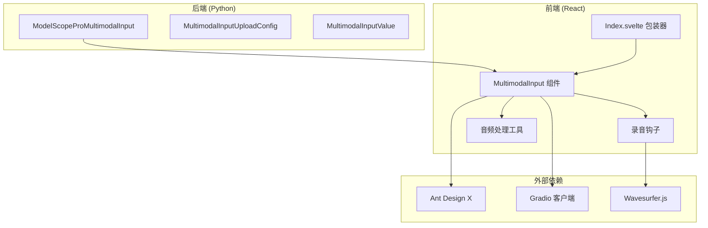
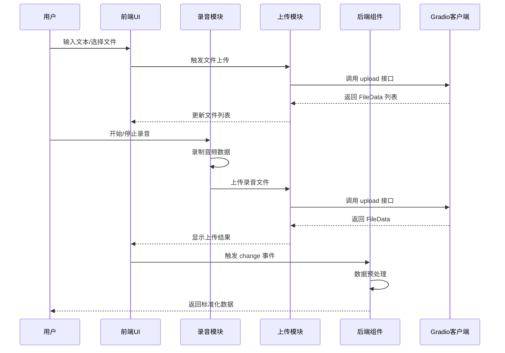
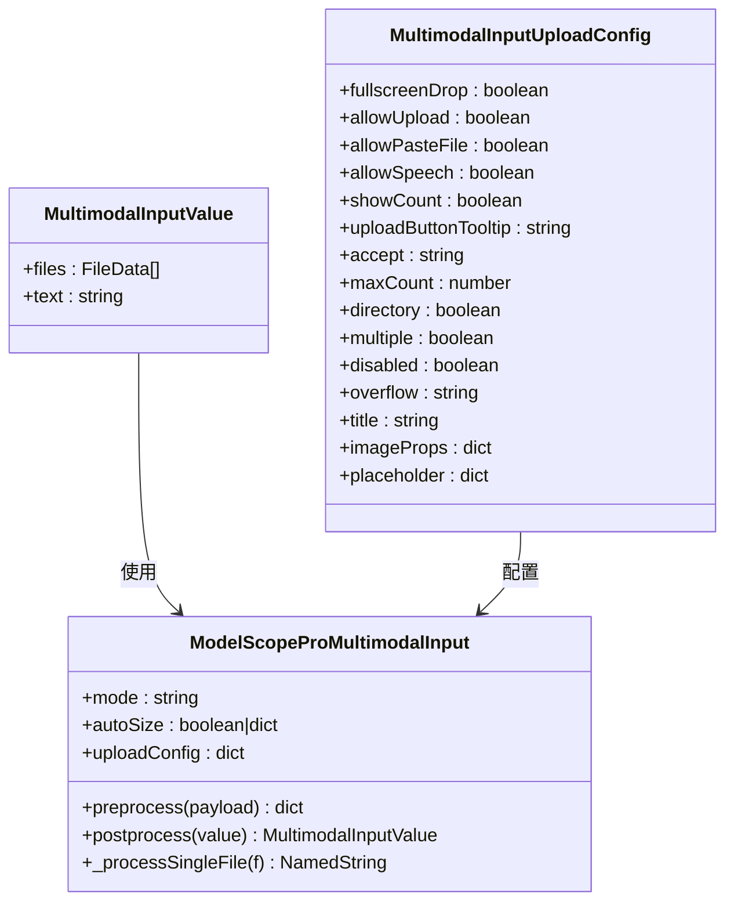
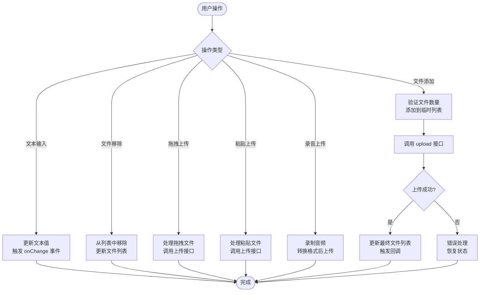
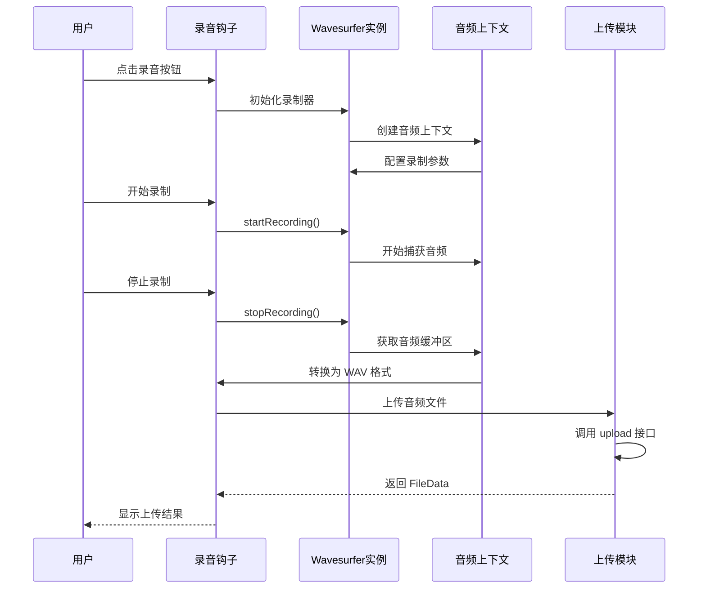
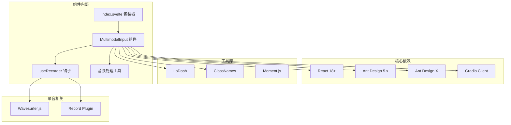

# MultimodalInput 多模态输入框

<cite>
**本文档引用的文件**
- [backend 模块定义](file://backend/modelscope_studio/components/pro/multimodal_input/__init__.py)
- [前端组件实现](file://frontend/pro/multimodal-input/multimodal-input.tsx)
- [前端入口包装](file://frontend/pro/multimodal-input/Index.svelte)
- [录音钩子](file://frontend/pro/multimodal-input/recorder.ts)
- [音频处理工具](file://frontend/pro/multimodal-input/utils.ts)
- [组件文档说明](file://docs/components/pro/multimodal_input/README.md)
- [组件包导出配置](file://frontend/pro/multimodal-input/package.json)
- [组件打包配置](file://frontend/pro/multimodal-input/gradio.config.js)
</cite>

## 目录

1. [简介](#简介)
2. [项目结构](#项目结构)
3. [核心组件](#核心组件)
4. [架构总览](#架构总览)
5. [详细组件分析](#详细组件分析)
6. [依赖关系分析](#依赖关系分析)
7. [性能考虑](#性能考虑)
8. [故障排除指南](#故障排除指南)
9. [结论](#结论)
10. [附录](#附录)

## 简介

MultimodalInput 是一个基于 Ant Design X 的多模态输入组件，支持文本输入、文件上传、语音录制、粘贴上传、拖拽上传等多种交互方式。该组件在前端通过 React 实现，在后端通过 Gradio 组件桥接，提供完整的多模态数据处理能力。

组件主要特性包括：

- 文本输入与自动高度调整
- 文件上传（单个/多个、目录上传）
- 语音录制（基于 Web Audio API）
- 粘贴上传（剪贴板文件）
- 拖拽上传（支持全屏拖拽）
- 实时预览与下载
- 可配置的附件面板
- 结构化输入支持（技能/插槽模式）

## 项目结构

MultimodalInput 组件采用前后端分离的架构设计：

**图表来源**

- [backend 模块定义:18-259](file://backend/modelscope_studio/components/pro/multimodal_input/__init__.py#L18-L259)
- [前端组件实现:1-619](file://frontend/pro/multimodal-input/multimodal-input.tsx#L1-L619)
- [前端入口包装:1-99](file://frontend/pro/multimodal-input/Index.svelte#L1-L99)

**章节来源**

- [backend 模块定义:1-259](file://backend/modelscope_studio/components/pro/multimodal_input/__init__.py#L1-L259)
- [前端组件实现:1-619](file://frontend/pro/multimodal-input/multimodal-input.tsx#L1-L619)
- [前端入口包装:1-99](file://frontend/pro/multimodal-input/Index.svelte#L1-L99)

## 核心组件

MultimodalInput 由三个核心部分组成：

### 后端组件类

后端通过 ModelScopeProMultimodalInput 类实现，继承自 ModelScopeDataLayoutComponent，提供完整的 Gradio 组件生命周期管理。

### 前端组件实现

前端使用 React + TypeScript 实现，基于 @ant-design/x 的 Sender 和 Attachments 组件构建。

### 录音功能模块

集成 Wavesurfer.js 提供录音录制功能，支持实时波形显示和音频格式转换。

**章节来源**

- [backend 模块定义:82-259](file://backend/modelscope_studio/components/pro/multimodal_input/__init__.py#L82-L259)
- [前端组件实现:75-104](file://frontend/pro/multimodal-input/multimodal-input.tsx#L75-L104)
- [录音钩子:11-47](file://frontend/pro/multimodal-input/recorder.ts#L11-L47)

## 架构总览

MultimodalInput 采用分层架构设计，确保前后端数据流的清晰分离：

**图表来源**

- [前端组件实现:157-169](file://frontend/pro/multimodal-input/multimodal-input.tsx#L157-L169)
- [前端组件实现:220-246](file://frontend/pro/multimodal-input/multimodal-input.tsx#L220-L246)
- [前端入口包装:68-75](file://frontend/pro/multimodal-input/Index.svelte#L68-L75)

## 详细组件分析

### 数据模型与类型定义

**图表来源**

- [backend 模块定义:18-80](file://backend/modelscope_studio/components/pro/multimodal_input/__init__.py#L18-L80)
- [backend 模块定义:82-205](file://backend/modelscope_studio/components/pro/multimodal_input/__init__.py#L82-L205)

### 上传配置详解

| 配置项              | 类型    | 默认值        | 描述                           |
| ------------------- | ------- | ------------- | ------------------------------ |
| fullscreenDrop      | boolean | false         | 是否允许全屏拖拽文件到附件区域 |
| allowUpload         | boolean | true          | 是否允许文件上传               |
| allowPasteFile      | boolean | true          | 是否允许粘贴文件上传           |
| allowSpeech         | boolean | false         | 是否允许语音输入               |
| showCount           | boolean | true          | 附件面板关闭时是否显示文件数量 |
| uploadButtonTooltip | string  | null          | 上传按钮的提示信息             |
| accept              | string  | null          | 接受的文件类型                 |
| maxCount            | number  | null          | 上传文件数量限制               |
| directory           | boolean | false         | 支持上传整个目录               |
| multiple            | boolean | false         | 支持多文件选择                 |
| disabled            | boolean | false         | 禁用文件上传                   |
| overflow            | string  | null          | 文件列表溢出行为               |
| title               | string  | "Attachments" | 附件面板标题                   |
| imageProps          | dict    | null          | 图片配置                       |
| placeholder         | dict    | 内置占位符    | 无文件时的占位信息             |

### 事件处理机制

**图表来源**

- [前端组件实现:511-602](file://frontend/pro/multimodal-input/multimodal-input.tsx#L511-L602)
- [前端组件实现:352-360](file://frontend/pro/multimodal-input/multimodal-input.tsx#L352-L360)

### 录音功能实现

录音功能通过 Wavesurfer.js 实现，支持以下特性：

- 实时波形显示
- 音频格式转换（WAV）
- 自动裁剪和重采样
- 录制状态管理

**图表来源**

- [录音钩子:24-41](file://frontend/pro/multimodal-input/recorder.ts#L24-L41)
- [音频处理工具:94-126](file://frontend/pro/multimodal-input/utils.ts#L94-L126)

**章节来源**

- [录音钩子:1-48](file://frontend/pro/multimodal-input/recorder.ts#L1-L48)
- [音频处理工具:1-127](file://frontend/pro/multimodal-input/utils.ts#L1-L127)

## 依赖关系分析

**图表来源**

- [前端组件实现:1-26](file://frontend/pro/multimodal-input/multimodal-input.tsx#L1-L26)
- [录音钩子:1-5](file://frontend/pro/multimodal-input/recorder.ts#L1-L5)
- [组件包导出配置:1-15](file://frontend/pro/multimodal-input/package.json#L1-L15)

**章节来源**

- [组件包导出配置:1-15](file://frontend/pro/multimodal-input/package.json#L1-L15)
- [组件打包配置:1-4](file://frontend/pro/multimodal-input/gradio.config.js#L1-L4)

## 性能考虑

MultimodalInput 在设计时充分考虑了性能优化：

### 文件上传优化

- 支持批量上传控制，通过 maxCount 限制同时上传的文件数量
- 采用临时文件列表机制，避免重复渲染
- 异步上传处理，不阻塞主线程

### 内存管理

- 录音结束后及时释放音频上下文资源
- 文件上传完成后清理临时文件引用
- 使用 useMemoizedFn 优化函数引用

### 渲染优化

- 条件渲染附件面板，减少不必要的 DOM 元素
- 使用虚拟滚动处理大量文件列表
- 按需加载录音插件

## 故障排除指南

### 常见问题及解决方案

**问题1：录音功能无法使用**

- 检查浏览器权限设置
- 确认 HTTPS 环境（录音需要安全上下文）
- 验证麦克风设备可用性

**问题2：文件上传失败**

- 检查网络连接状态
- 验证文件大小限制
- 确认服务器上传接口正常

**问题3：拖拽上传无响应**

- 确认 fullscreenDrop 配置正确
- 检查 CSS 样式冲突
- 验证浏览器兼容性

**问题4：音频格式不兼容**

- 确认浏览器支持 WAV 格式
- 检查音频采样率设置
- 验证音频通道数配置

**章节来源**

- [录音钩子:24-41](file://frontend/pro/multimodal-input/recorder.ts#L24-L41)
- [前端组件实现:178-179](file://frontend/pro/multimodal-input/multimodal-input.tsx#L178-L179)

## 结论

MultimodalInput 是一个功能完整、架构清晰的多模态输入组件。它通过合理的分层设计和完善的错误处理机制，为开发者提供了强大的富媒体输入能力。组件支持多种输入方式，具有良好的扩展性和可配置性，适合构建各种复杂的富媒体应用界面。

## 附录

### 使用示例概览

由于代码片段内容较多，建议参考官方文档中的示例页面获取完整的使用示例。

### API 参考

组件支持的完整属性和事件接口，请参考组件文档中的 API 部分。

### 版本兼容性

- React 18+
- Ant Design 5.x
- Ant Design X
- Gradio 3.x+
