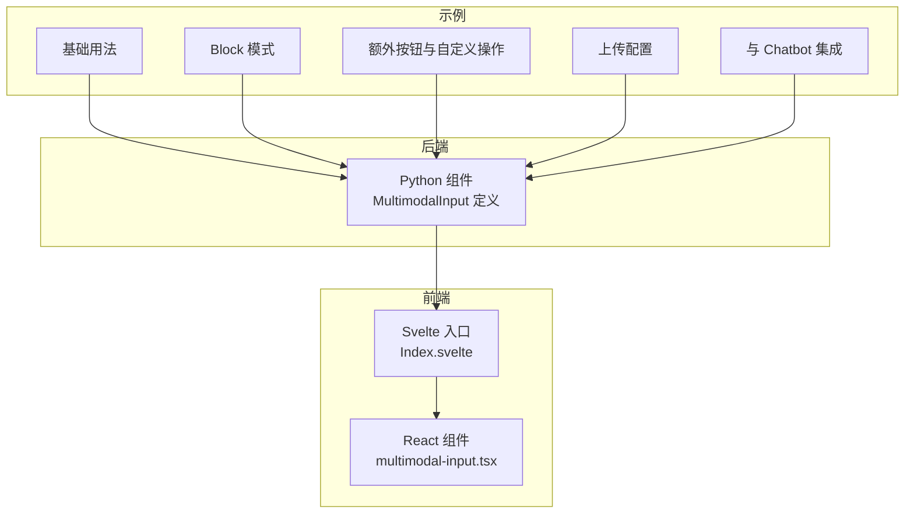
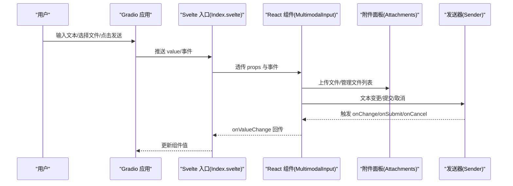
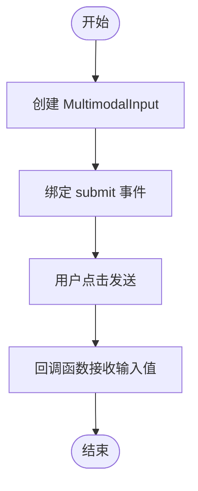
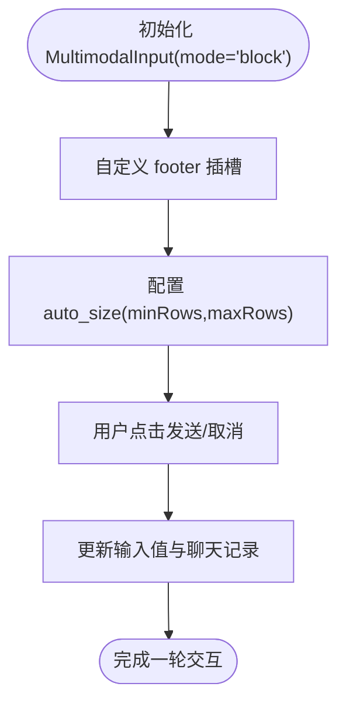
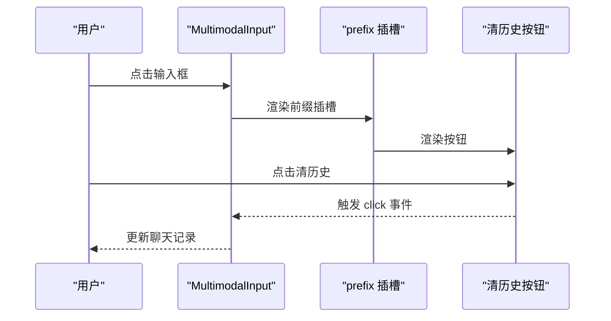
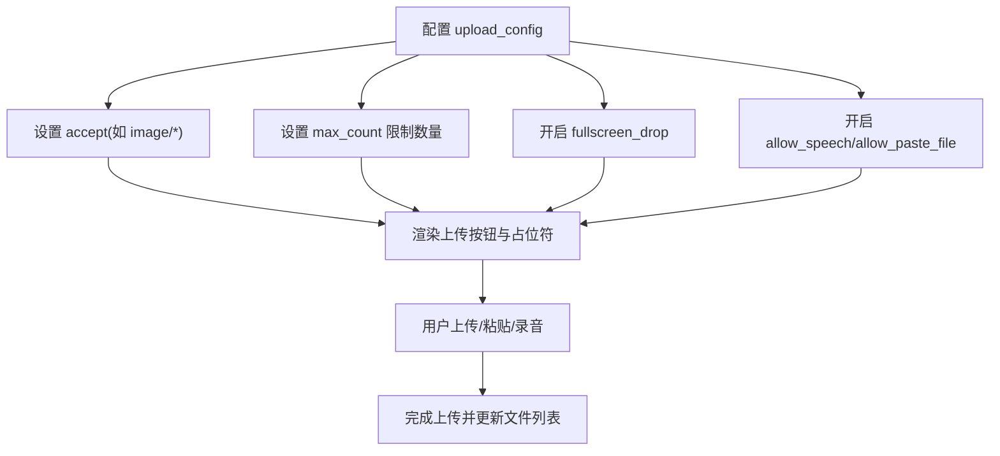
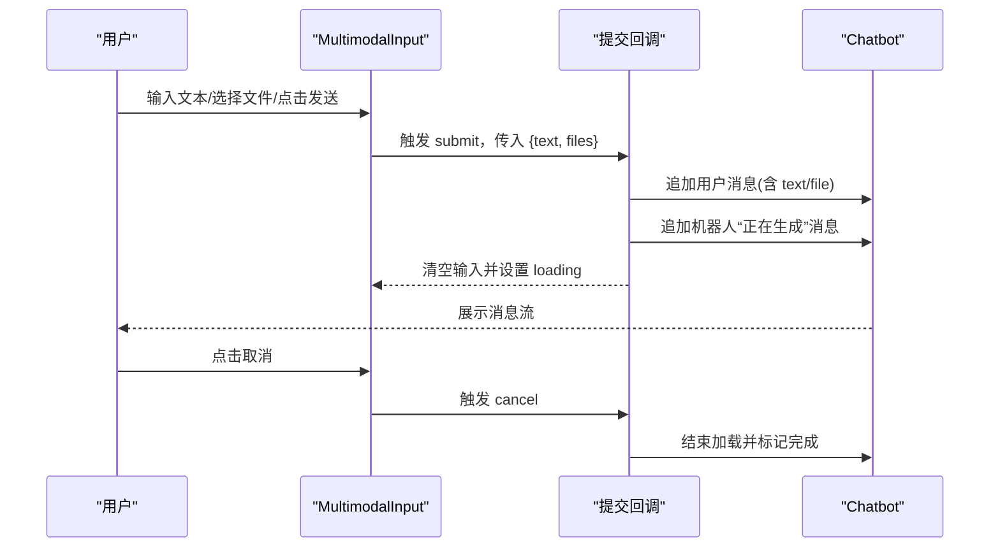
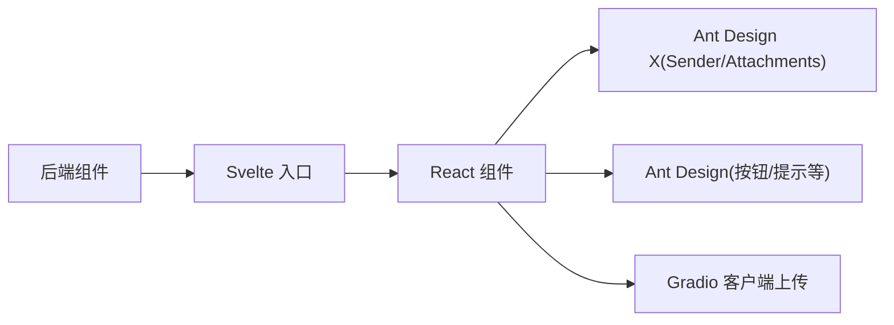

# 使用示例

<cite>
**本文引用的文件**
- [backend 模块：MultimodalInput 定义](file://backend/modelscope_studio/components/pro/multimodal_input/__init__.py)
- [前端索引：MultimodalInput 组件入口](file://frontend/pro/multimodal-input/Index.svelte)
- [前端实现：MultimodalInput React 组件](file://frontend/pro/multimodal-input/multimodal-input.tsx)
- [示例：基础用法](file://docs/components/pro/multimodal_input/demos/basic.py)
- [示例：Block 模式](file://docs/components/pro/multimodal_input/demos/block_mode.py)
- [示例：额外按钮与自定义操作](file://docs/components/pro/multimodal_input/demos/extra_button.py)
- [示例：上传配置](file://docs/components/pro/multimodal_input/demos/upload_config.py)
- [示例：与 Chatbot 组件集成](file://docs/components/pro/multimodal_input/demos/with_chatbot.py)
- [Chatbot 组件文档（中文）](file://docs/components/pro/chatbot/README-zh_CN.md)
</cite>

## 目录

1. [简介](#简介)
2. [项目结构](#项目结构)
3. [核心组件](#核心组件)
4. [架构总览](#架构总览)
5. [详细组件分析](#详细组件分析)
6. [依赖关系分析](#依赖关系分析)
7. [性能考量](#性能考量)
8. [故障排查指南](#故障排查指南)
9. [结论](#结论)
10. [附录](#附录)

## 简介

本文件面向希望在 Gradio/ModelScope Studio 生态中使用 MultimodalInput 组件的开发者，提供从基础文本输入到与 Chatbot 集成的完整使用示例与说明。内容涵盖：

- 基础用法：最简单的文本输入与提交流程
- Block 模式：将输入区与发送按钮分离渲染，适合更复杂的布局
- 自定义操作：通过插槽添加前缀/后缀按钮与工具栏
- 上传配置：限制文件类型、数量、粘贴/语音等能力
- 与 Chatbot 集成：在真实聊天应用中接收用户文本与文件，并处理取消与加载态

## 项目结构

MultimodalInput 由后端 Python 组件与前端 React/Svelte 实现组成，文档示例位于 docs/components/pro/multimodal_input/demos。

**图表来源**

- [前端索引：MultimodalInput 组件入口:1-99](file://frontend/pro/multimodal-input/Index.svelte#L1-L99)
- [前端实现：MultimodalInput React 组件:1-619](file://frontend/pro/multimodal-input/multimodal-input.tsx#L1-L619)
- [示例：基础用法:1-17](file://docs/components/pro/multimodal_input/demos/basic.py#L1-L17)
- [示例：Block 模式:1-81](file://docs/components/pro/multimodal_input/demos/block_mode.py#L1-L81)
- [示例：额外按钮与自定义操作:1-78](file://docs/components/pro/multimodal_input/demos/extra_button.py#L1-L78)
- [示例：上传配置:1-38](file://docs/components/pro/multimodal_input/demos/upload_config.py#L1-L38)
- [示例：与 Chatbot 组件集成:1-57](file://docs/components/pro/multimodal_input/demos/with_chatbot.py#L1-L57)

**章节来源**

- [前端索引：MultimodalInput 组件入口:1-99](file://frontend/pro/multimodal-input/Index.svelte#L1-L99)
- [前端实现：MultimodalInput React 组件:1-619](file://frontend/pro/multimodal-input/multimodal-input.tsx#L1-L619)
- [示例：基础用法:1-17](file://docs/components/pro/multimodal_input/demos/basic.py#L1-L17)
- [示例：Block 模式:1-81](file://docs/components/pro/multimodal_input/demos/block_mode.py#L1-L81)
- [示例：额外按钮与自定义操作:1-78](file://docs/components/pro/multimodal_input/demos/extra_button.py#L1-L78)
- [示例：上传配置:1-38](file://docs/components/pro/multimodal_input/demos/upload_config.py#L1-L38)
- [示例：与 Chatbot 组件集成:1-57](file://docs/components/pro/multimodal_input/demos/with_chatbot.py#L1-L57)

## 核心组件

- 后端组件：ModelScopeProMultimodalInput 提供值模型、事件绑定、预处理/后处理逻辑与前端目录映射
- 前端组件：MultimodalInput（React）封装 Sender 与 Attachments，支持文本输入、文件上传、语音录制、粘贴文件、插槽扩展等
- 插槽：支持 header/prefix/footer/suffix 以及技能相关插槽（skill.\*）

关键点

- 值模型：MultimodalInputValue 包含 text 与 files 字段
- 事件：change/submit/cancel/key_down/key_press/focus/blur/upload/paste/paste_file/skill_closable_close/drop/download/preview/remove
- 模式：mode 支持 inline 与 block；block 模式下 footer 渲染为独立区域，包含发送/加载/语音等控件

**章节来源**

- [backend 模块：MultimodalInput 定义:76-259](file://backend/modelscope_studio/components/pro/multimodal_input/__init__.py#L76-L259)
- [前端实现：MultimodalInput React 组件:32-104](file://frontend/pro/multimodal-input/multimodal-input.tsx#L32-L104)

## 架构总览

MultimodalInput 在前端通过 Svelte 入口导入 React 组件，将 Gradio 侧的 props 与事件桥接至 React 组件内部，再将值变化回传给 Gradio。

**图表来源**

- [前端索引：MultimodalInput 组件入口:68-98](file://frontend/pro/multimodal-input/Index.svelte#L68-L98)
- [前端实现：MultimodalInput React 组件:311-351](file://frontend/pro/multimodal-input/multimodal-input.tsx#L311-L351)

## 详细组件分析

### 基础用法

- 目标：展示最基本的文本输入与提交
- 关键点：创建 MultimodalInput 并绑定 submit 事件，函数接收输入值（包含 text 与 files）
- 适用场景：快速搭建聊天输入框，无需文件上传或额外按钮

**图表来源**

- [示例：基础用法:7-16](file://docs/components/pro/multimodal_input/demos/basic.py#L7-L16)

**章节来源**

- [示例：基础用法:1-17](file://docs/components/pro/multimodal_input/demos/basic.py#L1-L17)

### Block 模式

- 目标：将输入区与发送按钮分离，footer 区域自定义布局
- 关键点：mode="block"；footer 插槽内可放置“清历史”等按钮；auto_size 控制行数范围
- 适用场景：需要更清晰的输入/操作分离布局，如垂直布局的聊天窗口

**图表来源**

- [示例：Block 模式:57-77](file://docs/components/pro/multimodal_input/demos/block_mode.py#L57-L77)

**章节来源**

- [示例：Block 模式:1-81](file://docs/components/pro/multimodal_input/demos/block_mode.py#L1-L81)

### 添加额外按钮与自定义操作

- 目标：通过插槽在前缀/后缀区域添加按钮与图标
- 关键点：使用 ms.Slot("prefix")/("suffix") 注入按钮；结合 Tooltip/Button/Icon 实现“清历史”等操作
- 适用场景：在输入框旁增加常用操作入口，提升交互效率

**图表来源**

- [示例：额外按钮与自定义操作:59-74](file://docs/components/pro/multimodal_input/demos/extra_button.py#L59-L74)

**章节来源**

- [示例：额外按钮与自定义操作:1-78](file://docs/components/pro/multimodal_input/demos/extra_button.py#L1-L78)

### 上传配置（文件类型、数量、粘贴/语音等）

- 目标：灵活控制文件上传行为与外观
- 关键点：MultimodalInputUploadConfig 支持 accept、max_count、fullscreen_drop、multiple、allow_speech、allow_paste_file、placeholder 等
- 适用场景：限制上传类型（如图片）、限制数量、启用全屏拖拽、允许语音/粘贴文件

**图表来源**

- [示例：上传配置:12-34](file://docs/components/pro/multimodal_input/demos/upload_config.py#L12-L34)

**章节来源**

- [示例：上传配置:1-38](file://docs/components/pro/multimodal_input/demos/upload_config.py#L1-L38)

### 与 Chatbot 组件集成

- 目标：在真实聊天应用中接收用户文本与文件，并处理取消与加载态
- 关键点：MultimodalInput.submit 输出 {text, files}；Chatbot 支持多模态消息（text/file/tool/suggestion），可通过 value 列表管理消息流
- 适用场景：构建带文件/语音输入的智能客服、问答助手等

**图表来源**

- [示例：与 Chatbot 组件集成:10-53](file://docs/components/pro/multimodal_input/demos/with_chatbot.py#L10-L53)
- [Chatbot 组件文档（中文）:298-349](file://docs/components/pro/chatbot/README-zh_CN.md#L298-L349)

**章节来源**

- [示例：与 Chatbot 组件集成:1-57](file://docs/components/pro/multimodal_input/demos/with_chatbot.py#L1-L57)
- [Chatbot 组件文档（中文）:1-354](file://docs/components/pro/chatbot/README-zh_CN.md#L1-L354)

## 依赖关系分析

- 后端依赖：Gradio 数据类、事件系统、文件处理工具
- 前端依赖：@ant-design/x 的 Sender/Attachments、Ant Design 图标与组件、Gradio 客户端上传工具
- 插槽与事件：通过 slots 与事件名映射（如 key_press/paste_file）桥接到 React 侧

**图表来源**

- [前端实现：MultimodalInput React 组件:1-26](file://frontend/pro/multimodal-input/multimodal-input.tsx#L1-L26)
- [前端索引：MultimodalInput 组件入口:1-15](file://frontend/pro/multimodal-input/Index.svelte#L1-L15)

**章节来源**

- [前端实现：MultimodalInput React 组件:1-619](file://frontend/pro/multimodal-input/multimodal-input.tsx#L1-L619)
- [前端索引：MultimodalInput 组件入口:1-99](file://frontend/pro/multimodal-input/Index.svelte#L1-L99)

## 性能考量

- 上传节流与并发：前端对上传状态进行 uploading 标记，避免重复上传
- 文件去重与合并：根据 uid 合并临时文件与服务端返回数据，减少重复渲染
- 行为限制：max_count 与 multiple 可降低一次性上传压力
- 加载态与取消：loading 与 cancel 事件用于中断长任务，改善用户体验

[本节为通用建议，不直接分析具体文件]

## 故障排查指南

- 无法上传文件
  - 检查 upload_config 的 allow_upload/disabled 与 max_count
  - 确认文件类型与 accept 设置
- 上传后未显示文件
  - 确认 onUpload 回调与 onChange 是否正确更新 value
- 发送按钮不可用
  - 检查 disabled/loading/read_only 状态
- 取消无效
  - 确保 cancel 绑定的 cancels 正确指向 submit 事件
- Block 模式 footer 不显示
  - 确认 mode="block" 且 footer 插槽正确注入

**章节来源**

- [前端实现：MultimodalInput React 组件:174-246](file://frontend/pro/multimodal-input/multimodal-input.tsx#L174-L246)
- [示例：Block 模式:69-77](file://docs/components/pro/multimodal_input/demos/block_mode.py#L69-L77)

## 结论

MultimodalInput 提供了从基础文本输入到复杂多模态交互的一体化能力：通过简洁的 API 与灵活的插槽系统，既能满足快速集成需求，也能支持更丰富的交互设计。结合 Chatbot 组件，可轻松构建具备文件/语音输入能力的智能聊天应用。

[本节为总结性内容，不直接分析具体文件]

## 附录

- 值模型与事件参考
  - 值模型：MultimodalInputValue(text, files)
  - 事件：change/submit/cancel/key_down/key_press/focus/blur/upload/paste/paste_file/skill_closable_close/drop/download/preview/remove
- 插槽清单：suffix/header/prefix/footer/skill.title/skill.toolTip.title/skill.closable.closeIcon

**章节来源**

- [backend 模块：MultimodalInput 定义:76-143](file://backend/modelscope_studio/components/pro/multimodal_input/__init__.py#L76-L143)
- [前端实现：MultimodalInput React 组件:95-104](file://frontend/pro/multimodal-input/multimodal-input.tsx#L95-L104)
