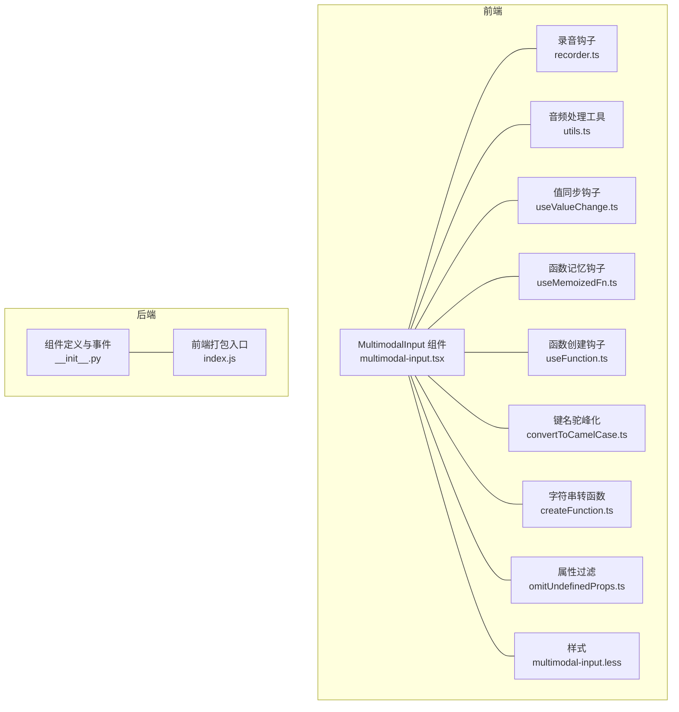
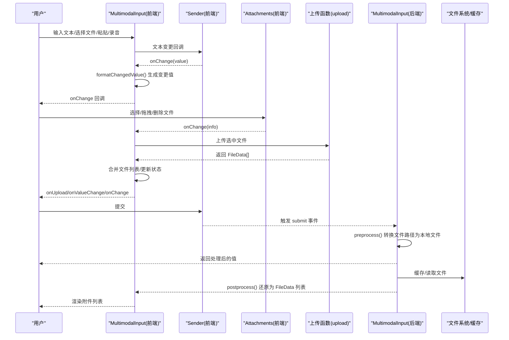
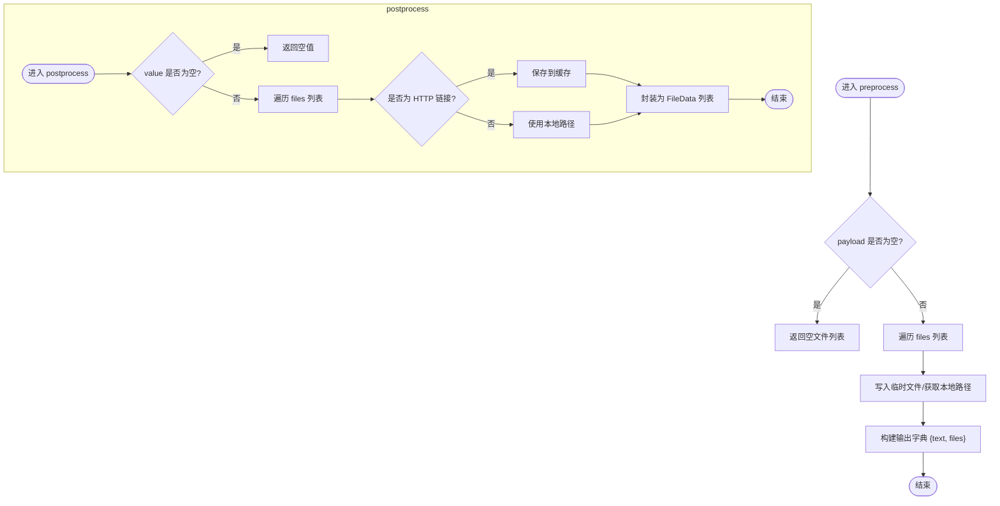
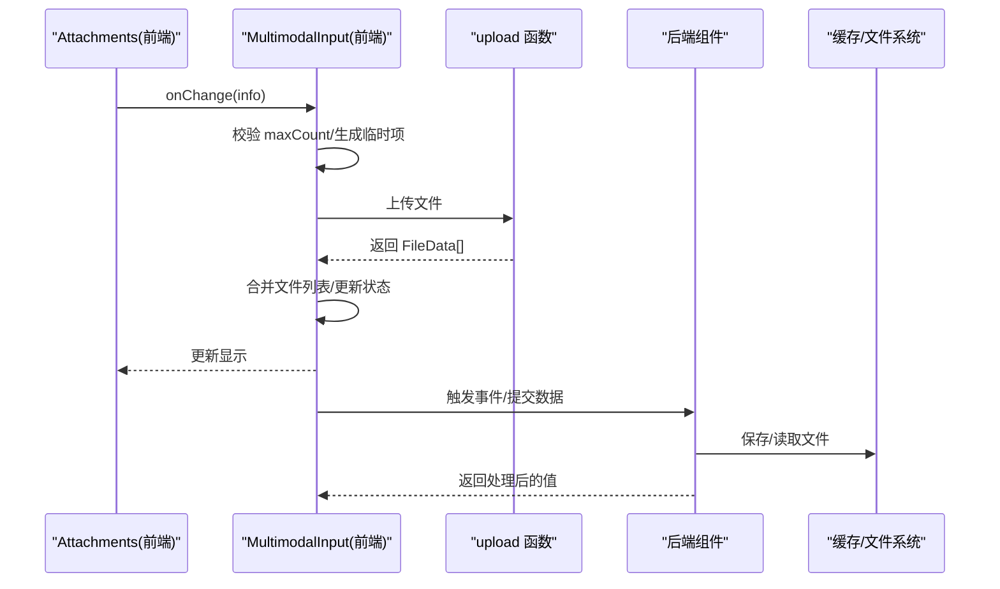
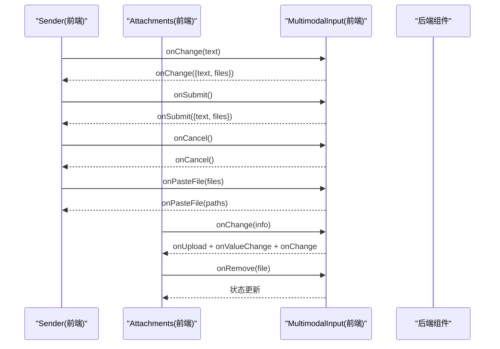
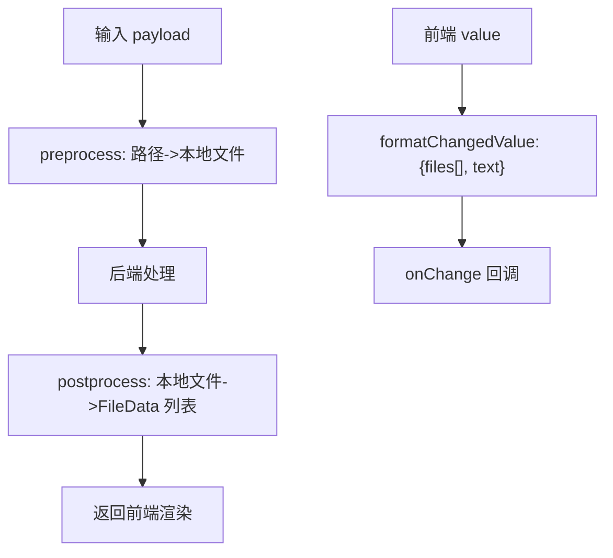
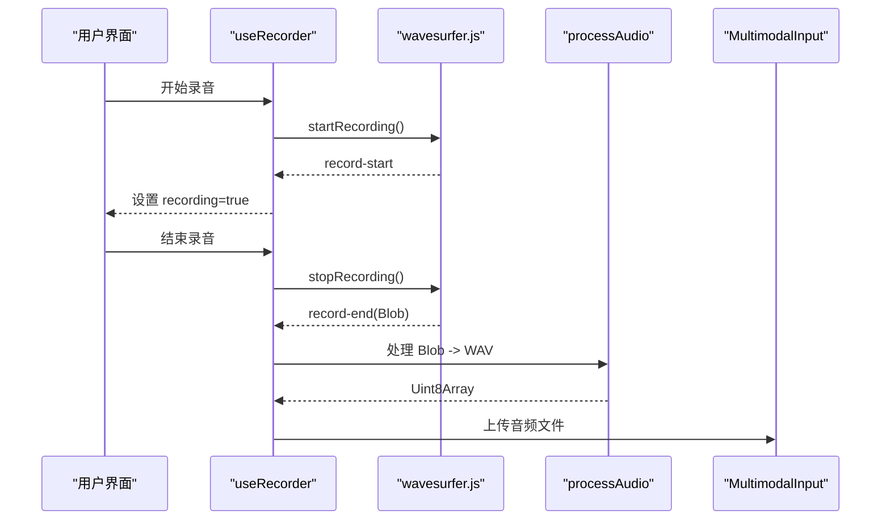
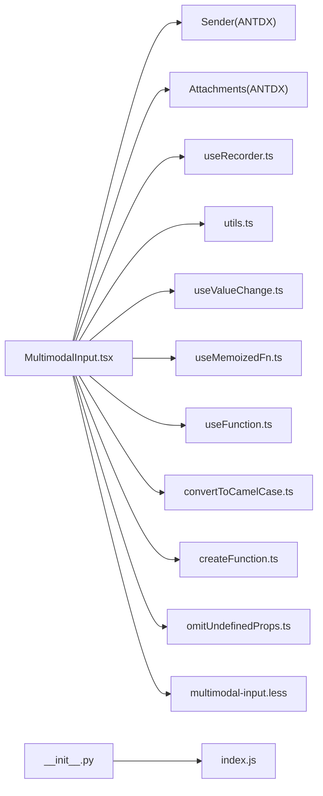

# 数据处理机制

<cite>
**本文引用的文件**
- [multimodal-input.tsx](file://frontend/pro/multimodal-input/multimodal-input.tsx)
- [recorder.ts](file://frontend/pro/multimodal-input/recorder.ts)
- [utils.ts](file://frontend/pro/multimodal-input/utils.ts)
- [useValueChange.ts](file://frontend/utils/hooks/useValueChange.ts)
- [useMemoizedFn.ts](file://frontend/utils/hooks/useMemoizedFn.ts)
- [useFunction.ts](file://frontend/utils/hooks/useFunction.ts)
- [convertToCamelCase.ts](file://frontend/utils/convertToCamelCase.ts)
- [createFunction.ts](file://frontend/utils/createFunction.ts)
- [omitUndefinedProps.ts](file://frontend/utils/omitUndefinedProps.ts)
- [multimodal-input.less](file://frontend/pro/multimodal-input/multimodal-input.less)
- [__init__.py](file://backend/modelscope_studio/components/pro/multimodal_input/__init__.py)
- [index.js](file://backend/modelscope_studio/components/pro/multimodal_input/templates/component/index.js)
- [basic.py](file://docs/components/pro/multimodal_input/demos/basic.py)
- [README.md](file://docs/components/pro/multimodal_input/README.md)
</cite>

## 目录

1. [简介](#简介)
2. [项目结构](#项目结构)
3. [核心组件](#核心组件)
4. [架构总览](#架构总览)
5. [详细组件分析](#详细组件分析)
6. [依赖关系分析](#依赖关系分析)
7. [性能考量](#性能考量)
8. [故障排查指南](#故障排查指南)
9. [结论](#结论)
10. [附录](#附录)

## 简介

本文件聚焦 MultimodalInput 组件的数据处理机制，系统阐述以下内容：

- 前端与后端的数据模型与转换流程（preprocess/postprocess）
- 文件上传、下载、缓存处理策略
- 事件监听机制（change、submit、cancel、upload、paste 等）及其触发条件与回调处理
- 数据格式转换与错误处理最佳实践

## 项目结构

MultimodalInput 的实现横跨前端与后端两部分：

- 前端：基于 Ant Design X 的 Sender 与 Attachments，结合录音与上传逻辑，负责用户交互与数据格式化
- 后端：基于 Gradio 的数据类与事件绑定，负责输入预处理与输出后处理

图示来源

- [multimodal-input.tsx:1-619](file://frontend/pro/multimodal-input/multimodal-input.tsx#L1-L619)
- [recorder.ts:1-48](file://frontend/pro/multimodal-input/recorder.ts#L1-L48)
- [utils.ts:1-127](file://frontend/pro/multimodal-input/utils.ts#L1-L127)
- [useValueChange.ts:1-30](file://frontend/utils/hooks/useValueChange.ts#L1-L30)
- [useMemoizedFn.ts:1-11](file://frontend/utils/hooks/useMemoizedFn.ts#L1-L11)
- [useFunction.ts:1-13](file://frontend/utils/hooks/useFunction.ts#L1-L13)
- [convertToCamelCase.ts:1-22](file://frontend/utils/convertToCamelCase.ts#L1-L22)
- [createFunction.ts:1-38](file://frontend/utils/createFunction.ts#L1-L38)
- [omitUndefinedProps.ts:1-17](file://frontend/utils/omitUndefinedProps.ts#L1-L17)
- [multimodal-input.less:1-13](file://frontend/pro/multimodal-input/multimodal-input.less#L1-L13)
- [**init**.py:1-259](file://backend/modelscope_studio/components/pro/multimodal_input/__init__.py#L1-L259)
- [index.js:1-6](file://backend/modelscope_studio/components/pro/multimodal_input/templates/component/index.js#L1-L6)

章节来源

- [multimodal-input.tsx:1-619](file://frontend/pro/multimodal-input/multimodal-input.tsx#L1-L619)
- [**init**.py:1-259](file://backend/modelscope_studio/components/pro/multimodal_input/__init__.py#L1-L259)

## 核心组件

- 前端组件：MultimodalInput（基于 sveltify 包装的 React 组件），内部组合 Sender 与 Attachments，并集成录音能力
- 后端组件：ModelScopeProMultimodalInput（Gradio 组件），定义数据模型与事件绑定

关键职责：

- 前端：维护本地状态（文本与文件列表）、处理上传/粘贴/删除等交互、格式化变更值、触发事件回调
- 后端：preprocess 将前端传入的文件路径转换为可缓存的本地文件；postprocess 将本地文件还原为可展示的 FileData 列表

章节来源

- [multimodal-input.tsx:32-104](file://frontend/pro/multimodal-input/multimodal-input.tsx#L32-L104)
- [**init**.py:76-137](file://backend/modelscope_studio/components/pro/multimodal_input/__init__.py#L76-L137)

## 架构总览

MultimodalInput 的数据流从用户交互开始，贯穿前端状态管理、上传处理、后端预处理与后处理，最终回到前端渲染。

图示来源

- [multimodal-input.tsx:336-360](file://frontend/pro/multimodal-input/multimodal-input.tsx#L336-L360)
- [multimodal-input.tsx:511-602](file://frontend/pro/multimodal-input/multimodal-input.tsx#L511-L602)
- [multimodal-input.tsx:220-246](file://frontend/pro/multimodal-input/multimodal-input.tsx#L220-L246)
- [**init**.py:213-248](file://backend/modelscope_studio/components/pro/multimodal_input/__init__.py#L213-L248)

## 详细组件分析

### 数据模型与字段含义

- 前端数据模型
  - MultimodalInputValue：包含 text（文本）与 files（文件数组）两个字段
  - MultimodalInputChangedValue：用于 onChange 回调，files 为文件路径数组，text 为文本
- 后端数据模型
  - MultimodalInputValue：与前端一致，但 files 为 Gradio 的 ListFiles 类型
  - MultimodalInputUploadConfig：控制上传行为（如是否允许上传、粘贴、语音、最大数量等）

字段说明（摘自类型定义与注释）：

- files：文件集合，支持多文件与单文件模式
- text：用户输入的文本内容
- upload_config：上传配置对象，含 fullscreen_drop、allow_upload、allow_paste_file、allow_speech、max_count、placeholder 等

章节来源

- [multimodal-input.tsx:32-57](file://frontend/pro/multimodal-input/multimodal-input.tsx#L32-L57)
- [**init**.py:18-74](file://backend/modelscope_studio/components/pro/multimodal_input/__init__.py#L18-L74)
- [README.md:54-118](file://docs/components/pro/multimodal_input/README.md#L54-L118)

### preprocess 与 postprocess 工作原理

- preprocess（后端）
  - 输入：MultimodalInputValue（包含 text 与 files）
  - 处理：遍历 files，将每个文件路径写入临时文件，返回包含 text 与本地文件路径的字典
  - 作用：确保后端能稳定访问文件，避免外部链接失效
- postprocess（后端）
  - 输入：后端处理结果（可能包含文件路径）
  - 处理：对文件路径进行下载或本地缓存处理，再封装为 FileData 列表返回给前端
  - 作用：将后端存储的文件路径还原为前端可展示的文件信息（含原始名称、大小等）

图示来源

- [**init**.py:213-248](file://backend/modelscope_studio/components/pro/multimodal_input/__init__.py#L213-L248)

章节来源

- [**init**.py:213-248](file://backend/modelscope_studio/components/pro/multimodal_input/__init__.py#L213-L248)

### 文件上传、下载与缓存处理

- 上传流程
  - 用户在 Attachments 中选择/拖拽文件，触发 onChange
  - 前端根据 maxCount 限制有效文件数，生成临时上传项，设置状态为 uploading
  - 调用 upload 函数（由上层注入）执行实际上传，返回 FileData 数组
  - 合并文件列表，触发 onUpload、onValueChange、onChange
- 下载与缓存
  - 后端在 preprocess 中将远程文件保存到本地缓存目录
  - 在 postprocess 中将本地文件路径还原为 FileData，供前端展示

图示来源

- [multimodal-input.tsx:511-602](file://frontend/pro/multimodal-input/multimodal-input.tsx#L511-L602)
- [multimodal-input.tsx:220-246](file://frontend/pro/multimodal-input/multimodal-input.tsx#L220-L246)
- [**init**.py:213-248](file://backend/modelscope_studio/components/pro/multimodal_input/__init__.py#L213-L248)

章节来源

- [multimodal-input.tsx:181-246](file://frontend/pro/multimodal-input/multimodal-input.tsx#L181-L246)
- [multimodal-input.tsx:511-602](file://frontend/pro/multimodal-input/multimodal-input.tsx#L511-L602)
- [**init**.py:213-248](file://backend/modelscope_studio/components/pro/multimodal_input/__init__.py#L213-L248)

### 事件监听机制

- 事件绑定（后端）
  - 支持的事件：change、submit、cancel、key_down、key_press、focus、blur、upload、paste、paste_file、skill_closable_close、drop、download、preview、remove
  - 通过 EventListener 注册，绑定到组件内部 update 流程
- 前端事件触发
  - 文本变更：Sender.onChange → onChange（格式化为变更值）
  - 提交：Sender.onSubmit → onSubmit（仅当建议面板未打开时）
  - 取消：Sender.onCancel → onCancel
  - 粘贴：Sender.onPasteFile → onPasteFile（若允许粘贴）
  - 上传：Attachments.onChange → onUpload + onValueChange + onChange
  - 删除：Attachments.onChange → onRemove + 状态更新
  - 录音：useRecorder 触发录音状态变化，停止时调用上传函数

图示来源

- [multimodal-input.tsx:344-360](file://frontend/pro/multimodal-input/multimodal-input.tsx#L344-L360)
- [multimodal-input.tsx:336-343](file://frontend/pro/multimodal-input/multimodal-input.tsx#L336-L343)
- [multimodal-input.tsx:352-360](file://frontend/pro/multimodal-input/multimodal-input.tsx#L352-L360)
- [multimodal-input.tsx:511-602](file://frontend/pro/multimodal-input/multimodal-input.tsx#L511-L602)
- [**init**.py:86-135](file://backend/modelscope_studio/components/pro/multimodal_input/__init__.py#L86-L135)

章节来源

- [multimodal-input.tsx:344-360](file://frontend/pro/multimodal-input/multimodal-input.tsx#L344-L360)
- [multimodal-input.tsx:336-343](file://frontend/pro/multimodal-input/multimodal-input.tsx#L336-L343)
- [multimodal-input.tsx:352-360](file://frontend/pro/multimodal-input/multimodal-input.tsx#L352-L360)
- [multimodal-input.tsx:511-602](file://frontend/pro/multimodal-input/multimodal-input.tsx#L511-L602)
- [**init**.py:86-135](file://backend/modelscope_studio/components/pro/multimodal_input/__init__.py#L86-L135)

### 数据格式转换与最佳实践

- 前端格式化
  - formatChangedValue：将 MultimodalInputValue 转为 MultimodalInputChangedValue，便于回调传递
  - convertObjectKeyToCamelCase：将上传配置的 snake_case 键名转换为 camelCase，适配组件属性
  - omitUndefinedProps：过滤 undefined/null 属性，避免无效配置透传
  - createFunction/useFunction：将字符串形式的函数表达式解析为可执行函数，支持插槽与格式化
- 后端转换
  - preprocess：将文件路径写入临时文件，保证后端可访问
  - postprocess：将本地文件还原为 FileData，包含原始名称与大小等元信息

图示来源

- [multimodal-input.tsx:59-66](file://frontend/pro/multimodal-input/multimodal-input.tsx#L59-L66)
- [convertToCamelCase.ts:13-21](file://frontend/utils/convertToCamelCase.ts#L13-L21)
- [omitUndefinedProps.ts:1-17](file://frontend/utils/omitUndefinedProps.ts#L1-L17)
- [createFunction.ts:10-37](file://frontend/utils/createFunction.ts#L10-L37)
- [**init**.py:213-248](file://backend/modelscope_studio/components/pro/multimodal_input/__init__.py#L213-L248)

章节来源

- [multimodal-input.tsx:59-66](file://frontend/pro/multimodal-input/multimodal-input.tsx#L59-L66)
- [convertToCamelCase.ts:13-21](file://frontend/utils/convertToCamelCase.ts#L13-L21)
- [omitUndefinedProps.ts:1-17](file://frontend/utils/omitUndefinedProps.ts#L1-L17)
- [createFunction.ts:10-37](file://frontend/utils/createFunction.ts#L10-L37)
- [**init**.py:213-248](file://backend/modelscope_studio/components/pro/multimodal_input/__init__.py#L213-L248)

### 录音与音频处理

- 录音钩子
  - useRecorder：基于 wavesurfer.js 与 record 插件，提供录音状态与 start/stop 控制
  - 停止录音时，回调返回 Blob，前端将其转换为 WAVE 格式并触发上传
- 音频处理工具
  - processAudio：将 Blob 解码为 AudioBuffer，按需裁剪后编码为 WAV 字节流

图示来源

- [recorder.ts:11-47](file://frontend/pro/multimodal-input/recorder.ts#L11-L47)
- [utils.ts:94-126](file://frontend/pro/multimodal-input/utils.ts#L94-L126)
- [multimodal-input.tsx:157-169](file://frontend/pro/multimodal-input/multimodal-input.tsx#L157-L169)

章节来源

- [recorder.ts:11-47](file://frontend/pro/multimodal-input/recorder.ts#L11-L47)
- [utils.ts:94-126](file://frontend/pro/multimodal-input/utils.ts#L94-L126)
- [multimodal-input.tsx:157-169](file://frontend/pro/multimodal-input/multimodal-input.tsx#L157-L169)

### 前端状态与 UI 插槽

- 值同步：useValueChange 确保 valueProp 与内部状态双向一致，避免抖动
- 函数记忆：useMemoizedFn 保持回调引用稳定，减少重渲染
- 插槽与格式化：useFunction + createFunction 支持字符串函数表达式，配合 slotConfig 实现结构化输入
- UI 结构：根据 mode（inline/block）切换头部/底部布局，支持技能提示与可关闭图标等扩展

章节来源

- [useValueChange.ts:9-29](file://frontend/utils/hooks/useValueChange.ts#L9-L29)
- [useMemoizedFn.ts:1-11](file://frontend/utils/hooks/useMemoizedFn.ts#L1-L11)
- [useFunction.ts:5-12](file://frontend/utils/hooks/useFunction.ts#L5-L12)
- [multimodal-input.tsx:407-457](file://frontend/pro/multimodal-input/multimodal-input.tsx#L407-L457)

## 依赖关系分析

- 组件耦合
  - MultimodalInput 依赖多个工具钩子与函数，形成高内聚低耦合的模块化设计
  - 上传配置通过 convertObjectKeyToCamelCase 与 omitUndefinedProps 保证健壮性
- 外部依赖
  - Ant Design X（Sender/Attachments）、Ant Design（Button/Badge/Flex）、wavesurfer.js（录音）
  - Gradio（后端数据类与事件系统）

图示来源

- [multimodal-input.tsx:1-619](file://frontend/pro/multimodal-input/multimodal-input.tsx#L1-L619)
- [**init**.py:1-259](file://backend/modelscope_studio/components/pro/multimodal_input/__init__.py#L1-L259)
- [index.js:1-6](file://backend/modelscope_studio/components/pro/multimodal_input/templates/component/index.js#L1-L6)

章节来源

- [multimodal-input.tsx:1-619](file://frontend/pro/multimodal-input/multimodal-input.tsx#L1-L619)
- [**init**.py:1-259](file://backend/modelscope_studio/components/pro/multimodal_input/__init__.py#L1-L259)
- [index.js:1-6](file://backend/modelscope_studio/components/pro/multimodal_input/templates/component/index.js#L1-L6)

## 性能考量

- 上传并发与节流
  - 使用 uploading 状态避免重复上传
  - 通过 maxCount 限制一次性上传数量，降低内存与网络压力
- 渲染优化
  - useMemoizedFn 保持回调引用稳定，减少子组件重渲染
  - useValueChange 仅在值变化时更新，避免不必要的副作用
- 音频处理
  - 录音结束后立即解码与编码，缩短主线程阻塞时间
  - 对大文件采用分片或流式处理策略（视业务需求）

## 故障排查指南

- 上传失败
  - 检查 upload 函数返回值是否为 FileData[]，确保 uid 与临时项对应
  - 关注异常捕获与 uploading 状态恢复
- 文件计数不正确
  - 确认 maxCount 配置与合并逻辑（单文件模式会清空旧列表）
- 事件未触发
  - 确认后端 EVENTS 绑定是否启用，前端是否正确传递回调
- 录音无输出
  - 检查录音容器是否可用、浏览器权限与音频上下文初始化

章节来源

- [multimodal-input.tsx:242-245](file://frontend/pro/multimodal-input/multimodal-input.tsx#L242-L245)
- [multimodal-input.tsx:598-601](file://frontend/pro/multimodal-input/multimodal-input.tsx#L598-L601)
- [**init**.py:86-135](file://backend/modelscope_studio/components/pro/multimodal_input/__init__.py#L86-L135)

## 结论

MultimodalInput 通过前后端协同，实现了完整的多模态输入体验：文本输入、文件上传、粘贴与录音，配合严格的预处理与后处理流程，确保数据一致性与稳定性。其模块化的前端实现与清晰的事件体系，为扩展更多交互能力提供了良好基础。

## 附录

- 示例应用：基础用法与与聊天机器人集成
- API 文档：属性、插槽与类型定义参考

章节来源

- [basic.py:7-16](file://docs/components/pro/multimodal_input/demos/basic.py#L7-L16)
- [README.md:27-118](file://docs/components/pro/multimodal_input/README.md#L27-L118)
