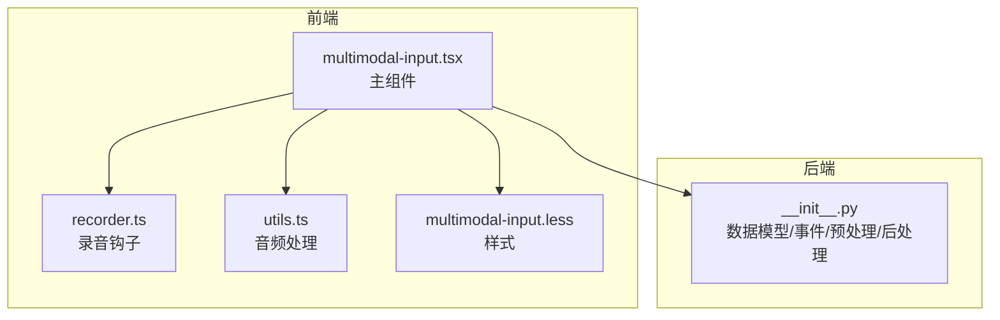
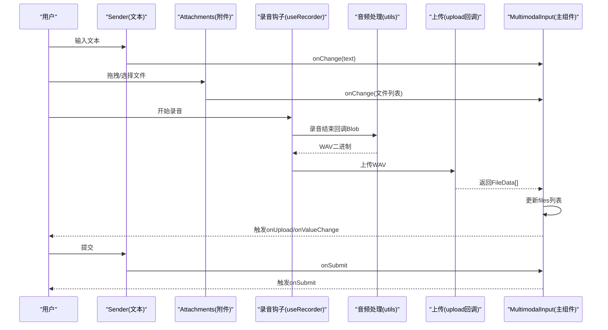
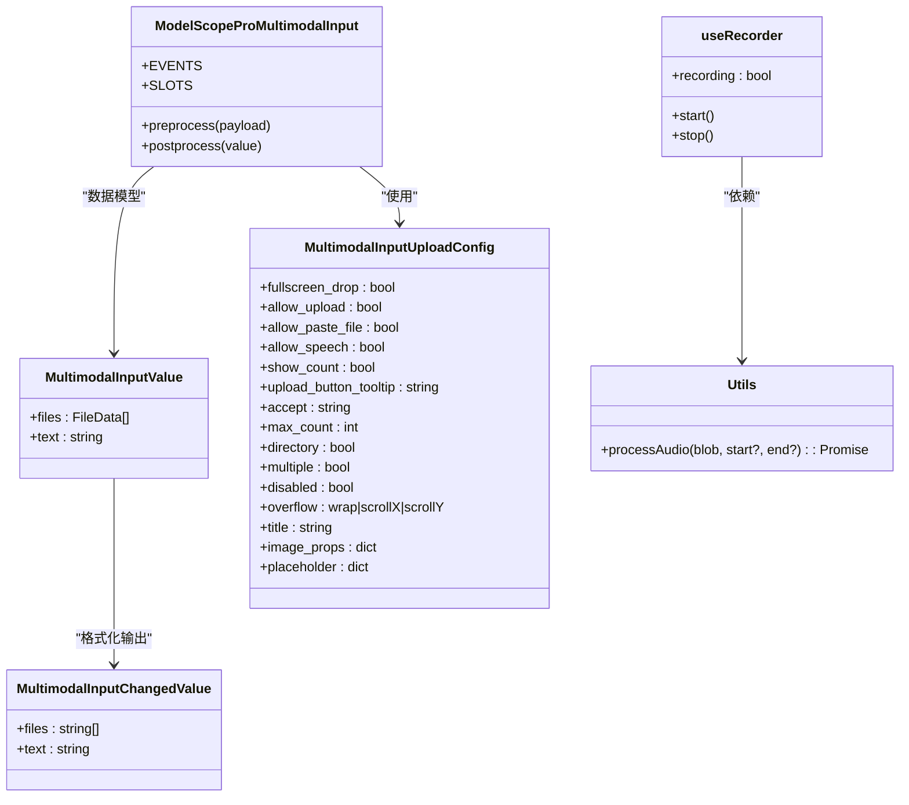
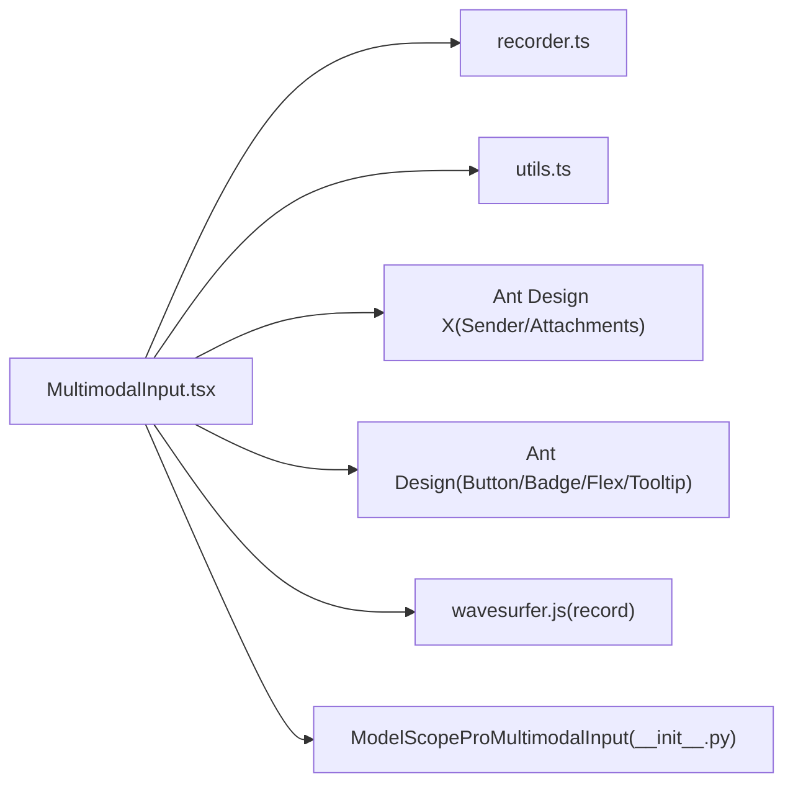

# 组件概览

<cite>
**本文引用的文件列表**
- [multimodal-input.tsx](file://frontend/pro/multimodal-input/multimodal-input.tsx)
- [recorder.ts](file://frontend/pro/multimodal-input/recorder.ts)
- [utils.ts](file://frontend/pro/multimodal-input/utils.ts)
- [multimodal-input.less](file://frontend/pro/multimodal-input/multimodal-input.less)
- [__init__.py](file://backend/modelscope_studio/components/pro/multimodal_input/__init__.py)
- [README.md](file://docs/components/pro/multimodal_input/README.md)
- [upload_config.py](file://docs/components/pro/multimodal_input/demos/upload_config.py)
- [basic.py](file://docs/components/pro/multimodal_input/demos/basic.py)
</cite>

## 目录

1. [简介](#简介)
2. [项目结构](#项目结构)
3. [核心组件](#核心组件)
4. [架构总览](#架构总览)
5. [详细组件分析](#详细组件分析)
6. [依赖关系分析](#依赖关系分析)
7. [性能考量](#性能考量)
8. [故障排查指南](#故障排查指南)
9. [结论](#结论)
10. [附录](#附录)

## 简介

MultimodalInput 是一个基于 Ant Design X 的多模态输入组件，支持文本输入、图片上传、音频录制、文件拖拽等多种输入方式。它在机器学习与对话式应用中具有重要价值：既能承载自然语言指令，也能接收图像、音频等多媒体数据，便于构建更丰富的交互体验与多模态模型训练/推理管线。

组件设计理念：

- 以“文本 + 文件”为核心数据模型，统一对外暴露 value 与变更事件。
- 基于 Ant Design X 的 Sender 与 Attachments 组合，提供一致的输入与附件管理体验。
- 支持 inline/block 两种渲染模式，适配不同布局需求。
- 提供灵活的上传配置（类型限制、数量上限、粘贴上传、全屏拖拽等）与可插拔的录音能力。

## 项目结构

MultimodalInput 在前端采用 React + Svelte Preprocess 的桥接方案，在后端通过 Gradio 数据类与事件绑定对接 Python 环境。核心文件分布如下：

- 前端实现：multimodal-input.tsx（主组件）、recorder.ts（录音钩子）、utils.ts（音频处理）、multimodal-input.less（样式）
- 后端实现：**init**.py（数据模型、事件、预处理/后处理）
- 文档与示例：README.md（API 说明）、demos 下的示例脚本

图表来源

- [multimodal-input.tsx:1-619](file://frontend/pro/multimodal-input/multimodal-input.tsx#L1-L619)
- [recorder.ts:1-48](file://frontend/pro/multimodal-input/recorder.ts#L1-L48)
- [utils.ts:1-127](file://frontend/pro/multimodal-input/utils.ts#L1-L127)
- [multimodal-input.less:1-13](file://frontend/pro/multimodal-input/multimodal-input.less#L1-L13)
- [**init**.py:1-259](file://backend/modelscope_studio/components/pro/multimodal_input/__init__.py#L1-L259)

章节来源

- [multimodal-input.tsx:1-619](file://frontend/pro/multimodal-input/multimodal-input.tsx#L1-L619)
- [**init**.py:1-259](file://backend/modelscope_studio/components/pro/multimodal_input/__init__.py#L1-L259)

## 核心组件

- 主组件：MultimodalInput（React 包装的 Svelte 组件），负责文本输入、附件面板、录音按钮、提交/取消等交互。
- 录音钩子：useRecorder，封装录音开始/停止与状态管理，并在录音结束时回调生成的音频 Blob。
- 音频处理：processAudio/process_audio，将录音转换为 WAV 格式并返回二进制数据。
- 数据模型：MultimodalInputValue（files/text），MultimodalInputUploadConfig（上传配置）。
- 后端组件：ModelScopeProMultimodalInput，定义事件、slots、预处理/后处理逻辑，以及默认上传配置。

章节来源

- [multimodal-input.tsx:32-104](file://frontend/pro/multimodal-input/multimodal-input.tsx#L32-L104)
- [recorder.ts:6-47](file://frontend/pro/multimodal-input/recorder.ts#L6-L47)
- [utils.ts:60-126](file://frontend/pro/multimodal-input/utils.ts#L60-L126)
- [**init**.py:18-79](file://backend/modelscope_studio/components/pro/multimodal_input/__init__.py#L18-L79)
- [**init**.py:82-259](file://backend/modelscope_studio/components/pro/multimodal_input/__init__.py#L82-L259)

## 架构总览

MultimodalInput 将“文本输入 + 附件上传 + 录音采集”整合为统一的数据流：

- 输入层：Sender 负责文本输入；附件面板由 Attachments 提供。
- 采集层：录音通过 wavesurfer.js + record 插件实现，结束后转为 WAV 并触发上传。
- 上传层：调用外部 upload 回调，将文件写入后端并返回 FileData 列表，更新内部文件列表。
- 事件层：onChange/onSubmit/onUpload/onRemove/onPasteFile 等事件贯穿整个流程，便于上层业务订阅。

图表来源

- [multimodal-input.tsx:157-169](file://frontend/pro/multimodal-input/multimodal-input.tsx#L157-L169)
- [utils.ts:94-126](file://frontend/pro/multimodal-input/utils.ts#L94-L126)
- [multimodal-input.tsx:181-246](file://frontend/pro/multimodal-input/multimodal-input.tsx#L181-L246)
- [multimodal-input.tsx:336-360](file://frontend/pro/multimodal-input/multimodal-input.tsx#L336-L360)

## 详细组件分析

### 组件接口与数据模型

- MultimodalInputValue：包含 files（文件数组）与 text（文本）两个字段，作为组件的值对象。
- MultimodalInputChangedValue：对外暴露的变更值，files 为字符串路径数组，text 为字符串。
- MultimodalInputUploadConfig：上传相关配置项，如 accept、max_count、allow_speech、allow_paste_file、fullscreen_drop、multiple、directory、overflow、title、image_props、placeholder 等。

章节来源

- [multimodal-input.tsx:32-66](file://frontend/pro/multimodal-input/multimodal-input.tsx#L32-L66)
- [multimodal-input.tsx:42-57](file://frontend/pro/multimodal-input/multimodal-input.tsx#L42-L57)
- [**init**.py:18-79](file://backend/modelscope_studio/components/pro/multimodal_input/__init__.py#L18-L79)

### 渲染模式与插槽

- mode：inline（内联）与 block（块级）两种模式，block 模式下输入区与发送/加载按钮分离，footer 中提供额外操作区与动作区。
- slots：支持 suffix/header/prefix/footer 以及 skill.\* 系列插槽，用于扩展 UI 与技能提示/关闭图标等。

章节来源

- [multimodal-input.tsx:86-104](file://frontend/pro/multimodal-input/multimodal-input.tsx#L86-L104)
- [multimodal-input.tsx:426-457](file://frontend/pro/multimodal-input/multimodal-input.tsx#L426-L457)
- [**init**.py:139-143](file://backend/modelscope_studio/components/pro/multimodal_input/__init__.py#L139-L143)

### 上传与文件管理

- 上传入口：通过 upload 回调将文件写入后端，返回 FileData 列表，合并到当前文件列表。
- 限制策略：支持 max_count 单文件替换或批量追加；支持 multiple/directory/fullscreen_drop 等。
- 事件回调：onUpload/onRemove/onPreview/onDownload/onDrop 等，便于上层处理下载/预览/移除等行为。

章节来源

- [multimodal-input.tsx:181-246](file://frontend/pro/multimodal-input/multimodal-input.tsx#L181-L246)
- [multimodal-input.tsx:511-602](file://frontend/pro/multimodal-input/multimodal-input.tsx#L511-L602)
- [**init**.py:111-135](file://backend/modelscope_studio/components/pro/multimodal_input/__init__.py#L111-L135)

### 录音与音频处理

- 录音钩子：useRecorder 提供 recording 状态与 start/stop 方法，录音结束时回调 Blob。
- 音频处理：processAudio 将 Blob 解码为 AudioBuffer，按需裁剪后转为 WAV 字节流，再封装为 File 对象触发上传。

章节来源

- [recorder.ts:6-47](file://frontend/pro/multimodal-input/recorder.ts#L6-L47)
- [utils.ts:94-126](file://frontend/pro/multimodal-input/utils.ts#L94-L126)
- [multimodal-input.tsx:157-169](file://frontend/pro/multimodal-input/multimodal-input.tsx#L157-L169)

### 事件与生命周期

- 事件：change/submit/cancel/key_down/key_press/focus/blur/upload/paste/paste_file/skill_closable_close/drop/download/preview/remove。
- 生命周期：组件内部维护 value 与 fileList，onChange/onSubmit/onUpload/onRemove 等回调串联前后端交互。

章节来源

- [**init**.py:86-135](file://backend/modelscope_studio/components/pro/multimodal_input/__init__.py#L86-L135)
- [multimodal-input.tsx:336-360](file://frontend/pro/multimodal-input/multimodal-input.tsx#L336-L360)
- [multimodal-input.tsx:511-602](file://frontend/pro/multimodal-input/multimodal-input.tsx#L511-L602)

### 类图（代码级）

图表来源

- [multimodal-input.tsx:32-66](file://frontend/pro/multimodal-input/multimodal-input.tsx#L32-L66)
- [multimodal-input.tsx:42-57](file://frontend/pro/multimodal-input/multimodal-input.tsx#L42-L57)
- [**init**.py:18-79](file://backend/modelscope_studio/components/pro/multimodal_input/__init__.py#L18-L79)
- [**init**.py:82-259](file://backend/modelscope_studio/components/pro/multimodal_input/__init__.py#L82-L259)
- [recorder.ts:6-47](file://frontend/pro/multimodal-input/recorder.ts#L6-L47)
- [utils.ts:94-126](file://frontend/pro/multimodal-input/utils.ts#L94-L126)

## 依赖关系分析

- 前端依赖：@ant-design/x（Sender/Attachments）、Ant Design（Button/Badge/Flex/Tooltip）、wavesurfer.js（录音）、lodash-es（工具函数）。
- 后端依赖：gradio/gradio_client、gradio.data_classes（FileData/ListFiles）、typing_extensions（Literal）。
- 组件耦合：主组件与录音钩子、音频处理模块松耦合；通过 upload 回调与后端解耦。

图表来源

- [multimodal-input.tsx:1-26](file://frontend/pro/multimodal-input/multimodal-input.tsx#L1-L26)
- [recorder.ts:1-4](file://frontend/pro/multimodal-input/recorder.ts#L1-L4)
- [utils.ts:1-4](file://frontend/pro/multimodal-input/utils.ts#L1-L4)
- [**init**.py:1-15](file://backend/modelscope_studio/components/pro/multimodal_input/__init__.py#L1-L15)

章节来源

- [multimodal-input.tsx:1-26](file://frontend/pro/multimodal-input/multimodal-input.tsx#L1-L26)
- [**init**.py:1-15](file://backend/modelscope_studio/components/pro/multimodal_input/__init__.py#L1-L15)

## 性能考量

- 上传并发与进度：组件在上传过程中设置 uploading 状态，避免重复上传；对 max_count 进行限制，减少内存占用。
- 音频处理：录音结束后进行解码与裁剪，建议在移动端谨慎启用 allow_speech，避免长时间录音导致内存压力。
- DOM 与渲染：block 模式下 footer 分离渲染，减少不必要的重排；上传计数仅在面板关闭时显示，降低视觉干扰。
- 事件节流：onValueChange/onSubmit 等回调按需触发，避免频繁重渲染。

## 故障排查指南

- 无法上传文件
  - 检查 upload 回调是否正确实现，确保返回 FileData 数组。
  - 确认 uploadConfig 的 accept/max_count/multiple/directory 是否与实际文件匹配。
- 录音无响应
  - 确认浏览器允许麦克风权限；检查录音容器是否挂载成功。
  - 若录音结束未触发上传，检查 onStop 回调与 processAudio 流程。
- 文件列表异常
  - 注意 maxCount=1 时会替换当前文件；多文件上传时确保未超过上限。
  - 移除文件后需同步更新 value，确认 onRemove/onValueChange 是否被调用。
- 事件未触发
  - 确认组件已绑定相应事件监听器（如 change/submit/upload 等）。

章节来源

- [multimodal-input.tsx:178-180](file://frontend/pro/multimodal-input/multimodal-input.tsx#L178-L180)
- [multimodal-input.tsx:181-246](file://frontend/pro/multimodal-input/multimodal-input.tsx#L181-L246)
- [multimodal-input.tsx:511-602](file://frontend/pro/multimodal-input/multimodal-input.tsx#L511-L602)
- [recorder.ts:24-41](file://frontend/pro/multimodal-input/recorder.ts#L24-L41)
- [utils.ts:94-126](file://frontend/pro/multimodal-input/utils.ts#L94-L126)

## 结论

MultimodalInput 以简洁的接口与强大的扩展性，将文本、图片、音频与文件拖拽等多模态输入能力整合在同一组件中。其清晰的事件体系与灵活的上传配置，使其非常适合在对话机器人、多模态评测平台、智能客服等场景中使用。对于初次使用者，建议从基础示例入手，逐步探索上传配置与录音能力，并结合后端 upload 回调完成端到端集成。

## 附录

### 使用示例与核心配置

- 基础用法：参考示例脚本，创建 MultimodalInput 并绑定 submit 事件。
- 上传配置：通过 MultimodalInputUploadConfig 设置 accept、max_count、fullscreen_drop、multiple、directory、allow_speech、allow_paste_file、title、placeholder 等。
- 块级模式：mode="block" 时，输入区与发送/加载按钮分离，footer 提供额外操作区与动作区。

章节来源

- [basic.py:1-17](file://docs/components/pro/multimodal_input/demos/basic.py#L1-L17)
- [upload_config.py:1-38](file://docs/components/pro/multimodal_input/demos/upload_config.py#L1-L38)
- [README.md:27-119](file://docs/components/pro/multimodal_input/README.md#L27-L119)
