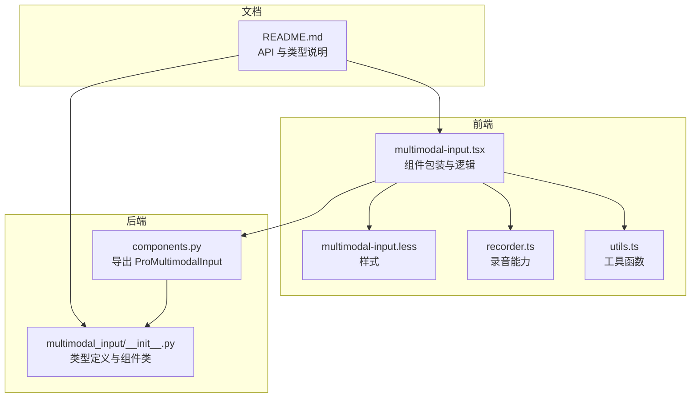
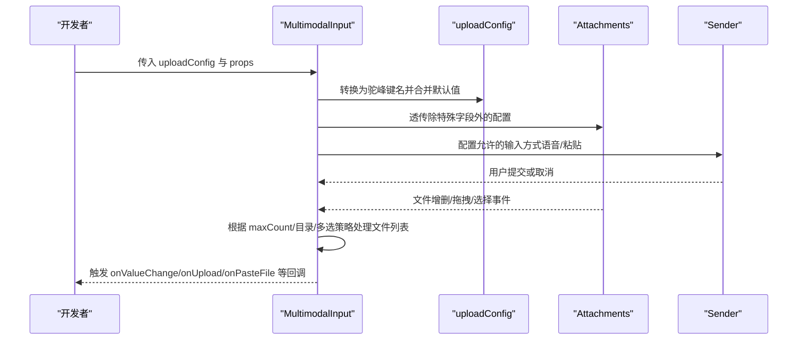
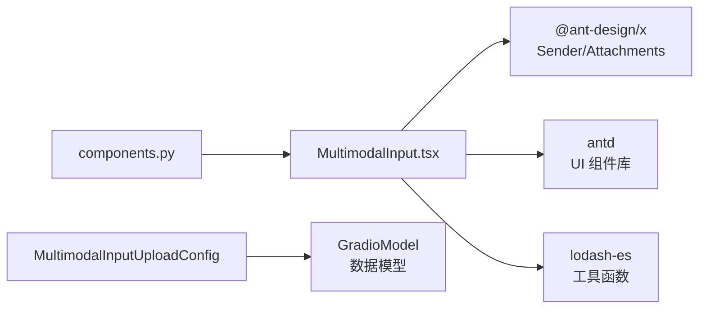

# 配置选项详解

<cite>
**本文引用的文件**
- [multimodal-input.tsx](file://frontend/pro/multimodal-input/multimodal-input.tsx)
- [README.md](file://docs/components/pro/multimodal_input/README.md)
- [components.py](file://backend/modelscope_studio/components/pro/components.py)
</cite>

## 目录

1. [简介](#简介)
2. [项目结构](#项目结构)
3. [核心组件](#核心组件)
4. [架构总览](#架构总览)
5. [详细组件分析](#详细组件分析)
6. [依赖关系分析](#依赖关系分析)
7. [性能考量](#性能考量)
8. [故障排查指南](#故障排查指南)
9. [结论](#结论)
10. [附录](#附录)

## 简介

本文件面向开发者，系统梳理 MultimodalInput 组件的配置选项，重点解析 MultimodalInputUploadConfig 类的全部参数：fullscreen_drop、allow_upload、allow_paste_file、allow_speech、show_count、accept、max_count、directory、multiple、disabled、overflow、image_props、placeholder、title、upload_button_tooltip 等。文档将说明每个配置项的作用、默认值与典型使用场景，并提供多种配置组合的实际示例路径，帮助你快速完成定制化开发。

## 项目结构

MultimodalInput 组件由前端 Svelte/React 包装层与后端 Gradio 数据模型共同构成，文档与示例位于 docs 目录，组件源码位于 frontend/pro/multimodal-input，后端类型定义位于 backend/modelscope_studio/components/pro/multimodal_input。

图表来源

- [multimodal-input.tsx:1-619](file://frontend/pro/multimodal-input/multimodal-input.tsx#L1-L619)
- [components.py:1-8](file://backend/modelscope_studio/components/pro/components.py#L1-L8)
- [README.md:1-119](file://docs/components/pro/multimodal_input/README.md#L1-L119)

章节来源

- [multimodal-input.tsx:1-619](file://frontend/pro/multimodal-input/multimodal-input.tsx#L1-L619)
- [components.py:1-8](file://backend/modelscope_studio/components/pro/components.py#L1-L8)
- [README.md:1-119](file://docs/components/pro/multimodal_input/README.md#L1-L119)

## 核心组件

- MultimodalInputUploadConfig：用于配置文件上传区域的行为与外观，包含接受类型、数量限制、目录上传、多选、禁用、溢出行为、占位信息、标题、图片属性等。
- MultimodalInput：基于 Ant Design X 的 Sender 与 Attachments 组合，支持文本输入、文件上传、语音录制、粘贴文件等能力；通过 uploadConfig 控制上传区域行为。

章节来源

- [multimodal-input.tsx:42-57](file://frontend/pro/multimodal-input/multimodal-input.tsx#L42-L57)
- [README.md:56-118](file://docs/components/pro/multimodal_input/README.md#L56-L118)

## 架构总览

MultimodalInput 将外部传入的 uploadConfig 转换为内部可用的配置对象，并将其透传给 Attachments 组件，同时根据 allowUpload/allowSpeech/allowPasteFile 等开关控制功能启用状态。上传流程中会根据 maxCount 与目录/多选策略进行文件集合合并与去重处理。

图表来源

- [multimodal-input.tsx:174-177](file://frontend/pro/multimodal-input/multimodal-input.tsx#L174-L177)
- [multimodal-input.tsx:466-478](file://frontend/pro/multimodal-input/multimodal-input.tsx#L466-L478)
- [multimodal-input.tsx:282-284](file://frontend/pro/multimodal-input/multimodal-input.tsx#L282-L284)

章节来源

- [multimodal-input.tsx:174-177](file://frontend/pro/multimodal-input/multimodal-input.tsx#L174-L177)
- [multimodal-input.tsx:466-478](file://frontend/pro/multimodal-input/multimodal-input.tsx#L466-L478)
- [multimodal-input.tsx:282-284](file://frontend/pro/multimodal-input/multimodal-input.tsx#L282-L284)

## 详细组件分析

### MultimodalInputUploadConfig 参数详解

以下参数均来自后端类型定义与前端实现映射，作用与默认值以文档与源码为准。

- fullscreen_drop
  - 作用：是否允许将文件拖拽到整个页面窗口以触发附件面板。
  - 默认值：False
  - 使用场景：需要在任意位置释放文件时打开附件面板。
  - 实现要点：当开启时，getDropContainer 返回 document.body，使拖拽范围扩大至全局。
  - 参考路径
    - [multimodal-input.tsx:480-486](file://frontend/pro/multimodal-input/multimodal-input.tsx#L480-L486)

- allow_upload
  - 作用：是否启用上传区域与文件选择/拖拽功能。
  - 默认值：True
  - 使用场景：仅需文本输入，不希望用户上传文件。
  - 实现要点：影响 allowSpeech/allowPasteFile 的可用性（二者在 allowUpload 为真时才生效）。
  - 参考路径
    - [multimodal-input.tsx:282-284](file://frontend/pro/multimodal-input/multimodal-input.tsx#L282-L284)

- allow_paste_file
  - 作用：是否允许通过剪贴板粘贴文件。
  - 默认值：True
  - 使用场景：提升便捷性，允许用户直接粘贴文件内容。
  - 实现要点：受 allow_upload 控制，若关闭则忽略粘贴事件。
  - 参考路径
    - [multimodal-input.tsx:352-360](file://frontend/pro/multimodal-input/multimodal-input.tsx#L352-L360)

- allow_speech
  - 作用：是否启用语音输入（麦克风录音）。
  - 默认值：False
  - 使用场景：需要语音转文字或上传音频文件。
  - 实现要点：仅在 allowUpload 为真时生效；录音结束后自动触发上传。
  - 参考路径
    - [multimodal-input.tsx:317-333](file://frontend/pro/multimodal-input/multimodal-input.tsx#L317-L333)
    - [multimodal-input.tsx:157-169](file://frontend/pro/multimodal-input/multimodal-input.tsx#L157-L169)

- show_count
  - 作用：当附件面板关闭时，是否显示文件数量徽标。
  - 默认值：True
  - 使用场景：在不展开面板的情况下提示已添加的文件数量。
  - 参考路径
    - [multimodal-input.tsx:288-294](file://frontend/pro/multimodal-input/multimodal-input.tsx#L288-L294)

- upload_button_tooltip
  - 作用：上传按钮的悬浮提示文案。
  - 默认值：无（空字符串）
  - 使用场景：为上传入口提供额外说明。
  - 参考路径
    - [multimodal-input.tsx:287-305](file://frontend/pro/multimodal-input/multimodal-input.tsx#L287-L305)

- accept
  - 作用：限制可选择的文件类型（HTML input accept 属性语义）。
  - 默认值：None
  - 使用场景：只允许图片、文档或特定格式文件。
  - 参考路径
    - [multimodal-input.tsx:466-478](file://frontend/pro/multimodal-input/multimodal-input.tsx#L466-L478)

- max_count
  - 作用：限制可上传的文件总数；当为 1 时替换当前文件。
  - 默认值：None
  - 使用场景：单文件覆盖型上传（如头像）、批量上传上限控制。
  - 实现要点：在新增/粘贴/拖拽时按剩余配额截断有效文件列表。
  - 参考路径
    - [multimodal-input.tsx:187-204](file://frontend/pro/multimodal-input/multimodal-input.tsx#L187-L204)
    - [multimodal-input.tsx:543-552](file://frontend/pro/multimodal-input/multimodal-input.tsx#L543-L552)

- directory
  - 作用：是否支持上传整个目录（文件夹内所有文件）。
  - 默认值：False
  - 使用场景：需要批量上传目录结构。
  - 参考路径
    - [multimodal-input.tsx:466-478](file://frontend/pro/multimodal-input/multimodal-input.tsx#L466-L478)

- multiple
  - 作用：是否允许多文件选择（配合 Ctrl/Cmd 多选）。
  - 默认值：False
  - 使用场景：需要一次选择多个文件。
  - 参考路径
    - [multimodal-input.tsx:466-478](file://frontend/pro/multimodal-input/multimodal-input.tsx#L466-L478)

- disabled
  - 作用：整体禁用上传区域与按钮。
  - 默认值：False
  - 使用场景：只读模式或等待条件满足后再启用。
  - 实现要点：uploadDisabled 综合 disabled/loading/readOnly/uploading 计算得出。
  - 参考路径
    - [multimodal-input.tsx:178-179](file://frontend/pro/multimodal-input/multimodal-input.tsx#L178-L179)

- overflow
  - 作用：文件列表溢出时的行为（wrap/scrollX/scrollY）。
  - 默认值：None
  - 使用场景：在有限空间内展示大量文件。
  - 参考路径
    - [multimodal-input.tsx:466-478](file://frontend/pro/multimodal-input/multimodal-input.tsx#L466-L478)

- image_props
  - 作用：传递给内部图片预览组件的配置（与 Ant Design Image 相同）。
  - 默认值：None
  - 使用场景：自定义图片缩放、加载失败回退等。
  - 参考路径
    - [multimodal-input.tsx:476-478](file://frontend/pro/multimodal-input/multimodal-input.tsx#L476-L478)

- placeholder
  - 作用：无文件时的占位信息，支持 inline 与 drop 两种形态。
  - 默认值：包含 inline/title/description/icon 与 drop/title 的默认值。
  - 使用场景：引导用户点击/拖拽上传。
  - 参考路径
    - [multimodal-input.tsx:488-507](file://frontend/pro/multimodal-input/multimodal-input.tsx#L488-L507)
    - [README.md:103-112](file://docs/components/pro/multimodal_input/README.md#L103-L112)

- title
  - 作用：附件面板标题。
  - 默认值："Attachments"
  - 使用场景：本地化或业务定制标题。
  - 参考路径
    - [multimodal-input.tsx:461-461](file://frontend/pro/multimodal-input/multimodal-input.tsx#L461-L461)
    - [README.md:101-101](file://docs/components/pro/multimodal_input/README.md#L101-L101)

章节来源

- [multimodal-input.tsx:42-57](file://frontend/pro/multimodal-input/multimodal-input.tsx#L42-L57)
- [multimodal-input.tsx:174-177](file://frontend/pro/multimodal-input/multimodal-input.tsx#L174-L177)
- [multimodal-input.tsx:178-179](file://frontend/pro/multimodal-input/multimodal-input.tsx#L178-L179)
- [multimodal-input.tsx:187-204](file://frontend/pro/multimodal-input/multimodal-input.tsx#L187-L204)
- [multimodal-input.tsx:282-284](file://frontend/pro/multimodal-input/multimodal-input.tsx#L282-L284)
- [multimodal-input.tsx:287-305](file://frontend/pro/multimodal-input/multimodal-input.tsx#L287-L305)
- [multimodal-input.tsx:317-333](file://frontend/pro/multimodal-input/multimodal-input.tsx#L317-L333)
- [multimodal-input.tsx:352-360](file://frontend/pro/multimodal-input/multimodal-input.tsx#L352-L360)
- [multimodal-input.tsx:461-461](file://frontend/pro/multimodal-input/multimodal-input.tsx#L461-L461)
- [multimodal-input.tsx:466-478](file://frontend/pro/multimodal-input/multimodal-input.tsx#L466-L478)
- [multimodal-input.tsx:480-486](file://frontend/pro/multimodal-input/multimodal-input.tsx#L480-L486)
- [multimodal-input.tsx:488-507](file://frontend/pro/multimodal-input/multimodal-input.tsx#L488-L507)
- [multimodal-input.tsx:543-552](file://frontend/pro/multimodal-input/multimodal-input.tsx#L543-L552)
- [README.md:56-118](file://docs/components/pro/multimodal_input/README.md#L56-L118)

### 配置组合示例（路径指引）

以下示例均来自文档与示例应用，你可以通过对应路径查看完整实现与效果：

- 基础示例（含上传配置）
  - 示例路径
    - [README.md:23-25](file://docs/components/pro/multimodal_input/README.md#L23-L25)

- 上传配置示例（演示多种配置项）
  - 示例路径
    - [README.md:23-25](file://docs/components/pro/multimodal_input/README.md#L23-L25)

- 与 Chatbot 集成示例
  - 示例路径
    - [README.md:11-13](file://docs/components/pro/multimodal_input/README.md#L11-L13)

- 块模式（Block Mode）
  - 示例路径
    - [README.md:19-21](file://docs/components/pro/multimodal_input/README.md#L19-L21)

- 附加按钮配置示例
  - 示例路径
    - [README.md:15-17](file://docs/components/pro/multimodal_input/README.md#L15-L17)

- 基础示例
  - 示例路径
    - [README.md:7-9](file://docs/components/pro/multimodal_input/README.md#L7-L9)

章节来源

- [README.md:7-25](file://docs/components/pro/multimodal_input/README.md#L7-L25)
- [README.md:11-21](file://docs/components/pro/multimodal_input/README.md#L11-L21)
- [README.md:15-17](file://docs/components/pro/multimodal_input/README.md#L15-L17)

## 依赖关系分析

- 前端依赖
  - @ant-design/x：Sender 与 Attachments 组件提供输入与附件管理能力。
  - antd：Button、Badge、Flex、Tooltip 等 UI 组件用于界面与交互。
  - lodash-es：工具函数（如 omit）辅助处理配置与事件。
- 后端依赖
  - GradioModel：MultimodalInputUploadConfig 与 MultimodalInputValue 的数据模型基类。
  - components.py：导出 ProMultimodalInput，供上层应用使用。

图表来源

- [multimodal-input.tsx:1-26](file://frontend/pro/multimodal-input/multimodal-input.tsx#L1-L26)
- [components.py:1-8](file://backend/modelscope_studio/components/pro/components.py#L1-L8)
- [README.md:56-118](file://docs/components/pro/multimodal_input/README.md#L56-L118)

章节来源

- [multimodal-input.tsx:1-26](file://frontend/pro/multimodal-input/multimodal-input.tsx#L1-L26)
- [components.py:1-8](file://backend/modelscope_studio/components/pro/components.py#L1-L8)
- [README.md:56-118](file://docs/components/pro/multimodal_input/README.md#L56-L118)

## 性能考量

- 文件数量与大小
  - 使用 max_count 控制并发与存储压力；对大文件建议分片或服务端校验。
- 渲染与更新
  - 通过 useMemo 与 useValueChange 优化渲染与状态同步，避免不必要的重渲染。
- 上传策略
  - 在 allowUpload=false 或 disabled/loading/readOnly 时短路上传流程，减少无效请求。
- 拖拽范围
  - fullscreen_drop 会将拖拽容器设置为 document.body，注意在复杂页面中可能带来额外事件开销。

章节来源

- [multimodal-input.tsx:174-177](file://frontend/pro/multimodal-input/multimodal-input.tsx#L174-L177)
- [multimodal-input.tsx:178-179](file://frontend/pro/multimodal-input/multimodal-input.tsx#L178-L179)
- [multimodal-input.tsx:480-486](file://frontend/pro/multimodal-input/multimodal-input.tsx#L480-L486)

## 故障排查指南

- 无法上传文件
  - 检查 allow_upload 是否为真；确认 disabled/loading/readOnly/uploading 状态。
  - 确认 accept 与 multiple 设置是否符合预期。
  - 参考路径
    - [multimodal-input.tsx:282-284](file://frontend/pro/multimodal-input/multimodal-input.tsx#L282-L284)
    - [multimodal-input.tsx:178-179](file://frontend/pro/multimodal-input/multimodal-input.tsx#L178-L179)
    - [multimodal-input.tsx:466-478](file://frontend/pro/multimodal-input/multimodal-input.tsx#L466-L478)
- 粘贴文件无效
  - 检查 allow_paste_file 是否为真；确保浏览器权限与剪贴板内容可识别。
  - 参考路径
    - [multimodal-input.tsx:352-360](file://frontend/pro/multimodal-input/multimodal-input.tsx#L352-L360)
- 语音输入不可用
  - 检查 allow_speech 与 allow_upload；确认浏览器麦克风权限。
  - 参考路径
    - [multimodal-input.tsx:317-333](file://frontend/pro/multimodal-input/multimodal-input.tsx#L317-L333)
    - [multimodal-input.tsx:282-284](file://frontend/pro/multimodal-input/multimodal-input.tsx#L282-L284)
- 文件数量超过限制
  - 检查 max_count；当为 1 时会替换当前文件；大于 1 时按剩余配额截断。
  - 参考路径
    - [multimodal-input.tsx:187-204](file://frontend/pro/multimodal-input/multimodal-input.tsx#L187-L204)
    - [multimodal-input.tsx:543-552](file://frontend/pro/multimodal-input/multimodal-input.tsx#L543-L552)
- 拖拽范围异常
  - fullscreen_drop 为真时，拖拽范围扩展至 document.body；请确认页面结构与事件冲突。
  - 参考路径
    - [multimodal-input.tsx:480-486](file://frontend/pro/multimodal-input/multimodal-input.tsx#L480-L486)

章节来源

- [multimodal-input.tsx:178-179](file://frontend/pro/multimodal-input/multimodal-input.tsx#L178-L179)
- [multimodal-input.tsx:187-204](file://frontend/pro/multimodal-input/multimodal-input.tsx#L187-L204)
- [multimodal-input.tsx:282-284](file://frontend/pro/multimodal-input/multimodal-input.tsx#L282-L284)
- [multimodal-input.tsx:317-333](file://frontend/pro/multimodal-input/multimodal-input.tsx#L317-L333)
- [multimodal-input.tsx:352-360](file://frontend/pro/multimodal-input/multimodal-input.tsx#L352-L360)
- [multimodal-input.tsx:480-486](file://frontend/pro/multimodal-input/multimodal-input.tsx#L480-L486)
- [multimodal-input.tsx:543-552](file://frontend/pro/multimodal-input/multimodal-input.tsx#L543-L552)

## 结论

MultimodalInputUploadConfig 提供了从文件类型、数量、目录、多选到上传区域行为与占位信息的全面配置能力。通过合理组合 allow_upload、allow_speech、allow_paste_file、max_count、fullscreen_drop、accept、multiple、directory、disabled、overflow、image_props、placeholder、title、upload_button_tooltip 等参数，可以快速适配从简单文本输入到复杂多模态交互的各种场景。建议优先明确业务目标（单/多文件、是否允许目录、是否需要语音/粘贴），再据此选择合适的默认值与覆盖项。

## 附录

- 相关类型定义与默认值参考
  - [README.md:56-118](file://docs/components/pro/multimodal_input/README.md#L56-L118)
- 组件导出与集成
  - [components.py:1-8](file://backend/modelscope_studio/components/pro/components.py#L1-L8)
