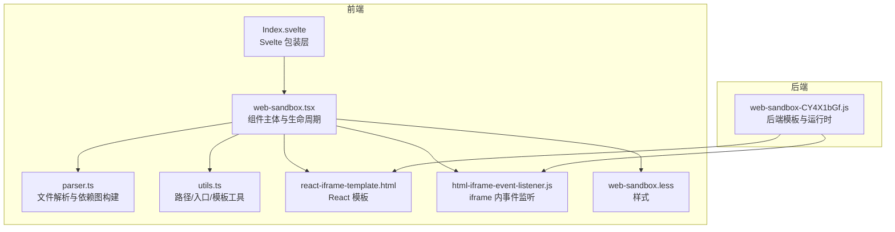
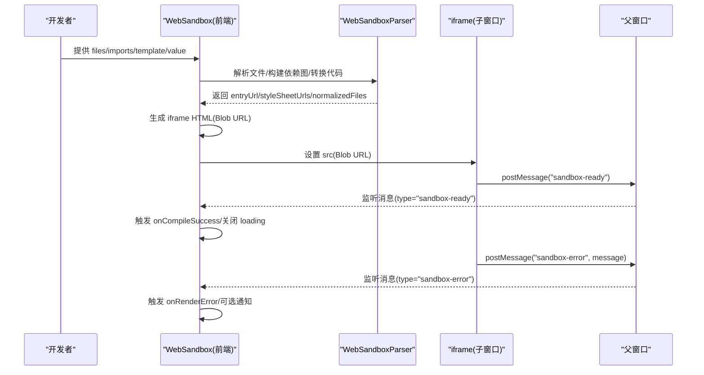
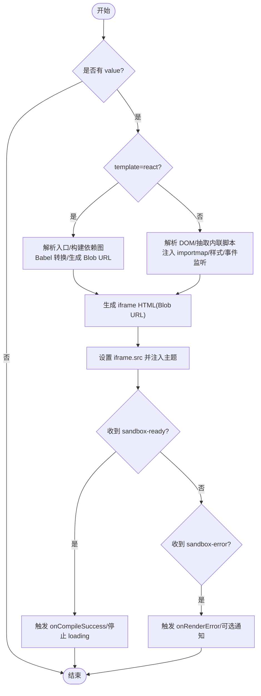
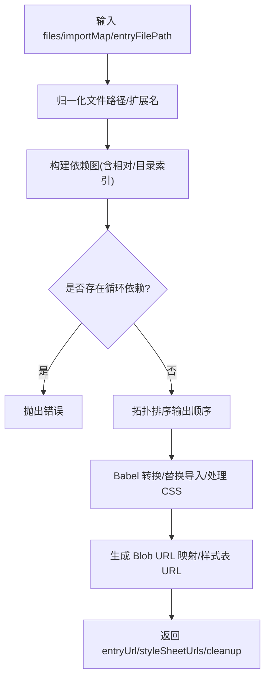
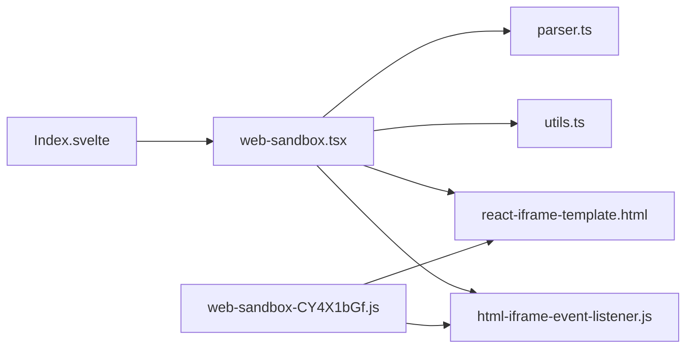

# WebSandbox 网页沙盒

<cite>
**本文引用的文件**
- [web-sandbox.tsx](file://frontend/pro/web-sandbox/web-sandbox.tsx)
- [parser.ts](file://frontend/pro/web-sandbox/parser.ts)
- [utils.ts](file://frontend/pro/web-sandbox/utils.ts)
- [react-iframe-template.html](file://frontend/pro/web-sandbox/react-iframe-template.html)
- [html-iframe-event-listener.js](file://frontend/pro/web-sandbox/html-iframe-event-listener.js)
- [web-sandbox.less](file://frontend/pro/web-sandbox/web-sandbox.less)
- [Index.svelte](file://frontend/pro/web-sandbox/Index.svelte)
- [web-sandbox-CY4X1bGf.js](file://backend/modelscope_studio/components/pro/web_sandbox/templates/component/web-sandbox-CY4X1bGf.js)
</cite>

## 目录

1. [简介](#简介)
2. [项目结构](#项目结构)
3. [核心组件](#核心组件)
4. [架构总览](#架构总览)
5. [详细组件分析](#详细组件分析)
6. [依赖关系分析](#依赖关系分析)
7. [性能考量](#性能考量)
8. [故障排查指南](#故障排查指南)
9. [结论](#结论)
10. [附录：使用示例与最佳实践](#附录使用示例与最佳实践)

## 简介

WebSandbox 是一个用于在受控环境中安全渲染第三方或用户输入内容的组件，支持两种模式：

- React 模式：以 React 应用入口文件为起点进行编译、打包与运行，适合复杂交互与组件化场景。
- HTML 模式：对 HTML 文档进行解析与注入，内联脚本与样式，适合快速渲染静态或半静态页面。

该组件通过 iframe 隔离执行环境，利用 postMessage 进行父子窗口事件通信，并提供完善的错误处理与主题适配能力，确保在不破坏宿主应用的前提下完成安全渲染。

## 项目结构

前端核心位于 frontend/pro/web-sandbox，后端模板由 Python 后端生成并注入到运行时中，Svelte 层负责桥接与属性透传。

**图表来源**

- [web-sandbox.tsx:1-365](file://frontend/pro/web-sandbox/web-sandbox.tsx#L1-L365)
- [parser.ts:1-314](file://frontend/pro/web-sandbox/parser.ts#L1-L314)
- [utils.ts:1-83](file://frontend/pro/web-sandbox/utils.ts#L1-L83)
- [react-iframe-template.html:1-43](file://frontend/pro/web-sandbox/react-iframe-template.html#L1-L43)
- [html-iframe-event-listener.js:1-13](file://frontend/pro/web-sandbox/html-iframe-event-listener.js#L1-L13)
- [web-sandbox.less:1-24](file://frontend/pro/web-sandbox/web-sandbox.less#L1-L24)
- [Index.svelte:1-76](file://frontend/pro/web-sandbox/Index.svelte#L1-L76)
- [web-sandbox-CY4X1bGf.js:163-205](file://backend/modelscope_studio/components/pro/web_sandbox/templates/component/web-sandbox-CY4X1bGf.js#L163-L205)

**章节来源**

- [web-sandbox.tsx:1-365](file://frontend/pro/web-sandbox/web-sandbox.tsx#L1-L365)
- [Index.svelte:1-76](file://frontend/pro/web-sandbox/Index.svelte#L1-L76)
- [web-sandbox-CY4X1bGf.js:163-205](file://backend/modelscope_studio/components/pro/web_sandbox/templates/component/web-sandbox-CY4X1bGf.js#L163-L205)

## 核心组件

- WebSandbox 主体：负责接收输入文件、构建 import map、解析/转换文件、生成 iframe 内容、处理消息与错误、注入主题与事件监听脚本。
- 解析器 WebSandboxParser：基于 Babel Standalone 分析依赖、拓扑排序、替换相对导入为 Blob URL、提取样式表、产出可运行的资源清单。
- 工具集：路径标准化、入口文件推断、HTML 模板渲染、文件内容提取。
- 模板与事件监听：React 模板与 HTML 事件监听脚本，统一通过 postMessage 通知父窗口“就绪”与“错误”。

关键职责与行为：

- 安全隔离：iframe 与父窗口通过 postMessage 通信；样式与脚本通过 Blob URL 注入，避免跨域风险。
- 错误处理：编译期错误与运行期错误分别上报；可选择是否展示通知与回退渲染。
- 主题适配：向 iframe 注入主题模式，支持动态更新。
- 事件通信：iframe 加载完成后发送“就绪”，运行时错误通过“错误”事件上报。

**章节来源**

- [web-sandbox.tsx:21-55](file://frontend/pro/web-sandbox/web-sandbox.tsx#L21-L55)
- [parser.ts:14-314](file://frontend/pro/web-sandbox/parser.ts#L14-L314)
- [utils.ts:20-83](file://frontend/pro/web-sandbox/utils.ts#L20-L83)
- [react-iframe-template.html:1-43](file://frontend/pro/web-sandbox/react-iframe-template.html#L1-L43)
- [html-iframe-event-listener.js:1-13](file://frontend/pro/web-sandbox/html-iframe-event-listener.js#L1-L13)

## 架构总览

WebSandbox 的整体流程分为“编译与注入”和“iframe 渲染与通信”两个阶段。

**图表来源**

- [web-sandbox.tsx:94-218](file://frontend/pro/web-sandbox/web-sandbox.tsx#L94-L218)
- [web-sandbox.tsx:220-297](file://frontend/pro/web-sandbox/web-sandbox.tsx#L220-L297)
- [react-iframe-template.html:16-40](file://frontend/pro/web-sandbox/react-iframe-template.html#L16-L40)
- [html-iframe-event-listener.js:1-13](file://frontend/pro/web-sandbox/html-iframe-event-listener.js#L1-L13)

## 详细组件分析

### WebSandbox 主组件（React）

- 输入参数与默认值：value、imports、template、showRenderError、showCompileError、height、className、style、onCompileError、onRenderError、onCompileSuccess、onCustom、compileErrorRender 等。
- 导入映射：根据 template 选择内置 React/ReactDOM 映射，再合并用户自定义 imports。
- 编译流程：
  - React 模式：解析入口文件，构建依赖图，Babel 转换，替换相对导入为 Blob URL，收集样式表，生成入口 URL。
  - HTML 模式：解析 DOM，抽取内联脚本并重写，注入 importmap 与样式链接，注入事件监听脚本，生成完整 HTML Blob URL。
- iframe 生命周期：创建 Blob URL -> 注入主题与自定义分发函数 -> 监听 sandbox-ready 与 sandbox-error -> 清理 URL。
- 错误处理：编译期错误通过 onCompileError 与可选的 compileErrorRender 或插槽呈现；运行期错误通过 onRenderError 与通知提示。

**图表来源**

- [web-sandbox.tsx:94-218](file://frontend/pro/web-sandbox/web-sandbox.tsx#L94-L218)
- [web-sandbox.tsx:220-297](file://frontend/pro/web-sandbox/web-sandbox.tsx#L220-L297)

**章节来源**

- [web-sandbox.tsx:21-365](file://frontend/pro/web-sandbox/web-sandbox.tsx#L21-L365)

### WebSandboxParser 解析器

- 文件归一化：规范化路径、识别 JS/TS/JSX/TSX/CSS 扩展名。
- 依赖图构建：基于 AST 分析 import 声明，处理相对路径与目录索引，生成邻接表。
- 拓扑排序：检测循环依赖并抛出错误。
- 代码转换：Babel 转换 React/TSX，替换相对导入为 Blob URL，移除或保留 CSS 导入，生成样式表 Blob URL。
- 输出：entryUrl、styleSheetUrls、normalizedFiles、cleanup（回收 Blob URL）。

**图表来源**

- [parser.ts:28-314](file://frontend/pro/web-sandbox/parser.ts#L28-L314)

**章节来源**

- [parser.ts:14-314](file://frontend/pro/web-sandbox/parser.ts#L14-L314)

### 工具模块

- 路径与入口：normalizePath、getEntryFile、getFileCode、renderHtmlTemplate。
- 默认入口文件集合：React 模式与 HTML 模式的默认入口列表。

**章节来源**

- [utils.ts:20-83](file://frontend/pro/web-sandbox/utils.ts#L20-L83)

### 模板与事件监听

- React 模板：包含 importmap、样式注入、事件监听脚本与入口模块加载。
- HTML 事件监听：在 iframe 内捕获 error 与 DOMContentLoaded，通过 postMessage 通知父窗口。

**章节来源**

- [react-iframe-template.html:1-43](file://frontend/pro/web-sandbox/react-iframe-template.html#L1-L43)
- [html-iframe-event-listener.js:1-13](file://frontend/pro/web-sandbox/html-iframe-event-listener.js#L1-L13)

### Svelte 包装层与后端模板

- Svelte 层：负责属性透传、可见性控制、插槽与主题传递。
- 后端模板：生成与前端一致的 iframe HTML 模板与事件监听脚本，保证前后端一致性。

**章节来源**

- [Index.svelte:1-76](file://frontend/pro/web-sandbox/Index.svelte#L1-L76)
- [web-sandbox-CY4X1bGf.js:163-205](file://backend/modelscope_studio/components/pro/web_sandbox/templates/component/web-sandbox-CY4X1bGf.js#L163-L205)

## 依赖关系分析

- 组件耦合：
  - WebSandbox 对 parser.ts、utils.ts、模板与事件监听脚本存在直接依赖。
  - Svelte 层仅作为桥接，不直接参与业务逻辑。
- 外部依赖：
  - Babel Standalone 用于代码转换与 AST 分析。
  - Ant Design 的 notification/Alert 用于错误提示。
  - React/ReactDOM 在 React 模式下通过 importmap 引入。
- 潜在循环依赖：
  - 解析器内部通过拓扑排序避免循环依赖；若用户文件存在循环导入，将在编译阶段报错。

**图表来源**

- [web-sandbox.tsx:1-20](file://frontend/pro/web-sandbox/web-sandbox.tsx#L1-L20)
- [parser.ts:1-12](file://frontend/pro/web-sandbox/parser.ts#L1-L12)
- [utils.ts:1-1](file://frontend/pro/web-sandbox/utils.ts#L1-L1)
- [react-iframe-template.html:1-43](file://frontend/pro/web-sandbox/react-iframe-template.html#L1-L43)
- [html-iframe-event-listener.js:1-13](file://frontend/pro/web-sandbox/html-iframe-event-listener.js#L1-L13)
- [Index.svelte:1-12](file://frontend/pro/web-sandbox/Index.svelte#L1-L12)
- [web-sandbox-CY4X1bGf.js:163-205](file://backend/modelscope_studio/components/pro/web_sandbox/templates/component/web-sandbox-CY4X1bGf.js#L163-L205)

**章节来源**

- [web-sandbox.tsx:1-365](file://frontend/pro/web-sandbox/web-sandbox.tsx#L1-L365)
- [parser.ts:1-314](file://frontend/pro/web-sandbox/parser.ts#L1-L314)
- [utils.ts:1-83](file://frontend/pro/web-sandbox/utils.ts#L1-L83)
- [Index.svelte:1-76](file://frontend/pro/web-sandbox/Index.svelte#L1-L76)
- [web-sandbox-CY4X1bGf.js:163-205](file://backend/modelscope_studio/components/pro/web_sandbox/templates/component/web-sandbox-CY4X1bGf.js#L163-L205)

## 性能考量

- Blob URL 管理：解析器与组件均维护 Blob URL 映射并在清理阶段回收，避免内存泄漏。
- 懒加载与异步：Svelte 包装层采用异步组件加载，减少首屏压力。
- 依赖图优化：通过拓扑排序与按序转换，减少重复工作量。
- 样式注入：CSS 通过 Blob URL 或外链注入，避免阻塞主线程渲染。
- 事件监听：仅在 iframe 就绪后才开始监听，降低无效通信成本。

[本节为通用性能建议，无需特定文件引用]

## 故障排查指南

- 编译期错误
  - 现象：组件显示编译错误，onCompileError 回调被触发。
  - 排查：检查 imports 是否正确、template 与入口文件是否匹配、是否存在循环依赖。
  - 参考：[web-sandbox.tsx:203-218](file://frontend/pro/web-sandbox/web-sandbox.tsx#L203-L218)、[parser.ts:128-174](file://frontend/pro/web-sandbox/parser.ts#L128-L174)
- 运行期错误
  - 现象：iframe 报错，父窗口收到 sandbox-error。
  - 排查：查看 onRenderError 回调与通知；确认第三方库是否通过 importmap 正确引入。
  - 参考：[web-sandbox.tsx:262-282](file://frontend/pro/web-sandbox/web-sandbox.tsx#L262-L282)、[html-iframe-event-listener.js:1-13](file://frontend/pro/web-sandbox/html-iframe-event-listener.js#L1-L13)
- 未触发“就绪”
  - 现象：onCompileSuccess 不触发，loading 持续。
  - 排查：确认模板是否正确注入事件监听脚本；检查 Blob URL 是否有效。
  - 参考：[react-iframe-template.html:16-40](file://frontend/pro/web-sandbox/react-iframe-template.html#L16-L40)
- 样式缺失
  - 现象：页面无样式或样式异常。
  - 排查：确认 styleSheetUrls 是否生成；检查 CSS 导入路径与 importmap。
  - 参考：[parser.ts:258-276](file://frontend/pro/web-sandbox/parser.ts#L258-L276)
- 主题不生效
  - 现象：iframe 内主题与宿主不一致。
  - 排查：确认 themeMode 传入与消息派发；检查 iframe 内是否正确接收主题。
  - 参考：[web-sandbox.tsx:244-261](file://frontend/pro/web-sandbox/web-sandbox.tsx#L244-L261)

**章节来源**

- [web-sandbox.tsx:203-297](file://frontend/pro/web-sandbox/web-sandbox.tsx#L203-L297)
- [parser.ts:128-276](file://frontend/pro/web-sandbox/parser.ts#L128-L276)
- [react-iframe-template.html:16-40](file://frontend/pro/web-sandbox/react-iframe-template.html#L16-L40)
- [html-iframe-event-listener.js:1-13](file://frontend/pro/web-sandbox/html-iframe-event-listener.js#L1-L13)

## 结论

WebSandbox 通过严格的文件解析与转换、安全的 iframe 隔离以及统一的事件通信机制，实现了对第三方或用户输入内容的安全渲染。其双模（React/HTML）设计兼顾了灵活性与易用性，配合完善的错误处理与主题适配，能够满足大多数需要安全渲染的场景需求。

[本节为总结性内容，无需特定文件引用]

## 附录：使用示例与最佳实践

### 配置项概览

- value：文件对象字典，支持字符串或带 is_entry 标记的对象。
- imports：自定义 importmap，覆盖默认 React/ReactDOM 映射。
- template：'react' 或 'html'。
- showRenderError/showCompileError：是否展示运行/编译错误通知。
- onCompileError/onRenderError/onCompileSuccess/onCustom：事件回调。
- compileErrorRender：自定义编译错误渲染。
- height/className/style：容器样式控制。

参考路径：

- [web-sandbox.tsx:21-55](file://frontend/pro/web-sandbox/web-sandbox.tsx#L21-L55)

### 安全策略与事件处理

- 自定义事件处理：通过 onCustom 将 iframe 内部事件分发至父窗口，实现松耦合通信。
- 安全边界：iframe 与父窗口通过 postMessage 通信，避免直接 DOM 访问；Blob URL 隔离脚本与样式。
- 错误捕获：iframe 内错误统一上报，父窗口可选择展示通知或静默处理。

参考路径：

- [web-sandbox.tsx:244-297](file://frontend/pro/web-sandbox/web-sandbox.tsx#L244-L297)
- [html-iframe-event-listener.js:1-13](file://frontend/pro/web-sandbox/html-iframe-event-listener.js#L1-L13)

### 使用示例（步骤说明）

- React 模式
  - 准备入口文件（如 index.tsx），在 value 中标记 is_entry 或使用默认入口。
  - 如需引入第三方库，在 imports 中提供对应 URL。
  - 设置 template='react'，渲染组件并监听 onCompileSuccess 与 onRenderError。
  - 参考：[web-sandbox.tsx:94-218](file://frontend/pro/web-sandbox/web-sandbox.tsx#L94-L218)、[react-iframe-template.html:1-43](file://frontend/pro/web-sandbox/react-iframe-template.html#L1-L43)
- HTML 模式
  - 准备 index.html，内联脚本会被抽取并转换。
  - 设置 template='html'，组件会自动注入 importmap、样式与事件监听脚本。
  - 参考：[web-sandbox.tsx:110-218](file://frontend/pro/web-sandbox/web-sandbox.tsx#L110-L218)、[html-iframe-event-listener.js:1-13](file://frontend/pro/web-sandbox/html-iframe-event-listener.js#L1-L13)

### 最佳实践

- 优先使用 React 模式以获得更好的类型与生态支持。
- 将第三方库纳入 imports，避免直接使用 CDN 跨域脚本。
- 在生产环境开启 showRenderError 以便及时发现运行期问题。
- 使用 compileErrorRender 插槽或函数自定义错误界面，提升用户体验。
- 注意清理 Blob URL，防止内存泄漏。

[本节为通用指导，无需特定文件引用]
