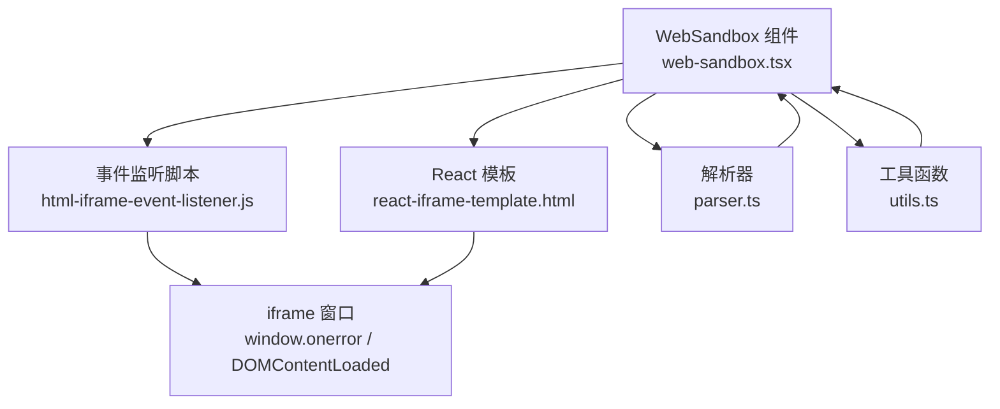
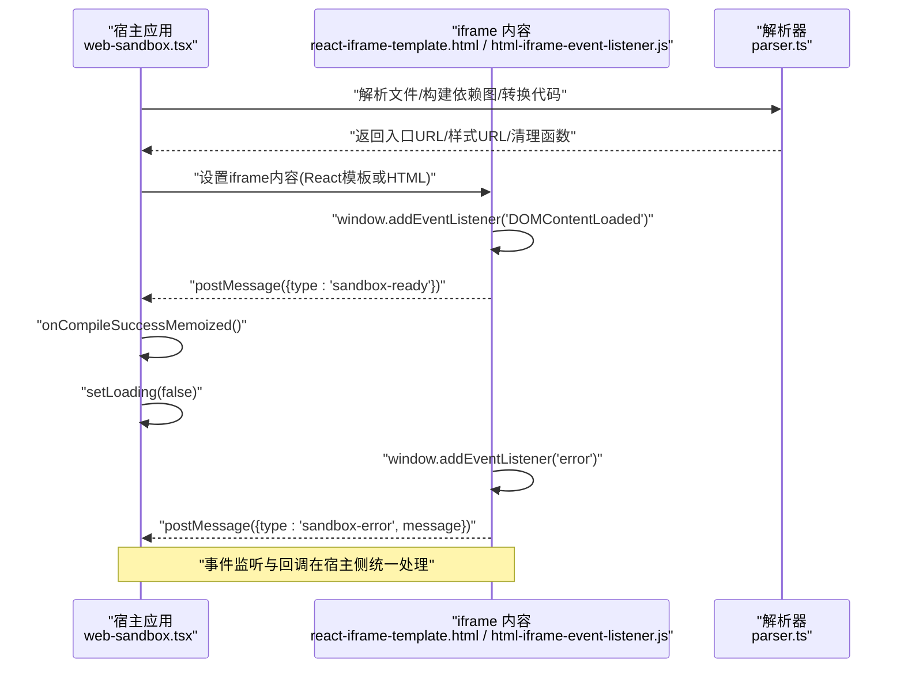
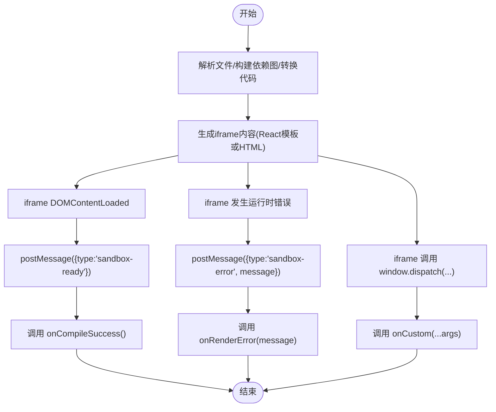
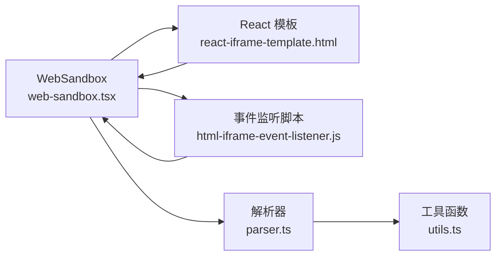

# 事件处理

<cite>
**本文引用的文件**
- [web-sandbox.tsx](file://frontend/pro/web-sandbox/web-sandbox.tsx)
- [html-iframe-event-listener.js](file://frontend/pro/web-sandbox/html-iframe-event-listener.js)
- [react-iframe-template.html](file://frontend/pro/web-sandbox/react-iframe-template.html)
- [parser.ts](file://frontend/pro/web-sandbox/parser.ts)
- [utils.ts](file://frontend/pro/web-sandbox/utils.ts)
- [README.md](file://docs/components/pro/web_sandbox/README.md)
</cite>

## 目录

1. [简介](#简介)
2. [项目结构](#项目结构)
3. [核心组件](#核心组件)
4. [架构总览](#架构总览)
5. [详细组件分析](#详细组件分析)
6. [依赖分析](#依赖分析)
7. [性能考虑](#性能考虑)
8. [故障排除指南](#故障排除指南)
9. [结论](#结论)

## 简介

本章节面向使用 WebSandbox 组件的开发者，系统性讲解组件支持的事件类型、触发时机、回调参数与使用方式，并结合源码分析事件与沙盒安全机制的关系。同时提供事件监听与处理的参考路径、调试与排障建议，帮助快速定位问题并稳定集成。

## 项目结构

WebSandbox 位于前端 pro 组件目录，核心由以下文件构成：

- 组件实现：web-sandbox.tsx
- 沙盒 iframe 事件监听脚本：html-iframe-event-listener.js
- React 模板（iframe 内容）：react-iframe-template.html
- 文件解析与打包：parser.ts
- 工具函数：utils.ts
- 文档与示例：docs/components/pro/web_sandbox/README.md

图表来源

- [web-sandbox.tsx:1-365](file://frontend/pro/web-sandbox/web-sandbox.tsx#L1-L365)
- [html-iframe-event-listener.js:1-13](file://frontend/pro/web-sandbox/html-iframe-event-listener.js#L1-L13)
- [react-iframe-template.html:1-43](file://frontend/pro/web-sandbox/react-iframe-template.html#L1-L43)
- [parser.ts:1-314](file://frontend/pro/web-sandbox/parser.ts#L1-L314)
- [utils.ts:1-83](file://frontend/pro/web-sandbox/utils.ts#L1-L83)

章节来源

- [web-sandbox.tsx:1-365](file://frontend/pro/web-sandbox/web-sandbox.tsx#L1-L365)
- [README.md:1-70](file://docs/components/pro/web_sandbox/README.md#L1-L70)

## 核心组件

WebSandbox 是一个在页面内通过 iframe 渲染“React 或 HTML”代码的沙盒组件。它负责：

- 解析传入的文件集合，构建依赖图并进行转换
- 生成样式与入口资源，注入到 iframe 中
- 通过 postMessage 在宿主与 iframe 之间传递事件
- 将编译与渲染阶段的事件回调暴露给上层

章节来源

- [web-sandbox.tsx:21-35](file://frontend/pro/web-sandbox/web-sandbox.tsx#L21-L35)
- [web-sandbox.tsx:79-92](file://frontend/pro/web-sandbox/web-sandbox.tsx#L79-L92)
- [web-sandbox.tsx:284-297](file://frontend/pro/web-sandbox/web-sandbox.tsx#L284-L297)

## 架构总览

WebSandbox 的事件流从 iframe 内部产生，经由 window 事件监听转发为 postMessage，再由宿主监听 window message 并分发到对应的回调。

图表来源

- [web-sandbox.tsx:244-297](file://frontend/pro/web-sandbox/web-sandbox.tsx#L244-L297)
- [react-iframe-template.html:17-28](file://frontend/pro/web-sandbox/react-iframe-template.html#L17-L28)
- [html-iframe-event-listener.js:1-13](file://frontend/pro/web-sandbox/html-iframe-event-listener.js#L1-L13)

## 详细组件分析

### 事件类型与触发时机

- compile_success（编译成功）
  - 触发时机：iframe 内部 DOMContentLoaded 事件触发后，向父窗口发送 sandbox-ready 消息；宿主收到消息后调用 onCompileSuccess 回调。
  - 回调参数：无
  - 使用方式：在 WebSandbox 上注册 onCompileSuccess 回调，用于在沙盒准备就绪时执行后续逻辑（如隐藏加载态、启用交互等）。
  - 参考路径
    - [web-sandbox.tsx:277-279](file://frontend/pro/web-sandbox/web-sandbox.tsx#L277-L279)
    - [react-iframe-template.html:24-28](file://frontend/pro/web-sandbox/react-iframe-template.html#L24-L28)

- compile_error（编译错误）
  - 触发时机：解析与转换过程中发生异常，组件捕获异常并调用 onCompileError 回调；同时将错误信息保存到本地状态，可配合 showCompileError 与 compileErrorRender 控制错误展示。
  - 回调参数：message（字符串）
  - 使用方式：在 WebSandbox 上注册 onCompileError 回调，用于记录日志、上报或引导用户修复代码。
  - 参考路径
    - [web-sandbox.tsx:203-218](file://frontend/pro/web-sandbox/web-sandbox.tsx#L203-L218)
    - [parser.ts:285-312](file://frontend/pro/web-sandbox/parser.ts#L285-L312)

- render_error（渲染错误）
  - 触发时机：iframe 内部发生运行时错误（window.onerror），向父窗口发送 sandbox-error 消息；宿主收到消息后调用 onRenderError 回调，并根据 showRenderError 决定是否弹出通知。
  - 回调参数：message（字符串）
  - 使用方式：在 WebSandbox 上注册 onRenderError 回调，用于捕获渲染期异常并进行降级处理。
  - 参考路径
    - [web-sandbox.tsx:267-276](file://frontend/pro/web-sandbox/web-sandbox.tsx#L267-L276)
    - [html-iframe-event-listener.js:1-6](file://frontend/pro/web-sandbox/html-iframe-event-listener.js#L1-L6)
    - [react-iframe-template.html:17-22](file://frontend/pro/web-sandbox/react-iframe-template.html#L17-L22)

- custom（自定义事件）
  - 触发时机：宿主将 dispatch 函数注入到 iframe 的 window 上，iframe 内可通过 window.dispatch(...args) 主动向宿主派发自定义事件；宿主收到消息后调用 onCustom 回调。
  - 回调参数：...args（任意参数序列）
  - 使用方式：在 WebSandbox 上注册 onCustom 回调，用于接收 iframe 内自定义业务事件（如点击、状态变更等）。
  - 参考路径
    - [web-sandbox.tsx:249-256](file://frontend/pro/web-sandbox/web-sandbox.tsx#L249-L256)
    - [web-sandbox.tsx:299-306](file://frontend/pro/web-sandbox/web-sandbox.tsx#L299-L306)

章节来源

- [web-sandbox.tsx:262-297](file://frontend/pro/web-sandbox/web-sandbox.tsx#L262-L297)
- [html-iframe-event-listener.js:1-13](file://frontend/pro/web-sandbox/html-iframe-event-listener.js#L1-L13)
- [react-iframe-template.html:17-28](file://frontend/pro/web-sandbox/react-iframe-template.html#L17-L28)
- [README.md:48-56](file://docs/components/pro/web_sandbox/README.md#L48-L56)

### 事件监听与处理流程

图表来源

- [web-sandbox.tsx:244-297](file://frontend/pro/web-sandbox/web-sandbox.tsx#L244-L297)
- [react-iframe-template.html:24-28](file://frontend/pro/web-sandbox/react-iframe-template.html#L24-L28)
- [html-iframe-event-listener.js:1-6](file://frontend/pro/web-sandbox/html-iframe-event-listener.js#L1-L6)

### 事件与沙盒安全机制的关系

- 同源策略与 postMessage：iframe 与宿主通过 postMessage 通信，避免直接跨域访问，降低 XSS 风险。
- 仅暴露必要接口：宿主将 dispatch 注入 iframe 的 window，iframe 可主动上报事件，但无法直接访问宿主 DOM 或全局对象。
- 错误隔离：iframe 内部错误通过 window.onerror 捕获并上报，不破坏宿主运行环境。
- 主题注入：宿主通过 postMessage 注入主题模式，iframe 仅能读取该只读信息，无法篡改宿主上下文。
- 参考路径
  - [web-sandbox.tsx:249-261](file://frontend/pro/web-sandbox/web-sandbox.tsx#L249-L261)
  - [html-iframe-event-listener.js:1-6](file://frontend/pro/web-sandbox/html-iframe-event-listener.js#L1-L6)
  - [react-iframe-template.html:17-22](file://frontend/pro/web-sandbox/react-iframe-template.html#L17-L22)

章节来源

- [web-sandbox.tsx:249-261](file://frontend/pro/web-sandbox/web-sandbox.tsx#L249-L261)
- [html-iframe-event-listener.js:1-6](file://frontend/pro/web-sandbox/html-iframe-event-listener.js#L1-L6)
- [react-iframe-template.html:17-22](file://frontend/pro/web-sandbox/react-iframe-template.html#L17-L22)

### 事件监听与处理的完整示例（参考路径）

- React 模板示例（HTML/JSX/TSX 入口文件）
  - [react-iframe-template.html:30-40](file://frontend/pro/web-sandbox/react-iframe-template.html#L30-L40)
- 编译错误处理（onCompileError）
  - [web-sandbox.tsx:203-218](file://frontend/pro/web-sandbox/web-sandbox.tsx#L203-L218)
- 渲染错误处理（onRenderError）
  - [web-sandbox.tsx:267-276](file://frontend/pro/web-sandbox/web-sandbox.tsx#L267-L276)
- 编译成功处理（onCompileSuccess）
  - [web-sandbox.tsx:277-279](file://frontend/pro/web-sandbox/web-sandbox.tsx#L277-L279)
- 自定义事件处理（onCustom）
  - [web-sandbox.tsx:249-256](file://frontend/pro/web-sandbox/web-sandbox.tsx#L249-L256)

章节来源

- [react-iframe-template.html:30-40](file://frontend/pro/web-sandbox/react-iframe-template.html#L30-L40)
- [web-sandbox.tsx:203-218](file://frontend/pro/web-sandbox/web-sandbox.tsx#L203-L218)
- [web-sandbox.tsx:267-276](file://frontend/pro/web-sandbox/web-sandbox.tsx#L267-L276)
- [web-sandbox.tsx:277-279](file://frontend/pro/web-sandbox/web-sandbox.tsx#L277-L279)
- [web-sandbox.tsx:249-256](file://frontend/pro/web-sandbox/web-sandbox.tsx#L249-L256)

## 依赖分析

- 组件与模板/脚本的耦合
  - WebSandbox 通过 react-iframe-template.html 注入 importmap、样式与入口模块；通过 html-iframe-event-listener.js 统一转发错误与就绪事件。
- 解析器与工具函数
  - parser.ts 负责依赖分析、转换与资源生成；utils.ts 提供路径规范化、入口文件选择等辅助能力。
- 事件来源与去向
  - 事件来源：iframe 内部 window.onerror、DOMContentLoaded；iframe 内部 dispatch 调用
  - 事件去向：宿主 window message 监听器分发到 onCompileSuccess/onCompileError/onRenderError/onCustom

图表来源

- [web-sandbox.tsx:1-20](file://frontend/pro/web-sandbox/web-sandbox.tsx#L1-L20)
- [react-iframe-template.html:1-43](file://frontend/pro/web-sandbox/react-iframe-template.html#L1-L43)
- [html-iframe-event-listener.js:1-13](file://frontend/pro/web-sandbox/html-iframe-event-listener.js#L1-L13)
- [parser.ts:1-314](file://frontend/pro/web-sandbox/parser.ts#L1-L314)
- [utils.ts:1-83](file://frontend/pro/web-sandbox/utils.ts#L1-L83)

章节来源

- [web-sandbox.tsx:1-20](file://frontend/pro/web-sandbox/web-sandbox.tsx#L1-L20)
- [parser.ts:1-314](file://frontend/pro/web-sandbox/parser.ts#L1-L314)
- [utils.ts:1-83](file://frontend/pro/web-sandbox/utils.ts#L1-L83)

## 性能考虑

- 资源释放：解析器生成的 Blob URL 在清理函数中统一回收，避免内存泄漏。
  - 参考路径：[parser.ts:306-311](file://frontend/pro/web-sandbox/parser.ts#L306-L311)
- 加载态控制：编译成功后及时关闭加载态，提升用户体验。
  - 参考路径：[web-sandbox.tsx:277-279](file://frontend/pro/web-sandbox/web-sandbox.tsx#L277-L279)
- 事件监听去重：组件在 iframeUrl 更新时重新绑定 window message 监听，确保不会重复绑定导致性能问题。
  - 参考路径：[web-sandbox.tsx:284-288](file://frontend/pro/web-sandbox/web-sandbox.tsx#L284-L288)

## 故障排除指南

- 编译错误（compile_error）
  - 现象：组件显示错误区域或触发 onCompileError 回调
  - 排查要点：
    - 检查入口文件是否正确（template 为 react 时默认入口为 index.\*，html 时为 index.html）
      - 参考路径：[utils.ts:48-75](file://frontend/pro/web-sandbox/utils.ts#L48-L75)
    - 检查第三方依赖映射（imports）是否正确
      - 参考路径：[web-sandbox.tsx:79-92](file://frontend/pro/web-sandbox/web-sandbox.tsx#L79-L92)
    - 查看解析器抛出的错误堆栈（循环依赖、语法错误等）
      - 参考路径：[parser.ts:166-170](file://frontend/pro/web-sandbox/parser.ts#L166-L170), [parser.ts:292-298](file://frontend/pro/web-sandbox/parser.ts#L292-L298)
- 渲染错误（render_error）
  - 现象：iframe 内部运行时报错，触发 onRenderError 回调
  - 排查要点：
    - 确认模板中入口模块导出是否为函数（React 组件）
      - 参考路径：[react-iframe-template.html:35-39](file://frontend/pro/web-sandbox/react-iframe-template.html#L35-L39)
    - 检查样式与 importmap 是否正确注入
      - 参考路径：[react-iframe-template.html:7-12](file://frontend/pro/web-sandbox/react-iframe-template.html#L7-L12)
- 自定义事件（custom）
  - 现象：iframe 内通过 window.dispatch(...) 主动上报事件，宿主触发 onCustom 回调
  - 排查要点：
    - 确认宿主已将 dispatch 注入 iframe 的 window
      - 参考路径：[web-sandbox.tsx:249-256](file://frontend/pro/web-sandbox/web-sandbox.tsx#L249-L256)
- 事件未触发
  - 现象：编译成功或渲染错误事件未回调
  - 排查要点：
    - 确认 iframe 内部是否正确注入事件监听脚本
      - 参考路径：[react-iframe-template.html:17-28](file://frontend/pro/web-sandbox/react-iframe-template.html#L17-L28), [html-iframe-event-listener.js:1-13](file://frontend/pro/web-sandbox/html-iframe-event-listener.js#L1-L13)
    - 确认宿主 window message 监听是否正常绑定与解绑
      - 参考路径：[web-sandbox.tsx:284-288](file://frontend/pro/web-sandbox/web-sandbox.tsx#L284-L288)

章节来源

- [utils.ts:48-75](file://frontend/pro/web-sandbox/utils.ts#L48-L75)
- [parser.ts:166-170](file://frontend/pro/web-sandbox/parser.ts#L166-L170)
- [parser.ts:292-298](file://frontend/pro/web-sandbox/parser.ts#L292-L298)
- [react-iframe-template.html:35-39](file://frontend/pro/web-sandbox/react-iframe-template.html#L35-L39)
- [react-iframe-template.html:7-12](file://frontend/pro/web-sandbox/react-iframe-template.html#L7-L12)
- [web-sandbox.tsx:249-256](file://frontend/pro/web-sandbox/web-sandbox.tsx#L249-L256)
- [web-sandbox.tsx:284-288](file://frontend/pro/web-sandbox/web-sandbox.tsx#L284-L288)

## 结论

WebSandbox 通过标准化的事件模型（compile_success、compile_error、render_error、custom）与 iframe 安全边界，为前端代码预览提供了可控、可观测且易扩展的能力。合理利用事件回调与错误处理机制，可在保证安全的前提下实现丰富的交互与调试体验。
