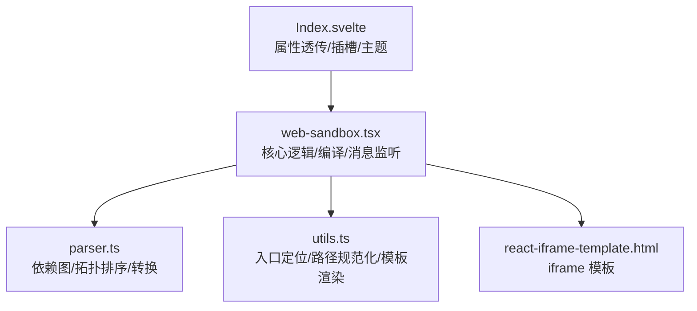
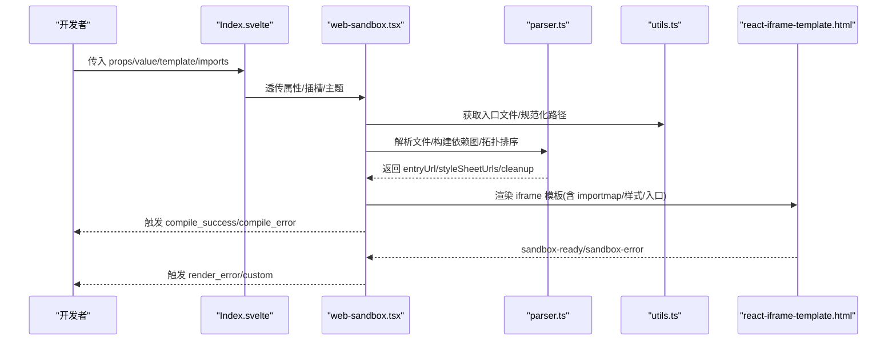
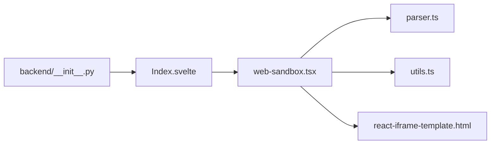

# 使用示例

<cite>
**本文引用的文件**
- [web-sandbox.tsx](file://frontend/pro/web-sandbox/web-sandbox.tsx)
- [Index.svelte](file://frontend/pro/web-sandbox/Index.svelte)
- [parser.ts](file://frontend/pro/web-sandbox/parser.ts)
- [utils.ts](file://frontend/pro/web-sandbox/utils.ts)
- [react-iframe-template.html](file://frontend/pro/web-sandbox/react-iframe-template.html)
- [README-zh_CN.md](file://docs/components/pro/web_sandbox/README-zh_CN.md)
- [__init__.py](file://backend/modelscope_studio/components/pro/web_sandbox/__init__.py)
</cite>

## 目录

1. [简介](#简介)
2. [项目结构](#项目结构)
3. [核心组件](#核心组件)
4. [架构总览](#架构总览)
5. [详细组件分析](#详细组件分析)
6. [依赖关系分析](#依赖关系分析)
7. [性能考量](#性能考量)
8. [故障排查指南](#故障排查指南)
9. [结论](#结论)
10. [附录](#附录)

## 简介

本文件面向开发者，系统化地介绍 WebSandbox 组件的使用方式与最佳实践，涵盖：

- HTML 渲染示例与注意事项
- React 组件渲染示例与模板类型选择
- 错误处理与事件通信
- 动态内容渲染、事件通信、样式定制等复杂场景
- 从简单到复杂的渐进式示例路径
- 完整可运行的示例说明（以“代码片段路径”形式给出）

目标是帮助你在不直接阅读源码的前提下，快速上手并正确使用该组件。

## 项目结构

WebSandbox 由三部分组成：

- 前端 Svelte 包装层：负责属性透传、插槽渲染与主题注入
- 核心 React 组件：负责文件解析、依赖图构建、编译与 iframe 渲染
- 解析器与工具：负责文件规范化、依赖分析、转换与资源清理

图表来源

- [Index.svelte:1-75](file://frontend/pro/web-sandbox/Index.svelte#L1-L75)
- [web-sandbox.tsx:37-363](file://frontend/pro/web-sandbox/web-sandbox.tsx#L37-L363)
- [parser.ts:14-314](file://frontend/pro/web-sandbox/parser.ts#L14-L314)
- [utils.ts:28-83](file://frontend/pro/web-sandbox/utils.ts#L28-L83)
- [react-iframe-template.html:1-43](file://frontend/pro/web-sandbox/react-iframe-template.html#L1-L43)

章节来源

- [Index.svelte:1-75](file://frontend/pro/web-sandbox/Index.svelte#L1-L75)
- [web-sandbox.tsx:37-363](file://frontend/pro/web-sandbox/web-sandbox.tsx#L37-L363)
- [parser.ts:14-314](file://frontend/pro/web-sandbox/parser.ts#L14-L314)
- [utils.ts:28-83](file://frontend/pro/web-sandbox/utils.ts#L28-L83)
- [react-iframe-template.html:1-43](file://frontend/pro/web-sandbox/react-iframe-template.html#L1-L43)

## 核心组件

- 组件名称：WebSandbox
- 支持模板类型：react、html
- 关键能力：
  - 将一组前端文件（JS/TS/JSX/TSX/HTML/CSS）作为输入，生成可运行的 iframe 内容
  - 自动注入 importmap，支持第三方依赖与样式资源
  - 提供编译/渲染事件回调与错误展示
  - 支持自定义错误渲染插槽与函数
  - 主题模式透传与事件通信桥接

章节来源

- [web-sandbox.tsx:21-35](file://frontend/pro/web-sandbox/web-sandbox.tsx#L21-L35)
- [README-zh_CN.md:34-70](file://docs/components/pro/web_sandbox/README-zh_CN.md#L34-L70)

## 架构总览

WebSandbox 的工作流分为“文件解析与编译”和“iframe 渲染与事件通信”两大阶段。

图表来源

- [Index.svelte:12-75](file://frontend/pro/web-sandbox/Index.svelte#L12-L75)
- [web-sandbox.tsx:94-218](file://frontend/pro/web-sandbox/web-sandbox.tsx#L94-L218)
- [parser.ts:285-312](file://frontend/pro/web-sandbox/parser.ts#L285-L312)
- [utils.ts:48-75](file://frontend/pro/web-sandbox/utils.ts#L48-L75)
- [react-iframe-template.html:7-40](file://frontend/pro/web-sandbox/react-iframe-template.html#L7-L40)

## 详细组件分析

### HTML 渲染示例

- 适用场景：直接渲染 HTML 页面，支持内联脚本与样式表
- 关键点：
  - template 必须为 html
  - 入口文件默认为 index.html；也可通过 is_entry 手动指定
  - 内联脚本会被抽取并参与编译，同时保留原结构
  - 自动注入 importmap 与样式链接
- 示例路径
  - [HTML 示例占位符:22-24](file://docs/components/pro/web_sandbox/README-zh_CN.md#L22-L24)

章节来源

- [web-sandbox.tsx:110-186](file://frontend/pro/web-sandbox/web-sandbox.tsx#L110-L186)
- [utils.ts:48-75](file://frontend/pro/web-sandbox/utils.ts#L48-L75)
- [README-zh_CN.md:22-24](file://docs/components/pro/web_sandbox/README-zh_CN.md#L22-L24)

### React 组件渲染示例

- 适用场景：渲染单文件 React 组件（函数组件或类组件）
- 关键点：
  - template 默认为 react；会自动注入 react 与 react-dom 的 importmap
  - 入口文件默认为 index.(ts|tsx|js|jsx)
  - 支持 TS/TSX 与 JSX；自动启用 React 自动运行时
  - CSS 导入会被提取为独立样式资源
- 示例路径
  - [React 示例占位符:7-18](file://docs/components/pro/web_sandbox/README-zh_CN.md#L7-L18)

章节来源

- [web-sandbox.tsx:187-202](file://frontend/pro/web-sandbox/web-sandbox.tsx#L187-L202)
- [parser.ts:176-283](file://frontend/pro/web-sandbox/parser.ts#L176-L283)
- [README-zh_CN.md:7-18](file://docs/components/pro/web_sandbox/README-zh_CN.md#L7-L18)

### 错误处理示例

- 编译期错误：文件解析/转换异常、循环依赖、入口缺失
- 运行期错误：iframe 中的 DOMContentLoaded 与全局 error 事件
- 可选展示策略：
  - 内置 Alert 错误提示
  - 自定义 compileErrorRender 插槽或函数
  - 通过事件回调 onCompileError/onRenderError/onCompileSuccess 获取状态
- 示例路径
  - [错误处理示例占位符:30-32](file://docs/components/pro/web_sandbox/README-zh_CN.md#L30-L32)

章节来源

- [web-sandbox.tsx:203-218](file://frontend/pro/web-sandbox/web-sandbox.tsx#L203-L218)
- [web-sandbox.tsx:317-342](file://frontend/pro/web-sandbox/web-sandbox.tsx#L317-L342)
- [README-zh_CN.md:30-32](file://docs/components/pro/web_sandbox/README-zh_CN.md#L30-L32)

### 事件通信示例

- 组件向外部发送的消息：
  - sandbox-ready：编译完成，iframe 已就绪
  - sandbox-error：运行期错误，携带 message
- 外部向组件内部派发的事件：
  - 通过 window.dispatch 或自定义事件桥接（由业务方在 iframe 内触发）
- 示例路径
  - [事件通信示例占位符:26-28](file://docs/components/pro/web_sandbox/README-zh_CN.md#L26-L28)

章节来源

- [web-sandbox.tsx:262-282](file://frontend/pro/web-sandbox/web-sandbox.tsx#L262-L282)
- [react-iframe-template.html:17-28](file://frontend/pro/web-sandbox/react-iframe-template.html#L17-L28)
- [README-zh_CN.md:48-55](file://docs/components/pro/web_sandbox/README-zh_CN.md#L48-L55)

### 样式定制与导入

- 第三方 CSS：通过 importmap 映射或 http(s) 地址直接引入
- 本地 CSS：被提取为独立 Blob URL 并注入到 iframe
- 自定义样式：可在 HTML 模板中注入额外 link 或在 React 模板中通过样式资源列表注入
- 示例路径
  - [样式定制示例占位符:45-46](file://docs/components/pro/web_sandbox/README-zh_CN.md#L45-L46)

章节来源

- [parser.ts:258-276](file://frontend/pro/web-sandbox/parser.ts#L258-L276)
- [web-sandbox.tsx:221-242](file://frontend/pro/web-sandbox/web-sandbox.tsx#L221-L242)

### 复杂场景：动态内容渲染与事件桥接

- 动态内容：通过 value 动态更新文件集合，组件会重新解析并重建 iframe
- 事件桥接：在 iframe 内通过 window.dispatch 发送自定义事件，父组件 onCustom 接收
- 主题同步：组件会向 iframe 注入 themeMode，并通过 postMessage 同步主题
- 示例路径
  - [动态内容与事件桥接示例占位符:26-28](file://docs/components/pro/web_sandbox/README-zh_CN.md#L26-L28)

章节来源

- [web-sandbox.tsx:244-297](file://frontend/pro/web-sandbox/web-sandbox.tsx#L244-L297)
- [Index.svelte:60-75](file://frontend/pro/web-sandbox/Index.svelte#L60-L75)

### 最佳实践

- 明确入口文件：优先使用默认入口；若需自定义，使用 is_entry 标记
- 控制依赖体积：合理拆分模块，避免重复引入大体积库
- 错误可见性：生产环境建议开启 showCompileError/showRenderError 并自定义错误渲染
- 主题一致性：统一 themeMode，确保与宿主应用一致
- 性能优化：对大型 CSS/JS 进行按需加载与缓存

章节来源

- [utils.ts:48-75](file://frontend/pro/web-sandbox/utils.ts#L48-L75)
- [web-sandbox.tsx:317-342](file://frontend/pro/web-sandbox/web-sandbox.tsx#L317-L342)

## 依赖关系分析

WebSandbox 的关键依赖链如下：

图表来源

- [web-sandbox.tsx:1-19](file://frontend/pro/web-sandbox/web-sandbox.tsx#L1-L19)
- [parser.ts:1-12](file://frontend/pro/web-sandbox/parser.ts#L1-L12)
- [utils.ts:1-1](file://frontend/pro/web-sandbox/utils.ts#L1-L1)
- [react-iframe-template.html:1-10](file://frontend/pro/web-sandbox/react-iframe-template.html#L1-L10)
- [Index.svelte:1-12](file://frontend/pro/web-sandbox/Index.svelte#L1-L12)
- [**init**.py:69-85](file://backend/modelscope_studio/components/pro/web_sandbox/__init__.py#L69-L85)

章节来源

- [web-sandbox.tsx:1-19](file://frontend/pro/web-sandbox/web-sandbox.tsx#L1-L19)
- [parser.ts:1-12](file://frontend/pro/web-sandbox/parser.ts#L1-L12)
- [utils.ts:1-1](file://frontend/pro/web-sandbox/utils.ts#L1-L1)
- [react-iframe-template.html:1-10](file://frontend/pro/web-sandbox/react-iframe-template.html#L1-L10)
- [Index.svelte:1-12](file://frontend/pro/web-sandbox/Index.svelte#L1-L12)
- [**init**.py:69-85](file://backend/modelscope_studio/components/pro/web_sandbox/__init__.py#L69-L85)

## 性能考量

- 文件解析与转换：采用拓扑排序保证依赖顺序，避免重复转换
- Blob URL 管理：转换后的 JS/CSS 统一以 Blob URL 形式注入，便于清理
- iframe 生命周期：组件卸载时主动 revokeObjectURL，防止内存泄漏
- 样式注入：CSS 资源按需注入，减少无关样式加载
- 主题同步：通过 postMessage 一次性注入，避免频繁重绘

章节来源

- [parser.ts:129-174](file://frontend/pro/web-sandbox/parser.ts#L129-L174)
- [parser.ts:306-312](file://frontend/pro/web-sandbox/parser.ts#L306-L312)
- [web-sandbox.tsx:299-306](file://frontend/pro/web-sandbox/web-sandbox.tsx#L299-L306)

## 故障排查指南

- 编译失败
  - 症状：显示内置错误提示或触发 onCompileError
  - 排查要点：检查入口文件是否存在、依赖是否在 importmap 中、是否存在循环依赖
  - 参考路径：[编译错误处理:203-218](file://frontend/pro/web-sandbox/web-sandbox.tsx#L203-L218)
- 运行失败
  - 症状：触发 onRenderError，iframe 中弹出通知
  - 排查要点：查看 iframe 控制台错误、确认入口导出是否为合法组件
  - 参考路径：[运行期错误监听:262-282](file://frontend/pro/web-sandbox/web-sandbox.tsx#L262-L282)
- 事件未收到
  - 症状：onCustom 未触发
  - 排查要点：确认 iframe 内是否调用了 dispatch，且主题同步已生效
  - 参考路径：[主题注入与事件派发:244-297](file://frontend/pro/web-sandbox/web-sandbox.tsx#L244-L297)
- 样式未生效
  - 症状：CSS 未加载或样式冲突
  - 排查要点：检查 importmap 映射、相对 CSS 是否被正确提取为 Blob URL
  - 参考路径：[样式提取与注入:258-276](file://frontend/pro/web-sandbox/parser.ts#L258-L276)

章节来源

- [web-sandbox.tsx:203-218](file://frontend/pro/web-sandbox/web-sandbox.tsx#L203-L218)
- [web-sandbox.tsx:262-282](file://frontend/pro/web-sandbox/web-sandbox.tsx#L262-L282)
- [web-sandbox.tsx:244-297](file://frontend/pro/web-sandbox/web-sandbox.tsx#L244-L297)
- [parser.ts:258-276](file://frontend/pro/web-sandbox/parser.ts#L258-L276)

## 结论

WebSandbox 提供了在安全沙箱中渲染 React 与 HTML 的完整能力。通过清晰的文件输入、自动化的依赖解析与转换、以及完善的事件与错误处理机制，开发者可以快速搭建动态预览与交互演示场景。建议结合本文示例路径与最佳实践，逐步扩展到更复杂的动态渲染与事件通信需求。

## 附录

- 组件 API 与事件参考
  - [API 与事件说明:34-55](file://docs/components/pro/web_sandbox/README-zh_CN.md#L34-L55)
- 后端包装与前端目录映射
  - [后端组件包装:69-85](file://backend/modelscope_studio/components/pro/web_sandbox/__init__.py#L69-L85)
- Svelte 包装层与属性透传
  - [Svelte 包装层:12-75](file://frontend/pro/web-sandbox/Index.svelte#L12-L75)
