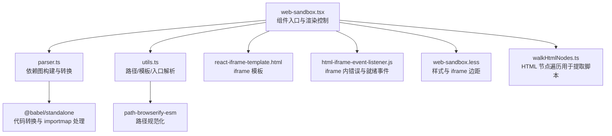
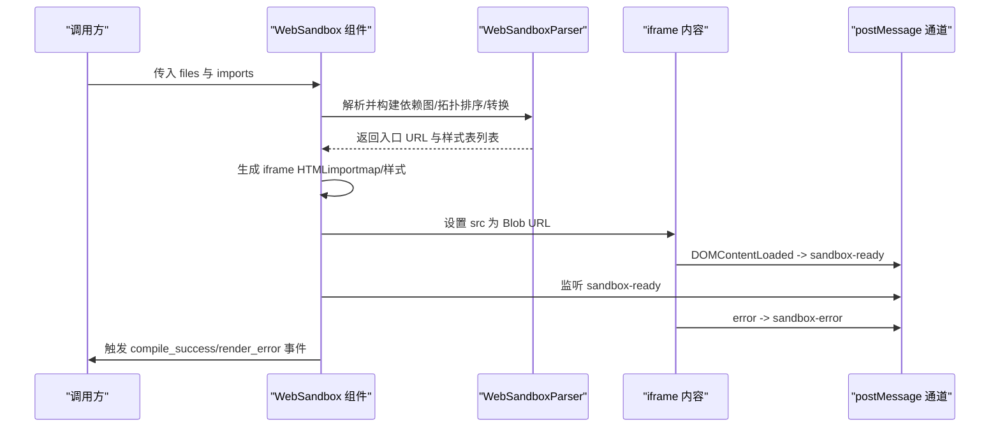
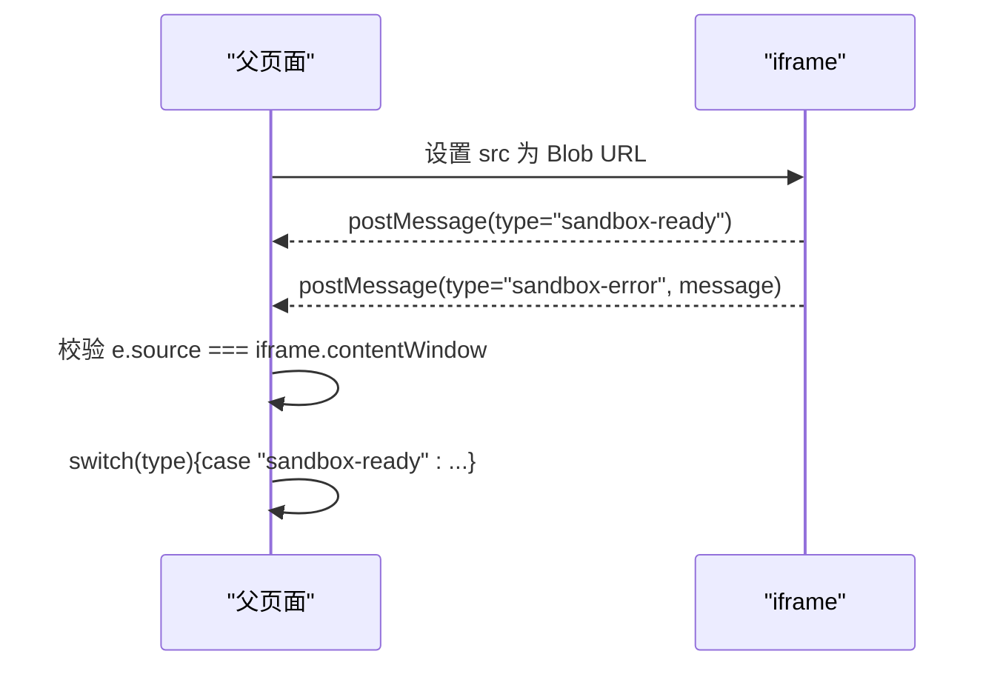
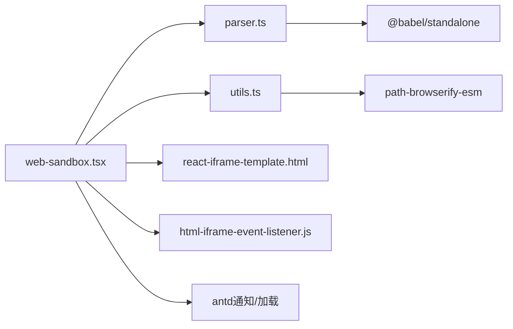

# 安全机制

<cite>
**本文引用的文件**
- [web-sandbox.tsx](file://frontend/pro/web-sandbox/web-sandbox.tsx)
- [parser.ts](file://frontend/pro/web-sandbox/parser.ts)
- [utils.ts](file://frontend/pro/web-sandbox/utils.ts)
- [html-iframe-event-listener.js](file://frontend/pro/web-sandbox/html-iframe-event-listener.js)
- [react-iframe-template.html](file://frontend/pro/web-sandbox/react-iframe-template.html)
- [walkHtmlNodes.ts](file://frontend/utils/walkHtmlNodes.ts)
- [web-sandbox.less](file://frontend/pro/web-sandbox/web-sandbox.less)
- [package.json](file://frontend/package.json)
- [README.md（WebSandbox 文档）](file://docs/components/pro/web_sandbox/README.md)
</cite>

## 目录

1. [简介](#简介)
2. [项目结构](#项目结构)
3. [核心组件](#核心组件)
4. [架构总览](#架构总览)
5. [详细组件分析](#详细组件分析)
6. [依赖关系分析](#依赖关系分析)
7. [性能与安全权衡](#性能与安全权衡)
8. [故障排查指南](#故障排查指南)
9. [结论](#结论)
10. [附录：安全配置与最佳实践](#附录安全配置与最佳实践)

## 简介

本文件聚焦于 WebSandbox 组件的安全机制，系统阐述其基于浏览器 iframe 的安全隔离原理、跨域与内容安全策略的落地方式、事件监听与消息传递的安全实现、以及针对恶意内容注入与 XSS 的防护要点。同时给出可操作的安全配置建议、审计清单与漏洞防护指南。

## 项目结构

WebSandbox 位于前端工程 pro 子目录中，核心由以下模块组成：

- 组件入口与渲染控制：web-sandbox.tsx
- 沙箱解析与打包：parser.ts
- 工具与模板：utils.ts、react-iframe-template.html、web-sandbox.less
- iframe 内部事件监听：html-iframe-event-listener.js
- HTML 模板内脚本处理辅助：walkHtmlNodes.ts
- 依赖声明：package.json
- 组件文档：docs/components/pro/web_sandbox/README.md

图表来源

- [web-sandbox.tsx:1-365](file://frontend/pro/web-sandbox/web-sandbox.tsx#L1-L365)
- [parser.ts:1-314](file://frontend/pro/web-sandbox/parser.ts#L1-L314)
- [utils.ts:1-83](file://frontend/pro/web-sandbox/utils.ts#L1-L83)
- [react-iframe-template.html:1-43](file://frontend/pro/web-sandbox/react-iframe-template.html#L1-L43)
- [html-iframe-event-listener.js:1-13](file://frontend/pro/web-sandbox/html-iframe-event-listener.js#L1-L13)
- [walkHtmlNodes.ts:1-19](file://frontend/utils/walkHtmlNodes.ts#L1-L19)
- [package.json:1-59](file://frontend/package.json#L1-L59)

章节来源

- [web-sandbox.tsx:1-365](file://frontend/pro/web-sandbox/web-sandbox.tsx#L1-L365)
- [parser.ts:1-314](file://frontend/pro/web-sandbox/parser.ts#L1-L314)
- [utils.ts:1-83](file://frontend/pro/web-sandbox/utils.ts#L1-L83)
- [react-iframe-template.html:1-43](file://frontend/pro/web-sandbox/react-iframe-template.html#L1-L43)
- [html-iframe-event-listener.js:1-13](file://frontend/pro/web-sandbox/html-iframe-event-listener.js#L1-L13)
- [walkHtmlNodes.ts:1-19](file://frontend/utils/walkHtmlNodes.ts#L1-L19)
- [package.json:1-59](file://frontend/package.json#L1-L59)
- [README.md（WebSandbox 文档）:1-70](file://docs/components/pro/web_sandbox/README.md#L1-L70)

## 核心组件

- WebSandbox 主组件：负责接收源代码文件集合、构建 importmap、选择模板类型、生成 iframe 内容、处理编译/渲染错误、通过 postMessage 与 iframe 通信。
- WebSandboxParser：对输入文件进行依赖图构建、拓扑排序、Babel 转换、CSS 处理与 Blob URL 生成，输出入口 URL 与样式表列表，并提供清理函数回收内存。
- 工具集：路径规范化、默认入口文件识别、模板渲染、HTML 节点遍历等。
- iframe 模板与事件监听：模板内注入 importmap 与样式；iframe 内部监听错误与就绪事件并通过 postMessage 上报。

章节来源

- [web-sandbox.tsx:21-365](file://frontend/pro/web-sandbox/web-sandbox.tsx#L21-L365)
- [parser.ts:14-314](file://frontend/pro/web-sandbox/parser.ts#L14-L314)
- [utils.ts:3-83](file://frontend/pro/web-sandbox/utils.ts#L3-L83)
- [react-iframe-template.html:1-43](file://frontend/pro/web-sandbox/react-iframe-template.html#L1-L43)
- [html-iframe-event-listener.js:1-13](file://frontend/pro/web-sandbox/html-iframe-event-listener.js#L1-L13)

## 架构总览

WebSandbox 的安全隔离以浏览器 iframe 为基础，结合 importmap、Babel 转换、Blob URL 与 postMessage 事件通道实现“最小权限”的运行环境。

图表来源

- [web-sandbox.tsx:94-218](file://frontend/pro/web-sandbox/web-sandbox.tsx#L94-L218)
- [parser.ts:285-312](file://frontend/pro/web-sandbox/parser.ts#L285-L312)
- [react-iframe-template.html:16-40](file://frontend/pro/web-sandbox/react-iframe-template.html#L16-L40)
- [html-iframe-event-listener.js:1-12](file://frontend/pro/web-sandbox/html-iframe-event-listener.js#L1-L12)

## 详细组件分析

### 安全隔离原理与实现

- 浏览器级隔离：iframe 默认与父页面处于不同源上下文，具备独立的执行环境与 DOM，天然阻断脚本直接访问父页面全局对象。
- 权限最小化：仅注入必要的 importmap 与样式，不授予额外权限或能力。
- 进程边界：iframe 中的 React/JS 代码在独立线程中执行，避免与宿主主线程共享状态。

章节来源

- [web-sandbox.tsx:350-356](file://frontend/pro/web-sandbox/web-sandbox.tsx#L350-L356)
- [react-iframe-template.html:7-12](file://frontend/pro/web-sandbox/react-iframe-template.html#L7-L12)

### iframe 安全策略与跨域限制

- 同源策略：iframe 与父页面同源时可直接访问；非同源时需通过 postMessage 通信，WebSandbox 已严格限定消息来源与类型，仅接受来自 iframe 的特定消息。
- CSP：组件未显式设置 CSP 头，但通过 Blob URL 与 importmap 降低外链风险；如需更强保障，可在服务端或网关层设置 CSP 头。
- 跨站脚本：iframe 内脚本无法直接访问父页面 DOM，除非父页面显式将 iframe 的 contentWindow 暴露给子页面（WebSandbox 仅传递主题与自定义分发函数，且未暴露敏感接口）。

章节来源

- [web-sandbox.tsx:244-297](file://frontend/pro/web-sandbox/web-sandbox.tsx#L244-L297)
- [html-iframe-event-listener.js:1-12](file://frontend/pro/web-sandbox/html-iframe-event-listener.js#L1-L12)
- [react-iframe-template.html:16-29](file://frontend/pro/web-sandbox/react-iframe-template.html#L16-L29)

### 内容安全策略（CSP）与资源加载

- importmap：在 iframe 内注入 importmap，限定第三方依赖来源，避免加载不受控脚本。
- 样式与 CSS：相对 CSS 通过 Blob URL 注入，外部 CSS 仅允许 http(s) 或已映射到 importmap 的地址。
- 恶意脚本过滤：HTML 模板模式下，组件会扫描并替换内联脚本为转换后的 Blob URL，避免直接执行不可信脚本。

章节来源

- [react-iframe-template.html:7-12](file://frontend/pro/web-sandbox/react-iframe-template.html#L7-L12)
- [parser.ts:258-276](file://frontend/pro/web-sandbox/parser.ts#L258-L276)
- [web-sandbox.tsx:110-179](file://frontend/pro/web-sandbox/web-sandbox.tsx#L110-L179)

### 事件监听器与消息传递机制

- iframe 就绪与错误上报：iframe 内部监听 DOMContentLoaded 与 error 事件，通过 postMessage 发送 sandbox-ready 与 sandbox-error。
- 父页面监听：父页面仅接受来自 iframe 的消息，根据 type 分发到对应回调（渲染错误/编译成功），并对主题与自定义分发函数进行安全传递。
- 事件来源校验：消息来源严格限定为 iframe.contentWindow，避免伪造消息。

图表来源

- [web-sandbox.tsx:262-282](file://frontend/pro/web-sandbox/web-sandbox.tsx#L262-L282)
- [html-iframe-event-listener.js:1-12](file://frontend/pro/web-sandbox/html-iframe-event-listener.js#L1-L12)
- [react-iframe-template.html:16-29](file://frontend/pro/web-sandbox/react-iframe-template.html#L16-L29)

### 恶意内容注入与 XSS 防护

- 输入规范化：路径与入口文件均经过规范化处理，避免路径穿越与歧义。
- 代码转换：使用 Babel 对 JS/TSX/JSX 进行转换，替换相对导入为 Blob URL，移除或转换 CSS 导入，减少直接执行不可信脚本的机会。
- HTML 模板模式：扫描并替换内联脚本，将其转换为 Blob URL 并注入到 DOM，避免直接执行用户输入的脚本。
- 错误隔离：iframe 内部错误通过 postMessage 上报，父页面仅展示描述性信息，不回显原始堆栈或源码。

章节来源

- [utils.ts:28-34](file://frontend/pro/web-sandbox/utils.ts#L28-L34)
- [parser.ts:176-283](file://frontend/pro/web-sandbox/parser.ts#L176-L283)
- [web-sandbox.tsx:110-179](file://frontend/pro/web-sandbox/web-sandbox.tsx#L110-L179)
- [html-iframe-event-listener.js:1-12](file://frontend/pro/web-sandbox/html-iframe-event-listener.js#L1-L12)

### 依赖与安全相关的第三方库

- @babel/standalone：用于在浏览器端进行代码转换与导入路径替换，是安全转换的关键。
- path-browserify-esm：用于路径规范化，避免路径注入。
- antd：提供通知与加载提示，用于错误展示与用户体验。

章节来源

- [package.json:8-39](file://frontend/package.json#L8-L39)
- [parser.ts:1-12](file://frontend/pro/web-sandbox/parser.ts#L1-L12)
- [utils.ts:1-8](file://frontend/pro/web-sandbox/utils.ts#L1-L8)

## 依赖关系分析

WebSandbox 的安全实现依赖于多模块协作：组件层负责控制与消息桥接，解析层负责依赖与代码转换，工具层负责路径与模板处理，iframe 层负责事件上报与隔离。

图表来源

- [web-sandbox.tsx:1-19](file://frontend/pro/web-sandbox/web-sandbox.tsx#L1-L19)
- [parser.ts:1-12](file://frontend/pro/web-sandbox/parser.ts#L1-L12)
- [utils.ts:1-8](file://frontend/pro/web-sandbox/utils.ts#L1-L8)
- [react-iframe-template.html:1-43](file://frontend/pro/web-sandbox/react-iframe-template.html#L1-L43)
- [html-iframe-event-listener.js:1-13](file://frontend/pro/web-sandbox/html-iframe-event-listener.js#L1-L13)
- [package.json:8-39](file://frontend/package.json#L8-L39)

章节来源

- [web-sandbox.tsx:1-365](file://frontend/pro/web-sandbox/web-sandbox.tsx#L1-L365)
- [parser.ts:1-314](file://frontend/pro/web-sandbox/parser.ts#L1-L314)
- [utils.ts:1-83](file://frontend/pro/web-sandbox/utils.ts#L1-L83)
- [react-iframe-template.html:1-43](file://frontend/pro/web-sandbox/react-iframe-template.html#L1-L43)
- [html-iframe-event-listener.js:1-13](file://frontend/pro/web-sandbox/html-iframe-event-listener.js#L1-L13)
- [package.json:1-59](file://frontend/package.json#L1-L59)

## 性能与安全权衡

- 转换成本：Babel 转换与 Blob URL 创建带来一定开销，建议在输入规模较大时启用缓存与增量更新策略。
- 消息监听：仅监听来自 iframe 的消息，避免频繁事件导致的性能问题。
- 样式与脚本：优先使用 Blob URL 注入相对 CSS，减少网络请求；对外部 CSS 严格白名单控制。

[本节为通用建议，无需列出章节来源]

## 故障排查指南

- 编译失败：检查输入文件是否包含循环依赖、语法错误或缺失入口文件；组件会在解析阶段抛出错误并触发编译错误回调。
- 渲染错误：iframe 内部错误通过 postMessage 上报，父页面会弹出错误通知或触发渲染错误回调；建议开启 showRenderError 查看具体信息。
- 主题与自定义事件：确认父页面正确设置 themeMode 与 onCustom 回调；iframe 通过 postMessage 接收主题变更。
- 样式异常：检查 importmap 与样式注入逻辑，确保样式 URL 正确且可访问。

章节来源

- [web-sandbox.tsx:203-218](file://frontend/pro/web-sandbox/web-sandbox.tsx#L203-L218)
- [web-sandbox.tsx:267-281](file://frontend/pro/web-sandbox/web-sandbox.tsx#L267-L281)
- [parser.ts:128-174](file://frontend/pro/web-sandbox/parser.ts#L128-L174)

## 结论

WebSandbox 通过浏览器 iframe 隔离、importmap 与 Babel 转换、Blob URL 注入、严格的 postMessage 事件通道，实现了对用户输入代码的最小权限运行与有效安全隔离。配合路径规范化与错误上报机制，能够在保证可用性的同时显著降低 XSS 与恶意脚本风险。

[本节为总结性内容，无需列出章节来源]

## 附录：安全配置与最佳实践

### 安全配置建议

- 限制第三方依赖来源：通过 importmap 明确第三方库版本与域名，避免加载不受控脚本。
- 强化 CSP：在服务端或网关层设置 Content-Security-Policy，限制脚本执行来源与内联脚本。
- 最小权限原则：仅注入必要样式与脚本，避免向 iframe 暴露宿主敏感接口。
- 资源白名单：对外部 CSS/JS 采用白名单策略，仅允许 https 或受信任域名。

### 最佳实践

- 输入校验：对用户输入的文件名与路径进行严格校验，避免路径穿越。
- 错误信息脱敏：错误展示应避免泄露内部路径与源码细节。
- 增量更新：对大型项目启用缓存与增量转换，提升性能与安全性。
- 审计日志：记录编译与运行时关键事件，便于追踪与审计。

### 漏洞防护指南

- XSS 防护：避免 innerHTML 直接拼接用户输入；使用 Blob URL 替换内联脚本。
- 循环依赖检测：解析阶段即发现并阻止循环依赖，防止异常行为。
- 跨站消息：严格校验 postMessage 的来源与类型，拒绝未知来源的消息。

章节来源

- [README.md（WebSandbox 文档）:34-70](file://docs/components/pro/web_sandbox/README.md#L34-L70)
- [web-sandbox.tsx:110-179](file://frontend/pro/web-sandbox/web-sandbox.tsx#L110-L179)
- [parser.ts:128-174](file://frontend/pro/web-sandbox/parser.ts#L128-L174)
