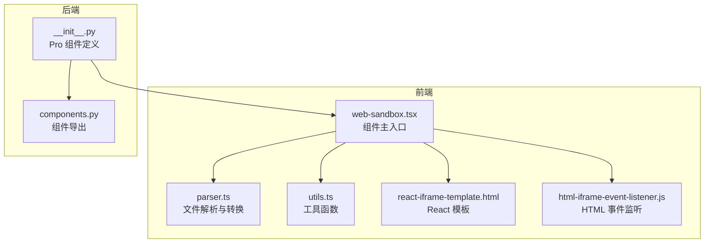
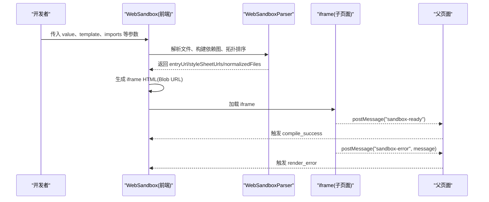
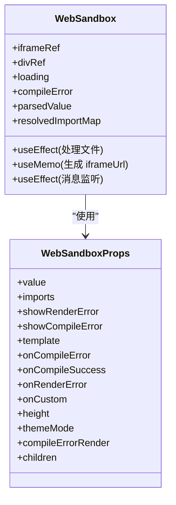
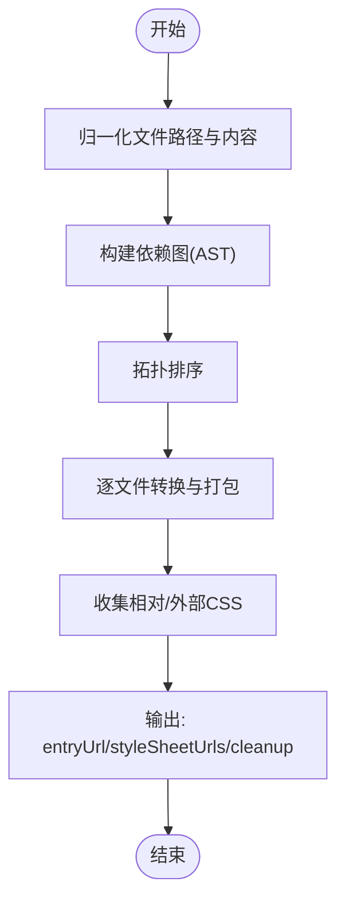
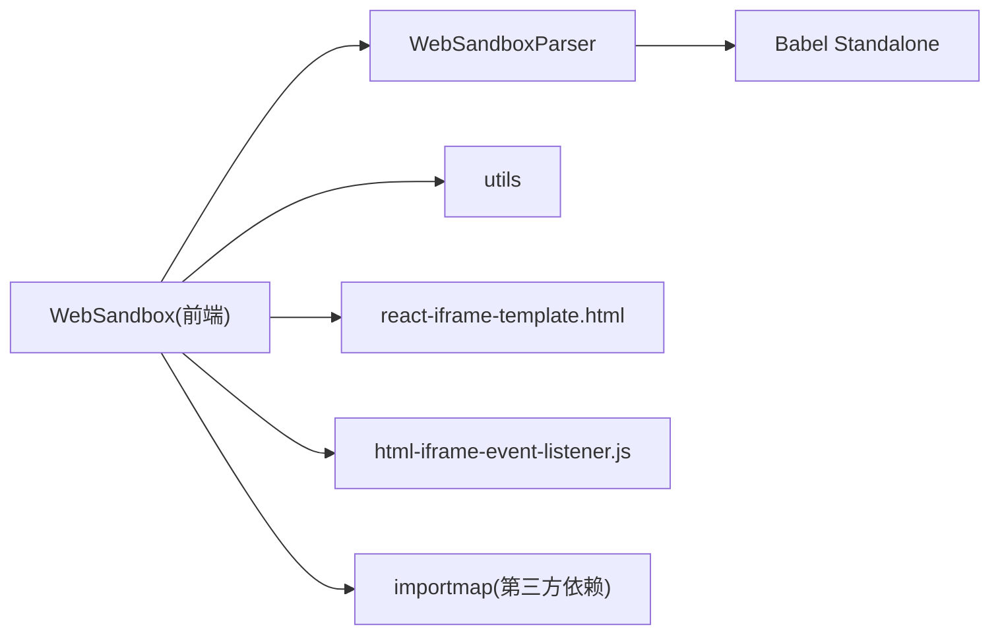

# 组件概览

<cite>
**本文引用的文件**
- [web-sandbox.tsx](file://frontend/pro/web-sandbox/web-sandbox.tsx)
- [parser.ts](file://frontend/pro/web-sandbox/parser.ts)
- [utils.ts](file://frontend/pro/web-sandbox/utils.ts)
- [react-iframe-template.html](file://frontend/pro/web-sandbox/react-iframe-template.html)
- [html-iframe-event-listener.js](file://frontend/pro/web-sandbox/html-iframe-event-listener.js)
- [README.md（WebSandbox 文档）](file://docs/components/pro/web_sandbox/README.md)
- [react.py（示例）](file://docs/components/pro/web_sandbox/demos/react.py)
- [html.py（示例）](file://docs/components/pro/web_sandbox/demos/html.py)
- [error_handling.py（示例）](file://docs/components/pro/web_sandbox/demos/error_handling.py)
- [custom_sandbox_event.py（示例）](file://docs/components/pro/web_sandbox/demos/custom_sandbox_event.py)
- [__init__.py（后端组件入口）](file://backend/modelscope_studio/components/pro/web_sandbox/__init__.py)
- [components.py（后端组件导出）](file://backend/modelscope_studio/components/pro/components.py)
</cite>

## 目录

1. [简介](#简介)
2. [项目结构](#项目结构)
3. [核心组件](#核心组件)
4. [架构总览](#架构总览)
5. [详细组件分析](#详细组件分析)
6. [依赖关系分析](#依赖关系分析)
7. [性能考虑](#性能考虑)
8. [故障排查指南](#故障排查指南)
9. [结论](#结论)
10. [附录：快速开始与基本用法](#附录快速开始与基本用法)

## 简介

WebSandbox 是一个用于在页面中编译与预览“React”或“HTML”代码的安全沙盒组件。它通过将用户提供的源文件进行解析、转换与打包，并在独立的 iframe 中运行，从而实现对第三方内容的安全渲染与隔离。该组件广泛适用于在线代码演示、教学示例展示、低信任度前端内容预览等场景。

## 项目结构

WebSandbox 组件由前后端两部分组成：

- 前端（Svelte/React）负责解析与编译用户代码、生成 iframe 内容、处理错误与主题注入、以及与父页面通信。
- 后端（Python）负责将组件暴露为 Gradio 的 Pro 组件，绑定事件与插槽，供 Python 端调用。

图表来源

- [web-sandbox.tsx:1-365](file://frontend/pro/web-sandbox/web-sandbox.tsx#L1-L365)
- [parser.ts:1-314](file://frontend/pro/web-sandbox/parser.ts#L1-L314)
- [utils.ts:1-83](file://frontend/pro/web-sandbox/utils.ts#L1-L83)
- [react-iframe-template.html:1-43](file://frontend/pro/web-sandbox/react-iframe-template.html#L1-L43)
- [html-iframe-event-listener.js:1-13](file://frontend/pro/web-sandbox/html-iframe-event-listener.js#L1-L13)
- [**init**.py（后端组件入口）:1-86](file://backend/modelscope_studio/components/pro/web_sandbox/__init__.py#L1-L86)
- [components.py（后端组件导出）:1-8](file://backend/modelscope_studio/components/pro/components.py#L1-L8)

章节来源

- [web-sandbox.tsx:1-365](file://frontend/pro/web-sandbox/web-sandbox.tsx#L1-L365)
- [parser.ts:1-314](file://frontend/pro/web-sandbox/parser.ts#L1-L314)
- [utils.ts:1-83](file://frontend/pro/web-sandbox/utils.ts#L1-L83)
- [react-iframe-template.html:1-43](file://frontend/pro/web-sandbox/react-iframe-template.html#L1-L43)
- [html-iframe-event-listener.js:1-13](file://frontend/pro/web-sandbox/html-iframe-event-listener.js#L1-L13)
- [**init**.py（后端组件入口）:1-86](file://backend/modelscope_studio/components/pro/web_sandbox/__init__.py#L1-L86)
- [components.py（后端组件导出）:1-8](file://backend/modelscope_studio/components/pro/components.py#L1-L8)

## 核心组件

- 组件名称：WebSandbox（Pro）
- 功能定位：在安全隔离的 iframe 中编译与渲染 React 或 HTML 代码，支持错误提示、主题注入、自定义事件透传。
- 主要能力：
  - 多模板支持：React 与 HTML 两种模板类型。
  - 自动依赖映射：基于 importmap 注入第三方依赖（如 React 生态）。
  - 编译与打包：对 JS/TS/JSX/TSX 进行转换与打包，内联相对 CSS，外链第三方 CSS。
  - 安全隔离：通过 Blob URL 与 iframe 实现资源与脚本隔离。
  - 错误处理：编译错误与渲染错误分别上报，可选择是否显示。
  - 主题与事件：向 iframe 注入主题信息；支持自定义事件从 iframe 透传到父页面。

章节来源

- [README.md（WebSandbox 文档）:1-70](file://docs/components/pro/web_sandbox/README.md#L1-L70)
- [web-sandbox.tsx:21-35](file://frontend/pro/web-sandbox/web-sandbox.tsx#L21-L35)
- [parser.ts:176-283](file://frontend/pro/web-sandbox/parser.ts#L176-L283)
- [utils.ts:48-75](file://frontend/pro/web-sandbox/utils.ts#L48-L75)

## 架构总览

WebSandbox 的整体流程包括：接收用户文件 → 解析与依赖分析 → 转换与打包 → 生成 iframe 内容 → 渲染与错误上报 → 主题注入与事件透传。

图表来源

- [web-sandbox.tsx:94-218](file://frontend/pro/web-sandbox/web-sandbox.tsx#L94-L218)
- [parser.ts:285-312](file://frontend/pro/web-sandbox/parser.ts#L285-L312)
- [react-iframe-template.html:24-28](file://frontend/pro/web-sandbox/react-iframe-template.html#L24-L28)
- [html-iframe-event-listener.js:8-12](file://frontend/pro/web-sandbox/html-iframe-event-listener.js#L8-L12)

## 详细组件分析

### 组件类与接口（前端）

WebSandbox 作为 Svelte 化的 React 组件，定义了属性、事件与插槽，并在内部维护加载状态、编译错误与解析结果。

图表来源

- [web-sandbox.tsx:21-365](file://frontend/pro/web-sandbox/web-sandbox.tsx#L21-L365)

章节来源

- [web-sandbox.tsx:21-365](file://frontend/pro/web-sandbox/web-sandbox.tsx#L21-L365)

### 解析器（Parser）

WebSandboxParser 负责：

- 归一化文件路径与内容
- 构建依赖图（AST 分析 import）
- 拓扑排序检测循环依赖
- 转换与打包（JS/TS/JSX/TSX），替换相对导入为 Blob URL，内联/外链 CSS
- 生成入口文件 URL 与样式表 URL 列表

图表来源

- [parser.ts:28-312](file://frontend/pro/web-sandbox/parser.ts#L28-L312)

章节来源

- [parser.ts:14-314](file://frontend/pro/web-sandbox/parser.ts#L14-L314)

### 工具函数（Utils）

- 文件扩展名与默认入口文件集合
- 路径标准化
- 模板渲染
- 入口文件选择逻辑

章节来源

- [utils.ts:1-83](file://frontend/pro/web-sandbox/utils.ts#L1-L83)

### iframe 模板与事件监听

- React 模板：注入 importmap、样式表、入口模块，监听错误与 ready 事件并通过 postMessage 通知父页面。
- HTML 事件监听：在 HTML 模式下注入事件监听脚本，行为与模板一致。

章节来源

- [react-iframe-template.html:1-43](file://frontend/pro/web-sandbox/react-iframe-template.html#L1-L43)
- [html-iframe-event-listener.js:1-13](file://frontend/pro/web-sandbox/html-iframe-event-listener.js#L1-L13)

### 后端组件（Python）

- 将前端组件注册为 Pro 组件，支持事件绑定与插槽配置。
- 提供类型化文件数据结构，便于 Python 端传参。

章节来源

- [**init**.py（后端组件入口）:1-86](file://backend/modelscope_studio/components/pro/web_sandbox/__init__.py#L1-L86)
- [components.py（后端组件导出）:1-8](file://backend/modelscope_studio/components/pro/components.py#L1-L8)

## 依赖关系分析

- 组件耦合点：
  - WebSandbox 依赖 Parser 进行文件解析与打包。
  - WebSandbox 依赖 utils 提供的工具函数（路径、入口选择、模板渲染）。
  - iframe 模板与事件监听脚本通过 Blob URL 注入到 iframe。
- 外部依赖：
  - importmap 用于在线依赖映射（如 React 生态）。
  - Babel Standalone 用于代码转换与 AST 分析。
- 可能的循环依赖：
  - Parser 通过拓扑排序避免循环依赖；若存在循环依赖会抛出异常。

图表来源

- [web-sandbox.tsx:1-365](file://frontend/pro/web-sandbox/web-sandbox.tsx#L1-L365)
- [parser.ts:1-314](file://frontend/pro/web-sandbox/parser.ts#L1-L314)
- [utils.ts:1-83](file://frontend/pro/web-sandbox/utils.ts#L1-L83)
- [react-iframe-template.html:1-43](file://frontend/pro/web-sandbox/react-iframe-template.html#L1-L43)
- [html-iframe-event-listener.js:1-13](file://frontend/pro/web-sandbox/html-iframe-event-listener.js#L1-L13)

章节来源

- [web-sandbox.tsx:1-365](file://frontend/pro/web-sandbox/web-sandbox.tsx#L1-L365)
- [parser.ts:1-314](file://frontend/pro/web-sandbox/parser.ts#L1-L314)
- [utils.ts:1-83](file://frontend/pro/web-sandbox/utils.ts#L1-L83)

## 性能考虑

- 转换与打包成本：对每个 JS/TS 文件执行转换与 AST 分析，建议控制文件数量与体积。
- Blob URL 管理：打包完成后需及时释放 Blob URL，避免内存泄漏。
- 样式表策略：相对 CSS 内联为 Blob URL，外部 CSS 直接外链，减少重复请求。
- 主题注入与消息通信：仅在 iframeUrl 变化时注入主题，避免频繁操作。

## 故障排查指南

- 编译错误
  - 现象：组件显示编译错误或触发 compile_error 事件。
  - 排查：检查入口文件是否存在、模板类型是否匹配、第三方依赖是否正确映射。
- 渲染错误
  - 现象：iframe 内发生运行时错误，触发 render_error 事件并弹窗提示（取决于 show_render_error）。
  - 排查：查看 iframe 控制台日志，确认依赖与入口模块正确性。
- 循环依赖
  - 现象：解析阶段抛出循环依赖异常。
  - 排查：检查 import 关系，拆分模块或调整导入路径。
- 主题不生效
  - 现象：iframe 内主题未更新。
  - 排查：确认 themeMode 参数传递与 postMessage 是否成功。

章节来源

- [web-sandbox.tsx:244-297](file://frontend/pro/web-sandbox/web-sandbox.tsx#L244-L297)
- [parser.ts:128-174](file://frontend/pro/web-sandbox/parser.ts#L128-L174)
- [README.md（WebSandbox 文档）:34-70](file://docs/components/pro/web_sandbox/README.md#L34-L70)

## 结论

WebSandbox 通过“解析-转换-打包-iframe 隔离”的完整链路，实现了对第三方前端代码的安全渲染。其多模板支持、自动依赖映射、完善的错误处理与事件透传机制，使其非常适合在教学、演示与低信任度内容预览等场景中使用。

## 附录：快速开始与基本用法

- 使用场景
  - 在线 React 示例演示
  - HTML 页面即时预览
  - 自定义事件从 iframe 透传到 Python
  - 编译/渲染错误的可视化提示
- 快速开始步骤
  - 准备文件：以字典形式提供文件内容，指定入口文件（或使用默认入口）。
  - 选择模板：template 设置为 'react' 或 'html'。
  - 添加依赖：通过 imports 提供 importmap 映射（如 React 生态）。
  - 渲染组件：设置高度、主题模式与错误处理策略。
- 基本示例参考
  - React 示例：[react.py:1-171](file://docs/components/pro/web_sandbox/demos/react.py#L1-L171)
  - HTML 示例：[html.py:1-113](file://docs/components/pro/web_sandbox/demos/html.py#L1-L113)
  - 错误处理示例：[error_handling.py:1-29](file://docs/components/pro/web_sandbox/demos/error_handling.py#L1-L29)
  - 自定义事件示例：[custom_sandbox_event.py:1-27](file://docs/components/pro/web_sandbox/demos/custom_sandbox_event.py#L1-L27)

章节来源

- [README.md（WebSandbox 文档）:1-70](file://docs/components/pro/web_sandbox/README.md#L1-L70)
- [react.py（示例）:1-171](file://docs/components/pro/web_sandbox/demos/react.py#L1-L171)
- [html.py（示例）:1-113](file://docs/components/pro/web_sandbox/demos/html.py#L1-L113)
- [error_handling.py（示例）:1-29](file://docs/components/pro/web_sandbox/demos/error_handling.py#L1-L29)
- [custom_sandbox_event.py（示例）:1-27](file://docs/components/pro/web_sandbox/demos/custom_sandbox_event.py#L1-L27)
