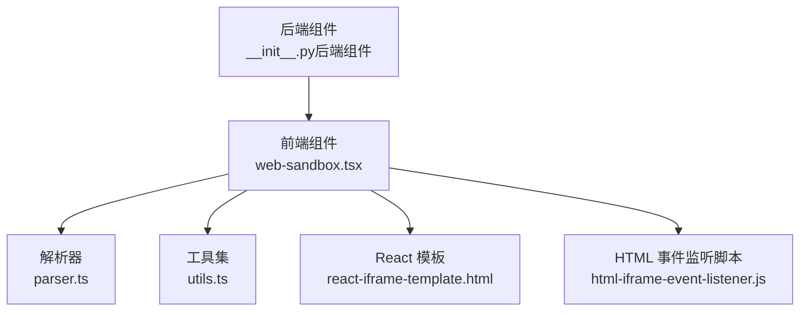
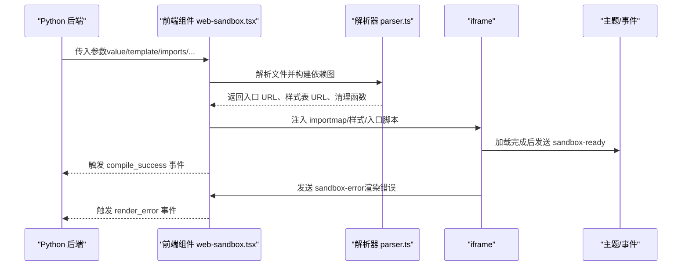
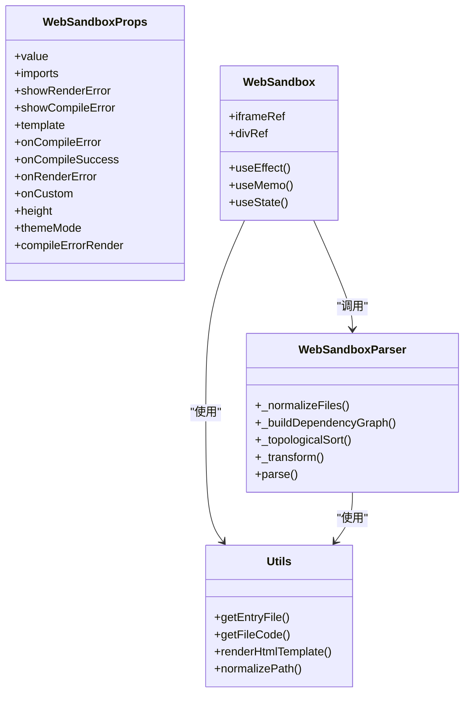

# 配置选项

<cite>
**本文引用的文件**
- [web_sandbox.tsx](file://frontend/pro/web-sandbox/web-sandbox.tsx)
- [parser.ts](file://frontend/pro/web-sandbox/parser.ts)
- [utils.ts](file://frontend/pro/web-sandbox/utils.ts)
- [react-iframe-template.html](file://frontend/pro/web-sandbox/react-iframe-template.html)
- [html-iframe-event-listener.js](file://frontend/pro/web-sandbox/html-iframe-event-listener.js)
- [__init__.py（后端组件）](file://backend/modelscope_studio/components/pro/web_sandbox/__init__.py)
- [README（英文）](file://docs/components/pro/web_sandbox/README.md)
- [README（中文）](file://docs/components/pro/web_sandbox/README-zh_CN.md)
</cite>

## 目录

1. [简介](#简介)
2. [项目结构](#项目结构)
3. [核心组件](#核心组件)
4. [架构总览](#架构总览)
5. [详细组件分析](#详细组件分析)
6. [依赖关系分析](#依赖关系分析)
7. [性能考量](#性能考量)
8. [故障排查指南](#故障排查指南)
9. [结论](#结论)
10. [附录](#附录)

## 简介

本文件面向 WebSandbox 组件的使用者与维护者，系统化梳理其配置参数与行为，涵盖 template、show_render_error、show_compile_error、imports、height 等关键参数的作用、默认值、适用场景，并提供典型配置组合示例、最佳实践与常见问题的解决方案。目标是帮助读者快速理解并正确使用该组件。

## 项目结构

WebSandbox 由“后端组件定义 + 前端渲染实现 + 沙箱解析与打包工具”三部分组成：

- 后端组件：负责接收 Python 层传入的参数，暴露事件与插槽，决定前端资源目录。
- 前端组件：负责构建 importmap、解析文件、生成 Blob URL、注入到 iframe 并处理错误与事件。
- 工具与模板：解析器负责依赖图构建、拓扑排序与代码转换；模板与事件监听脚本用于 iframe 生命周期与错误上报。

**图表来源**

- [**init**.py（后端组件）:15-73](file://backend/modelscope_studio/components/pro/web_sandbox/__init__.py#L15-L73)
- [web_sandbox.tsx:37-365](file://frontend/pro/web-sandbox/web-sandbox.tsx#L37-L365)
- [parser.ts:14-314](file://frontend/pro/web-sandbox/parser.ts#L14-L314)
- [utils.ts:1-83](file://frontend/pro/web-sandbox/utils.ts#L1-L83)
- [react-iframe-template.html:1-43](file://frontend/pro/web-sandbox/react-iframe-template.html#L1-L43)
- [html-iframe-event-listener.js:1-13](file://frontend/pro/web-sandbox/html-iframe-event-listener.js#L1-L13)

**章节来源**

- [**init**.py（后端组件）:15-73](file://backend/modelscope_studio/components/pro/web_sandbox/__init__.py#L15-L73)
- [web_sandbox.tsx:37-365](file://frontend/pro/web-sandbox/web-sandbox.tsx#L37-L365)
- [parser.ts:14-314](file://frontend/pro/web-sandbox/parser.ts#L14-L314)
- [utils.ts:1-83](file://frontend/pro/web-sandbox/utils.ts#L1-L83)
- [react-iframe-template.html:1-43](file://frontend/pro/web-sandbox/react-iframe-template.html#L1-L43)
- [html-iframe-event-listener.js:1-13](file://frontend/pro/web-sandbox/html-iframe-event-listener.js#L1-L13)

## 核心组件

- 后端组件类：定义了组件的构造参数、事件绑定与前端资源目录映射。
- 前端组件：接收 props，构建 importmap，解析文件并生成 iframe 内容，处理编译与渲染错误，派发事件。
- 解析器：对输入文件建立依赖图，拓扑排序后进行代码转换，生成 Blob URL 与样式表链接。
- 工具集：提供默认入口文件列表、路径规范化、模板渲染、入口文件选择等辅助能力。
- 模板与事件监听：为 React 模板注入 importmap 与样式，监听加载完成与错误事件并通过 postMessage 上报。

**章节来源**

- [**init**.py（后端组件）:15-73](file://backend/modelscope_studio/components/pro/web_sandbox/__init__.py#L15-L73)
- [web_sandbox.tsx:37-365](file://frontend/pro/web-sandbox/web-sandbox.tsx#L37-L365)
- [parser.ts:14-314](file://frontend/pro/web-sandbox/parser.ts#L14-L314)
- [utils.ts:20-83](file://frontend/pro/web-sandbox/utils.ts#L20-L83)
- [react-iframe-template.html:7-42](file://frontend/pro/web-sandbox/react-iframe-template.html#L7-L42)
- [html-iframe-event-listener.js:1-13](file://frontend/pro/web-sandbox/html-iframe-event-listener.js#L1-L13)

## 架构总览

下图展示了从后端到前端再到 iframe 的整体流程：后端传参 → 前端构建 importmap 与解析文件 → 生成 iframe 内容 → 主窗口监听消息并处理错误与成功事件。

**图表来源**

- [web_sandbox.tsx:79-218](file://frontend/pro/web-sandbox/web-sandbox.tsx#L79-L218)
- [parser.ts:285-312](file://frontend/pro/web-sandbox/parser.ts#L285-L312)
- [react-iframe-template.html:16-40](file://frontend/pro/web-sandbox/react-iframe-template.html#L16-L40)
- [html-iframe-event-listener.js:1-13](file://frontend/pro/web-sandbox/html-iframe-event-listener.js#L1-L13)

## 详细组件分析

### 参数总览与默认值

- template
  - 类型：'react' | 'html'
  - 默认值：'react'
  - 作用：决定渲染模板类型，影响默认入口文件与自动注入的 React 依赖。
  - 使用场景：预览 React 或 HTML 代码。
- show_render_error
  - 类型：bool
  - 默认值：True
  - 作用：是否在渲染阶段出现错误时弹出通知并回调事件。
  - 使用场景：开发调试期希望显式看到运行时错误。
- show_compile_error
  - 类型：bool
  - 默认值：True
  - 作用：是否在编译失败时展示错误 UI（可替换为自定义插槽或函数）。
  - 使用场景：需要在 UI 中直接呈现编译错误信息。
- compile_error_render
  - 类型：str | None
  - 默认值：None
  - 作用：传入 JavaScript 函数字符串，用于自定义编译失败的渲染逻辑。
  - 使用场景：需要更精细的错误展示或与主题一致的样式。
- imports
  - 类型：Dict[str, str] | None
  - 默认值：None
  - 作用：对应 importmap 的 imports 字段，用于添加在线依赖。template='react' 时会自动注入 React 相关依赖。
  - 使用场景：引入第三方库、CDN 资源或覆盖默认 React 版本。
- height
  - 类型：str | float | int
  - 默认值：400
  - 作用：组件高度；数字表示像素，字符串表示 CSS 单位。
  - 使用场景：适配不同布局与响应式需求。

**章节来源**

- [README（英文）:38-46](file://docs/components/pro/web_sandbox/README.md#L38-L46)
- [README（中文）:38-46](file://docs/components/pro/web_sandbox/README-zh_CN.md#L38-L46)
- [web_sandbox.tsx:21-35](file://frontend/pro/web-sandbox/web-sandbox.tsx#L21-L35)
- [**init**.py（后端组件）:37-67](file://backend/modelscope_studio/components/pro/web_sandbox/__init__.py#L37-L67)

### 参数详解与行为

#### template

- 影响点：
  - 默认入口文件：template='react' 时默认入口为 index.tsx/index.jsx/index.ts/index.js；template='html' 时默认入口为 index.html。
  - 自动注入 React 依赖：当 template='react' 且 imports 未覆盖时，自动添加 react 与 react-dom 的 CDN 映射。
- 典型用法：
  - 预览 React 应用：template='react'，提供入口文件（如 index.tsx）。
  - 预览静态 HTML：template='html'，提供 index.html。
- 注意事项：
  - 若同时提供多个候选入口文件，可通过 is_entry 标记明确主入口。

**章节来源**

- [utils.ts:20-26](file://frontend/pro/web-sandbox/utils.ts#L20-L26)
- [utils.ts:48-75](file://frontend/pro/web-sandbox/utils.ts#L48-L75)
- [web_sandbox.tsx:80-92](file://frontend/pro/web-sandbox/web-sandbox.tsx#L80-L92)

#### show_render_error

- 行为：
  - 当 iframe 内发生渲染错误（捕获 window.error 或 HTML 事件监听），若开启则弹出通知并触发 render_error 事件。
- 建议：
  - 开发阶段建议保持 True，便于快速定位问题。
  - 生产环境可根据业务策略关闭，避免用户看到底层错误。

**章节来源**

- [web_sandbox.tsx:262-281](file://frontend/pro/web-sandbox/web-sandbox.tsx#L262-L281)
- [html-iframe-event-listener.js:1-13](file://frontend/pro/web-sandbox/html-iframe-event-listener.js#L1-L13)

#### show_compile_error

- 行为：
  - 当编译失败（解析器抛错或入口缺失）时，若开启则展示错误 UI；否则不显示错误界面。
  - 可结合 compile_error_render 或插槽 compileErrorRender 自定义展示。
- 建议：
  - 前端错误较多时建议开启，以便用户直观感知问题。

**章节来源**

- [web_sandbox.tsx:317-342](file://frontend/pro/web-sandbox/web-sandbox.tsx#L317-L342)
- [web_sandbox.tsx:203-217](file://frontend/pro/web-sandbox/web-sandbox.tsx#L203-L217)

#### compile_error_render

- 行为：
  - 传入 JavaScript 函数字符串，用于自定义编译失败的渲染。
  - 也可通过插槽 compileErrorRender 提供 React 节点。
- 建议：
  - 与主题一致的错误样式；或提供重试按钮、复制错误信息等交互。

**章节来源**

- [web_sandbox.tsx:317-342](file://frontend/pro/web-sandbox/web-sandbox.tsx#L317-L342)
- [**init**.py（后端组件）:35-35](file://backend/modelscope_studio/components/pro/web_sandbox/__init__.py#L35-L35)

#### imports

- 行为：
  - 作为 importmap.imports 使用，template='react' 时会先合并内置 React 映射，再叠加用户提供的 imports。
  - 支持覆盖默认 React 版本或添加其他依赖。
- 建议：
  - 优先使用稳定的 CDN；确保跨域可访问。
  - 如需本地依赖，可结合打包策略或 Blob URL 方案。

**章节来源**

- [web_sandbox.tsx:80-92](file://frontend/pro/web-sandbox/web-sandbox.tsx#L80-L92)
- [README（英文）:45-45](file://docs/components/pro/web_sandbox/README.md#L45-L45)
- [README（中文）:45-45](file://docs/components/pro/web_sandbox/README-zh_CN.md#L45-L45)

#### height

- 行为：
  - 数字：以像素为单位；字符串：按 CSS 单位解析。
- 建议：
  - 在容器布局中保持一致的单位风格；配合 CSS Grid/Flex 使用更灵活。

**章节来源**

- [web_sandbox.tsx:312-315](file://frontend/pro/web-sandbox/web-sandbox.tsx#L312-L315)
- [README（英文）:46-46](file://docs/components/pro/web_sandbox/README.md#L46-L46)
- [README（中文）:46-46](file://docs/components/pro/web_sandbox/README-zh_CN.md#L46-L46)

### 典型配置组合示例

- 预览 React 应用（默认）
  - template='react'，imports 为空或仅覆盖 React 版本，value 提供入口文件。
- 预览 HTML 页面
  - template='html'，value 提供 index.html，必要时在 HTML 中内联脚本。
- 自定义错误展示
  - show_compile_error=True，compile_error_render 提供函数字符串或插槽 compileErrorRender。
- 高度自适应
  - height='100%' 或具体数值 px，配合父容器布局。

**章节来源**

- [README（英文）:7-18](file://docs/components/pro/web_sandbox/README.md#L7-L18)
- [README（中文）:7-18](file://docs/components/pro/web_sandbox/README-zh_CN.md#L7-L18)
- [web_sandbox.tsx:317-342](file://frontend/pro/web-sandbox/web-sandbox.tsx#L317-L342)

## 依赖关系分析

- 前端组件依赖解析器与工具集，解析器内部使用 Babel Standalone 进行代码转换与依赖分析。
- 模板与事件监听脚本注入到 iframe，负责生命周期与错误上报。
- 后端组件定义事件与插槽，前端组件在运行时绑定并触发相应事件。

**图表来源**

- [web_sandbox.tsx:21-35](file://frontend/pro/web-sandbox/web-sandbox.tsx#L21-L35)
- [web_sandbox.tsx:37-365](file://frontend/pro/web-sandbox/web-sandbox.tsx#L37-L365)
- [parser.ts:14-314](file://frontend/pro/web-sandbox/parser.ts#L14-L314)
- [utils.ts:1-83](file://frontend/pro/web-sandbox/utils.ts#L1-L83)

**章节来源**

- [web_sandbox.tsx:37-365](file://frontend/pro/web-sandbox/web-sandbox.tsx#L37-L365)
- [parser.ts:14-314](file://frontend/pro/web-sandbox/parser.ts#L14-L314)
- [utils.ts:1-83](file://frontend/pro/web-sandbox/utils.ts#L1-L83)

## 性能考量

- 编译与转换
  - 解析器对每个 JS/CSS 文件执行转换与依赖分析，文件数量与体积直接影响编译时间。
  - 建议：减少不必要的依赖、拆分入口文件、避免循环依赖。
- Blob URL 与内存
  - 转换后的代码与样式均生成 Blob URL，组件卸载时会统一回收；仍需关注大量文件时的内存占用。
- iframe 渲染
  - React 模板注入 importmap 与入口模块，首次加载可能受网络与 CDN 影响。
- 主题与事件
  - 主题切换通过 postMessage 传递，避免频繁重绘；错误弹窗仅在开启相关开关时出现。

[本节为通用性能建议，无需特定文件引用]

## 故障排查指南

- 编译失败
  - 症状：UI 展示编译错误或触发 compile_error 事件。
  - 排查要点：
    - 检查 value 中是否存在有效入口文件（template 对应的默认文件名或 is_entry 标记）。
    - 检查 imports 中的依赖是否可访问、是否与模板类型匹配。
    - 查看错误信息中是否包含具体文件与错误堆栈。
- 渲染错误
  - 症状：iframe 内部抛错，主窗口弹出通知并触发 render_error 事件。
  - 排查要点：
    - 关闭 show_render_error 后观察是否仍出现错误，确认是否为 UI 展示导致。
    - 检查模板中是否正确注入 importmap 与样式。
- 循环依赖
  - 症状：解析器抛出循环依赖错误。
  - 排查要点：
    - 检查文件间相互 import 的关系，拆分或抽象公共模块。
- 高度异常
  - 症状：内容被裁剪或滚动条异常。
  - 排查要点：
    - 确认 height 传入格式（数字 vs 字符串 CSS 单位）与父容器尺寸一致。

**章节来源**

- [web_sandbox.tsx:203-217](file://frontend/pro/web-sandbox/web-sandbox.tsx#L203-L217)
- [web_sandbox.tsx:262-281](file://frontend/pro/web-sandbox/web-sandbox.tsx#L262-L281)
- [parser.ts:128-174](file://frontend/pro/web-sandbox/parser.ts#L128-L174)
- [react-iframe-template.html:7-12](file://frontend/pro/web-sandbox/react-iframe-template.html#L7-L12)

## 结论

WebSandbox 通过清晰的参数体系与完善的错误处理机制，为 React 与 HTML 代码提供了安全可控的沙箱预览能力。合理配置 template、imports、show\_\* 开关与 height，可满足从开发调试到生产展示的不同场景。建议在复杂项目中优先规范依赖与入口文件命名，配合自定义错误展示提升可观测性与用户体验。

[本节为总结性内容，无需特定文件引用]

## 附录

### API 一览（参数、事件、插槽）

- 参数
  - value：文件集合；template：'react'|'html'；imports：importmap.imports；show_render_error/show_compile_error：布尔开关；compile_error_render：JS 函数字符串；height：高度。
- 事件
  - compile_success、compile_error、render_error、custom。
- 插槽
  - compileErrorRender。

**章节来源**

- [README（英文）:38-61](file://docs/components/pro/web_sandbox/README.md#L38-L61)
- [README（中文）:38-70](file://docs/components/pro/web_sandbox/README-zh_CN.md#L38-L70)
- [**init**.py（后端组件）:19-35](file://backend/modelscope_studio/components/pro/web_sandbox/__init__.py#L19-L35)
