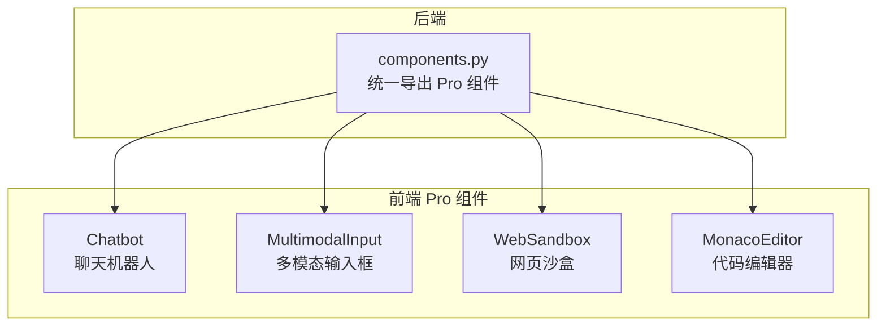
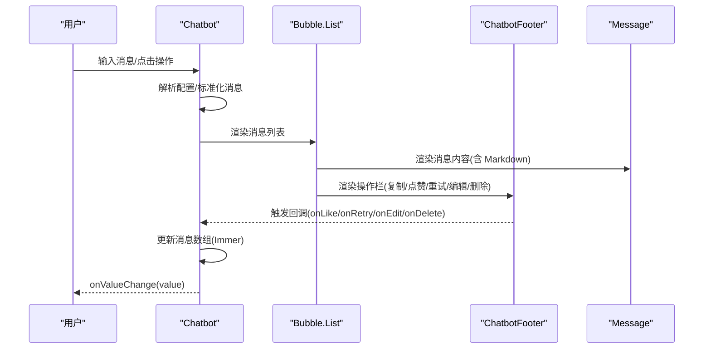
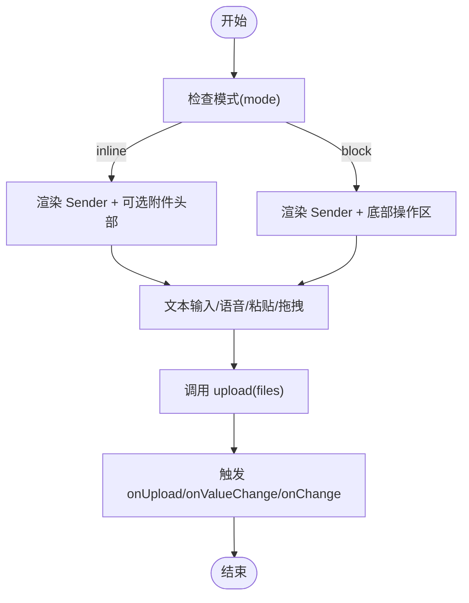
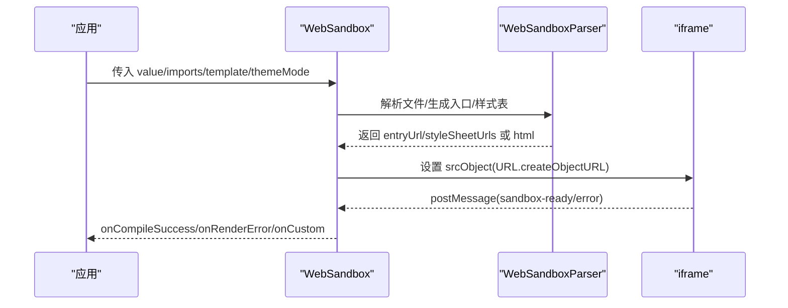
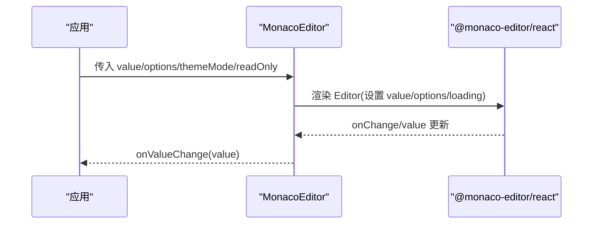
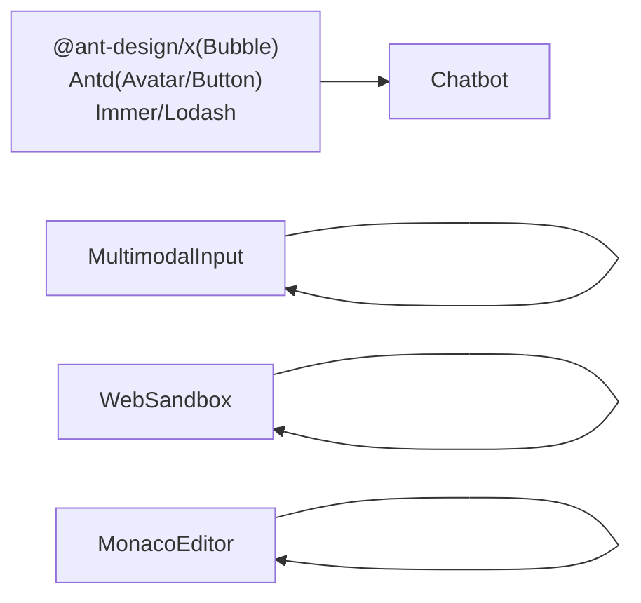

# 专业组件

<cite>
**本文引用的文件**
- [chatbot.tsx](file://frontend/pro/chatbot/chatbot.tsx)
- [type.ts](file://frontend/pro/chatbot/type.ts)
- [utils.ts](file://frontend/pro/chatbot/utils.ts)
- [multimodal-input.tsx](file://frontend/pro/multimodal-input/multimodal-input.tsx)
- [recorder.ts](file://frontend/pro/multimodal-input/recorder.ts)
- [utils.ts](file://frontend/pro/multimodal-input/utils.ts)
- [web-sandbox.tsx](file://frontend/pro/web-sandbox/web-sandbox.tsx)
- [monaco-editor.tsx](file://frontend/pro/monaco-editor/monaco-editor.tsx)
- [components.py](file://backend/modelscope_studio/components/pro/components.py)
</cite>

## 目录

1. [简介](#简介)
2. [项目结构](#项目结构)
3. [核心组件](#核心组件)
4. [架构总览](#架构总览)
5. [详细组件分析](#详细组件分析)
6. [依赖分析](#依赖分析)
7. [性能考虑](#性能考虑)
8. [故障排除指南](#故障排除指南)
9. [结论](#结论)
10. [附录](#附录)

## 简介

本文件面向有经验的开发者，系统化梳理 ModelScope Studio 专业组件库中的高级组件：Chatbot（聊天机器人）、MultimodalInput（多模态输入框）、WebSandbox（网页沙盒）与 MonacoEditor（代码编辑器）。文档从架构设计、数据流、处理逻辑、集成方式、性能优化到故障排除进行深入说明，并提供可直接定位到源码的路径指引，帮助在复杂专业场景中高效落地。

## 项目结构

专业组件位于前端目录的 pro 子模块，后端通过 components.py 汇总导出，形成统一的组件入口。各组件以 React + Svelte 预处理的方式封装，复用 Ant Design X 与 Ant Design 的能力，结合 Gradio 生态实现高性能交互。

图表来源

- [components.py:1-8](file://backend/modelscope_studio/components/pro/components.py#L1-L8)

章节来源

- [components.py:1-8](file://backend/modelscope_studio/components/pro/components.py#L1-L8)

## 核心组件

- Chatbot：基于气泡消息列表的对话组件，支持用户/助手角色、欢迎提示、复制/点赞/重试/编辑/删除等交互，内置滚动控制与 Markdown 渲染。
- MultimodalInput：支持文本与文件上传的输入组件，内建语音录制、粘贴上传、附件管理、技能面板等扩展槽位。
- WebSandbox：将多文件/HTML 源码编译为可在 iframe 中安全运行的沙盒环境，支持 React/HTML 模板与主题注入。
- MonacoEditor：对 Monaco 编辑器的轻量封装，提供只读模式、主题切换、值变更回调与加载占位。

章节来源

- [chatbot.tsx:51-76](file://frontend/pro/chatbot/chatbot.tsx#L51-L76)
- [multimodal-input.tsx:75-94](file://frontend/pro/multimodal-input/multimodal-input.tsx#L75-L94)
- [web-sandbox.tsx:21-35](file://frontend/pro/web-sandbox/web-sandbox.tsx#L21-L35)
- [monaco-editor.tsx:12-19](file://frontend/pro/monaco-editor/monaco-editor.tsx#L12-L19)

## 架构总览

四个专业组件均采用“属性驱动 + 上下文/工具函数”的模式组织，内部通过状态管理与事件回调实现数据闭环；对外提供统一的 onValueChange/onChange/onSubmit 等回调，便于与上层应用或服务端联动。

```mermaid
graph TB
subgraph "Chatbot"
CB_API["属性: value/onValueChange/markdownConfig 等"]
CB_CORE["渲染: 气泡消息/欢迎提示/操作栏"]
CB_EVT["事件: onCopy/onEdit/onLike/onRetry 等"]
end
subgraph "MultimodalInput"
MI_API["属性: value/upload/onSubmit/uploadConfig"]
MI_CORE["渲染: Sender + Attachments + 技能面板"]
MI_EVT["事件: onUpload/onPasteFile/onRemove 等"]
end
subgraph "WebSandbox"
WS_API["属性: value/imports/template/themeMode"]
WS_PARSER["解析: WebSandboxParser/模板渲染"]
WS_IFRAME["输出: iframe + 主题注入 + 错误上报"]
end
subgraph "MonacoEditor"
ME_API["属性: value/options/themeMode/readOnly"]
ME_EDITOR["渲染: @monaco-editor/react"]
end
CB_API --> CB_CORE --> CB_EVT
MI_API --> MI_CORE --> MI_EVT
WS_API --> WS_PARSER --> WS_IFRAME
ME_API --> ME_EDITOR
```

图表来源

- [chatbot.tsx:77-472](file://frontend/pro/chatbot/chatbot.tsx#L77-L472)
- [multimodal-input.tsx:105-616](file://frontend/pro/multimodal-input/multimodal-input.tsx#L105-L616)
- [web-sandbox.tsx:37-362](file://frontend/pro/web-sandbox/web-sandbox.tsx#L37-L362)
- [monaco-editor.tsx:21-93](file://frontend/pro/monaco-editor/monaco-editor.tsx#L21-L93)

## 详细组件分析

### Chatbot 聊天机器人

- 功能特性
  - 角色化消息渲染：用户/助手/系统/分隔符等角色映射，支持头/体/脚/头像自定义。
  - 欢迎提示：内置欢迎消息区域，支持提示词选择回调。
  - 交互能力：复制、点赞/踩、重试、编辑、删除、建议项选择。
  - 自动滚动与底部按钮：可配置自动滚动与“回到底部”按钮。
  - Markdown 渲染：统一的 Markdown 配置，支持换行与渲染开关。
- 关键属性与回调
  - 基础：rootUrl、apiPrefix、themeMode、height/minHeight/maxHeight、autoScroll、showScrollToBottomButton、scrollToBottomButtonOffset。
  - 配置：userConfig、botConfig、markdownConfig、welcomeConfig。
  - 数据：value（消息数组）、onValueChange。
  - 回调：onCopy、onEdit、onDelete、onLike、onRetry、onSuggestionSelect、onWelcomePromptSelect。
- 内部机制
  - 使用上下文提供者与角色预处理，将外部消息标准化为气泡项。
  - 使用 Immer 进行不可变更新，保证编辑/点赞/删除等操作的稳定性。
  - 使用滚动钩子控制滚动位置与按钮显示。

图表来源

- [chatbot.tsx:107-472](file://frontend/pro/chatbot/chatbot.tsx#L107-L472)

章节来源

- [chatbot.tsx:51-475](file://frontend/pro/chatbot/chatbot.tsx#L51-L475)
- [type.ts](file://frontend/pro/chatbot/type.ts)
- [utils.ts](file://frontend/pro/chatbot/utils.ts)

### MultimodalInput 多模态输入框

- 功能特性
  - 文本输入与发送：基于 Sender 组件，支持语音录制、粘贴上传、提交回调。
  - 文件上传：基于 Attachments，支持拖拽、全屏拖拽、计数显示、最大数量限制。
  - 附件管理：支持下载、预览、移除、占位图与图标定制。
  - 技能面板：标题、提示、可关闭等扩展槽位，支持自定义渲染与函数式配置。
  - 状态与禁用：loading/disabled/readOnly 控制上传流程。
- 关键属性与回调
  - 基础：value、mode（inline/block）、upload（文件上传函数）、onValueChange/onChange/onSubmit。
  - 上传配置：uploadConfig（allowUpload/allowSpeech/allowPasteFile/showCount/title/placeholder/fullscreenDrop/maxCount 等）。
  - 事件：onUpload/onPasteFile/onRemove/onDownload/onDrop/onPreview。
- 内部机制
  - 使用 useValueChange 同步外部 value 与内部状态。
  - 录音器 hook 支持麦克风录音并转换为音频文件后上传。
  - 上传时维护临时文件列表，完成后合并为最终文件列表并触发回调。

图表来源

- [multimodal-input.tsx:105-616](file://frontend/pro/multimodal-input/multimodal-input.tsx#L105-L616)

章节来源

- [multimodal-input.tsx:75-619](file://frontend/pro/multimodal-input/multimodal-input.tsx#L75-L619)
- [recorder.ts](file://frontend/pro/multimodal-input/recorder.ts)
- [utils.ts](file://frontend/pro/multimodal-input/utils.ts)

### WebSandbox 网页沙盒

- 功能特性
  - 多文件/HTML 源码编译：解析入口文件，提取样式表与脚本，生成可运行的 HTML 或 React 入口。
  - 安全沙盒：通过 iframe 承载，避免与宿主页面冲突。
  - 主题注入：支持主题模式传递至 iframe 内容。
  - 错误处理：编译错误与渲染错误的可视化展示与回调通知。
- 关键属性与回调
  - 基础：value（文件字典）、imports（第三方依赖映射）、template（react/html）、themeMode、height。
  - 行为：showRenderError/showCompileError、onCompileError/onCompileSuccess/onRenderError/onCustom。
  - 自定义：compileErrorRender 插槽与函数。
- 内部机制
  - 根据模板选择解析策略：HTML 模式下提取并替换内联脚本，React 模式下生成入口 URL。
  - 使用 WebSandboxParser 进行文件解析与依赖映射，生成 import map 与样式表链接。
  - 通过 postMessage 与 iframe 通信，接收 sandbox-ready/sandbox-error 等事件。

图表来源

- [web-sandbox.tsx:37-362](file://frontend/pro/web-sandbox/web-sandbox.tsx#L37-L362)

章节来源

- [web-sandbox.tsx:21-365](file://frontend/pro/web-sandbox/web-sandbox.tsx#L21-L365)

### MonacoEditor 代码编辑器

- 功能特性
  - 主题适配：根据 themeMode 切换 vs-dark/light。
  - 只读模式：通过 readOnly 属性控制编辑行为。
  - 加载占位：支持自定义 loading 插槽或默认 Spin。
  - 值同步：统一的 useValueChange 实现双向绑定。
- 关键属性与回调
  - 基础：value、options、themeMode、readOnly、height。
  - 回调：onMount/beforeMount/afterMount、onChange/onValueChange。
- 内部机制
  - 将 props 透传给 @monaco-editor/react 的 Editor 组件。
  - 在 mount 生命周期中串联 onMount/afterMount，确保初始化顺序。

图表来源

- [monaco-editor.tsx:21-93](file://frontend/pro/monaco-editor/monaco-editor.tsx#L21-L93)

章节来源

- [monaco-editor.tsx:12-95](file://frontend/pro/monaco-editor/monaco-editor.tsx#L12-L95)

## 依赖分析

- 组件间耦合
  - 各组件保持低耦合，通过统一的 onValueChange/onChange/onSubmit 等回调与上层应用解耦。
  - Chatbot/MultimodalInput/WebSandbox/MonacoEditor 分别独立封装，职责清晰。
- 外部依赖
  - Chatbot：@ant-design/x（Bubble.List）、Ant Design（Avatar/Button）、Immer、Lodash。
  - MultimodalInput：@ant-design/x（Sender/Attachments）、Ant Design（Badge/Button/Flex/Tooltip）、录音与文件处理工具。
  - WebSandbox：@ant-design/x（HTML 解析与事件监听）、DOM 解析与遍历工具、iframe 通信。
  - MonacoEditor：@monaco-editor/react、Antd Spin。

图表来源

- [chatbot.tsx:1-25](file://frontend/pro/chatbot/chatbot.tsx#L1-L25)
- [multimodal-input.tsx:1-26](file://frontend/pro/multimodal-input/multimodal-input.tsx#L1-L26)
- [web-sandbox.tsx:1-17](file://frontend/pro/web-sandbox/web-sandbox.tsx#L1-L17)
- [monaco-editor.tsx:1-10](file://frontend/pro/monaco-editor/monaco-editor.tsx#L1-L10)

章节来源

- [chatbot.tsx:1-475](file://frontend/pro/chatbot/chatbot.tsx#L1-L475)
- [multimodal-input.tsx:1-619](file://frontend/pro/multimodal-input/multimodal-input.tsx#L1-L619)
- [web-sandbox.tsx:1-365](file://frontend/pro/web-sandbox/web-sandbox.tsx#L1-L365)
- [monaco-editor.tsx:1-95](file://frontend/pro/monaco-editor/monaco-editor.tsx#L1-L95)

## 性能考虑

- Chatbot
  - 使用 useMemo 与 useMemoizedFn 降低渲染与回调开销；通过 Immer 进行局部不可变更新，避免深层拷贝。
  - 滚动控制仅在必要时触发，减少 DOM 操作。
- MultimodalInput
  - 上传前进行最大数量与禁用状态校验，减少无效请求；临时文件列表仅在上传阶段存在，及时清理。
  - 录音转码与上传异步执行，避免阻塞 UI。
- WebSandbox
  - 解析阶段生成 import map 与样式表链接，避免重复计算；iframe URL 使用 revokeObjectURL 及时释放内存。
  - 编译错误与渲染错误快速反馈，避免长时间等待。
- MonacoEditor
  - 通过 options 合并与只读控制减少不必要的重绘；加载占位避免空白闪烁。

## 故障排除指南

- Chatbot
  - 症状：消息不显示或样式异常
  - 排查：确认 value 是否为空或未标准化；检查 userConfig/botConfig/class_names 是否正确传入。
  - 参考路径：[chatbot.tsx:108-165](file://frontend/pro/chatbot/chatbot.tsx#L108-L165)
- MultimodalInput
  - 症状：上传无响应或文件未显示
  - 排查：检查 upload 函数返回值是否为 FileData 数组；确认 maxCount 与 disabled 状态；查看 onUpload/onValueChange 是否触发。
  - 参考路径：[multimodal-input.tsx:174-246](file://frontend/pro/multimodal-input/multimodal-input.tsx#L174-L246)
- WebSandbox
  - 症状：编译失败或渲染报错
  - 排查：检查 value 中是否存在入口文件；确认 imports 映射是否完整；查看 onCompileError/onRenderError 回调与 compileErrorRender 插槽。
  - 参考路径：[web-sandbox.tsx:95-218](file://frontend/pro/web-sandbox/web-sandbox.tsx#L95-L218)
- MonacoEditor
  - 症状：编辑器不显示或主题不生效
  - 排查：确认 themeMode 与 options；检查 beforeMount/afterMount 生命周期是否正确串联。
  - 参考路径：[monaco-editor.tsx:39-87](file://frontend/pro/monaco-editor/monaco-editor.tsx#L39-L87)

章节来源

- [chatbot.tsx:108-165](file://frontend/pro/chatbot/chatbot.tsx#L108-L165)
- [multimodal-input.tsx:174-246](file://frontend/pro/multimodal-input/multimodal-input.tsx#L174-L246)
- [web-sandbox.tsx:95-218](file://frontend/pro/web-sandbox/web-sandbox.tsx#L95-L218)
- [monaco-editor.tsx:39-87](file://frontend/pro/monaco-editor/monaco-editor.tsx#L39-L87)

## 结论

ModelScope Studio 专业组件库通过高内聚、低耦合的设计，为复杂专业场景提供了即插即用的能力：Chatbot 提供了可扩展的消息与交互模型；MultimodalInput 融合文本与文件能力，满足多模态输入需求；WebSandbox 将前端工程化与沙盒安全结合；MonacoEditor 则以简洁封装提供一致的编辑体验。配合统一的回调与配置体系，开发者可以快速构建高质量的专业应用。

## 附录

- 组件导出入口
  - 后端统一导出：[components.py:1-8](file://backend/modelscope_studio/components/pro/components.py#L1-L8)
  - **MonacoEditorDiffEditor 导出入口**：`MonacoEditorDiffEditor` 在 [backend/modelscope_studio/components/pro/**init**.py](file://backend/modelscope_studio/components/pro/__init__.py) 中导出，导入方式为 `from modelscope_studio.components.pro import MonacoEditorDiffEditor`。该组件为 MonacoEditor 的子组件，专用于代码 diff 对比展示场景。
- 类型与工具
  - Chatbot 类型与工具：[type.ts](file://frontend/pro/chatbot/type.ts)、[utils.ts](file://frontend/pro/chatbot/utils.ts)
  - MultimodalInput 工具与录音：[recorder.ts](file://frontend/pro/multimodal-input/recorder.ts)、[utils.ts](file://frontend/pro/multimodal-input/utils.ts)
