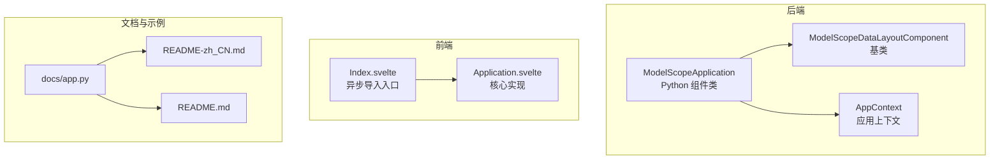
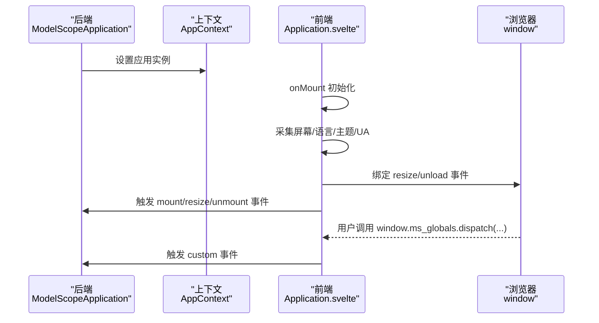
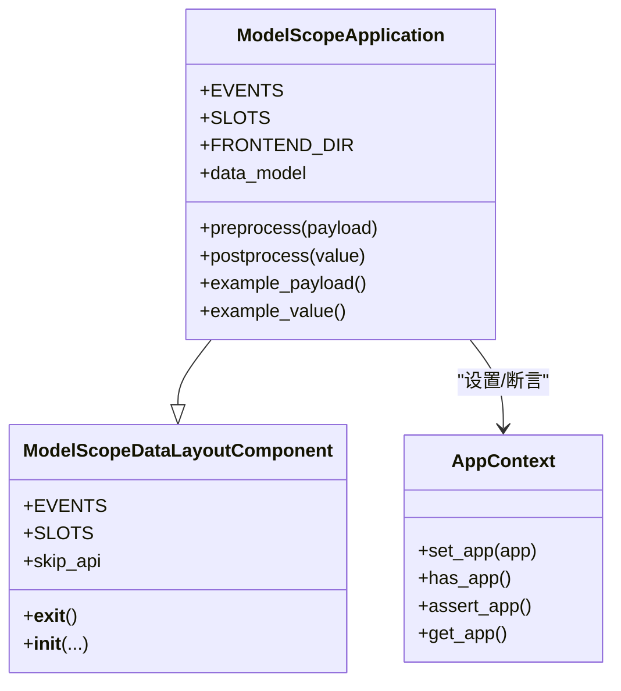
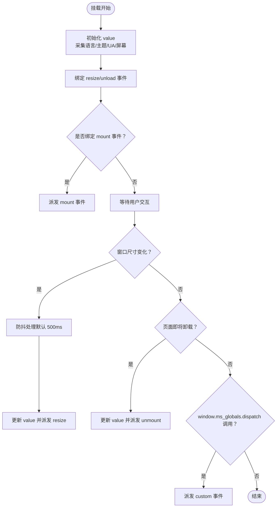
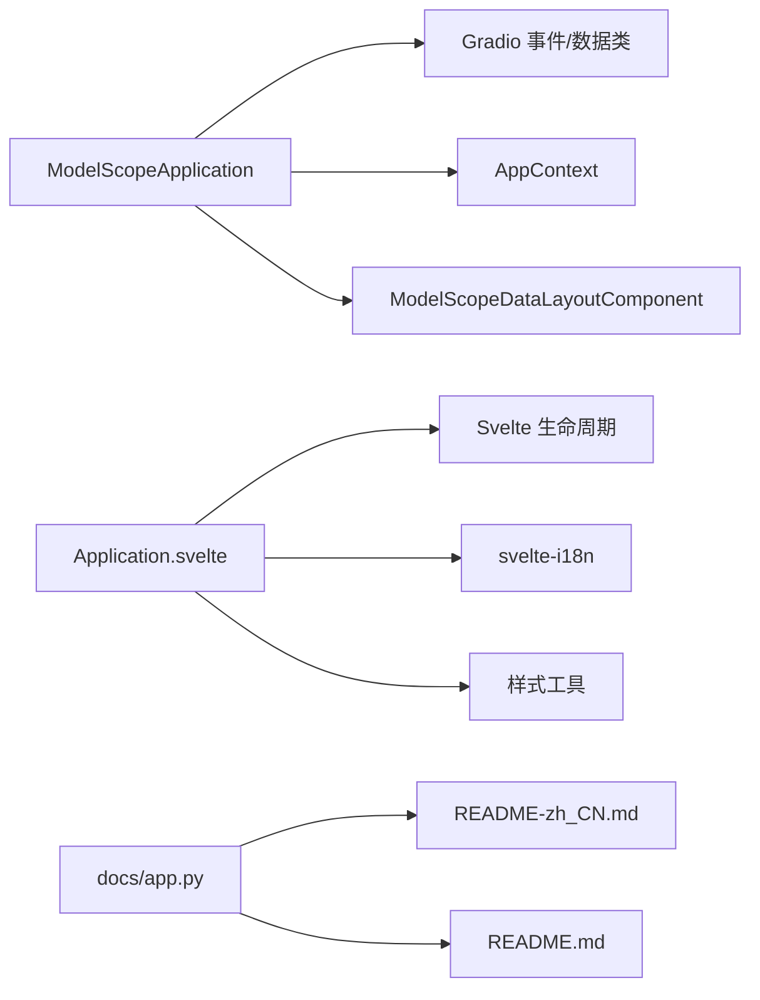

# Application 组件

<cite>
**本文引用的文件**
- [backend/modelscope_studio/components/base/application/__init__.py](file://backend/modelscope_studio/components/base/application/__init__.py)
- [frontend/base/application/Application.svelte](file://frontend/base/application/Application.svelte)
- [frontend/base/application/Index.svelte](file://frontend/base/application/Index.svelte)
- [backend/modelscope_studio/utils/dev/app_context.py](file://backend/modelscope_studio/utils/dev/app_context.py)
- [backend/modelscope_studio/utils/dev/component.py](file://backend/modelscope_studio/utils/dev/component.py)
- [docs/components/base/application/README-zh_CN.md](file://docs/components/base/application/README-zh_CN.md)
- [docs/components/base/application/README.md](file://docs/components/base/application/README.md)
- [docs/app.py](file://docs/app.py)
- [backend/modelscope_studio/version.py](file://backend/modelscope_studio/version.py)
</cite>

## 目录

1. [简介](#简介)
2. [项目结构](#项目结构)
3. [核心组件](#核心组件)
4. [架构总览](#架构总览)
5. [详细组件分析](#详细组件分析)
6. [依赖关系分析](#依赖关系分析)
7. [性能考量](#性能考量)
8. [故障排除指南](#故障排除指南)
9. [结论](#结论)
10. [附录](#附录)

## 简介

Application 组件是 modelscope-studio 的应用根容器，负责承载并统一管理所有从 modelscope_studio 导出的组件与依赖。它不仅为应用提供基础运行环境，还通过生命周期事件与浏览器环境信息收集能力，帮助开发者实现页面行为监听、主题与语言适配、以及自定义事件桥接等关键功能。

- 作为应用根容器：确保所有 modelscope_studio 组件被正确包裹，否则页面可能无法成功预览。
- 生命周期与环境感知：提供页面挂载、窗口大小变化、页面卸载等事件；可获取语言、主题、UA、屏幕尺寸与滚动位置等信息。
- 自定义事件桥接：通过 window.ms_globals.dispatch 在前端触发自定义事件，Python 端可通过 ms.Application.custom 事件接收。

章节来源

- [docs/components/base/application/README-zh_CN.md:1-11](file://docs/components/base/application/README-zh_CN.md#L1-L11)
- [docs/components/base/application/README.md:1-11](file://docs/components/base/application/README.md#L1-L11)

## 项目结构

Application 组件由后端 Python 组件类与前端 Svelte 实现共同构成，并通过工具模块提供上下文与基类支持。文档与示例位于 docs 目录中，用于演示与说明。



图表来源

- [backend/modelscope_studio/components/base/application/**init**.py:26-115](file://backend/modelscope_studio/components/base/application/__init__.py#L26-L115)
- [frontend/base/application/Index.svelte:1-17](file://frontend/base/application/Index.svelte#L1-L17)
- [frontend/base/application/Application.svelte:1-149](file://frontend/base/application/Application.svelte#L1-L149)
- [backend/modelscope_studio/utils/dev/app_context.py:4-25](file://backend/modelscope_studio/utils/dev/app_context.py#L4-L25)
- [backend/modelscope_studio/utils/dev/component.py:101-169](file://backend/modelscope_studio/utils/dev/component.py#L101-L169)
- [docs/components/base/application/README-zh_CN.md:1-56](file://docs/components/base/application/README-zh_CN.md#L1-L56)
- [docs/components/base/application/README.md:1-56](file://docs/components/base/application/README.md#L1-L56)
- [docs/app.py:1-595](file://docs/app.py#L1-L595)

章节来源

- [backend/modelscope_studio/components/base/application/**init**.py:26-115](file://backend/modelscope_studio/components/base/application/__init__.py#L26-L115)
- [frontend/base/application/Index.svelte:1-17](file://frontend/base/application/Index.svelte#L1-L17)
- [frontend/base/application/Application.svelte:1-149](file://frontend/base/application/Application.svelte#L1-L149)
- [backend/modelscope_studio/utils/dev/app_context.py:4-25](file://backend/modelscope_studio/utils/dev/app_context.py#L4-L25)
- [backend/modelscope_studio/utils/dev/component.py:101-169](file://backend/modelscope_studio/utils/dev/component.py#L101-L169)
- [docs/components/base/application/README-zh_CN.md:1-56](file://docs/components/base/application/README-zh_CN.md#L1-L56)
- [docs/components/base/application/README.md:1-56](file://docs/components/base/application/README.md#L1-L56)
- [docs/app.py:1-595](file://docs/app.py#L1-L595)

## 核心组件

- 后端组件类：ModelScopeApplication 继承自 ModelScopeDataLayoutComponent，提供事件注册、数据模型、示例数据与前端目录解析等能力。
- 前端实现：Application.svelte 负责在挂载时初始化页面数据，绑定 resize/unload 事件，暴露 window.ms_globals.dispatch 以供自定义事件桥接。
- 上下文与基类：AppContext 提供应用实例的设置与断言；ModelScopeDataLayoutComponent 提供布局上下文与内部状态管理。

章节来源

- [backend/modelscope_studio/components/base/application/**init**.py:26-115](file://backend/modelscope_studio/components/base/application/__init__.py#L26-L115)
- [frontend/base/application/Application.svelte:1-149](file://frontend/base/application/Application.svelte#L1-L149)
- [backend/modelscope_studio/utils/dev/app_context.py:4-25](file://backend/modelscope_studio/utils/dev/app_context.py#L4-L25)
- [backend/modelscope_studio/utils/dev/component.py:101-169](file://backend/modelscope_studio/utils/dev/component.py#L101-L169)

## 架构总览

Application 组件的运行流程如下：后端组件类在初始化时记录应用实例，前端在挂载阶段采集环境数据并绑定事件，同时提供自定义事件桥接通道。



图表来源

- [backend/modelscope_studio/components/base/application/**init**.py:72-82](file://backend/modelscope_studio/components/base/application/__init__.py#L72-L82)
- [frontend/base/application/Application.svelte:87-129](file://frontend/base/application/Application.svelte#L87-L129)

章节来源

- [backend/modelscope_studio/components/base/application/**init**.py:72-82](file://backend/modelscope_studio/components/base/application/__init__.py#L72-L82)
- [frontend/base/application/Application.svelte:87-129](file://frontend/base/application/Application.svelte#L87-L129)

## 详细组件分析

### 后端组件类：ModelScopeApplication

- 设计理念
  - 作为应用根容器，统一注入应用上下文，确保后续组件均依赖于已存在的 Application 实例。
  - 通过 Gradio 事件系统注册 mount/resized/unmount/custom 等事件监听器，便于前后端联动。
  - 使用 ApplicationPageData 作为数据模型，承载屏幕、语言、主题、UA 等环境信息。
- 关键特性
  - 事件注册：EVENTS 定义了四个事件监听器，分别对应页面生命周期与自定义事件。
  - 数据模型：data_model 指向 ApplicationPageData，示例数据 example_payload/example_value 提供默认值。
  - 前端目录：FRONTEND_DIR 通过 resolve_frontend_dir 解析到 base/application 前端实现。
- 生命周期与上下文
  - **init** 中设置 AppContext，随后调用父类构造，保证组件树构建时上下文可用。
  - preprocess/postprocess 保持数据原样传递，便于前端直接消费。



图表来源

- [backend/modelscope_studio/components/base/application/**init**.py:26-115](file://backend/modelscope_studio/components/base/application/__init__.py#L26-L115)
- [backend/modelscope_studio/utils/dev/component.py:101-169](file://backend/modelscope_studio/utils/dev/component.py#L101-L169)
- [backend/modelscope_studio/utils/dev/app_context.py:4-25](file://backend/modelscope_studio/utils/dev/app_context.py#L4-L25)

章节来源

- [backend/modelscope_studio/components/base/application/**init**.py:26-115](file://backend/modelscope_studio/components/base/application/__init__.py#L26-L115)
- [backend/modelscope_studio/utils/dev/component.py:101-169](file://backend/modelscope_studio/utils/dev/component.py#L101-L169)
- [backend/modelscope_studio/utils/dev/app_context.py:4-25](file://backend/modelscope_studio/utils/dev/app_context.py#L4-L25)

### 前端实现：Application.svelte

- 功能要点
  - onMount 初始化：更新 value 并派发 mount 事件；随后绑定 resize 与 beforeunload 事件。
  - resize 事件：使用防抖（默认 500ms）更新 value 并派发 resize 事件，避免高频重绘。
  - beforeunload：在页面卸载前更新 value 并派发 unmount 事件。
  - 自定义事件：window.ms_globals.dispatch(...) 将参数数组转发为 custom 事件。
  - 可见性与样式：根据 visible 控制渲染，elem_id/elem_classes/elem_style 支持外部样式注入。
- 数据模型
  - ApplicationPageData 包含 language、userAgent、theme、screen（width/height/scrollX/scrollY）。
- 事件模型
  - mount/resized/unmount/custom 四类事件，分别对应页面生命周期与自定义事件。



图表来源

- [frontend/base/application/Application.svelte:87-129](file://frontend/base/application/Application.svelte#L87-L129)

章节来源

- [frontend/base/application/Application.svelte:1-149](file://frontend/base/application/Application.svelte#L1-L149)

### 入口包装：Index.svelte

- 作用：通过异步导入 Application.svelte，延迟加载组件，减少首屏负担。
- 渲染：将 children 透传给 Application 组件，保证内容渲染。

章节来源

- [frontend/base/application/Index.svelte:1-17](file://frontend/base/application/Index.svelte#L1-L17)

### 上下文与基类支撑

- AppContext
  - set_app：在后端初始化时设置当前应用实例。
  - assert_app：若未设置则发出警告，提示忘记引入 Application。
  - get_app：获取当前应用实例。
- ModelScopeDataLayoutComponent
  - 提供布局上下文与内部状态（\_internal），确保组件树结构正确。
  - 继承 Gradio 组件元类，支持事件与数据流。

章节来源

- [backend/modelscope_studio/utils/dev/app_context.py:4-25](file://backend/modelscope_studio/utils/dev/app_context.py#L4-L25)
- [backend/modelscope_studio/utils/dev/component.py:101-169](file://backend/modelscope_studio/utils/dev/component.py#L101-L169)

### 使用示例与场景

- 基本用法：将 modelscope_studio 所有组件包裹在 Application 内，确保预览与交互正常。
- 语言适配：通过 value.language 获取用户语言，动态切换文案或格式化。
- 主题适配：通过 value.theme 返回不同权重内容或样式。
- 自定义事件：在任意 JS 逻辑中调用 window.ms_globals.dispatch(...)，在 Python 端通过 ms.Application.custom 接收。

**Python 代码示例**

```python
import gradio as gr
import modelscope_studio.components.base as ms
import modelscope_studio.components.antd as antd

# 示例 1：基本包裹用法
with gr.Blocks() as demo:
    with ms.Application():
        with antd.ConfigProvider():
            with ms.AutoLoading():
                antd.Button("Hello ModelScope Studio")

demo.launch()
```

```python
import gradio as gr
import modelscope_studio.components.base as ms
import modelscope_studio.components.antd as antd

# 示例 2：监听页面挂载事件与语言/主题适配
with gr.Blocks() as demo:
    with ms.Application() as app:
        with antd.ConfigProvider():
            output = gr.Textbox(label="页面信息")

    @app.mount
    def on_mount(data: ms.ApplicationData):
        # 获取用户语言和主题
        lang = data.value.language
        theme = data.value.theme
        return gr.update(value=f"语言: {lang}, 主题: {theme}")

demo.launch()
```

```python
import gradio as gr
import modelscope_studio.components.base as ms
import modelscope_studio.components.antd as antd

# 示例 3：监听自定义事件（结合 window.ms_globals.dispatch）
with gr.Blocks() as demo:
    with ms.Application() as app:
        with antd.ConfigProvider():
            output = gr.Textbox(label="自定义事件")
            # 前端可通过 window.ms_globals.dispatch({type: 'my_event', payload: {...}}) 触发

    @app.custom
    def on_custom(data: ms.ApplicationData):
        event_type = data.value.type if data.value else None
        return gr.update(value=f"收到自定义事件: {event_type}")

demo.launch()
```

章节来源

- [docs/components/base/application/README-zh_CN.md:12-20](file://docs/components/base/application/README-zh_CN.md#L12-L20)
- [docs/components/base/application/README.md:12-20](file://docs/components/base/application/README.md#L12-L20)

### API 与类型说明

- 属性
  - value：ApplicationPageData，页面数据。
- 事件
  - mount：页面挂载时触发。
  - resize：窗口尺寸变化时触发。
  - unmount：页面卸载时触发。
  - custom：通过 window.ms_globals.dispatch(...) 触发。
- 类型
  - ApplicationPageScreenData：width、height、scrollX、scrollY。
  - ApplicationPageData：screen、language、theme、userAgent。

章节来源

- [docs/components/base/application/README-zh_CN.md:24-55](file://docs/components/base/application/README-zh_CN.md#L24-L55)
- [docs/components/base/application/README.md:24-55](file://docs/components/base/application/README.md#L24-L55)
- [backend/modelscope_studio/components/base/application/**init**.py:12-115](file://backend/modelscope_studio/components/base/application/__init__.py#L12-L115)

## 依赖关系分析

- 后端依赖
  - Gradio 数据类与事件系统：用于事件监听器注册与数据模型。
  - 工具模块：AppContext、ModelScopeDataLayoutComponent 提供上下文与基类能力。
- 前端依赖
  - Svelte 生命周期钩子：onMount/onDestroy。
  - svelte-i18n：获取本地化语言。
  - 样式工具：styleObject2String、classnames。
- 文档与示例
  - docs/app.py 构建站点菜单与文档索引，定位 Application 组件文档。



图表来源

- [backend/modelscope_studio/components/base/application/**init**.py:5-9](file://backend/modelscope_studio/components/base/application/__init__.py#L5-L9)
- [frontend/base/application/Application.svelte:1-149](file://frontend/base/application/Application.svelte#L1-L149)
- [docs/app.py:1-595](file://docs/app.py#L1-L595)

章节来源

- [backend/modelscope_studio/components/base/application/**init**.py:5-9](file://backend/modelscope_studio/components/base/application/__init__.py#L5-L9)
- [frontend/base/application/Application.svelte:1-149](file://frontend/base/application/Application.svelte#L1-L149)
- [docs/app.py:1-595](file://docs/app.py#L1-L595)

## 性能考量

- 防抖策略：resize 事件默认使用 500ms 防抖，降低频繁重排与事件风暴风险。
- 延迟加载：Index.svelte 采用异步导入，减少首屏资源压力。
- 事件绑定：仅在需要时派发事件（bind\_\*\_event 或 attached_events 包含对应事件名），避免无谓的事件分发。
- 样式与可见性：通过 visible 控制渲染，elem_style 支持字符串与对象两种形式，便于按需注入。

章节来源

- [frontend/base/application/Application.svelte:96-103](file://frontend/base/application/Application.svelte#L96-L103)
- [frontend/base/application/Index.svelte:5-7](file://frontend/base/application/Index.svelte#L5-L7)

## 故障排除指南

- 页面无法预览
  - 现象：未包裹 Application 导致组件无法正常渲染。
  - 处理：确保所有 modelscope_studio 组件均被 Application 包裹。
- 未检测到 Application 实例
  - 现象：控制台出现警告，提示未找到 Application 组件。
  - 处理：检查是否从 modelscope_studio.components.base 正确导入并初始化 Application。
- 事件未触发
  - 现象：resize/mount/unmount/custom 事件未按预期触发。
  - 处理：确认前端已绑定对应事件（bind\_\*\_event 或 attached_events 包含事件名）；自定义事件需通过 window.ms_globals.dispatch(...) 触发。
- 语言/主题不生效
  - 现象：语言或主题未按用户环境变化。
  - 处理：确保前端正确读取 navigator 与共享主题；必要时在 Python 端根据 value.language/value.theme 做分支处理。

章节来源

- [docs/components/base/application/README-zh_CN.md:3-11](file://docs/components/base/application/README-zh_CN.md#L3-L11)
- [docs/components/base/application/README.md:3-11](file://docs/components/base/application/README.md#L3-L11)
- [backend/modelscope_studio/utils/dev/app_context.py:16-21](file://backend/modelscope_studio/utils/dev/app_context.py#L16-L21)
- [frontend/base/application/Application.svelte:91-115](file://frontend/base/application/Application.svelte#L91-L115)

## 结论

Application 组件作为 modelscope-studio 的应用根容器，承担着上下文注入、生命周期事件与环境信息采集的关键职责。通过后端组件类与前端实现的协同，它为整个应用提供了稳定的基础运行环境，并支持灵活的主题/语言适配与自定义事件桥接。遵循本文的最佳实践与故障排除建议，可有效提升开发效率与运行稳定性。

## 附录

- 版本信息：v2.0.0
- 相关文档：Application 组件的中文与英文说明文档，包含示例与 API 说明。

章节来源

- [backend/modelscope_studio/version.py:1-2](file://backend/modelscope_studio/version.py#L1-L2)
- [docs/components/base/application/README-zh_CN.md:1-56](file://docs/components/base/application/README-zh_CN.md#L1-L56)
- [docs/components/base/application/README.md:1-56](file://docs/components/base/application/README.md#L1-L56)
