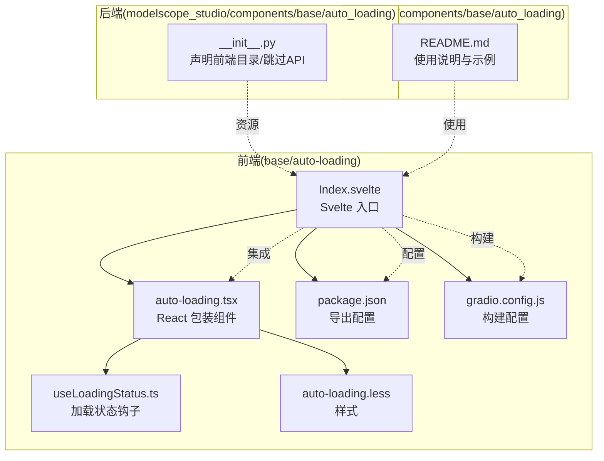
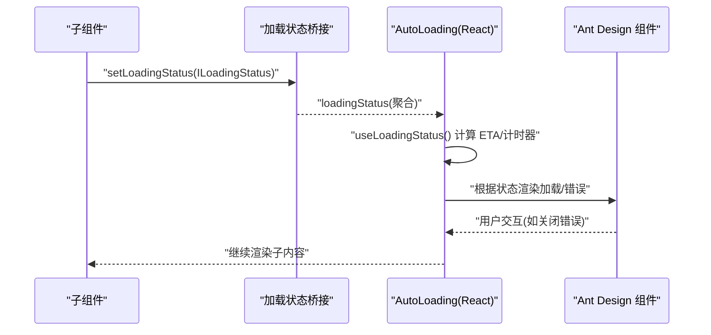
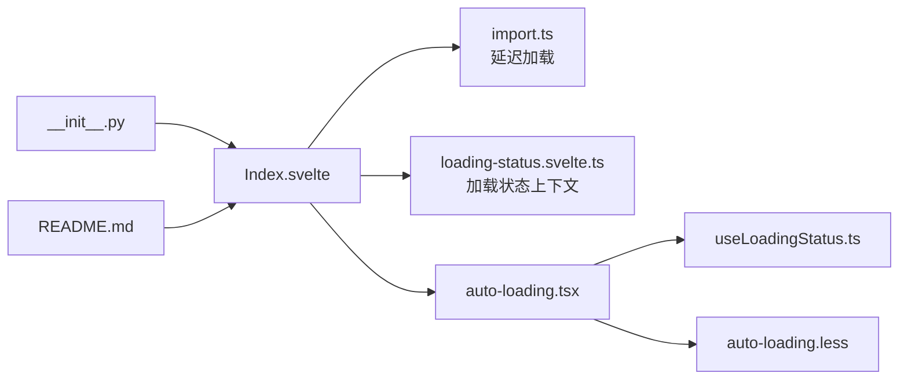

# AutoLoading 组件

<cite>
**本文引用的文件**
- [auto-loading.tsx](file://frontend/base/auto-loading/auto-loading.tsx)
- [Index.svelte](file://frontend/base/auto-loading/Index.svelte)
- [useLoadingStatus.ts](file://frontend/base/auto-loading/useLoadingStatus.ts)
- [auto-loading.less](file://frontend/base/auto-loading/auto-loading.less)
- [package.json](file://frontend/base/auto-loading/package.json)
- [gradio.config.js](file://frontend/base/auto-loading/gradio.config.js)
- [__init__.py](file://backend/modelscope_studio/components/base/auto_loading/__init__.py)
- [loading-status.svelte.ts](file://frontend/svelte-preprocess-react/svelte-contexts/loading-status.svelte.ts)
- [import.ts](file://frontend/svelte-preprocess-react/component/import.ts)
- [README.md](file://docs/components/base/auto_loading/README.md)
</cite>

## 目录

1. [简介](#简介)
2. [项目结构](#项目结构)
3. [核心组件](#核心组件)
4. [架构总览](#架构总览)
5. [详细组件分析](#详细组件分析)
6. [依赖关系分析](#依赖关系分析)
7. [性能考量](#性能考量)
8. [故障排除指南](#故障排除指南)
9. [结论](#结论)
10. [附录](#附录)

## 简介

AutoLoading 组件用于在 Gradio 前端向后端发起请求时，自动为被包裹的内容添加加载反馈与错误提示。它会自动收集子组件的加载状态，并在合适的时机显示加载动画或错误信息，从而提升用户体验。该组件支持自定义渲染插槽、遮罩层、计时器显示以及多种配置项，适用于全局兜底与局部精细控制。

## 项目结构

AutoLoading 的前端实现位于 base 组件目录中，包含 Svelte 入口、React 包装组件、状态钩子与样式文件；后端 Python 组件负责声明前端资源路径与跳过 API 调用。文档中提供了组件说明与示例入口。

**图表来源**

- [Index.svelte:1-81](file://frontend/base/auto-loading/Index.svelte#L1-L81)
- [auto-loading.tsx:1-179](file://frontend/base/auto-loading/auto-loading.tsx#L1-L179)
- [useLoadingStatus.ts:1-94](file://frontend/base/auto-loading/useLoadingStatus.ts#L1-L94)
- [auto-loading.less:1-28](file://frontend/base/auto-loading/auto-loading.less#L1-L28)
- [package.json:1-15](file://frontend/base/auto-loading/package.json#L1-L15)
- [gradio.config.js:1-4](file://frontend/base/auto-loading/gradio.config.js#L1-L4)
- [**init**.py:47-64](file://backend/modelscope_studio/components/base/auto_loading/__init__.py#L47-L64)
- [README.md:1-36](file://docs/components/base/auto_loading/README.md#L1-L36)

**章节来源**

- [Index.svelte:1-81](file://frontend/base/auto-loading/Index.svelte#L1-L81)
- [auto-loading.tsx:1-179](file://frontend/base/auto-loading/auto-loading.tsx#L1-L179)
- [useLoadingStatus.ts:1-94](file://frontend/base/auto-loading/useLoadingStatus.ts#L1-L94)
- [auto-loading.less:1-28](file://frontend/base/auto-loading/auto-loading.less#L1-L28)
- [package.json:1-15](file://frontend/base/auto-loading/package.json#L1-L15)
- [gradio.config.js:1-4](file://frontend/base/auto-loading/gradio.config.js#L1-L4)
- [**init**.py:47-64](file://backend/modelscope_studio/components/base/auto_loading/__init__.py#L47-L64)
- [README.md:1-36](file://docs/components/base/auto_loading/README.md#L1-L36)

## 核心组件

- Svelte 入口（Index.svelte）：负责解析属性、获取配置类型与插槽、注入加载状态上下文，并按需渲染 React 包装组件。
- React 包装组件（auto-loading.tsx）：根据加载状态决定是否显示加载动画、遮罩、计时器与队列信息；在错误状态下显示可关闭的错误提示。
- 加载状态钩子（useLoadingStatus.ts）：维护计时器、ETA 与格式化时间，基于 ILoadingStatus 推导展示数据。
- 样式（auto-loading.less）：控制加载层定位、遮罩层级与错误弹层居中样式。
- 后端组件（**init**.py）：声明前端目录、跳过 API 调用，便于直接通过前端资源使用。
- 文档（README.md）：说明组件作用、状态含义、默认行为与示例入口。

**章节来源**

- [Index.svelte:1-81](file://frontend/base/auto-loading/Index.svelte#L1-L81)
- [auto-loading.tsx:25-176](file://frontend/base/auto-loading/auto-loading.tsx#L25-L176)
- [useLoadingStatus.ts:5-93](file://frontend/base/auto-loading/useLoadingStatus.ts#L5-L93)
- [auto-loading.less:1-28](file://frontend/base/auto-loading/auto-loading.less#L1-L28)
- [**init**.py:47-64](file://backend/modelscope_studio/components/base/auto_loading/__init__.py#L47-L64)
- [README.md:1-36](file://docs/components/base/auto_loading/README.md#L1-L36)

## 架构总览

AutoLoading 的工作流围绕“状态收集—条件渲染—UI 展示”展开。Svelte 入口通过上下文收集各子组件的 ILoadingStatus，React 组件根据状态选择加载动画或错误提示，并通过 Ant Design 组件呈现。

**图表来源**

- [loading-status.svelte.ts:47-75](file://frontend/svelte-preprocess-react/svelte-contexts/loading-status.svelte.ts#L47-L75)
- [auto-loading.tsx:48-175](file://frontend/base/auto-loading/auto-loading.tsx#L48-L175)
- [useLoadingStatus.ts:17-81](file://frontend/base/auto-loading/useLoadingStatus.ts#L17-L81)

## 详细组件分析

### Svelte 入口（Index.svelte）

- 负责从预处理上下文中获取组件属性、配置类型与插槽。
- 通过 getLoadingStatus 注入生成的 loadingStatus 上下文，供内部 React 组件消费。
- 使用 importComponent 实现延迟加载，确保全局初始化完成后再加载组件。
- 将可见性、样式、类名等属性透传给 React 包装组件。

关键点

- 按需渲染：仅当 visible 为真时才渲染。
- 插槽与配置：slots、configType、loadingStatus 作为 props 传递。
- 生成键值：通过 window.ms_globals.loadingKey 为每个加载状态分配唯一键。

**章节来源**

- [Index.svelte:1-81](file://frontend/base/auto-loading/Index.svelte#L1-L81)
- [import.ts:1-20](file://frontend/svelte-preprocess-react/component/import.ts#L1-L20)
- [loading-status.svelte.ts:47-75](file://frontend/svelte-preprocess-react/svelte-contexts/loading-status.svelte.ts#L47-L75)

### React 包装组件（auto-loading.tsx）

职责

- 解析配置类型（当前支持 antd），决定加载动画与错误提示的 UI。
- 根据状态渲染加载动画（含遮罩、计时器、进度/队列信息）。
- 在错误状态下渲染可关闭的错误提示，并在关闭后清空实例以避免重复渲染。
- 支持自定义插槽：render（自定义加载内容）、errorRender（自定义错误内容）、loadingText（自定义加载文案）。

加载状态判断

- pending/generating 视为加载中；completed/error 视为结束。
- 当存在 progress 或 queue_position/queue_size 时，动态展示进度与队列信息。
- 可选显示计时器与 ETA。

样式与层级

- 加载层绝对定位并覆盖父容器，错误提示固定居中显示。
- 根据主题 token 设置 z-index，保证遮罩与错误提示层级合理。

**章节来源**

- [auto-loading.tsx:25-176](file://frontend/base/auto-loading/auto-loading.tsx#L25-L176)
- [auto-loading.less:1-28](file://frontend/base/auto-loading/auto-loading.less#L1-L28)

### 加载状态钩子（useLoadingStatus.ts）

功能

- 维护计时器：在 pending 状态开始计时，在非 pending 状态停止。
- 计算 ETA 与格式化时间：结合 performance.now 与 ETA 字段计算剩余时间与已耗时。
- 追踪旧 ETA：当 ETA 更新时，记录旧值并格式化新 ETA。
- 返回状态字段：status、message、progress、queuePosition、queueSize、formattedEta、formattedTimer。

性能注意

- 使用 requestAnimationFrame 循环更新计时，避免阻塞主线程。
- 使用 useMemoizedFn 缓存回调，减少重渲染。

**章节来源**

- [useLoadingStatus.ts:5-93](file://frontend/base/auto-loading/useLoadingStatus.ts#L5-L93)

### 样式（auto-loading.less）

要点

- 加载层绝对定位，覆盖父容器，确保遮罩效果。
- 错误提示固定定位并居中，避免布局抖动。
- 通过 Ant Design 类名与主题 token 控制层级与外观。

**章节来源**

- [auto-loading.less:1-28](file://frontend/base/auto-loading/auto-loading.less#L1-L28)

### 后端组件（**init**.py）

要点

- 声明前端目录为 base/auto-loading。
- 跳过 API 调用，组件仅用于前端渲染与状态收集。

**章节来源**

- [**init**.py:47-64](file://backend/modelscope_studio/components/base/auto_loading/__init__.py#L47-L64)

### 文档（README.md）

要点

- 组件作用：自动为被包裹内容添加加载动画与错误提示。
- 状态说明：pending/generating/completed/error 四种状态。
- 默认行为：pending 开始加载；generating/.completed 结束；error 显示错误（可配置）。
- API 参数：generating、show_error、show_mask、show_timer、loading_text 等。

**章节来源**

- [README.md:1-36](file://docs/components/base/auto_loading/README.md#L1-L36)

## 依赖关系分析

AutoLoading 的依赖主要体现在以下方面：

- Svelte 入口依赖加载状态上下文与导入工具，实现延迟加载与状态聚合。
- React 组件依赖 Ant Design 的 Spin 与 Alert，以及主题 token。
- useLoadingStatus 依赖浏览器性能接口与 React hooks，实现计时与状态格式化。
- 后端组件声明前端资源路径，使前端组件可通过包导出正确加载。

**图表来源**

- [Index.svelte:1-81](file://frontend/base/auto-loading/Index.svelte#L1-L81)
- [import.ts:1-20](file://frontend/svelte-preprocess-react/component/import.ts#L1-L20)
- [loading-status.svelte.ts:1-75](file://frontend/svelte-preprocess-react/svelte-contexts/loading-status.svelte.ts#L1-L75)
- [auto-loading.tsx:1-179](file://frontend/base/auto-loading/auto-loading.tsx#L1-L179)
- [useLoadingStatus.ts:1-94](file://frontend/base/auto-loading/useLoadingStatus.ts#L1-L94)
- [auto-loading.less:1-28](file://frontend/base/auto-loading/auto-loading.less#L1-L28)
- [**init**.py:47-64](file://backend/modelscope_studio/components/base/auto_loading/__init__.py#L47-L64)
- [README.md:1-36](file://docs/components/base/auto_loading/README.md#L1-L36)

**章节来源**

- [Index.svelte:1-81](file://frontend/base/auto-loading/Index.svelte#L1-L81)
- [auto-loading.tsx:1-179](file://frontend/base/auto-loading/auto-loading.tsx#L1-L179)
- [useLoadingStatus.ts:1-94](file://frontend/base/auto-loading/useLoadingStatus.ts#L1-L94)
- [auto-loading.less:1-28](file://frontend/base/auto-loading/auto-loading.less#L1-L28)
- [**init**.py:47-64](file://backend/modelscope_studio/components/base/auto_loading/__init__.py#L47-L64)
- [README.md:1-36](file://docs/components/base/auto_loading/README.md#L1-L36)

## 性能考量

- 延迟初始化：通过 importComponent 与全局初始化 Promise，避免在未就绪时加载组件，降低首屏压力。
- 计时器优化：使用 requestAnimationFrame 循环更新计时，减少主线程占用；仅在 pending 状态启动计时。
- 状态聚合：仅最内层 AutoLoading 收集子组件状态，避免重复渲染与状态冲突。
- 样式层级：通过 z-index 与绝对定位，确保遮罩与错误提示不会引发布局回流。
- 自定义渲染：通过 render 与 errorRender 插槽，允许业务方自行优化加载与错误 UI，减少不必要的组件开销。

[本节为通用性能建议，不直接分析具体文件，故无“章节来源”]

## 故障排除指南

常见问题与解决思路

- 多层嵌套 AutoLoading：根据文档说明，仅最内层可收集子组件状态并显示加载动画。若外层不生效，请检查嵌套层级。
- 错误提示不消失：错误提示为可关闭组件，关闭后会清空内部实例。若仍显示，请确认是否手动覆盖了关闭逻辑或样式导致视觉残留。
- 加载动画不出现：确认 loadingStatus 是否进入 pending/generating 状态；检查 generating/show_error 配置是否符合预期。
- 计时器不更新：pending 状态才会启动计时；若长时间无 pending 状态，计时器不会启动。
- 遮罩层级异常：样式通过主题 token 控制层级，若自定义样式覆盖了 z-index，请检查样式优先级。

**章节来源**

- [README.md:5-19](file://docs/components/base/auto_loading/README.md#L5-L19)
- [auto-loading.tsx:139-166](file://frontend/base/auto-loading/auto-loading.tsx#L139-L166)
- [useLoadingStatus.ts:44-50](file://frontend/base/auto-loading/useLoadingStatus.ts#L44-L50)

## 结论

AutoLoading 通过“状态收集—条件渲染—UI 展示”的机制，为 Gradio 应用提供了统一且可定制的加载与错误反馈能力。其延迟初始化与计时器优化有助于提升性能与体验；插槽与配置项则满足多样化的业务需求。配合文档与示例，可在全局与局部场景中灵活使用。

[本节为总结性内容，不直接分析具体文件，故无“章节来源”]

## 附录

### API 定义（参数与行为）

- generating：是否纳入 generating 状态的处理。
- show_error：是否显示错误信息。
- show_mask：是否显示遮罩。
- show_timer：是否显示计时器。
- loading_text：自定义加载文案，为空时使用 Gradio 提供的默认文案（含耗时、队列位置等）。

默认行为

- pending：显示加载动画。
- generating/completed：结束加载动画。
- error：结束加载动画；可选显示错误信息。

**章节来源**

- [README.md:27-36](file://docs/components/base/auto_loading/README.md#L27-L36)
- [auto-loading.tsx:65-138](file://frontend/base/auto-loading/auto-loading.tsx#L65-L138)

### 使用示例（场景与建议）

- 全局兜底：在应用根部放置一个 AutoLoading，确保任何请求都会得到加载反馈。
- 局部精细控制：在需要更丰富加载信息的区域单独使用，结合 render 与 loadingText 插槽自定义展示。
- 错误显隐：通过 show_error 控制错误信息是否展示；必要时使用 errorRender 自定义错误 UI。
- 队列与进度：当后端使用 yield 流式返回时，可利用 progress 与队列信息增强用户感知。

**章节来源**

- [README.md:21-25](file://docs/components/base/auto_loading/README.md#L21-L25)
- [auto-loading.tsx:72-138](file://frontend/base/auto-loading/auto-loading.tsx#L72-L138)

### 与其他组件的协作模式

- 与表单/列表等组件协作：在这些组件内部使用 AutoLoading，可获得一致的加载与错误反馈。
- 与主题系统协作：通过 Ant Design 主题 token 控制遮罩与错误提示的层级与外观。
- 与状态上下文协作：通过加载状态上下文，多个子组件的状态会被聚合，由最近的 AutoLoading 决策展示。

**章节来源**

- [Index.svelte:56-62](file://frontend/base/auto-loading/Index.svelte#L56-L62)
- [loading-status.svelte.ts:47-75](file://frontend/svelte-preprocess-react/svelte-contexts/loading-status.svelte.ts#L47-L75)
- [auto-loading.tsx:68-134](file://frontend/base/auto-loading/auto-loading.tsx#L68-L134)
