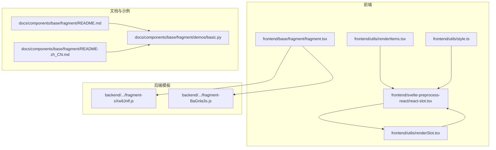
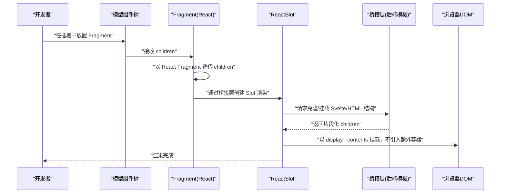
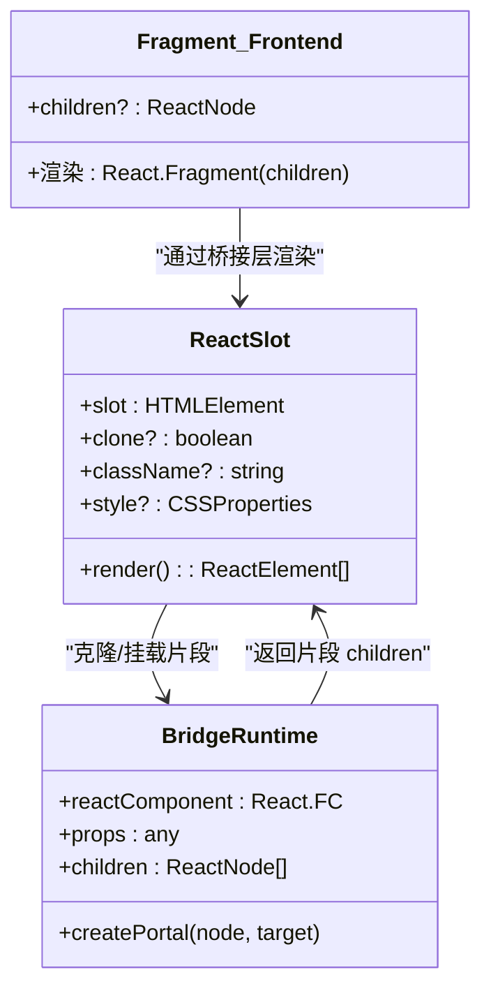
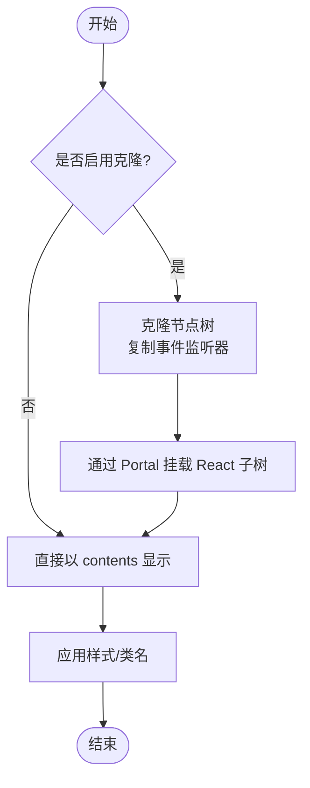
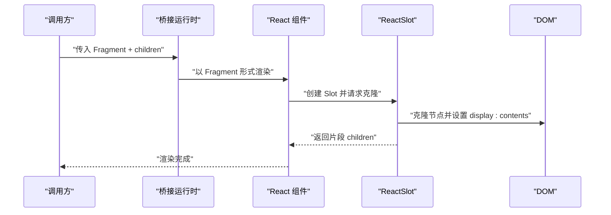
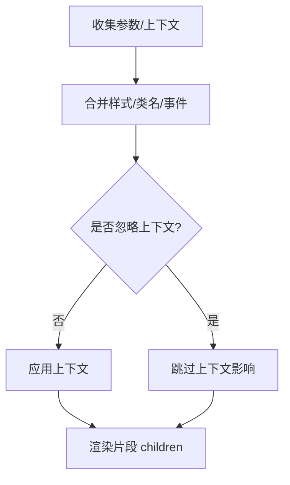
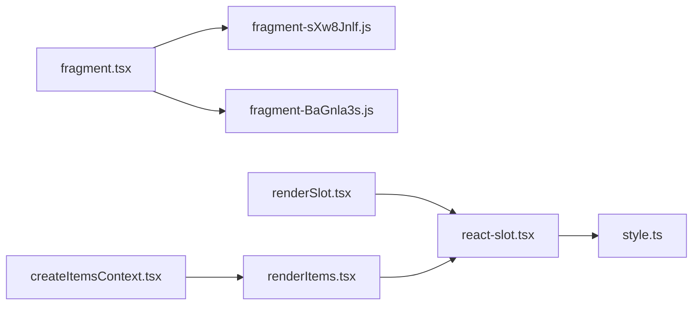

# Fragment 组件

<cite>
**本文引用的文件**
- [frontend/base/fragment/fragment.tsx](file://frontend/base/fragment/fragment.tsx)
- [backend/modelscope_studio/components/base/fragment/templates/component/fragment-sXw8Jnlf.js](file://backend/modelscope_studio/components/base/fragment/templates/component/fragment-sXw8Jnlf.js)
- [backend/modelscope_studio/components/base/each/templates/component/fragment-BaGnla3s.js](file://backend/modelscope_studio/components/base/each/templates/component/fragment-BaGnla3s.js)
- [docs/components/base/fragment/README.md](file://docs/components/base/fragment/README.md)
- [docs/components/base/fragment/README-zh_CN.md](file://docs/components/base/fragment/README-zh_CN.md)
- [docs/components/base/fragment/demos/basic.py](file://docs/components/base/fragment/demos/basic.py)
- [frontend/svelte-preprocess-react/react-slot.tsx](file://frontend/svelte-preprocess-react/react-slot.tsx)
- [frontend/utils/renderSlot.tsx](file://frontend/utils/renderSlot.tsx)
- [frontend/utils/renderItems.tsx](file://frontend/utils/renderItems.tsx)
- [frontend/utils/createItemsContext.tsx](file://frontend/utils/createItemsContext.tsx)
- [frontend/utils/style.ts](file://frontend/utils/style.ts)
</cite>

## 目录

1. [简介](#简介)
2. [项目结构](#项目结构)
3. [核心组件](#核心组件)
4. [架构总览](#架构总览)
5. [详细组件分析](#详细组件分析)
6. [依赖关系分析](#依赖关系分析)
7. [性能考量](#性能考量)
8. [故障排查指南](#故障排查指南)
9. [结论](#结论)
10. [附录](#附录)

## 简介

Fragment 是一个“片段”容器组件，其设计目标是在不引入额外 DOM 节点的前提下，将多个子元素组合为一个整体，以便作为某些只接受模型内部组件的插槽（slot）的可插入内容。它常用于将来自外部生态（如 Gradio 按钮）的组件，包裹成符合模型内部组件规范的形式，从而顺利进入组件树。

- 设计目的：避免在布局上引入多余容器节点，同时保持子节点的逻辑分组与传递。
- 使用场景：当组件插槽仅支持特定生态导出的组件时，将非受支持组件用 Fragment 包裹后传入。
- 优势：减少不必要的 DOM 层级，降低布局开销；保持子节点的直接性与可维护性。

## 项目结构

Fragment 在前端与后端分别有对应的实现与模板，配合 React Slot 机制完成跨框架桥接与渲染。

图表来源

- [frontend/base/fragment/fragment.tsx:1-11](file://frontend/base/fragment/fragment.tsx#L1-L11)
- [backend/modelscope_studio/components/base/fragment/templates/component/fragment-sXw8Jnlf.js:437-445](file://backend/modelscope_studio/components/base/fragment/templates/component/fragment-sXw8Jnlf.js#L437-L445)
- [backend/modelscope_studio/components/base/each/templates/component/fragment-BaGnla3s.js:1-11](file://backend/modelscope_studio/components/base/each/templates/component/fragment-BaGnla3s.js#L1-L11)
- [frontend/svelte-preprocess-react/react-slot.tsx:1-224](file://frontend/svelte-preprocess-react/react-slot.tsx#L1-L224)
- [frontend/utils/renderSlot.tsx:1-29](file://frontend/utils/renderSlot.tsx#L1-L29)
- [frontend/utils/renderItems.tsx:1-114](file://frontend/utils/renderItems.tsx#L1-L114)
- [frontend/utils/style.ts:1-77](file://frontend/utils/style.ts#L1-L77)
- [docs/components/base/fragment/README.md:1-10](file://docs/components/base/fragment/README.md#L1-L10)
- [docs/components/base/fragment/README-zh_CN.md:1-10](file://docs/components/base/fragment/README-zh_CN.md#L1-L10)
- [docs/components/base/fragment/demos/basic.py:1-22](file://docs/components/base/fragment/demos/basic.py#L1-L22)

章节来源

- [frontend/base/fragment/fragment.tsx:1-11](file://frontend/base/fragment/fragment.tsx#L1-L11)
- [backend/modelscope_studio/components/base/fragment/templates/component/fragment-sXw8Jnlf.js:437-445](file://backend/modelscope_studio/components/base/fragment/templates/component/fragment-sXw8Jnlf.js#L437-L445)
- [docs/components/base/fragment/README.md:1-10](file://docs/components/base/fragment/README.md#L1-L10)

## 核心组件

- 前端 Fragment（React 包装）
  - 通过 sveltify 将 Svelte 组件能力桥接到 React 生态，内部以 React Fragment 形式透传 children，不引入额外 DOM。
  - 典型路径：[frontend/base/fragment/fragment.tsx:4-8](file://frontend/base/fragment/fragment.tsx#L4-L8)

- 后端 Fragment（运行时模板）
  - 生成 React Fragment 的运行时包装，供桥接层渲染，确保 children 以片段形式挂载。
  - 典型路径：[backend/modelscope_studio/components/base/fragment/templates/component/fragment-sXw8Jnlf.js:437-441](file://backend/modelscope_studio/components/base/fragment/templates/component/fragment-sXw8Jnlf.js#L437-L441)

- 后端 Each Fragment（Svelte 模板）
  - 面向 Svelte 的 Fragment 实现，便于在 Svelte 场景下复用片段语义。
  - 典型路径：[backend/modelscope_studio/components/base/each/templates/component/fragment-BaGnla3s.js:2-6](file://backend/modelscope_studio/components/base/each/templates/component/fragment-BaGnla3s.js#L2-L6)

章节来源

- [frontend/base/fragment/fragment.tsx:1-11](file://frontend/base/fragment/fragment.tsx#L1-L11)
- [backend/modelscope_studio/components/base/fragment/templates/component/fragment-sXw8Jnlf.js:437-445](file://backend/modelscope_studio/components/base/fragment/templates/component/fragment-sXw8Jnlf.js#L437-L445)
- [backend/modelscope_studio/components/base/each/templates/component/fragment-BaGnla3s.js:1-11](file://backend/modelscope_studio/components/base/each/templates/component/fragment-BaGnla3s.js#L1-L11)

## 架构总览

Fragment 的工作流围绕“片段容器 + React Slot + 上下文桥接”展开：前端 Fragment 将 children 以 React Fragment 透传；React Slot 负责将 Svelte/HTML 结构克隆并以“内容显示”方式挂载到 React 子树，避免引入额外容器节点；渲染工具链负责参数、事件与样式在桥接过程中的合并与应用。

图表来源

- [frontend/base/fragment/fragment.tsx:4-8](file://frontend/base/fragment/fragment.tsx#L4-L8)
- [frontend/svelte-preprocess-react/react-slot.tsx:109-223](file://frontend/svelte-preprocess-react/react-slot.tsx#L109-L223)
- [backend/modelscope_studio/components/base/fragment/templates/component/fragment-sXw8Jnlf.js:437-441](file://backend/modelscope_studio/components/base/fragment/templates/component/fragment-sXw8Jnlf.js#L437-L441)

## 详细组件分析

### 组件类图（代码级）

图表来源

- [frontend/base/fragment/fragment.tsx:4-8](file://frontend/base/fragment/fragment.tsx#L4-L8)
- [frontend/svelte-preprocess-react/react-slot.tsx:109-223](file://frontend/svelte-preprocess-react/react-slot.tsx#L109-L223)
- [backend/modelscope_studio/components/base/fragment/templates/component/fragment-sXw8Jnlf.js:305-328](file://backend/modelscope_studio/components/base/fragment/templates/component/fragment-sXw8Jnlf.js#L305-L328)

章节来源

- [frontend/base/fragment/fragment.tsx:1-11](file://frontend/base/fragment/fragment.tsx#L1-L11)
- [frontend/svelte-preprocess-react/react-slot.tsx:1-224](file://frontend/svelte-preprocess-react/react-slot.tsx#L1-L224)
- [backend/modelscope_studio/components/base/fragment/templates/component/fragment-sXw8Jnlf.js:250-328](file://backend/modelscope_studio/components/base/fragment/templates/component/fragment-sXw8Jnlf.js#L250-L328)

### 渲染流程（片段化挂载）

- React Slot 在挂载时将目标元素克隆为“内容显示”节点，避免引入额外容器层级。
- 若开启克隆模式，会递归克隆子节点与事件监听器，并通过 Portal 将 React 子树挂载到克隆节点内。
- 最终以 display: contents 的方式呈现，使子节点直接参与父容器的布局计算。

图表来源

- [frontend/svelte-preprocess-react/react-slot.tsx:158-202](file://frontend/svelte-preprocess-react/react-slot.tsx#L158-L202)
- [frontend/utils/style.ts:39-76](file://frontend/utils/style.ts#L39-L76)

章节来源

- [frontend/svelte-preprocess-react/react-slot.tsx:109-223](file://frontend/svelte-preprocess-react/react-slot.tsx#L109-L223)
- [frontend/utils/style.ts:1-77](file://frontend/utils/style.ts#L1-L77)

### API/服务组件调用序列（片段桥接）

图表来源

- [backend/modelscope_studio/components/base/fragment/templates/component/fragment-sXw8Jnlf.js:305-328](file://backend/modelscope_studio/components/base/fragment/templates/component/fragment-sXw8Jnlf.js#L305-L328)
- [frontend/svelte-preprocess-react/react-slot.tsx:109-223](file://frontend/svelte-preprocess-react/react-slot.tsx#L109-L223)

章节来源

- [backend/modelscope_studio/components/base/fragment/templates/component/fragment-sXw8Jnlf.js:250-328](file://backend/modelscope_studio/components/base/fragment/templates/component/fragment-sXw8Jnlf.js#L250-L328)

### 复杂逻辑组件（片段与上下文合并）

- 片段在桥接过程中会合并多处上下文（如样式、类名、事件等），并在忽略标志下跳过上下文影响。
- 支持参数映射与强制克隆，确保在复杂布局中仍能稳定传递属性与事件。

图表来源

- [backend/modelscope_studio/components/base/fragment/templates/component/fragment-sXw8Jnlf.js:286-304](file://backend/modelscope_studio/components/base/fragment/templates/component/fragment-sXw8Jnlf.js#L286-L304)

章节来源

- [backend/modelscope_studio/components/base/fragment/templates/component/fragment-sXw8Jnlf.js:228-328](file://backend/modelscope_studio/components/base/fragment/templates/component/fragment-sXw8Jnlf.js#L228-L328)

## 依赖关系分析

- Fragment 前端实现依赖 React 与 sveltify，后端模板依赖运行时渲染器与桥接工具。
- React Slot 依赖样式工具与防抖钩子，保证克隆与挂载的稳定性。
- 渲染工具链（renderSlot、renderItems、createItemsContext）提供参数、事件与上下文的统一处理入口。

图表来源

- [frontend/base/fragment/fragment.tsx:1-11](file://frontend/base/fragment/fragment.tsx#L1-L11)
- [backend/modelscope_studio/components/base/fragment/templates/component/fragment-sXw8Jnlf.js:1-446](file://backend/modelscope_studio/components/base/fragment/templates/component/fragment-sXw8Jnlf.js#L1-L446)
- [backend/modelscope_studio/components/base/each/templates/component/fragment-BaGnla3s.js:1-11](file://backend/modelscope_studio/components/base/each/templates/component/fragment-BaGnla3s.js#L1-L11)
- [frontend/svelte-preprocess-react/react-slot.tsx:1-224](file://frontend/svelte-preprocess-react/react-slot.tsx#L1-L224)
- [frontend/utils/renderSlot.tsx:1-29](file://frontend/utils/renderSlot.tsx#L1-L29)
- [frontend/utils/renderItems.tsx:1-114](file://frontend/utils/renderItems.tsx#L1-L114)
- [frontend/utils/createItemsContext.tsx:1-274](file://frontend/utils/createItemsContext.tsx#L1-L274)
- [frontend/utils/style.ts:1-77](file://frontend/utils/style.ts#L1-L77)

章节来源

- [frontend/utils/renderSlot.tsx:1-29](file://frontend/utils/renderSlot.tsx#L1-L29)
- [frontend/utils/renderItems.tsx:1-114](file://frontend/utils/renderItems.tsx#L1-L114)
- [frontend/utils/createItemsContext.tsx:1-274](file://frontend/utils/createItemsContext.tsx#L1-L274)

## 性能考量

- 减少 DOM 层级：Fragment 以 React Fragment 透传 children，避免额外容器节点，降低布局与重排成本。
- 克隆策略：在需要时启用克隆，但应避免对大量节点频繁克隆；必要时结合参数映射与强制克隆，减少无效更新。
- 变更观察：React Slot 使用 MutationObserver 观察变更，配合防抖与最小化重渲染，避免过度刷新。
- 样式与类名：通过样式工具统一转换，避免重复计算与字符串拼接带来的开销。
- 事件绑定：克隆时复制事件监听器，确保交互一致性，同时注意移除时机，防止内存泄漏。

## 故障排查指南

- 插槽不生效
  - 确认插槽仅支持特定生态组件，需用 Fragment 包裹后再传入。
  - 参考示例：[docs/components/base/fragment/demos/basic.py:14-19](file://docs/components/base/fragment/demos/basic.py#L14-L19)

- 子元素未正确渲染或样式丢失
  - 检查是否启用了克隆模式；若未启用，可能无法正确应用样式与类名。
  - 参考实现：[frontend/svelte-preprocess-react/react-slot.tsx:158-202](file://frontend/svelte-preprocess-react/react-slot.tsx#L158-L202)

- 事件未触发或重复绑定
  - 确认克隆过程中事件监听器已复制；检查卸载时是否清理。
  - 参考实现：[frontend/svelte-preprocess-react/react-slot.tsx:67-95](file://frontend/svelte-preprocess-react/react-slot.tsx#L67-L95)

- 参数映射与上下文冲突
  - 使用参数映射与强制克隆，确保上下文合并顺序与覆盖规则符合预期。
  - 参考实现：[backend/modelscope_studio/components/base/fragment/templates/component/fragment-sXw8Jnlf.js:286-304](file://backend/modelscope_studio/components/base/fragment/templates/component/fragment-sXw8Jnlf.js#L286-L304)

章节来源

- [docs/components/base/fragment/demos/basic.py:1-22](file://docs/components/base/fragment/demos/basic.py#L1-L22)
- [frontend/svelte-preprocess-react/react-slot.tsx:67-202](file://frontend/svelte-preprocess-react/react-slot.tsx#L67-L202)
- [backend/modelscope_studio/components/base/fragment/templates/component/fragment-sXw8Jnlf.js:286-304](file://backend/modelscope_studio/components/base/fragment/templates/component/fragment-sXw8Jnlf.js#L286-L304)

## 结论

Fragment 组件通过“片段容器 + React Slot + 上下文桥接”的机制，在不引入额外 DOM 节点的前提下，实现了多子元素的组合与传递。它特别适用于需要将非受支持组件注入到严格插槽约束场景中的布局需求。配合参数映射、事件合并与样式工具，Fragment 在复杂布局中具备良好的稳定性与可维护性。

## 附录

- 使用示例（文档与演示）
  - 基本用法与对比：[docs/components/base/fragment/demos/basic.py:14-19](file://docs/components/base/fragment/demos/basic.py#L14-L19)
  - 中文文档说明：[docs/components/base/fragment/README-zh_CN.md:1-10](file://docs/components/base/fragment/README-zh_CN.md#L1-L10)
  - 英文文档说明：[docs/components/base/fragment/README.md:1-10](file://docs/components/base/fragment/README.md#L1-L10)
